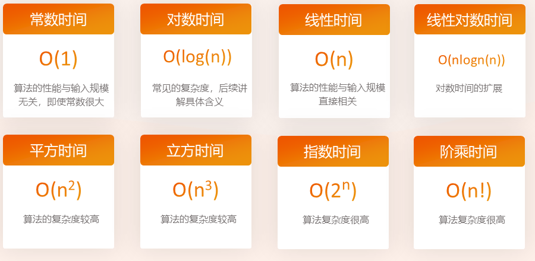
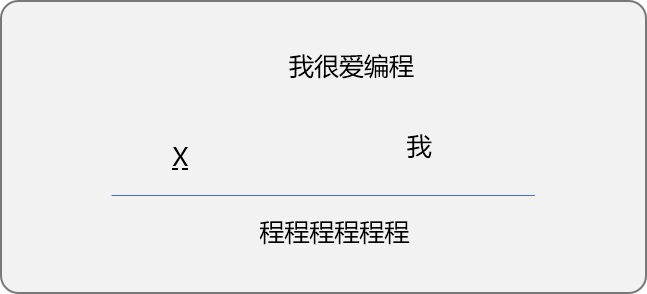
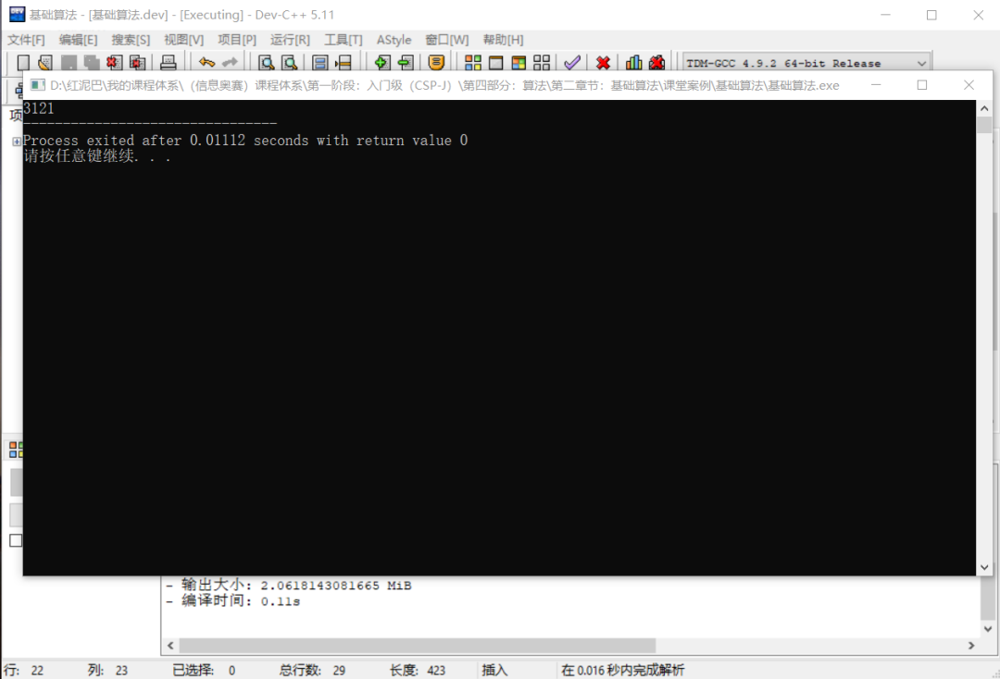

# C++不知算法系列之集结基础算法思想


## 1. 前言

`数据结构`和`算法`是程序的 `2` 大基础结构，如果说`数据`是程序的汽油，`算法`则就是程序的发动机。

**什么是数据结构？**

指`数据`之间的逻辑关系以及在计算机中的存储方式，数据的存储方式会影响到获取数据的便利性。

现实生活中，如果把春夏秋冬的衣物全部堆放在一起，当需要某一季节的衣服时，寻找起来是困难的。如果分门别类、有条理地存放，则寻找起来会方便很多。同理，编写程序时，如果对程序所依赖的数据有条理、易于查找的方式进行存储，则在处理数据时，可以提升程序的整体性能。

数据结构准确说是一个空间管理概念，同样的数据使用不同的数据结构时，对程序会有空间度上的影响。

**什么是算法？**

算法是解决问题的思路或流程，算法与具体的计算机语言无关，但算法一定能通过计算机语言实现。

理解算法，可以从 `2` 个角度：

- **广义角度：** 算法是指处理数据时，使用的解决思路。只要能达到数据处理目的，任一解决思路都可认为是算法，也就是说程序中无处不算法。
- **狭义角度：** 对各种解决问题的经验和思路进行总结、归纳，形成算法体系或算法思想。

**算法与数据结构的关系？**

算法不应该仅针对于特定的数据结构，应该针对特定类型的问题。算法是思路，数据结构是算法实施对象。设计优秀的数据结构对算法的性能会有质的提升。

**算法的特性：**

- **有穷性**：算法必须能在有限时间内完成。
- **确定性**：对相同的输入必须得到相同的结果。
- **可行性**：即算法应该可以通过具体的语言得以实现。
- **输入**：一个算法可以有`0`个或多个输入。
- **输出**：算法必须有结果，也就是必须有一个或多个输出。

**算法的描述：**

- **自然语言**。因受限于语言的岐义性，自然语言描述算法同样会出现如此问题。
- **流程图**。使用标准的图形化语言描述，易于理解和交流。
- **使用计算机语言**。算法的最终归缩。

**算法性能分析：**

可以使用`时间复杂度`和`空间复杂度`评价算法的性能高低。`2` 者均通过大`O`表示描述，大 `O` 时间复杂度实际上不具体表示真正的执行时间，而是表示代码执行时间随数据规模增长变化的趋势。所以也叫渐进时间复杂度，简称时间复杂度。

**时间复杂度**：指算法需要消耗的时间资源。使用大`O`法计算时间复杂度的原则：

- 只关注循环执行次数最多的一段代码，省去最高阶项前面的常量、低阶、系数。
- 如果运行时间是常数量级，则用常数`1`表示。
- 加法法则：总复杂度等于量级最大的那段代码的复杂度。分析每一部分时间复杂度，取量级最大的作为整段代码复杂度。
- 乘法法则：嵌套代码复杂度等于嵌套内外代码复杂度的乘积。

常见时间复杂度：



**空间复杂度：**空间复杂度也称渐进空间复杂度，表示算法的存储空间与数据规模之间的增长关系，**算法在运行过程中临时占用存储空间大小的量度**。

**常见的空间复杂度：**

- 常量空间：当算法的存储空间大小固定，和输入规模没有直接的关系时，空间复杂度记作`O(1)`。
- 线性空间：当算法分配的空间是一个线性的集合（如数组），并且集合大小和输入规模`n`成正比时，空间复杂度记作`O(n)`。
- 二维空间：当算法分配的空间是一个二维数组集合，并且集合的长度和宽度都与输入规模`n`成正比时，空间复杂度记作`O(n^2)`
- 递归空间：计算机在执行递归程序时，会专门分配一块内存，用来存储“方法调用栈”执行递归操作所需要的内存空间和递归的深度成正比。如果递归的深度是`n`，那么空间复杂度就是`O(n)`。纯粹的递归操作的空间复杂度也是线性的。

## 2. 常见算法思想

### 2.1 穷举算法思想

`穷举算法`也称为`枚举算法`或`暴力破解法`，是一种`原始算法`。

**什么是`原始算法`?**

要了解`原始算法`的概念，就需要理解计算机的思维模式。

计算机本质是一台`无意识`、`无经验`、`无知识`积累的冰冷机器，它仅有基本的运算能力和判断能力。当然它还有一个人类无法比拟的强项，运算速度非常快。

**人类思维和计算机思维的区别**

比如，请找出数列`[1,2,3,4,5]`中哪 `2` 个数字相加等于 `5`。人类思维是直观性学习思维，可以直接给出答案，计算机不行。

计算机采用的是`基本运算`加`判断`的方案。先把`1`和`2`相加然后判断，如果不是，继续 把`1`和 `3`相加再判断……

这种思维我们称为`穷举思维`或`暴力思维`。

```cpp
#include <iostream>
using namespace std;
int main(int argc, char** argv) {
 int nums[] = {1, 2, 3, 4, 5};
 for(int i=0; i<5; i++) {
  for(int j=0; j<5; j++) {
   if (nums[i] != nums[j] && (nums[i] + nums[j] )== 5) {
    cout<<nums[i]<<"+"<<nums[j]<<"="<<nums[i] + nums[j]<<endl;
   }
  }
 }
 return 0;
}
```

当数列中的数字很少的时候，人类的思维有优势，当数据量很大的时候，计算机虽然采用的是笨拙的穷举思维，但是，因处理速度快，反而要远远快于人类计算出来。

本质上讲，计算机是无思维的，或者说计算机只会`穷举`，所以说，算法的本质都是`引导性`的。

> **什么是引导性？**
>
> 就是你问它，它摇头或点头，你根据它的点头或摇头，继续问，它继续点头或摇头，直到得到你想到的答案。

**穷法算法的思想：在一个指定的数据范围之内，通过不停地判断直到查找到正确的答案。**

现根据`穷举算法`的思路解决一个数学中常见的`猜数字`题目。

如下图，每一个中文汉字表示一个数字，请找出每一个汉字所对应的数字。



**穷举流程：**

- **确定数字范围：** 如果要让整个表达式有意义，则`我`和`程`字所对应的数字不能是 `0`。所以`我`和`程`字的数字范围应该是 `1~9`之间，其它的数字范围可以是 `0~9`之间。
- **初始每一个汉字所对应的数字，** 然后套用表达式进行计算，如果计算结果符合要求，则宣布查找到，否则，更改每一个汉字所对应的数字。

**编写实现：**

```cpp
#include <iostream>
#include <cmath>
using namespace std;
int main(int argc, char** argv) {
// 为 我很爱编程 中的每一个汉字初始数字起始边界
 int wo = 1;
 int hen = 0;
 int ai = 0;
 int bian = 1;
 int chen = 1;
 int count = 0;
 int  result = 0;
 int num1=0;
 for (wo=1; wo<10; wo++ ) {
  for (hen=0; hen<10; hen++ ) {
   for (ai=0; ai<10; ai++ ) {
    for (bian=1; bian<10; bian++ ) {
     for (chen=1; chen<10; chen++ ) {
      result = chen * pow(10, 5) + chen * pow(10, 4) + chen * pow(10, 3) + chen * pow(10, 2) + chen * pow(10, 1) + chen;
      num1 = wo * pow(10, 4) + hen * pow(10, 3) + ai * pow(10, 2) + bian * pow(10, 1) + chen;
      count += 1;
      if (num1 * wo == result) {
       cout<<wo<<hen<<ai<<bian<<chen<<endl;
       cout<<count<<endl;
       break;
      }
     }
    }
   }
  }
 }
 return 0;
}
//输出结果：79635
```

上述代码为典型的`穷举算法`，代码中添加了一个计数器，用来统计最终计算多少次，仅为了观察。

**穷举算法的结构有一个较大的特点，往往会出现循环语法结构层层嵌套。**

在此基础上思考，是否存在优化方案，可以减少循环次数。

题目中还有一个隐式条件，`我很爱编程`中的每一个汉字所对应的数字不能相同。可以把这条件加入到上述代码中。

```cpp
#include <iostream>
#include <cmath>
using namespace std;
int main(int argc, char** argv) {
// 为 我很爱编程 中的每一个汉字初始数字起始边界
 int wo = 1;
 int hen = 0;
 int ai = 0;
 int bian = 1;
 int chen = 1;
 int count = 0;
 int  result = 0;
 int num1=0;
 for (wo=1; wo<10; wo++ ) {
  for (hen=0; hen<10; hen++ ) {
   if (hen == wo)
    continue;
    for (ai=0; ai<10; ai++ ) {
     if (ai == hen or ai == wo)
      continue;
      for (bian=1; bian<10; bian++ ) {
       if (bian == ai or bian == hen or bian == wo)
        continue;
        for (chen=1; chen<10; chen++ ) {
         if (chen == bian or chen == ai or chen == hen or chen == wo)
          continue;
          result = chen * pow(10, 5) + chen * pow(10, 4) + chen * pow(10, 3) + chen * pow(10, 2) + chen * pow(
                       10, 1) + chen;
         num1 = wo * pow(10, 4) + hen * pow(10, 3) + ai * pow(10, 2) + bian * pow(10, 1) + chen;
         count += 1;
         if (num1 * wo == result) {
          cout<<wo<<hen<<ai<<bian<<chen<<endl;
          cout<<count<<endl;
          break;
         }
        }
      }
    }
  }
 }
 return 0;
}
```

从 `2` 次代码的运行结果可知，循环次数减少了 `43763`次。虽然减少了循环次数，因没有从本质上改变算法结构，所以说还是最原始的`穷举算法`思路。

### 2.2  试探算法

试探算法本质是穷举算法，试探表现在，问题中没有明确的求解范围，需要通过试探方式确定范围。

如下面的问题描述：

`A、B、C、D、E`五个人在某天夜里合伙去捕鱼，到第二天凌晨时都疲惫不堪，于是各自找地方睡觉。日上三杆，`A`第一个醒来，他将鱼分为五份，把多余的一条鱼扔掉，拿走自己的一份。`B`第二个醒来，也将鱼分为五份，把多余的一条鱼扔掉，保持走自己的一份。`C、D、E`依次醒来，也按同样的方法拿走鱼。问他们合伙至少捕了多少条鱼？

问题分析：

- 假设一共捕获了 `n` 条鱼。除了可以确定 `n` 一定是正整数外， 其范围是不知的。但是，根据问题描述可知  `n-1`是 `5` 的倍数。这是本题的基础过滤条件。
- `A`拿走鱼后，`B`所看到的鱼的数量应该是 `n=(n-1)-(n-1)/5`。 更新 `n`后，`n-1`的值同样是 `5` 的倍数。
- 如此一至到 `E`，`n`的值还是满足 `n-1`是 `5` 的倍数。也就是一个数字经过 `5` 次分割时，减一后都是 `5` 的倍数。
- 可以根据知识思维，判断出 `n` 最小值是 `6`。穷举时，从 `6`开始一至向上查找，向上的界限是多少，这里就需要试探。

```cpp
#include <iostream>

using namespace std;
int main(int argc, char** argv) {
    //初始试探的上限为 1000
 int upNum=1000;
    //是否继续试探
 bool isCon=true;
 while(isCon) {
        //试探的下限从 6 开始
  for (int i=6; i<upNum; i++) {
   int n=i;
   int j=0;
             //检查 n 是否经过 5 次分割后数字还是满足要求
   for(; j<5; j++) {
    if (  (n-1) % 5==0    ) {
                      //分
     n= (n-1) - (n-1) / 5;
    } else {
     break;
    }
   }
   if(j==5) {
                 // n 中的数字满足问题描述
    cout<<i;
                  //不需要再继续试探
    isCon=false;
    break;
   }
  }
        //试探的步长值为 1000 
  upNum+=1000;
 }
 return 0;
}
```

输出结果：



会不会出现无限试探，如果出现这个问题只有 `2` 种可能：

- 算法设计有问题。
- 问题描述本身无解。

### 2.3 递推算法思想

计算机的思维本质是穷举。但是，人的思维是知识性、探索性思维，可以在解决问题时，发现问题中的规律，并通过计算机语言告诉计算机，这样可以在计算时绕过一些不必要的计算。

> 研究算法的本质就是通过发现数据间的规律、减少穷举的次数。

**什么是递推算法？**

**简单讲，不断地利用已知信息推导出最终结果。显然，已知信息和最终结果数据之间一定要存在某些内在联系或规律。**

递推算法又分为`顺推法`和`逆推法`。

- **顺推法：**从已知条件出发，逐步推算出所需要的结果。
- **逆推法：**从已知的结果出发，用迭代式逐步推算出问题开始，逆推法的本质就是逆向思维。

如下通过案例分别介绍`顺推法`和`逆推法`。

#### 2.3.1 顺推算法

**问题描述：斐波拉契数列**

数列` [1,1,2,3,5,8,13,21,34,55,……]`就是一个符合`斐波拉契`关系的数列。

斐波拉契数列特点：

- 数列中的第 `1`、`2` 位置的数字是 `1` ，这是**已知信息**。
- 从第 `3` 个位置开始，其值为前面 `2` 个数字相加的结果。 知道了第 `3` 个位置的值，也将知道第 `4` 个位值，依此类推，可以求解出任何位置的数字。

```cpp
#include <iostream>
using namespace std;
int main(int argc, char** argv) {
 int num1 = 1;
 int num2 = 1;
 int num3=0;
 for (int i=0; i<12; i++) {
  // 推导出第 3 个位置的数字
  num3 = num1 + num2;
  cout<<num3<<"\t";
  // 为计算后续数据做准备
  num1 = num2;
  num2 = num3;
 }
 return 0;
}
```

求解`斐波拉契`数列的方案就是典型的`顺推思维`。

如有数列`[1,4,10,22,46……]`，分析数列中前面几个数字的规律，输出数列的前 `20` 个数字。分析后可发现第 `1` 个位置的数字 `1`是已知信息，从第 `2` 个位置开始，其值和前一个值符合`2*x+2`的线性规律，所以也可以递推算法求解。

#### 2.3.2 逆推算法

下面通几个案例讲解逆推算法的基本思想。

**猴子吃桃问题：**

有一只猴子，第 `1` 天摘了若干桃子，吃了桃子的一半后又吃了一个，第 `2` 天也是吃了桃子一半后再吃了一个……如此类推，到第 `10` 天时，还剩余 `1` 只桃子。请问猴子第 `1` 天摘了多少只桃子。

**分析：**

- 可以使用`逆推算法`，也就是我们经常讲的逆向思维解决猴子吃桃问题。
- 第 `10` 天还剩余 `1` 只桃子，可以看成是**已知信息**，已知信息属于结果信息。
- 求解第 `1` 天的桃子总量，需求解的是开始问题。

**找出数据之间的关系：**

- 第 `10` 有 `1` 个桃子，第 `10` 天的这 `1` 个桃子是取第 `9` 天桃子的一半减一个剩余的。
- 前一天的桃子除以 `2` 减 `1` 等于后 `1` 天的桃子，或者说，前 `1` 天的桃子等于（后 `1` 天的桃子加 `1`）乘以 `2`。

有了数列之间的关系，编码就很容易了。

```cpp
#include <iostream>
using namespace std;
int main(int argc, char** argv) {
// 第 10 天的桃子数，也是已知条件
 int num = 1;
 for(int i=0; i<9; i++) {
  // 向第 1 天推进
  num = (num + 1) * 2;
 }
 cout<<num;
 return 0;
}
```

**类似的问题还有很多：**如猜年龄问题。

有 `5` 个小孩子，问第 `1` 个小孩子的年龄是多少？他说他是第 `2` 个小孩子的年龄加 `2` 岁。

问第 `2` 个小孩子的年龄时，他说他是第`3`个小孩子的年龄加`2`岁。

问第`3`个小孩子的年龄时，他说他是第 `4`个小孩子年龄加`2` 岁。

问第 `4` 个小孩子年龄时，他说他是第 `5` 个小孩子的年龄加`2` 岁。

问第 `5`个小孩子的年龄时，他说他的年龄是` 6`岁，求解每一个小孩子的年龄。

这个问题也是典型的逆推问题。第 `5` 个小孩子的年龄是已知的，而且知道与前一个小孩子年龄的关系**前一个小孩子的年龄=后一个小孩子年龄+2**。满足数学上的线性函数关系。

一层层回推就能计算出第 `1` 个小孩子的年龄是：`14`岁。

```cpp
#include <iostream>
using namespace std;
int main(int argc, char** argv) {
int age = 6;
for(int i=4;i>0;i--){
 age = age + 2;
}
cout<<age;
return 0;
}
```

上述问题虽然简单，但能很好地描述递推算法的思想。

### 2.4 递归算法

具体解决问题时，总是一种算法借鉴另一种算法，或一个算法中融入另一种算法。算法之间互相交织、迭代而诞生出新的算法。

前文所说，`穷举`才是计算机的本质，其它算法无非是通过分析问题、发现规律、减少算法的实施过程中的次数。

**什么是递归算法？**

通过不停调用`函数`本身从而达到解决问题的目地。

现实生活中经常会遇到的问题，我要找到小王的电话号码，可以帮助理解递归过程。

想知道朋友`小王`的电话号码，先找到朋友`小李`，`小李`说他也没有，但是他会帮问问`小张`,`小张`说他也没有，他会问问`小胡`，小胡说他知道。

这里面包括 `2` 条线。

- **递进线：**`我`-（问）->`小李`-(问)->`小张`-（问）->`小胡`(结果)。
- **回溯线：**小胡-(结果)->小张-(结果)->小李-(结果)->我。

递归算法的特点：

- 通过`递进线`寻求帮助。递推线的最终必须有能得到帮助的时候（如最后小胡知道小王的电话号码），否则会成为死结。表现在编码实施过程中需要有调用终止的时候。
- 通过`回溯线`求解出原始问题。

前面的`斐波拉契数列`也可以使用递归算法解决。比如说，想知道在第 `12` 位置的数字是多少。

- **递进线：**求数列第 `12`位置的值，求助于第 `11`位置的值，然后再求助于第 `10`的值， 一至求助到第 `1`,`2`位置。
- **回溯线：**通过回溯求解出原始问题。

```cpp
#include <iostream>
using namespace std;
int fb (int pos) {
 if (pos == 1 || pos == 2)
  // 求助的终点
  return 1;
 // 求助
 return fb(pos - 1) + fb(pos - 2);
}
int main(int argc, char** argv) {
 int res = fb(12);
 cout<<res;
 return 0;
}
```

求解年龄的问题也可以使用递归算法实现。

```cpp
int get_age(int number) {
 if (number == 5)
  return 6;
 return get_age(number + 1) + 2;
}
```

递归算法可以用于 `2` 类问题的求解：

- 替代循环语法结构。一个函数就是一个逻辑实现的封装，反复调用自己，则可认为重复执行相同逻辑。

  > 递归比循环的性能低下。能使用循坏解决的问题就不要使用递归。

- 一个看似复杂的问题，其实最终答案归结到一个小问题上，如求阶乘、斐波拉契之类的问题。

  > 递归更多应用于此类型问题的求解。

`斐波拉契`和`求年龄`的问题即可以使用前文的`递推算法思想`实现，也可以使用`递归`算法实现。说明：

- 解决一个问题不能拘泥一种方案。

- 算法与算法之间会有重叠、借鉴、融合之处。

  > 任何语言都提供有递归调用方式。可以利用递归的特点对数据进行处理。

递归的底层依赖于栈数据结构，递归的具体细节本文不做太多讲解，本文意在概括常见算法。

**在算法理论中，回溯本身就是一种算法方案，可独立解决很多实际问题。**

回溯法是计算机解题中常用的算法，很多问题无法根据某种确定的计算法则来求解，但可以利用回溯的技术求解。回溯法是搜索算法中的一种控制策略。

**它的基本思想是：**

从问题的某一种状态（一般是默认的初始状态）出发，搜索从这种状态出发所能达到的所有“状态”，当一条路走到“尽头”的时候，先退几步，接着从另一种可能的“状态”出发，继续搜索，直到所有的“路径”都尝试过。

回溯思路在我们在现实生活中无处不在，对此体现的较具体的就是下棋，还有一个典型的应用就是走迷宫。

**因回溯已经内置在递归算法中，一般需要使用回溯解决的问题，都会用到递归。**

### 2.5 分治思想

将一个计算复杂的问题分为若干子问题来进行求解，然后合并各个小问题得到原始问题的最终求解。

**分治算法的特点：**

- 原始问题和分解出来的子问题的**问题形式相同，只是数据规模不相同**，也就是说无论是原始问题，还是分解后的子问题，都在解决同一个问题。
- 分解出来的子问题具有完全独立性，子问题是原始问题的缩影。
- 使用分治算法时，不一定都需要合并子问题。如二分搜索算法，是分治算法的实现，但不需要合归。

分治算法实时有 `2` 个过程：

- **分治：**原始问题能分解成若干较小的相同问题，子问题因规模较小，更容易求解到答案。
- **合并：**合并子问题得到原始问题的求解。

因子问题与原始问题相同，一般会使用递归算法多次迭代。

如`二分查找`以及`快速排序`，都是分治的思想的应用。

**二分的迭代实现：**

```cpp
#include <iostream>
using namespace std;
//二分查找算法
int binary_find(int nums[],int key) {
 // 初始左指针
 int l_idx = 0;
 // 初始在指针
 int r_ldx = sizeof(nums)/4 - 1;
 while (l_idx <= r_ldx) {
  // 计算出中间位置
  int mid_pos = (r_ldx + l_idx) ; // 2
  // 计算中间位置的值
  int mid_val = nums[mid_pos];
  // 与关键字比较
  if (mid_val == key)
   // 出口一：比较相等，有此关键字，返回关键字所在位置
   return mid_pos;
  else if (mid_val > key)
   // 说明查找范围应该缩少在原数的左边
   r_ldx = mid_pos - 1;
  else
   l_idx = mid_pos + 1;
 }
 // 出口二：没有查找到给定关键字
 return -1;
}
int main(int argc, char** argv) {
 int   nums[7] = {1, 3, 4, 5, 8, 10, 12};
 int key = 3;
 int pos = binary_find(nums, key);
 cout<<pos;
 return 0;
}
```

**二分查找的递归实现：**

```cpp
#include <iostream>
using namespace std;
//递归实现二分查找
int binary_find_dg(int nums[],int key,int l_idx,int r_ldx) {
 if (l_idx > r_ldx)
  // 出口一：没有查找到给定关键字
  return -1;
 // 计算出中间位置
 int mid_pos = (r_ldx + l_idx) ;// 2
 // 计算中间位置的值
 int mid_val = nums[mid_pos];
 // 与关键字比较
 if (mid_val == key)
  // 出口二：比较相等，有此关键字，返回关键字所在位置
  return mid_pos;
 else if (mid_val > key)
  // 说明查找范围应该缩少在原数的左边
  r_ldx = mid_pos - 1;
 else
  l_idx = mid_pos + 1;
 return binary_find_dg(nums, key, l_idx, r_ldx);
}
int main(int argc, char** argv) {
 int   nums[] = {1, 3, 4, 5, 8, 10, 12};
 int   key = 8;
 int   pos = binary_find_dg(nums, key,0,6);
 cout<<pos;
 return 0;
}
```

本文意在总结算法，快速排序的代码就不上了。

### 2.6 贪心算法思想

贪心算法总是做出在当前看来最好的选择，并从不整体最优考虑，只是局部最优秀。虽然贪心算法总是从局部最优求解，但有时也有可能让最终求解也是最优的。

**贪心算法的特点：**

- 不能保证最后的解是最优的。
- **不能用来求最大或最小解问题。**
- 只能求满足某些约束条件的可行解。

**贪婪算法最典型的案例：找零钱。**

**问题描述：**在超市购物时，收银员找零钱时，如何使找回零钱的纸币数最少。

贪心算法的思路是从最大面值的币种开始，按递减的顺序考虑各种币种。也就是先尽量用大面值的币种，当不足大面值币种的金额时才去考虑下一种较小面值的币种。

> 这里的贪心表现在**最大可能使用最大金额的币种**。显然，贪心算法在此问题上是可行的。

**编码实现：**

假设人民币有 `100`、`50`、`20`、`10`、`5`、`2`、`1`、`0.5`、`0.1`几种面额，且数量无限，找零钱时，请尽量实现找给顾客的零钱所用到的币种的总数量最少。

```cpp
#include <iostream>
#include <map>
using namespace std;
int main(int argc, char** argv) {
// 币种
double bi_zhongs[] = {100, 50, 20, 10, 5, 2, 1, 0.5, 0.2, 0.1};
// 记录最终结果
map<double ,int> resMap;
int count=0;
//需要找的零钱
double lq_ = 68.9;
// 为了便于计算，扩大100倍
int lq = lq_ * 10;
for(int i=0; i<10; i++ ) {
 if (lq >= int( bi_zhongs[i] * 10 )) {
  // 计算张数
  count = lq / (bi_zhongs[i] * 10);
  resMap[bi_zhongs[i]] = int(count);
  // 余额
  lq = lq % (int( bi_zhongs[i] * 10));
 }
 if (lq == 0)
  break;
 }
// 输出每一种币种的数量
map<double ,int>::iterator begin= resMap.begin();
map<double ,int>::iterator end= resMap.end();
while(begin!=end) {
 cout<<begin->first<<":"<<begin->second<<"\t";
 begin++;
}
return 0;
}
//输出结果：
//{50: 1, 10: 1, 5: 1, 2: 1, 1: 1, 0.5: 1, 0.2: 2}
```

## 3. 总结

本文介绍了常见的几种基础算法 ，除些之外，还有更多算法思想。如动态规划、摸拟思想……限于篇幅原因，本文中即不一一罗列，也不深研算法内在细节。

后续会为某些经典算法单独开文，详细介绍其算法的微妙之处。万变不离其宗，研究算法时即要做到能对各种算法独立分析，又要做到融合贯通。
