# C++ 排序从玩转冒泡算法开始


## 1. 前言

所谓排序，就是把**数据群体**按**个体数据的特征**按从大到小或从小到大的顺序存放。

排序在应用开发中很常见，如对商品按价格、人气、购买数量等排序，便于使用者快速找到数据。

常见的排序算法分为两大类：

- **比较类**：通过比较决定元素间的相对次序，因其时间复杂度不能突破`O(nlogn)`，也称为非线性时间比较类排序。具体又可分：

|  类型  |        名称        |
| :----: | :----------------: |
| 交换类 | 冒泡排序、快速排序 |
| 插入类 | 插入排序、希尔排序 |
| 选择类 |  选择排序、堆排序  |
| 归并类 |      归并排序      |

- **非比较类**：不通过比较来决定元素间的相对次序可以突破比较类排序的时间下界，以线性时间运行，因此称为线性时间非比较类排序，包括`计数排序`、`桶排序`和`基数排序`。

**什么是排序算法的稳定性？**

如果，排序前`a`等于`b`，`a`在`b`的前面，排序后`a`仍在`b`的前面，则称该排序算法稳定。 在如上表所列出的排序算法中，不稳定排序的有`快速排序、堆排序、选择排序、希尔排序`，其它为稳定性排序。

本文从冒泡排序的本质说起，对不同的排序算法不仅要做到代码结构上的理解，还要做到本质上的理解。并介绍与此相似的选择、插入、快速排序算法。

## 2. 冒泡排序算法

排序算法可以认为是在给定的数列中先找出最大值或最小值，然后在剩下的数据中再找最大值(或最小值)，重复此过程……最后让数列变得有序。

所以，可以暂时抛开冒泡排序，先从最大值算法聊起。

> **Tips：** 为了更好理解算法本质，在编写算法时不建议直接使用 `C++`中已经内置的算法函数。

求最大值，有多种思路，其中最常用的思路有：

- **摆擂台法**
- **相邻的两个数字比较法**

如现有一个数列 `nums=[3,1,8,9,12,32,7]`，请找出最大值（最小值）。

### 2.1  摆擂台法

算法思想：

- 找一个擂台，从数列中随机拎一个数字出来，站在擂台上充当老大。
- 老大不是说你想当就能当，要看其它的兄弟服不服。于是，其它的数字兄弟会一一登上擂台和擂台上的数字比较，原则是大的留下，小的离开。

> **Tips：**如果是找最大值，则是大的留下，小的离开。反之，如果是找最小值，则是小的留下，大的离开。

- 你方唱罢我登场。最后留在擂台上的就是真老大了。

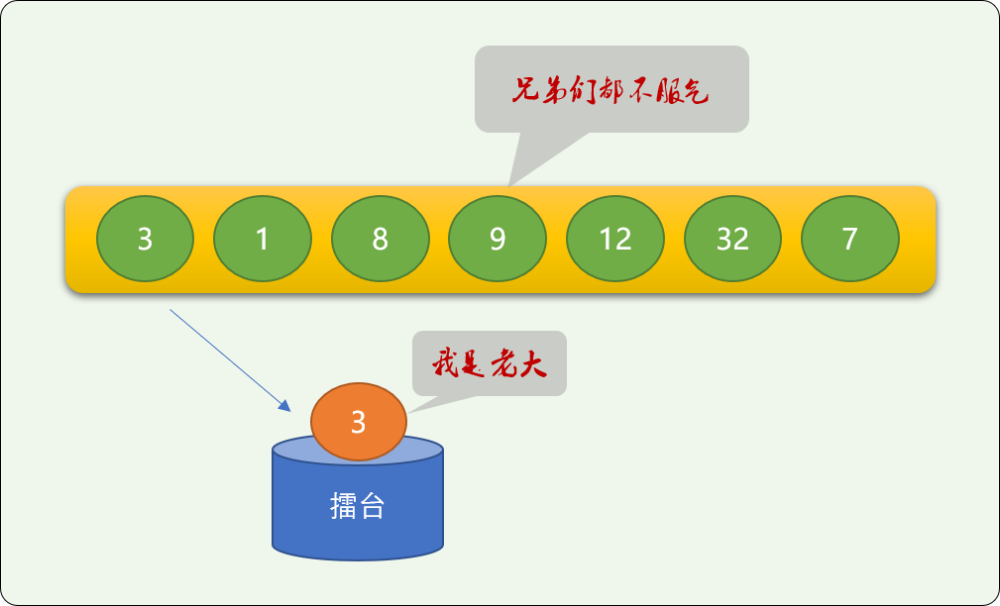

```cpp
#include <iostream>
using namespace std;
int main(int argc, char** argv) {
 int nums[] = {3, 1, 8, 9, 12, 32, 7};
 // 第一个数字登上擂台
 int m = nums[0];
 // 其它数字不服气
 for (int i=1; i<sizeof(nums)/4; i++) {
  // PK 过程中，大的留在擂台上
  if (nums[i] > m)
   m = nums[i];
 }
 // 最后留在擂台上的就是最大值
 cout<<"最大值是:"<<m;
 return 0;
}
```

很简单，对不对，如果，找到一个最大值后，再在余下的数字中又找最大值，以此类推，结局会怎样？

最后可以让所有数字都排好序！可以认为这是基础排序的最基础思想，一路找着老大就排好序了。

在上面的代码上稍做改动一下，每次找到最大值后存入到另一个列表中。

```cpp
#include <iostream>
using namespace std;
int main(int argc, char** argv) {
    //原数列
 int nums[] = {3, 1, 8, 9, 12, 32, 7};
    //数列大小
 int size=sizeof(nums)/4;
    //存储有序的数列
 int sortNums[size]= {0};
    //标志原数列中已经找到的最大值
 bool flag[size]= {false};
 int j=0;
 for(; j<size-1; j++) {
  // 初始化擂台
  int m = 1<<31;
  int midx=-1;
  // 其它数字不服气
  for (int i=0; i<size; i++) {
   // PK 过程中，大的留在擂台上
   if (nums[i] > m && flag[i]==false) {
    m = nums[i];
    midx=i;
   }
  }
  // 依次找到的最大值存入新数组
  sortNums[j]=m;
  if(midx!=-1) {
             //已经找到的最大值不再参加下一次找最大值的活动
   flag[midx]=true;
  }
 }
    //找到最后一个
 for(int i=0; i<size; i++) {
  if(flag[i]==false) {
   sortNums[j]=nums[i];
  }
 }
    //输出
 for(int i=0; i<size; i++) {
  cout<<sortNums[i]<<"\t";
 }
 return 0;
}
'''
输出结果
[32, 12, 9, 8, 7, 3, 1]
'''
```

我们可以看到原数列中的数字全部都排序了。但是上述排序算法不完美：

- **另开辟了新空间**，增加了空间复杂度。
- 原数列的最大值找到后需要做标志，目的是不干扰余下数字继续查找最大值，算法略显繁琐。

能不能不开辟新空间，在原数列里就完成排序？

**当然可以。**

可以找到最大值就向后移！原数列从逻辑上从右向左缩小。

```cpp
#include <iostream>
using namespace std;
int main(int argc, char** argv) {
 int nums[] = {3, 1, 8, 9, 12, 32, 7};
 //数组长度
 int nums_len = sizeof(nums)/4;
 int nums_len_=nums_len;
 //最大值的位置
 int idx=-1;
 //最大值
 int m=0;
 for(int i=0; i<nums_len-1; i++) {
  // 第一个数字登上擂台
  m = nums[0];
  idx=0;
  for(int j=1; j<nums_len_; j++) {
   if (nums[j] > m) {
    m = nums[j];
    idx=j;
   }
  }
  // 最大值找到，移动最后，后面的数字前移
  for(int k=idx; k<nums_len_-1; k++) {
   nums[k]=nums[k+1];
  }
  nums[nums_len_-1]=m;
  // 这个很关键，缩小原数列的结束位置
  nums_len_ --;
 }
 //输出结果
 for(int i=0; i<nums_len; i++) {
  cout<<nums[i]<<"\t";
 }
 return 0;
}
```

**输出结果：**

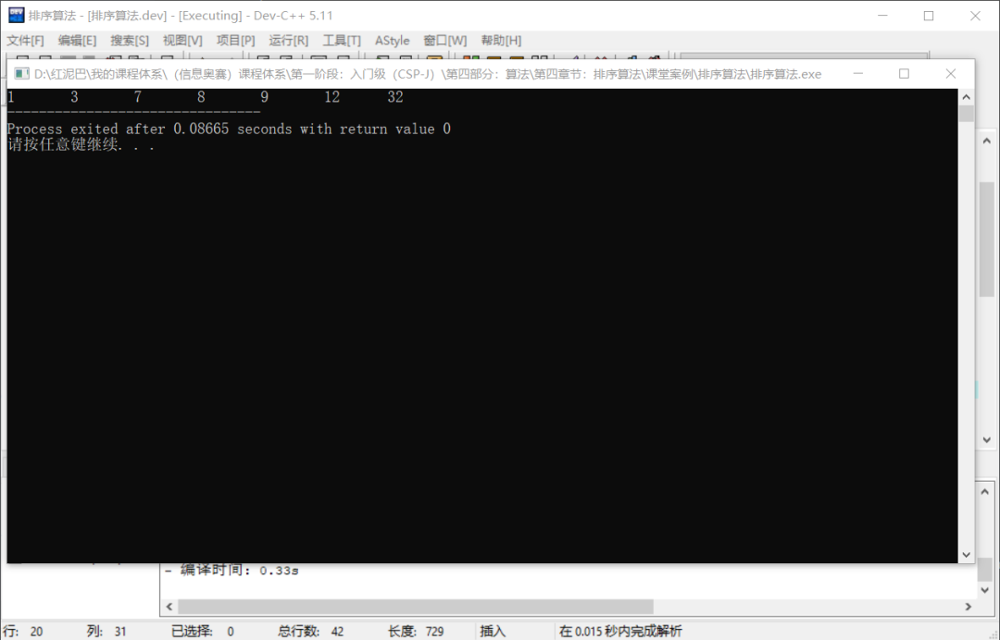

在原数列上面，上述代码同样完成了排序。

归根结底，上述排序的思路就是不停地找最大值呀、找最大值……找到最后一个数字，大家自然而然就排好序了。

所以算法结构中内层循环找最大值的逻辑是核心，而外层就是控制找呀找呀找多少次。

上述排序算法的时间复杂度=外层循环次数X内层循环次数，时间复杂度是 `O（n`2`）`。

### 2.2 相邻两个数字相比较

如果有 `7` 个数字，要找到里面的最大值，有一种方案就是每相邻的两个数字之行比较，如果前面的比后面的数字大，则交换位置，否则位置不动。上体育课的时候，老师排队用的就是这种方式，高的和矮的交换位置，一直到不能交换为此。

```cpp
#include <iostream>
using namespace std;
int main(int argc, char** argv) {
 int nums[] = {3, 1, 8, 9, 12, 32, 7};
 int size=sizeof(nums)/4;
 int temp=0;
 for(int i=0;i<size-1;i++){
  if( nums[i]>nums[i+1] ){
   temp=nums[i];
   nums[i]=nums[i+1];
   nums[i+1]=temp;
  }
 } 
    cout<<"最大值:"<<nums[size-1]; 
 return 0;
}
'''
输出结果
32
'''
```

上述代码同样实现了找最大值。

和前面的思路一样，如果找了第一个最大值后，又继续在剩下的数字中找最大值，不停地找呀找，会发现最后所有数字也排好序了。

在上述找最大值的逻辑基础之上，再在外面嵌套一个重复语法，让找最大值逻辑找完一轮又一轮，外层重复只要不少于数列中数字长度，就能完成排序工作，即使外层重复大于数列中数字长度，只是多做了些无用功而已。

```cpp
#include <iostream>
using namespace std;
int main(int argc, char** argv) {
 int nums[] = {3, 1, 8, 9, 12, 32, 7};
 int size=sizeof(nums)/4;
 int temp=0;
   // 外层重复的 100 意味着找了 100 次最大值，这里只是说明问题，本质就是不停找最大值，显然，是用不着找100 次的
 for(int j=0; j<100; j++) {
  for(int i=0; i<size-1; i++) {
   //相邻 2 个数字比较 
   if( nums[i]>nums[i+1] ) {
    //如果前面的数字大于后面的数字，则交换 
    temp=nums[i];
    nums[i]=nums[i+1];
    nums[i+1]=temp;
   }
  }
 }
 //输出
 for(int i=0; i<size; i++) {
  cout<<nums[i]<<"\t";
 }
 return 0;
}
```

上面的代码就是冒泡排序算法实现。冒泡排序的本质就是找了一轮最大值，又继续找最大值的思路。可以对上述算法进行一些优化：

- 显然，找最大值的最多轮数是数列长度减 `1` 就可以了，`5` 个数字，前面 `4` 个找到了，自然大家就都排好序了。
- 已经找到的最大值没有必要再参与后继的找最大值中去。

```cpp
#include <iostream>
using namespace std;
int main(int argc, char** argv) {
    //省略……
 for(int j=0; j<size-1; j++) {
        for(int i=0; i<size-1-j; i++) {
          //省略……
    }
 return 0;
}
```

在学习冒泡排序算法时，不要被外层、内层循环结构吓住，核心是理解求最大值算法。上述冒泡排序算法的时间复杂度也是 `O（`n2`）`。

## 3. 选择排序算法

**选择排序算法是冒泡排序的变种，本质还是在找最大（小）值，**冒泡排序是一路比较一路交换，为什么要这样，因为不知道数列中哪一个数字是最大（小）值，所以只能不停的比较不停的交换。

选择排序有一个优于冒泡的理念，需要交换时才交换。

所以选择排序算法的问题就是**什么时候需要交换？**

选择排序先是假设第一个数字是最小值，然后在后面的数字里找有没有比这个假设更小的。不是说，找到一个小的就交换，因为有可能还有比之更小的，只有当后续所有数字找完后，再确定进行交换，

依然使用擂台算法实现找最大（小）值，找到后交换位置。

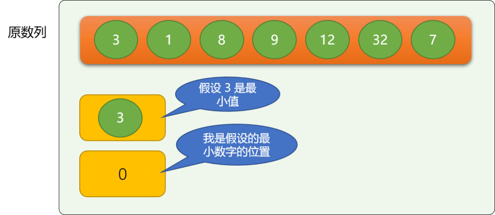

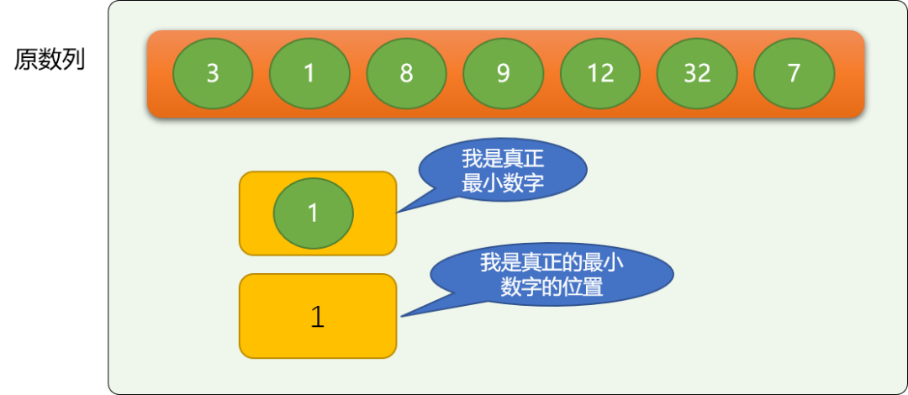

```c
#include <iostream>
using namespace std;
int main(int argc, char** argv) {
 int nums[] = {3, 1, 8, 9, 12, 32, 7};
 int size=sizeof(nums)/4;
 int temp=0;
 //假设的最小值位置
 int minIdx=j;
 for(int i=j+1; i<size; i++) {
  //比较
  if( nums[i] <nums[ minIdx] ) {
   //如果有更小的，记下位置
   minIdx=i;
  }
 }
 if(minIdx!=j) {
        //如果假设不成立
  temp=nums[j];
  nums[j]=nums[minIdx];
  nums[minIdx]=temp;
 }
 //输出
 for(int i=0; i<size; i++) {
  cout<<nums[i]<<"\t";
 }
 return 0;
}
```

以上代码就是选择排序的核心逻辑，实现了把最小的数字移动最前面。

再在上述逻辑基础上，继续在后续数字中找出最小值，并移动前面。多找几次就可以了！本质和冒泡算法还是一样的，不停找最大（小）值。

```c
#include <iostream>
using namespace std;
int main(int argc, char** argv) {
 int nums[] = {3, 1, 8, 9, 12, 32, 7};
 int size=sizeof(nums)/4;
 int temp=0;
    //多找几次
 for(int j=0; j<size; j++) {
  //假设的最小值位置
  int minIdx=j;
  for(int i=j+1; i<size; i++) {
   //比较
   if( nums[i] <nums[ minIdx] ) {
    //如果有更小的，记下位置
    minIdx=i;
   }
  }
  if(minIdx!=j) {
             //如果假设不成立
   temp=nums[j];
   nums[j]=nums[minIdx];
   nums[minIdx]=temp;
  }
 }
 //输出
 for(int i=0; i<size; i++) {
  cout<<nums[i]<<"\t";
 }
 return 0;
}
```


选择排序的时间复杂度和冒泡排序的一样 `O（`n2`）`。

## 4. 插入排序

打牌的时候，我们刚拿到手上的牌是无序的，在整理纸牌并让纸牌一步一步变得的有序的过程就是插入算法的思路。

**插入排序的核心思想：**

- 把原数列从**逻辑(根据起始位置和结束位置在原数列上划分)\**上分成\**前、后**两个数列，前面的数列是**有序**的，后面的数列是**无序**的。

  > 刚开始时，前面的数列（后面简称**前数列**）只有唯一的一个数字，即原数列的第一个数字。显然是排序的！

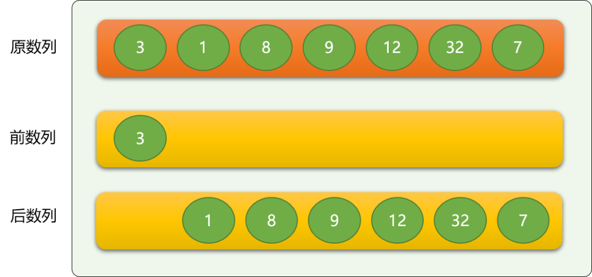

- 依次从**后数列**中逐个拿出数字，与前数列的数字进行比较，保证插入到前数列后，整个前数列还是有序的。

  > 如上，从后数列中拿到数字  1 ，然后与前数字的 3 进行比较，如果是从大到小排序，则 `1` 就直接排到 `3` 后面，如果是从小到大排序，则 `1` 排到 `3` 前面。
  >
  > **这里，按从小到大排序。**

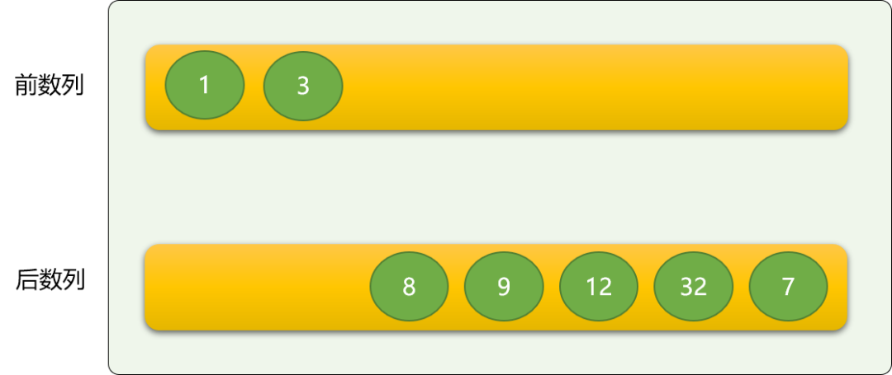

**插入排序的代码实现：** 这里使用前、后双指针的方案。

- 前指针用来在前数列中定位数字，方向是从右向左。
- 后指针用来在后数字中定位数字，方向是从左向右。

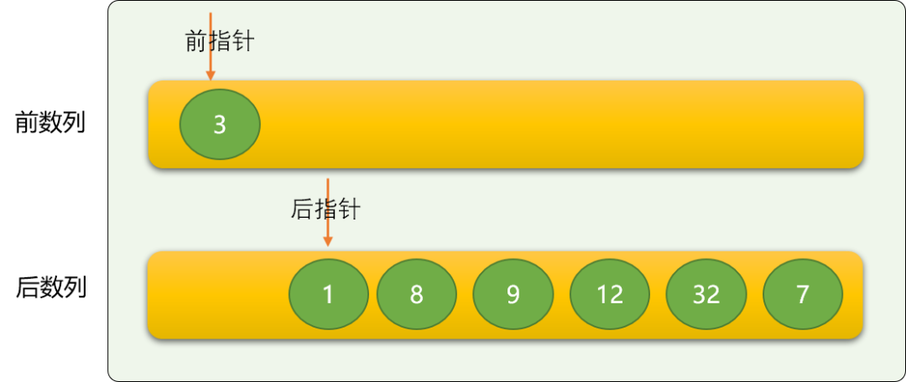

```cpp
#include <iostream>
using namespace std;
int main(int argc, char** argv) {
 int nums[] = {3, 1, 8, 9, 12, 32, 7};
 int size=sizeof(nums)/4;
 int tmp=0;
 int frontIdx=0;
 //后指针指向原数列的第 2 个数字,所以索引号从 1 开始
 for(int backIdx=1; backIdx<size; backIdx++ ) {
  // 初始，前指针和后指针的关系，
  frontIdx = backIdx-1;
  //临时变量，比较时，前数列的数字有可能要向后移位，需要把后指针指向的数字提前保存
  tmp = nums[backIdx];
  // 与前数列中的数字比较
  while (frontIdx >= 0 && tmp < nums[frontIdx]) {
   // 移位
   nums[frontIdx+1] = nums[frontIdx];
   frontIdx --;
  }
  if (frontIdx != backIdx-1)
   // 插入
   nums[frontIdx+1] = tmp;
 }
 //输出
 for(int i=0; i<size; i++) {
  cout<<nums[i]<<"\t";
 }
 return 0;
}
'''
输出结果
[1,3,7,8,9,12,32]
'''
```

上述代码用到了移位和插入操作，也可以使用交换操作。如果是交换操作，则初始时，前、后指针可以指向同一个位置。

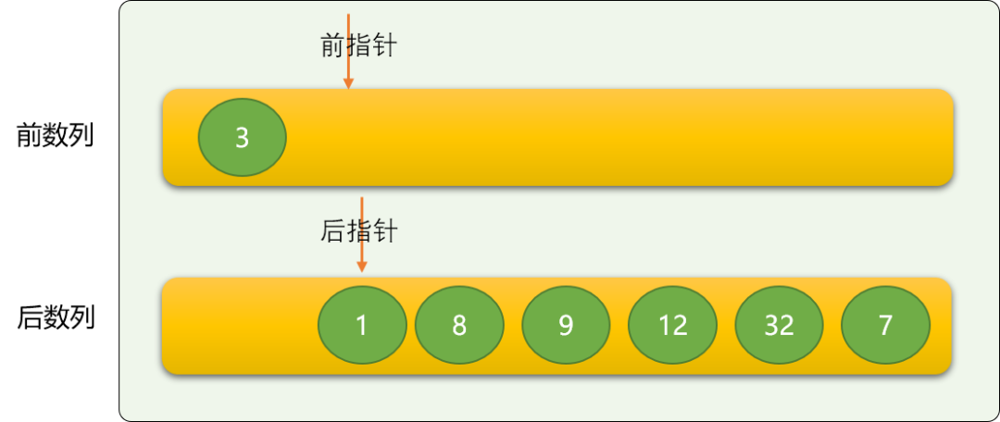

```c++
#include <iostream>
using namespace std;
int main(int argc, char** argv) {
 int nums[] = {3, 1, 8, 9, 12, 32, 7};
 int size=sizeof(nums)/4;
 int tmp=0;
 int frontIdx=0;
 //后指针指向原数列的第 2 个数字,所以索引号从 1 开始
 for(int backIdx=1; backIdx<size; backIdx++ ) {
  // 初始，前指针和后指针的关系，
  frontIdx = backIdx;
  while(frontIdx>=0 && nums[frontIdx]<nums[frontIdx-1] ){
     //交换
     tmp= nums[frontIdx];
     nums[frontIdx]=nums[frontIdx-1];
     nums[frontIdx-1]=tmp;
  }
 }
 //输出
 for(int i=0; i<size; i++) {
  cout<<nums[i]<<"\t";
 }
 return 0;
}
```

后指针用来选择后数列中的数字，前指针用来对前数列相邻数字进行比较、交换。和冒泡排序一样。

这里有一个比冒泡排序优化的地方，冒泡排序需要对数列中所有相邻两个数字进行比较，不考虑是不是有必要比较。

但插入不一样，因插入是假设前面的数列是有序的，所以如果后指针指向的数字比前数列的最后一个数字都大，显然，是不需要再比较下去，如下图中的数字 `8` 是不需要和前面的数字进行比较，直接放到前数列的尾部。

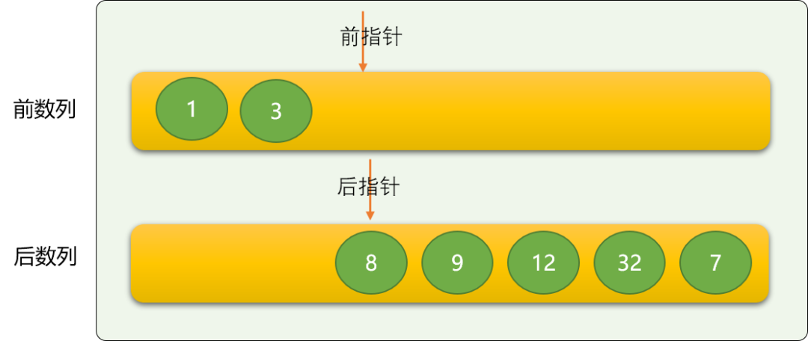

插入排序的时间复杂度还是 O(n2) 。

## 5. 快速排序

快速排序是一个很有意思的排序算法，快速排序的核心思想：

- **分治思想：** 当原问题无法直观一次性解决时，把大问题分解成相似的小问题。全局到局部逐步完善。

- **二分思想：** 在数列选择一个数字（**基数**）为参考中心，数列比基数大的，放在左边（右边），比基数小的，放在右边（左边）。

  第一次的二分后：整个数列在基数之上有了有序的轮廓，然后在对基数前部分和后部分的数字继续完成二分操作。

**这里使用左、右指针方式描述快速排序：**

- 已知的无序数列。


- 选择基数。这里选择第一个数字 `7` 作为基数。保存在临时变量 `tmp`中。声明 `2` 个变量 `left`（左指针）、`right（右指针）`，分别指向第一个数据和最后一个数据。

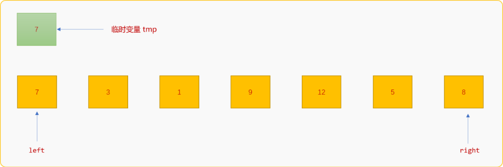

- 从 `right`位置开始扫描整个数列，如果 `right`位置的数字大于 `tmp`中的值，则继续向左移动。`right`指针直到遇到比 `tmp`中值小的数字，然后保存到 `left`位置。

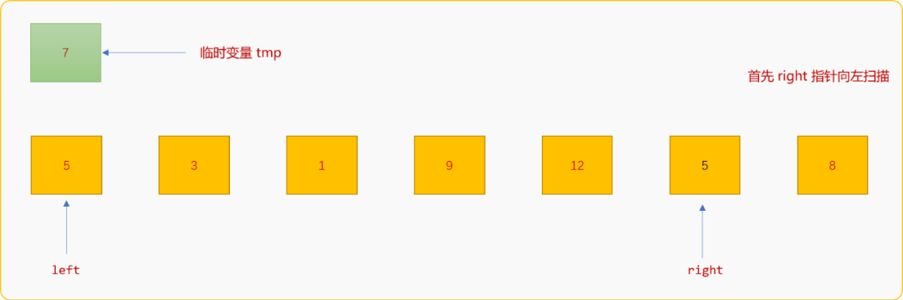

- 对`left`指针的工作要求：当所处位置的数字比`tmp`值小时，则向右边移动直到遇到比`tmp`值大的数字，然后保存至`right`。


- 重复上述过程，直到 `left`和`right`指针重合。

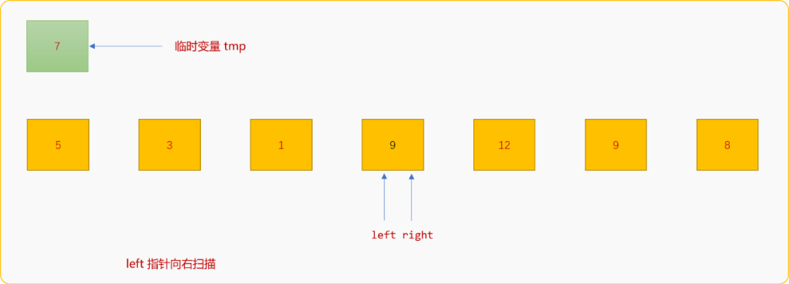

- 最后把`tmp`中的值复制到`left`和`right`指针最后所指向的位置。最终实现以数字`7`界定整个数列。

**如下是第一次二分代码：**

```cpp
#include <iostream>
using namespace std;
int nums[] = {7, 3, 1, 9, 12, 5, 8};
void quickSort(int left,int right) {
 //第一个数据作为基数
 int tmp=nums[left];
 while(left!=right) {
  while(left!=right && nums[right]>tmp) {
   //右指针向左移动
   right--;
  }
  //右指针位置数据放到左指针位置
  nums[left]=nums[ right];
  while(left!=right && nums[left]<tmp) {
   //左指针向右移动
   left++;
  }
  //左指针位置数据放到右指针位置
  nums[right]=nums[left];
 }
 //放置基数
 nums[left]=tmp;
}
int main(int argc, char** argv) {
 int size=sizeof(nums)/4;
 int left=0;
 //右指针，指向尾数据
 int right=size-1;
 quickSort(left,right);
 //输出
 for(int i=0; i<size; i++)
  cout<<nums[i]<<"\t";
 return 0;
}
```

**输出结果：**

```cpp
5,3,1, 7, 12, 9, 8 //和上面的演示流程图的结果一样。
```

**使用递归进行多次二分：**

```cpp
#include <iostream>
using namespace std;
int nums[] = {7, 3, 1, 9, 12, 5, 8};
//快速排序
void quickSort(int left,int right) {
 if(left>=right) {
        //出口
  return;
 }
    //备份
 int bakLeft=left;
 int bakRight=right;
 //第一个数据作为基数
 int tmp=nums[left];
 while(left!=right) {
  while(left!=right && nums[right]>tmp) {
   //右指针向左移动
   right--;
  }
  //右指针位置数据放到左指针位置
  nums[left]=nums[ right];
  while(left!=right && nums[left]<tmp) {
   //左指针向右移动
   left++;
  }
  //左指针位置数据放到右指针位置
  nums[right]=nums[left];
 }
 //放置基数
 nums[left]=tmp;
    //递归左边的数列
 quickSort(bakLeft,left-1);
    //递归右边的数列
 quickSort(left+1,bakRight);
}

int main(int argc, char** argv) {
 int size=sizeof(nums)/4;
 int left=0;
 //右指针，指向尾数据
 int right=size-1;
 quickSort(left,right);
 //输出
 for(int i=0; i<size; i++)
  cout<<nums[i]<<"\t";
 return 0;
}
```

输出结果：

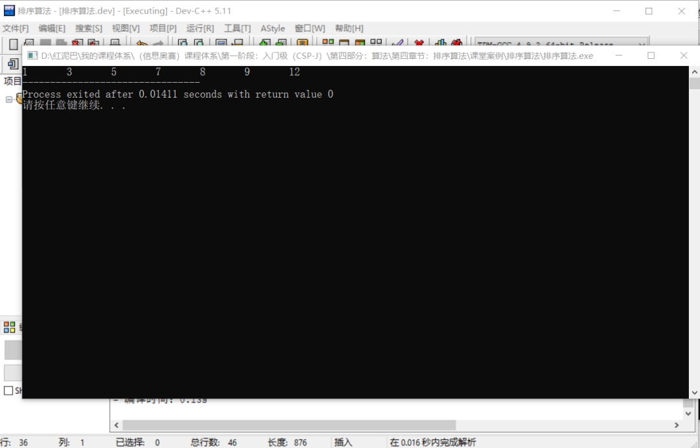

快速排序的时间复杂度为 `O(nlogn)`，空间复杂度为`O(nlogn)`。

## 6. 总结

除了冒泡、选择、插入、快速排序算法，还有很多其它的排序算法，冒泡、选择 、插入算法很类似，有其相似的比较、交换内部逻辑。快速排序使用了分治理念，可从减少时间复杂度。


