# C++ 不知算法系列之从希尔、归并排序算法中的分治哲学聊起

## 1. 前言

排序算法中，`冒泡`、`插入`、`选择`属于相类似的排序算法，这类算法的共同点：**通过不停地比较，再使用交换逻辑重新确定数据的位置。**

`希尔`、`归并`、`快速`排序算法也可归为同一类，它们的共同点都是建立在分治思想之上。把大问题分拆成小问题，解决所有小问题后，再合并每一个小问题的结果，最终得到对原始问题的解答。

> **Tips：** 通俗而言：化整为零，各个击破。

分治算法很有哲学蕴味：老祖宗所言 **合久必分，分久必合**，分开地目的是为了更好的合并。

**分治算法的求解流程：**

- **分解问题**：将一个需要解决的、看起很复杂 **`原始问题`** 分拆成很多独立的**`子问题`**，`子问题`与`原始问题`有相似性。
- **求解子问题**：子问题除了与原始问题具有相似性，也具有独立性，即所有子问题都可以独立求解。
- **合并子问题：**合并每一个子问题的求解结果最终可以得到原始问题的解。

下面通过深入了解`希尔排序算法`，看看`分治算法`是如何以哲学之美的方式工作的。

## 2. 希尔排序

讲解希尔之前，先要回顾一下插入排序。插入排序的平均时间复杂度，理论上而言和冒泡排序是一样的 `O（n`2`）`，但如果数列是前部分有序，则每一轮只需比较一次，对于 `n` 个数字的原始数列而言，时间复杂度可以达到 `O(n)`。

**插入排序的时间复杂度为什么会出现如此有意思的变化？**

- 插入排序算法的排序思想是尽可能**减少数字之间的交换次数**。
- 通常情形下，交换处理的时间大约是移动的 `3` 倍。这便是插入排序的性能有可能要优于冒泡排序的原因。

希尔排序算法本质就是插入排序，或说是对插入排序的改良。

**希尔算法的理念：让原始数列不断趋近于排序，从而降低插入排序的时间复杂度。当数列局部有序时，全局必然是趋向于有序。**

**希尔排序的实现流程：**

- 把原始数列从逻辑上切割成诸多个子数列。
- 对每一个子数列使用插入排序算法排序。
- 当所有子数列完成后，再对原数列进行最后一次插入算法排序。

希尔排序的关键在于如何切分子数列，切分方式可以有 `2` 种：

### 2.1 前后切分

如有原始数列=`[3，9，8，1，6，5，7]` ，采用前后分可分成如下图所示的 `2` 个子数列。

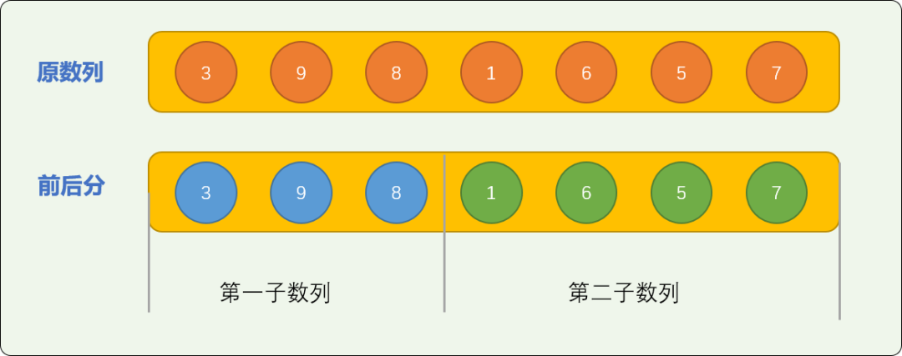

然后对前、后部分的数列使用插入算法排序。

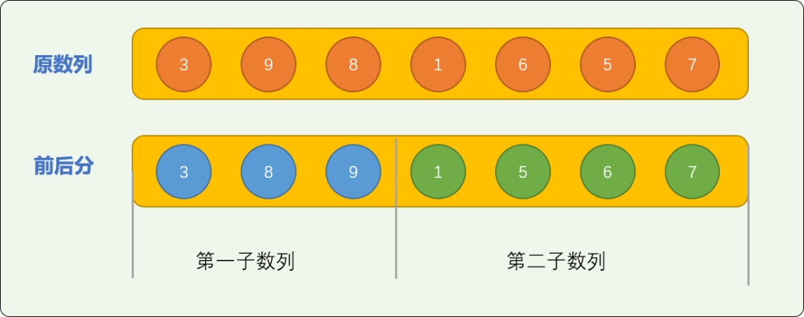


如上图所示，子数列排序后，要实现原始数列的最终有序，则后部分的数字差不多全部要以超车的方式，插入到前部分数字的中间，交换量较大。

理想的状态是数字整体有序，需要交换的次数不多。所以**前后分**这种一根筋的切分方式，对于原始问题的最终性能优化起不了太多影响。

### 2.2 增量切分

增量切分采用间隔切分方案，可能让数字局部有序以正态分布。

增量切分，需要先设定一个增量值。如对原始数列=`[3，9，8，1，6，5，7]` 设置切分增量为 `3` 时，整个数列会被切分成 `3` 个逻辑子数列。增量数也决定最后能切分多少个子数列。

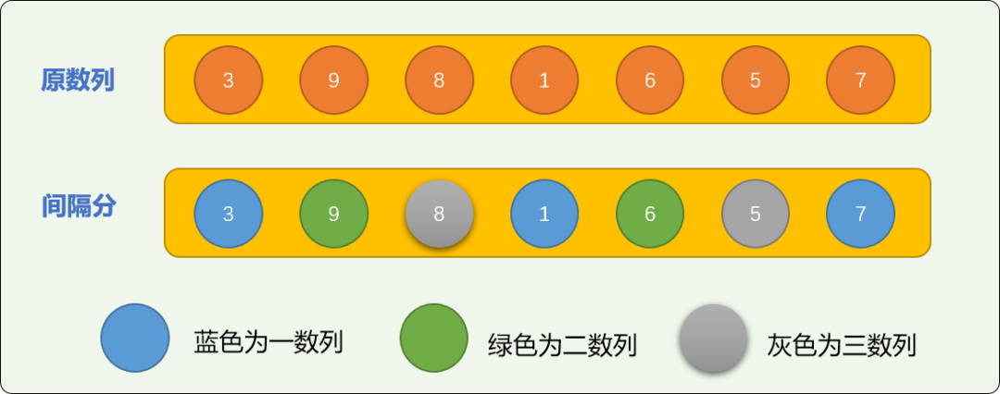


对切分后的 `3` 个子数列排序后可得到下图。


下面两张图是增量切分前后数字位置的变化图，可以看出来，几乎所有的数字都产生了位置变化 ，且位置变化的跨度较大。如数字 `9` 原始位置是 `1`，经过增量切分再排序后位置可以到 `4`，已经很接近 `9` 的最终位置 `6` 了。有整体趋于有序的势头，在此基础之上，再进行插入排序的的次数要少很多。

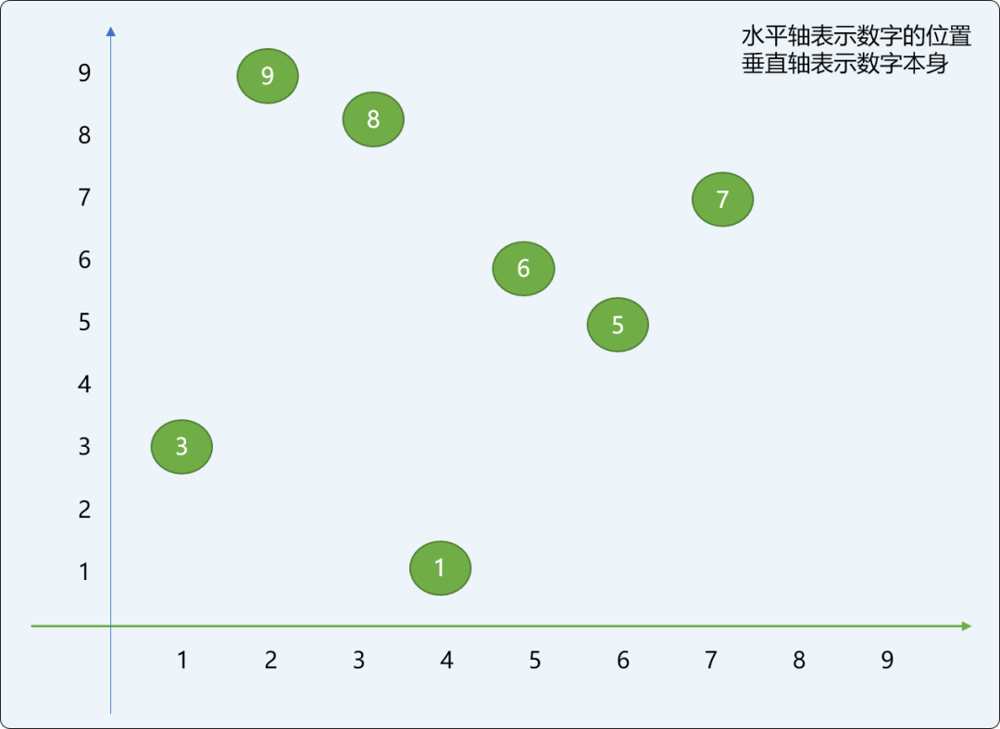


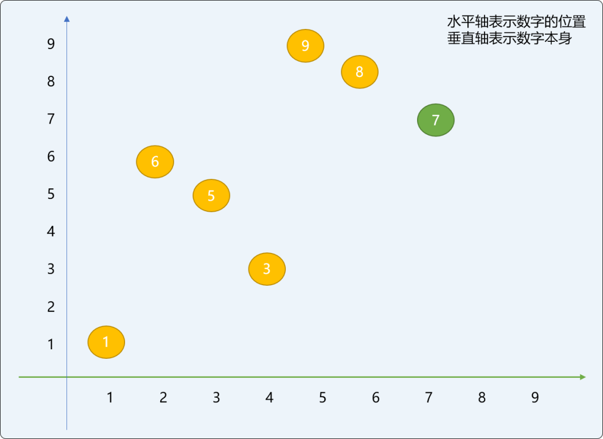


实现希尔排序算法时，最佳的方案是先初始化一个增量值，切分排序后再减少增量值，如此反复直到增量值等于 `1` （也就是对原数列整体做插入排序）。

> **Tips：**增量值大，数字位置变化的跨度就大，增量值小，数字位置的变化会收紧。

**编码实现希尔排序：**

```cpp
#include <iostream>
using namespace std;
// 插入排序
void insertSort(int nums[],int size, int start,int increment) {
//后指针指向原数列的第 2 个数字,所以索引号从 1 开始
for(int backIdx=start + increment; backIdx<size; backIdx+=increment) {
 // 初始，前指针和后指针的关系，
 int frontIdx = backIdx;
 while(frontIdx>=0 && nums[frontIdx]<nums[frontIdx-increment] ) {
  //交换
  int tmp=nums[frontIdx];
  nums[frontIdx]=nums[frontIdx-increment];
  nums[frontIdx-increment]=tmp;
  }
 }
}
// 希尔排序
void shellSort(int nums[],int size) {
 // 增量
 int increment=size/2;
 // 新数列
 while (increment > 0) {
  // 增量值是多少，则切分的子数列就有多少
  for(int start=0; start<increment; start++) {
   insertSort(nums,size, start, increment);  
  }
  // 修改增量值，直到增量值为 1
  increment = increment / 2;
 }
}
int main(int argc, char** argv) {
 int nums[] = {3, 9, 8, 1, 6, 5, 7};
 int size=sizeof(nums)/4;
 shellSort(nums,size);
 for(int i=0; i<size; i++ ) {
  cout<<nums[i]<<"\t";
 }
 return 0;
}
```

这里会有一个让人疑惑的观点：**难道一次插入排序的时间复杂度会高于多次插入排序时间复杂度？**

通过切分方案，经过子数列的微排序（因子数列数字不多，其移动交换量也不会很大），最后一次插入排序只需要在几个数字之间微调，甚至不需要。只要增量选择合适，时间复杂度可以控制 在 `O(n)` 到 O（n2）之间。完全是有可能优于单纯的使用一次插入排序。

## 3. 归并排序

归并排序算法也是基于分治思想。和希尔排序一样，需要对原始数列进行切分，但是切分的方案不一样。

相比较希尔排序，归并排序的分解子问题，求解子问题，合并子问题的过程分界线非常清晰。可以说，归并排序更能完美诠释什么是分治思想。

### 3.1  分解子问题

归并排序算法的分解过程采用二分方案。

- **把原始数列一分为二。**

- **然后在已经切分后的子数列上又进行二分。**

- **如此反复，直到子数列不能再分为止。**

  如下图所示：

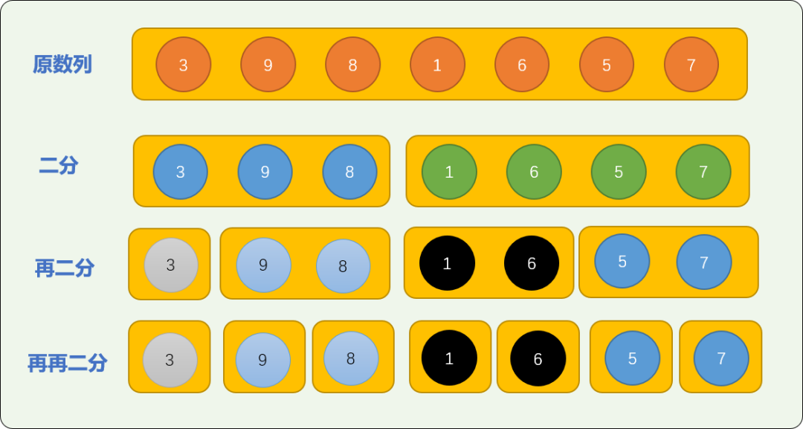


如下代码，使用递归算法对原数列进行切分，通过输出结果观察切分过程：

```cpp
#include <iostream>
using namespace std;
// 切分原数列
void splitNums(int nums[],int start,int end ) {
 int size=end-start;
 for(int i=start; i<size+start; i++)
  cout<<nums[i]<<"\t";
 cout<<endl;
 if (size>1)  {
  // 切分线，中间位置
  int spLine = size / 2;
  splitNums(nums,start,spLine+start);
  splitNums(nums,spLine+start,end );
 }
}
int main(int argc, char** argv) {
 int  nums[] = {3, 9, 8, 1, 6, 5, 7};
 int size=sizeof(nums)/4;
 splitNums(nums,0,size);
 return 0;
}
```

**输出结果：**和上面演示图的结论一样。

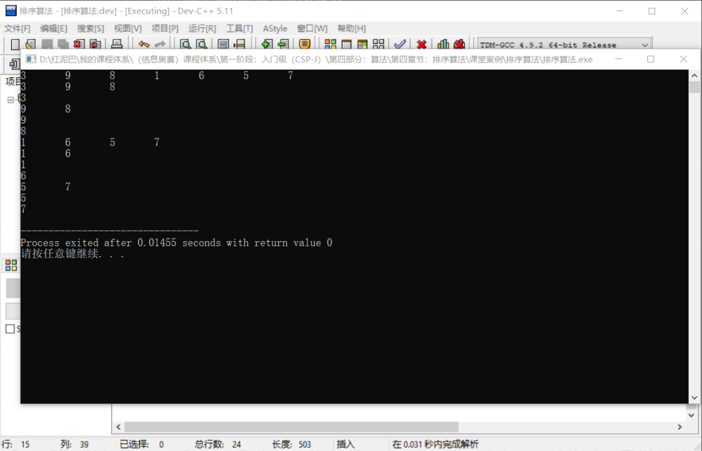


### 3.2 求解子问题

因为已经切分到了原子性，可认为子数列是有序的。然后对相邻`2` 个子数列进行合并，合并后要保证数字依然有序。

如何实现 `2` 个有序子数列合并后依然有序？

使用**首数字比较**算法进行合并排序。如下图演示了如何合并 `nums01=[1,3,8,9]、nums02=[5,6,7]` `2` 个子数列。

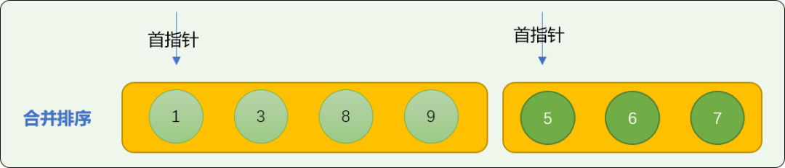


- 数字 `1` 和 数字 `5` 比较，`5` 大于 `1` ，数字 `1` 先位于合并数列中。

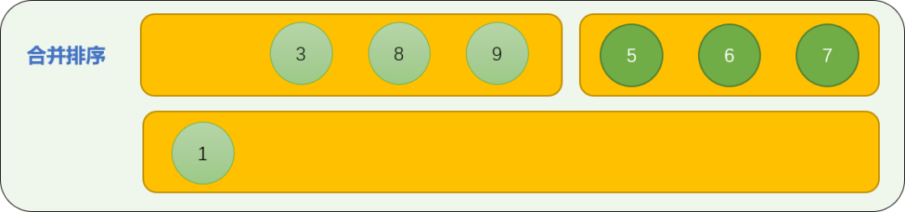


- 数字 `3` 与数字 `5` 比较，数字 3 先进入合并数列中。

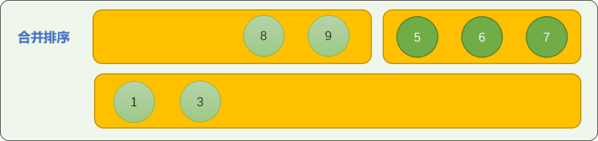


- 数字 `8` 和数字 `5` 比较，数字 `5` 进入合并数列中。

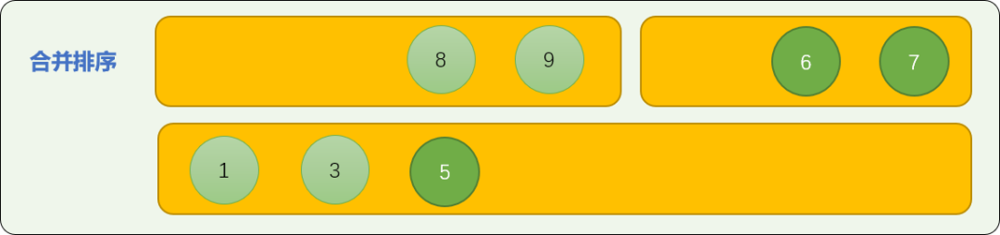


- 重复上述过程，比较首数字的大小。最后，可以保证合并后的数列是有序的。

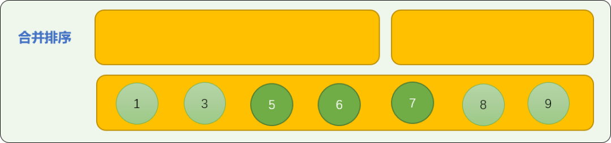


### 3.3 归并子问题

前面是分步讲解切分和合并逻辑，现在把切分和合并逻辑合二为一，完成归并算法的实现。

```cpp
#include <iostream>
using namespace std;
int  nums_[] = {3, 9, 8, 1, 6, 5, 7};
// 切分原数列
void splitNums(int nums[],int start,int end ) {
 int size=end-start;
 if (size>1)  {
  // 切分线，中间位置
  int spLine = size / 2;
  //前子数组的绝对大小
  int s1=spLine;
  //后子数组的绝对大小
  int s2=end-spLine-start;
  //前面的子数组
  int nums01[s1];
  int idx=0;
  //切分原数组,注意相对位置
  for(int i=start; i<spLine+start; i++) {
   nums01[idx]=nums_[i];
   idx++;
  }
  int nums02[s2];
  idx=0;
  for(int i=spLine+start; i<end; i++) {
   nums02[idx]=nums_[i];
   idx++;
  }
  splitNums(nums01,start,spLine+start);
  splitNums(nums02,spLine+start,end );
  // 为 2 个数列创建 2 个指针
  int idx_01 = 0;
  int  idx_02 = 0;
  int k = 0;
  while (idx_01 < s1 and idx_02 < s2 ) {
   if (nums01[idx_01] > nums02[idx_02]) {
    // 合并后的数字要保存到原数列中
    nums[k] = nums02[idx_02];
    idx_02 += 1;
   } else {
    nums[k] = nums01[idx_01];
    idx_01 += 1;
   }
   k += 1;
  }
  // 检查是否全部合并
  while (idx_02 < s2) {
   nums[k] = nums02[idx_02];
   idx_02 += 1;
   k += 1 ;
  }
  while (idx_01 < s1) {
   nums[k] = nums01[idx_01];
   idx_01 += 1;
   k += 1;
  }
 }
}
int main(int argc, char** argv) {
 int size=sizeof(nums_)/4;
 splitNums(nums_,0,size);
 cout<<"归交排序："<<endl;
 for(int i=0;i<size;i++ ){
  cout<<nums_[i]<<"\t";
 }
 return 0;
}
```

输出结果：

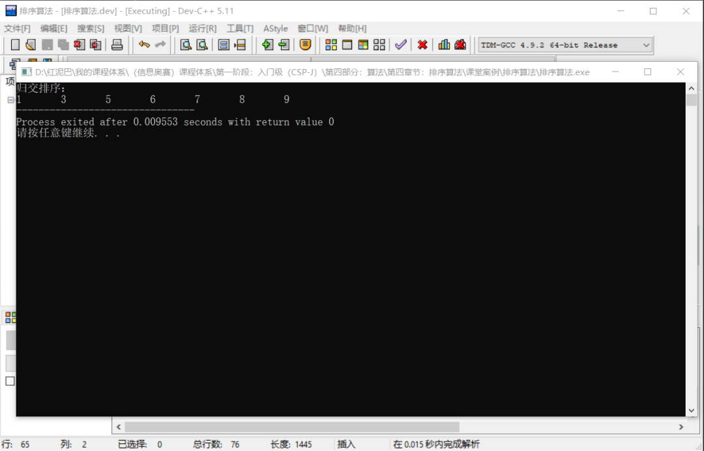


从归并算法上可以完整的看到分治理念的哲学之美。

## 4. 基数排序

基数排序`（radix sort）`属于“分配式排序”`（distribution sort）`，又称“桶子法”`（bucket sort）`或 `bin sort`。

> **Tips：** 基数排序没有使用分治理念，放在本文一起讲解，是因为基数排序有一个对数字自身切分逻辑。

**基数排序的最基本思想：**

如对原始数列 `nums = [3, 9, 8, 1, 6, 5, 7]` 中的数字使用基数排序。

- 先提供一个长度为 `10` 的新空数列（本文也称为排序数列）。

  > **Tips：** 为什么新空数列的长度要设置为 10？等排序完毕，相信大家就能找到答案。

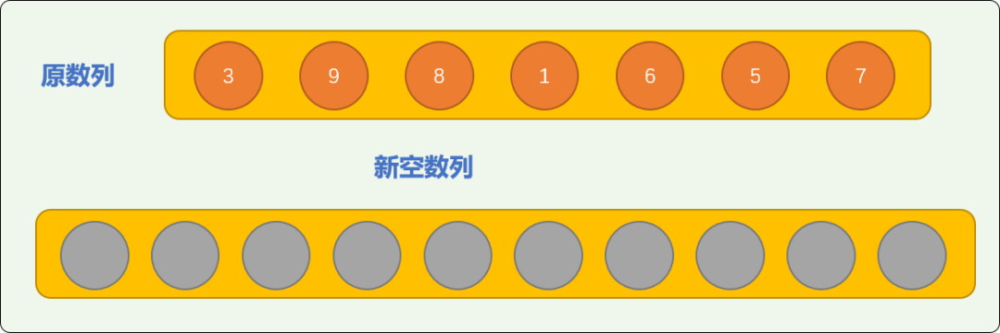


。把原数列中的数字转存到新空数列中，转存方案：

`nums` 中的数字 `3` 存储在新数列索引号为 `3` 的位置。

`nums` 中的数字 `9` 存储在新数列索引号为 `9` 的位置。

`nums` 中的数字 `8` 存储在新数列索引号为 `8` 的位置。

……

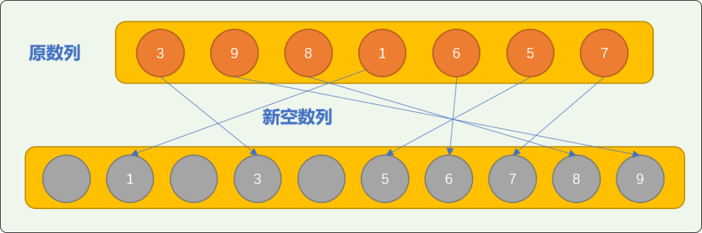


从上图可知，原数列中的数字所转存到排序数列中的位置，是数字所代表的索引号所指的位置。显然，经过转存后，新数列就是一个排好序的数列。

**编码实现：**

```cpp
#include <iostream>
using namespace std;
int main(int argc, char** argv) {
 // 原数列
 int nums[] = {3, 9, 8, 1, 6, 5, 7};
 int size=sizeof(nums)/4;
 // 找到数列中的最大值
 int maxVal=nums[0];
 for(int i=1; i<size; i++) {
  if( nums[i]>maxVal )
   maxVal=nums[i];
 }
 int sortNums[maxVal+1]= {0};
 for (int i : nums) {
  sortNums[i]=i;
 }
 for (int i : sortNums) {
  if(i!=0)
   cout<<i<<"\t";
 }
 return 0;
}
```

**上述排序的缺点：**

- 新空数列的长度定义为多大由原始数列中数字的最大值来决定。如果数字之间的间隔较大时，新数列的空间浪费就非常大。

如对 `nums=[1,98,51,2,32,4,99,13,45]` 使用上述方案排序，**新空数列**的长度要达到 `99` ，真正需要保存的数字只有 `7` 个，如此空间浪费几乎是令人恐怖的。

所以，有必要使用改良方案。如果在需要排序的数字中出现了 `2` 位以上的数字，则使用如下法则：

- 先根据每一个数字个位上的数字进行存储。个位数是 `1` 存储在位置为 `1` 的位置，是 `9` 就存储在位置是 `9` 的位置。如下图：

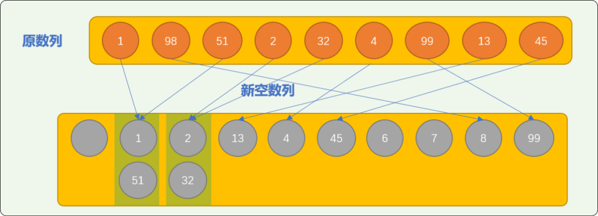


可看到有可能在同一个位置保存多个数字。**这也是基数排序也称为桶子法的原因。**

> **Tips：**一个位置就是一个桶，可以存放多个具有相同性质的数字。如上图：个位上数字相同的数字就在一个桶中。

- 把存放在**排序数列**中的数字按顺序重新拿出来，这时的数列顺序变成 `nums=[1，51，2，32，13，4，45，8，99]`
- 把重组后数列中的数字按十位上的数字重新存入排序数列。

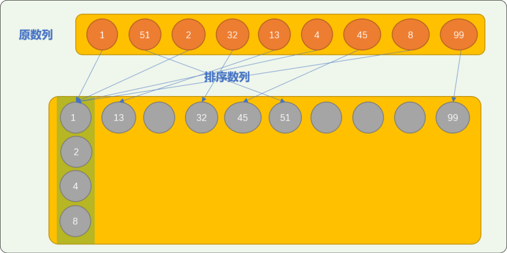


可以看到，经过 `2` 轮转存后，原数列就已经排好序。

> **Tips：**这个道理是很好理解的：现实生活中，我们在比较 `2` 个数字 大小时，可以先从个位上的数字相比较，然后再对十位上的数字比较。如此，无论是多少位的数字，都可以运用基数排序算法。
>
> 基数排序，很有生活的味道！！

**编码实现基数排序：**下面代码使用递归实现。

```cpp
#include <iostream>
#include <cmath>
using namespace std;
//排序用数组
int sortNums[10][10]= {0};
void baseSort(int nums[],int size,int start,int depth) {
 if(start==depth) {
  return;
 }
 //取位
 for(int i=0; i<size; i++) {
  int wei=pow(10,start);
  int temp=nums[i] / wei %  10;
  for(int j=0; j<10; j++) {
   if( sortNums[temp][j]==0 ) {
    sortNums[temp][j]=nums[i] ;
    break;
   }
  }
 }
 //取出排序的数据
 int idx=0;
 for(int row=0; row<10; row++) {
  for(int col=0; col<10; col++) {
   if( sortNums[row][col]!=0 ) {
    nums[idx]=sortNums[row][col];
    sortNums[row][col]=0;
    idx++;
   }
  }
 }
 //递归
 baseSort(nums,size,start+1,depth);
}
int main(int argc, char** argv) {
 // 原数列
 int nums[] = {1, 98, 51, 2, 32, 114, 99, 13, 45};
 int size=sizeof(nums)/4;
 int bakNums[size];
 for(int i=0; i<size; i++) {
  bakNums[i]=nums[i];
 }
 //找到最大值
 int maxVal=nums[0];
 for(int i=1; i<size; i++) {
  if(nums[i]>maxVal) {
   maxVal=nums[i];
  }
 }
 //计算最大值的位数
 string str= to_string(maxVal);
 int depth=str.size();
 //基数排序
 baseSort(nums,size,0,depth);
 for(int i=0; i<size; i++) {
  cout<<nums[i]<<"\t";
 }
 return 0;
}
```

**输出结果：**

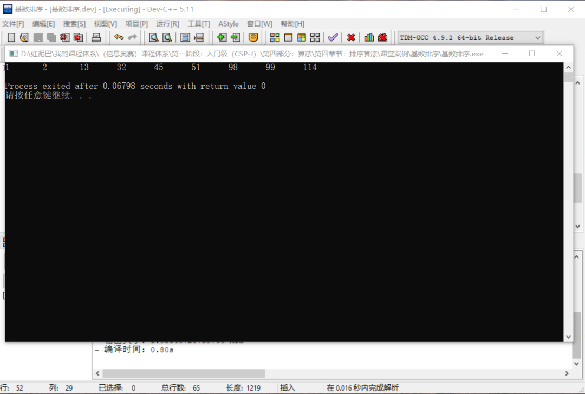


上述转存过程是由低位到高位，也称为 `LSD` ，也可以先高位后低位方案转存`MSD`。

## 5. 总结

分治很有哲学味道，当你遇到困难，应该试着找到问题的薄弱点，然后一点点地突破。

当遇到困难时，老师们总会这么劝解我们。分治其实和项目开发中的组件设计思想也具有同工异曲之处。


