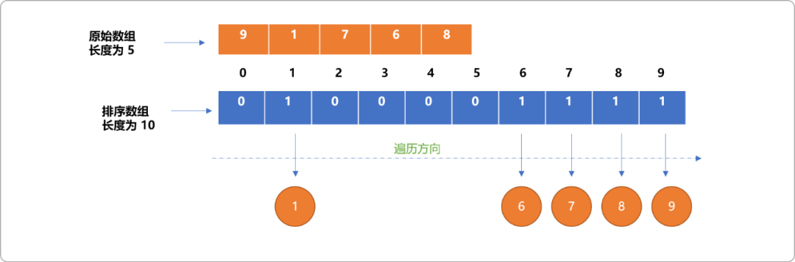
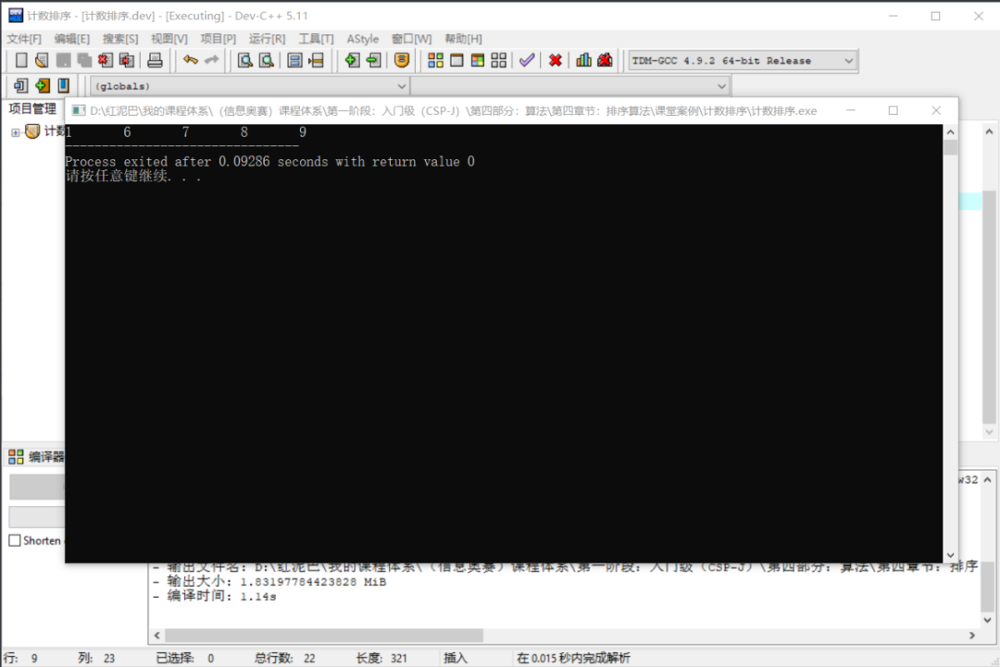
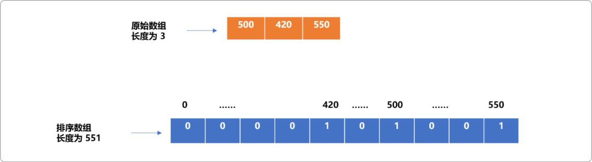
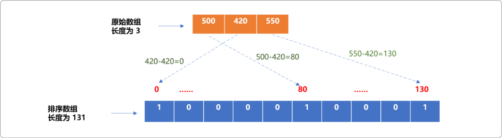
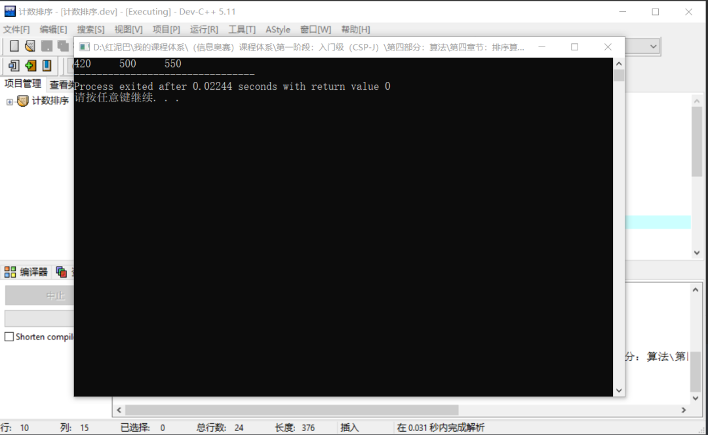
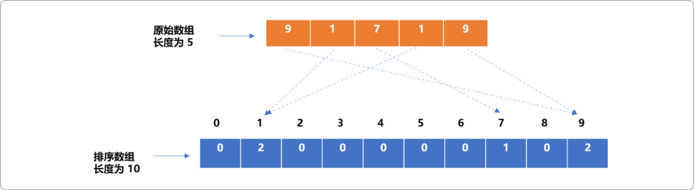
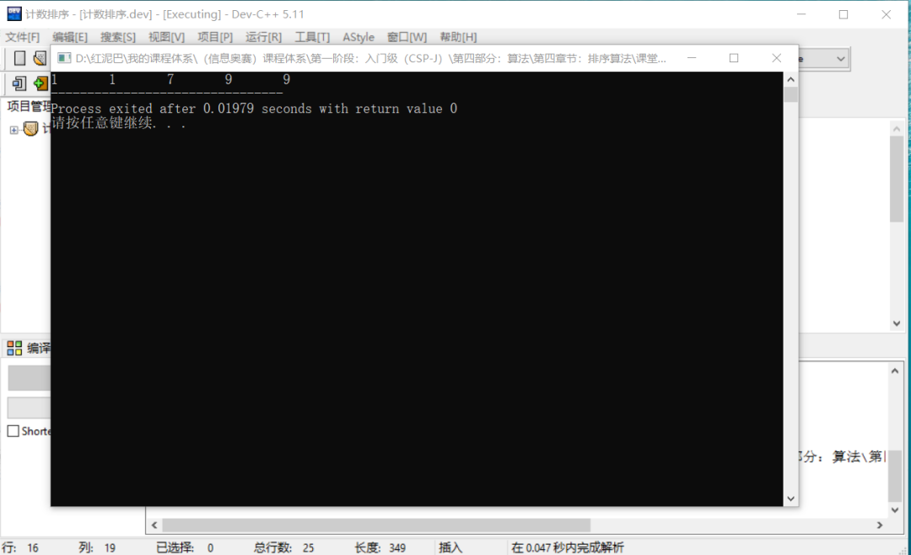
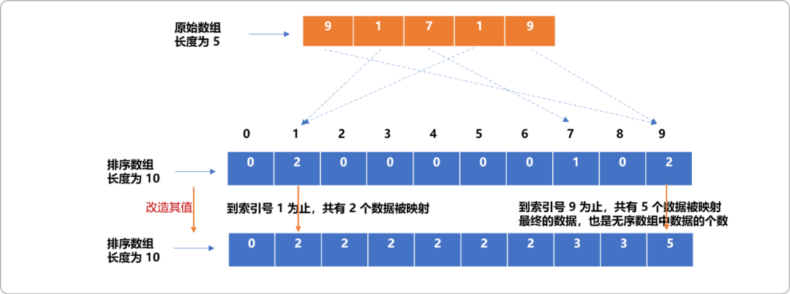
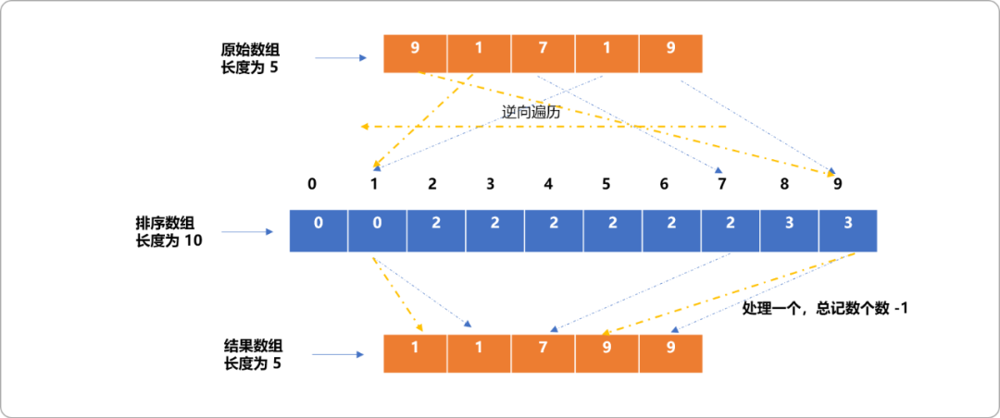
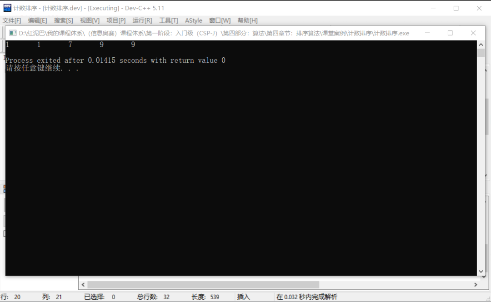

# C++不知算法系列之细聊计数排序算法如何巧用计数

## 1. 前言

`计数排序`是较简单的排序算法，其`基本思想`是利用数组索引号有序的原理。

如对如下的`原始数组`中的数据(元素)排序：

```cpp
//原始数组
int nums[5]={9,1,7,6,8};
```

使用`计数排序`的基本思路如下：

- 创建一个`排序数组`。数组的大小由原始数组的最大值决定，如原始数组的最大值为`9`，则排序数组的长度为 `9+1`。为什么排序数组的长度需要如此设置，后文将做解释。

```cpp
int sortNums[10]={0}; //初始化值为 0
```

- 读取原始数组中的`数据`，以此`数据`作为`排序数组`的`索引号`，此数据出现的次数为排序数组的值。

  这也解释了为什么排序数组的长度必须是原始数组中最大值加`1`。因为`排序数组`必须能为原始数组中的`最大值`提供索引号。


- 然后输出`排序数组`中的值不为 `0`的索引号。



**编码实现：**

```cpp
#include <iostream>
using namespace std;
int main(int argc, char** argv) {
 //原数组
 int nums[5]= {9,1,7,6,8};
 //排序数组
 int sort[10]= {0};
 //转存
 for(int  i=0; i<5; i++) {
  sort[nums[i]]++;
 }
 //输出排序数组
 for(int i=0; i<10; i++) {
  if(sort[i]!=0)
   cout<<i<<"\t";
 }
 return 0;
}
```

**输出结果：**



通过上文简述可知：

- 计数排序的时间复杂度为`O(n)`，时间复杂度还算可观。
- 但是空间复杂度也是`O(n)`。相比较如冒泡、选择……排序算法，计数排序算法是以空间换取时间。

## 2. 两个问题

### 2.1 排序数组的长度

计数排序利用数组索引号的有序而对数据排序，所以，需要把原无序数组中的`数据`映射到排序数组的索引号上。于是，对排序数组的长度就会有一个最小值的约束，至少等于无序数组中的最大值加一。

如下面的无序数组：

```cpp
int num[]={500,420,550};
```

为了保证无序数组中的数据能映射到对应的索引号，则排序数组长度至少应该为 `551`。

```cpp
int sort[551]={0};
```

而实际需要映射的数据只有 `3` 个，会导致排序数组空间浪费巨大，这也是计数排序缺点所在。

如下图所示：



**如何解决此问题？**

可以在创建排序数组时：

- 找到原始无序数组中的最大值`（max）`和最小值`（min）`。如上文无序数组的最大值为 `550`，最小值为`420`。

- 指定排序数组的长度为：`max-min+1`，即排序数组的长度为：`131`。

```cpp
  int sort[131]={0}; //初始值为0
  ```

- 无序数组到排序数组的映射规则：`排序数组中的索引号=无序数组中的数据-最小值`。

  反之在遍历排序数组时：`无序数组中的数据=排序数组中的索引号+最小值`。



编码实现：

```cpp
#include <iostream>
using namespace std;
int main(int argc, char** argv) {
 //原数组
 int nums[3]= {500,420,550};
 //硬代码求长度 
 int len=550-420+1; 
 //排序数组
 int sort[len]= {0};
 //转存
 for(int  i=0; i<3; i++) {
  sort[nums[i]-420 ]++;
 }
 //输出排序数组
 for(int i=0; i<len; i++) {
  if(sort[i]!=0)
   cout<<(i+420)<<"\t";
 }
 return 0;
}
```

**输出结果：**



### 2.2 重复问题

如果无序数组中有重复数据，根据计数排序算法的映射原理，显然，相同数据会映射到排序数组的同一个位置。排序数组通过计数器方案对相同数据进行计数。这也是计数排序算法名称的由来。

如下图所示：无序数组中的 `2` 个 `1`和 `2`个`9`映射到了排序数组的同一个位置，排序数组的值记录了重复数据的多少。



**编码实现：**

```cpp
#include <iostream>
using namespace std;
int main(int argc, char** argv) {
 //原数组
 int nums[5]= {9,1,7,1,9};
 //排序数组
 int sort[10]= {0};
 //转存
 for(int  i=0; i<5; i++) {
  sort[nums[i] ]++;
 }
 //输出排序数组
 for(int i=0; i<10; ) {
  if(sort[i]!=0) {
   cout<<i<<"\t";
   sort[i]--;
  }else{
             i++;
        }
 }
 return 0;
}
```

输出结果：



此处只能对重复的数据计数，但无法得知重复数据的原始顺序。故，理论而言，计数排序算法是不稳定的。

有没有方案能输出时保留重复数据的原始先后顺序？

答案是：改造排序数组中的值，数组中的映射位置不再存储此索引号对应数据的个数，而是存储此索引号之前所有数据的个数。



然后逆向遍历原始无序数组。用其值做为排序数组的索引号，找出存储在排序数组中的值然后减一，便知道此数据应该排在有序位置的第几位。



**为什么要逆向遍历？**

原因很简单，在映射时，是正向遍历，则无序数组中的第 `1` 个 `9`一定是先映射到排序数组的索引号为 `9`的位置，最后的一个 `9`是后映射到排序数组索引号为 `9`的位置。拿出来时，应该要遵循先进后出原则。

**编码实现：**

```cpp
#include <iostream>
using namespace std;
int main(int argc, char** argv) {
 //原数组
 int nums[5]= {9,1,7,1,9};
 //排序数组
 int sort[10]= {0};
 //映射
 for(int  i=0; i<5; i++) {
  sort[nums[i] ]++;
 }
 //转值，排序数组中存储此索引号及之前已经映射的数据个数
 for(int i=1; i<10; i++) {
  sort[i]+=sort[i-1];
 }
 //结果数组
 int res[5]= {0};
 //逆向遍历原无序数组
 for(int i=4; i>=0; i-- ) {
         //无序数组中的数据作为排序数组的索引号，其值减一，即为 nums[i]的正确位置
  res[--sort[nums[i]]]=nums[i]; 
 }
 //输出结果
 for(int i=0;i<5;i++){
  cout<<res[i]<<"\t";
 } 
 return 0;
}
```

**输出结果：**



## 3. 完整的代码及应用

### 3.1 完整代码

上文对计数排序的实现流程做了分步讲解，综合基本思想以及其问题解决方案。下面是完整的代码。

```cpp
#include <iostream>
using namespace std;
/*
*查找数组中的最大值、最小值
*/
pair<int,int> getMaxAndMin(int nums[],int size) {
 int mixn=nums[0];
 int maxn=nums[0];
 for(int i=1; i<size; i++) {
  if(nums[i]>maxn)
   maxn=nums[i];
  if(nums[i]<mixn)
   mixn=nums[i];
 }
 pair<int,int> p(mixn,maxn);
 return p;
}
/*
*计数排序
*/
void jsSort(int nums[],int size,int res[]) {
 pair<int,int> p=getMaxAndMin(nums,size);
 int mx=p.second;
 int mi=p.first;
 int sortLen=mx-mi+1;
 //排序数组
 int sort[ sortLen ]= {0};
 //映射且计数
 for(int i=0; i<size; i++) {
  sort[nums[i]-mi]++;
 }
 //计总数
 for(int i=1; i<sortLen; i++) {
  sort[i]+=sort[i-1];
 }
 //逆向遍历原数组
 int idx=0;
 for(int i=size-1; i>=0; i--) {
  //有序位置 
  idx= --sort[nums[i]-mi];
  res[idx]=nums[i];
 }
}
int main(int argc, char** argv) {
 int nums[5]= {9,1,7,1,9};
 int size=sizeof(nums)/4;
 //结果数组
 int res[size]= {0};
 jsSort(nums,size,res);
 for(int i=0; i<5; i++) {
  cout<<res[i]<<"\t";
 }
 return 0;
}
```

### 3.2 应用

`2019-10-19`的`CSP-J`试卷中有一道与计数排序算法有关的程序题。

**题目描述：**

(计数排序)计数排序是一个广泛使用的排序方法。下面的程序使用双关键字计数排序，将`n`对`10000`以内的整数，从小到大排序。 例如有三对整数`(3,4)、(2,4)、(3.3)`，那么排序之后应该是`(2,4)、(3,3)、(3,4)`。 输入第一行为`n`，接下来`n`行，第`i`行有两个数`a[i]`和`b[i]`，分别表示第 `i`对整数的第一关键字和第二关键字。从小到大排序后输出。 数据范围`1≤n≤10^7，1≤a[i],b[i]≤10^4`。 提示：应先对第二关键字排序，再对第一关键字排序。数组`ord[]`存储第二关键字排序的结果，数组`res[]`存储双关键字排序的结果。

**试补全程序：**

```cpp
#include <cstdio>
#include <iostream>
#include <cstring>
using namespace std;
const int maxn=10000000;
const int maxs=10000;
int n;
unsigned a[maxn],b[maxn],res[maxn],ord[maxn];
unsigned cnt[maxs+1];
int main() {
 scanf("%d",&n);
 for(int i=0; i<n; ++i) {
  scanf("%d%d",&a[i],&b[i]);
 }
 memset(cnt,0,sizeof(cnt));
 for(int i=0; i<n; ++i)
  1 ; //使用 cnt 数据计数 
 for(int i=0; i<maxs; ++i) 
  cnt[i+1]+=cnt[i];
 for(int i=0; i<n; ++i) 
   2 ;
 memset(cnt,0,sizeof(cnt));
 for(int i=0; i<n; i++) 
   3 ;
 for(int i=0; i<maxs; ++i) 
  cnt[i+1]+=cnt[i];
 for(int i=n-1; i>=0; --i)
    4 ;
 for(int i=0; i<n; ++i)
  printf("%d %d\n",  5 );
 return 0;
}
```

1. ①处应填( `B` )

A、 `++cnt[i]`

B、 `++cnt[b[i]]`

C、 `++cnt[a[i] * maxs + b[i]]`

D、` ++cnt[a[i]]`

2） ②处应填（  `D` ）

A、` ord[--cnt[a[i]]] = i`

B、`ord[--cnt[b[i]]] = a[i]`

C、 `ord[--cnt[a[i]]] = b[i]`

D、 `ord[--cnt[b[i]]] = i`

3） ③处应填（  `C` ）

A. `++cnt[b[i]]`

B. ++cnt[a[i] * maxs + b[i]]

C. `++cnt[a[i]]`

D. `++cnt [i]`

4） ④处应填（  `A` ）

A、 `res[--cnt[a[ord[i]]]] = ord[i]`

B、 `res[--cnt[b[ord[i]]]] = ord[i]`

C、 `res[--cnt[b[i]]] = ord[i]`

D、 `res[--cnt[a[i]]] = ord[i]`

5） ⑤处应填（  `B` ）

A、 `a[i], b[i]`

B、 `a[res[i]], b[res[i]]`

C、 `a[ord[res[i]]] , b[ord[res[i]]]`

D、 `a[res[ord[i]]] , b[res[ord[i]]]`

## 4. 总结

计数排序、桶排序以及基数排序是类似的排序算法。相比较计数排序时数组纵向长度的不可控，基数排序使用二维数组对数据排序，且把数组的大小限定在的 `10X10`之间，空间大小可控的。但是，从时间复杂度上讲，计数排序更胜一筹。


