# C++ 算法主题系列之贪心算法的贪心之术


## 1. 前言

贪心算法是一种常见算法。是以人性之念的算法，面对众多选择时，总是趋利而行。

因贪心算法以眼前利益为先，故总能保证当前的选择是最好的，但无法时时保证最终的选择是最好的。当然，在局部利益最大化的同时，也可能会带来最终利益的最大化。

假如在你面前有 `3` 个盘子，分别放了很多苹果、橙子、梨子。

现以贪心之名，从 `3` 个盘子里分别拿出其中最重的那个，则能求解出不同品种间最重水果的最大重量之和。这时，`3` 个盘子可认为是 `3` 个子问题（局部问题）。

贪心算法会有一个排序过程。当看到盘子里的水果时，潜意识中你就在给它们排序。有时，因可排序的属性较多，必然导致使用`贪心算法`求解问题时，贪心策略可能会有多种。

比如说选择水果，你可以选择每盘里最大的、最重的、最成熟的……具体应用那个策略，要根据求解的问题要求而定。贪心策略不同，导致的结论也会不一样。

本文将通过几个案例深入探讨贪心算法的贪心策略。

## 2. 活动安排问题

**问题描述：**

- 有`n`个活动`a1,a2,…,an……`需要在同一天使用同一个教室，且教室同一时刻只能由一个活动使用。
- 每个活动`ai`都有一个开始时间`si`和结束时间`fi` 。
- 一个活动被选择后，另一个活动则需等待前一个活动结束后方可进入教室。
- **请问，如何安排这些活动才能使得尽量多的活动能不冲突的举行。**

**分析问题：**

教室同一时间点只能安排一个活动，如果活动与活动之间存在时间交集（重叠），则这两个活动肯定是不能在同一天安排。

使用 `S`表示活动的开始时间，`f`表示活动的结束时间。则可使用 `[si,fi]`表示活动一，`[sj,fj]`表示活动二。

如果存在：`si<sj<fi<fj`，则称这 `2` 个活动不相容，不相容的活动不能在一天内同时出现。如下图所示。

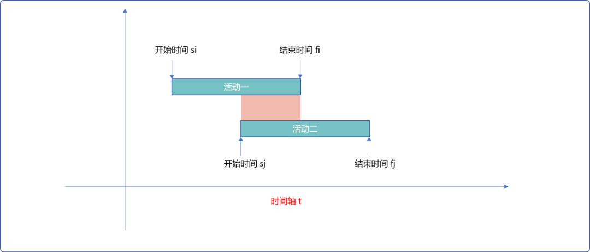

只有当活动二的开始时间等于或晚于上活动一的结束时间时方可以在同一天出现。如下图所示。也即`sj>=fi`。此时，称这 `2` 个活动是相容。

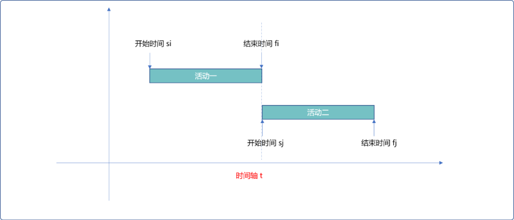

此问题中，活动的属性有：

- 活动的开始时间。
- 活动的结束时间。
- 活动的时长。

那么，在使用贪心算法时，贪心的策略应该如何定夺？

### 2.1 贪心策略

#### 2.1.1  策略一

最直接的想法是：每次安排活动时长最短的活动，必然可保证一天内容纳的活动数最多。

逻辑层面上讲，先以活动时长递增排序，然后依次选择。

但是忽视了一个问题，每一个活动都有固定的开始时间和结束时间。

如下图所示，因活动一所需时长最短，先选择。又因活动二所需时长次短，选择活动二。因两个活动时间间隔较长，采用此策略，会导致教室出现空闲时间。

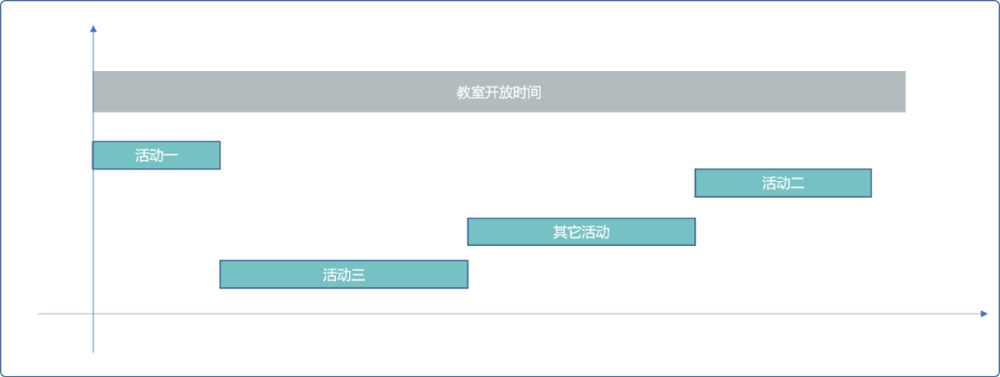

针对此问题，贪心算法的出发点应该是保证每一时刻教室的最大利用率，才有可能容纳最多活动。

显然，受限于活动固定时间限制，此策略不可行。

#### 2.1.2 策略二

能否每次选择**活动时长**最长的活动。提出这个策略时，就不是很自信的。分析问题吗？就不论正确，只论角度。

此策略和策略一相悖论。题目要求尽可能安排活动的数量，如果某活动的时长很长，一个活动就占据了大部分时间，显然，此种策略是无法实现题目要求的。

如下图，选择活动一，后再选择活动三。一天仅能安排 `2` 次活动。根据图示，根据每个活动的开始、结束时间，一天之内至少可以安排 `3` 个活动。

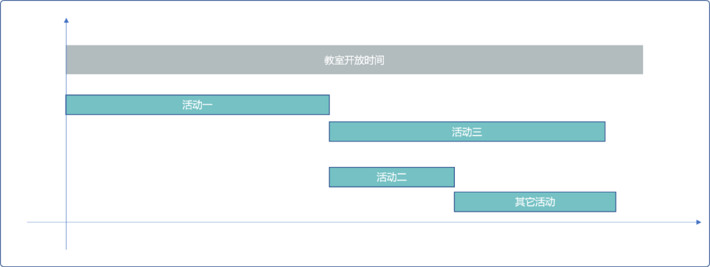

#### 2.1.3 策略三

每次选择最早开始的活动。

先选择最早开始，等活动结束后，再选择相容且次开始的。这个策略和策略二会有同样的问题。如果最早开始的活动时长较长，必然会导致，大部分活动插入不进去。

#### 2.1.4 策略四

还是回到策略一上面来，以时长最短的活动为优先，理论上是没有错的，但是不能简单的仅以时长作为排序依据。

可以以活动结束时间为依据。活动结束的越早，活动时长相对而言是较短的。因同时安排的活动需要有相容性，所以，再选择时，可选择**开始时间**等于或晚于前一个活动结束时间的活动，这也是与策略一不同之处，并不是简单的选择相容且绝对时长短的活动。

在活动时长较短情况，又能保证教室的使用时间一直连续的，则必然可以安排的活动最多。如下图所示：

- 选择最早结束的活动。
- 开始时间与上一次结束时间相容的活动。
- 如此，反复。且保证活动的相容同时保持了时间上的连续性。

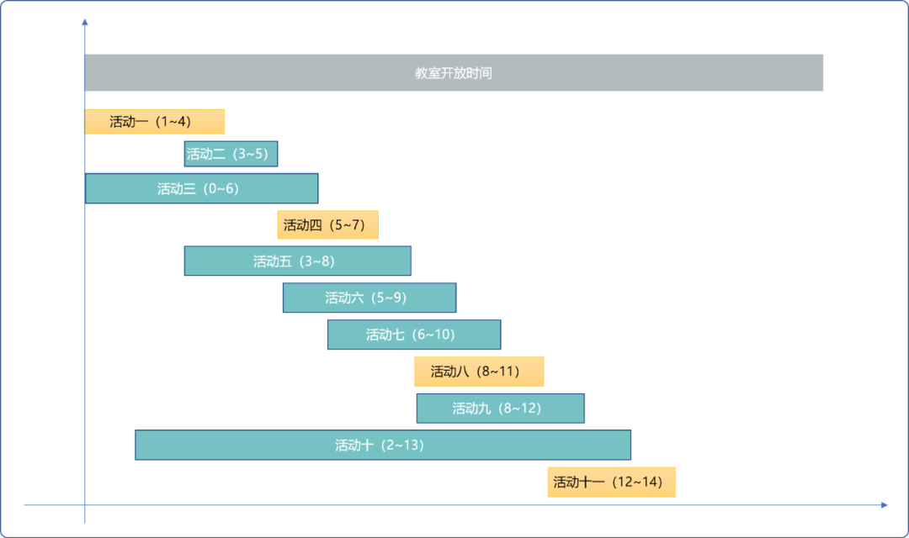

### 2.2 编码实现

```cpp
#include <iostream>
#include <algorithm>
#define MAX  5
using namespace std;
/*
*描述活动的结构体
*/
struct Activity {
 //活动开始时间
 int startTime;
 //活动结束时间
 int endTime;
 //是否选择
 bool isSel=false;
 void desc() {
  cout<<this->startTime<<"-"<<this->endTime<<endl;
 }
};
//所有活动
Activity acts[MAX];
//初始化活动
void initActivities() {
 for(int i=0; i<MAX; i++) {
  cout<<"输入活动的开始时间-结束时间："<<endl;
  cin>>acts[i].startTime>>acts[i].endTime;
 }
}
/*
*比较函数
*/
bool cmp(const Activity &act0, const Activity &act1) {
 return  act0.endTime<act1.endTime;
}
/*
*活动安排
*/
int getMaxPlan() {
 //计数器
 int count=1;
 //当前选择的活动
 int currentSel=0;
 acts[currentSel].isSel=true;
 for(int i=1; i<MAX; i++) {
  if(acts[i].startTime>=acts[currentSel].endTime ) {
   count++;
   currentSel=i;
   acts[i].isSel=true;
  }
 }
 return count;
}
/*
*输出活动
*/
void showActivities() {
 for(int i=0; i<MAX; i++) {
  if(acts[i].isSel==true)acts[i].desc();
 }
}
/*
*测试
*/
int main() {
 initActivities();
 //排序，使用 STL 算法中的 sort
 sort(acts,acts+MAX,cmp);
 getMaxPlan();
 showActivities();
 return 0;
}
```

**输出结果：**

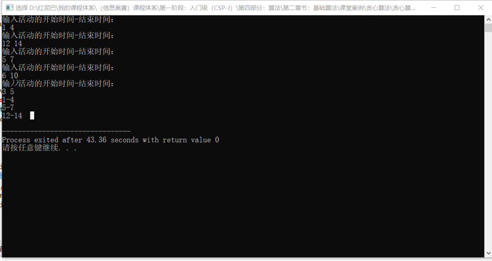

## 3. 调度问题

### 3.1 多机调度

**问题描述：**

- `n`个作业组成的作业集，可由`m`台相同机器加工处理。
- 要求使所给的`n`个作业在尽可能短的时间内由`m`台机器加工处理完成。
- 作业不能拆分成更小的子作业。

**分析问题：**

此问题是可以使用贪心算法的，可以把每一个作业当成一个子问题看待。

- 当`n<=m`时，可满足每一个作业同时有一台机器为之服务。最终时间由最长作业时间决定。
- 当`n>m`时，则作业之间需要轮流使用机器 ，这时有要考虑贪心策略问题。

本问题和上题差异之处：不在意作业什么时候完成，所以作业不存在开始时间和结束时间，每个作业仅有一个作业时长属性。所以，贪心策略也就只有 `2` 个选择：

- 按作业时长从小到大轮流使用机器。

如果是求解在规定的时间之内，能完成的作业数量最多，则可以使用此策略。

而本题是求解最终最短时间，此策略就不行。在几个作业同时工作时，**最终完成的的时长是由最长时长的作业决定的。**这是显然易见的道理。一行人行走，总是被行动被慢的人拖累。

如果把最长时长的作业排在最后，则其等待时间加上自己的作业时长，必然会导致最终总时长不是最优解。

- 按作业时长从大到小轮流使用机器。

先安排时长较长的作业，最理想状态可以保证在它工作时，其它时长较小的作业在它的周期内完成。

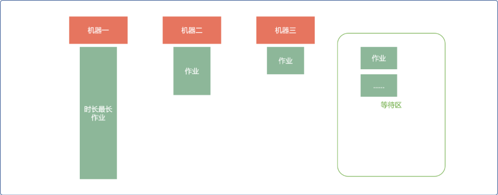

### 3.2 编码实现

```cpp
#include <iostream>
#include <algorithm>
#include <vector>
#include <cstring>
using namespace std;

//每个作业的工作时长
int* workTimes;
//机器数及状态
int* machines;

/*
*初始化作业
*/
void initWorks(int size) {
 workTimes=new int[size];
 for(int i=0; i<size; i++) {
  cout<<"输入作业的时长"<<endl;
  cin>>workTimes[i];
 }
}
/*
*比较函数
*/
bool cmp(const int &l1, const int &l2) {
 return  l1>l2;
}

/*
*调度
* size: 作业多少
* count:机器数量
*/
int attemper(int size,int count) {
 int totalTime=0;
 int minTime=0;
 int minInit=workTimes[0];
 int k=0;
 vector<int> vec;
 for(int i=0; i<size;) {
  //查找空闲机器
  for(int j=0; j<count; j++) {
   if( workTimes[i]!=0 && machines[j]==-1  ) {
    //安排作业
    machines[j]=i;
    //记录已经安排的作业
    vec.push_back(i);
    i++;
   }
  }
  //找最小时长作业
  minTime=minInit;
  for(int j=0; j<vec.size(); j++) {
   if( workTimes[ vec[j] ] !=0 &&  workTimes[ vec[j] ] < minTime ) {
    minTime= workTimes[ vec[j] ];
    //记下作业编号
    k=vec[j];
   }
  }
  totalTime+=minTime;
  //清除时间
  for(int j=0; j<vec.size(); j++) {
   if(workTimes[vec[j]]>=minTime )
    workTimes[vec[j]]-=minTime;
  }

  for(int j=0; j<count; j++) {
   //机器复位为闲
   if(machines[j]==k)machines[j]=-1;
  }

 }
 //最大值
 int ma=0;
 for(int i=0; i<size; i++) {
  if(workTimes[i]!=0 && workTimes[i]>ma )ma=workTimes[i];
 }
 totalTime+=ma;
 return totalTime;
}
/*
*测试 
*/
int main() {
 cout<<"请输入作业个数："<<endl;
 int size;
 cin>>size;
 initWorks(size);
 //对作业按时长大到小排序
 sort(workTimes,workTimes+size,cmp);
 cout<<"请输入机器数量"<<endl;
 int count=0;
 cin>>count;
 //初始为空闲状态
 machines=new int[count] ;
 for(int i=0; i<count; i++)machines[i]=-1;
 int res= attemper(size,count);
 cout<<res;
 return 0;
}
```

## 4.背包问题

背包问题是类型问题，不是所有的背包问题都能使用贪心算法。

- 不能分割背包问题也称为`0,1背包问题`不能使用贪心算法。
- 可分割的背包问题则可以使用贪心算法。

**问题描述：**

现有一可容纳重量为 `w`的背包，且有不同重量的物品，且每一个物品都有自己的价值，请问，怎么选择物品，才能保证背包里的价值最大化。

如果物品不可分，则称为`0~1`问题，不能使用贪心算法，因为贪心算法无法保证背包装满。一般采用动态规划和递归方案。

如果物品可分，则可以使用贪心算法，本文讨论是可分的情况。

**分析问题：**

既然可以使用贪心算法，则现在要考虑贪心策略。

### 4.1 贪心策略

物品的有 `2` 个属性：

- 重量。
- 价值。

直观的策略有 `2` 个：

- 贪重量：先放重量最轻的或重量最重的。显然，这个策略是有问题的。以重为先，相当于先放较重的石头，再放较经的金子。以轻为先，相当于先放一堆类似于棉花的物品，最后再放金子。都无法得到背包中的价值最大化。
- 贪价值：以价值高的优先，理论上可行。但是，如果以纯价值优先，如下图所示，无法让背包价值最大化。因为把物品 `3`、物品`4`、物品 `5` 一起放入背包，总价值可以达到`254`，且背包还可以容纳其它物品。

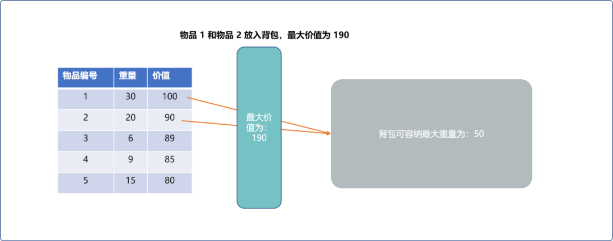

显然，以纯价值优先，是不行。

**为什么以纯价值优先不行？**

因为没有把价值和重量放在一起考虑。表面上一个物品的价值是较大的，这是宏观上的感觉。但是，这个物品是不是有较高的价值，应该从重量和价值比考虑，也就是价值密度。

> **Tips：** 一块铁重`10`克，价值为 `100`。一块金子重 `1` 克，价值为 `90`。不能仅凭`价值`这么一个参数就说明铁比金子值钱。

所以，应该以重量、价值比高的物品作为贪心策略。

### 4.2 编码实现

```cpp
#include<iostream>
#include <algorithm>
using namespace std;
/*
*物品类型
*/
struct Goods {
 //重量
 double weight;
 //价值
 double price;
 void desc() {
  cout<<"物品重量:"<<this->weight<<"物品价值："<<this->price;
 }
};

//所有物品
Goods allGoods[10];
//物品数量
int size;
//背包重量
int bagWeight;
//存储结果,初始值为 0
double result[10]= {0.0};

/*
*初始化物品
*/
void initGoods() {
 for(int i=0; i<size; i++) {
  cout<<"请输入物品的重量、价值"<<endl;
  cin>>allGoods[i].weight>>allGoods[i].price;
 }
}

/*
*用于排序的比较函数
*/
bool cmp( const Goods &g1,const Goods &g2) {
 //按重量价值比
 return g1.price/g1.weight>g2.price/g2.weight;
}
/*
*贪心算法求可分割背包问题
*/
void knapsack() {
 int i=0;
 for(; i<size; i++) {
  if( allGoods[i].weight<=bagWeight ) {
   //如果物品重量小于背包重量，记录下来
   result[i]=1;
   //背包容量减小
   bagWeight-= allGoods[i].weight;
  } else
   //退出循环
   break;
 }
 //如果背包还有空间
 if(bagWeight!=0) {
  result[i]=bagWeight/allGoods[i].weight;
 }
}
/*
*显示背包内的物品
*/
void showBag() {
 double maxValue=0;
 for(int i=0; i<size; i++) {
  if( result[i] ==0)continue;
  allGoods[i ].desc();
  maxValue+=allGoods[i ].price*result[i];
  cout<<"数量"<<result[i]<<endl;
 }
 cout<<"总价值："<<maxValue<<endl;
}
/*
*测试
*/
int main() {
 cout<<"请输入物品数量"<<endl;
 cin>>size;
 cout<<"请输入背包最大容纳重量"<<endl;
 cin>>bagWeight;
 initGoods();
 //排序
 sort(allGoods,allGoods+size,cmp);
 knapsack();
 showBag();
}
```

**输出结果：**

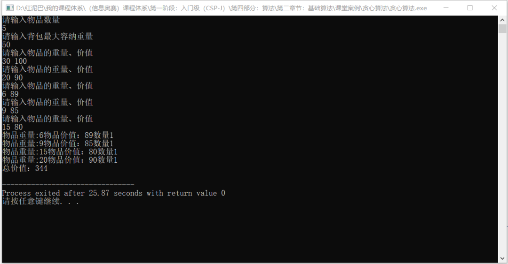

## 5. 过河

**问题描述：**

有一艘小船，每次只能载两个人过河。其中只能一人划船，渡河的时间等于其中划船慢的那个人的时间。现给定一群人和他们的划船时间，请求解最小全部渡河的时间。

**分析问题：**

可根据人数分情况讨论。如下`n`表示人数：

当总人数`n<=3`时：

- `n=1， t=t[1]`。只有一个人时，过河时间为此人划船时间。
- `n=2 t=max(t[1],t[2])`。当只有二个人时，` 1`和`2`中耗时长的那个。
- `n=3 t=t[1]+t[2]+t[3]` 。 `1`和`3`先去,`1`回来,再和`2`去。

否则，按划船的时间由快到慢排序。

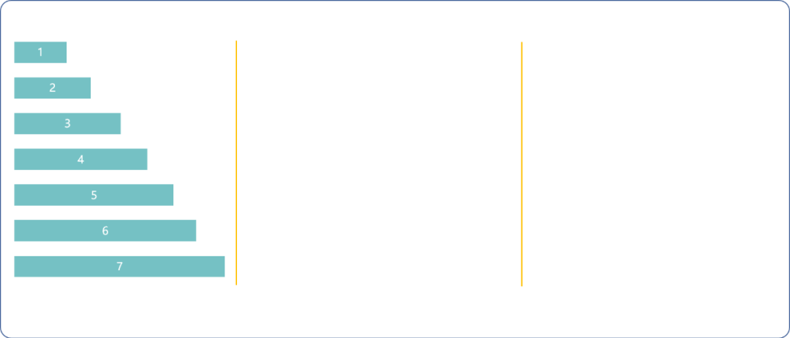

基本原则，回来时，选择最快的。

- `1（最快）`和`n（最慢）`先去，`1（最快）`回来，`1`和`n-1（次慢）`去，`1(最快)`的回来 ， `n-=2`，  用时`2*t[1]+t[n]+t[n-1]`。

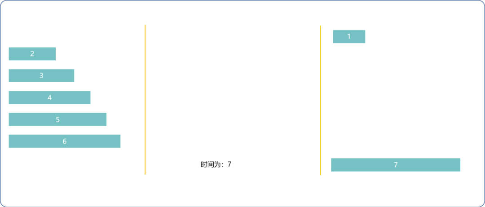

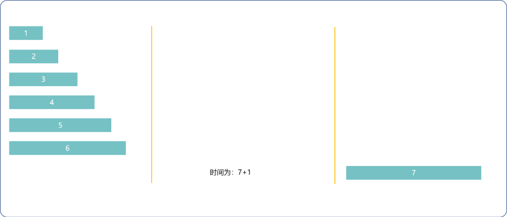

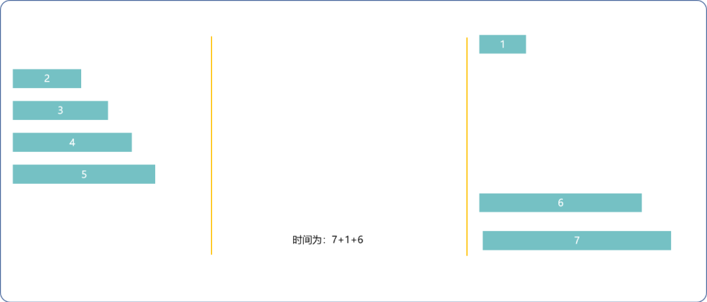

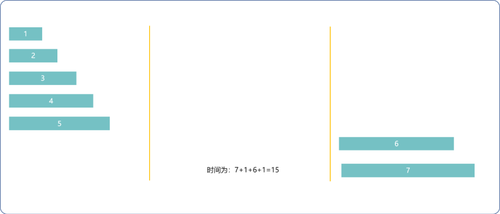

- `1（最快）`和`2（次快）`去，`1(最快)`回来，`n`和`n-1`去，`2`回来，` n-=2` 用时`t[1]+2*t[2]+t[n]`。

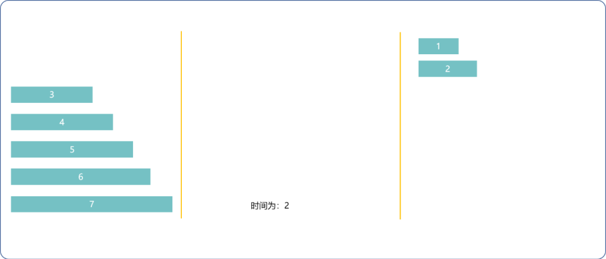

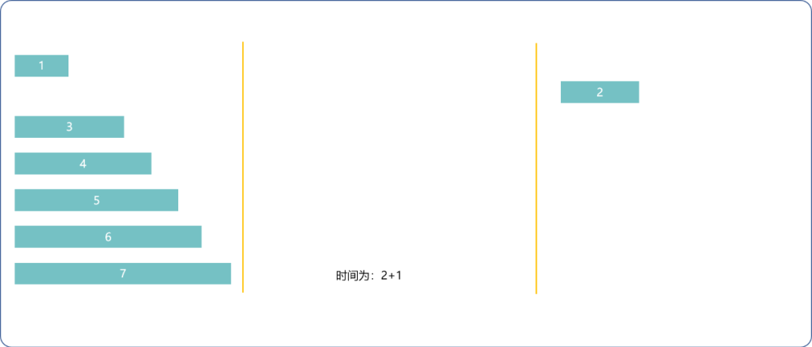

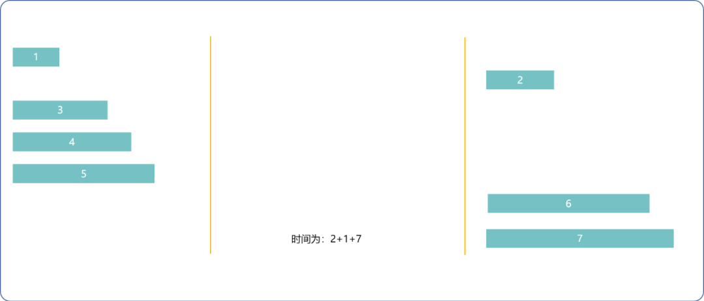

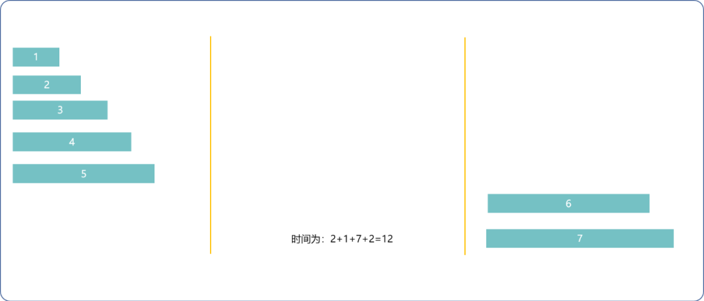

- 每次取两种方法的最小耗时，直到`n<=3`。

**编码实现：**

```cpp
#include <algorithm>
#include <iostream>
using namespace std;

//每个人的过河时间
int times[100];

/*
*初始化过河时间
*/
void initTimes(int size) {
 for(int i=0; i<size; i++) {
  cout<<"输入时间"<<endl;
  cin>>times[i];
 }
}

/*
*比较函数
*/
bool cmp(const int &i, const int &j) {
 return  i<j;
}

/*
*贪心算法计算过河最短时间
*/
int river(int size) {
 int totalTime=0;
 int i=0;
 int j=size-1;

 while(1) {
  if(j-i<=2)break;
  int t1=2*times[0]+times[j]+times[j-1];
  int t2=times[0]+2*times[1]+times[j];
  totalTime+=min(t1,t2);
  j-=2;
 }
 if(j==0)totalTime+= times[0];
 if(j==1)totalTime+= max(times[0],times[1] );
 if(j==2)totalTime+=times[0]+times[1]+times[2];

 return totalTime;
}

int main() {
 cout<<"过河人数:"<<endl;
 int size=0;
 cin>>size;
 initTimes(size);
 //排序
 sort(times,times+size,cmp);
 int res= river(size);
 cout<<"最短时间："<<res;
 return 0;
}
```

**输出结果：**

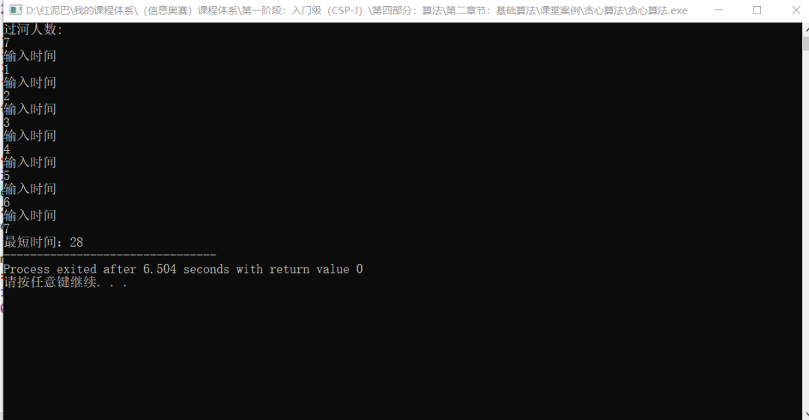

## 6. 总结

贪心算法在很多地方就可看其身影。如最短路径查找、最小生成树算法里都用到贪心算法。

贪心算法的关键在于以什么属性优先（贪心策略），这个选对了，后续实现都很简单。


