# C++不知算法系列之解析回溯算法中人文哲学


## 1. 前言

回溯算法让我想起“退一步海阔天空”的名言。当事情的发展到了绝境或是边缘时，可以试着后退一步，换一个方向、换一种策略，或许会看到新的出路或生机。

回溯算法的精髓：无所畏惧而不固执，善于在变通中迂回。故回溯算法也可称为试探算法。

万事万物之间必然相通而有共性，曲径相通，优秀算法思想中必也有人文哲学的韵意，想来，回溯思想是有”车到山前必有路“的励志！

本文通过几个案例，和大家一起聊聊，颇具有人生哲学韵味的回溯算法。

## 2. 深入回溯

### 2.1 递归回溯框架

回溯算法的流程如同下棋：

“举棋不定”这句成语源于下棋，缘何如此？因为每一步都有多个选择，不到最后无法知道哪一个选择是最好的，因而不定。

回溯算法告诉我们，没关系，勇敢走出每一步，确实走不下去了，后退一步，换一个选择。回溯的关键点是可以后退，但下棋是生活，定是“落棋无悔”的。

> Tips：有“落棋无悔”，也有复盘一说，下完后，可以讨论某一步如果怎样，结果又会怎样。这便是回溯。

回溯是思想，递归是手段，归功于递归的特性，它能让回溯思想优雅地得以自由驰骋。当然，能让这种思想落地的手段远不止递归。

本文在实现案例中的回溯过程都借助递归实现。如果一类问题均能通过回溯算法解决，则问题的本质一定相同，或可以透过问题的表征看到他们其实都是一个模样。

**递归回溯算法的框架一：**

```cpp
//搜索函数，参数往往是搜索的起点
int search(int k) 
{   
    //如同下棋，每一步都有多个选择，回溯说，没关系，从第一个选择开始吧！ 
 for(int i=1;i<=选择数;i++){
  if(满足条件){
            //如果选择可以，存储当前的选择，如同下棋，落子！
     保存结果
     if(搜索到目标){
              //如果胜利了，输出 
       输出解 
     } 
     else
              //继续下一步 
       search(k+1);
         //回溯的关键点，如同悔棋，起子，进入下次循环（重新选择）   
  回溯到上一步并且恢复状态   
  } 
 } 
}
```

**递归回溯算法框架二：**

```cpp
int search(int k){
 if (搜索到目的)
        输出解 
 else
        for (int i=l;i<=算符种数;i++)
         if (满足条件)
               { 
          search(k+ 1);
          回溯一步,恢复保存结果之前的状态
               }
}
```

### 2.2 案例剖析

#### 2.2.1 素数环

问题描述：把从`1`到`20`这`20`个数摆成一个环，要求相邻两个数的和是一个素数。如下图所示，要求第 `1` 个格间和最后 `1` 个格间是逻辑相连的。

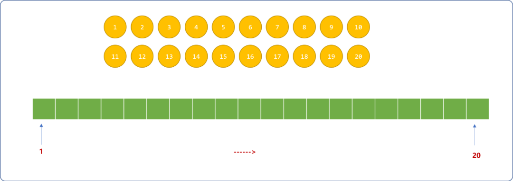

问题分析：任何问题的解决方案，绝对不止一种，但此问题绝对算得上是典型的回溯问题。

- 先在环的第 `1`个格间摆放数字 `1`。再从 `2~20`个数字中以试探的方法逐个选择，直到找到和左边数字相加为素数的数字，然后填充在第 `2` 个格间。

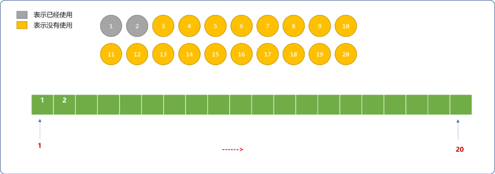

- 重复上述过程，继续在剩下的数字中选择一个符合条件的数字依次填充在环中空着的格间。如下为填到环中第 `5` 个格间时的演示图。

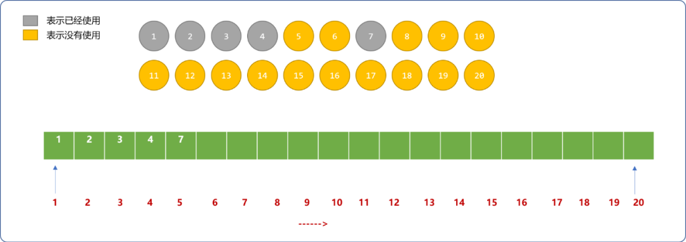

- 如下是填到环中第 `12` 个格间时的演示图。

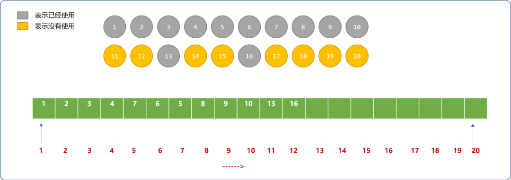

- 如下是填充完环中第 `19`个格间后的演示图，环中还有最后一个格间，数字也只剩下 `20`。因为 `20+19=39`不是一个素数，`20`这个数字无法填充至第 `20`格间。至此，是回溯算法展示其魅力的时候。

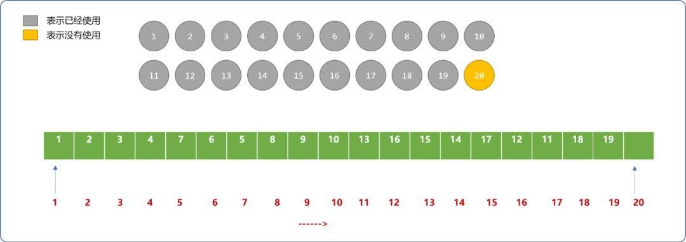

- 回退到第 `19`个格间的填充，恢复 `19`数字的自由，重新选择 `20`这个数字。

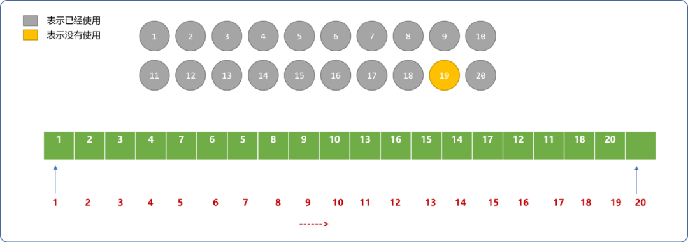

- 第 `20` 个格间只能选择`19`数字，还是不满足要求。需再次后退至第 `19`个格间的填充，因为第 `19`个格间用完了所有选择，只能再后退到第 `18`个格间的填充且恢复填在第 `18`格间的数字`18`的自由。

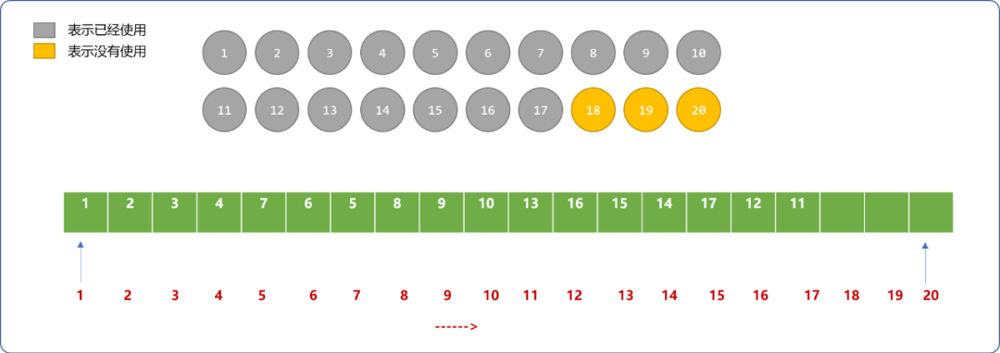

- 如下图为第一种正确的填充方案。并不是一次性填充成功，而是经过多次回溯、再选择方能找到正确答案。得到答案后，第 `20` 个格间又可以释放填入的数字，重新选择数字或回溯到上一个格间，寻找其它的可行答案。

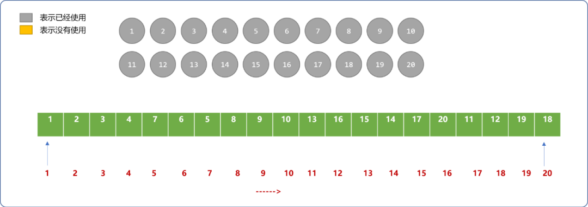

编程实现：

```cpp
#include <iostream>
#include <cmath>
using namespace std;
//保存1~20范围内的所有数字
int nums[21]= {0};
//标记数字是否已经使用
bool isUse[21]= {0};
//存储结果
int res[21]= {0};
//所有的方案
int total=0;
/*
*初始化
*/
void init() {
 nums[0]=0;
 for(int i=1; i<=20; i++)
  nums[i]=i;
}
/*
* 判断给定的数字是不是素数
*/
bool isSs(int num ) {
 for(int i=2; i<=int( sqrt( num ) ) ; i++ ) {
  if(num % i==0)return false;
 }
 return true;
}
//打印填充方案
void show() {
 cout<<"------------------------"<<endl;
 total++;
 for(int i=1; i<=20; i++)
  cout<<res[i]<<"\t";
 cout<<endl;
}
/*
*
* 递归回溯搜索
* 参数 pos 表示环中的某一个位置
*/
void search(int pos ) {
 int sum=0;
 //每一个位置都有 20 个数字可以填充
 for(int i=1; i<=20; i++) {
  sum= nums[i]+ res[pos-1];
  if(!isUse[i] && isSs(sum) ) {
   //满足条件(可用且和左边数字相加为素数),保存结果
   res[pos]=i;
   //标志此数字已经使用
   isUse[i]=true;
   //是否搜索完毕
   if(pos==20) {
    //第 20 个格间的数字还需要保证和第 1 个格间中的数字相加的和为素数
    sum=res[20]+res[1];
    if( isSs(sum )) {
     show();
     //因方案较多，只选择前 10 个方案
     if(total==10)return;
    }
   } else {
    search(pos+1);
   }
   //回溯的关键，后退后，需要恢复已经填充数字的自由
   isUse[i]=0;
  }
 }
}
//测试
int main(int argc, char** argv) {
 init();
 search(1);
    return 0;
}
```

输出结果：

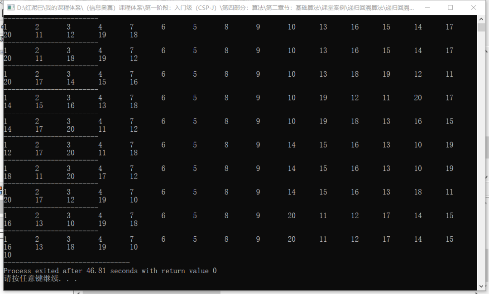

#### 2.2.2 排列

问题描述：现有 n 个整数，从中任意取出 m 个数进行排列（m<n），请列出所有排列。

本题是一个排列问题，如果使用穷举法，不仅代码臃肿不堪，且因 `n` 和 `m` 不确定，很难做到动态适应。如果运用回溯算法，则能让代码具有足够的动态性。

前文的”素数环“本质也是一个排列的问题，可以认为是对`1~20`个数字进行全排列，然后筛选出相邻数字为素数的排列。

则删除`素数环`问题中`相邻数字和为素数的验证`的代码，便是排列案例的代码。

```cpp
#include <iostream>
#include <cmath>
using namespace std;
//从 10 个数字中选择 5 个数字的所有排列
int nums[11]= {0};
//标记数字是否已经使用
bool isUse[11]= {0};
//排列个数
int total=0;
//选择的数字个数
int m=5; 
//存储结果
int res[5]= {0};
/*
*初始化
*/
void init() {
 nums[0]=0;
 for(int i=1; i<=10; i++)
  nums[i]=i;
}
//打印方案
void show() {
 cout<<"------------------------"<<endl;
 total++;
 for(int i=1; i<=5; i++)
  cout<<res[i]<<"\t";
 cout<<endl;
}
/*
*
* 递归回溯搜索
* 参数为位置
*/
void search(int pos ) {
    //每一个位置都有 10 个数字可以填充
 for(int i=1; i<=10; i++) {
  if(!isUse[i]) {
   //只要数字没有选择过
   res[pos]=nums[i];
   //标志此数字已经使用
   isUse[i]=true;
   //是否搜索完毕
   if(pos==m) {
    show();
   } else {
    search(pos+1);
   }
             //回溯时，恢复状态
   isUse[i]=0;
  }
 }
}
int main(int argc, char** argv) {
 init();
 search(1);
 cout<<"10 个数字中选择 5 个数字的排列个数："<<total;
 return 0;
}
```

**输出结果：**

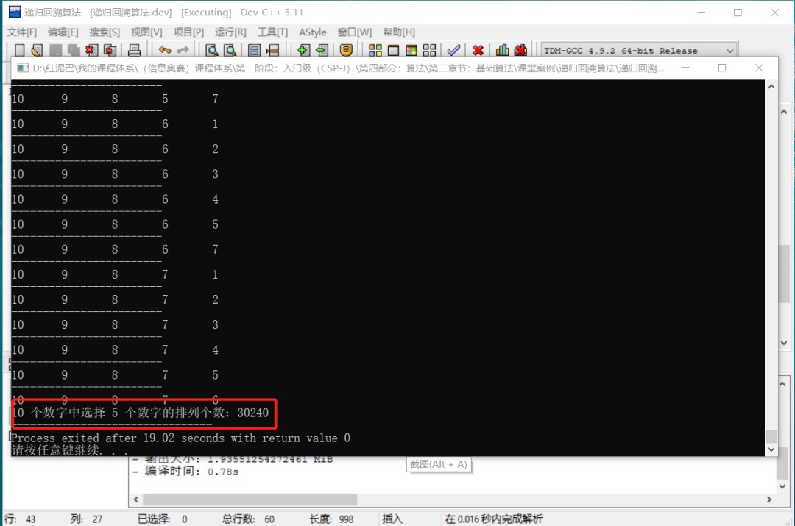

`10`个数字中任意选择`5`个数字的排列个数可以套用排列公式计算：`10!/5!=30240`。和递归回溯求出来的结果一样。

#### 2.2.3 拆分数字

问题描述：任何一个大于 `1` 的自然数 `n` ,可以拆分成若干个小于 `n` 的自然数之和，输入一个数字 ，输出所有组合。

算法解析流程：如下演示如果输入数字 `8`，求解答案的过程。会发现，和“素数环”问题有同工异曲之处。

- 输入数字 `8`，则可供选择的数字为`1~7`这 `7` 个数字，这里需知道所有求解中有一个最基本的答案，即 `8`可以是`8`个 `1`相加，则环的大小最大为 `8`个格间。

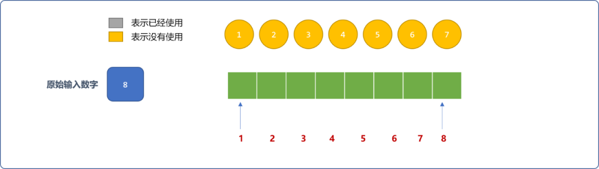

- 在第 `1` 个格间填充数字 `1`。则原始输入数字的值需缩减成为`8-1=7`。问题变成求 `7`的所有组合。


- 在第 `2`个格间填入数字`1`，这里和`素数环`问题中的不一样，数字可以重复使用，但要求必须小于等于缩减后的数字。当然，完全可以根据需要，让数字不可重复。


- 重复前面的过程，直到原始数字的值变为 `0`。便可得到第 `1` 个求解。


- 得到第 `1` 个求解后，可以继续为第 `8` 个格间选择除 `1` 之外的其它数字，很遗憾，不再有任何数字能满足这个要求。回溯到第 `7` 个格间，这是很重要的一点，与"素数环"的回溯不同，这里是恢复缩减值，没有恢复原来使用过的值。

  为什么？后面通过代码解释。

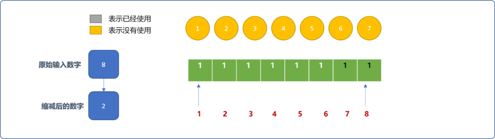

- 为第 `7` 个格间重新选择除 `1` 之外的其它数字，`2` 是符合要求。和`素数环`问题不同之处，不需要把所个格间填满，只要满足原始值缩减后为 `0`即可。


编程实现：

```cpp
#include <iostream>
#include <cmath>
using namespace std;
//存储结果 ，初始值为 1
int res[100]= {1};
//存储输入
int num;
//总个数
int total=0;
/*
*查找后，输入结果
*/
int print(int pos) {
 cout<<num<<"=";
 for(int i=1; i<pos; i++) {
  cout<<res[i]<<"+";
 }
 cout<<res[pos]<<endl;
 //计数
 total++;
}

/*
*递归回溯算法
*target:目标数字
*pos:位置
*/
void search(int target,int pos ) {
 //每一个位置都有 1~target 个选择
 for(int i=1; i<=target; i++  ) {
  if(i==num)continue;
  res[pos]=i;
  target-=i;
  if(target==0)print(pos);
  else search(target,pos+1);
  target+=i;
 }
}
int main(int argc, char** argv) {
 cin>>num;
 search(num,1);
 cout<<num<<"可以拆分成 "<<total<<" 个表达式"<<endl;
 return 0;
}
```

输出结果：

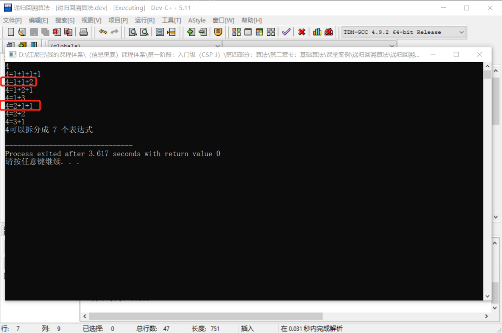

结果里面会有很多重复的表达式。

**为什么会这样？**

原因很简单，如果相邻 `2` 个格间中的数字 `1,2`的顺序是满足条件的， 回溯后，前面会重填 `2`，因为后面的格间又是从 `1` 开始试探性选择，显然`1`是满足的。会现出`2,1`同要满足条件。

**如何删除这些重复的方案？**

只需要让后续格间的数字用前格间的数字作为起点！如`1,2`满足条件，回溯后，前面会重填`2`，因后面格间的值要以前面格间中的值为起点，所以 `1` 不会被选择。

```cpp
//省略，在搜索函数中修改 i 的起点
void search(int target,int pos ) {
 //每一个位置都有 1~target 个选择
 for(int i=res[pos-1]; i<=target; i++  ) {
  if(i==num)continue;
  res[pos]=i;
  target-=i;
  if(target==0)print(pos);
  else search(target,pos+1);
  target+=i;
 }
}
//省略……
```

**输出结果：**

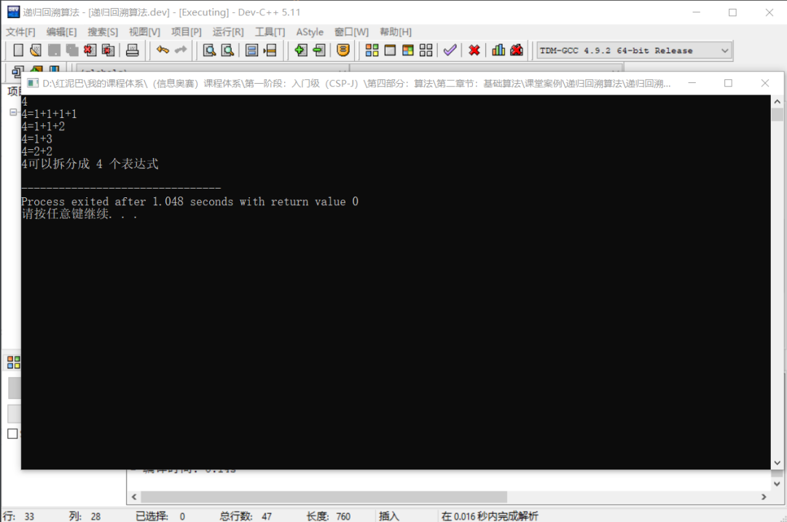

#### 2.2. 4 八皇后问题

问题描述：在一个`8` 行`8` 列的棋盘上，有 `8` 个皇后，请问让这 `8` 个皇后不在同一行、不在同一列、不在所有对角线上的摆放方式有多少种？

问题分析：

`素数环`可认为是把合适的值填充到一维数组中，八皇后问题可认为是把数字填充到二给数组中。

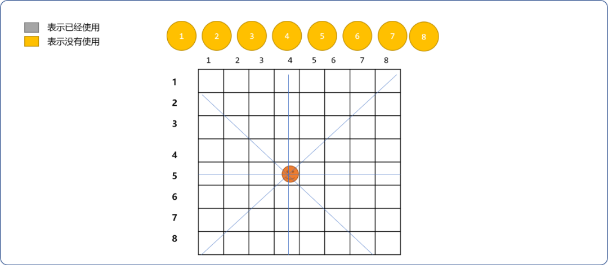


先可以从二维数组的 `(1，1)`格间开始填充，有 `8` 种选择，且必须保存同一行、同一列、所有对角线上没有其它皇后。

- 同一行，即行号相同位置。
- 同一列，即列号相同位置。
- `/` 对角线，即行号加列号的值相同。`\`对角线，即行号减列号的绝对值相等。

除此之外，和前面案例的求解过程相似。

```cpp
#include <iostream>
#include <iomanip>
#include <cmath>
using namespace std;
//二维数组，用来存储皇后位置
int nums[9][9]= {0};
//记数
int total=0;
int show() {
 total++;
 for(int i=1; i<9; i++) {
  for(int j=1; j<9; j++) {
   if( nums[i][j]!=0 ) {
    cout<<"("<<i<<","<<j<<")"<<nums[i][j] <<"\t";
   }
  }
 }
 cout<<"\n-----------------"<<endl;
}

/*
*判断位置是否符合要求
*/
bool isExist(int row,int col) {
 for(int i=1; i<9; i++) {
  for(int j=1; j<9; j++) {
   //同一行
   if(i==row && nums[i][j]!=0)return false;
   //同一列
   if(j==col && nums[i][j]!=0)return false;
   //对角线一
   if( (row+col)==(i+j) &&  nums[i][j]!=0 )return false;
   // 对角钱二
   if ( row>=col  && (row-col)==(i-j)   &&    nums[i][j]!=0 )return false;
   if ( row<col  && (col-row)==(j-i)   &&   nums[i][j]!=0  )return false;
  }
 }
 return true;
}
/*
*按行扫描遍历二维数组
*
*/
void search(int row) {
 for(int col=1; col<=8; col++) {
  if( isExist(row,col) ) {
   //如果位置可用
   nums[row][col]=col;
   if(row==8) {
    show();
   } else
    search(row+1);

   nums[row][col]=0;  
  }
 }
}
int main(int argc, char** argv) {
 search(1);
 cout<<"\共有"<<total<<"种摆放方案！";
 return 0;
}
```

**输出结果：**

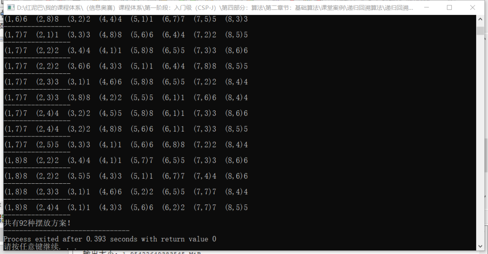


如上代码，可以使用一维数组替换二维数组。

## 3. 总结

古人云：人生如棋，落子无悔。但人生终也不能墨守成规，如遇到困难，不妨退一步试试，也许会柳暗花明。回溯算法告诉我们，恰到好处的后退也能到达最后目的。


