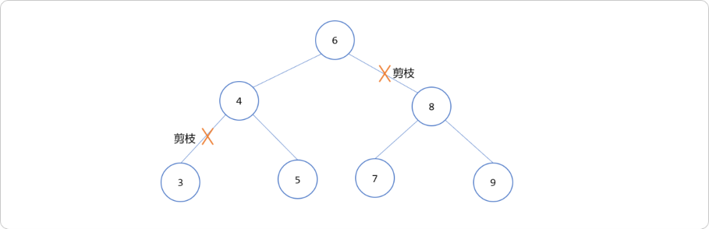
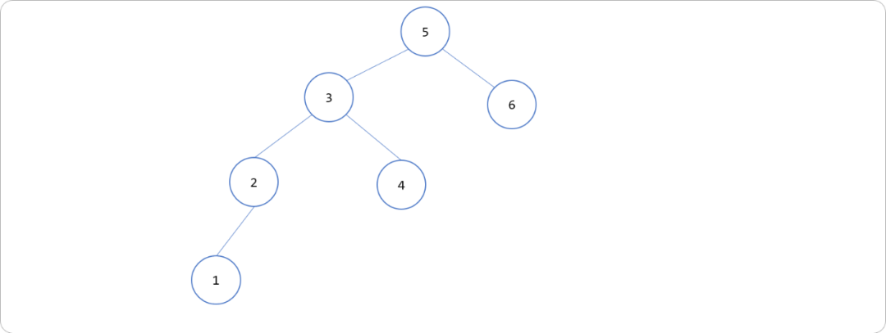
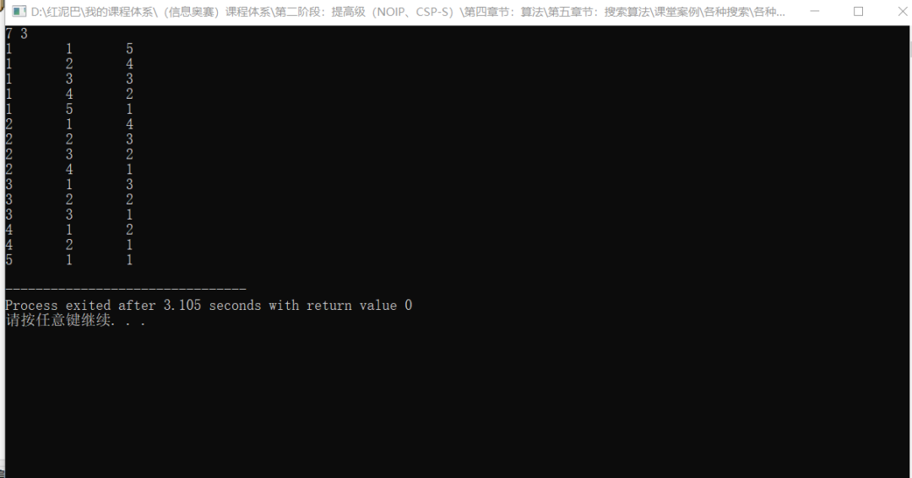
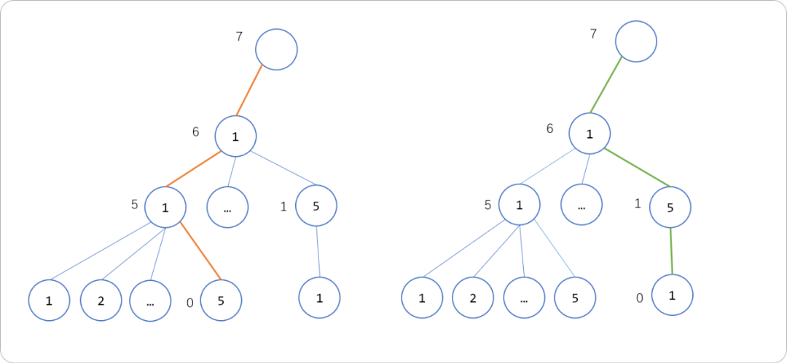
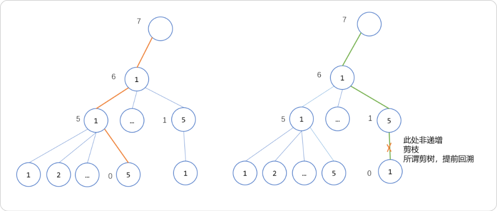
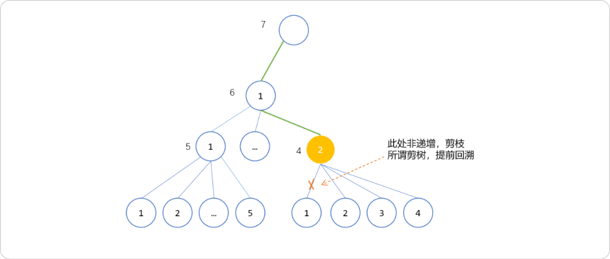
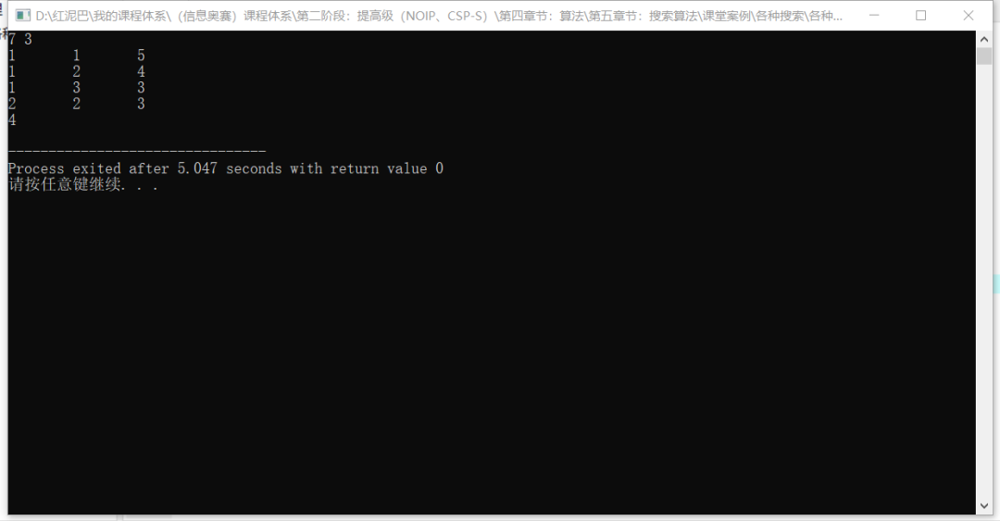
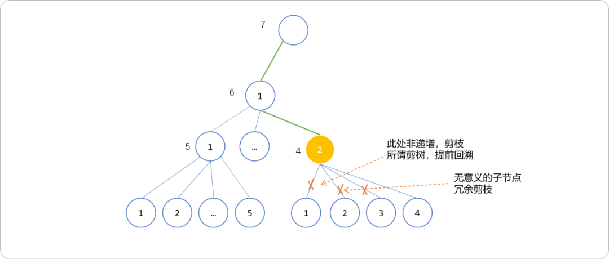
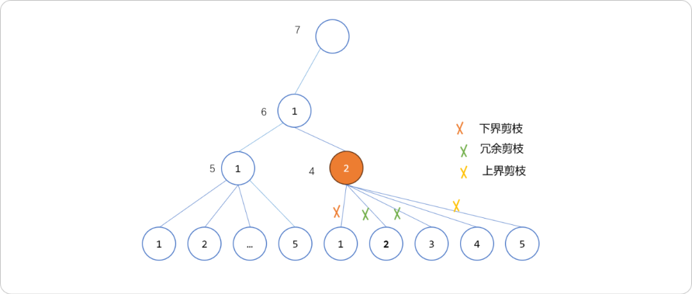

# 不搜索，无问题。冗余、上下界剪枝


## **1. 搜索算法**

计算机解决问题的抽象流程是，先搜索，或完全搜索后得到答案，或边搜索边找答案。所以，对给定的数据集进行搜索是解决问题的前置条件。不搜索，无问题。

搜索算法无非就是线性、二分、深度、广度搜索算法。其它的搜索算法的底层逻辑也是建立这`4` 种之上的。如双向广度搜索、启发式搜索……均是对原生搜索算法进行了优化。

计算机是穷举思维，解决任何问题的基本套路总结为：一、确定搜索范围； 二、在搜索过程中处理问题。所以解决任何问题都是基于两大核心逻辑：

- 搜索逻辑。
- 筛选逻辑。

在数据集不大情形下，可以简单粗暴。而数据集一旦暴增，就需要从时间度上提升搜索的性能。所以，算法的设计无非也是从两方面下手：

- 减少搜索范围，把无意义的搜索跳过。提高算法的性能就是把穷举变成有限控制。
- 提升处理问题的逻辑。如求解`1-100`之间的质数，可以从`1`搜索到`100`，而实际上偶数不可能是质数，所以可以只搜索奇数，这是减小搜索范围，算是搜索优化。不是所有的奇数都是质数，所以，还需要提供判断逻辑。判断一个数字是不是质数的方案有很多，就需要设计一个性能较优秀的方案，这算是筛选逻辑。

不同的数据结构，均有适用于此结构的搜索算法。如线性数据结构中，常使用线性和二分搜索。二分搜索是对线性搜索的升级，减少搜索范围。设计优秀的算法，可以提升性能，也会有其它方面的代价付出。如二分搜索，就需要付出排序代价。所以，算法没有绝对的好与坏，一切看应用场景。

> **Tips：** 不要绝对化某种搜索算法应用领域。如二分算法本质是一种搜索思想，即可用于线性数据结构，也可以用于树、图结构中。

树、图论中的搜索无非就是深度与广度搜索算法，其本质是线性搜索，只是不是直线，而是曲线。当数据结构异常庞大时，搜索的代价非常昂贵。此时，可以在搜索的过程中对算法进行一些优化。常用优化方案有：

- 排除等效冗余：如果能够判定从当前节点上沿着几条不同分支到达的子树是等效、或者某条分支是没有必要的，那么只需要对其中的一条分支执行搜索。

  如在搜索树中进行搜索时，在如下排序树中搜索数字`5`是否在树中时，根据搜索树的特点，可以剪枝根节点右子树。其本质就是二分搜索算法思想，所以，二分搜索算法也是一种剪枝操作。

  

- 

- 上下界剪枝：判断继续搜索能否得出答案，如果不能直接回溯。在搜索过程中，即使对当前状态进行检查，如果发现分支已经无法到达递归边界，就执行回溯。从深度搜索的角度而言，从左到右排除不必要的子节点。把左、右边界向内缩进。

- 最优性剪枝：最优性剪枝，是一种重要的搜索剪枝策略。它记录当前得到的最优值，如果当前结点已经无法产生比当前最优解更优的解时，可以提前回溯。

- 记忆化：记录每个状态的搜索结果，在重复遍历一个状态时直接检索并返回。这种方案使用较广泛。

## **2. 搜索优化**

下面通过几个案例，讲讲几种优化方案的细节。本文主要是讲解基于深度搜索的优化。先要理解深度搜索的过程，从一个节点出发，找到所有的子分支，然后一条分支一条分支进行搜索。在不同的应用需求下，可能会出现某些分支上的信息无用，减少对这些无用的分支的搜索，就实现了优化。

无论那种优化，都是基于这个原则，找到不需要搜索的分支，把之从搜索队列中删除。所谓冗余、上下界……仅是在思考剪去那些分支。

### **2.1 冗余剪枝**

排序树具有显著的左小右大特点。利用此特点可以剪去左子树或右子树。

**寻找第 K 小的元素**

给定一个二叉搜索树，查找其中第`k`个最小的元素。如下图中第 `3` 个最小元素是`3`，第`4`个最小元素是`4`……



直观解题思想，把数列由小到大排序，然后查找第`k`个值即可。搜索树的中序遍历能对整个棵树进行排序，可以在中序遍历过程中，确认出所需要答案。时间复杂度为`O(n)`。如下是标准的中序遍历代码。

```c
// 记录结果
int res = 0;
// 记录当前元素的排名
int rank = 0;
void midOrder(TreeNode root, int k) {
    if (root == null) {
        return;
    }
    midOrder(root.left, k);
    /* 中序遍历代码位置 */
    rank++;
    if (k == rank) {
        // 找到第 k 小的元素
        res = root.val;
        return;
    }
    midOrder(root.right, k);
}
```

在搜索过程中，是否有剪枝操作？

没有，中序遍历本质是对整棵树的遍历，类似于线性搜索。也许问题的答案需要在搜索完整棵树后才能找到，时间复杂度为`O(n)`。不算高，但是没有充许利用到排序树的特点，因为可以表现的更优秀。

比较时，如果已经知道当前节点的序号，则可以剪技。

假设查找排名为`k`的元素，当前节点的排名为`m`，则可得到如下结论：

- 如果`m == k`，显然就是找到了第`k`个元素，返回当前节点就行了。
- 如果`k < m`，那说明排名第`k`的元素在左子树，所以可以去左子树搜索第`k`个元素。
- 如果`k > m`，那说明排名第`k`的元素在右子树，所以可以去右子树搜索第`k - m - 1`个元素。

当然，这个需要在构建和删除搜索树时，维护好每一个节点的序号。

### **2.2 上下界剪枝**

**分解整数**

**题目描述：** 任意一个整数`n`都能被分拆成另几个整数（可以相同）相加的结果，现指定分拆的个数`k`。要求`k`不能为`0`，且分拆时与顺序无关。

例如：输出`n=7,k=3` ，下面的三种分法被认为是相同的。问有多少种不同的分法。

```cpp
1  1  5
1  5  1
5  1  1
```

**输入格式：**

输入整数`n`，欲分解的个数`k`。

**输出格式：**

一个整数，即不同的组合方案数。

**样例输入：**7 3

**样例输出：**4

**样例分析：**

将`7`分拆成另`3`个数字（不能为`0`）相加的结果，不考虑顺序数字可以重复，其有效的组合有如下几种情况。

```cpp
1 1   5
1   2   4
1   3   3
2   2   3    
```

**算法分析：**

此题本质是组合类型，`n`个数字中选择`k`个数字，与纯粹的组合又不同，对组合的数字有限制，即相加结果为`n`。可以使得回溯算法找出所有可能。

**直接套用回溯算法框架：**

```c++
#include <iostream>
using namespace std;
//记录结果，本题只需要方案个数，此数组可以不用
int res[100]= {0};
//整数
int n,k;
//显示结果，本题其实不需要显示，为了更好的验证结果
void show() {
 int s=0;
 for(int i=1; i<=k; i++) {
  cout<<res[i]<<"\t";
 }
 cout<<endl;
}
/*
*深度搜索 tg:分解的数字 pos:第几次分解，也可以理解为递归的深度。最后 k 层
*/
void dfs(int tg,int pos) {
 for(int i=1; i<=tg; i++) {
        //选择
  res[pos]=i;
        //目标减少
  tg-=i;
  if( pos==k &&  tg==0 ) {
            //深度为k 且不能再分解
   show();
  } else {
            //继续搜索
   dfs(tg,pos+1);
  }
        //回溯
  res[pos]=0;
  tg+=i;
 }
}
int main(int argc, char** argv) {
 cin>>n>>k;
 dfs(n,1);
 return 0;
}
```

测试结果中有重复组合结果。



重复的结果是如何搜索到的？道理很简单，对于任何一个结点，在向下搜索时，其搜索范围都是由`1~目标值`。下图中，节点外面的值表示目标值，即需要分解的整数，每选择一个节点后，其目标不值就会做相应减少。节点上的值表示可选择值，即可拆分的值。当搜索到某个节点上的目标值为`0`时，意味本次搜索找到了答案。



上图中红色和绿色深度搜索线得到的结果其实是一个结论。可以剪掉红色或绿色线。

怎么设计剪树算法？

重复在于对于任意给定的几个数字，无论怎么排列，只选择一个即可。几个数字的排列，必然有非严格单调递增的情况，可以选择这个，排除其它的。

如 `1，4，2`三个数字，有`1,2,4 / 2，1，4/4，1，2/1，4，2/2，4，1/4，2，1`几种情况， 可以选择其中`1,2,4`这个情况。即，在每次搜索时，都保持深度搜索线上的节点以非严格递增趋势发展，否则剪此分支。如下图，红色深度搜索线上的节点`1,1,5`是递增的。绿色线不是，则剪枝。



进入如下图黄色节点时，理论上可选择子节点有`1,2,3,4`，因要保持递增式，所以子节点的可以从比`2`大的值开始，就是所谓的下界剪枝。



方法一：把上次的选择传递到当前节点。当前运行时，如果选择的值少于上一次选择的，剪枝，不进行搜索。

```c
// idx: 记录上次调用时选择的数字
void dfs(int tg,int idx, int pos) {
 for(int i=1; i<=tg; i++) {
        //如果本次选择的数字小于上次选择的数字，直接忽视
  if( i<idx )continue;
        //选择数字
  res[pos]=i;
        //原数字缩小
  tg-=i;
  if( pos==k &&  tg==0 ) {
   c++;
   show();
  } else {
   dfs(tg,i,  pos+1);
  }
  res[pos]=0;
  tg+=i;
 }
}
```

再测试一下，可以得到正确答案。

```c
int main(int argc, char** argv) {
 cin>>n>>k;
 dfs(n,1,1);
 cout<<c<<endl;
 return 0;
}
```



方法二：直接从存储的结果中找出上一次的选择，从上一次选择开始。

```c
void dfs(int tg, int pos) {
 for(int i=res[pos-1]; i<=tg; i++) {
  res[pos]=i;
  tg-=i;
  if( pos==k &&  tg==0 ) {
   c++;
   show();
  } else {
   dfs(tg, pos+1);
  }
  res[pos]=0;
  tg+=i;
 }
}

int main(int argc, char** argv) {
 cin>>n>>k;
 res[0]=1;
 dfs(n,1);
 cout<<c<<endl;
 return 0;
}
```

冗余剪枝分析。

还是以下图为例，因只需要保证选择的值相加为最初设定的目标值，此处为`7`，对于黄色节点`2`而言，其子节点`2、3`的选择是无意义，可以剪枝，冗余子节点的剪枝条件是当深度到达`k`，但值不等于目标值时。



```c
void dfs(int tg, int pos) {
 for(int i=res[pos-1]; i<=tg; i++) {
  res[pos]=i;
  tg-=i;
  if(pos==k && tg!=0) {
   //冗余剪枝
   res[pos]=0;
   tg+=i;
   continue;
  }
  if( pos==k &&  tg==0 ) {
   c++;
   show();
   break;
  } else {
   dfs(tg, pos+1);
  }
  res[pos]=0;
  tg+=i;
 }
}
```

上界剪枝分析。如下图所示，大于黄色节点的目标值的子节点都是没有必要访问的，因为前面已经选择了`1、2`其和为`3`。目标值缩小到`4`，最后只需要选择`4`就可以了。



在深度搜索函数的`for`代码里面，就已经把上界设定为节点的目标值。

简单的上界剪枝，当前找到后，直接`break`。

```c
void dfs(int tg, int pos) {
    //tg 就是用来进行上界剪枝
 for(int i=res[pos-1]; i<=tg; i++) {
  res[pos]=i;
  tg-=i;
  if( pos==k &&  tg==0 ) {
   c++;
   show();
             //既然已经找到，再重复意义不大。也算是上界剪枝
   break;
  } else {
   dfs(tg, pos+1);
  }
  res[pos]=0;
  tg+=i;
 }
}
```

**每次深度搜索时，都是从`1`到目标值这个区间内进行搜索（比如目标值为 7时，搜索范围为1~7，目标值为`6`时，搜索范围为`1~6`）， 缩短这个范围，即把左、右边界向内压缩。即称为上下界剪枝。**

## **3. 总结**

本文讲述了如何在深度搜索时，减少搜索分支，即剪枝优化。可以从多方面优化。本文主要讲解冗余剪枝，即把无用的分支跳过。另就是上下边界剪枝。下指从所有子节点中找到最贴近的起始节点，上界从从所有子节点中找出最佳的结束节点。


