# C++算法主题系列之论递归回溯算法与原始穷举算法的一致性


## 1. 前言

本文将和大家一起聊聊`递归回溯算法`和`原始穷举算法`的内在关系，目的是透过现象看本质，深入理解回溯算法的内在，让你真真切切看清楚其真实面貌，而不仅仅限于套用算法模板。

回溯算法适用于如下的问题域：

- 问题可以分解成多个步聚。
- 每一步可有多个选择。
- 求解此问题的多种方案。

如果求解某问题共需要 `n`个步骤、而每一步可有的选择为`m`，根据乘法原理，则符合问题的方案应该有 `n*m`。如下图所示：

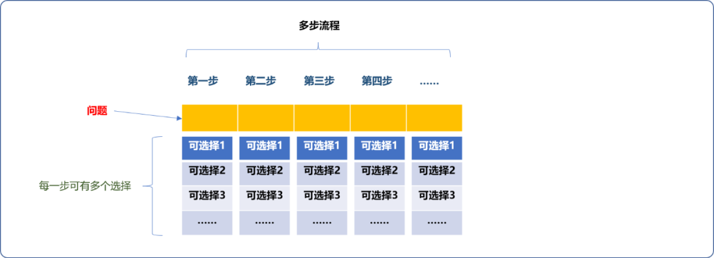

**数学上的排列组合问题便是典型的此类问题。**

排列问题描述：如从 `1,2,3,4,5` 这 `5` 个数字中选择` n(n<=5)` 个数字进行重新排列，请问共有多少排列方案，当`n=5`时称为全排列。

本文将从求解全排列的原始穷举算法开始，一路讨索原始穷举算法和回溯算法之间的一致性。这里的一致性是说回溯算法本质就是原始穷举算法，当然，两者之间会有思想层面的差异性。

## 2. 原始穷举算法

**什么是原始穷举算法？**

理论上讲，算法只有一种，便是穷举，但是，人是智慧性的，可通过发现待处理数据之间的逻辑关系，从而设计方案，减少穷举的次数。

原始穷举算法也是一种静态处理算法。

**静态这里又做何解释？**

不急，且先看如何使用原始穷举算法求解 `1,2,3,4,5` 这几个数字的全排列。

穷举的基本思想是先确定数据范围，然后对其进行筛选。`5`个数字的全排列穷举算法实现流程如下：

- 无论是哪一种排列方案，都需要找齐 `5` 个数字，说明每一种方案都需要分 `5` 步。如下图所示，每一次需要填满如下 `5` 个格间方算找出一种方案。

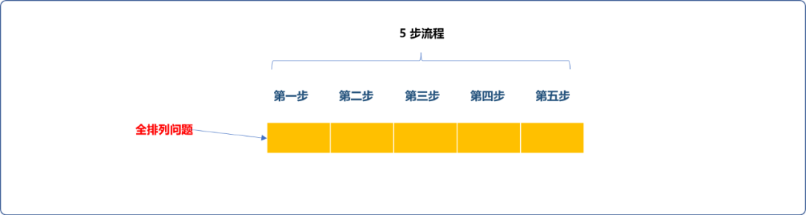

- 第一步可以从`1,2,3,4,5` 中选择出一个数字。如下图先选择数字 `1`。

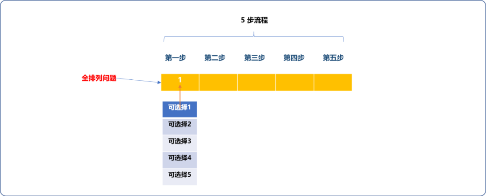

- 因全排列数字不能重复使用，故第二步只能从没有选择的数字中再选择一个。

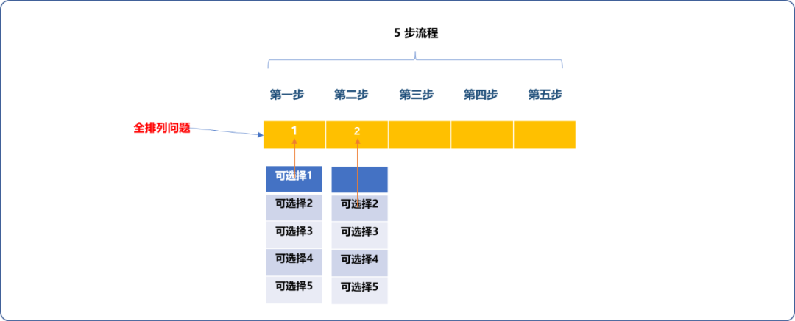

- 如此思想，继续完成后续步聚。

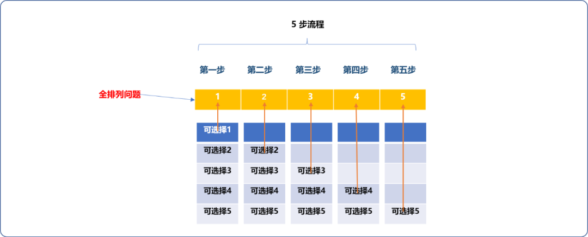

**如何编码实现？**

必然是循环和条件分支语句上场，循环用来确定能查找的数字范围，条件分支进行筛选。

```cpp
#include <iostream>
using namespace std;
int main(int argc, char** argv) {
 //统计总方案数量
 int count=0;
 //第一步可供选择数字范围为 1,2,3,4,5
 for(int i=1; i<=5; i++) {
  //确定第二步数字，可供选择数字范围为 1,2,3,4,5
  for(int j=1; j<=5; j++) {
   //因不能重复使用，需要排除
   if( j== i )continue;
   //第三步可供选择数字范围为 1,2,3,4,5，需要排除前面使用的
   for(int k=1; k<=5; k++) {
    if(k==j || k==i )continue;
    //第四步可供选择数字范围为 1,2,3,4,5，需要排除前面使用的
    for(int m=1; m<=5; m++) {
     if(m==j || m==i || m==k )continue;
     //第五步可供选择数字范围为 1,2,3,4,5，需要排除前面使用的
     for(int n=1; n<=5; n++) {
      if(n==j || n==i || n==k || n==m )continue;
      //计数
      count++;
      //到此，可以输出
      cout<<i<<" "<<j<<" "<<k<<" "<<m<<" "<<n<<endl;
     }
    }
   }
  }
 }
 //输出总方案数量
 cout<<"共有:"<<count<<"种方案"<<endl;
 return 0;
}
```

**输出结果：**

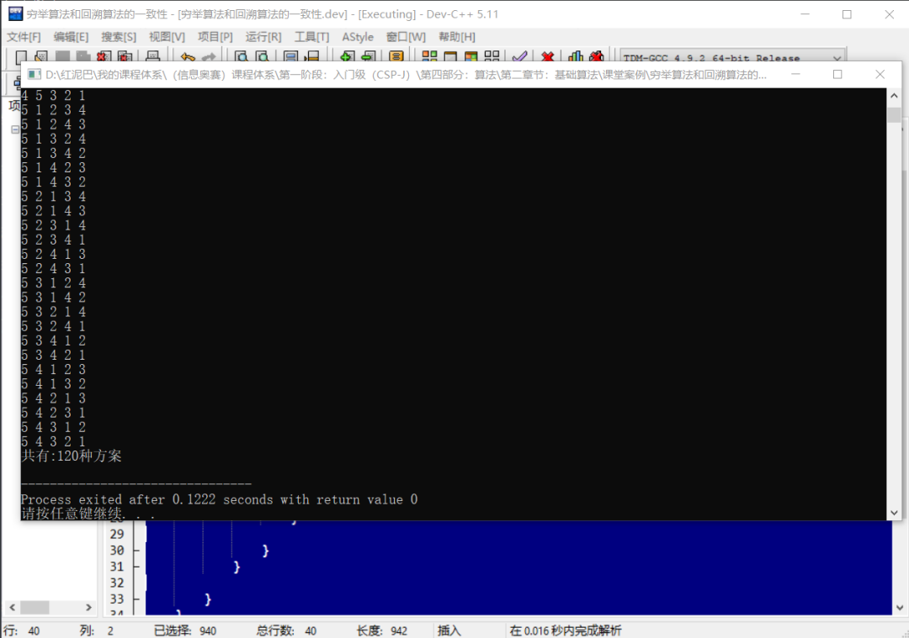

至此，解决了全排列问题，但是，有 `2` 个问题值得思考。

**你是否看到了上述代码里有回溯？**

> **Tips：** 所谓回溯，指结束当前步聚，回到上一步，再次开始。

可认为代码中的每一个循环语句对应了问题中的每一步聚。如下图当第 `5` 次循环语句（第 `5` 步）结束后，会回溯到上一步，即第四步（第四个循环语句）。

> **Tips：** 循环嵌套的特性：内层循环结束，重新进入外层循环判断，如果外层循环满足条件可以继续，新一轮内层循环也将开始。

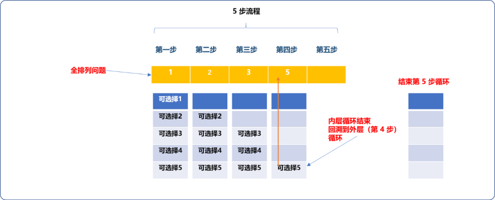

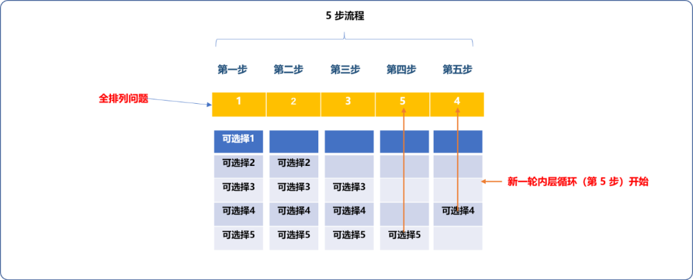

同理，如果第四步（第 `4` 个循环语句）结束，会回溯到第 `3` 步(第 `3` 个循环语句)。一旦第三步确定好新数字，第四步和第五步会重新开始。如此反复，一步一步向上回溯再向下重新开始，便能找出所有方案。

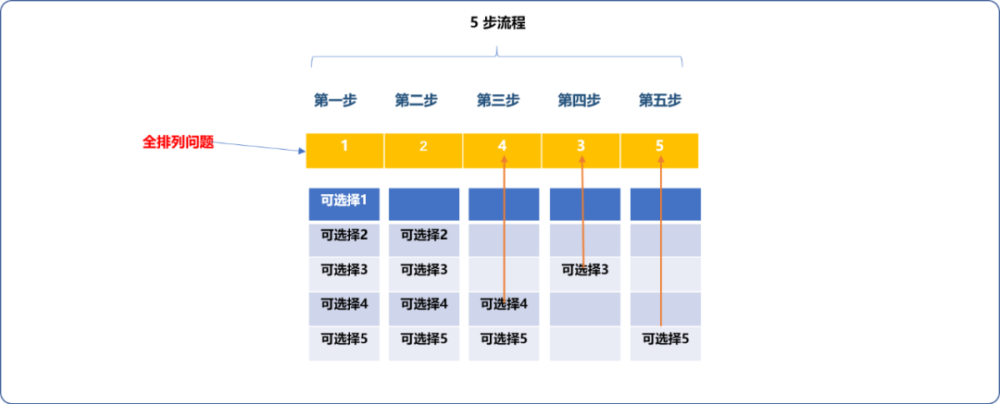

**思考后的结论：**

- 循环嵌套自带有回溯能力。
- 根据循环嵌套的特点，所有循环次数的乘积便是最终求解的次数，可知第一步可供选择数字有 `5` 个，第二步有 `4`个，第三步有 `3`个，第四步有 `2`，第 `5` 步有 1 个。共计方案数为 `5*4*3*2*1=120`种，和代码输出结论一样。

**再思考第二个问题：**如果求 `1,2,3,4,5,6`此`6`个数字的全排列，或更多个数字的全排列又该如何？

显然，无法让上述代码在运行时，同时实现求 `1~5`数字和`1~6`数字的全排列，除非写 `2` 份代码。上文说过，原始穷举算法是静态的，**所谓的静态性就在此，代码仅局限于一个具体问题的求解，而不是一类问题的求解。**

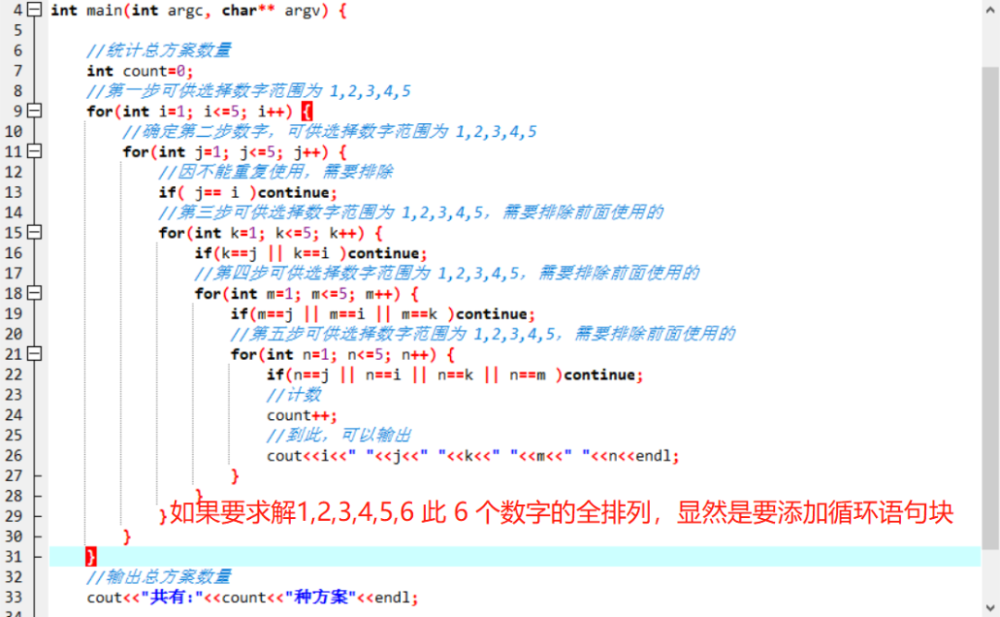

## 3. 递归回溯算法

自然的想法，代码必须能根据问题需求动态扩展循环语句块，会让我们想到递归。

**递归实现全排列动态化的流程：**

- 先实现在 `1~5`这`5`个数字中选择 `1` 个数字的排列方案。这是一个很简单的子问题，一个循环语句块就能解决。

```cpp
#include <iostream>
using namespace std;
/*
* pos:描述需要排列的数字个数
* 此函数本质就是封装了循环语句结构
*/
void fillNumber(int pos){
 for(int i=1;i<=5;i++){
  cout<<i<<"\t";
 }
} 
//测试
int main(int argc, char** argv) {
 fillNumber(1);
 return 0;
}
```

- 如果要在`1~5`个数字中选择 `2` 个数字进行排列。根据前面的理论，可以使用循环嵌套。

  因`fillNumber`函数就是封装了循环语句的函数，如果让函数自己调用自己，不仅实现了循环嵌套，而且还是动态嵌套，甚至可以无限制的嵌套。

  **至此，便实现了动态扩展循环语法结构，想来，真是一件让人兴奋的事情。**

```cpp
void fillNumber(int pos){
 for(int i=1;i<=5;i++){
  cout<<i<<"\t";
  //递归式的循环嵌套 
  fillNumber(pos+1);  
 }
 cout<<endl;
} 
```

- 递归是需要有出口的，这里的限制很简单。如果`5` 个数字中选择 `2` 个数字，只需要 `2` 层循环嵌套便可。

  递归函数仅实现了动态循环嵌套，依然要遵循排列逻辑，仅当第一个数字和第二个数字确定后方能输出。

  因递归是函数间调用，上一级函数中的循环语句块中选择的数字要在下一级函数的循坏中使用，要么使用参数传递，要么使用全局变量。

**如下使用参数传递方案：**

```cpp
#include <iostream>
using namespace std;
/*
* pos:描述需要排列的数字个数
* num:已经在上一轮中选择好的数字
*/
void fillNumber(int pos,int num) {
 for(int i=1; i<=5; i++) {
  if(pos==2)
   //选择好了 2 个数字，递归出口，输出
   cout<<num<<":"<<i<<endl;
  else {
   //递归式的循环嵌套
   fillNumber(pos+1,i);
  }
 }
}
//测试
int main(int argc, char** argv) {
 fillNumber(1,0);
 return 0;
}
```

输出结果：

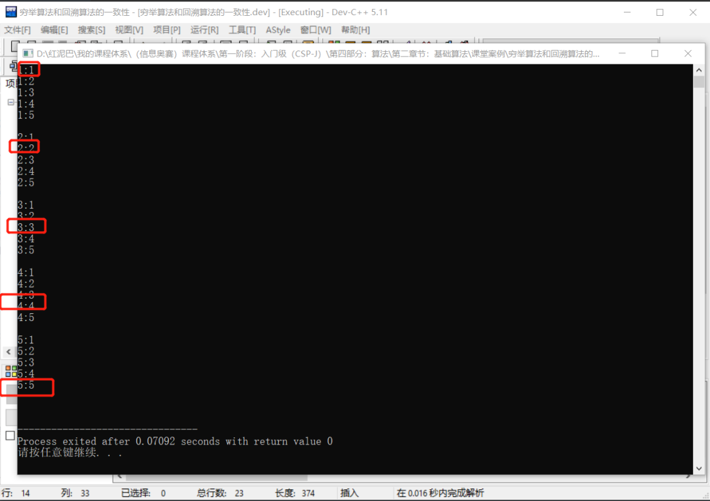

代码中还是有几个问题需要解决：

- 结果中出现了数字重复方案。这个问题是易解决的，只需要添加如下一行代码便可，是不是很熟悉。

```cpp
void fillNumber_(int pos,int num) {
 for(int i=1; i<=5; i++) {
        //本次选择不能和上次选择相同
  if(i==num)continue;
        //省略……
 }
}
```

- 但是，当动态嵌套的循环（递归）层次很多时，通过参数传递选择好的数字是一件很繁琐的事情。如下图所示。

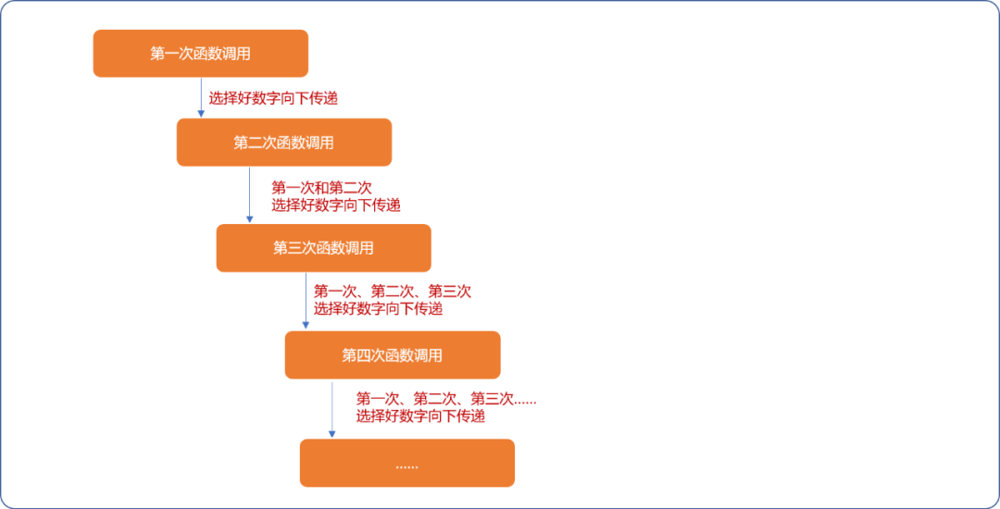

要解决这 `2` 个问题，看来还得使用全局全量：

- 添加一个全局变量存储数字的使用状态，避免重复使用。
- 添加一个全局变量存储选择的结果。

修改后代码如下：

```cpp
#include <iostream>
using namespace std;
//数字的使用状态,初始为 0
int isUse[6]= {0};
//存储结果
int res[6]= {0};
//需要排列的数字个数
int num=2;
/*
*排列 
*/
void fillNumber(int pos) {
 for(int i=1; i<=5; i++) {
  if(isUse[i]==0) {
   //数字没有使用,填入结果
   res[pos]=i;
   //置为已用
   isUse[i]=1;
   if(pos==num) {
    //选择好了数字，递归出口，输出
    for(int j=1; j<=num; j++) {
     cout<<res[j]<<"\t";
    }
    cout<<endl;
   } else {
    //递归式的循环嵌套
    fillNumber(pos+1);
   }
  }
 }
}
//测试
int main(int argc, char** argv) {
 fillNumber(1);
 return 0;
}
```

输出结果：

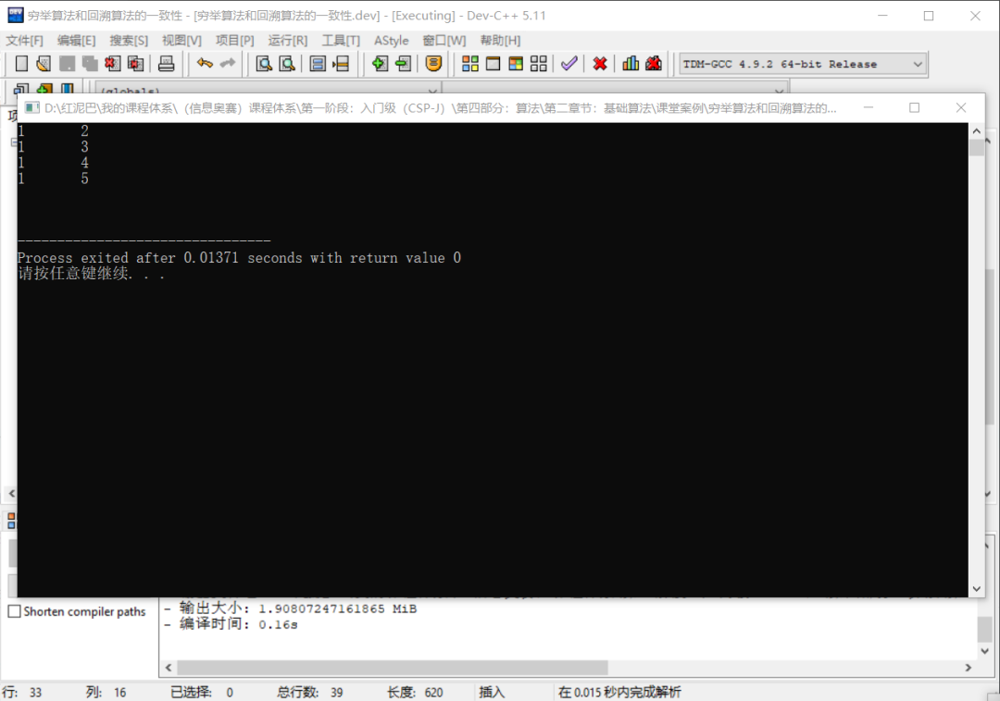

**为什么输出的结果不完整？**

如下图所示：

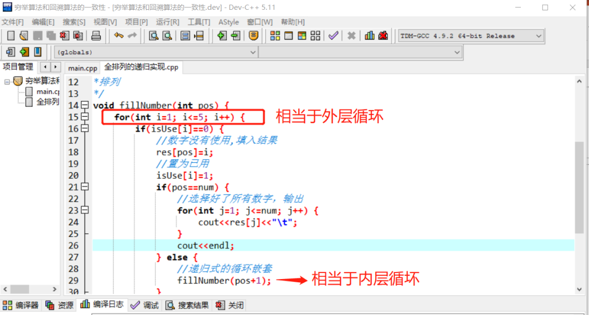

如果外层循环选择了数字 `1` ，则内层循坏可以选择 `2,3,4,5`，且会对这几个数字做全局已经使用标记，当重新进入外层循坏时，已经没有数字可以。

所以代码中还差最后一环节，无论任何时候，当重回外层循坏时，需要把标记为已经使用的数字重新标记为初始未使用状态。

```cpp
void fillNumber(int pos) {
 for(int i=1; i<=5; i++) {
  if(isUse[i]==0) {
   //数字没有使用,填入结果
   res[pos]=i;
   //置为已用
   isUse[i]=1;
   if(pos==num) {
    //选择好了所有数字，输出
    for(int j=1; j<=num; j++) {
     cout<<res[j]<<"\t";
    }
    cout<<endl;
   } else {
    //递归式的循环嵌套
    fillNumber(pos+1);
   }
   //回溯关键环节
   isUse[i]=0; 
  }
 }
}
```

如此，使用递归实现的回溯算法便大功告成。

输出最终代码的测试结果：

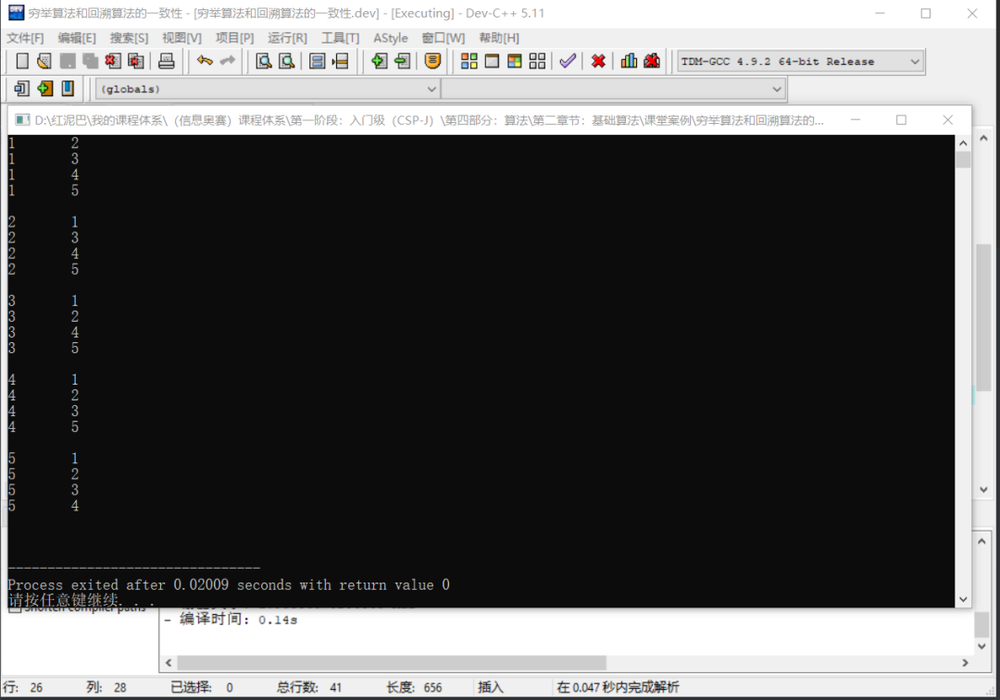

**小结：**

- 递归回溯算法中，递归充当了动态添加循环语句块的作用。
- 当使用参数向下一级函数传递上一级函数结果时，不需要标记信息，但会增加代码的复杂度。
- 递归回溯算法也不是什么新艳事物，不过是换了一个马甲做穷举，还是循坏嵌套这一套。
- 原始穷举算法的性能本身就够寒碜，递归回溯算法的性能更寒碜。所以，递归回溯算法并不性能优化方案，而是静转动的实现方案，是类型解决方案。
- 如需提升递归回溯算法的性能，可使用剪技。

## 4. 静态和动态

继续通过一个案例理解静态和动态的差异性，便能明白`递归回溯算法`为什么可以在算法界里独成一派。

**问题描述：素数分解。**

素数，又称质数，是指除 `1`和其自身之外，没有其他约数的正整数。例如 `2、3、5、13` 都是质 数，而 `4、9、12、18` 则不是。 虽然素数不能分解成除 `1`和其自身之外整数的乘积，但却可以分解成更多素数的和。你需要编程 求出一个正整数最多能分解成多少个互不相同的素数的和。 例如，`21 = 2 + 19` 是 `21`的合法分解方法。`21 = 2 + 3 + 5 + 11` 则是分解为最多素数的方法。

**问题分析：**

为了简化问题，这里仅以分解 `21`的质数之和为例。

问题本质还是排列性质，只是排列的数字换成了质数。

问题所要的结论不是纯数字排列，而是要求排列后的数字相加之和为 `21`。

如果使用静态穷举算法，将会面对 `2` 个问题：

- 比`21`小的质数有`{2,3,5,7,11,13,17,19}`。因不知道那几个数字相加为 `21`。最少可以是 `2` 个数字相加，而理论上最多可能是所有数字相加。如下静态书写代码，循环嵌套可以达到 `8` 层，且从第二层开始就要检查是否能得到所要的结果。

```cpp
#include <iostream>
using namespace std;
int main(int argc, char** argv) {
 int target=21;
 int nums[8]= {2,3,5,7,11,13,17,19};
 //第一层循坏
 for(int i=0; i<8; i++) {
  //第二层循环
  for(int j=0; j<8; j++ ) {
   if( nums[j]==nums[i] )continue;
   if( nums[j]+nums[i]==21 ) {
    cout<<nums[i]<<"+"<<nums[j]<<"="<<target<<endl;
   }
   //第三层循环
   for(int k=0; k<8; k++) {
    if( nums[k]==nums[i] || nums[k]==nums[j] )continue;
    if( nums[j]+nums[i]+nums[k]  ==21 ) {
     cout<<nums[i]<<"+"<<nums[j]<<"+"<<nums[k]<<"="<<target<<endl;
    }
   }
   //第四层
   //第五层
   //第六层
   //第七层
   //第八层
   //……
  }
 }
 return 0;
}
```

- 如果要分解比 `21`大的数字，如此编写代码将会让人崩溃，甚至疯癫。

如果使用`递归回溯`方案，则可以根据需要动态且正确的进行循环次数的嵌套。如下代码，代码中的细节由读者自行参悟。

```cpp
#include <iostream>
using namespace std;
int target=21;
//原始数字 1 2  3 4 5
int nums[8]= {2,3,5,7,11,13,17,19};
//状态数组：数字是否已经使用
int isUse[8]= {0};
//存储结果
int res[8];
//显示结果
int showAll() {
 int count=0;
 for(int i=0; i<8; i++) {
  if(res[i]!=0) {
   count++;
   cout<<res[i]<<"\t";
  }
 }
 cout<<endl;
 return count;
}
int maxCount=0;
/*
*  pos:起始位置 0
* idx: 上一次使用数字的位置，要组合而不是排列
*/
int total=0;
void fillNum(int idx, int pos,int target) {
 //此处 i：编号
 for(int i=idx; i<8; i++) {
  if( isUse[ i  ]==0 ) {
   res[pos]=nums[i]  ;
   //标志
   isUse[i]=1;
   if(target-nums[i]==0) {
    total++;
    int count= showAll();
    if(count>maxCount)maxCount=count;
   } else {
                 //下一次循环(动态)
    fillNum(i+1,pos+1,target-nums[i]);
   }
   //回溯
   res[pos]=0;
   isUse[i]=0;
  }
 }
}
//测试
int main(int argc, char** argv) {
 fillNum(0,0,target);
 cout<<"有"<<total<<"方案"<<endl;
 cout<<"最长表达式"<<maxCount<<endl; 
 return 0;
}
```

**输出结果：**

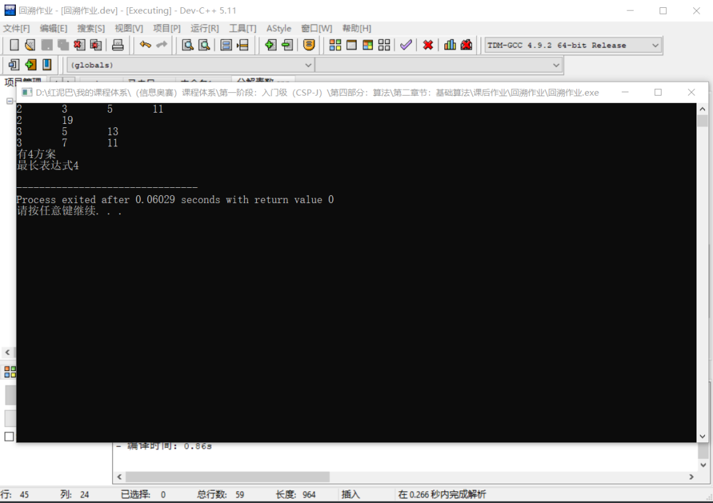

## 5. 总结

通过上述的讲解，以及编码之间的比较，想必已经看出了递归回溯算法的本质。

归纳一句话便是：动态循环次数的嵌套而已。

本文想传递一种学习认知，世间万物的规律都是万变不离其宗，当你看破事物的本质，神秘感将会荡然无存。


