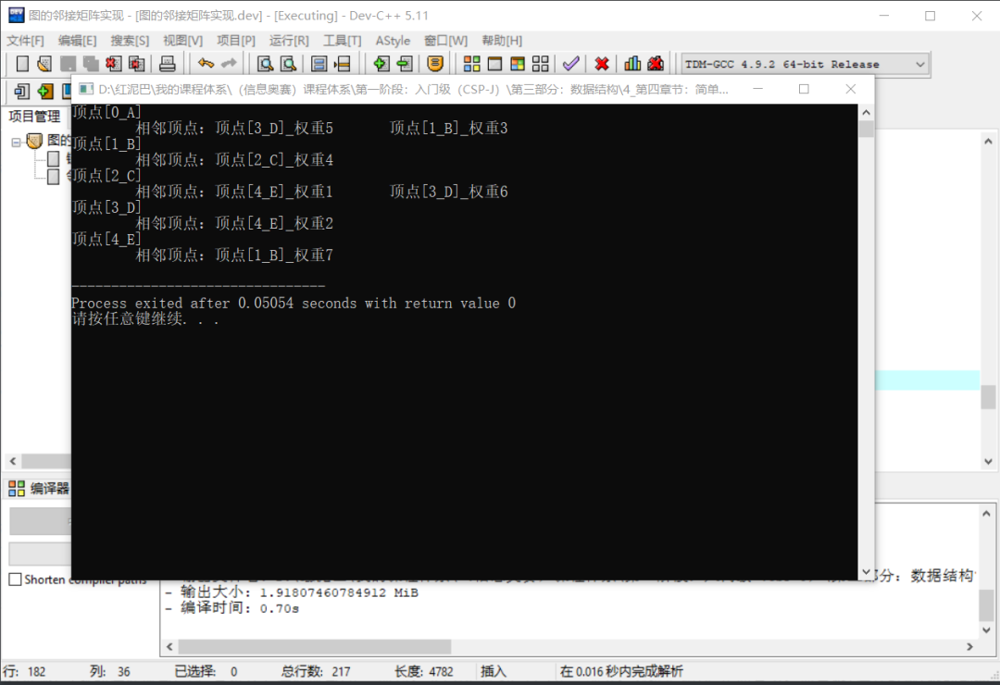
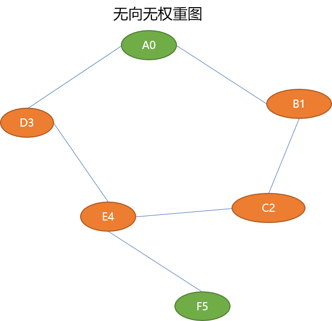
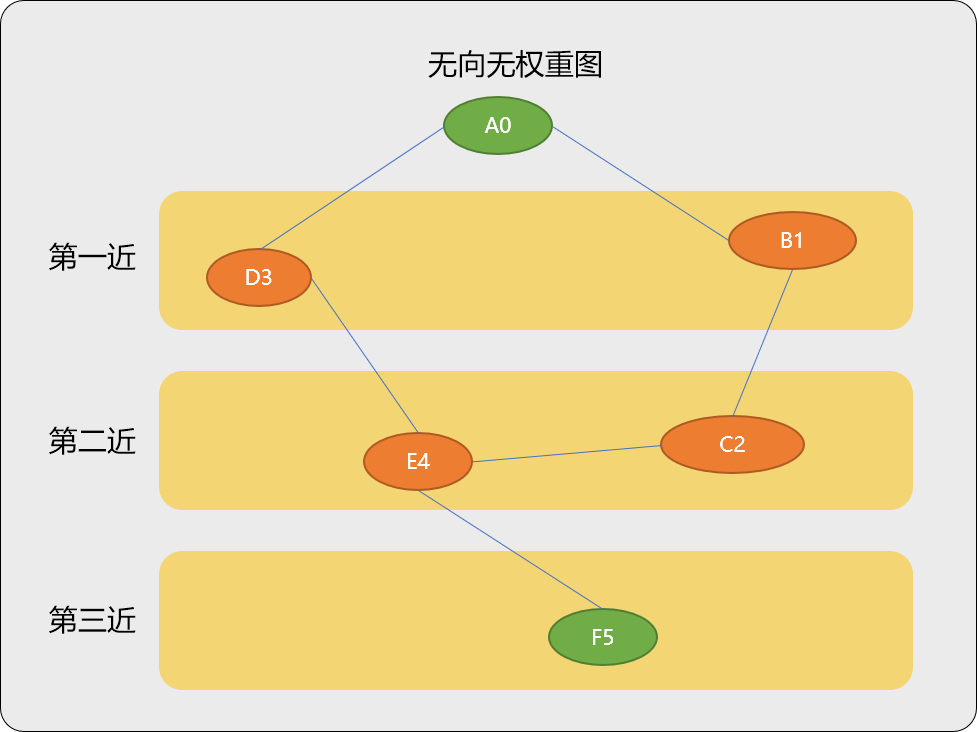
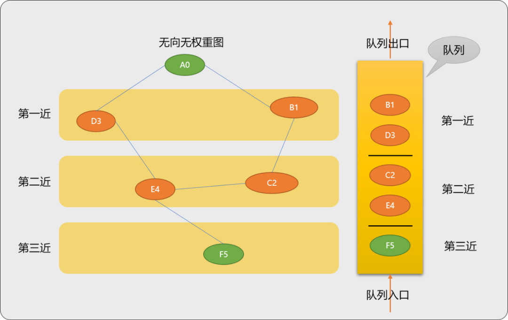
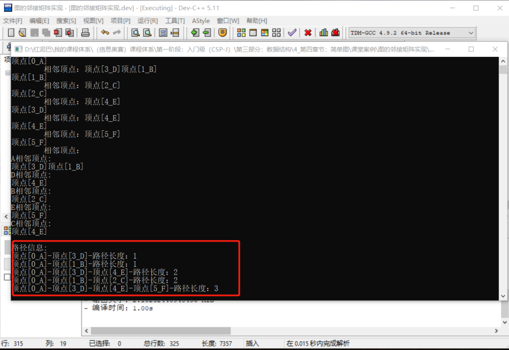

# C++ 不知图系列之基于链接表的无向图最短路径搜索


图的常用存储方式有 `2` 种：

- 邻接炬阵。
- 链接表。

邻接炬阵的优点和缺点都很明显。优点是简单、易理解，对于大部分图结构而言，都是稀疏的，使用矩阵存储空间浪费就较大。

链接表相比较邻接矩阵存储方案，使用起来更方便，对于空间的使用是刚好够用原则，不会产生太多空间浪费。理解起来，也较简单。

本文将以`链接表`方式存储图结构，在此基础上实现无向图最短路径搜索。

## 1. 链接表

**链接表的存储思路：**

使用链接表实现图的存储时，有**主表**和**子表**概念。

- **主表：** 用来存储图对象中的所有顶点数据。
- **子表：** 每一个顶点自身会维护一个子表，用来存储与其相邻的所有顶点数据。

如下图结构中有 `5` 个顶点，使用链接表保存时，需要主表  `1` 张，子表 `5` 张。**链接表的优点是能够紧凑地表示稀疏图。**


### 1.1 存储实现

#### 1.1.1 项点类

因顶点本身是具有特定的数据含义（如，可能是城市、公交车站、网址、路由器……），需要一个顶点类承载顶点的有效数据。并在顶点类中提供维护自身信息的函数。

```c++
#include <iostream>
#include <queue>
#include <stack>
#include <vector>
using namespace std;
template<typename T>
struct Vertex {
 // 顶点的编号
 int vid;
 // 顶点有效负荷
 T value;
 // 是否被访问过:False 没有 True:有
 bool visited ;

 template<typename T1>
 struct NeighborVertex {
  Vertex<T1> *vertex;
  //和相邻顶点的权重
  int weigth;
  //兄弟顶点
  NeighborVertex<T1> *next;

  NeighborVertex( Vertex<T1> *ver,int weigth) {
   this->vertex=ver;
   this->weigth=weigth;
   this->next=NULL;
  }
 };
 // 相邻顶点链表
 NeighborVertex<T> *  head;
 //搜索时的前驱结点
 Vertex* preVertex;
    //无参构造
 Vertex() {
  this->vid=0;
  this->visited=false;
  this->head=NULL;
 }
    //有参构造
 Vertex(int vid,T value) {
  this->vid=vid;
  this->visited=false;
  this->head=NULL;
  this->value=value;
 }
 /*
 *在链表中使用头部插入方案添加邻接顶点
 *nbrVer:相邻顶点
 *weight:无向无权重图，权重默认设置为 1
 */
 void addNeighbor(Vertex<T> *nbrVer,int weigth) {
  NeighborVertex<T> * newNbrVer=new NeighborVertex<T>(nbrVer,weigth);
  //头部添加
  if(this->head==NULL) {
   this ->head=newNbrVer;
  } else {
   newNbrVer->next=this->head;
   this->head=newNbrVer;
  }
 }
 
    /*
 *   显示与当前顶点相邻的顶点
 */
 vector<Vertex<T> *> showAllNeighbor() {
  NeighborVertex<T> *move=this->head;
  vector<Vertex<T> *> allNeighbor;
  while(move!=NULL) {
   allNeighbor.push_back(move->vertex);
   move->vertex->desc();
   cout<<"_权重"<<move->weigth<<"\t";
   move=move->next;
  }
  return allNeighbor;
 }
 /*
 *判断与某顶点是否相邻，并返回权重  0 表示与此顶点不相邻
 */
 int  isNeighbor(NeighborVertex<T> *ver) {
  NeighborVertex<T> *move=this->head;
  while(move!=NULL && move->vertex->value!=ver->value) {
   move=move->next;
  }
  if (move==NULL)
   return 0;
  else
   return move->weigth;
 }

 //顶点的自我显示
 void desc() {
  cout<<"顶点["<<this->vid<<"_"<<this->value<<"]";
 }
};
```

顶点类结构需要说明地方：

- `visited`：用于搜索路径算法中，检查节点是否已经被搜索过。
- `head`：存储与顶点相邻的顶点信息，也称为相邻顶点，相邻顶点需要包括 `2` 方面信息，一是顶点`Vertex`信息，二是权重。这里提供了`NeighborVertex`类型，在`Vertex`类型的基础之上封装了权重。


#### 1.1.2 图类

`图类`用于维护l图中的所有顶点以及顶点之间的关系，以及针对于图的相关算法。

```c++
template<typename T>
class Graph {
 private:
  // 一维数组，存储节点
  Vertex<T>** vertexs;
  // 顶点编号,从 0 开始
  int vnums;
  //一维数组大小
  int size;
 public:
  Graph(int size) {
   //初始一给数组大小
   this->vertexs=new Vertex<T>*[size];
   this->vnums=0;
   this->size=size;
  }
  //添加新顶点
  Vertex<T> * addVertex(T value);
  //为顶点添加相邻顶点
  void addNeighbor(T parentValue,T nbrValue,int weight);
  //按值查找顶点
  Vertex<T> * findVertexByValue(T value);
  //按编号查找顶点
  Vertex<T> * findVertexById(int id);
  //显示所有顶点
  void showAllVers();
};
```

##### 查找函数：

查找算法有 `2` 种方案：

- 按值查找。

```c++
/*
*按值查找顶点是否存在
*/
template<typename T>
Vertex<T> * Graph<T>::findVertexByValue(T value) {
 for(int i=0; i<Graph<T>::vnums; i++) {
  if(Graph<T>::vertexs[i]==NULL)
   continue;
  if(Graph<T>::vertexs[i]->value==value) {
   return Graph<T>::vertexs[i];
  }
 }
 return NULL;
}
```

- 按编号查找。

```c++
/*
*按编号查找顶点是否存在
*/
template<typename T>
Vertex<T> * Graph<T>::findVertexById(int id) {
 for(int i=0; i<Graph<T>::vnums; i++) {
  if(Graph::vertexs[i]->vid==id) {
   return Graph<T>::vertexs[i];
  }
 }
 return NULL;
}
```

**添加新顶点函数：**先查找是否存在顶点，没有就添加。

> 顶点的编号由图对象内部指定，便于统一管理。

```cpp
/*
*添加新的顶点
*/
template<typename T>
Vertex<T> * Graph<T>::addVertex(T value) {
 //检查此顶点是否存在
 Vertex<T> * ver= Graph<T>::findVertexByValue(value);
 if(ver==NULL) {
  //创建新的顶点
  ver=new  Vertex<T>(Graph<T>::vnums,value);
  Graph::vertexs[Graph<T>::vnums]=ver;
  Graph<T>::vnums++;
 }
 return ver;
}
```

**添加顶点之间的关系：**

```cpp
//为顶点添加相邻顶点
template<typename T>
void Graph<T>::addNeighbor(T parentValue,T nbrValue,int weight) {
 Vertex<T> * parentVer= Graph<T>::findVertexByValue(parentValue);
 if(parentVer==NULL)
  parentVer=Graph<T>::addVertex(parentValue);
 Vertex<T> * nbrVer= Graph<T>::findVertexByValue(nbrValue);
 if(nbrVer==NULL)
  nbrVer=Graph<T>::addVertex(nbrValue);
 //调用顶点的函数
 parentVer->addNeighbor(nbrVer,weight);
}
```

**显示所有顶点：**

```cpp
template<typename T>
void Graph<T>::showAllVers() {
 for(int i=0; i<Graph<T>::vnums; i++) {
  Graph::vertexs[i]->desc();
  cout<<endl<<"\t相邻顶点：";
  //输出相邻顶点
  Graph::vertexs[i]->showAllNeighbor();
  cout<<endl;
 }
}
```

**测试图中的函数：**

存储如下图结构中顶点以及顶点之间的信息：


```cpp
int main(int argc, char** argv) {
 //实例化图
 Graph<char> *graph=new Graph<char>(10);
 //添加几个顶点 A，B C D E
 char vers[5]= {'A','B','C','D','E'};
 for(int i=0; i<5; i++) {
  graph->addVertex(vers[i]);
 }
 //添加顶点之间的关系（A -(3)-》B ）
 graph->addNeighbor('A','B',3);
 //添加顶点之间的关系（A -(5)-》D ）
 graph->addNeighbor('A','D',5);
 //添加顶点之间的关系（B -(4)-》c ）
 graph->addNeighbor('B','C',4);
 //添加顶点之间的关系（C -(6)-》D）
 graph->addNeighbor('C','D',6);
 //添加顶点之间的关系（C -(1)-》E）
 graph->addNeighbor('C','E',1);
 //添加顶点之间的关系（D -(2)-》E）
 graph->addNeighbor('D','E',2);
 //添加顶点之间的关系（E -(7)-》B）
 graph->addNeighbor('E','B',7);
 //输出所的顶点
 graph->showAllVers();
 return 0;
}
```

输出结果：




## 2. 最短路径算法

从图结构可知，从一个顶点到达另一个顶点，不止一条可行路径，在众多路径我们总是试图选择一条最短路径。当然，需求不同，衡量一个路径是不是最短路径的标准也会不同。

如打开导航系统后，最短路径可能是费用最少的那条、可能是速度最快的那条、也可能是量程数最少的或者是红绿灯最少的……

在`无权无向图`中，以经过的边数最少的路径为最短路径。在无权无向图中找到最短路径相对简单。

在有向加权图中，会以附加在每条边上的权重的数据含义来衡量。权重可以是时间、速度、量程数……

### 2.1 无权无向图最短路径算法

查找无向图中任意两个顶点间的最短路径长度，可以直接使用广度搜索算法。如下图求解 `A0 ~ F5` 的最短路径。

> **Tips：** 无向图中任意 `2` 个顶点间的最短路径长度由边数决定。




**广度优先搜索算法流程：**

广度优先搜索算法的基本原则：以某一顶点为参考点，先搜索离此顶点最近的顶点，再搜索离最近顶点的最近顶点……以此类推，一层一层向目标顶点推进。

如从顶点 `A0` 找到顶点 `F5`。先从离 `A0` 最近的顶点 `B1`、`D3` 找起，如果没找到，再找离 `B1`、`D3` 最近的顶点 `C2`、`E4`，如果还是没有找到，再找离 `C2`、`E4` 最近的顶点 `F5`。

> **Tips：**因为每一次搜索都是采用最近原则，最后搜索到的目标也一定是最近的路径。
>
> 也因为采用最近原则，在搜索过程中所经历到的每一个顶点的路径都是最短路径。`最近+最近，结果必然还是最近`。




显然，广度优先搜索的最近搜索原则是符合先进先出思想的，具体算法实施时可以借助队列实现整个过程。

**算法流程：**

- 先确定起始点 `A0`。

- 找到 `A0` 的 `2` 个后序顶点 `B1` 、`D3` （或者说 `B1、D3`的前序顶点是 `A0`），压入队列中。除去起点 `A0`，`B1`、`D3` 顶点属于第一近压入队列的节点。

  > `B1` 和 `D3` 压入队列的顺序并不影响 `A0` ~`B1` 或 `A0` ~ `D3` 的路径距离（都是 1）。
  >
  > `A0`~`B1` 的最短路径长度为 1。
  >
  > `A0`~`D3` 的最短路径长度为 1。

- 从队列中搜索 `B1` 时，找到 `B1` 的后序顶点 `C2` 并压入队列。`B1` 是 `C2` 的前序顶点。

  > `B1` ~ `C2` 的最短路径长度为 1，而又因为 `A0`~`B1` 的最短路径长度为 1 ，所以 `A0` ~ `C2` 的最短路径为 2

- `B1` 搜索完毕后，在队列中搜索 `B3` 时，找到 `B3` 的后序顶点 `E4` ，压入队列。因 `B1` 和 `D3` 属于第一近顶点，所以这 `2` 个顶点的后序顶点 `C2`、`E4` 属于第二近压入队列，或说 `A0-B1-C2`、`A0-D3-E4` 的路径距离是相同的（都为 2）。

- 当搜索到 `C2` 时，此时队列没有压入操作。

- 当 搜索到 `E4` 时，`E4` 有 `2` 个相邻顶点 `C2`、`F5`，因 `C2` 已经压入过，所以仅压入 `F5`。因 `F5` 是由第二近顶点压入，所以 `F5` 是属于第三近压入顶点。

  > `A0-D3-E4-F5` 的路径为 3。




**编码实现广度优先算法：**

**在图类添加广度搜索函数：**

在图类添加如下函数：使用广度优先搜索算法查找顶点与顶点之间的路径。

广度优先搜索算法有一个核心点，当搜索到某一个顶点后，需要找到与此顶点相邻的其它顶点，并压入队列中。`pushQueue` 方法就是做这件事情的。如果某一个顶点曾经进过队列，就不要再重复压入队列了。

```cpp
 template<typename T>
class Graph {
 private:
         //省略……
         //保存所有使用广度算法搜索到的路径
  vector<vector<Vertex<T> *> >  allPaths;
 public:
         //省略……
  //把某一顶点的相邻顶点压入队列
  void pushQueue(queue<Vertex<T> *> & myQueue,Vertex<T> * vertex);
  //广度搜索路径
  void bfsNearestPath(T from,T to);
  //输出广度搜索到的所有路径
  void showAllPaths();
 };
```

`pushQueue`的函数实现：

```cpp
//把某一顶点的相邻顶点压入队列
template<typename T>
void  Graph<T>::pushQueue(queue<Vertex<T> *> & myQueue,Vertex<T> *  vertex) {
 //查找  vertex 的相邻顶点
 cout<<vertex->value<<"相邻顶点:"<<endl;
 vector<Vertex<T> *> allVers=vertex->showAllNeighbor(); 
 for(int i=0; i<allVers.size(); i++) {
  if(allVers[i]->visited==false) {
   //设置前驱顶点
   allVers[i]->preVertex=vertex;
   //压入队列中
   myQueue.push(allVers[i]);
   //设置为已经压入
   allVers[i]->visited=true;
  }
 }
 cout<<endl;
}
```

`bfsNearestPath`广度搜索算法实现：

```cpp
//广度搜索路径
template<typename T>
void Graph<T>::bfsNearestPath(T from,T to) {
 //队列：广度搜索要使用队列
 queue<Vertex<T> *>  myQueue;
 //临时路径
 vector<Vertex<T> *> tmpPath;
 //检查顶点是否存在
 Vertex<T> * fromVer= Graph<T>::findVertexByValue(from);
 Vertex<T> * toVer= Graph<T>::findVertexByValue(to);
 if(fromVer==NULL || toVer==NULL)
  return;
 tmpPath.push_back(fromVer);
 //把 fromVer 顶点的相邻顶点压入队列中,fromVer 本身可以不用压入
 Graph<T>::pushQueue(myQueue,fromVer);

 while(!myQueue.empty()) {
  //出队列
  Vertex<T> * ver=  myQueue.front();
  myQueue.pop();
  if(ver->preVertex==fromVer) {
   //如果前驱是 fromVer
   tmpPath.push_back(ver);
   //添加新路径
   Graph<T>::allPaths.push_back(tmpPath);
   //把临时路径的最后一个顶点删除
   tmpPath.pop_back();
  } else {
   //扫描所有路径
   for(int i=0; i<Graph<T>::allPaths.size(); i++) {
    tmpPath = Graph<T>::allPaths[i];
    //得到路径中的最后一个顶点
    Vertex<T> * tmpVer =tmpPath.back();
    if (ver->preVertex==tmpVer) {
     tmpPath.push_back(ver);
     //allPaths[i]=tmpPath;
     Graph<T>::allPaths.push_back(tmpPath);
    }
   }
  }
  if(ver->value==toVer->value) {
   break;
  } else {
   Graph<T>::pushQueue(myQueue,ver);
  }
 }
}
```

显示顶点之间的路径信息：

```cpp
/*
*显示搜索到的路径
*/
template<typename T>
void Graph<T>::showAllPaths() {
 for(int i=0; i<Graph<T>::allPaths.size(); i++) {
  vector<Vertex<T> *> vec=Graph<T>::allPaths[i];
  int pathWeight=0;
  for(int j=0; j<vec.size(); j++) {
   pathWeight++;
   vec[j]->desc();
   cout<<"-";
  }
  cout<<"路径长度："<<pathWeight-1<<endl;
 }
}
```

**测试代码：**因为测试的是无向无权重图，顶点之间的权重默认为 `1`。

```cpp
nt main(int argc, char** argv) {
 //实例化图
 Graph<char> *graph=new Graph<char>(10);
 //添加几个顶点 A，B C D E
 char vers[6]= {'A','B','C','D','E','F'};
 for(int i=0; i<6; i++) {
  graph->addVertex(vers[i]);
 }

 //添加顶点之间的关系（A -(3)-》B ）
 graph->addNeighbor('A','B',1);
 //添加顶点之间的关系（A -(5)-》D ）
 graph->addNeighbor('A','D',1);
 //添加顶点之间的关系（B -(4)-》c ）
 graph->addNeighbor('B','C',1);
 //添加顶点之间的关系（C -(6)-》D）
 graph->addNeighbor('D','E',1);
 //添加顶点之间的关系（C -(1)-》E）
 graph->addNeighbor('C','E',1);
 //添加顶点之间的关系（D -(2)-》E）
 graph->addNeighbor('E','F',1);
 //输出所的顶点
 graph->showAllVers();
 //广度搜索A 到 F 的路径，中间会经过其它顶点
 graph->bfsNearestPath('A','F');
 cout<<"\n路径信息:"<<endl;
 graph->showAllPaths();
 return 0;
}
```

**输出结果：**




无向无权重图中，查找起始点到目标点的最短路径，使用广度优先搜索算法便可实现。

但如果是有向加权图，可能不会称心如愿。因有向加权图中的边是有权重的。故对于有向加权图则需要另择方案。

## 3. 总结

本文讲解了如何使用链表存储图数据结构，以及使用广度搜索算法实现无向无权重图中顶点之间的路径搜索。


