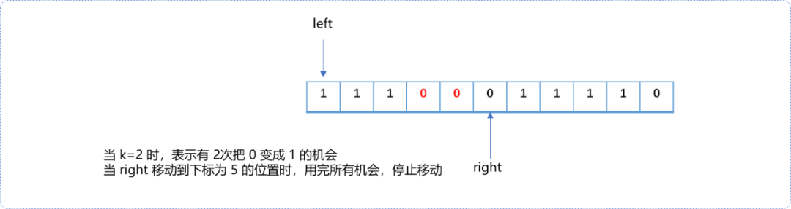
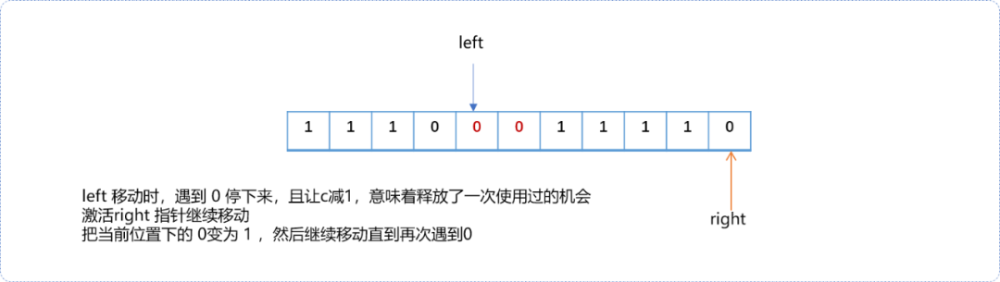
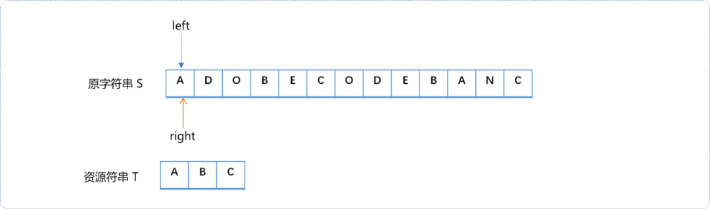
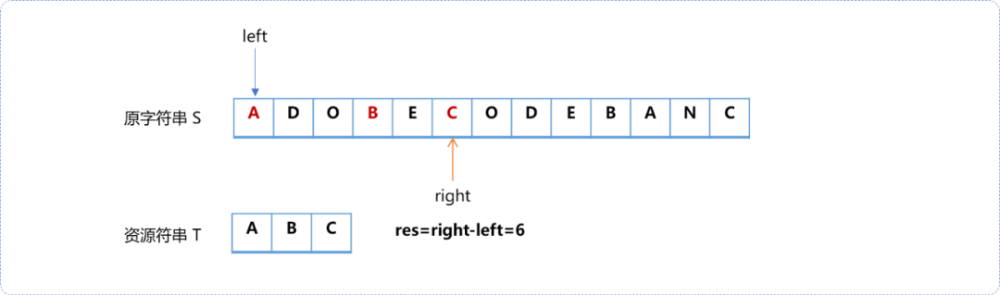
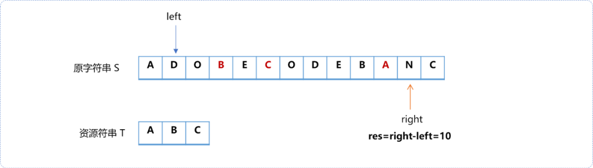
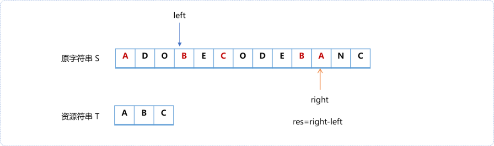
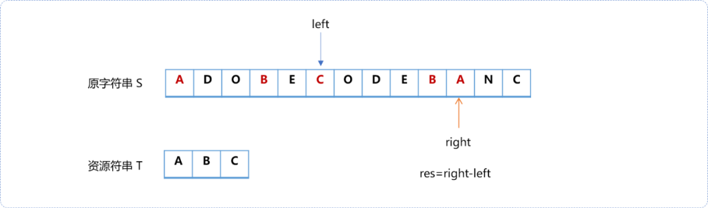
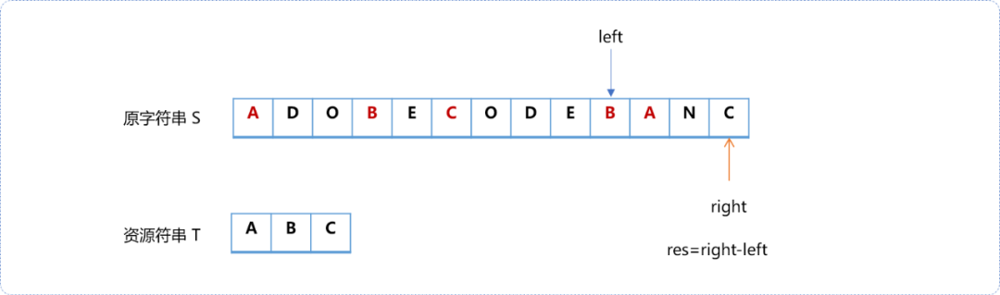

# C++不知算法系列之跟随滑动指针开疆拓土


## **1. 前言**

双指针搜索算法，常见的有左右双指针；快慢双指针；先后双指针以及多指针……其中还包括一类滑动指针。滑动指针也称为滑动窗口指针，其搜索实现即有灵性又透着优雅。

本文通过几个案例聊一聊滑动指针。

## **2. 最长的 1**

**题目描述**

给定一个由若干 `0` 和 `1` 组成的数组 `A`，我们最多可以将 K 个值从 0 变成 1 。返回包含最长（连续）`1`子数组的长度。如 `A = [1,1,1,0,0,0,1,1,1,1,0], K = 2`，则连续出现`1`的最长长度为`6`。把最后一个`0`和倒数第二个`0`变成`1`，即`[1,1,1,0,0,1,1,1,1,1,1]`可得到最长连续`1`的长度。

算法实现流程：

- 初始，`left`指针（左指针）指向最左边，`right`指针（右指针）和`left`指针同位置。相当于初始窗口紧闭状态。


- `right`指针不停地向右边移动不间断地扩大窗口。移动条件是`right`指针指向的值为`1`，如果`right`指针所指向位置的值为`0`，则查询是否还有把`0`转换成`1`的机会，有则通过把`0`转换成`1`后移动。否则，`right`指针停止移动。
- 如下图所示，因`k=2`，可以将连续的两个`0`转换为`1`（红色表示`0`已经转换为`1`）。`k`的值在整个遍历过程中需要保留，可以另创建计数器变量`c`，计数已经使用过的`0`转换为`1`的次数。



- 当`right`指针停止移动后，意味着在原数列中找到了一段连续`1`的子序列。用变量`res`记录子序列的长度。

  > **Tips：** 实际操作时，不需要真正把`0`变成`1`。


- 此时，`right`指针继续向前移动没有多大意义。需要等待左边释放用过的`0`转`1`的机会，方可以再次试探后面是否还有更多的连续`1`的子序列。

  让`left`指针向右边移动，直到遇到图中标记为红色的`0（表示此处用过一次0转换为1的机会）`，让计数器`c`自减一，释放一次机会。则为右指针争取到了一次新的机会，把`right`位置的`0`变换为`1`,且继续向右边移动，直到再次遇到`0`。

  > **Tips：** 当`left`指针释放机会后，意味着原来的0变回了0，`left`指针需要多向前移一位。



根据上述描述，总结一下：

- 如果`right`指针所指向的值为`1`，则`right`指针向右边移动。
- 如果`right`指针指向的值为`0`，可以试着用掉`0`转`1`的机会。如果没有了机会，统计此时`right`和`left`之间`1`的个数。且`right`停止移动。
- 移动`left`指针直到遇到`0`，释放用过的机会。且`left`停止移动。
- 重复上述过程，直到`right`指针到达数组的末尾位置。

在`left`和`right`移动时，类似一扇窗窗户在从左向右滑动，把这种双指针称为滑动指针。

滑动指针的特点：

- 右指针移动过程中会扩大窗口范围，且移动过程会消费资源寻找解，本题的资源就是消耗`0`变成`1`的机会。
- 右指针在移动过程一旦消耗掉所有资源，就可以从左右指针所在范围内中获得一个解，此解不一定是最终解。
- 通过移动左指针释放资源，如回收`0`变成`1`的机会。
- 一旦释放资源后又继续让右指针移动，重复直到找到最终答案。

编码实现：

```cpp
#include <bits/stdc++.h>
using namespace std;
int ones(int nums[],int len, int k) {
 int res=0,c=0;
 int left=0,right=0;
 while(right<len && left<len) {
  //right指针所指向的值为 1 或者还有机会
  while(nums[right]==1 || c<k  ) {
   //如果遇到0，则用掉机会
   if(nums[right]==0)c++;
   right++;
  }
  //当 right 停下来后,统计res
  res=max(res,right-left);
  //移动 left 释放机会
  while(  nums[left]!=0  ) left++;
  //释放机会
  c--;
  // 释放机会，意味着 1 又转换为 0，需要让 left 前进一位
  left++;
 }
 return res;
}
int main() {
 int nums[]= {1,0,1,0,0,0,1,1,0,1,0};
 int len=sizeof(nums)/4;
 int k=2;
 int res= ones(nums,len,k);
 cout<<res;
 return 0;
}
```

## **3. 查找最短子串**

问题描述：

现有字符串 `S`和字符串 `T`，请在字符串 `S` 里面找出包含`T`所有字母的最小子串。如果 ·S· 中不存这样的子串，则返回空字符串，如果 `S` 中存在这样的子串，需要保证有唯一的答案。

如输入 `S="ADOBECODEBANC"，T="ABC"`。则输出：`"BANC"`。

算法分析：

此题中，可以把`T`当成资源，一边扫描`S`一边查找是否存在`T`中的字符，有则消耗掉，直到消耗掉`T`中的所有资源。得到一个解后再移动左指针，释放资源。重复这个过程。

下面使用图示演示整个过程。

- 初始状态。左指针和右指针指向同一个位置。



- 右 指针向右边移动，直到包含完字符串`T`中的所有字符。



- 移动左指针释放窗口中的资源字符前，计算此时左右指针之间的距离，即一个有效解，但不是最终解。直到左右窗口中没有完整的`T`字符串时激活右指针移动。



- 左指针向右边移动，一边收窄窗口释放资源，一边统计此时左右之间的距离。







总结一下：

- 右指针向右移动直到左右指针所在窗口中包含完整的`T`字符串资源。
- **左指针每移动一步后，只要左右窗口中的包含完整的`T`资源就计算当前的左右指针的距离**，直到左右指针中不再包含完整的`T`资源。
- 当右指针指向数列最末尾时，整个算法结束。

算法实现：算法实现过程中，需要如下几个信息。

- 算法中需要记录实际所需要的资源信息。
- 在扩展窗口时，统计被包含的资源信息以及记录是否已经完全包含。

```cpp
#include <bits/stdc++.h>
using namespace std;

string getShort(string str,string t) {
 int size=str.size();
 //左右指针初始位置
 int left=0,right=0;
 //记录资源信息
 int sources[26]= {0};
 //记录窗口中已经使用的资源
 int wins[26]= {0};
 //计数器
 int count=0;
 //实际有效资源的数量
 int scount=0;
 //记录最终位置和结束位置
 int sta=0,end=size;
 //把字符串数字化，便于比较
 for(int i=0; i<t.size(); i++) {
  //简化问题，假设字符串全部为大写
  sources[ t[i]-'A' ]++;
  scount++;
 }
 while( right<size ) {
  char c=str[right];
  //检查是不是资源
  if( sources[c-'A']!=0 ) {
   //记录在窗口中
   wins[c-'A']++;
   //如果某个字符全部在窗口中
   if(wins[c-'A']==sources[c-'A'])count++;
  }
  right++;
  while( count==scount  ) {
   //如果窗口中已经包含所有资源，则移动左窗口，移动之前计算此时左右指针的距离
   if(right-left<end-sta)
    sta=left,end=right;
   //移动左指针之前记录移出的字符
   char mc=str[left];
   //移动左指针
   left++;
   //检查移出去的字符是不是资源
   if( sources[mc-'A']!=0 ) {
    //从窗口信息表中移走
    wins[mc-'A']--;
                 //某个字符全部释放
    if( wins[mc-'A']==0)count--;
   }
  }
 }
 return end-sta==size?"-1":str.substr(sta,end-sta);
}
int main() {
 string res= getShort("AAOBC","ABC");
 cout<<res;
 return 0;
}
```

## **4. 异位词**

**问题描述：** 给定一个字符串`s`和一个非空字符串`p`，找到`s`中所有是`p`的字母异位词的子串，返回这些子串的起始索引。字符串只包含小写英文字母，并且字符串`s`和`p`的长度都不超过`20100`。

说明：字母异位词指字母相同，但排列不同的字符串。不考虑答案输出的顺序。示例 1：输入：`s："cbaebabacd" p："abc"`。输出：`[0，6]`。解释：起始索引等于`0`的子串是`"cba"`它是`"abc"`的字母异位词。起始索引等于`6`的子串是`"bac"`，它是`"abc”`的字母异位词。

此题和上题的题意差不多。区别在于，左右指针所限制的窗口中除了要包含资源之外，还需要有长度限制，就是在窗口只能包含资源中的所有字符。

算法实现：

```cpp
#include <bits/stdc++.h>
using namespace std;

vector<int> getShort(string str,string t) {
 int size=str.size();
 //左右指针初始位置
 int left=0,right=0;
 //记录资源信息
 int sources[26]= {0};
 //记录窗口中已经使用的资源
 int wins[26]= {0};
 //计数器
 int count=0;
 //实际有效资源的数量
 int scount=0;
 //记录位置
 vector<int> res;
 //把字符串数字化，便于比较
 for(int i=0; i<t.size(); i++) {
  //简化问题，假设字符串全部为大写
  sources[ t[i]-'a' ]++;
  scount++;
 }
 while( right<size ) {
  char c=str[right];
  //检查是不是资源
  if( sources[c-'a']!=0 ) {
   //记录在窗口中
   wins[c-'a']++;
   //如果某个字符全部在窗口中
   if(wins[c-'a']==sources[c-'a'])count++;
  }
  right++;
  while( count==scount  ) {
   //如果窗口中已经包含所有资源，则移动左窗口，移动之前计算此时左右指针的距离
   if(right-left==t.size())
                 //如果左右指针所包含的窗口的长度恰好等于资源字符串的长度，则存储存其位置
    res.push_back(left);
   //移动左指针之前记录移出的字符
   char mc=str[left];
   //移动左指针
   left++;
   //检查移出去的字符是不是资源
   if( sources[mc-'a']!=0 ) {
    //从窗口信息表中移走
    wins[mc-'a']--;
    if( wins[mc-'a']==0)count--;
   }
  }
 }
 return res;
}
//测试
int main() {
 vector<int> res= getShort("cbaebabacd","abc");
 for(int i=0;i<res.size();i++)cout<<res[i]<<"\t";
 return 0;
}
```

## **5. 总结**

滑动指针是双指针算法中的一种实现。右指针一路开疆拓土，当边疆到达指定的区域的大小后，左指针缩小窗口，尽可能找到最好的疆土。


