# C++不知算法系列之迷宫问题中的“见山不是山”


## 1. 前言

迷宫问题是一类常见的问题。

初识此类问题，应该是“见山是山”，查询从起点到终点的可行之路。

有了广泛的知识体系之后，应该是"见山不是山"。会发现迷宫就是邻接矩阵，树和图中顶点的关系常用邻接矩阵描述，所以，迷宫问题可以转化为树、图的搜索问题。

最后便是“见山还是山”，能透过问题的表象，深化问题的本质，识破披着各色外衣的迷宫问题。

本文从不同的角度、全方位讲透迷宫问题中的“见山不是山”，让大家对迷宫问题有实质性的理解。

## 2. 迷宫问题

问题描述：

如下图迷宫地图中，`1`表示障碍物，`0`表示可通行。要求从起始点`(0,0)`出发，检查是否有行之有效的通路，可以一直走到终点`(8,8)`。迷宫问题的本质就是邻接矩阵的路径搜索问题。

常用的是`广度优先`和`深度优先`搜索算法。

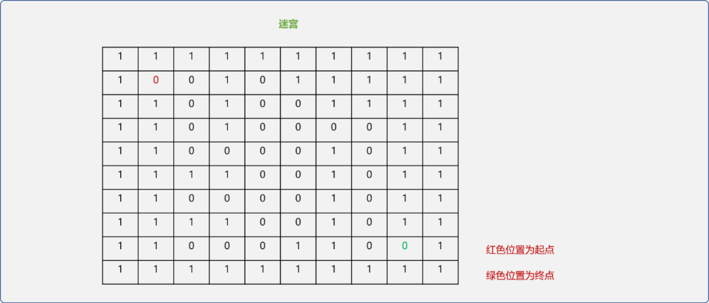

### 2.1 设计数据结构

首先分析`迷宫问题`中的数据类型。

- 坐标类型：用来描述迷宫中每个单元格的位置。

```c
/*
*坐标类型
*/
struct Position {
 //x坐标
 int x;
 //y坐标
 int y;
 Position() {}
 //构造函数
 Position(int x,int y) {
  this->x=x;
  this->y=y;
 }
 //重载 == 运算符
 bool operator==(Position pos) {
  return this->x==pos.x && this->y==pos.y;
 }
    //输出
 void desc() {
  cout<<"(x:"<<x<<",y:"<<y<<")"<<"->";
 }
};
```

- 方向类型：描述与每个单元格相邻的上、下、左、右 `4` 个单元格的关系。

```c
/*
* 方向增量
*/
struct Direction {
 //x 方向增量
 int xOffset;
 //y 方向增量
 int yOffset;
};
```

- 迷宫类：描述`迷宫`本身以及迷宫相对应的操作函数。

```c
class Maze {
 private:
  //一般用二维数组存储迷宫信息
  int maze[10][10]= {
   {1,1,1,1,1,1,1,1,1,1},
   {1,0,0,1,0,1,1,1,1,1},
   {1,1,0,1,0,0,1,1,1,1},
   {1,1,0,1,0,0,0,0,1,1},
   {1,1,0,0,0,0,1,0,1,1},
   {1,1,1,1,0,0,1,0,1,1},
   {1,1,0,0,0,0,1,0,1,1},
   {1,1,1,1,0,0,1,0,1,1},
   {1,1,0,0,0,1,1,0,0,1},
   {1,1,1,1,1,1,1,1,1,1},
  };
  //地图中非障碍点，即值为 0 位置的个数
  int count=32;
  //当前坐标与相邻(右、下、左、上)坐标的增量关系
  Direction dirs[4]= { {0,1},{1,0},{0,-1},{-1,0} };
  //栈，用于深度搜索
  stack<Position> mazeStack;
  //队列，用于广度搜索
  queue<Position>  mazeQueue;
  //总路径数
  int totalCount=0;
 public:
        //构造函数
  Maze() {}
  /*
  *洪水填充算法检查迷宫的连通性
  */
  void floodfill(Position start,Position end);
  /*
  * 是否连通
  */
  void isConnection();
  /*
  * 非递归实现路径的查找
  * 只保证查找到路径
  * 需要借助栈
  */
  void searchPathByStack(Position start,Position end);
  /*
  *  显示到深度搜索到的路径
  */
  void showPath();
  /*
  *递归深度搜索
  */
  bool searchPathByRecursion(Position start,Position end,int deep);
  /*
  *广度搜索
  */
  void searchPathByQueue(Position start,Position end);
  /*
  * 显示地图
  */
  void showMap() {
   cout<<"\n\t----------------------地图----------------------\n"<<endl;
   for(int i=0; i<10; i++) {
    for( int j=0; j<10; j++ )
     cout<<this->maze[i][j]<<"\t";
    cout<<endl;
   }
   cout<<"\n\t--------------------------------------------"<<endl;
  }
};
```

### 2.2 检查连通性

使用`洪水填充算法`检查迷宫的连通性。

洪水填充算法类似于古时候的"连坐法"，或说星星之火可以燎原也，从最初给定的位置开始，以蔓延之势，用`-1`填充与之相邻且值为 `0`的单元格。本文中， `-1`和`0`都用于表示迷宫中的非障碍物区间。

洪水填充算法和后面的递归搜索算法相似，不同地方之处，`洪水填充`会蔓延至所有满足条件的位置，搜索则是强调到通向目标的路径。

```c
/*
* 洪水填充算法检查迷宫的连通性
*/
void Maze::floodfill(Position start,Position end) {
 Position tmpPos;
 //检查起始点周边的点是否存在
 for(int i=0; i<4; i++ ) {
  //当前点上、下、左、右的相邻点
  tmpPos.x=start.x+ dirs[i].xOffset;
  tmpPos.y=start.y+dirs[i].yOffset;
  if( maze[tmpPos.x][tmpPos.y]==0 ) {
   //可通，则填充为 -1
   maze[tmpPos.x][tmpPos.y]=-1;
   //计数
   count--;
             //递归调用
   Maze::floodfill(tmpPos,end);
  }
 }
}
```

**连通性结论：**

```c
/*
* 如果洪水填充算法所填充的单元格数量和初始时值为 0 的单元格的数量一样，则连通
*/
void Maze::isConnection() {
 if(Maze::count==0)
  cout<<"地图是连通!"<<endl;
 else
  cout<<"地图不是连通的!"<<endl;
}
```

**测试：**

```c
//需要的所有头文件
#include <iostream>
#include <stack>
#include <vector>
#include <queue>
using namespace std;
int main(int argc, char** argv) {
 Maze maze;
 //起点位置
 Position startPos(1,1);
 //终点位置
 Position  endPos(8,8);
 cout<<"洪水填充算法前的地图"<<endl;
 maze.showMap();
 //洪水填充算法
 maze.floodfill(startPos,endPos);
 cout<<"洪水填充算法后的地图"<<endl;
 maze.showMap();
 //结论
 maze.isConnection();
 return 0;
}
```

**输出结果：** 迷宫中值为`0`的位置全部被`-1`填充。

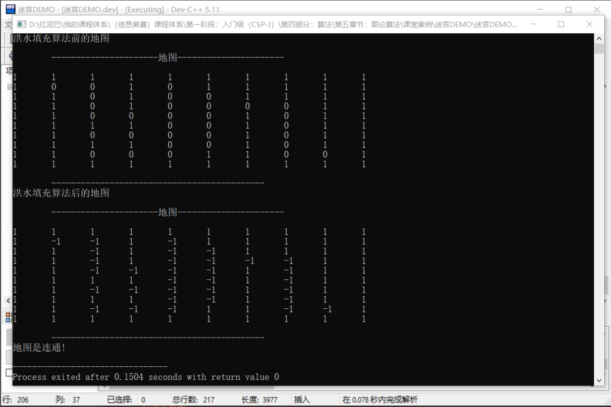

### 2.3 深度搜索

深度搜索可以使用非递归和递归 `2` 种方案实现。

#### 2.3.1  非递归的思想

非递归深度搜索需要借助栈。

- 初始，把`起始点`的坐标值压入栈中。

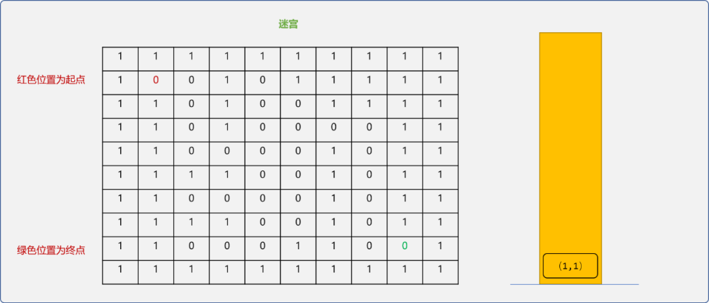

- 获取栈顶的坐标，检查此坐标的`上、下、左、右 4` 个相邻的坐标是否可通行。如果可通行，则压入栈中，且标识此坐标已经访问过。如下图使用绿色表示已经访问过。

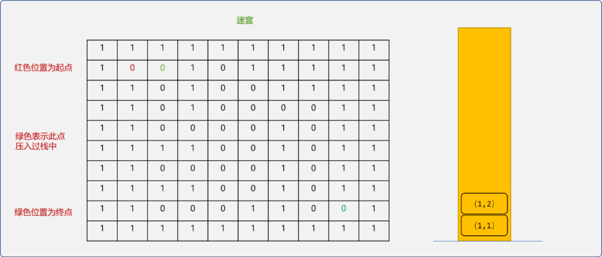

- 重复上述的的逻辑，如下图当是添加到`(4,4)`单元格时栈中的内容。

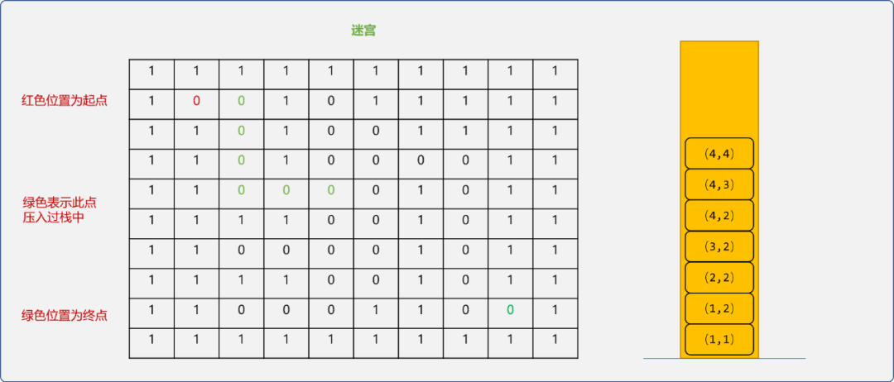

- 与`(4,4)`相邻的坐标分别是`(4,5)、(5,4)、(4,3)、(3,4)`。其中`(4,3)`已经访问过，则不需要再压入。栈中的坐标都是一路搜索下来可通行的位置。

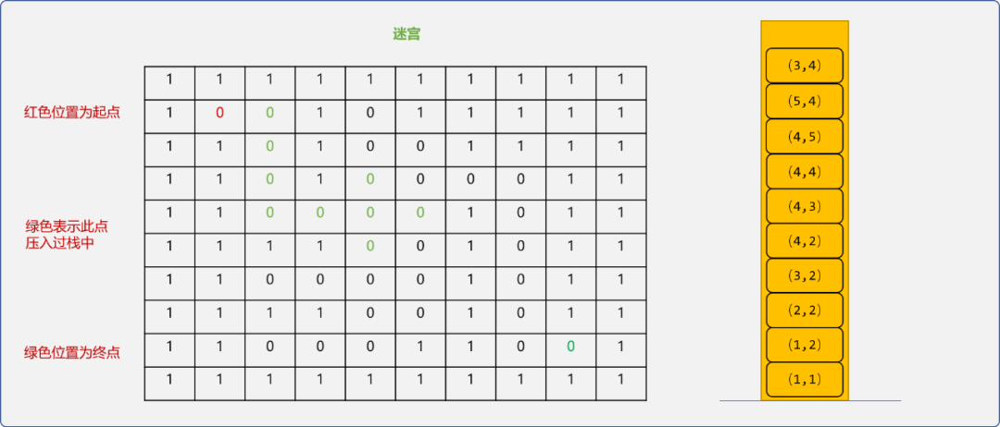

- 继续获取栈顶坐标`(3,4)`。随后找到与之相邻的`(3，5)、(2,4)`，压入栈中；再得到栈顶的`(2,4)`坐标，并找到与之相邻的`(2,5)、(1,4)`。

  > **Tips：** 本文查找与栈顶坐标相邻的坐标是按`右、下、左、上`的顺序。如果顺序不同，则会导致搜索过程不一样。

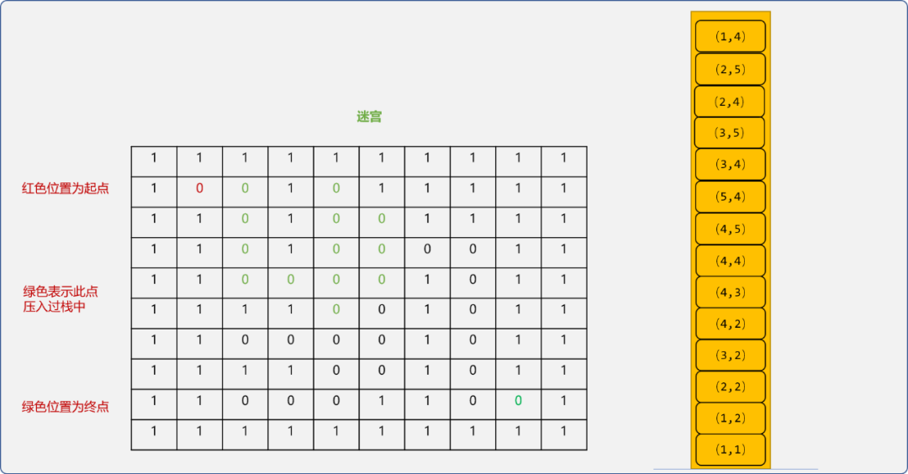

- 从栈顶得到`(1,4)`，因此坐标位于`死胡同`。于是，从栈顶把此坐标删除。可得到一个结论，不是所有进入栈中的坐标都有机会成为有效路径中的一份子。本文称行之此处不能通行的坐标为`死胡同`坐标，也做相应的标记。也就是说，当坐标为`死胡同`坐标时，则从栈顶删除。

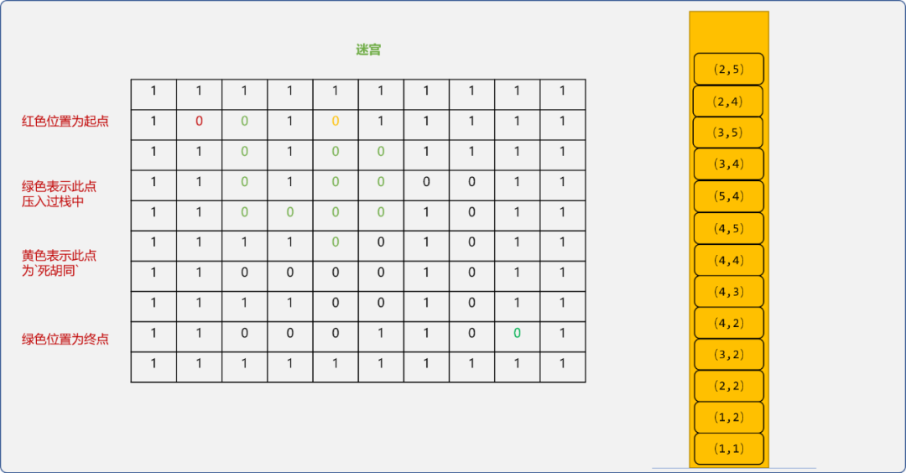


- 栈中的`(2，5)、(2,4)`为`死胡同`坐标，删除。

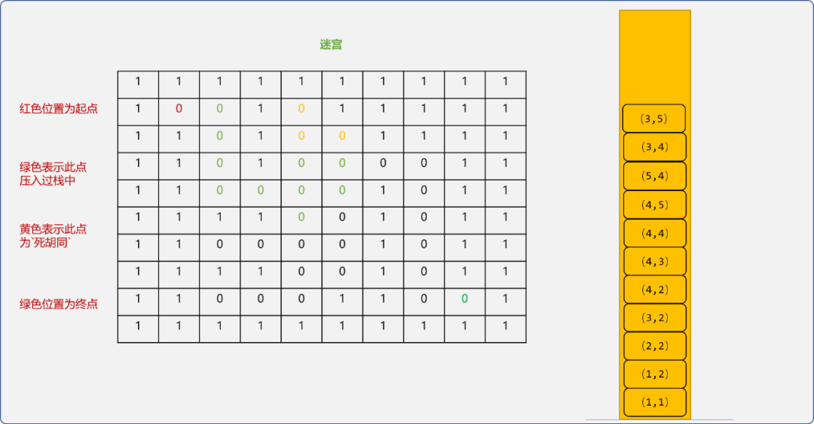


- 从`(3,5)`坐标开始，可以一路走到终点。把栈中的坐标全部输出便得到`起点`到`终点`的有效路径。

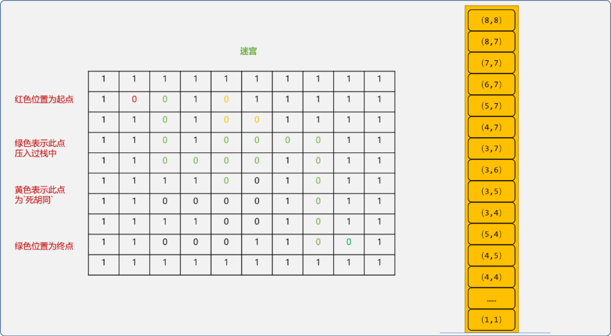


这里有一个问题要思考，栈中的值真的全是有效路径上的坐标？

其实不然，也许有些坐标进入栈中，只为备用。如到`(4,4)`位置时，有 `3` 个可行方向`(4,5)、(5,4)、(3,4)`。因`(3，4)`这个方向可行，最终`(4,5)、(5,4)`备用点没用上。所以，这些坐标也需要标记一下，本文称为`备用坐标`。

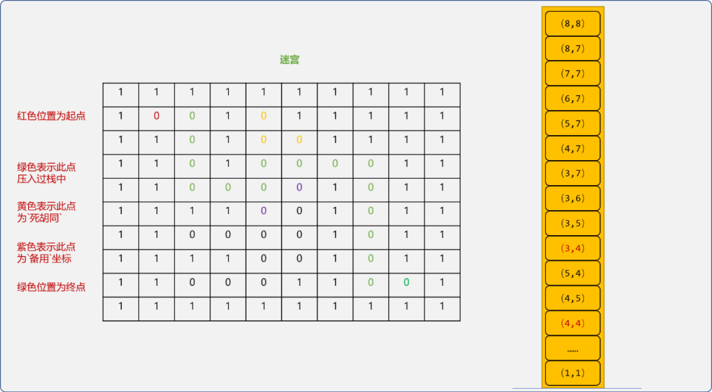


对坐标进行不同颜色标记后，上图中的绿色坐标为最终有效路径。

#### 2.3.2 编码实现

```c
/*
* 非递归实现路径的查找
* 只保证查找到路径
* 需要借助栈
*/
void Maze::searchPathByStack(Position start,Position end) {
 //把起始点压入栈
 Maze::mazeStack.push(start);
 //置 0,表示已经访问过
 Maze::maze[start.x][start.y]=0;
 Position top;
 Position tmpPos;
 while(1) {
  //得到栈顶的元素
  top=Maze::mazeStack.top();
  // -2 表示此坐标是路径中的一部分
  Maze::maze[top.x ][top.y ]=-2;
  if(top==end) {
   return;
  }
  bool isConnection=false;
  //检查栈顶元素的周边点
  for(int i=0; i<4; i++) {
   tmpPos= { top.x+dirs[i].xOffset,top.y+dirs[i].yOffset  };
   //检查是否可通，-1 表示可通
   if( Maze::maze[tmpPos.x ][tmpPos.y ]==-1 ) {
    isConnection=true;
    //压入栈
    Maze::mazeStack.push(tmpPos);
    //经访问过
    Maze::maze[tmpPos.x][tmpPos.y]=0;
   }
  }
  if(!isConnection) {
   //此点周边不能通用，从栈顶删除
   Maze::mazeStack.pop();
   //-3 表示死胡同坐标
   this->maze[top.x ][top.y ]=-3;
  }
 }
}

/*
*输出路径中的坐标
*
*/
void Maze::showPath() {
 cout<<"非递归查找到的路径："<<endl;
 stack<Position> paths;
 Position pos;
 while(!Maze::mazeStack.empty()) {
  pos=Maze::mazeStack.top();
  Maze::mazeStack.pop();
  if( this->maze[pos.x][pos.y]==-2 )
   paths.push(pos);
 }
    //正序输出
 while(!paths.empty()) {
  pos=paths.top();
  paths.pop();
  pos.desc();
 }
 cout<<endl;
}
```

**测试：**

```c
int main(int argc, char** argv) {
 Maze maze;
 //起点位置
 Position startPos(1,1);
 //终点位置
 Position  endPos(8,8);
    //省略…… 
 //非递归搜索路径
 maze.searchPathByStack(startPos,endPos) ;
 maze.showPath();
 maze.showMap();
 return 0;
}
```

**输出结果：** 下图中的`-2`所示的坐标为有效路径描述。`-3`曾经进入过栈，但是死胡同坐标。`0` 表示没有用上的备用坐标。

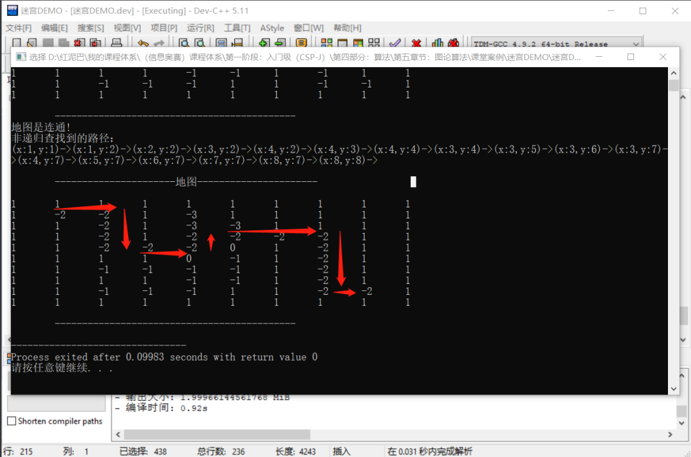


### 2.4 递归实现

可以使用`递归回溯`，找出所有的路径。

```c
/*
*递归查找路径
*/
bool Maze::searchPathByRecursion(Position start,Position end,int deep) {
 Maze::maze[start.x][start.y]=deep;
 //是否是死胡同坐标
 bool isConnection=false;
 Position tmpPos;
 //查找相邻坐标
 for(int i=0; i<4; i++ ) {
  //相邻坐标
  tmpPos= { start.x+dirs[i].xOffset,start.y+dirs[i].yOffset };
  if( Maze::maze[tmpPos.x][tmpPos.y]==-1  ) {
   //可访问
   isConnection=true;
   Maze::maze[tmpPos.x][tmpPos.y]=deep;
   if(tmpPos==end ) {
    Maze::totalCount++;
    cout<<"第"<<Maze::totalCount<<"种"<<endl;
    //输出
    Maze::showMap();
   } else {
    //递归,如果相邻坐标是死胡同，则当前坐标也是
    isConnection=Maze::searchPathByRecursion(tmpPos,end,deep+1);
   }
   //回溯时恢复状态
   //Maze::maze[tmpPos.x][tmpPos.y]=-1;
  }
 }
 if(!isConnection)
  //死胡同坐标，回溯不用判断是否死胡同
  Maze::maze[start.x][start.y]=-3;
 return isConnection;
}
```

**测试代码：**

```c++
int main(int argc, char** argv) {
 //省略……
 //递归搜索路径
 maze.searchPathByRecursion(startPos,endPos,2) ;
 return 0;
}
```

注释如下代码：

```c
//Maze::maze[tmpPos.x][tmpPos.y]=-1;
```

会显示一条路径。如下图所示，`-3`表示递归过，但是`死胡同`的坐标。标记为大于等于 `2` 的位置为可正常通行。

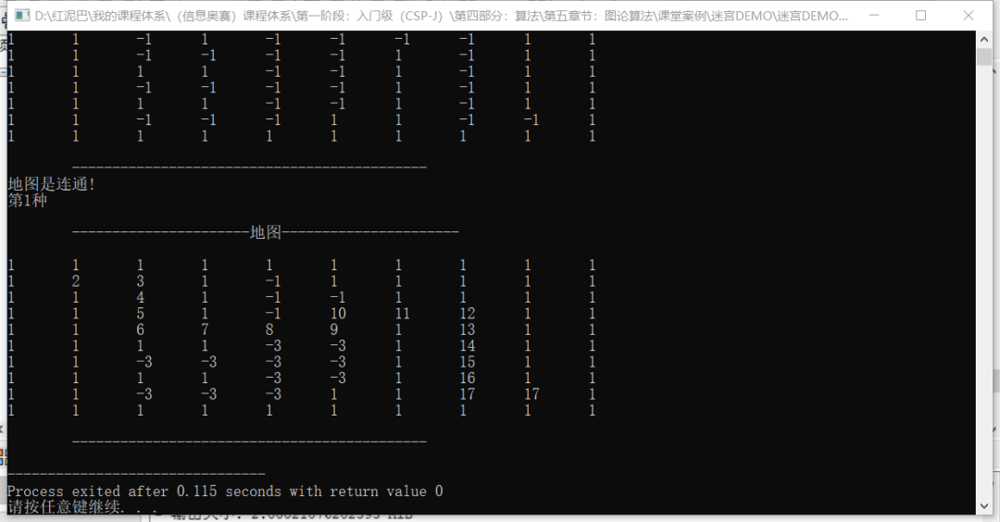


如果打开如下代码。

```c
//回溯，恢复原来状态
Maze::maze[tmpPos.x][tmpPos.y]=-1;
```

显示所有路径，回溯不用判断死胡同坐标，回溯时会自动恢复原来的状态。

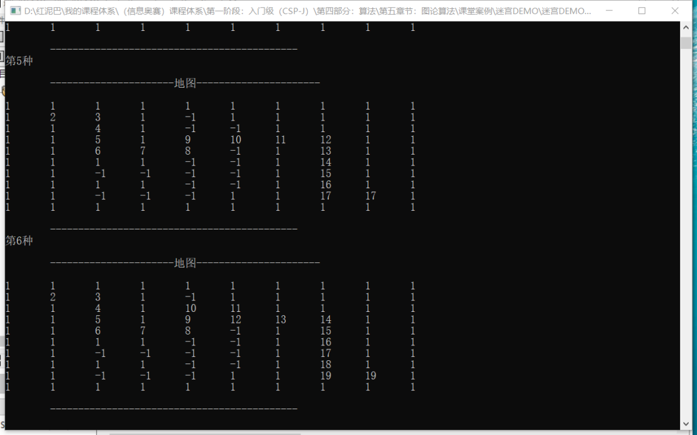


### 2.4 广度搜索

在家拖地时，如果从当前位置向前拖，然后再折回，这和深度优先搜索方式一样。另一种是从左向右方式，逐渐向远处外延，这和广度搜索一样。

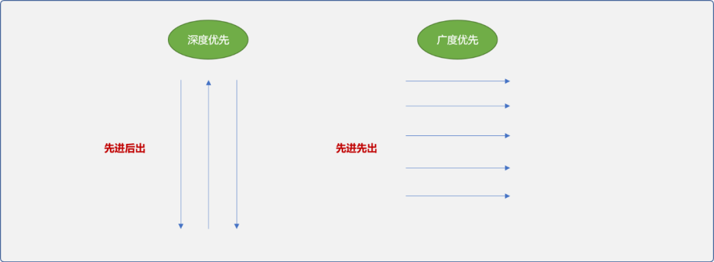


广度优先类似于一石激起千层浪，一层层向外推动。

```c
/*
*广度搜索
*/
void Maze::searchPathByQueue(Position start,Position end) {
    //所有路径
 vector<vector<Position>>  paths;
 //把起始点放入队列
 Maze::mazeQueue.push(start);
 vector<Position> path;
 path.push_back(start);
 paths.push_back(path);
 Position pos;
 bool isConnection;
 Position tmpPos;
 while(true ) {
  //从队列中得到队头数据
  pos=Maze::mazeQueue.front();
  Maze::mazeQueue.pop();
  for(int i=0; i<paths.size(); i++) {
   //得到所有路径
   path=paths[i];
   Position lastPos=path.back();
   for(int j=0; j<4; j++) {
    Position tmp= {lastPos.x+dirs[j].xOffset,lastPos.y+dirs[j].yOffset };
    if(tmp==pos) {
     path.push_back(pos);
     paths.push_back(path);
     break;
    }
   }
  }
  //到达终点
  if(pos==end) {
   for(int i=0; i<paths.size(); i++) {
    if( paths[i].back()==end ) {
     for(int j=0; j<paths[i].size(); j++) {
      Maze::maze[ paths[i][j].x ][paths[i][j].y]=-2;
      paths[i][j].desc();
     }
     break;
    }
   }
   return;
  }
  //查找相邻的坐标
  for(int i=0; i<4; i++) {
   tmpPos= { pos.x+dirs[i].xOffset,pos.y+dirs[i].yOffset };
   if( Maze::maze[tmpPos.x][tmpPos.y]==-1 ) {
    //可通加入队列
    Maze::mazeQueue.push(tmpPos);
    Maze::maze[tmpPos.x][tmpPos.y]=0;
   }
  }

 }
}
```

**输出结果：** 迷宫中的广度优先搜索相当于在无向图中查找路径，可以找到任何 `2` 个可通行位置的最短路径。这里只显示起点到终点的最短路径，如下`-2`所标记的坐标连接起来的路径。

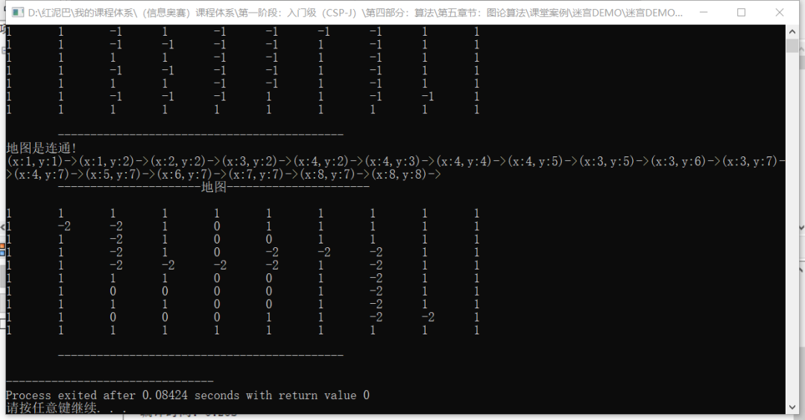


## 3. 总结

迷宫本质是邻接矩阵，可用来存储树和图的关系。所以，迷宫问题可归结于树或图的路径搜索问题。


