# C++不知算法系列之高精度数值的加、减、乘、除算法


## 1. 前言

**什么是高精度数值处理算法？**

`高精度数值`指因受限于计算机硬件的制约，超过计算机所能存储范围的数值。既然不能存储，更谈不上运算。

对此类数值的加、减、乘、除运算需要提供针对性的算法方能获取到结果。此类算法的设计思路因有别于其它算法，为了研究的方便，称此类算法为高精度数值处理算法。

本文将讲解如何实现对此类数值的加、减、乘、除运算。

## 2. 高精度数值的运算

对高精度数值运算时，需要从 `2` 个方面入手：

- **如何存储**：其基本存储思想是把数值以字符串的形式输入，然后转储于整型类型的数组中。理论上，数组的长度是不受限制的，或者采用一部分一部分的处理方式。
- **如何计算**：基本计算思想是把计算的`2`个数值以数组形式存储后，以逐位逐位地方式进行计算。如此，把大问题化解成了小问题。

### 2.1 高精度的加法

高精度数值相加的思路：

- 用整型数组存储 `2` 个加数。为了遵循数组从头指针向尾指针扫描的使用习惯，存储时，可以把低位存储在前面，高位存储存在后面，至于是否如此存储可以根据实际设计的算法决定。如下存储 `374`和`65`。

```cpp
//加数一
int num1[100]={4,7,3,0,0……};
//加数二
int num2[100]={5,6,0,0……};
//相加结果,初始化为 0
int result[100]={0};
//存储两数相加的进位
int jinWei=0;
```

- 遍历数组，对 `2` 个数组的对应位进行相加。如`num1[0]+num2[0]`，且把相加结果存储到 `result[0]`位置。相加时，需要根据加法运算法则，考虑进位和不进位两种情况。

**不进位情况**：如 `num1[0]+num2[0]=4+5`不需要进位，直接把结果存储到 `result[0]`中。

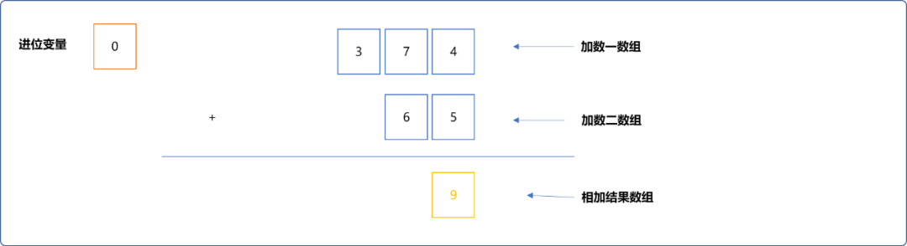

**进位情况**：如`num1[1]+num2[1]=7+6=13`。有进位操作，则把结果的余数存储在`result[1]=3`中。把结果的商（进位值）临时存储在变量`jinWei`中。

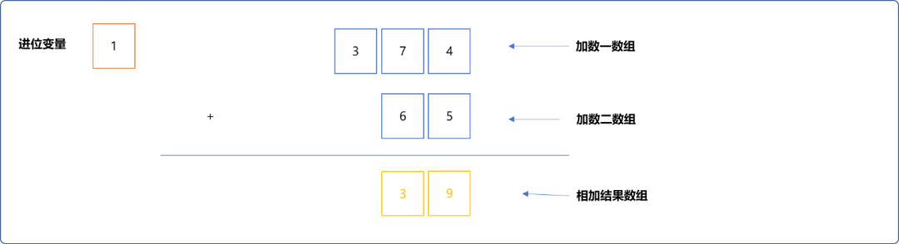

最后，`num1[2]+num2[2]+jinWei=3+0+1=4`存储在`result[2]`中。

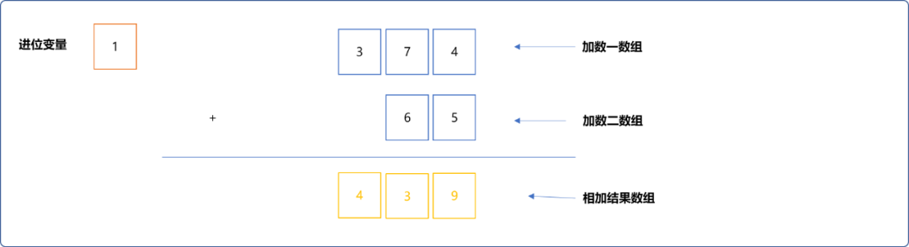

**通用逻辑思想：**

**加数一和加数二对应位中的值和进位变量中的值一起相加，结果的余数存储在结果数组中，商存储在进位变量中。**

**编码实现：**

```c
#include <iostream>
#include <cstring>
using namespace std;
int main(int argc, char** argv) {
 //存储加数一(被加数),初始为 0
 int num1[100]= {0};
 //加数一的长度
 int numLen1=0;
 //存储加数二（加数），初始为 0
 int num2[100]= {0};
 //加数二的长度
 int numLen2=0;
 //存储结果
 int result[100]= {0};
 //存储进位值
 int jinWei=0;
 //加数一的字符串格式
 string numStr1;
 //加数二的字符串格式
 string numStr2;
 //输入加数一
 cout<<"请输入加数一："<<endl;
 cin>>numStr1;
 //转存至数组中(低位存储在数组的前面)
 numLen1= numStr1.size();
 for(int i=0; i<numLen1 ; i++) {
  num1[i]=numStr1[numLen1-1-i]-'0';
 }
 //输入加数二
 cout<<"请输入加数二："<<endl;
 cin>>numStr2;
 numLen2=numStr2.size();
 //转存至数组中(反序存储)
 for(int i=0; i<numLen2; i++) {
  num2[i]=numStr2[numLen2-1-i]-'0';
 }
 numLen1=numLen1>=numLen2?numLen1:numLen2;
 int idx=0;
 while(idx<numLen1) {
  //对应位相加，注意，要加上进位值
  result[idx]=num1[idx]+num2[idx]+jinWei;
  //存储进位数值
  jinWei=result[idx] / 10;
  //存储余数
  result[idx] %=10;
  idx++;
 }
    //处理进位值
 if(jinWei>0) {
  result[idx]=jinWei;
 } else {
  idx--;
 }
    //输出
 for(int i=idx; i>=0; i--) {
  cout<<result[i]<<"";
 }
 cout<<endl;
 return 0;
}
```

**输出结果：**

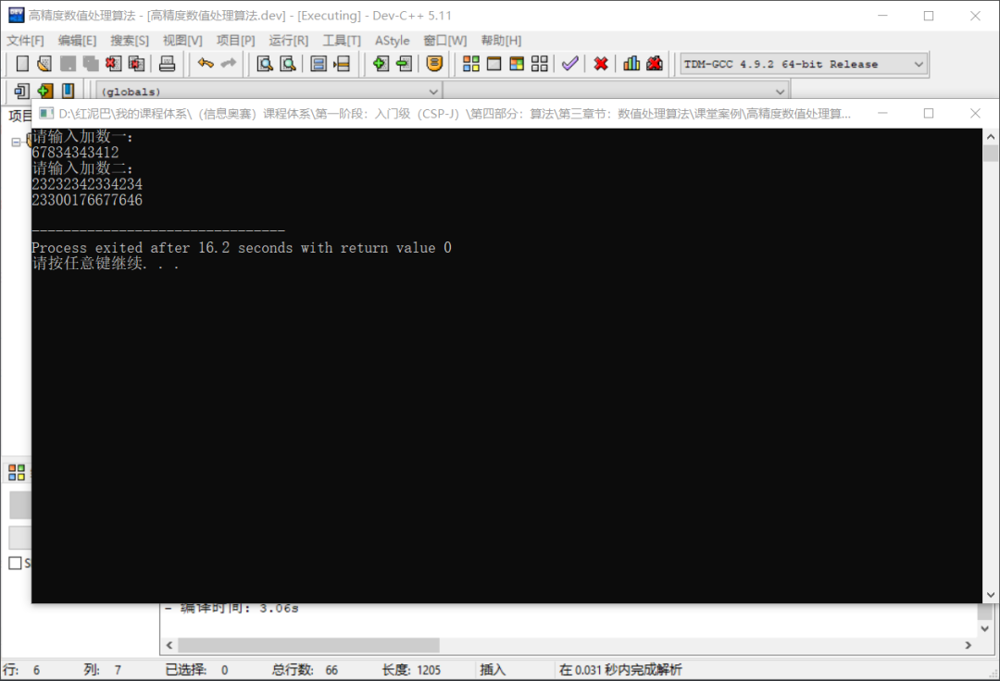


### 2.2 高精度的减法

减法是加法的逆操作，加法时需要考虑进位操作， 减法时则需要考虑借位与不借位两种情况。

- 不借位：`6-5`不需要借位。

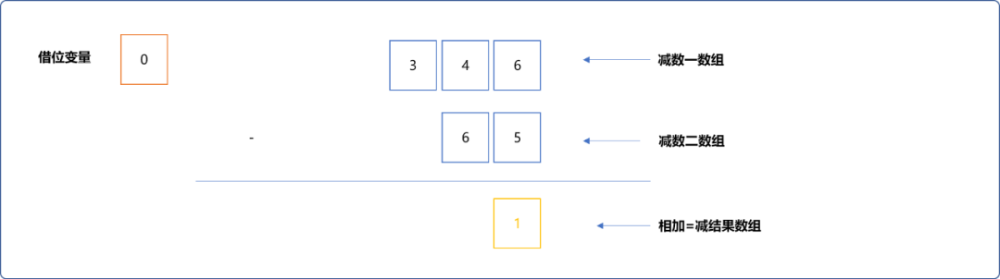


- 借位：如下十位的 `4`减`6`，需要借位。向百位借 `1` 当`10`，`4`变成`14`。高位`3`变成`2`。

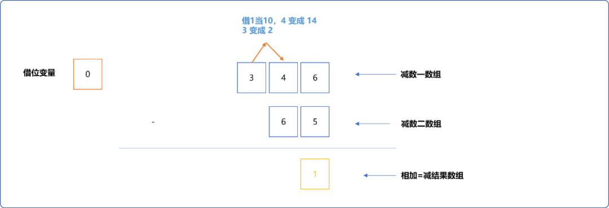


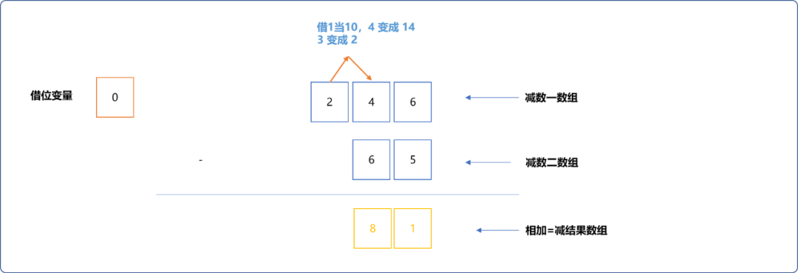


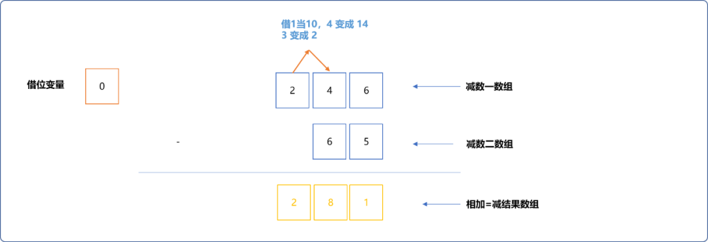


**编码实现：**

```c
#include <iostream>
#include <cstring>
using namespace std;
int main(int argc, char** argv) {
 //存储减数一(被减数),初始为 0
 int num1[100]= {0};
 //减数一的长度
 int numLen1=0;
 //存储减数二（减数），初始为 0
 int num2[100]= {0};
 //减数二的长度
 int numLen2=0;
 //存储结果
 int result[100]= {0};
 //减数一的字符串格式
 string numStr1;
 //减数二的字符串格式
 string numStr2;
 //输入减数一
 cout<<"请输入减数一："<<endl;
 cin>>numStr1;
 //输入减数二
 cout<<"请输入减数二："<<endl;
 cin>>numStr2;
 //转存至数组中(反序存储)
 numLen1= numStr1.size();
 for(int i=0; i<numLen1 ; i++) {
  num1[i]=numStr1[numLen1-1-i]-'0';
 }
 numLen2=numStr2.size();
 //转存至数组中(反序存储)
 for(int i=0; i<numLen2; i++) {
  num2[i]=numStr2[numLen2-1-i]-'0';
 }
 numLen1=numLen1>=numLen2?numLen1:numLen2;
 int idx=0;
 while(idx<numLen1) {
  //是否需要借位
  if(num1[idx]<num2[idx]) {
   //需要借位
   num1[idx]+=10;
   num1[idx+1]--;
  }
  result[idx]=num1[idx]-num2[idx];
  idx++;
 }
 for(int i=idx; i>=0; i--) {
  if(result[i]!=0)
   cout<<result[i]<<"";
 }
 cout<<endl;
 return 0;
}
```

执行结果：

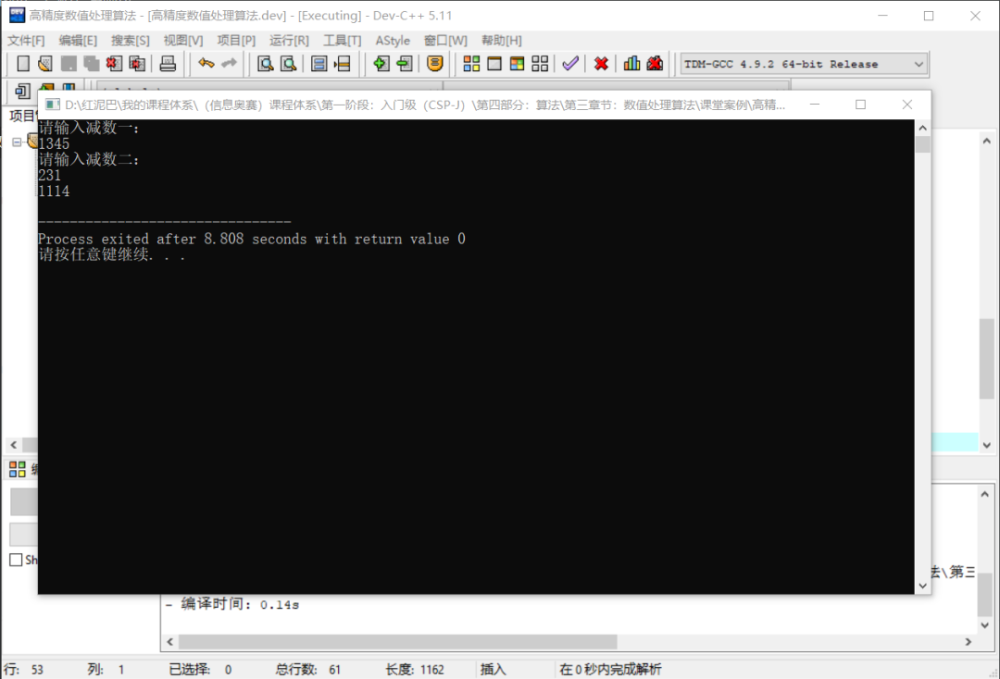


如上代码，对原数组中的数据会进行修改。

也可以如下实现：使用一个借位标志变量，用来标识对某位进行计算时，是否借过位。

```cpp
#include <iostream>
#include <cstring>
using namespace std;
int mai123n(int argc, char** argv) {
    //省略……
    //是否借位标志信息
 int jieWei=0;
 int idx=0;
 while(idx<numLen1) {
  //如果被借位 
  if(jieWei==1) {
   //借位后是否小于减数 
   if(num1[idx]-jieWei<num2[idx]) {
    //需要再向高位借，借1 当 10 
    jieWei=1;
    result[idx]=num1[idx]-jieWei+jieWei*10-num2[idx];
   } else {
    //不需要借位 
    result[idx]=num1[idx]-jieWei-num2[idx];
    jieWei=0;
   }
  } else {
   //没有被借位 
   if(num1[idx]<num2[idx]) {
    //借 1 当 10 
    jieWei=1;
    result[idx]=num1[idx]+jieWei*10-num2[idx];
   } else {
    //不需要借位 
    jieWei=0;
    result[idx]=num1[idx]-num2[idx];
   }
  }
  idx++;
 }
    //省略……
 return 0;
}
```

虽然不会修改原数组中的数字，但逻辑有点累赘。

> Tips：如上算法，需要保证大数减小数。

### 2. 3 高精度的乘法

商精度数值相乘可以有 `2` 种参考方案，如计算 `246*65`：

#### 2.3.1 方案一

- 把高精度被乘数`246`分别乘以乘数的每一位，如先乘以`5`得到`1230`，然后再把`246`乘以`6`得到`1476`。
- 然后把`1230`和`1476*10`相加，得到`15990`。
- 这种方案当乘数位数较多时，需要借用的临时存储空间会增多，且需要使用循环进行高精度数值累加。并不可取。

#### 2.3.2 方案二

方案二和方案一同工异曲，不借助额外的空间存储数据，使用结果数组存储中间计算数值，也存储最终结果数值。不产生额外的空间使用代价。

在高精度乘法时，有一个位置关系需要了解。如`nums1[100]={6,4,2}`，`nums[100]={5,6}`，当使用`result[100]`存储最终相乘结果时，`nums1[i]*nums2[j]`的结果存储在 `result[i+j]`中。

> **Tips：**从数学法则可知，当 `2` 数两乘时，百位乘以十位的值要存储在结果的千位上。

- 先计算被乘数的**个位数值 6**乘以乘数 `65` 的结果，也就是计算 `6*65`的结果。这个其实很好计算，使用一个进位变量存储进位值。

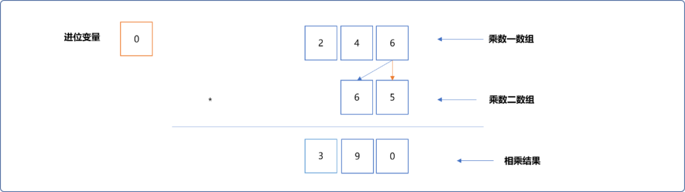


- 再计算被乘数的**十位数值 4**乘以乘数的结果，也就计算机`4*65`的结果。在相乘时需要加上上述已经乘出来的结果 。如`4*5+9=29`。使用进位变量存储进位值，使用原来位置存储余数。

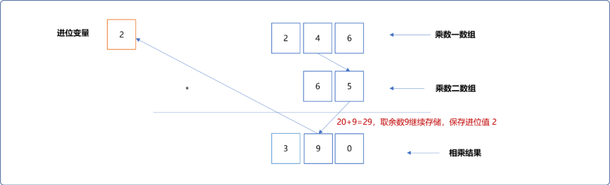


继续：`4*6=24`，加上原来的值`3`，再加上进位值`2`，最终结果是 `29` ,取余数 `9` 存储，保存进位值 `2`。

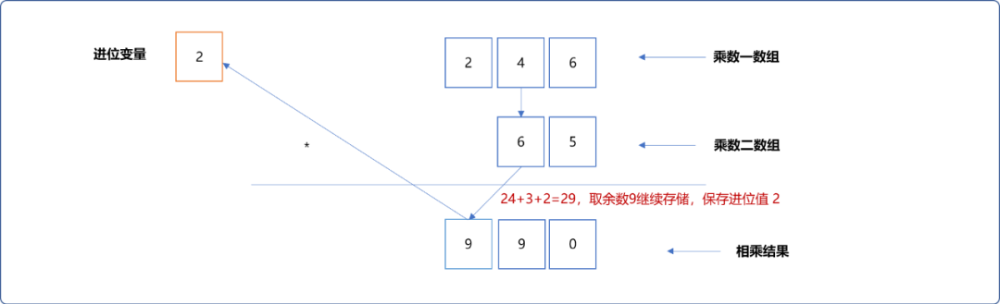


把最后的进位值作为进位作为结果数值存储 。

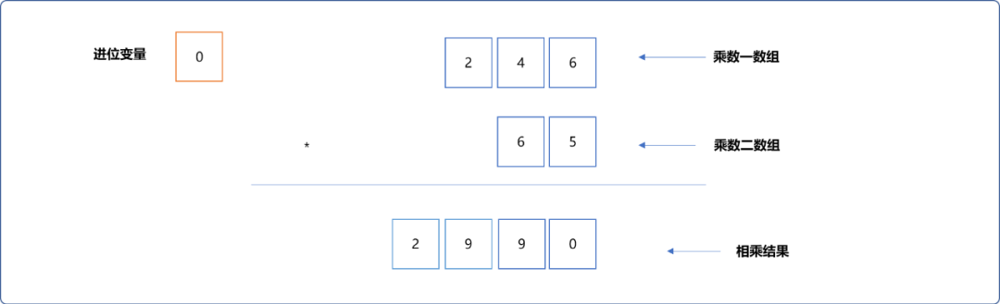


- 把被乘数的百位`2`和乘数`65`相乘。逻辑和上面一样。

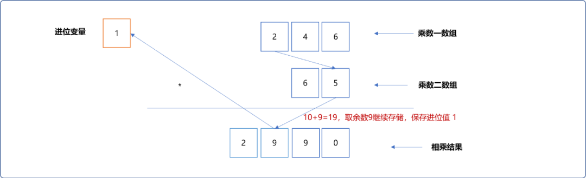


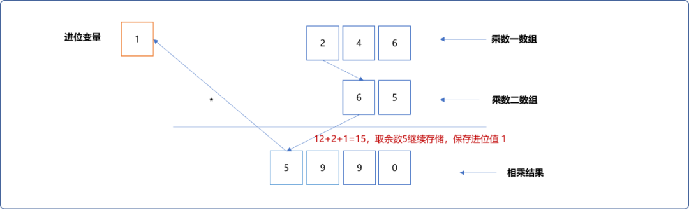


最后在结果中添加进位值。

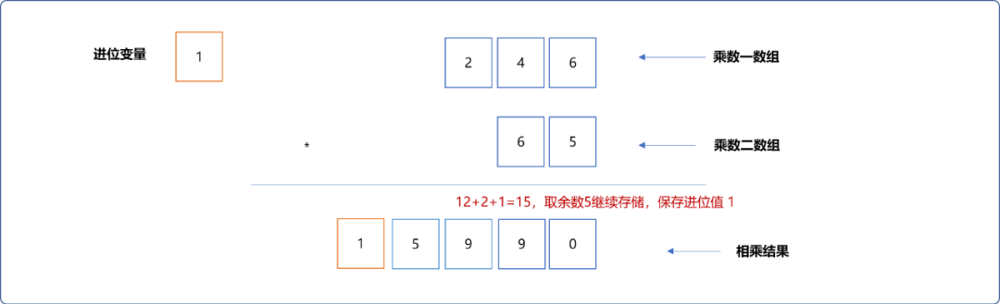


**编程实现：**

```c
#include <iostream>
#include <cstring>
using namespace std;
int main(int argc, char** argv) {
    //省略乘数的输入，和前面相加数、相减数输入的代码一样
 for(int i=0; i<numLen1; i++) {
  int jinWei=0;
  for(int j=0; j<numLen2; j++) {
            //对应位相乘时需要加上原来的数值和进位值，可参照上面的演示图
   result[i+j]=num1[i]*num2[j]+jinWei+result[i+j];
   jinWei=result[i+j]/10;
   result[i+j]%=10;
  }
        //把进位值添加到结果数组中……
  result[i+numLen2]=jinWei;
 }
 int c=numLen1+numLen2;
 while(result[c]==0 && c>1)
  c--;
 for(int i=c; i>=0; i--) {
  cout<<result[i];
 }
 cout<<endl;
 return 0;
}
```

输出结果：

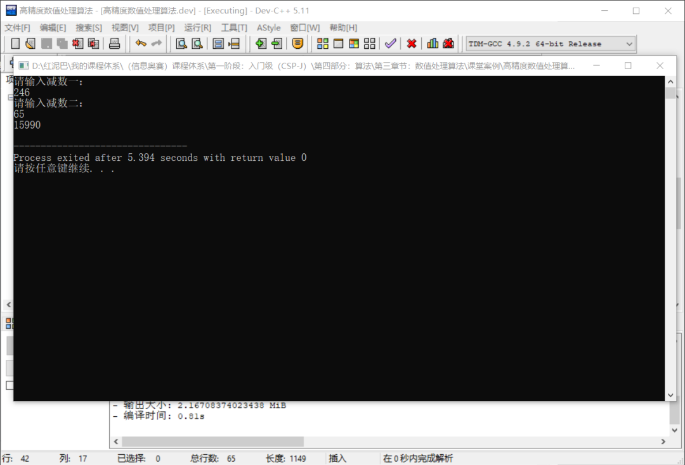


### 2.4 高精度相除

高精度相除分 `2` 种情况讨论：

- 高精度除以低精度（**低精度指计算机可以直接存储的数值**）。
- 高精度除以高精度。

#### 2.4.2 高精度除以低精度

所谓高精度除以低精度，存储每次相除的商（`0~9`之间），其余数和被除数后面数字相加，作为新的被除数继续做除法。

如计算 `642`除以`5`的流程：

- `6`除以`5`。商为`1`作为结果，余数`1`暂存起来。

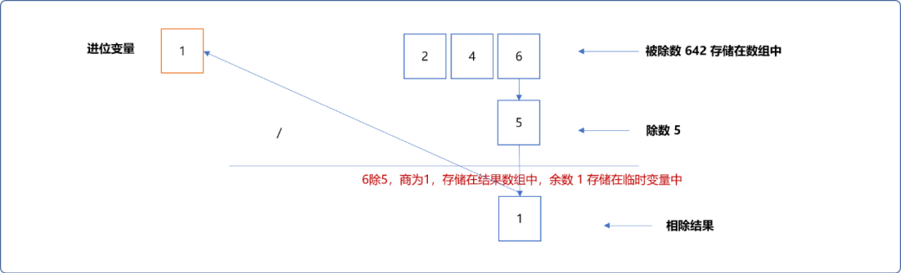


- `4`除`5`时，被除数需要加上上次余数的`10`倍再除。

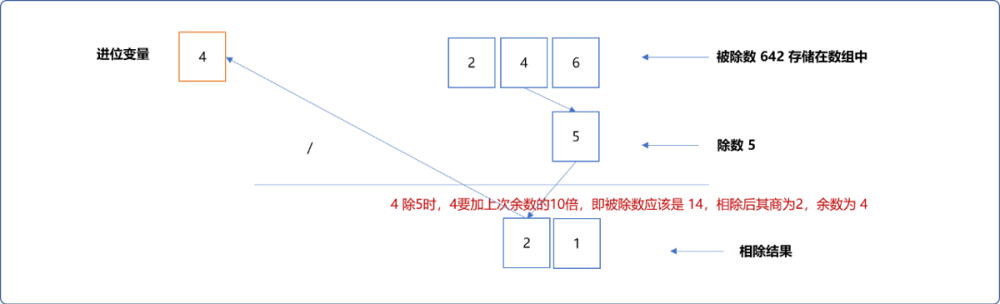


- `2除5`时如上一样，需要更新被除数后再除。

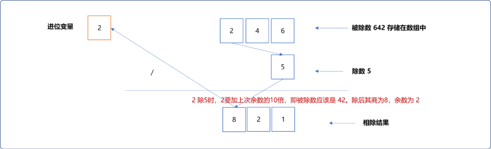


编码实现：

```c
#include <iostream>
#include <cstring>
using namespace std;
int main(int argc, char** argv) {
 //存储被除数,初始为 0
 int num[100]= {0};
 //除数的长度
 int numLen=0;
 //除数的字符串格式
 string numStr;
 //存储结果
 int result[100]= {0};
 //低精度数字
 int num2;
 cout<<"请输入高精度被除数："<<endl;
 cin>>numStr;
 cout<<"请输入低精度除数："<<endl;
 cin>>num2;
 //转存至数组中
 numLen= numStr.size();
 for(int i=0; i<numLen ; i++) {
  //先计算高位，所以高位存储在数组的前面
  num[i]=numStr[i]-'0';
 }
 //临时变量，存储每次相除的余数
 int temp=0;
 for(int i=0; i<numLen; i++) {
  //每次相除，被除数加上上次相除的余数的10倍
  result[i]= (num[i]+temp*10) / num2;
  temp=(num[i]+temp*10) % num2;
 }
    cout<<"结果：";
 for(int i=0; i<numLen; i++) {
  if(result[i]!=0)
   cout<<result[i];
 }
 cout<<endl<<"余数："<<temp;
 return 0;
}
```

输出结果：

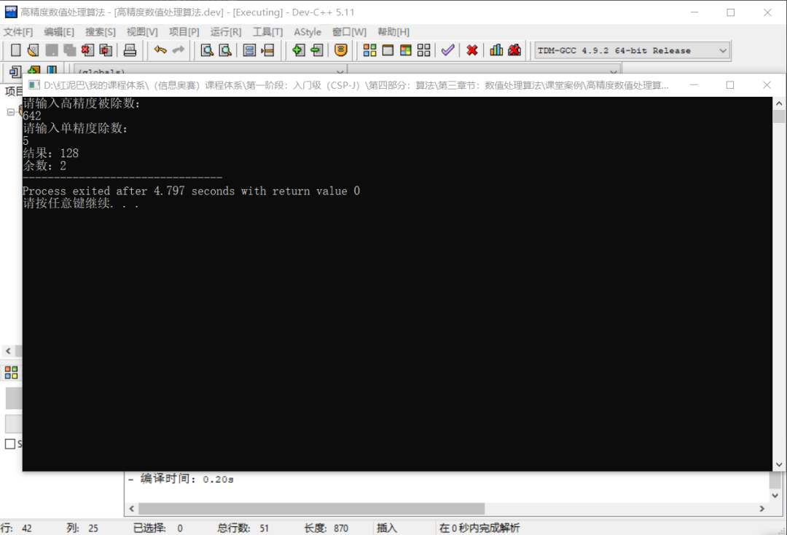


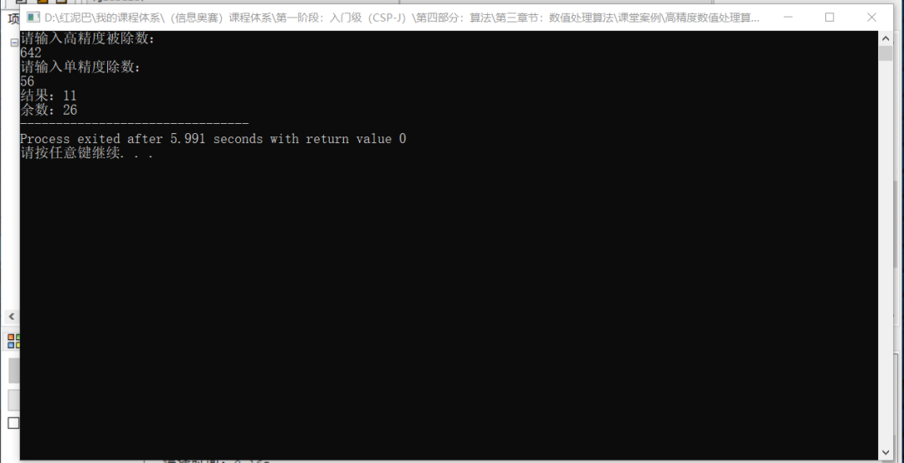


逐位相除，效率显然是较低的，可以采用一次多位相除方案。可以自行思考。

#### 2.4.2 高精度除以高精度

高精度除以高精度，可以把除法变成减法和加法操作。如：`264 除 56`的基本思路如下：

- 第一次：`264-56=208`。
- 第二次：`208-56=152`。
- 第三次：`152-56=96`。
- 第四次：`96-56=40`。
- 第五次：`40-56`条件不成立，结束相减操作。

当相减的结果小于除数时，不再相减，则`264 / 56`结果为 `4`，余数为 `40`。如上所述，除了不间断地对 `2` 个数字进行相减，还要统计相减的次数，本质是一个累加操作，其累加次数可能是一个高精度数值，所以要使用高精度相加算法。

> **Tips：**从数学角度思考，乘法的本质是加法操作，除法的本质是减法操作。

**编码实现：**代码中有注释，不再另行解释。

```c++
# include <iostream>
# include <cstring>
using namespace std;
/*
*初始化数组中的值
*/
void stringToNumber(int arr[]) {
 string snum;
 cin>>snum;
 arr[0] = snum.length();
 //用snum[0]存储数字长度
 for(int i=1; i<=arr[0]; i++)
  //将数串s转换为数组 a,并倒序存储
  arr[i] = snum[arr[0]-i] -'0';
}

/*
* 比较 2 个数字的大小
*/
int compare (int num1[],int num2[]) {
 //比较 2 个数字的位数
 if(num1[0]>num2[0]) return 1 ;
 if(num1[0]<num2[0]) return-1 ;
 //位数相同，则从高位向低位逐位比较
 for(int i = num1[0]; i>0; i--) {
  if (num1[i]>num2[i]) return 1 ;
  if (num1[i]<num2[i]) return- 1 ;
 }
 //各位都相等则两数相等
 return 0;
}

/*
* 使用函数封装前面的高精度数值相减算法
* num1-num2的结果存储在 num1 中
*/
void gjdJian(int num1[],int num2[]) {
 //比较两数大小
 int flag=compare(num1,num2);
 if (flag==0) {
  // 2 数相等
  num1[0] = 0;
  return;
 }
 if(flag==1) {
  for(int i = 1; i<= num1[0]; i++) {
   if(num1[i]<num2[i]) {
    //向上借位
    num1[i+1]--;
    num1[i]+= 10;
   }
   num1[i]-=num2[i];
  }
        //修正 num1 的位数信息
  while(num1[0]>0 && num1[num1[0]]==0)
   num1[0]--;
  return;
 }
}

/*
*高精度相除
*/
void gjdChu(int num1[],int num2[],int result[]) {
 //结果数值可能的位数
 result[0]=num1[0]-num2[0]+1;
 int count=0;
 //高精度累加的加数，加数只有一个有效的值 1 
 int tem[100]= {0,1};
 //进位值
 int temp=0;
 while  ( compare(num1,num2)>=0 ) {
  gjdJian(num1,num2);
        //统计相减的次数，高精度相加，每次在 result 的个位加 1 
        //如果考虑相除两个数的结果是低精度，由可以直接使用 count++
  for(int i=1; i<=result[0]; i++) {
   //对应位相加
   result[i]=result[i]+tem[i]+temp;
   //存储进位
   temp=result[i] / 10;
   //存储余数
   result[i] %=10;
  }
 }
}
int main(int argc, char** argv) {
 int num1[101]= {0};
 int num2[101]= {0};
 int result[101]= {0};
 stringToNumber(num1);
 stringToNumber(num2);
 gjdChu(num1,num2,result);
 for(int i=result[0]; i>0; i--) {
  if(result[i]!=0)
   cout<<result[i];
 }
 cout<<endl;
 for(int i=num1[0]; i>0; i--) {
  cout<<num1[i];
 }
 return 0;
}
```


**输出结果：**

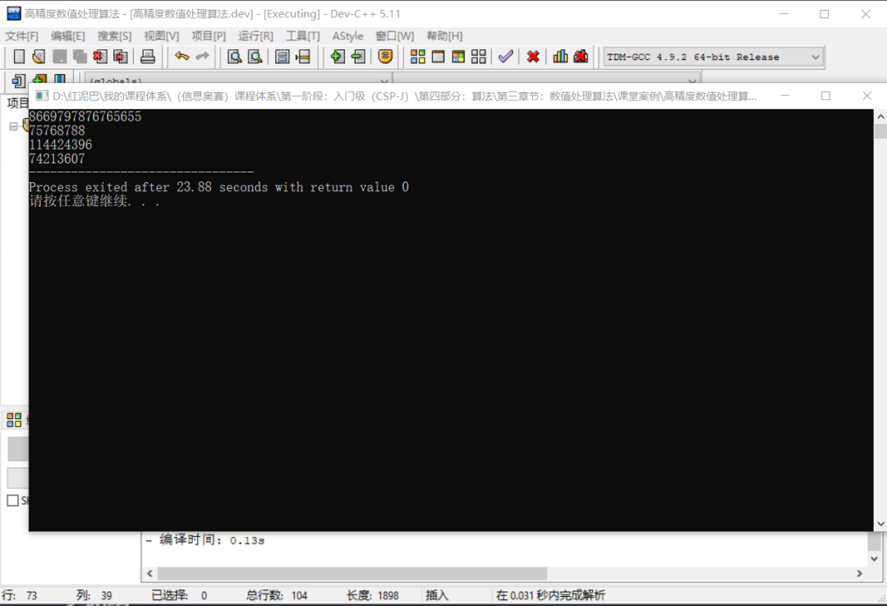


## 3. 总结

本文讲解了高精度相加、相减、相乘、相除操作。


