# C++ 深入动态规划算法思想


## 1. 前言

前面写过一篇博文，介绍了什么是动态规划算法。动态规划算法的最大特点，原始问题可以通过分解成规模更小的子问题来解决，子问题之间互成依赖关系，也就是先计算出来的子问题的结果会影响到后续子问题的结果。

有点类似于武侠片中，主角受伤后，一群江湖侠士排成一队，最后一人把真气传递给前面的、前面的再传递给他前面……如此传递，最后传递了主角，主角获得了所有人的真气。

真气传递过程中，每一个人就是一个子问题，如果每一个人传递出去的真气是个体最大的，则最后主角获取到的真气必然也是最大的。也是动态规划中的最优子结构的概念。

本文通过几个案例，深入探讨动态规划。

## 2. 案例

### 2.1 最短路径

#### 2.1.1 问题描述

求解如下有向权重图中从`A`城市到`E`城市之间的最短路程。城市与城市之间的连接线上的数字表示城市之间的路程。

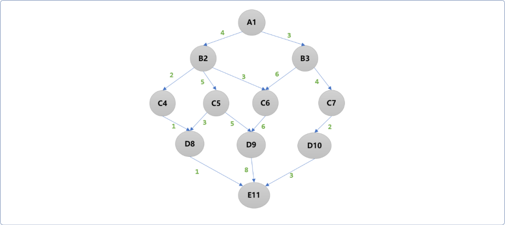

#### 2.1.2 问题分析

动态规划是一种从下向上的解决方案，也就是逆推思维。

顺着这个思路，本题目可以先计算离`E`最近的`D层到E的最短路程`。`D`层上有 `3` 个顶点，意味着需要单独计算 `3` 次。如此可见，原始问题是可以拆分成多个子问题进行解决的，符合动态规划的的条件之一：**存在子问题**。

为了分析问题的方便，给每一个结点一个编号（如上图，字母后面的数字便是结点的编号）。并且把任一`结点`到`E`结点的最短路程存储在一维数组中(也称为 `db` 数组)。

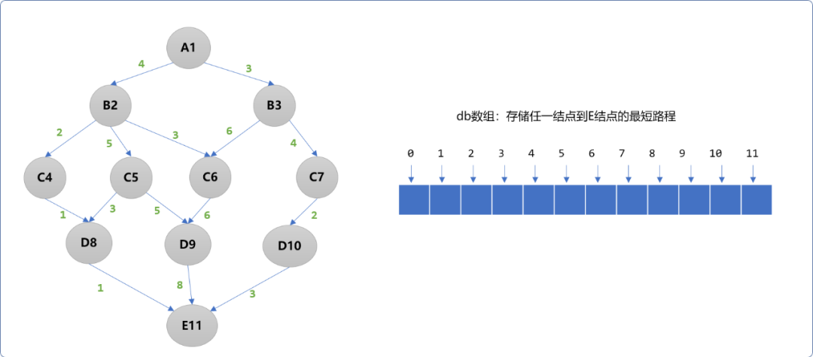

- 从`D`层到`E`是直达的，权重值即是最小值，可以直接存储。

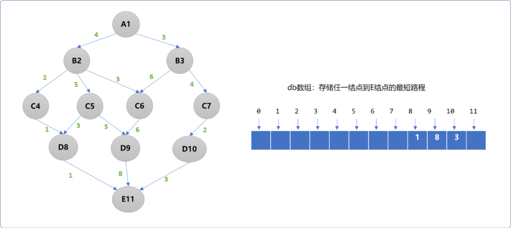

- `C`层到`E`层的路程计算原则。`C4~E`中间只经过`D8`，路程数为`2`，即`C4～E` 的最短路程为`2`。但是，`C5~E`中间可以经过`D8和D9`，`C5~D8~E`的路程数是`4`，`C5~D9~E`的路程数是`13`，则需要在两者中选择最小值，即`min(4,13)`，或说`C5~E`的最短路程是`4`。`C6~E`的最短路程为`14`,`C7~E`的最短路程为`5`。

  > **Tips：**
  >
  > **路径计算法则**：当前结点到中间结点的权重加上中间结点到最终结点的最小路程值。
  >
  > 如 `C5`到`E`结点可以通过中间结点`D8、D9`到达，即有 `2` 条可行路径。
  >
  > 如计算 `C5~D8~……E`的路程值：`C2到D8`的权重加上`D8`到`E` 的最小路程值（可以从`db`数组中获取）。即：`3+1`。
  >
  > **路径选择原则**：当存在多条路径时，选择值最小的。如上分别计算出 `2` 条路程值`(4，13)`后，再选择最小值，如此能得到`C5~E`的路径值 4 是最小的。

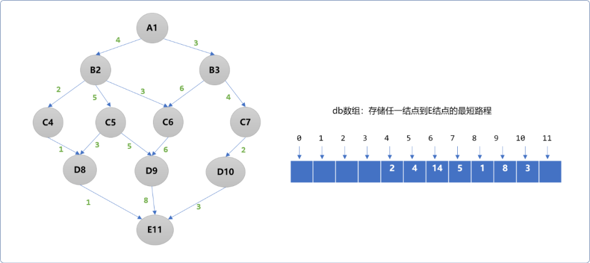

- `B`层到`E`的最路短路程计算和上述是一样的。`B2`可以经过`C4、C5、C6`到达`E`，在 `3` 条路径中选择最小值 `min(4,9,17)`，即`B2~E`最短路程为`4`。`B3`可以经过`C6、C7`到达 `E`，同样在 `2` 条路径中选择最小值 `min(20,9)`。即`B2~E` 最短路径为`9`。

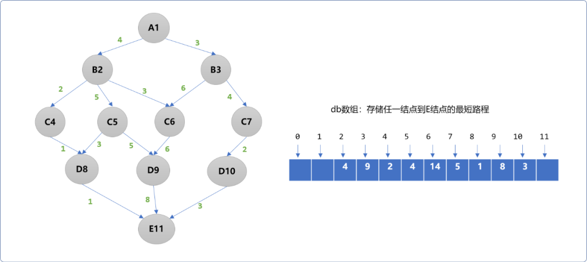

- `A1`可以经过`B2、B3`到达`E`，在 `2` 条路径中选择最小值，即`min(8,12)`。最终可知`A~E`的最短路程为`8`。

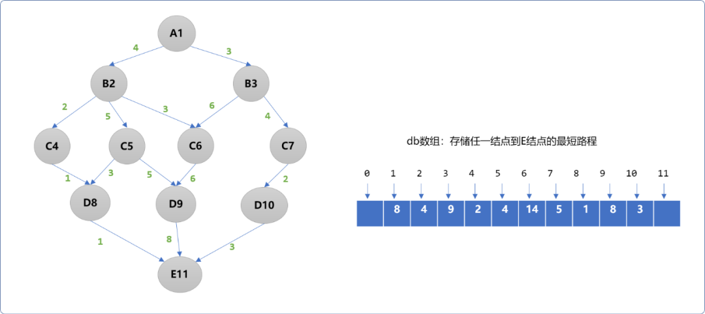

如上述流程可知，向上逆推过程中，求解到每一层到达`E`结点的最短路程后，再把最小值向上层提供，显然，最后所求解的值一定是最小值，也称为最优子结构思想。不仅能求解出`A~E`的最短路径，并且能求解出每一个结点到达`E`的最短路程。

#### 2.2.3 编程实现

动态规划算法中，有 `2` 个非常重要的信息需要获取：

- 存储子问题的状态信息(本题指子问题到最终结点的最短路程)。如上述演示图中的`db`一维数组。
- 另就是状态求解方程式。通过上述分析可知，`f(v)=min( w(v,v1)+db(v1), w(v,v2)+db(v2),…… )`。

问题域本身也有 `2` 个信息：

- 结点数据。
- 结点之间的关系数据。

```cpp
#include <iostream>
#include <map>
#define INT_MAX 0x7fffffff
using namespace std;
int getMin(int num1,int num2) {
 return num1<num2?num1:num2;
}
//测试
int main(int argc, char** argv) {
 //状态信息表
 int db[12]= {0};
 //对结点进行编号，并存储存结点信息
 string verNames[12]= {"","A1","B2","B3","C4","C5","C6","C7","D8","D9","D10","E11"};
 //邻接矩阵表，存储结点之间的关系
 int matrix[12][12]= {  { 0,0,0,0,0,0,0,0,0,0,0,0 },
  { 0,0,4,3,0,0,0,0,0,0,0,0 },
  { 0,0,0,0,2,5,3,0,0,0,0,0 },
  { 0,0,0,0,0,0,0,4,0,0,0,0 },
  { 0,0,0,0,0,0,0,0,1,0,0,0 },
  { 0,0,0,0,0,0,0,0,3,5,0,0 },
  { 0,0,0,0,0,0,0,0,0,6,0,0 },
  { 0,0,0,0,0,0,0,0,0,0,2,0 },
  { 0,0,0,0,0,0,0,0,0,0,0,1 },
  { 0,0,0,0,0,0,0,0,0,0,0,8 },
  { 0,0,0,0,0,0,0,0,0,0,0,3 },
  { 0,0,0,0,0,0,0,0,0,0,0,0 }
 };
 //从编号为 10 的结点开始向上计算
 for(int i=10; i>0; i--) {
  //最小值
  int minVal=INT_MAX;
  for(int j=1; j<12; j++) {
            //得到相邻结点的权重和相邻结点到最终点的最短路程，
   if( matrix[i][j]!=0 &&  matrix[i][j]+db[j] < minVal ) {
                 //找到最小值，本题目的关键所在
    minVal= matrix[i][j]+db[j];
   }
  }
  db[i]=minVal;
 }
    //输出所有最小短路
 for(int i=1; i<11; i++) {
  cout<<verNames[i]<<"~E 的最短路程："<< db[i]<<endl;
 }
 return 0;
}
```

**输出结果：**

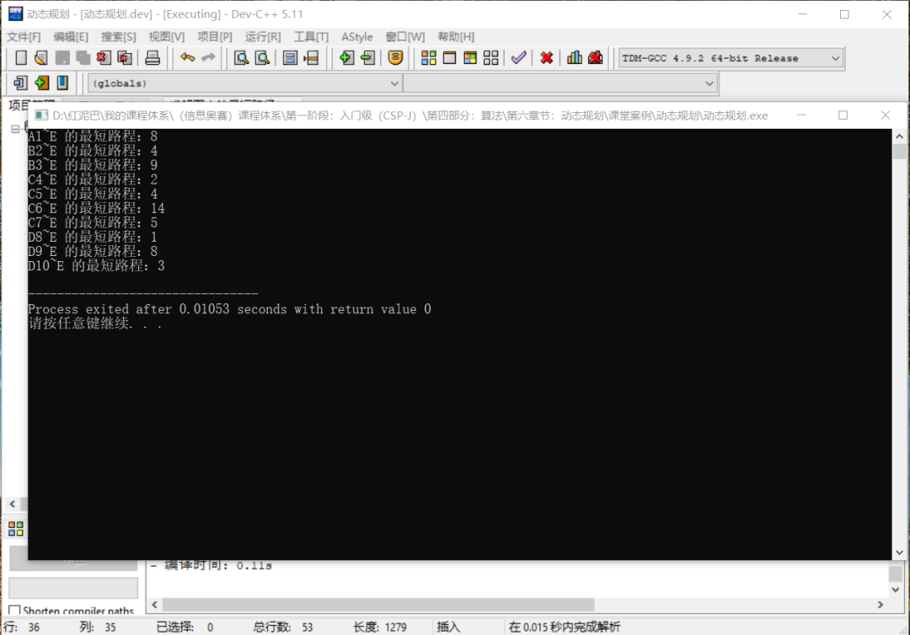

### 2.2 找零钱

#### 2.2.1 问题描述

给你`k`种面值的硬币，面值分别为`c1, c2 ... ck`，每种硬币的数量无限，再给一个总金额`amount`，问**最少**需要几枚硬币凑出这个金额，如果不可能凑出，算法返回 -1 。

比如说`k = 3`，面值分别为 `1，2，5`，总金额`amount = 11`。那么最少需要 `3` 枚硬币凑出，即 `11 = 5 + 5 + 1`。

#### 2.2.2 分析问题

假设现有面值为 `{1,5,10,21,25}`的币种，需要找的零钱是 `63`（单位都是分）。

- 当零钱为 `1,2，3,4`分时，都只能由 `1` 分的硬币组成，找回的硬币数分别是：`1`枚，`2`枚，`3`枚，`4`枚。如下图所示：

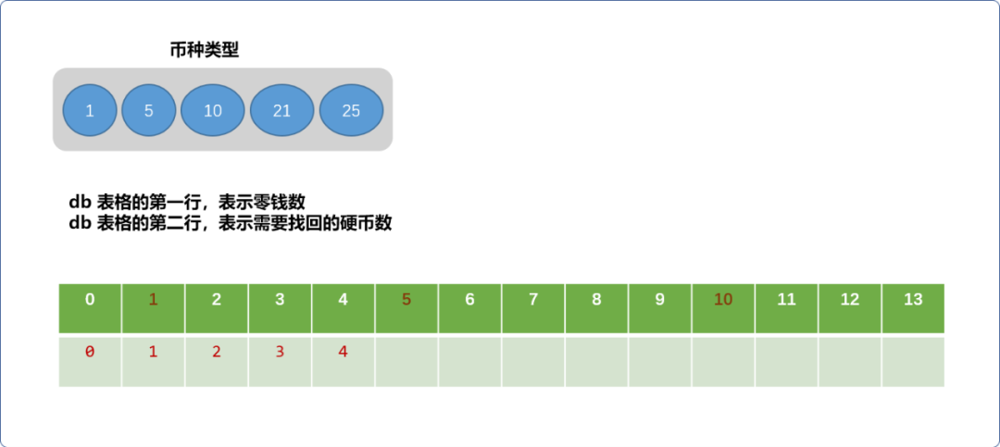

- 当找零为 `5` 时，可以有 `2` 种选择方案。先找出 `1` 枚 `1` 分硬币，然后计算 `5-1=4`分钱需要找回多少硬币，因为 `4`分要找回 `4`个硬币，共需要 `5` 枚。另就是直接拿出一枚 `5` 分硬币，显然，`1` 枚更少。

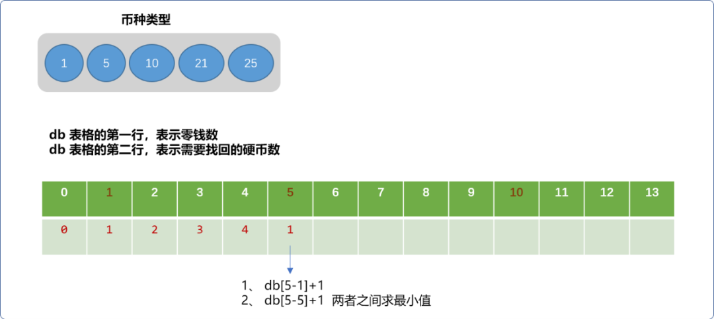

- 当找零为 `6` 时，也有 `2` 种方案，先拿出一枚 `1` 分硬币，再计算剩下的 `5` 分钱最少需要找回多少硬币。另一个方案就是拿出一枚 `5`分硬币，计算剩下的 `1` 分钱需要找回的最少硬币。


- 当找零为 `11` 时，则会有 `3` 种方案，可以得到一个结论，方案的多少由小于此零钱的币种数决定。原理很简单，对于 `11` 分钱的零钱而言，可以先拿出一枚 `1`分的硬币，也可以先拿出一枚`5`分的硬币，或者是拿出一枚 `10`分的硬币，然后再计算剩下的钱需要找回多少硬币。

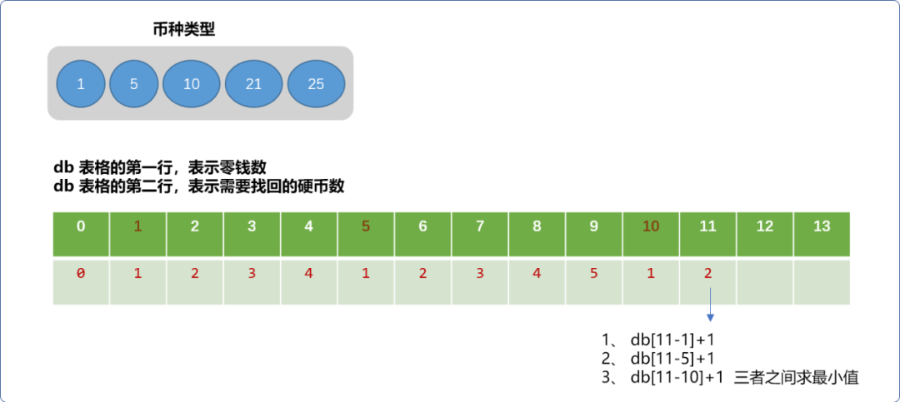

#### 2.2.3 编码实现

```cpp
#include <iostream>
#include <vector>
using namespace std;
int main(int argc, char** argv) {
 int money=0;
 cout<<"请输入零钱数:"<<endl;
 cin>>money;
 //硬币类型
    int coins[5]= {1,5,10,21,25};
 //状态数组，零钱需要找回的硬币数
 vector<int> dp(money+1, money+1);
 dp[0]=0;
 for(int i=1; i<=money; i++) {
  for(int j=0; i>=coins[j]; j++) {
             //求最小值            
   dp[i]=dp[i] < dp[ i-coins[j] ]+1 ? dp[i] : dp[ i-coins[j] ]+1;      
  }
 }
 cout<<dp[money]<<"\t";
 return 0;
}
```

输出结果：

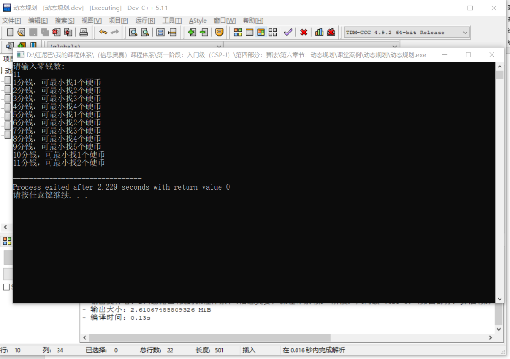

### 2.3  背包问题

#### 2.3.1  问题描述

有一个可装载重量为`W`的背包和`N`个物品，每个物品有重量和价值两个属性。其中第`i`个物品的重量为`wt[i]`，价值为`val[i]`，现在用这个背包装物品，最多能装的价值是多少？

> **Tips：** 题目中的物品不可以分割，要么装进包里，要么不装，不能切成两块装一半。

如输入如下数据：

```cpp
N = 3, W = 6
wt = [ 1,2,7 ]
val = [4,3,2 ]
```

可以选择前两件物品装进背包，总重量 `3` 小于`W`，可以获得最大的价值是 `7`。

本题依然使用动态规划算法解决。

#### 2.3.2 问题分析

从本文上面 `2` 道题目的解决过程可知，解决问题不是一趋而蹴，总是从一个很小的问题开始进行推导。本题一样，可以先简化问题，一旦找到问题的规律后，便可放大问题。

背包问题，有 `2` 个状态值，背包的容量和可选择的物品。

- 物品对于背包而言，只有 `2` 种选择，要么装下物品，要么装不下，如下图所示，表格的行号表示物品编号，列号表示背包的重量。单元格中的数字表示背包中最大价值。当物品只有一件时，当物品重量大于背包容量，不能装下，反之，能装下。如下图，物品重量为 `1`。无论何种规格容量的背包都能装下（假设背包的容量至少为 `1`）。

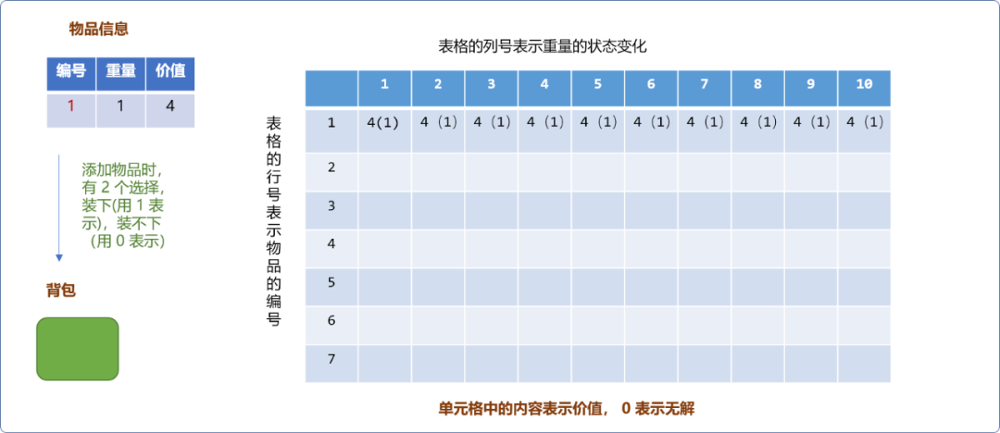

- 如下图，当增加重量为 `2` 的物品后，当背包的容量为 `1` 时，不能装下物品，则最大值为同容量背包中已经有的最大值。


但对容量为 `2`的背包而言，恰好可以放入新物品，此时背包中的最大价值就会有 `2` 个选择，一是把物品 `2` 放进去，背包中的价值为 `3`。二是保留背包已有的价值`4`。然后，在两者中选择最大值 `4`。


当背包容量是 `3`时，物品`2`也是可以放进去的。此时背包的价值可以是当前物品的价值 `3`加上背包剩余容量`3-2=1`能存放的最大价值`4`，计算后值为 `7`。要把此值和不把物品放进去时原来的价值 `4` 之间进行最大值选择。

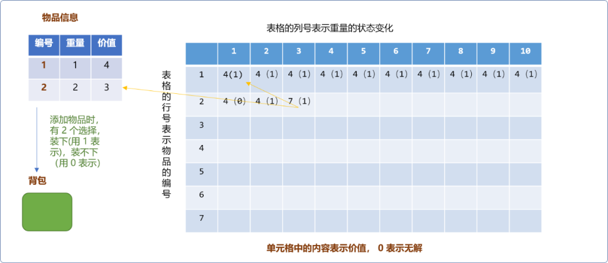

所以，对于背包问题，核心思想就是：

- 如果物品能放进背包：则先计算出物品的价值加上剩余容量能存储的最大价值之和，再找到不把物品放进背包时背包中原有价值。最后在两者之间进行最大值选择。
- 当物品不能放进背包：显然，保留背包中原来的最大价值信息。

#### 2.3.3 编码实现

```c++
#include <iostream>
#include <vector>
using namespace std;
int main(int argc, char** argv) {
 //物品信息
 int goods[3][3]= { {1,4},{2,3} };
 //背包容量
 int bagWeight=0;
 cout<<"请输入背包容量："<<endl;
 cin>>bagWeight;
 //状态表
 int db[4][bagWeight+1]= {0};
 for(int i=0; i<4; i++) {
  for(int j=0; j<bagWeight+1; j++) {
   db[i][j]=0;
  }
 }
 for(int w=1; w<4; w++) {
  for(int wt=1; wt<=bagWeight; wt++) {
   if( goods[w-1][0]>wt ) {
    //如果背包不能装下物品，保留背包上一次的结果
    db[w][wt]=db[w-1][wt];
   } else {
    //能装下,计算本物品价值和剩余容量的最大价值
    int val=goods[w-1][1] + db[w-1][ wt- goods[w-1][0] ];
    //背包原来的价值
    int val_= db[w-1][wt];
    //计算最大值
    db[w][wt]=val>val_?val:val_;
   }
  }
 }
 for(int i=1; i<3; i++) {
  for(int j=1; j<=bagWeight; j++) {
   cout<<db[i][j]<<"\t";
  }
  cout<<endl;
 }
 return 0;
}
```

**输出结果：**

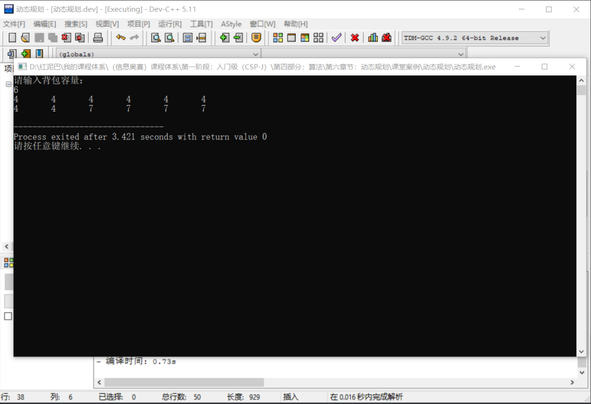

## 3. 总结

如果问题都可以使用动态规划实现，则问题的字面描述可能形形色色，但问题的内在一定会具有相似性。如找零钱问题就可以转化成背包问题。要找的零钱可看成是背包的容量，每一类币种可以看成是物品的重量，求解恰好装满背包所需要的最少硬币数。

解决问题后，需学会总结、归纳。方能看破表象，找出本质。


