# C++ 动态规划经典案例解析之最长公共子序列（LCS）_窥探递归和动态规划的一致性


## 1. 前言

动态规划处理字符相关案例中，求`最长公共子序列`以及求`最短编辑距离`，算是经典中的经典案例。

讲解此类问题的算法在网上一抓应用一大把，即便如此，还是忍不住有写此文的想法。毕竟理解、看懂都不算是真正掌握，唯有瞧出其中玄机，能有自己独有的见解和不一样的感悟方算是把知识学到灵魂深入。

## 2. 最长公共子序列(LCS)

### 2.1 问题描述

最长公共子序列，指找出 `2` 个或多个字符串中的最长公共子序列。

如字符串 `s1=kabc`和`s2=taijc`，其最长公共子序列是`ac`。

> **Tips：** 子序列只要求其中字符保持和原字符串中一样的顺序，而不一定连续。

### 2.2  递归思想

一道求最值的问题，只要是求最值，必然会存在多个**选择**，原理很简单，如果没有多个选择，还有必要纠结谁是最大谁是最小吗？

> **Tips：** 在你面前有苹果、桔子、香蕉……你只能选择一个，这时候方有纠结。如果面前只有苹果，还会纠结吗？

面对此问题，可以采用化整为零的思想，从宏观层面转移到微观层面，缩小问题的规模的递归思想。

如为字符串`s1`设置位置指针 `i`，为字符串`s2`设置位置指针`j`，则问题可以抽象为如下函数。函数的语义：`i`和`j`作为起始位置时字符串`s1,s2`的最长公共子序列。

```cpp
int lcs(string s1,int i,string s2,int j);
//如果 s1、s2为全局变量，函数可以是
int lcs(int i,int j);  
```

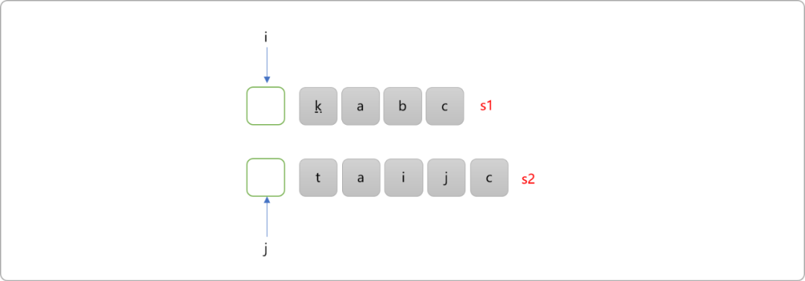

- 初始时，`i=0`和`j=0`意味求解完整的`s1`和`s2`的最长公共子序列。此时规模最大，无法直接得到答案。如此，把问题延续到规模较小的子问题。

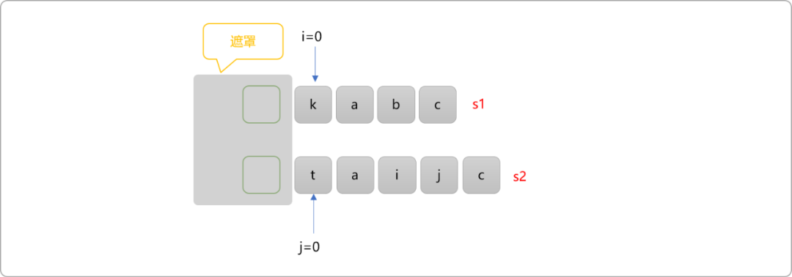

上文说过，求最值一定存在多个选择的，原始问题中的`k!=t`，则可存在如下 `3` 种选择：

A、`i`不动，`j+1`。即把`i`指向作为起始位置的`s1`字符串和`j+1`作为起始位置的`s2`字符串继续比较。可算为一个子问题。

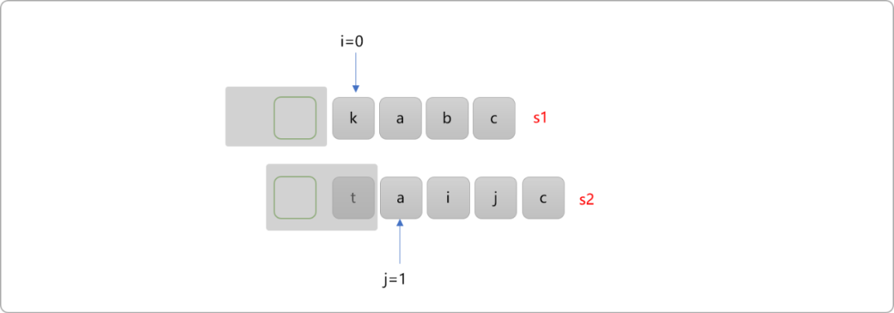

B、`j`不动，`i+1`。即把`i+1`指向作为起始位置的`s1`字符串和`j`作为起始位置的`s2`字符串继续比较。可算为另一个子问题。

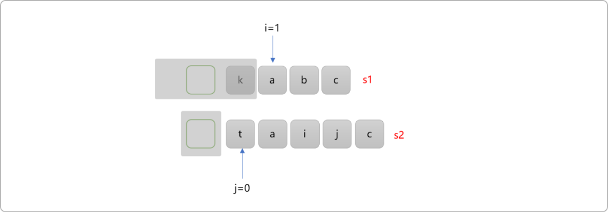

C、`i`和`j`同时移动到下一个位置。即把`i+1`指向作为起始位置的`s1`字符串和`j+1`作为起始位置的`s2`字符串继续比较。也算为一个子问题。

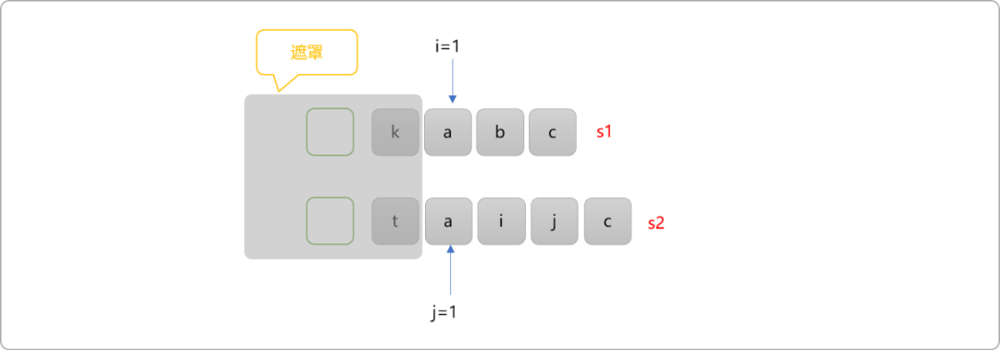

也就是说，当原始问题中`i`和`j`指向位置字符不相同时，存在 `3` 个选择。至于子问题如何求解，这个归功于递归思想。

> **Tips：** 递归最大的好处就是只需要确定基础函数的功能，然后确定子问题，则子问题的内部如何求解站在宏观角度可以不管。反之它可以一步一步继续缩小问题规模，直到有答案为止。

然后在`3` 种选择中，返回值最大的那一个作为当前的问题的结果。

```cpp
int lcs(string s1,int i,string s2,int j){
    if(s1[i]!=s2[j]){
        //有 3 种选择
        int sel_1=lcs(s1,i,s2,j+1);
        int sel_2=lcs(s1,i+1,s2,j);
        int sel_3=lcs(s1,i+1,s2,j+1);
        return max(sel_1,sel_2,sel_3);
    } 
}
```

- 如下图所示，当`i和j`所指向位置的值相同时，必然在当前子问题中就找到了一个公共字符，则最终结果就是后续子问题的结果基础上加 1 ，则为最长公共子序列为原来的值加 `1`。

  > **Tips：** 在海滩上捡贝壳时，当前拾到了一个，回家时最终能拾到的贝壳一定是当前拾到的这一个加上后续所拾到的贝壳。


同时移动 `i`和`j`，进入规模较小的子问题。如下图所示。

此时可总结一下，使用递归求最长公共子序列，类似于玩消消乐，相同，则消掉，直接进入剩下的内容。不相同，选择会多些。

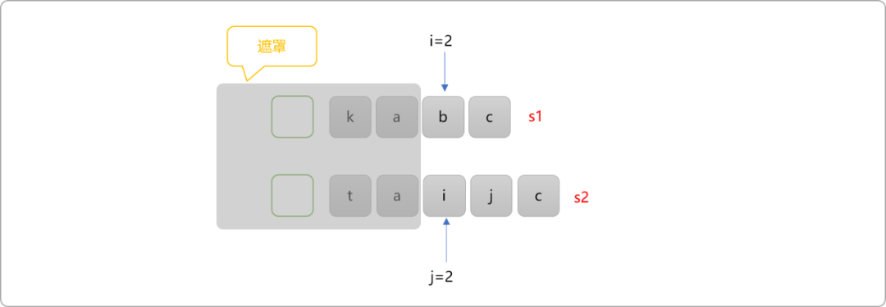


```cpp
int lcs(string s1,int i,string s2,int j){
    if(s1[i]!=s2[j]){
        //有 3 种选择
        int sel_1=lcs(s1,i,s2,j+1);
        int sel_2=lcs(s1,i+1,s2,j);
        int sel_3=lcs(s1,i+1,s2,j+1);
         //三者之中选择最大返回值
    }else{
        //只有一个选择
        return lcs(s1,i+1,s2,j+1)+1;
    }
}
```

- 递归边界。当`i==s1.size() 或 j==s2.size()`时，说明已经扫描到了子符串的最后。如下图所示，无论哪一个指针先到达字符串的末尾，则都不再存在任何公共子序列。

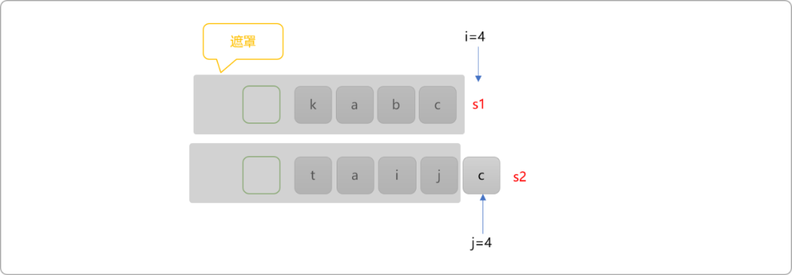


```cpp
int lcs(string s1,int i,string s2,int j){
    if(i==s1.size() || j==s2.size())return 0;
    if(s1[i]!=s2[j]){
        //有 3 种选择
        int sel_1=lcs(s1,i,s2,j+1);
        int sel_2=lcs(s1,i+1,s2,j);
        int sel_3=lcs(s1,i+1,s2,j+1);
        //三者之中选择最大返回值
    }else{
        //只有一个选择
        return lcs(s1,i+1,s2,j+1)+1;
    }
}
```

上述是基于递归的角度分析问题，完整的代码如下：

```c++
#include <iostream>
using namespace std;
int lcs(string s1,int i,string s2,int j) {
 if(i==s1.size() || j==s2.size())return 0;
 if(s1[i]!=s2[j]) {
  //有 3 种选择
  int sel_1=lcs(s1,i,s2,j+1);
  int sel_2=lcs(s1,i+1,s2,j);
  int sel_3=lcs(s1,i+1,s2,j+1);
  int maxVal=max(sel_1,sel_2);
  maxVal=max(maxVal,sel_3);
  return maxVal;
 } else {
  //只有一个选择
  return lcs(s1,i+1,s2,j+1)+1;
 }
}
int main() {
 string s1,s2;
 cin>>s1>>s2;
 int res= lcs(s1,0,s2,0);
 cout<<res;
 return 0;
}
```

当字符串的长度较大时，基于递归的运算量会较大，问题在于递归算法中存在大量的重叠子问题。

### 2.3 重叠子问题

绘制递归树，可清晰看到重叠子问题的存在。

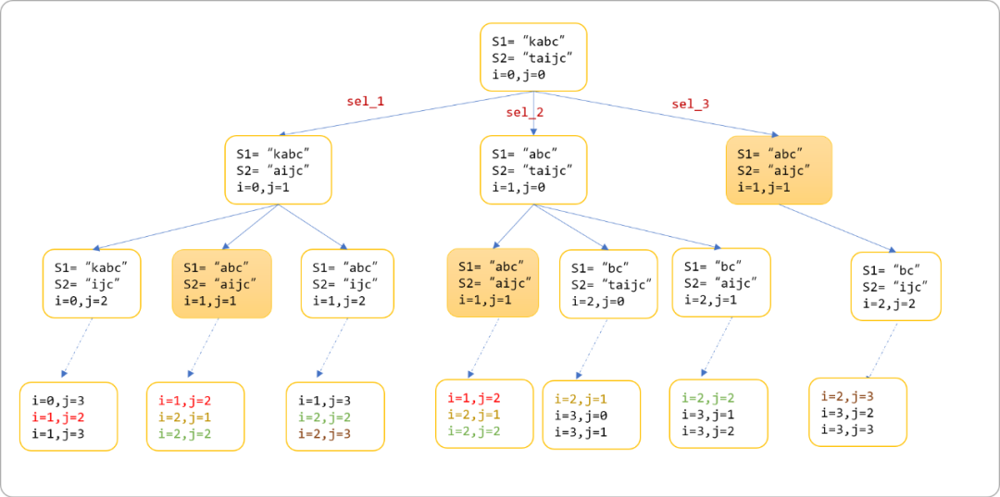


并且可以看到 `sel_1`和`sel_2`分支包括`sel_3`分支，可以使用缓存方案解决递归中的重叠子问题，让重叠子问题只被计算一次。完整代码如下 ：

```cpp
#include <iostream>
#include <map>
using namespace std;
//缓存
map<pair<int,int>,int> cache;
int lcs(string s1,int i,string s2,int j) {
 if(i==s1.size() || j==s2.size())return 0;
 pair<int,int> p= {i,j};
 if (cache[p] ) {
  return cache[p];
 }
 if(s1[i]!=s2[j]) {
  //有 3 种选择
  int sel_1=lcs(s1,i,s2,j+1);
  int sel_2=lcs(s1,i+1,s2,j);
  cache[p]=max(sel_1,sel_2);;
 } else {
  //只有一个选择
  cache[p]=lcs(s1,i+1,s2,j+1)+1;
 }
 return  cache[p];
}
int main() {
 string s1,s2;
 cin>>s1>>s2;
 int res= lcs(s1,0,s2,0);
 cout<<res;
 return 0;
}
```

递归实现性能不可观，代码层面也稍显繁琐。类似于这样求最值的问题，可以试着使用动态规划来实现。

### 2.4 动态规划

递归解决问题的思想是由上向下，所谓由上向下，指先搁置规模较大的问题，等规模较小的子问题解决后再回溯出大问题的解。通过上文贴的递归树可以清晰看到求解流程。

动态规划的思想是由下向上，是基于枚举思想。记录每一个子问题的解，最终推导出比之更大问题的解。当然，要求小问题具有独立性和最优性。

无论由上向下，还是由下向上，其本质都是知道子问题答案后，再求解出大问题的答案。动态规划算法是直接了当，递归是迂回求解。

现以求字符串的最长公共子序列为例，讲解动态规划的求解过程。

构建`dp`数组，用来记录所有子问题的解，类似于递归实现的**缓存器。** 于本问题而言，`dp`是一个二维数组，理论上讲，从`A`推导出`B`，再从`B`推导出`C`……问题域关心的是最后的推导结论`C`，之前使用过的历史推导结论其实是可以不用存储。有点类似于"忘恩负义"，所以可以对于`dp`数组进行压缩。

- 构建`dp`二维数组。先初始化数组的第一行和第一列的值为`0`。推导必须有一个源头，这里的 `0`就是源头。

  当`s1=""、s2="a……"` 或当`s1="a……"、s2=""`或当`s1=""、s2=""`时可认为最长公共子序列的值为`0`。

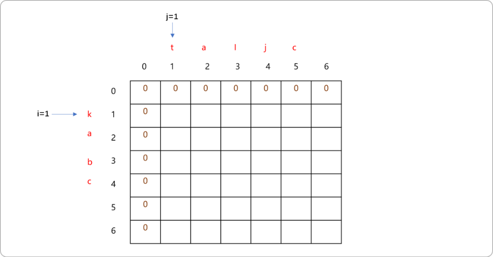


- 如图，让`i=1、j=1`，比较 `s1[i]和s2[j]`位置的字符，显然`k`与`t`是不相等的。递归是看后面（还没求解）有多少个子问题可以选择，动态规划是看前面（已经求解）有多个子问题会影响当前子问题。对于当前位置而言，对之有影响的位置有`3`个。如下图标记为黄色区域位置。

  `1`位置坐标为`(i,j-1)`。表示`s1`中有`k`且`s2`中无`t`时最长公共子序列的值。

  `2`位置坐标为`(i-1,j-1)`。表示`s1`中无`k`且`s2`中无`t`时最长公共子序列的值。

  `3`位置坐标为`(i-1,j)`。表示`s1`中无`k`且`s2`中有`t`时最长公共子序列的值。

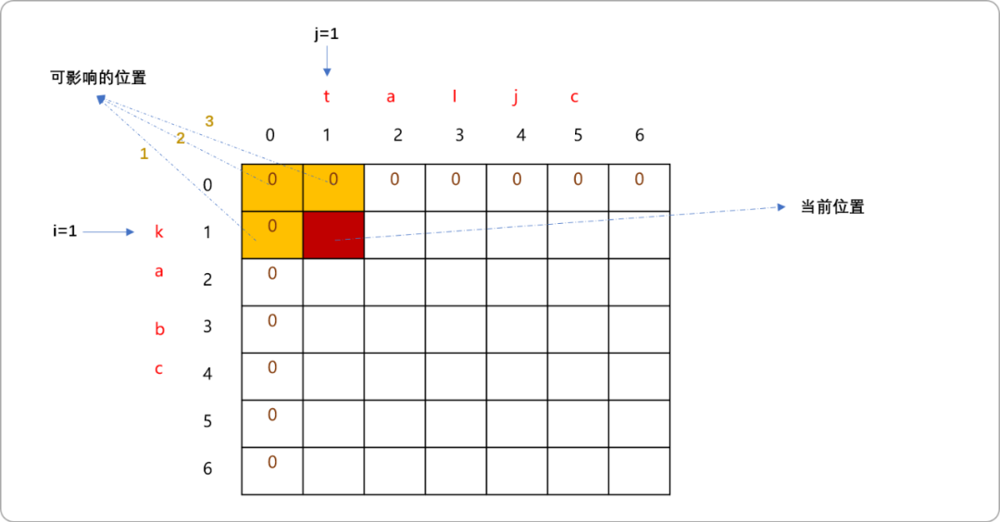


可以舍弃位置`3`，然后在位置`1`和位置`2`中求最大值。

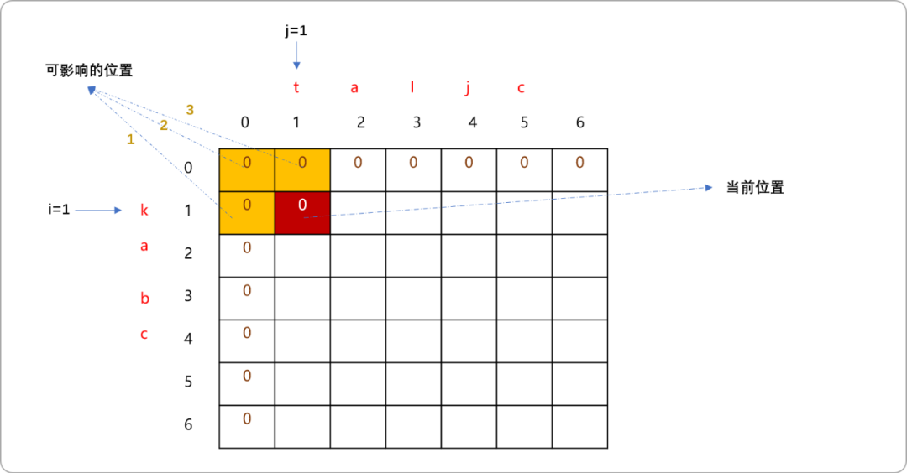


- `i=1`不变，改成`j`的值。一路比较`s1[i]`和`s2[j]`中值，因都不相等，根据前面的分析，很容易填写出`dp`值。

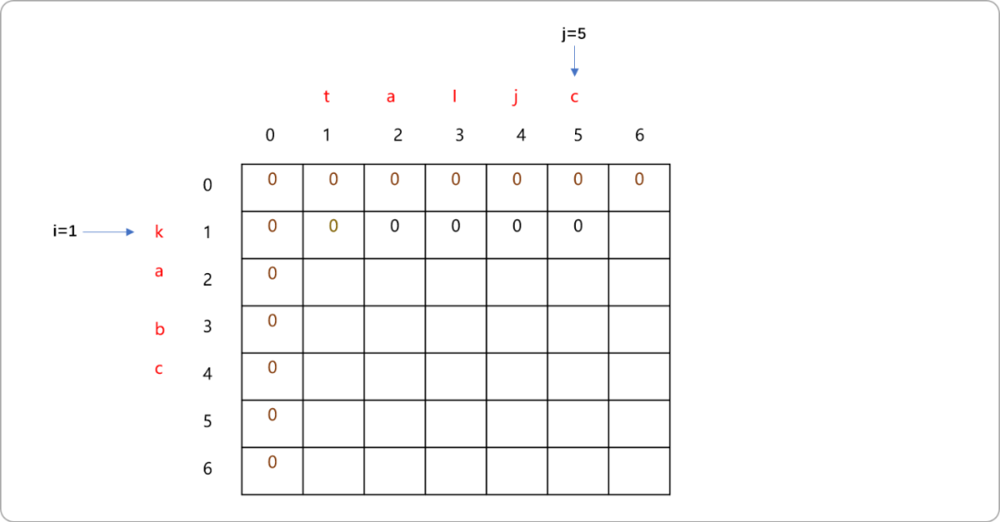


- 移动`i=2`，重置`j=1`且移动`j`。

  `i`和`j`所在位置的字符不相等时的问题已经分析。

  如下图，当 `i=2,j=2`时，`s[i]和s[j]`的值相等，则影响此位置值的前置位置应该是哪个？

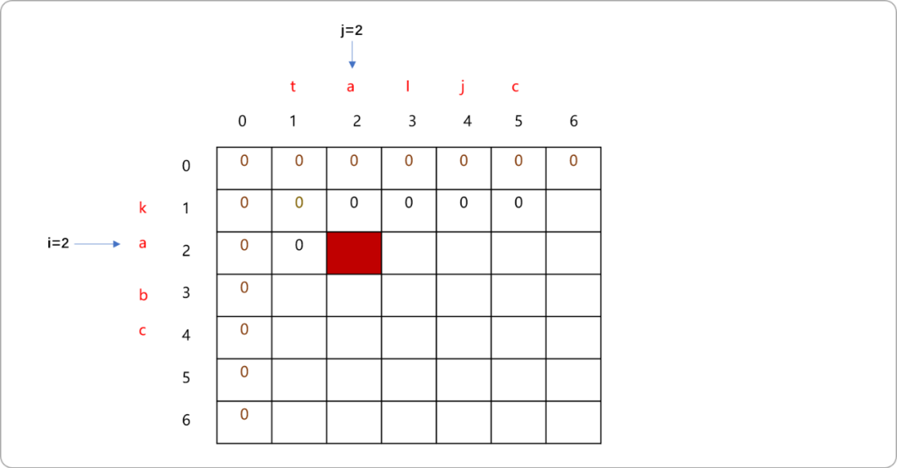


相等，显然最长公共子序列会增加`1`，问题是在哪一个前置子问题的值上加 `1`？

其实，只需要在如下黄色区域位置的值上加上`1`，此位置表示当`s1和s2`中都没有`a`的时候。

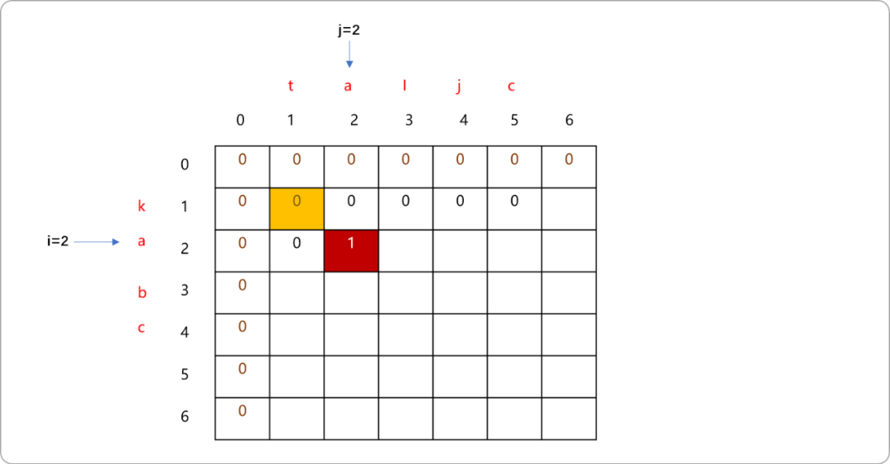


- 按如上分析原理，可以把整个`dp`表填写完成。

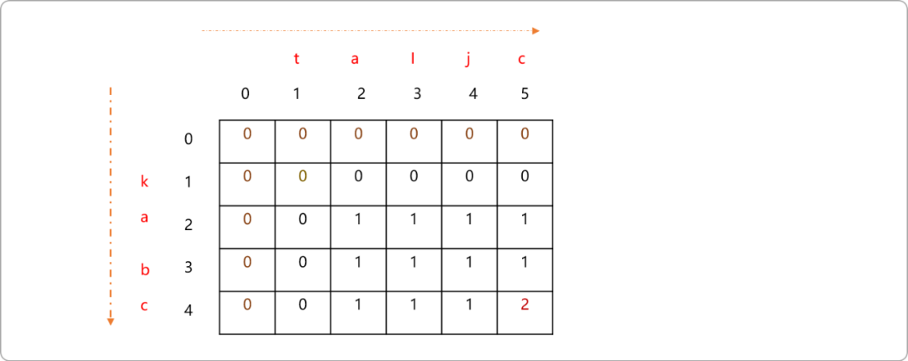


编码实现：

```cpp
#include <iostream>
#include <map>
using namespace std;
int dp[100][100]= {0};
void lcs(string s1,string s2) {
 //初始化动态规划表
 for(int i=0; i<s2.size(); i++)
  dp[0][i]=0;
 for(int i=0; i<s1.size(); i++)
  dp[i][0]=0;

 for(int i=1; i<=s1.size(); i++) {
  for(int j=1; j<=s2.size(); j++)
   if(s1[i-1]==s2[j-1]) {
    //相等
    dp[i][j]=dp[i-1][j-1]+1;
   } else {
    dp[i][j]=max(dp[i-1][j],dp[i][j-1]);
   }
 }
}
int main() {
 string s1,s2;
 cin>>s1>>s2;
 lcs(s1,s2);
 for(int i=0; i<=s1.size(); i++) {
  for(int j=0; j<=s2.size(); j++) {
   cout<<dp[i][j]<<"\t";
  }
  cout<<endl;
 }
 cout<<"最长公共子序列:"<<endl;
 int res=dp[s1.size()][s2.size()];
 cout<<res<<endl;
 return 0;
}
```

测试结果：

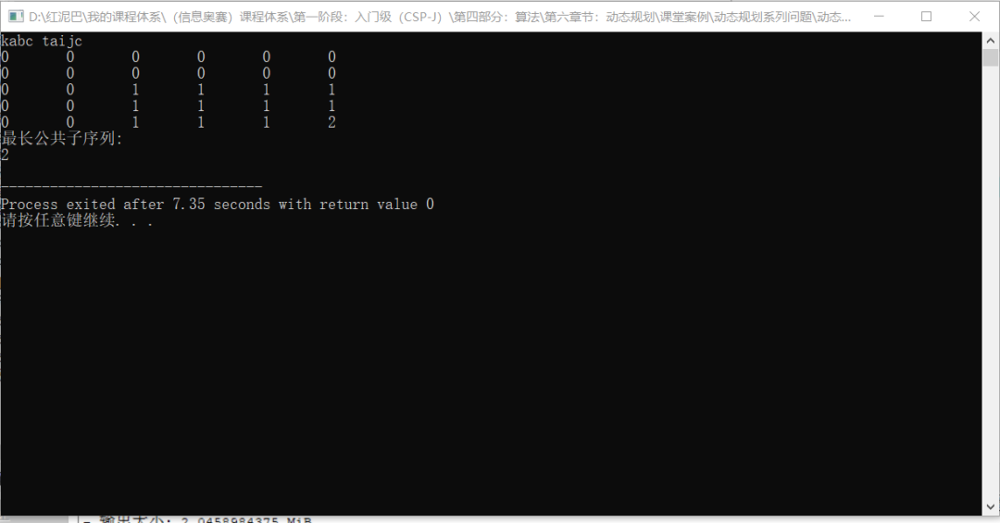


## 4. 总结

最长公共子序列很有代表性，分析基于递归和动态规划的实现过程，可以帮助我们理解此类问题，且解决此类问题。


