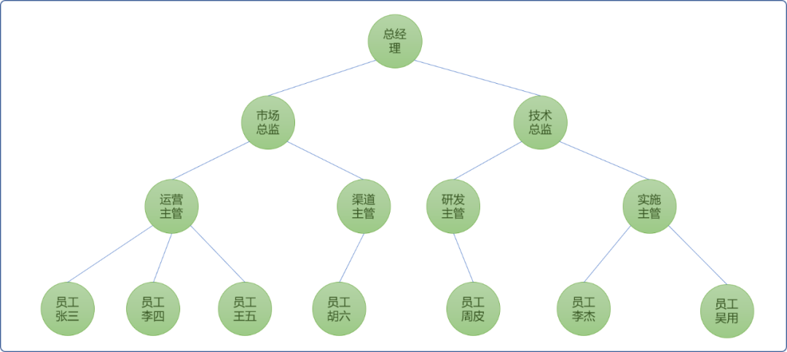
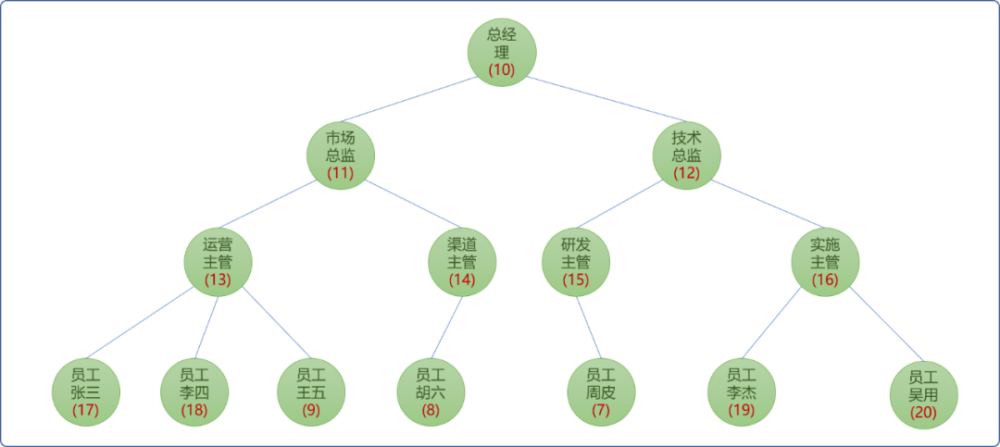
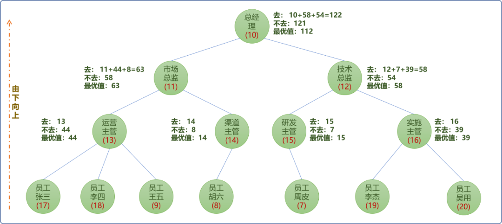
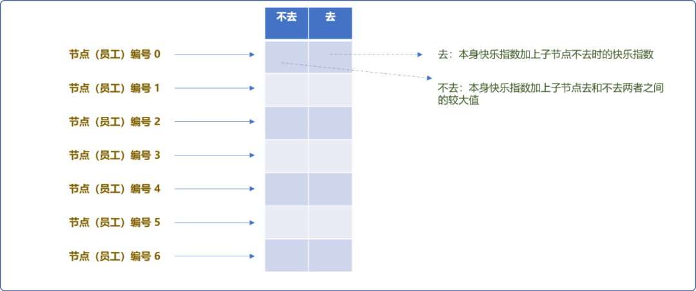
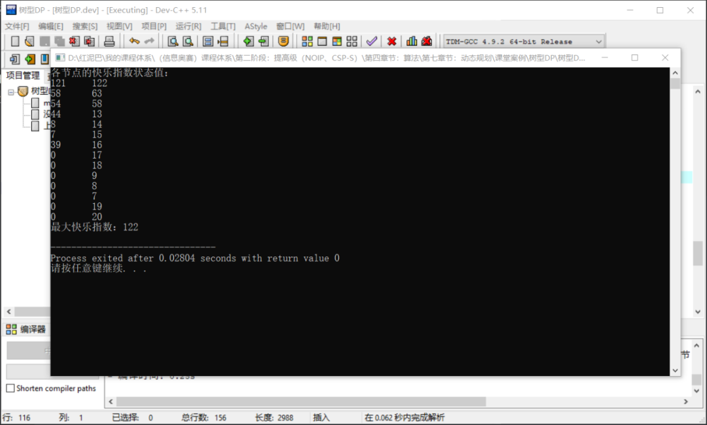
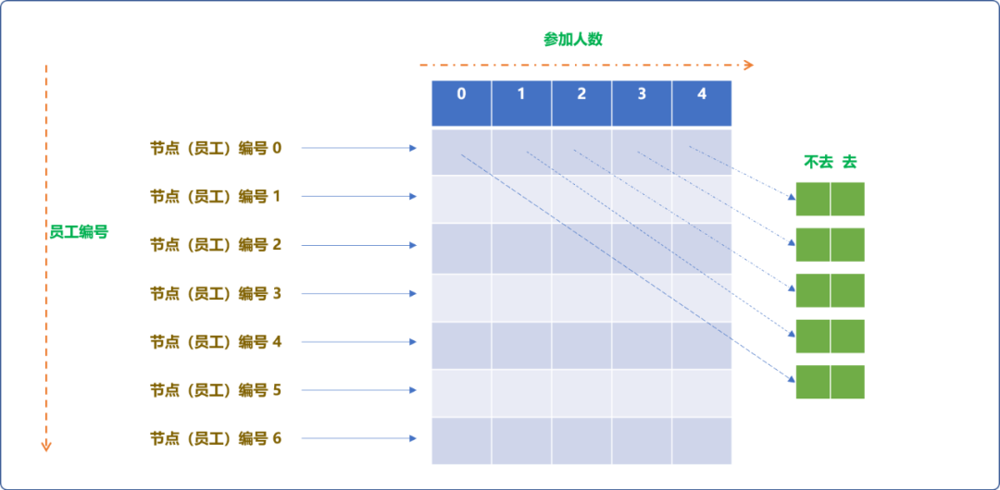
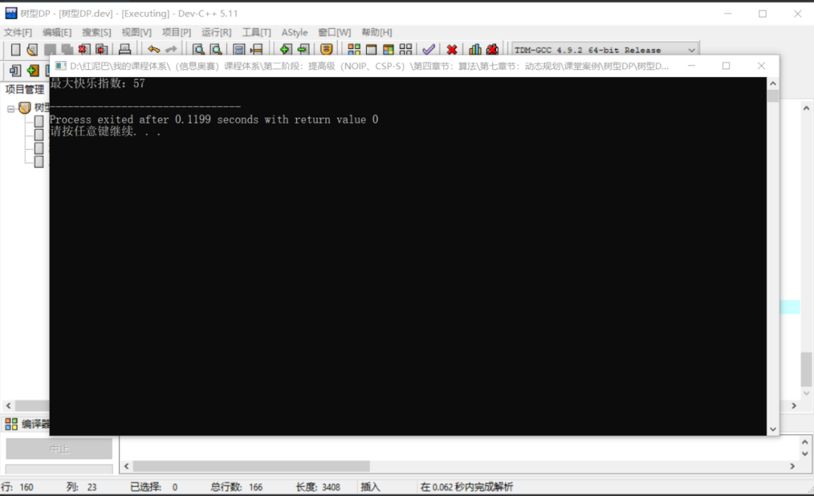
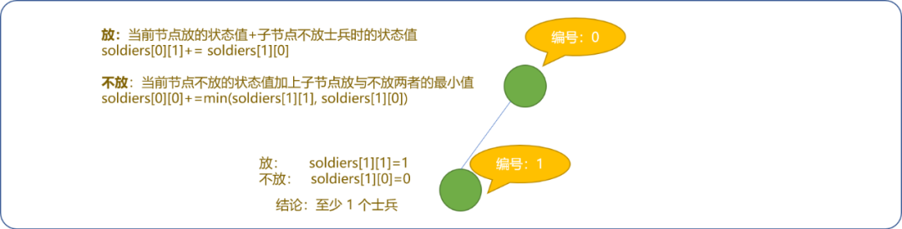
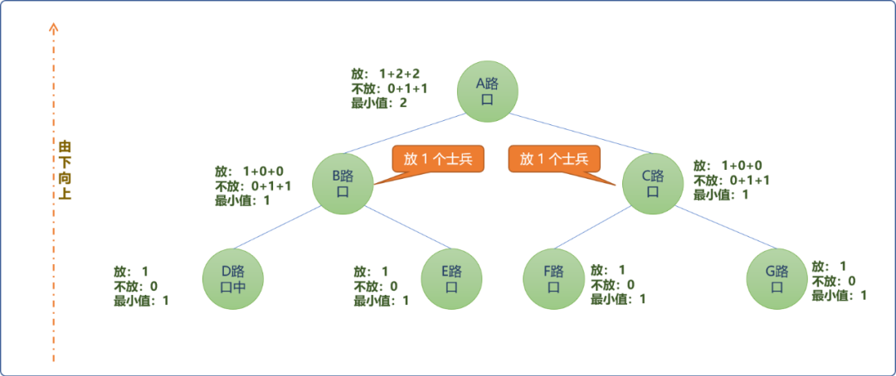
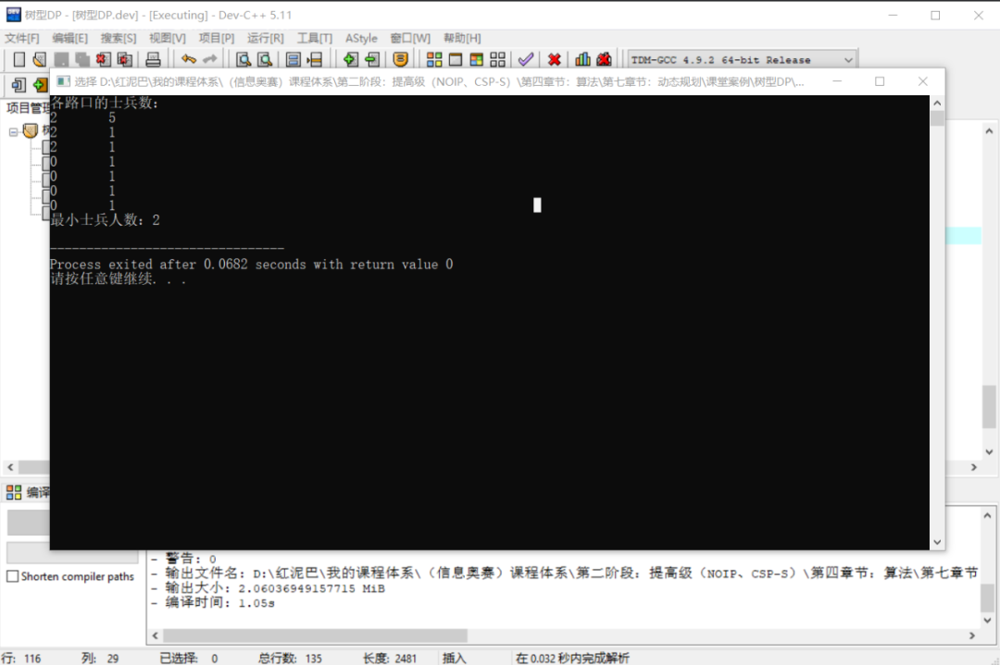

# C++ 算法进阶系列之解析树型动态规划思想

## 1. 前言

**什么是树型动态规划？**

概念中有 `2` 个子概念，一个是动态规划概念。动态规划可以通俗理解为通过对已经计算出来的`子问题`的状态值进行修改(基于子问题的状态值找到当前子问题的最优值)而得到当前子问题的状态值。

> **Tips：** 本文侧重于动态规划在树型结构中的应用，更多关于动态规划的基础理论和常规知识，可以翻阅相关资料。

`树`指树数据结构。树型动态规划指在树逻辑结构之上提供动态规划思想。

动态规划最重要环节查找到子问题间发生变化的状态量，以及状态转移表达式。树动态规划的状态转移过程一般都是由子树向根结点转移，这也符合动态规划的有底向上的逻辑思想。

本文通过几个经典树型动态规划案例的讲解，揭开其神秘面纱。

## 2. 经典案例

### 2.1 没有上司的舞会

`树型动态规划`最经典的案例便是没有上司的舞会。下文将剖析此案例的细节，从而理解树型动态规划的逻辑流程。

**问题描述：**

某公司有 `n` 个职员，编号为 `1∼N`。公司吗，必然存上、下级关系。员工之间的关系从逻辑结构而言，就是典型的树结构。

在树结构中，父结点是子结点的直接上司。如下图所示：



现在有个联欢舞会会，每邀请来一个职员都会给舞会增加一定的快乐指数，但是，如果某个员工的上司来参加舞会了，那么这个职员不会过来参加舞会。

**题目要求，邀请哪些职员可以使整个舞会的快乐指数最大。**

**问题分析：**

分析题目可得到如下的的一些信息：

**第一：**每一个员工都有一个权重：**快乐指数**。如下图，节点括号内数字表示快乐指数。



**第二：**此问题能不能使用动态规划算法思想？动态规划要求有子问题，且必须有最优子结构。

`树结构`本身就是`树`和`子树`的逻辑结构，`子问题`是天然存在的。至于有没有最优子结构，可以把问题规模先缩小。如下图所示，现在是一个上司两个下属。


站在邀请方可有 `2` 种方案：

- 邀请`总经理`节点，因此节点是树中其它 `2` 个节点的父节点，一旦邀请它，子结点不会参加。此时的快乐指数为 `10`。此种方案是不是最优方案，现还不能下结论。
- 不邀请`总经理`，显然`市场总监`的最优值是`11`,`技术总监`的最优值是`12`。 邀请`市场总监`和`技术总监后，`时快乐指数为 `23`。

从现状而言（仅`3` 个节点），显然选择不邀请父结点能得到最大快乐指数：`23`。

通过分析可知：当知道子结点的最优值后方能判断最终结论(是去得到最大值还是不去得到最大值)。所以，此问题是存在最优子结构的，并且符合动态规划的由下向上的求解思想。

基于动态规划思想，先计算最底层节点的最优快乐指数，然后一层一层向上更新父节点的快乐指数。最终得到问题的最优解。如下图所示：



对于任何一个节点而言，都会有 `2` 个最优状态值。

- **如果去**：提供的快乐指数就是自身指数加上子节点不去时的快乐指数值。
- **如果不去**：自身快乐指数加上子节点去还是不去两者间的较大值。

可以借助一个二维数组存储每个节点的状态值。



**编码实现：**

编码的核心逻辑：

- 使用 `DFS（深度搜索）`算法由`叶节点`最优值向上更新至父节点的最优值。
- 更新（状态）值存储在二维状态数组中。

设计流程：

```cpp
#include <iostream>
#include <vector>
using namespace std;
/*
*节点类
*/
struct Emp {
 //员工编号
 int empId;
 //员工姓名
 string empName;
 //权重：快乐指数
 int happy;
 Emp() {

 }
 Emp(int empId,string empName,int happy) {
  this->empId=empId;
  this->empName=empName;
  this->happy=happy;
 }
};
```

**没有上司的舞会封装类：**

```cpp
/*
*树（舞会）类
*/
class Dance {
 private:
  //使用一维数组存储所有员工
  Emp emps[100];
  //存储员工之间的从属关系
  vector<int> relationship[100];
  //员工数量
  int empCount;
  //员工编号，内部维护
  int num;
  //二维状态数组,行号为员工编号
  int happys[100][2];
 public:
  Dance() {
  }
  Dance(int empCount) {
   this->num=0;
   //员工数量
   this->empCount=empCount;
  }

  /*
  * 添加新员工
  * 返回员工的编号
  */
  int addEmp(string empName,int happy) {
   Emp emp(this->num,empName,happy);
   this->emps[this->num]=emp;
   return  this->num++;;
  }

  /*
  *添加员工之间从属关系
  */
  void addRelation(int from,int to) {
   this->relationship[from].push_back(to);
  }

  /*
  *规定编号为 0 的员工为根节点
  */
  int getRoot() {
   return 0;
  }

  /*
  * 深度搜索实现
  *树型动态规划
  */
  void treeDp(int empId) {
   //不去
   happys[empId][0]=0;
   //去
   happys[empId][1]=this->emps[empId].happy;
   for(int subEmpId: this->relationship[empId]) {
    //基于子节点深度搜索
    treeDp(subEmpId) ;
    //搜索完毕 ，更新状态值，如果不去，查找子节点去与不去的最大值
    happys[empId][0] += max(happys[subEmpId][0],happys[subEmpId][1]);
    //去,添加子节点不去时的状态值
    happys[empId][1]+=happys[subEmpId][0];
   }
  }
        /*
        *输出状态值
        */
  void maxHappy() {
   cout<<"各节点的快乐指数状态值："<<endl; 
   for(int i=0; i<this->num; i++) {
    for(int j=0; j<2; j++) {
     cout<<this->happys[i][j]<<"\t";
    }
    cout<<endl;
   }
   cout<<"最大快乐指数："<< max(this->happys[0][0],this->happys[0][1] )<<endl;
  }
};
```

**测试：**

```cpp
int main() {
 Dance dance(14);
 int root= dance.addEmp("总经理",10) ;
 int sczj= dance.addEmp("市场总监",11) ;
 dance.addRelation(root,sczj);
 int jszj= dance.addEmp("技术总监",12) ;
 dance.addRelation(root,jszj);
 int yyzg= dance.addEmp("运营主管",13) ;
 dance.addRelation(sczj,yyzg);
 int qdzg= dance.addEmp("渠道主管",14) ;
 dance.addRelation(sczj,qdzg);
 int yfzg= dance.addEmp("研发主管",15) ;
 dance.addRelation(jszj,yfzg);
 int sszg= dance.addEmp("实施主管",16) ;
 dance.addRelation(jszj,sszg);
 int yg= dance.addEmp("员工张三",17) ;
 dance.addRelation(yyzg,yg);
 yg= dance.addEmp("员工李四",18) ;
 dance.addRelation(yyzg,yg);
 yg= dance.addEmp("员工王五",9) ;
 dance.addRelation(yyzg,yg);
 yg= dance.addEmp("员工胡六",8) ;
 dance.addRelation(qdzg,yg);
 yg= dance.addEmp("员工周皮",7) ;
 dance.addRelation(yfzg,yg);
 yg= dance.addEmp("员工李杰",19) ;
 dance.addRelation(sszg,yg);
 yg= dance.addEmp("员工吴用",20) ;
 dance.addRelation(sszg,yg);
 dance.treeDp(root);
 dance.maxHappy();
 return 0;
}
```

**输出结果：**



### 2.2  没有上司的舞会的升级版

**问题描述：**

在上述没有上司的舞会的案例中，添加如下的限制。由于场地有大小限制，场地最多只能容纳 `m(1≤m≤n) 个人`。请求出快乐值最大是多少。

**问题分析：**

相比较上一个问题，对于每一个员工，都有去或不去的选择。上文使用二维数组存储当编号为 `i`的员工去或不去时的快乐指数状态值。此问题多了一个人数限制，对于每一个员工而言，除了考虑去或不去，还需要考虑他以及他的下属一共有多少人参加了舞会。

所以，需要添加一个新的维度，团队中参加舞会的人数。如下图所示：



如果员工编号使用 `i`表示，人数使用 `k`，去或不去使用 `j`表示。

则状态数组`happys[1][1][0]`表示编号为`1`的员工不去时，且人数限制为 `1`的快乐指数。

知道状态信息后，需要找出状态转移方程式。

```cpp
//编号为 i 的员工不去。p 取值范围为 0~k
f[i][k][0] = max(f[i][k][0], f[i][k - l][0] + max(f[子节点编号][p][0], f[子节点编号][p][1]));
//编号为 i  的员工去。
f[i][k][1] = max(f[i][k][1], f[i][k - l][1] + f[子节点编号][p][0]);
```

**编号实现：**

在上面代码基础之上，修改 2  处位置，一个是状态数组。一个是深度搜索算法。

```cpp
//省略……

/*
*节点类 省略……
*/

/*
*树（舞会）类
*/
class Dance {
 private:
         //省略……
  //三维状态数组,行号为员工编号
  int happys[100][100][2];
 public:

         //省略…… 
  /*
  * 深度搜索实现
  * 树型动态规划
  * empId:  当前员工编号 
  * count:  限制人数
  */
  void dfs(int empId,int count) {
   //对于当前节点：去但是人数限制为 0
   happys[empId][0][1] = 0;
   for (int k =count; k; --k)
    //对于当前节点：去，人数限制不同的时候的状态值
    happys[empId][k][1] = happys[empId][k - 1][1] +this->emps[empId].happy;
   //查询子节点信息
   for(int subEmpId: this->relationship[empId]) {
    //基于子节点深度搜索
    dfs(subEmpId,count) ;
    for (int k = count; k >= 0; --k)
     for (int l = 0; l <= k; l++) {
                          //不去
      happys[empId][k][0] = max(happys[empId][k][0], happys[empId][k - l][0] + max(happys[subEmpId][l][0], happys[subEmpId][l][1]));
      happys[empId][k][1] = max(happys[empId][k][1], happys[empId][k - l][1] + happys[subEmpId][l][0]);
     }
   }
  }
         //输出最大快乐指数
  void maxHappy(int count) {
   cout<<"最大快乐指数："<< max(this->happys[0][count][0],this->happys[0][count][1] )<<endl;
  }
};


int main() {
 Dance dance(14);
    //省略……
 dance.dfs(root,3);
 dance.maxHappy(3);
 return 0;
}
```

**输出结果：**



### 2.3  城堡守卫者

**问题描述：**

一座城堡的所有的道路形成一个`n`个节点的树，如果在一个节点上放上一个士兵，那么和这个节点相连的边就会被看守住，问把所有边看守住最少需要放多少士兵。

**问题分析：**

此题目和上述没有上司的舞会的题意差不多。同样可以使用二维数组存储第一个节点的状态值。这里状态值指以当前节点为根节点时的树所需要的最小士兵值。

```cpp
soldiers[100][2];
//soldiers[1][0] 表示编号为 1 的节点处不放置士兵时树的士兵总数
//soldiers[1][1] 表示编号为 1 的节点处放置士兵时树的士兵总数
```

如下图，当只有一个节点时的节点状态值：

- 对于此节点而言，有 `2` 种状态，放一个士兵或不放一个士兵。当只有一个节点时，理论上可以放或不放一个士兵，但从现实而言，至少需要放一个士兵。意味着 `min(soldiers[0][1,soldiers[0][0])>0（最小值不能为零）`，如果结果为 `0`至少需要放 `1`个士兵。


- 当此节点有子节点时。节点如果放一个士兵，则子节点不放。



- 如下图所示，根据树型动态规划思想，到根结点时，最优状态值为 `2`， 只需要在`B`路口和`C`路口各放一个士兵，便能守住整棵树。



**编码实现：**

代码与上面案例的代码很类似，为了做些区分。此案例中，节点之间的关系使用邻接表的方式。直接上所有代码，细节处自行了解。

```cpp
#include <iostream>
#include <vector>
using namespace std;
/*
*节点类
*/
struct Crossing {
 //路口编号
 int cid;
 //路口名
 string cname;
 //使用邻接表存储与之相信的节点的编号
 vector<int>  neighbours;
 Crossing() {}
 Crossing(int cid,string cname) {
  this->cid=cid;
  this->cname=cname;
 }
};
/*
*  城堡树
*/
class City {
 private:
  //所有路口
  Crossing crossings[100];
  //路口数量
  int crossingCount;
  //数量
  int count;
  //编号
  int num;
  //二维状态数组,行号为路口编号
  int soldiers[100][2];
 public:
  City() {}
  City(int count) {
   this->num=0;
   //路口数量
   this->crossingCount=count;
  }
  /*
  * 添加路口
  */
  int addCrossing(string cname) {
   //新路口
   Crossing crossing(this->num,cname);
   //添加
   this->crossings[this->num]=crossing;
   return  this->num++;;
  }
  /*
  *添加路口间父子关系
  */
  void addRelation(int from,int to) {
             //邻接表
   this->crossings[from].neighbours.push_back(to);
  }
  /*
  *规定编号为 0 的员工为根节点
  */
  int getRoot() {
   return 0;
  }
  /*
  * 深度搜索实现
  * 树型动态规划
  */
  void dfs(int cid) {
   //不放
   soldiers[cid][0]=0;
   //放
   soldiers[cid][1]=1;
   //深度搜索子节点
   for(int i=0; i< this->crossings[cid].neighbours.size(); i++  ) {
    int subId= this->crossings[cid].neighbours[i];
    //基于子节点深度搜索
    dfs(subId) ;
    //放
    soldiers[cid][1]+= soldiers[subId][0];
    //不放
    soldiers[cid][0]+= min(soldiers[subId][1],soldiers[subId][0]) ==0?1:min(soldiers[subId][1],soldiers[subId][0]);
   }
  }
        /*
        *输出
        */
  void outInfo() {
   cout<<"各路口的士兵数："<<endl;
   for(int i=0; i<this->num; i++) {
    for(int j=0; j<2; j++) {
     cout<<this->soldiers[i][j]<<"\t";
    }
    cout<<endl;
   }
   cout<<"最小士兵人数："<< min(this->soldiers[0][0],this->soldiers[0][1] )<<endl;
  }
};
//测试
int main() {
 City city(7);
 int root= city.addCrossing("A路口") ;  //0
 int bRoad= city.addCrossing("B路口") ;
 city.addRelation(root,bRoad);
 int cRoad= city.addCrossing("C路口") ;
 city.addRelation(root,cRoad);
 int dRoad= city.addCrossing("D路口") ;
 city.addRelation(bRoad,dRoad);
 int eRoad= city.addCrossing("E路口") ;
 city.addRelation(bRoad,eRoad);
 int fRoad= city.addCrossing("F路口") ;
 city.addRelation(cRoad,fRoad);
 int gRoad= city.addCrossing("G路口") ;
 city.addRelation(cRoad,gRoad);
 city.dfs(root);
 city.outInfo();
 return 0;
}
```

**输出结果：**



## 3. 总结

本文讲解树型动态规划，是动态规划思想用于基于树结构的问题求解方案。

动态规划是一个很重要的算法思想，入门较易，但，因其可适用的场景较多，导致其变化性很大。虽如此，但万变不离其宗，找到子问题的状态值以及状态转换表达式，问题也将迎刃而解。


一枚大果壳

![赞赏二维码](https://mp.weixin.qq.com/s?__biz=MzU2NDgzNjgzNw==&mid=2247488316&idx=1&sn=f0e629841f33adcc8a77e7edf463a5d8&chksm=fd19ece05988cbce10480214bcebb996cbd3a64efa32feac111b071ade37e958cea28908c046&scene=126&sessionid=1729004168&subscene=7&clicktime=1729005622&enterid=1729005622&key=daf9bdc5abc4e8d0a95531bb2a53dc4c822d52703b1aa2f86d189c11af15bacc1015b0e36d4ddc8c09789201cf6f52f50657dfe489f9d3bed6317864299f19f06351bda76c4d28f243906c1063fdd8e64ea739b498dda8ef3ddc2723502c796f8e855d12e4ff692207eacf4e9814167bbadc29f114f8ddd488cf99ea600e7d0e&ascene=0&uin=NjUxMzM2MTA4&devicetype=Windows+10+x64&version=63090c11&lang=zh_CN&countrycode=CN&exportkey=n_ChQIAhIQF8jlt%2BCdFaXD91sD%2BaxfoBLmAQIE97dBBAEAAAAAAATWA3J8nKUAAAAOpnltbLcz9gKNyK89dVj04S5CXR0BM7Vv%2FMfutuAQLqxuZbf6fOP%2FMNt2T4gXLa4f%2FyA4T9xt11x5t7APQPbbzjnVAY1KhoPi5NkcKTk5rqh7hnWxfDHAOjPZAf6egB%2F9Trf103x0%2FUs0rdsL2U25%2BK1yXcDgFn1M0eg7hnQkWzwes%2FiX0lpulADTXnh1oZvpINHuacPT93mVVY7EmncCTUadlU1MkukvvSVZ%2Byi%2FPYW%2FsWQqaSCic%2BfF1T04crhO0424Z7JZpgURuRZMq0Dg&acctmode=0&pass_ticket=%2BvO2C2L5HahgANxlH2U96Y%2FzQM%2BAmdE82PPeTK6vr7eC3ezCPOOHrwOWp1nHqylg&wx_header=1&fasttmpl_type=0&fasttmpl_fullversion=7428020-zh_CN-zip&fasttmpl_flag=1)[喜欢作者](javascript:;)

阅读 90


<iframe src="https://wxa.wxs.qq.com/tmpl/kx/base_tmpl.html" class="iframe_ad_container iframe_adv_ad_container" style="-webkit-tap-highlight-color: transparent; margin: 0px; padding: 0px; outline: 0px; width: 677px; height: 200px; border: none; box-sizing: border-box; display: block; left: 0px;"></iframe>


编程驿站

142

[发消息](javascript:;)

