# C++ 算法进阶系列之聊聊动态规划的两把刷子


## 1. 前言

`递归`和`动态规划`是算法界的两个扛把子，想进入算法之门，则必须理解、掌握这两种算法的本质。一旦参悟透这`2`种算法的精髓，再加上对树、图等复杂数据结构的深入理解，可以解决大部分的算法问题。

本文通过几个典型案例，再次聊聊动态规划算法。其实动态规划算法也就 `2` 把刷子。

- 找到当前子问题的所有可选择项，在所有选择项中选择最大值或最小值。
- 此子问题的最优解，作为下一个子问题的可选择项。最终推导出最终结果。每一个子问题只需关心与其有依赖子问题的结果而无需关注其实现过程。

动态规划的基本理念：步步为营，每次选择最好，达到最终是最好的。

如下通过几个案例来理解动态规划如何步步为营。

## 2. 最多的 `A`

### 2.1 问题描述

现假设有一个特殊的键盘包含下面的按键：

- `Key 1: (A)`：在屏幕上打印一个`A`。
- `Key 2`：`(ctrl-A)`：选中整个屏幕。
- `Key 3: (ctrl-c):`复制选中区域到缓冲区
- `Key 4: (ctrl-v) :` 将缓冲区内容输出到上次输入的结束位置，并显示在屏幕上。

现在，你只可以按键 `N` 次(使用上述四种按键) ，请问屏幕上最多可以显示几个 `A`呢?

### 2.2  样例

#### 2.2.1 样例 `1`

输入：`N =`3 输出：`3`解释：我们最多可以在屏幕上显示三个，`A`通过如下顺序按键：`A，A，A`

#### 2.2.2 样例`2`

输入：`N = 7`输出：`9`解释：我们最多可以在屏幕上显示  `9` 个，`A`通过如下顺序按键`A,A,A,ctrl-A,ctrl-c,ctrl-V, ctrl V`

### 2.3 问题解析

本题是求最值问题，可使用动态规划实现。如前所说，要使用动态规划算法，首先要知道对于每一个子问题而言有哪些选择项。

> **Tips：** 于本题而言，不同的按键次数可以认为是一个个子问题。

在屏幕上输出`A`，也就是让屏幕上的`A`字符的个数发生变化，可以有`2`种选择：

- 直接按下`A`键。只需要一次按键就能输出｀Ａ｀。
- 复制屏幕上的`A`。先按下`ctrl+A、ctrl+C`，在缓冲区添加内容 ，然后可以重复按`ctrl+v`在屏幕上输出字母`A`。

则在不同的按键次数下，哪一种选择最佳？

本题中动态规划算法要做的是：

- 由小规模状态下的积累得到到大规模状态下的结果。此题要计算的是当按键次数的变化下子母`A`的个数。
- 当次数状态量发生变化后，需要选择出最理想方案。

**解题流程：**

可以先定义一个一维 `dp` 数组。用来存储不同次数状态下子母`A`的个数。


现分析在不同次数下，哪一种选择方案可得到最理想结果。

- 当按键次数为`1`时。此状态下只可能通过按下`A`键输出子母`A`。

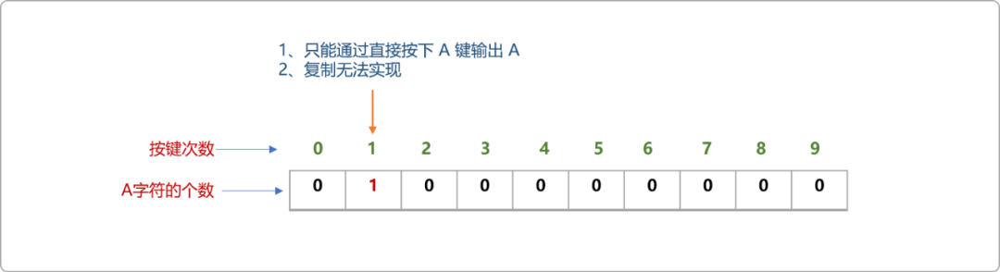

- 当按键次数为 `2`时。也只能通过直接按下A键输出子母A，这时屏幕上的字母个数为 `dp[2]=dp[1]+1`。

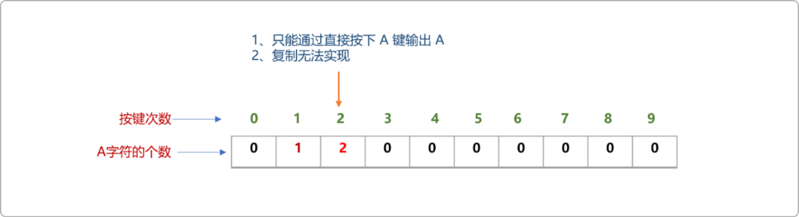

- 当按键次数为`3`时。通过直接按｀A｀键，也可以通过复制输出A  。

  直接按下`A`键的个数为`dp[3]=dp[2]+1`。

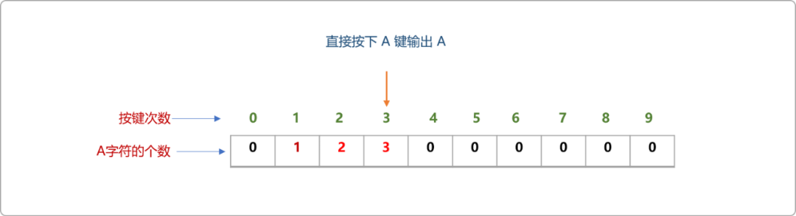

```cpp
复制输出`A`。因复制的前置条件是要先按下`ctrl+A、ctrl+C`，意味着需要消耗掉2次按键，`ctrl+V`复制的内容应该是`dp[0]`位置字母`A`的个数。
```

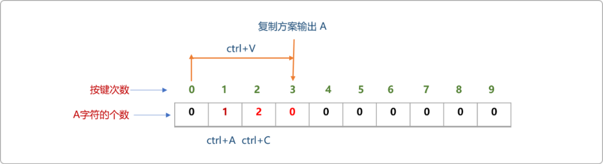

显然，直接按键输出的字母`A`更多。在两个方案中选择直接按下子母键为最佳方案。


- 当按键次数为`4`时。

  直接按下`A`键输入`A`，此时屏幕上的`A`字符为`4`个。

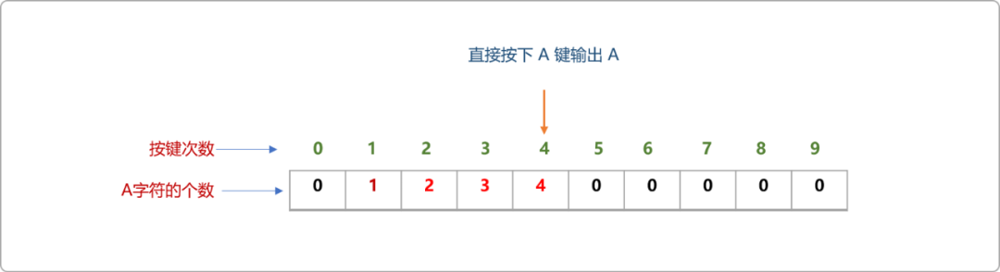


使用复制方案在屏幕上输出`Ａ`时。复制方式有 `2` 种：

在`dp`数组位置`1`处`ctrl+A`、在`2`处`ctrl+C`。这样复制的是`dp[0]`位置的子母个数。

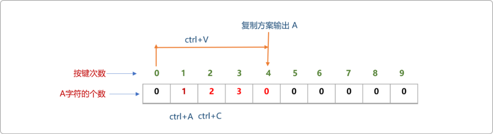


在`dp`数组位置`2`处`ctrl+A`、在位置`3`处`ctrl+C`。这样复制的是`dp[1]`位置的子母个数。

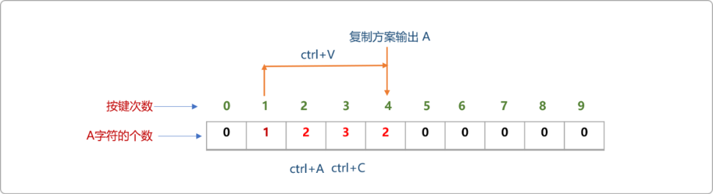


**编码实现：**

```cpp
#include <iostream>
using namespace std;

//一维动态数组
int dp[100]= {0};
//按键次数
int n;
int main(int argc, char** argv) {
    cin>>n;
 for(int i=1; i<=n; i++) {
  //直接按下A键
  dp[i]=dp[i-1]+1;
  //如果复制
  for( int j=2; j<i; j++ ) {
   dp[i]=max( dp[i],dp[j-2]*(i-j+1) );
  }
 }
    cout<<dp[n];
 return 0;
}
```

## 3.  最长递增子序列

### 3.1 问题描述

给定一个无序的整数数组，找到其中最长上升子序列的长度。

示例:

- 输入：`[10,9,2,5,3,7,101,18]`
- 输出：`4`

解释：最长的上升子序列是 `[2,3,7,101]`，它的长度是 `4`。说明：可能会有多种最长上升子序列的组合，你只需要输出对应的长度即可。子序列和子串的区别，子串是连续的，子序列不一定是连续的

### 3.2 问题分析

如何使用动态规划思想解决此问题。

- 创建一维动态`dp`数组。记录当数组中的数据规模变化时，其子序列的长度。初始值为 `1`，数列是自己的子序列。


- 从左向右扫描原始数组，扫描到数据 `10`时，显然，其子序列的个数为 `1`。

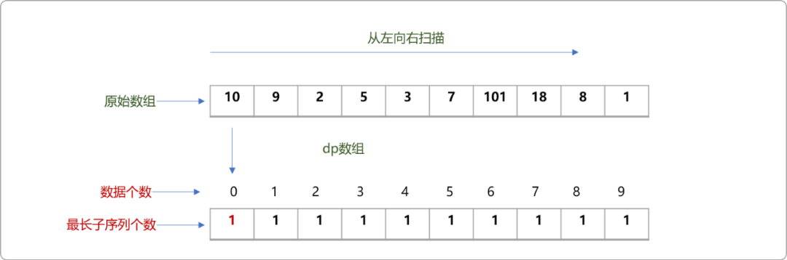


- 扫描到数据 `9`时，将其和前面的 `10` 进行比较，因比其小，故`9`不能为递增子序列做出贡献，保留原来子序列的个数。

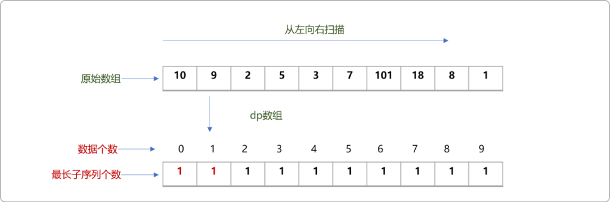


- 扫描到`2`时，其对应`dp`数组中的值为 `1`。

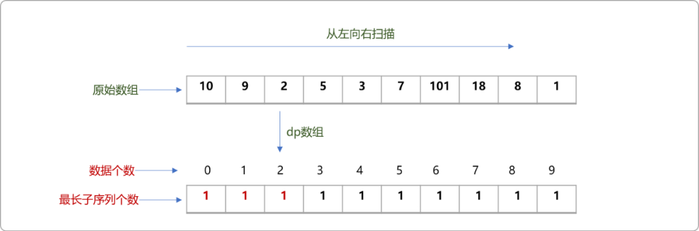


- 扫描到`5`时，其比`10、9`小，但比`2`大，可以成为以`2`为当前状态值的递增子序列。

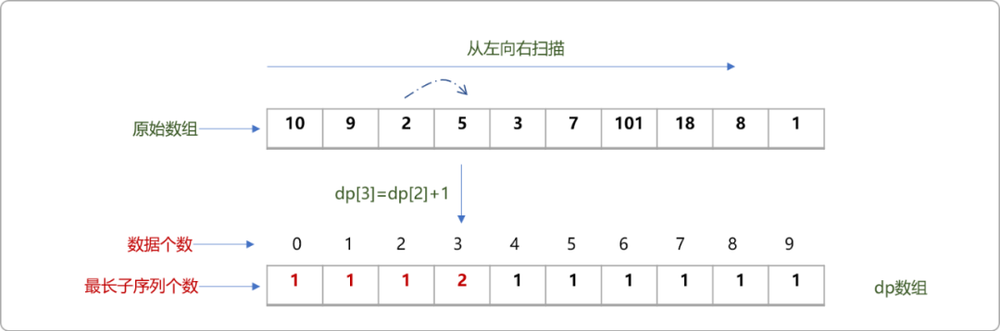


- 扫描到`3`时，因`3`只比`2`大，此时最长子序列应该是以`2`结束时的最长子序列加`1`。

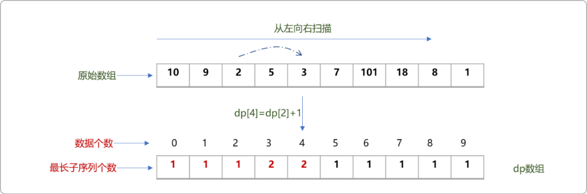


- 扫描到`7`时，因 `7`比`2,5,3`都大，则需要在以`2、5、3`结束时最长子序列中求最大值。动态规划的特点就是，状态的改变时，往往需要在多个选择中选择最佳的。

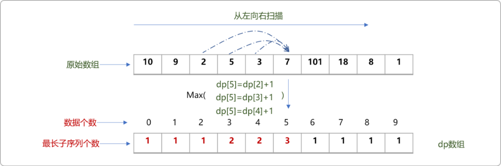


- 同理，当扫描到`101`，因为它比前面的所有数字都大，则需要在已经填充的`dp`数组中找出最大值且再加 `1`。

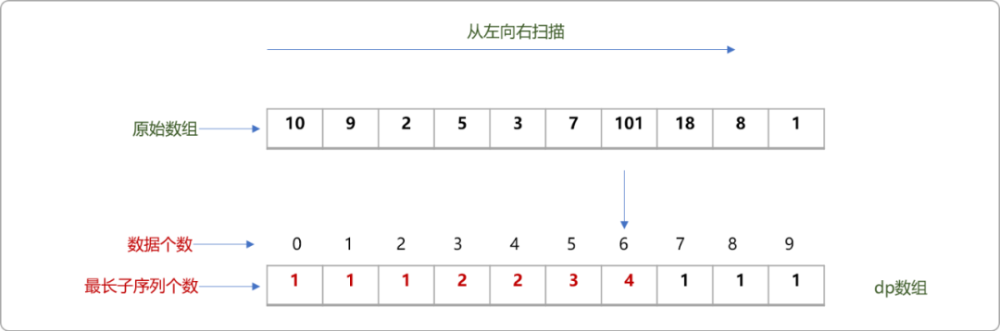


- 按相同的原理，最后 `dp`数组中的值应该如下所示。


### 3.3 编码实现

```cpp
#include <iostream>
#include <cstring>
using namespace std;

//原始数组
int nums[]= {10,9,2,5,3,7,101,18};
//一维动态数组
int dp[100]= {1};

int main(int argc, char** argv) {
 int size=sizeof(nums)/sizeof(int);
 //最长子序列
 int maxVal=1;
 //遍历原始数组
 for( int i=0; i<size; i++ ) {
  dp[i]=1;
  //以 i 为当前位置，向原始数组之间扫描
  for( int j=i-1; j>=0; j-- ) {
   if( nums[i]>nums[j] ) {
    dp[i]=max(dp[i] ,dp[j]+1 ) ;
   }
  }
  if(maxVal<dp[i]) maxVal=dp[i];
 }
 for(int  i=0; i<size; i++)
  cout<<dp[i]<<"\t";
 cout<<"\n最长子序列长度:"<< maxVal<<endl;
 return 0;
}
```

## 4. 最小路径和

### 4.1 问题描述

现有一个二维数组`nums`，其中的元素都是**非负整数**，现在你站在左上角，**只能向右或者向下移动**，需要到达右下角。现在请你计算，经过的路径和最小是多少？

二维数组如下图所示。


本题是典型的`动态规划类`题型。

基本流程如下：

- 基于动态规划的基本思想，先创建一个二维`dp`数组。存储出发位置到表格中每一个位置的最短路径之和。动态规划的基本套路就是步步为营，如果能保证从出发点到每一个位置的路径和都是最小的，自然能求解出到目标地的最短路径和。


- 在`dp`表先填充一些显然易见的值，也称为`base case`。如出发点的最短路径是本身，如下图所示：

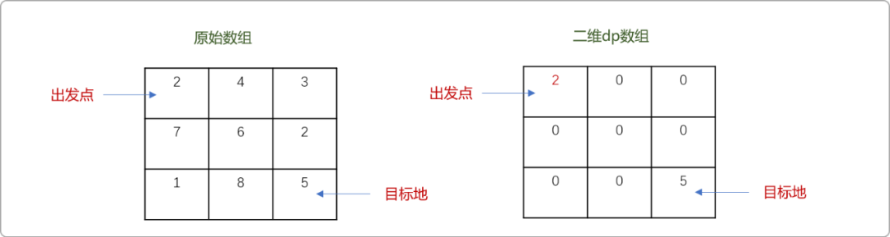


- `dp`表中的第一行的值，只受左边值的影响，不存在多个选择，也容易找出来。其值为`dp[0][i]=dp[0][i-1]+nums[0][i]`。

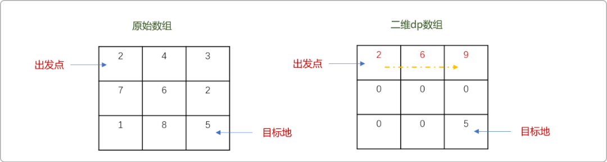


- `dp`表中的第一列的值只受上边值的影响，也不存在多个选择，其值为`dp[i][0]=dp[i-1][0]+nums[i][0]`。

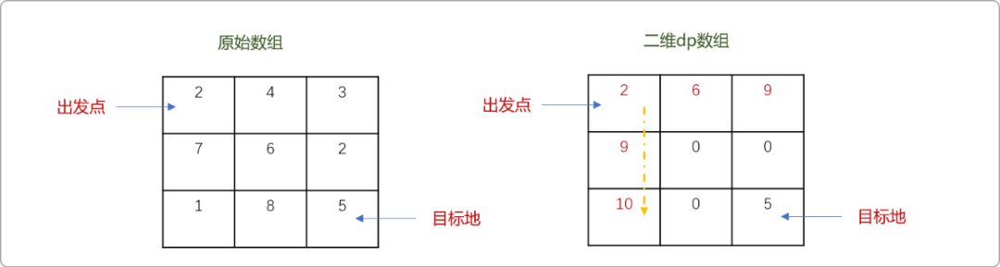


- 其它位置的值，需要在上边和左边的值里选择最小值后再与原数组中同位置的值相加。如下图所示`A`位置可以有`2` 个选择，选择其中较小的值。

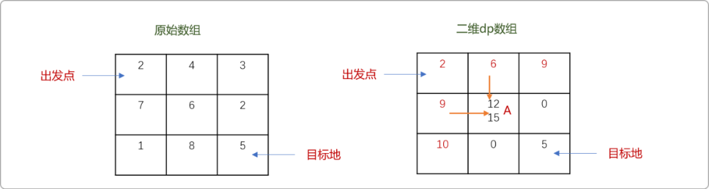


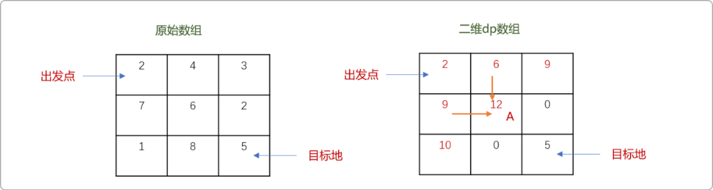


- 以此类推，可得到余下所有位置的值。如下图所示，红色数字表示最终的选择。

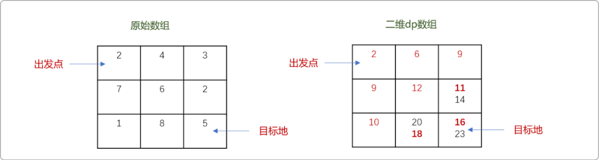


- 最后绘制出从出发点到目标地的最短路径之和。


### 4.2 编码实现

```cpp
#include <iostream>
#include <cstring>
using namespace std;

//原始数组
int nums[3][3]= { {2,4,3},
 {7,6,2},
 {1,8,5},
};
//二维动态数组
int dp[3][3]= { {0,0,0},
 {0,0,0},
 {0,0,0},
};

int main(int argcwfh, char** argv) {

 //起始位置的路径路径是本身
 dp[0][0]=nums[0][0];
 //第一行值只受左边值影响
 for(int i=1; i<3; i++ ) {
  dp[0][i]=dp[0][i-1]+nums[0][i];
 }
 //第一列值只受上边影响
 for(int i=1; i<3; i++ ) {
  dp[i][0]=dp[i-1][0]+nums[i-1][0];
 }

 //由上向下
 for(int i=1; i<3; i++) {
  for(int j=1; j<3; j++ ) {
   dp[i][j]=nums[i-1][j-1]+min(dp[i][j-1],dp[i-1][j]);
  }
 }

 for(int i=0; i<3; i++) {
  for(int j=0; j<3; j++ ) {
   cout<<dp[i][j]<<"\t";
  }
  cout<<endl;
 }

 return 0;
}
```

## 5. 总结

递归、动态规划是算法世界的两大剑客，两者互通款曲，解决同一个问题时，一个站在问题域的正方向，一个站在问题域的反方向。灵活运用且掌握这两大算法，是通向算法界的必修之路。


