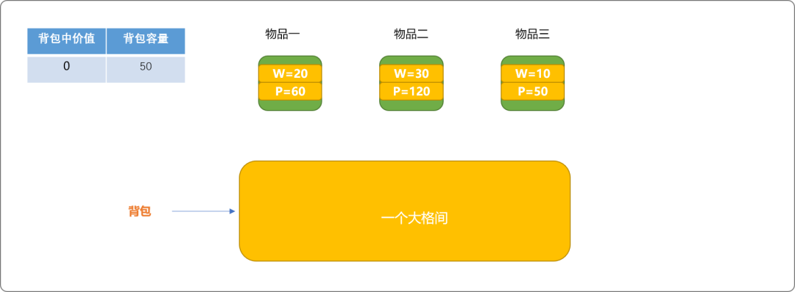
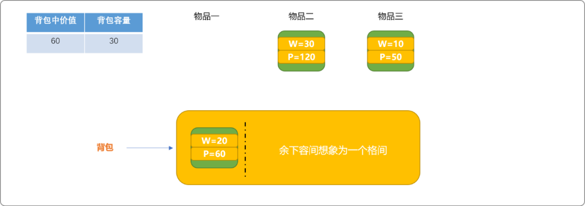
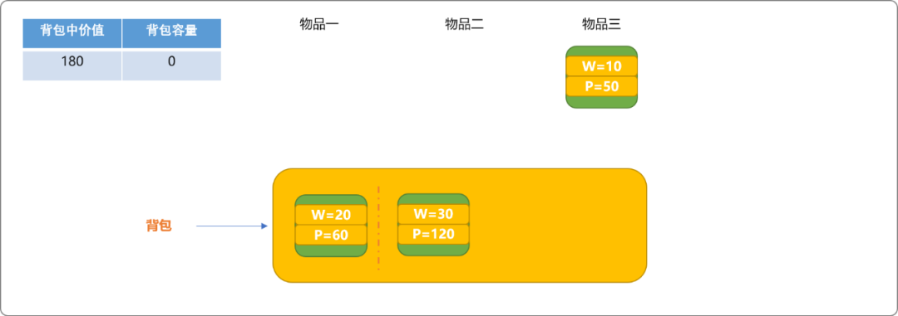
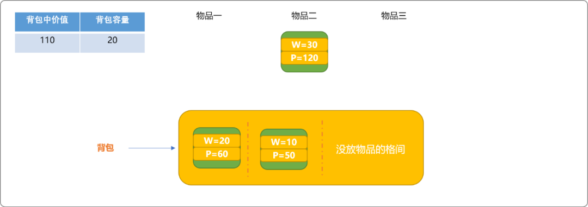
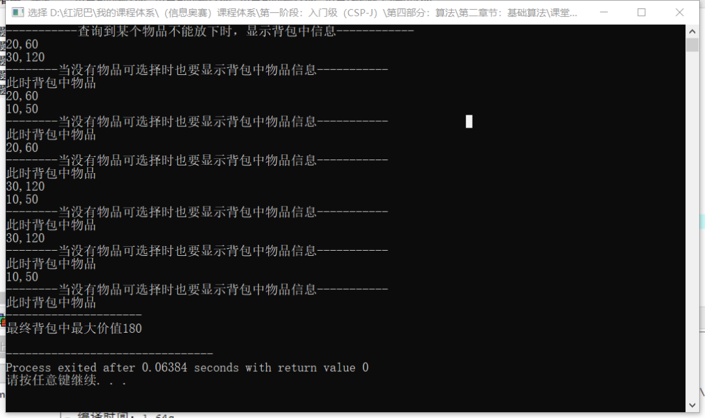
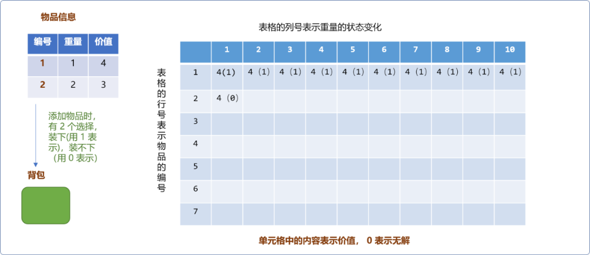

# C++ 算法主题系列之集结0-1背包问题的所有求解方案


## 1. 前言

背包问题是类型问题，通过对这一类型问题的理解和掌握，从而可以归纳出求解此类问题的思路和模板。

背包问题的分类有：

- `0-1`背包问题，也称为不可分割背包问题。
- 无限背包问题。
- 判定性背包问题.
- 带附属关系的背包问题。
- 双背包求最优值.
- 构造三角形问题.
- 带上下界限制的背包问题(`012背包`)
- ……

本文将介绍`0-1`背包问题的各种求解方案，通过对各种求解方案的研究，从而全方面了解`0-1`背包问题的本质。

## 2. `0-1` 背包问题

**问题描述：**

有一背包，能容纳的重量为 `m`，现有 `n`种物品，每种物品有重量和价值 `2` 个属性。请设计一个算法，在不分割物品的情况下，保证背包中所容纳的物品的总价值是最大的。

`0-1`背包也称为完全背包或不可分割背包问题，是一类常见的背包问题。常用的实现方案有`递归`和`动态规划` 。

### 2.1 递归算法

可以有 `3` 种写法。

#### 2.1.1 第一种递归回溯方案

回顾递归回溯算法适合的问题域：

- 待解决的问题可以分多步。如迷宫问题、排列组合问题……
- 每一步都可能存在多个选择，当某一个选择行不通，或此选择结束后，可以回溯到上一步再另行选择。

那么背包问题是否适合上述的要求？

- 可以想象背包里有很多个格间。当每一个格间填充完毕，则表示得到一种求解。
- 对于格间而言，每一种物品都是一种选择，可以通地回溯再选择另一个物品。
- 其本质是对物品进行任意组合，然后再选择总价值最大的一种组合。

如下图，有 `3` 个物品需要放置入容量为 `50` 的背包中。初始可把背包想象成一个大格间，此时可以试着放入物品中的一个。



物品放入格间的条件：

- 物品不曾在背包中。
- 物品的重量小于或等于背包现有容量。

如下图，把`物品一`放入背包中。且把背包剩下空间想象为一个格间，在余下的物品中选择一个放入此格间中。



如下，把`物品二`放入格间中。



因`物品一`和`物品二`的重量之和为 `50`。等于背包总容量。此时，背包中已经没有剩余空间。也意味着不能再向此背包中放入物品。

至此，可以输出背包中的物品，且把背包中的总价值 `180` 存储在全局变量中，以便在后续操作时，查找是否还有比此值更大的值。

**回溯物品**

所谓回溯物品，指把物品从背包中移走，试着再放入一个其它物品。

如下图，回溯`物品二`，腾出格间。因`物品三`满足放入条件，放入格间。


此时，背包还有剩余空间，同样把剩余空间想象成一个格间。因有剩余空间，可以试着把`物品二`放入背包中。



但因物品二的重量大于背包已有的容量，不能放入。此时，可以输出背包中的物品信息，并记录背包中的最大价值为`110`。因比前面的`180`的值小，继续保留 `180`这个价值为当前最大值。

**对上述流程做一个简单总结：**

- 当背包还有空间，且有物品可以放入时，则加入到背包中。

- 当背包不再能放下任何一件物品时，计算此时的总价值，并确定是不是最大价值。

  > **Tips**：这里有一点需要注意，递归函数的出口有 `2` 个，一是还有物品可选择，但不能放入背包中。二是不再有物品可供选择。

- 回溯当前已经放入物品，选择其它物品，重复上述过程，一直到找到真正的最大值。

代码如下所示：

```cpp
#include<bits/stdc++.h>
using namespace std;
struct Goods {
 //重量
 int weight;
 //价值
 int price;
 //装入状态
 bool isUse;
};
/*
*初始化
*/
Goods allGoods[3]= { {20,60,false},{30,120,false},{10,50,false}};

//背包重量
int weight=50;
//最大价值
int maxPrice=0;
//总价值
int totalPrice=0;
/*
* 0-1 背包
* idx:物品编号，只需要考虑组合
* deep:递归深度
*/
void bag(int idx,int deep,int weight) {
 //每次都可以从所有物品中进行选择
 for(int i=idx; i<3; i++) {
  if( allGoods[i].isUse==false  ) {
   //物品不曾放入背包
   if( allGoods[i].weight<=weight) {
    //且可以放下，增加背包中的总价值
    totalPrice+=allGoods[i].price;
    //标志此物品已经放入
    allGoods[i].isUse=true;
    //继续放置物品
    bag(i,deep+1,weight - allGoods[i].weight);
    //回溯
    totalPrice-=allGoods[i].price;
    allGoods[i].isUse=false;
   } else {
    //出口一：不可以放下，计算此时背包中的物品的价值是否是最大值，
    cout<<"-----------查询到某个物品不能放下时，显示背包中信息------------"<<endl;
    if(totalPrice>maxPrice) maxPrice= totalPrice;
    for(int j=0; j<3; j++)
     if(allGoods[j].isUse)
      cout<<allGoods[j].weight<<","<<allGoods[j].price<<endl;
    return ;
   }
  }
 }
    //出口二：不再有物品可以选择
 cout<<"--------当没有物品可选择时也要显示背包中物品信息-----------"<<endl;
 if(totalPrice>maxPrice) maxPrice= totalPrice;
 cout<<"此时背包中物品"<<endl;
 for(int j=0; j<3; j++)
  if(allGoods[j].isUse)
   cout<<allGoods[j].weight<<","<<allGoods[j].price<<endl;
}
//测试
int main() {
 bag(0,1,weight);
 cout<<"---------------------"<<endl;
 cout<<"最终背包中最大价值"<<maxPrice<<endl;
 return 0;
}
```

**测试结果：**



#### 2.1.2 第二种回溯方案

第一种回溯方案，略显复杂，可以采用下面的回溯方案。

此方案中把物品可放入和不可放入做为选择。但其本质和上述实现是一样的。

```cpp
#include<bits/stdc++.h>
using namespace std;
struct Goods {
 //物品重量
 int weight;
 //物品价值
 int value;
 //物品状态 1 已经使用，0 未使用
 int isUse;
};

//最大价值
int maxPrice=0;
//总价值
int totalPrice=0;
//背包重量
int bagWeight=100;
//物品信息
Goods allGoods[5]= { {20,60,false},{30,120,false},{10,50,false},{20,20,false},{40,100,false} };
int count=4;
/*
*显示背包中物品
*/
void showBag() {
 for(int i=0; i<5; i++) {
  if(allGoods[i].isUse)
   cout<<allGoods[i].weight<<","<<allGoods[i].value<<endl;
 }
}
/*
* idx: 物品编号
* count: 物品总数量
*/
void zeroAndOneBag(int idx,int weight) {
    //物品只有两种状态
 for(int i=0; i<=1; i++) {
  if( weight-allGoods[idx].weight*i>=0 ) {
   //物品状态
   allGoods[idx].isUse=i;
   //总价值
   totalPrice+=allGoods[idx].value*i;
   if(idx==4) {
    if(totalPrice>maxPrice) {
     maxPrice=totalPrice;
     cout<<"------------"<<endl;
     showBag();
     cout<<maxPrice<<endl;
    }
   } else {
    zeroAndOneBag(idx+1,weight-allGoods[idx].weight*i);
   }
   //回溯
   allGoods[idx].isUse=0;
   totalPrice-=allGoods[idx].value*i;
  }
 }
}
//测试
int main() {
 zeroAndOneBag(0,bagWeight);
 return 0;
}
```

#### 2.1.3 第三种方案

前两种方案，不仅可得到最优值，且可以得到寻找过程中的各种组合方案。如果仅仅是想得到最终结果，不在乎中间的过程，则可以使用下面的递归方案。

```cpp
#include<iostream>
#include<windows.h>//max函数
using namespace std;
struct Goods {
 //重量
 int weight;
 //价值
 int price;
 //装入状态
 bool isUse;
};
//所有物品
Goods allGoods[5]= { {20,60,false},{30,120,false},{10,50,false},{20,20,false},{40,100,false} };
//背包重量
int bagWeight = 100;
//物品总数量
int totalNumber = 5;
/*
*递归
*/
int zeroAndOneBag(int index, int remainWeight) {
 int totalPrice = 0;
 //没有物品可放
 if (index == totalNumber) return 0;
 if (allGoods[index].weight > remainWeight)
  //当前物品不能放入，查看其它物品放入的情况
  totalPrice = zeroAndOneBag(index + 1, remainWeight);
 else
  //当前物品可以放入，则在把此物品放入和不放入背包时的最大价值 
  totalPrice = max(zeroAndOneBag(index + 1, remainWeight -allGoods[index].weight) + allGoods[index].price, zeroAndOneBag(index + 1, remainWeight));
 return totalPrice;
}
//测试
int main() {
 int value = zeroAndOneBag(0, bagWeight);
 cout << value << endl;
 return 0;
}
```

### 2.2 动态规划

背包问题，有 `2` 个状态值，背包的容量和可选择的物品。

- 物品对于背包而言，只有 `2` 种选择，要么装下物品，要么装不下，如下图所示，表格的行号表示物品编号，列号表示背包的重量。单元格中的数字表示背包中最大价值。当物品只有一件时，当物品重量大于背包容量，不能装下，反之，能装下。如下图，物品重量为 `1`。无论何种规格容量的背包都能装下（假设背包的容量至少为 `1`）。


- 如下图，当增加重量为 `2` 的物品后，当背包的容量为 `1` 时，不能装下物品，则最大值为同容量背包中已经有的最大值。



但对容量为 `2`的背包而言，恰好可以放入新物品，此时背包中的最大价值就会有 `2` 个选择，一是把物品 `2` 放进去，背包中的价值为 `3`。二是保留背包已有的价值`4`。然后，在两者中选择最大值 `4`。


当背包容量是 `3`时，物品`2`也是可以放进去的。此时背包的价值可以是当前物品的价值 `3`加上背包剩余容量`3-2=1`能存放的最大价值`4`，计算后值为 `7`。要把此值和不把物品放进去时原来的价值 `4` 之间进行最大值选择。


所以，对于背包问题，核心思想就是：

- 如果物品能放进背包：则先计算出物品的价值加上剩余容量能存储的最大价值之和，再找到不把物品放进背包时背包中原有价值。最后在两者之间进行最大值选择。
- 当物品不能放进背包：显然，保留背包中原来的最大价值信息。

#### 2.3.3 编码实现

```c
#include <iostream>
#include <vector>
using namespace std;
int main(int argc, char** argv) {
 //物品信息
 int goods[3][3]= { {1,4},{2,3} };
 //背包容量
 int bagWeight=0;
 cout<<"请输入背包容量："<<endl;
 cin>>bagWeight;
 //状态表
 int db[4][bagWeight+1]= {0};
 for(int i=0; i<4; i++) {
  for(int j=0; j<bagWeight+1; j++) {
   db[i][j]=0;
  }
 }
 for(int w=1; w<4; w++) {
  for(int wt=1; wt<=bagWeight; wt++) {
   if( goods[w-1][0]>wt ) {
    //如果背包不能装下物品，保留背包上一次的结果
    db[w][wt]=db[w-1][wt];
   } else {
    //能装下,计算本物品价值和剩余容量的最大价值
    int val=goods[w-1][1] + db[w-1][ wt- goods[w-1][0] ];
    //背包原来的价值
    int val_= db[w-1][wt];
    //计算最大值
    db[w][wt]=val>val_?val:val_;
   }
  }
 }
 for(int i=1; i<3; i++) {
  for(int j=1; j<=bagWeight; j++) {
   cout<<db[i][j]<<"\t";
  }
  cout<<endl;
 }
 return 0;
}
```

**输出结果：**


## 3. 总结

本文主要讲解背包系列 中的`0-1`背包问题。`0-1`背包问题可以使用递归和动态规划方案得到其解。


