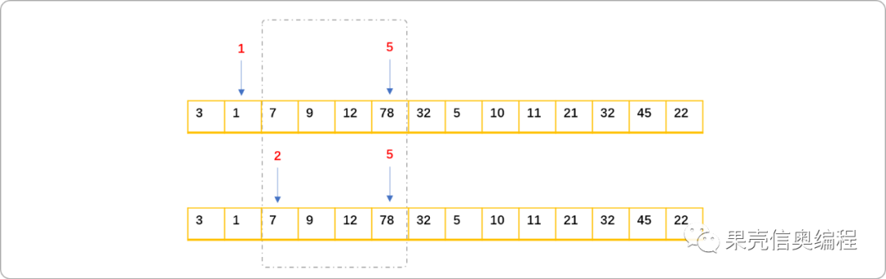
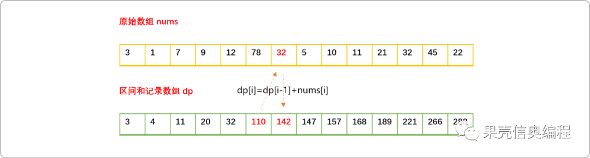
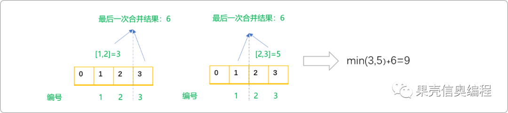
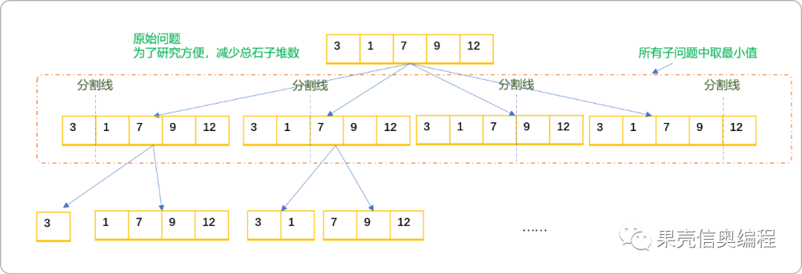
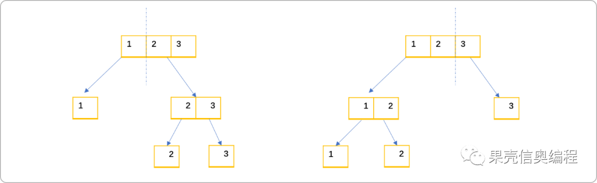
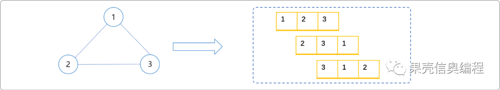
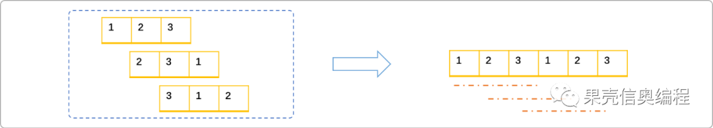

# C++动态规划经典案例解析之合并石子


## 1. 前言

区间类型问题，指求一个数列中某一段区间的值，包括求和、最值等简单或复杂问题。此类问题也适用于动态规划思想。

如`前缀和`就是极简单的区间问题。如有如下数组：

```cpp
int nums[]={3,1,7,9,12,78,32,5,10,11,21,32,45,22}
```

现给定区间信息`[3,6]`，求区间内所有数字相加结果。即求如下图位置数字之和。

> **Tips：** 区间至少包括 `2` 个属性，起始端和结束端，求和范围包含左端和右端数字。


直接的解法：

- 累加数组中 `0~6`区间的值`s1`。
- 累加数组中`0~2`区间的值`s2`。
- 将 `s1`中的值减去`s2`中的值。得到最终结果。

如果对任意区间的求解要求较频繁，会存在大量的重复计算。如分别求区间`[2,5]`和`[1,5]`之和时，分析可知区间`[1,5]`结果等于区间`[2,5]`的结果加上`nums[1]`的值，或者说区间`[2,5]`的值等于`[1,5]`的值减`nums[1]`。简而言之，只需要求出一个如上两个区间中一个区间的值，另一个区间的值就可得到。



为了减少重复计算，可使用区间缓存理念记录`0~`至任意位置的和。



如上的问题便是简单的区间类型问题，解决此类问题的方案称为简单区间类型动态规划。`dp`数组也可称为前缀和数组。

编码实现：

```cpp
#include <iostream>
using namespace std;
int main() {
 int nums[]= {3,1,7,9,12,78,32,5,10,11,21,32,45,22};
 int dp[100];
 int size=sizeof(nums)/sizeof(int);
 for(int i=0; i<size; i++) {
  if(i==0){
   //base case 
   dp[i]=nums[i];
  }else{
   dp[i]=dp[i-1]+nums[i];
  }
 }
 //输出dp信息
 for(int i=0; i<size; i++) {
  cout<<dp[i]<<"\t";
 }

 return 0;
}
```

有了前缀和数组，计算任意区间数字和的公式为：

```cpp
//[l,r]：l表示左端位置，r表示右端位置
dp[r]-dp[l-1];
```

如下代码实现，输入任意区间信息，输出区间和信息。

```cpp
#include <iostream>
using namespace std;
int main() {
 int nums[]= {3,1,7,9,12,78,32,5,10,11,21,32,45,22};
 int dp[100];
 int size=sizeof(nums)/sizeof(int);
 for(int i=0; i<size; i++) {
  if(i==0) {
   //base case
   dp[i]=nums[i];
  } else {
   dp[i]=dp[i-1]+nums[i];
  }
 }
 //输出dp信息
 for(int i=0; i<size; i++) {
  cout<<dp[i]<<"\t";
 }
 cout<<endl;
 int l,r,sum;
 while(1) {
  cin>>l>>r;
  if(l==-1)break;
  sum=dp[r]-dp[l-1];
  cout<<sum<<endl;
 }
 return 0;
}
```

`前缀和`是区间动态规划的极简单应用，下文继续讲解几道典型的区间类型问题。

## 2. 典型案例

### 2.1 石子合并

**问题描述：**

设有`N(N<=300)`堆石子排成一排，其编号为`1,2,3...N`，每堆石子有一定的质量`m[i] (m[i]<=1000)`。现在要将这`N`堆石子合并成为一堆，每次只能合并相邻的两堆，合并的代价为这两堆石子的质量之和，合并后与这两堆石子相邻的石子将和新堆相邻。合并时由于选择的顺序不同，合并的总代价也不相同。试找出一种合理的方法，使总的代价最小，并输出最小代价。

此问题为什么也是区间类型问题？

先看几个样例。如有编号为 `1,2,3 的 3` 堆石子，质量分别为 `1,2,3`。则合并方案有如下 `2` 种：

- 合并编号为`1、2`的石子，合并代价为`3`，再合并新堆和第`3`堆石子，代价为`6`。总代价为`9`。
- 合并编号为`2、3`的石子，合并代价为`5`，再合并新堆和第`1`堆石子，代价为`6`。总代价为`11`。

通过上述合并过程，可得到如下有用的结论：

- 任意相邻两堆石子合并的结果是以这两堆石子的编号作为左、右边界的区间和。如合并编号`1,2`的石子，代价为区间`[1,2]`的和 。合并编号为`2、3`的石子，结果为区间`[2,3]`的和。


- 无论采用何种合并方案，最后一次合并都是相当于求整个数列的和。

  如样例所示，两种合并方案的代价分别为`3,5`，取最小值`3`再加上所有石子的质量和`6`，即为最后答案`9`。



- 对于`n`堆的石子，可以随意在中间画出一条分割线，把`n`堆石子抽象成左、右`2` 堆石子（两个区间），根据上述分析，**可知最后一次的合并值为这 `2`堆石子的质量总和。**

  但是，左堆不是真正意义上只有一堆石子，是由许多石子堆组成的一个逻辑整体，有其内部的合并方案，且不止一种，站在宏观的角度，不用关心其内部如何变化，只需关心多种合并方案的最小值是多少。同理，也只需关心右堆最终返回的最佳值。

  所以，求解问题可以抽象成：

```cpp
  最终合并最小值=所有石子堆的总质量值+左堆最小合并值+右堆最小合并值
  ```


如果原始问题是一个根问题，则求解左堆或右堆的最佳合并值就是一个子问题，所以，合并石子这道题本质是符合递归特点的。

既然符合递归特点，现在就要考虑如何划分子问题。

绘制如下图递归树，根问题为原始问题，区间划分可以从第一堆石子开始，然后再移动分割线，最后再在多个子问题返回值中取最小值。

> **Tips：** 如果只有一堆石子，则代价为 `0`。



编码实现：

- 初如化变量。

```cpp
#include <iostream>
#include <cmath>
using namespace std;
//石子质量 
int sz[100]={0};
//石子堆数量
int n; 
//前缀和
int s[100]={0}; 
```

- 初始化石子信息和前缀和。

```cpp
/*
*  初始化 
*/
void init(){
 cin>>n;
 for(int i=1;i<=n;i++){
  cin>>sz[i];
 }
 //动态规划计算前缀和
 for(int i=1;i<=n;i++){
  s[i]=s[i-1]+sz[i];
 } 
}
```

- 递归实现，子问题是一个区间问题，由左、右分界线确定。

```cpp
int  getSz(int l,int r) {
 //只有一堆石子，返回 0
 if(l==r)return 0;
 int res=1<<30;
 //得到区间的和,最后一次合并值
 int sum=s[r]-s[l-1];
 //计算可分方案，且返回所有分割方案中的最小值
 for(int k=l; k<r; k++) {
  res=min(res,  getSz(l,k)  + getSz(k+1,r) );
 }
    //返回最后一次合并的值加上左、右区间的合并值
 return sum+res;
}
```

- 测试。

```cpp
int main() {
 init();
 int res= getSz(1,n);
 cout<<res;
 return 0;
}
```

是否存在重叠子问题？

如下图所示，当石子堆更多时，重叠子问题更多。



使用记忆搜索解决重叠子问题。

```cpp
//记忆数组
int dp[100][100]={0}; 
int  getSz(int l,int r) {
 //只有一堆石子，返回 0
 if(l==r)return 0;
 if(dp[l][r]!=0)return dp[l][r];
 int res=1<<30;
 //得到区间的和,最后一次合并值
 int sum=s[r]-s[l-1];
 //计算可分方案，且返回所有分割方案中的最小值
 for(int k=l; k<r; k++) {
  res=min(res,  getSz(l,k)  + getSz(k+1,r) );
 }
 return dp[l][r]=sum+res;
}
```

递归是由上向下逐步向子问题求助，类似问题也可以采用由下向上的动态规划方案实现。基本思路，每一次合并过程，先两两合并，再三三合并，…最后`N`堆合并。

```cpp
/*
*动态规划
*/
int dpSz() {
 int ans=0;
 //初始化dp 数组
 for (int i = 1; i <= n; i++) {
  for(int j=1; j<=n; j++) {
   dp[i][j]=1<<30;
  }
  //一堆石子的值为 0
  dp[i][i] = 0;
 }
 //从长度为 1 的区间开始扫描，逐步增加区间的长度
 for (int len = 1; len < n; len++)
  //左边界
  for (int i = 1; i < n; i++) {
   //右边界
   int j = i + len;
   //左右之间的所有子区间
   for (int k = i; k < j; k++) {
    dp[i][j] = min(dp[i][j], dp[i][k] + dp[k + 1][j] + s[j] - s[i - 1]);
   }
   ans=max(ans,dp[i][j]);
  }
 return ans;
}
```

测试：

```cpp
int main() {
 init();
 int res=dpSz();
 cout<<"动态规划方案："<<res<<endl;
 printf("%d\n", dp[1][n]);
 return 0;
}
```

### 2.2 石子合并 II

**问题描述：**

有 n 堆石子围成一个圈，第 `i` 堆石子有 `a[i]` 颗，每次我们可以选择相邻的两堆石子合并，代价是两堆石子数目的和，现在我们要一直合并这些石子，使得最后只剩下一堆石子，问总代价最少是多少?

因为首尾可合并，相比较上述问题，差异在于增加合并的方案。

那么，到底增加了那些合并？

假设石子有 `3` 堆，每堆的质量分别为 `1 2 3`。

如果考虑环形问题，则任何数字都可以为头、为尾，则会出现如下几种数列。

- `1 2 3`
- `2 3 1`
- `3 1 2`



可以理解，数列变成如下 形式，即将环形变成线性。



动态规划实现：

```cpp
#include <bits/stdc++.h>
using namespace std;

int n, a[501], f[501][501], s[501];

int main() {
    scanf("%d", &n);
    for (int i = 1; i <= n; i++) {
        scanf("%d", &a[i]);
        a[n + i] = a[i];
    }    
    for (int i = 1; i <= 2 * n; i++)
        s[i] = s[i - 1] + a[i];
    memset(f, 127, sizeof(f));
    for (int i = 1; i <= 2 * n; i++)
        f[i][i] = 0;
    for (int l = 1; l < 2 *n; l++)
        for (int i = 1; i <= 2 * n - l; i++) {
            int j = i + l;
            for (int k = i; k < j; k++)
                f[i][j] = min(f[i][j], f[i][k] + f[k + 1][j] + s[j] - s[i - 1]);
        }
    int ans = 1 << 30;
    for (int i = 1; i <= n; i++)
        ans = min(ans, f[i][i + n - 1]);
    printf("%d\n", ans);
}
```

## 3. 总结

沉淀过程是一种修行。


