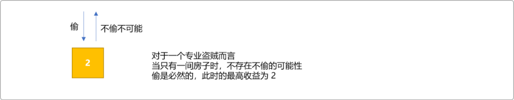
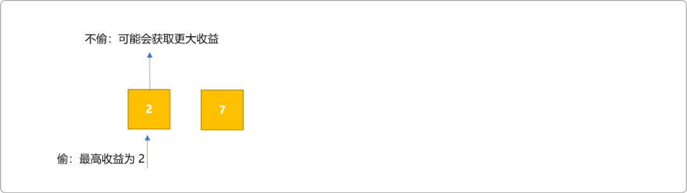
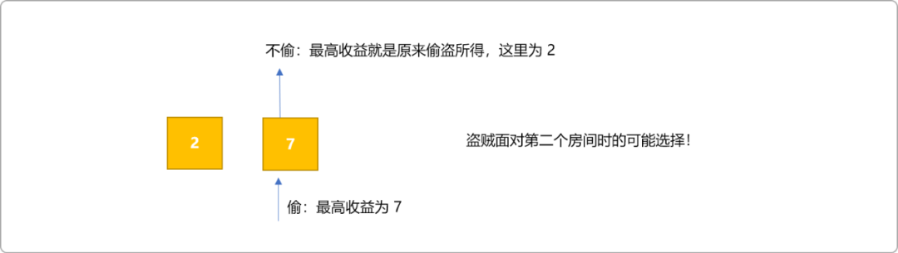
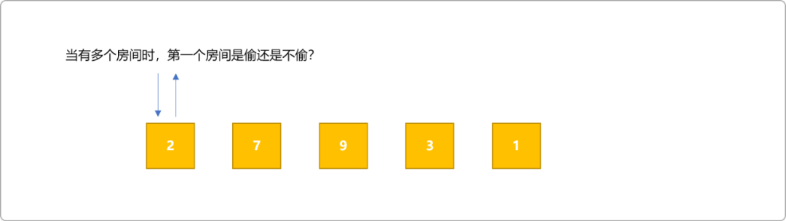
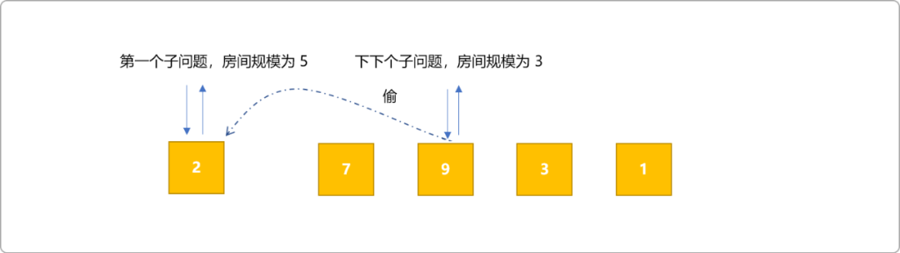
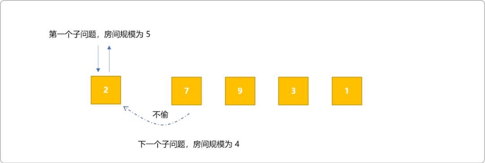
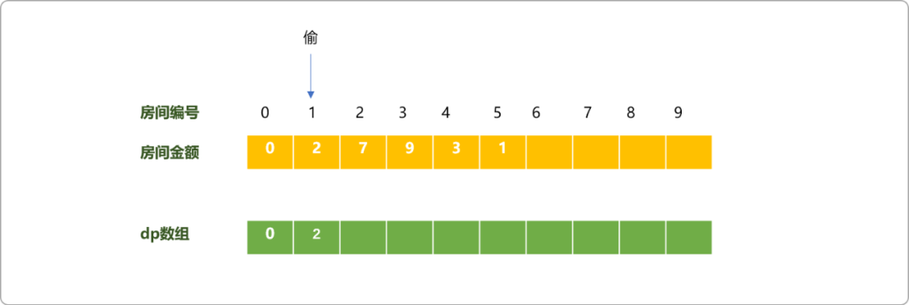
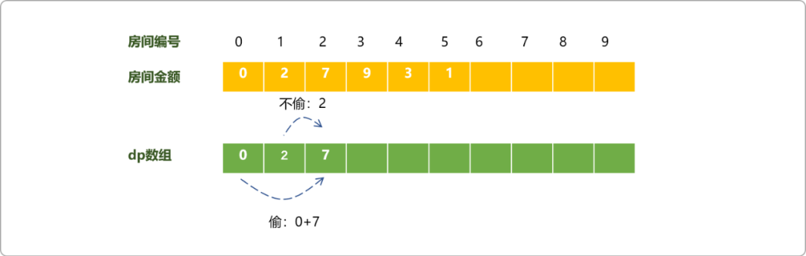
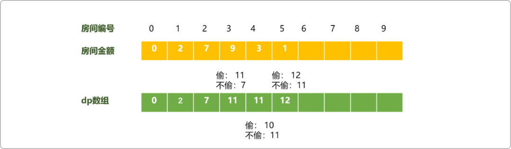

# C++动态规划经典试题解析之打家劫舍系列

## 1.前言

力扣上有几道与打家劫舍相关的题目，算是学习动态规划时常被提及的经典试题，很有代表性，常在国内大大小小的社区内看到众人对此类问题的讨论。

学习最好的方式便是归纳总结、借鉴消化，基于这个目的，本文对此类问题也做了讲解，在一些优秀思想的基础上添加了个人观点。

闲话少说，进入正文，开始`打家劫舍`，看今晚收获几何？

## 2. 线性盗贼

### 2.1 问题描述

一个专业的盗贼，计划偷打劫街的房屋。每间房内都藏有一定的现金，你可以进入每一间房子，影响偷窃的唯一制约因素就是相邻的房屋装有相互连通的防盗系统，如果两间相邻的房屋在同一晚上被盗贼闯入，系统会自动报警。

现给定一个代表每个房屋存放金额的非负整数数组，计算你在不触动警报装置的情况下，能够偷窃到的最高金额。

**示例1：**输入：`[1,2,3,1]`

输出：`4`

解释：偷窃 `1`号房屋(金额=1)，然后偷窃`3`号房屋(金额=`3`)。偷窃到的最高金额=`1+3=4`。

**示例2：**

输入：`[2,7,9,3,1]`

输出：`12`

解释：偷窃 `1` 号房屋(金额 = 2)，偷 3 号房屋(金 = 9)，接着偷 5 号房屋(金额 =1)偷窃到的最高金额=2+9+1=12。

### 2.2 问题分析

在打劫之前先不要急入进入房间，应该是先做全局的估算。

想象当盗贼从第一间房屋开始偷窃，他可以选择是偷还是不偷。偷还是不偷的选择不是源于他瞬时良心上的发现，而是收益的多少。如果只有一间房间，他会毫不犹豫的选择偷，这样才能带来今晚最大的收益。

下图所示为当只有一间房子时盗贼能获取到的最高金额。



如果有 `2` 间房屋，盗贼面对第一间房屋时会如何想呢？

收益固然重要，但是如果触发了报警系统，偷鸡不成蚀把米这样的赔本生意，肯定是不能做的。所以他的想法是可以偷，如果从此房间内的获取到的收益大于从另一个房间内获取到受益，否则，放弃当前房间，而选择进入第二间房间。





怎么知道偷还是不偷哪一个获取的收益最大。唯一法则就是比较，也就偷和不偷两者的受益取其大。如果只有 `2` 间房间，很容易通过比较得到最大收益，两间房间内选择最大的即可。

如果如下图有多个房间时，当盗贼面对第一个房间时，又怎么知道偷和不偷哪一种选择可以获取最大收益，他又不能占卜。



虽然盗贼不能未卜先知，但是，从数学角度而言，问题可以演变成间隔求和问题，把所有可能的值求和，然后取最大值。于上图而言，可以的求和方案有：

- `2+9+1=12`
- `2+3=5`
- `7+3=10`

选择最大求和值为`12`。时时记住，所有问题都是可以通过穷举得到的，回溯是一种典型的穷举思想，故此问题可以使用回溯算法求解所有的和，并取最大值的和。有兴趣者可自行完成。

方案不可能只有一种！

如前所述，当盗贼站在当前房间时，他可以选择偷或不偷。他是无法预知偷或不偷最终返回的收益那一个大，但是站在递归的角度，当前子问题依赖另两个子问题返回值。

> **Tips：** 进入任意房间进行偷窃可认为是一个子问题。如果`A`子问题的值受`B`子问题值的影响，可称`A`依赖B子问题。

- 如果偷，则不能偷相邻，将依赖下下一个子问题（房间）返回的结果。也就是说偷后的收益为当前房间内的金钱数加上下下一个子问题返回的金钱数。



- 如果不偷，则可以偷相邻，将依赖直接相邻子问题返回的结果。也就是说偷后的收益为当前房间内的金钱数加上下一个子问题返回的金钱数。



- 最后再比较偷或不偷中的最大值。递归的最大优点，把大问题分解成小问题。求解出小问题的值后再回溯出大问题的值。

代码实现：

```cpp
#include <iostream>
#include <cstring> 
using namespace std;
//房间数量
int n;
//房间的金额
int m[100];
//结果
int res=0;
int djjs_(int idx) {
    //没有房间，得到 0
 if(idx>n)return 0;
 //偷， 进入下下个房间
 int t= m[idx]+djjs_(idx+2);
 //不偷，可以直接进行相邻房间
 int nt=djjs_(idx+1);
 return max(t,nt);
}
int main(int argc, char** argv) {
 ios::sync_with_stdio(false);
 cin>>n;
 for(int i=1; i<=n; i++) {
  cin>>m[i];
 }
 res= djjs_(1);
 cout<<res;
 return 0;
}
```

动态规划思想：

动态规划中的动态也可以理解为子问题的规模大小，本题的子问题便是当房间数量变化时所影响的，子问题不同，其值不同，但其最优结果可以帮助后续子问题的求到最优解。

- 创建一维`dp`数组，第一个`dp`值存储当前子问题的最优值。当只一个房间时，选择偷。此`dp`或当前子问题可以获取到最优值。



- 面对第`2`间房子，在偷和不偷间选择。选择偷，则`dp`值等于`dp[0]+m[2]=7`，不偷，则为上一个子问题最优值的延续。在两者中选择最大值 `7`。



- 以此类推，对于后面的任一个房间而言，只需要选择是延续上一个子问题的最优值还是在当前房间的金额的基础上加上上上一个子问题的最优值。最终答案为：`12`。



如上可知动态规划的状态转移方程：`dp[i]=max( dp[i-1],m[i]+dp[i-2] )`。

编码实现：

```cpp
#include <iostream>
#include <cstring> 
using namespace std;
//房间数量
int n;
//房间的金额
int m[100];
int dp[100]={0}; 
//结果
int res=0;
int main(int argc, char** argv) {
 ios::sync_with_stdio(false);
 cin>>n;
 for(int i=1; i<=n; i++) {
  cin>>m[i];
 }
 for(int i=1;i<=n;i++){
  dp[i]=max( dp[i-1],m[i]+dp[i-2] );
  res=max(res,dp[i]);
 }
    cout<<res;
 return 0;
}
```

## 3. 环形盗贼

### 3.1 问题描述

在上述问题的基础上，对问题稍做了一些演变，如果房间是环形的，即第一间房子和最后一间房子也是相邻的。求解盗贼能盗取到的最大值是多少？

根据题意可知，如果偷了第一间房子，则最后一间房子时不能偷的，反之，则可以。所以可以把此题目演变成`2` 个问题。

- 假设没有最后一个房间时，求解盗取的最大值。
- 假设没有第一个房间时，求解盗取的最大值。

然后再求解这两个问题中的的最大值。

举个例子，如有`3`个房间，房间内的金额分别为`[1,2,3]`，此时盗贼能盗取的最大金额可分如下情况分析。

- 假设没有最后一间房子。根据前文的动态规划原则，则最大收益为 `2`。如下图所示。


- 假设没有第一间房子。则最大收益为`3`。


- 最后在`2`和`3`中选择最大值`3`，即为本题最终解。

编码实现：

```cpp
#include <iostream>
#include <cstring> 
using namespace std;
//房间数量
int n;
//房间的金额
int m[100];
int dp[100]= {0};
//结果
int res=0;
int main(int argc, char** argv) {
 ios::sync_with_stdio(false);
 cin>>n;
 for(int i=1; i<=n; i++) {
  cin>>m[i];
 }
    memset(dp,0,sizeof(dp) );
 //没有最后一间房子
 for(int i=1; i<n; i++) {
  dp[i]=max( dp[i-1],m[i]+dp[i-2] );
  res=max(res,dp[i]);
 }
  memset(dp,0,sizeof(dp) );
 //没有第一间房子
 for(int i=2; i<=n; i++) {
  dp[i]=max( dp[i-1],m[i]+dp[i-2] );
  res=max(res,dp[i]);
 }
 cout<<res;
 return 0;
}
```

## 4.树上盗贼

问题到此，房间即不是一排，也不是环形，现在房子都挂在一棵二叉树上。且要求同一个边上的两间房子不能同时偷盗。

示例 1: 输入：` [3,2,3,null,3,null,1]`


输出：`7`

题目变成了典型的树型动态规划问题，可以直接套用树型动态规划的通用求解模板。

```cpp
#include <iostream>
#include <cstring>
using namespace std;
int dp_[100][2];
//一维数组描述二叉树节点之间的关系,-1表示没有子节点，把普通二叉树模拟成完全二叉树
int m_[]= {0,3,2,3,-1,3,-1,1,-1,-1,-1,-1,-1,-1,-1,-1,-1,-1,-1,-1,-1,-1,-1,-1,-1,-1,-1,-1};
int res=0;
void treeDp(int idx) {
 if(m_[idx]==-1)return;
 //不偷
 dp_[idx][0]=0;
 //偷
 dp_[idx][1]=m_[idx];
    //深度搜索子节点
 for(int i=0; i<2; i++) {
         //计算子节点位置
  int sid=idx*2+i;
  if(m_[sid]==-1)continue;
  //基于子节点深度搜索
  treeDp(sid) ;
  //不偷，查找子节点上偷与不偷的最大值
  dp_[idx][0] += max(dp_[sid][0],dp_[sid][1]);
         res=max(res,dp_[idx][0]);
  //偷,添加子节点不偷时的状态值
  dp_[idx][1]+=dp_[sid][0];
         res=max(res,dp_[idx][1]);
 }
}
int main(int argc, char** argv) {
 treeDp(1);
 cout<<res;
}
```

另有一种使用递归的简易算法：

```cpp
#include <iostream>
using namespace std;
//树节点类型
struct TreeNode {
 int tid;
 int val;
 int left;
 int right;
};
//已经节点及关系
TreeNode m[5]= { {1,3,2,3 },{ 2,2,-1,4, },{3,3,-1,5 },{ 4,3,-1,-1},{5,1,-1,-1 } };

/* 返回一个 pair
*   first  不偷时得到的最大钱数
*   second 偷时得到的最大钱数
*/
pair<int,int> dp(int root) {
 if (root == -1) {
  pair<int,int> p= {0,0};
  return p;
 }
    //进入左树
 pair<int,int> left = dp( m[root-1].left );
    //进入左树
 pair<int,int> right = dp( m[root-1].right);
 // 抢，下家就不能抢了
 int rob =  m[root-1].val + left.first + right.first;
 // 不抢，下家可抢可不抢，取决于收益大小
 int not_rob = max(left.first, left.second)+ max(right.first, right.second);
 pair<int,int> res= {not_rob, rob};
 return res;
}

int rob(int root) {
 pair<int,int> res= dp(root);
 return max(res.first, res.second);
}

int main(int argc, char** argv) {
 int res=rob(1);
 cout<<res;
 return 0;
}
```

## 5. 总结

本文讲解了三版本的打家劫舍题目，这三个版本难度呈上升趋势，但其内在本质是差不多。抽研出其求解的核心思想，并且能分析其特征，归纳出一类型问题，则无论题目描述如何变化，便也是能快速找出解决问题的算法。


