# C++ 不知图系列之基于邻接矩阵实现广度、深度搜索


## 1. 前言

------

图是一种抽象数据结构，本质和树结构是一样的。

图与树相比较，图具有封闭性，可以把树结构看成是图结构的基础部件。在树结构中，如果把兄弟节点之间或子节点之间横向连接，便构建成一个图。

树适合描述从上向下的一对多的数据结构，如公司的组织结构。

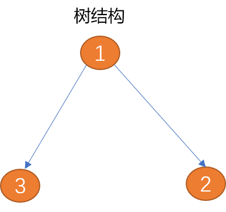

图适合描述更复杂的多对多数据结构，如群体社交关系、城市交通路线……

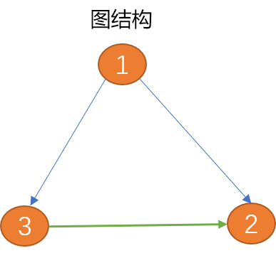

本文将讨论以邻接矩阵方式存储图，并在此基础之上对图进行深度、广度搜索。

## 2. 图论

------

借助计算机解决现实世界中的问题时，除了要存储现实世界中的信息，还需要正确地描述信息之间的关系。

如在开发地图程序时，除了要存储城市、街道……等实体信息，还需要在计算机中描述出城市与城市或城市中各街道之间的连接信息。

在此基础上，才有可能通过算法计算出从一个城市到另一个城市、或从指定起点到目标点间的最佳路径。

> Tips：类似的还有航班路线图、火车线路图、社交关系图……

图结构能很好地对现实世界中如上这些信息以及信息之间的复杂关系进行映射。以此可使用算法方便的计算出如航班线路中的最短路径、如火车线路中的最佳中转方案，如社交圈中谁与谁关系最好、婚姻网中谁与谁最般配……

### 2.1  图的概念

------

**顶点：**顶点也称为节点，顶点本身是有数据含义的，都会带有附加信息，称作"有效载荷"。图中的所有顶点构建成一个顶点集合。是图的组成部分。

> **Tips：**顶点可以是现实世界中的城市、地名、站名、人……


**边：** 图中的边用来描述顶点之间的关系，图中所有边构建成一个边的集合，所以说，图包括了顶点集合和边集合，两者缺一不可。

边可以有方向也可以没有方向，有方向的边又可分为单向边和双向边。

如下图（顶点1）到（顶点2）之间的边只有一方向（箭头所示为方向），**称为单向边**。类似现实世界中的单向道。（顶点1）到（顶点3）之间的边有两个方向（双向箭头），**称为双向边。** 城市与城市之间的关系为双向边。

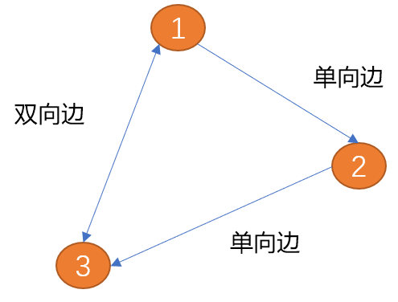


**权重：** 边上可以附加值信息，附加的值称为**权重**。有权重的边用来描述一个顶点到另一个顶点的连接强度。

如现实生活中的地铁路线中，权重可以描述两个车站之间时间长度、公里数、票价……

> **Tips：**边描述的是顶点之间的关系，权重描述的是连接的差异性。

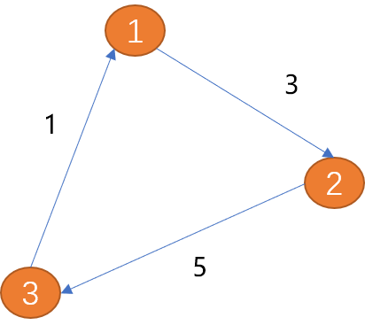

**路径：**

**先了解现实世界中路径概念**

如：从一个城市开车去另一个城市，就需要先确定好路径。也就是 **从出发地到目的地要经过哪些城市？要走多少里程？**

可以说路径是由边连接的顶点组成的序列。因路径不只一条，所以，从一个项点到另一个项点的路径描述也不仅只一种。

> **在图结构中如何计算路径？**
>
> - 无权重路径的长度是路径上的边数。
> - 有权重路径的长度是路径上的边的权重之和。如上图从（顶点1）到（顶点3）的路径长度为 8。

**环：** 从起点出发，最后又回到起点（**终点也是起点**）就会形成一个环，环是一种特殊的路径。如上图中的 `(V1, V2, V3, V1)` 就是一个环。

**图的类型：**

综上所述，图可以分为如下几类：

- **有向图：** 边有方向的图称为有向图。
- **无向图：** 边没有方向的图称为无向图。
- **加权图：** 边上面有权重信息的图称为加权图。
- **无环图：** 没有环的图被称为无环图。
- **有向无环图：** 没有环的有向图，简称 `DAG`。

### 2.2 定义图

------

根据图的特性，图数据结构中至少要包含两类信息：

- 所有的顶点构成的数据集合信息，这里用 `V` 表示（如地图程序中，所有城市构在顶点集合）。

- 所有的边构成关系集合信息，这里用 `E` 表示（城市与城市之间的关系描述）。

  > **如何描述边？**
  >
  > 边用来表示项点之间的关系。所以一条边可以包括 `3` 个元数据（起点，终点，权重）。当然，权重是可以省略的，但一般研究图时，都是指的加权图。

如果用 `G` 表示图，则 `G = (V, E)`。每一条边可以用二元组 `(fv, ev)` 也可以使用 三元组 `（fv,ev,w）` 描述。

> **`fv`** 表示起点，**`ev`**  表示终点。且 `fv`，`ev` 数据必须引用于 `V` 集合。

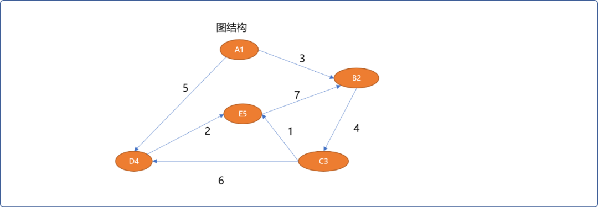


如上的图结构可以描述如下：

```cpp
# 5 个顶点
V={A0,B1,C2,D3,E4}
# 7 条边
E={ (A0,B1,3),(B1,C2,4),(C2,D3,6),(C2,E4,1),(D3,E4,2),(A0,D3,5),(E4,B1,7)}
```

### 2.3  图的抽象数据结构

------

图的抽象数据描述中至少要有的方法：

- `Graph ( )` ：用来创建一个新图。
- `addertex( vert )`：向图中添加一个新节点，参数应该是一个节点类型的对象。
- `addEdge(fv，tv )`：在 `2` 个项点之间建立起边关系。
- `addEdge(fv，tv，w )`：在 `2` 个项点之间建立起一条边并指定连接权重。
- `findVertex( key ) `: 根据关键字 `key` 在图中查找顶点。
- `findVertexs( )`：查询所有顶点信息。
- `findPath( fv,tv)`：查找从一个顶点到另一个顶点之间的路径。
- ……

## 3. 图的存储

------

图的存储实现主流有 `2` 种：邻接矩阵和链接表，本文主要介绍邻接矩阵。

### 3.1 邻接矩阵实现思路

------

使用一维数组存储顶点的信息。

使用二维矩阵（数组）存储顶点之间的关系。

如 `graph[5][5]` 可以存储 5 个顶点的关系数据，行号和列号表示顶点，第  v 行的第 w 列交叉的单元格中的值表示从顶点 v 到顶点 w 的边的权重，如 `grap[2][3]=6` 表示  `C2` 顶点和 `D3` 顶点的有连接（相邻），权重为 `6`。

邻接矩阵存储的优点就是简单，可以清晰表示那些顶点是相连的。因不是每两两个顶点之间会有连接，会导致大量的空间闲置，称这种矩阵为”稀疏“的。

只有当每一个顶点和其它顶点都有关系时，矩阵才会填满。所以，使用这种结构存储图数据，对于关系不是很复杂的图结构而言，会产生大量的空间浪费。可以使用稀疏矩阵压缩算法减少存储空间，代价是会增加逻辑关系。

邻接矩阵适合表示关系复杂的图结构，如互联网上网页之间的链接、社交圈中人与人之间的社会关系……

### 3.2 编码实现邻接矩阵

------

#### 3.2.1 基本函数

------

因顶点本身有数据含义，需要先定义顶点类型。

**顶点类：**

```cpp
template <typename T>
struct Vertex {
 //顶点的编号
 int verId;
 //顶点的值
 T value;
 //是否被访问过
 bool isVisited;
    //前驱结点编号 
    int preVertexId;
 //无参构造
 Vertex() {
  this->isVisited=false;
        this->preVertexId=0;
 }
 Vertex(int vid) {
  this->verId=vid;
  this->isVisited=false;
        this->preVertexId=0;
 }
 //有参构造
 Vertex(int verId,T value) {
  this->verId=verId;
  this->value=value;
  this->isVisited=false;
        this->preVertexId=0;
 }
 //自我显示
 void desc() {
  cout<<"顶点编号："<<this->verId<<",结点的值："<<this->value<<"\t";
 }
};
```

顶点类中 `verId` 和 `value` 很好理解。为什么要添加一个 `isVisited`？

这个变量将用来搜索算法中，用来记录顶点在路径搜索过程中是否已经被搜索过，避免重复搜索计算。

**图类：**提供对图的常规维护函数。

```cpp
#define MAX 11
template <typename T>
class Graph {
 private:
  //一维数组，存储所有结点,为了方便操作，0 位置不存储数据
  Vertex<T> verts[MAX];
  //二维数组，用来存储结点之间的关系，行号和列号为 0 位置不存储信息
  int matrix[MAX][MAX];
  //结点编号，从 1 开始
  int num=1;
 public:
  //无参构造，初始化
  Graph() {
   //初始化矩阵的值为 0
   for(int row=0; row<MAX; row++)
    for(int col=0; col<MAX; col++)
     matrix[row][col]=0;
  };
  //添加新结点
  Vertex<T>  addVertex(T value);
  //添加边
  void addEdge(T from,T to);
  //添加有权重的边
  void addEdge(T from,T to,int weight);
  //根据结点的编号查找
  Vertex<T> findVertex(int id);
  //根据结点的值查找
  Vertex<T> findVertex(T value);
  //查询所有结点
  void findAllVertex();
};
```

#### 3.2.2 实现查询

------

查询结点可以有 `2` 种方案：

- 按结点的值进行查找。这里使用线性查找算法。

```cpp
/*
* 根据值查找结点（线性查找算法）
*/
template <typename T>
Vertex<T> Graph<T>::findVertex(T value) {
 for(int i=1; i<MAX; i++) {
  Vertex<T> ver= Graph<T>::verts[i];
  if(ver.value==value)
   return ver ;
 }
 return {0};
}
```

- 按结点的编号进行查找。

```cpp
//根据结点的编号查找结点
template <typename T>
Vertex<T> Graph<T>::findVertex(int id) {
 if(id>=MAX) {
  return {0};
 }
 return Graph::verts[id];
}
```

#### 3.2.3 添加结点

------

添加结点时，结点的编号由内部生成，目的是保持编号的连续性。

```cpp
/*
*添加新结点，并且返回此结点
*/
template <typename T>
Vertex<T>  Graph<T>::addVertex(T value) {
 //检查结点是否存在
 Vertex<T> ver= Graph<T>::findVertex(value);
 if(ver.verId==0) {
  //创建新结点,结点编号由内部指定
  ver.verId=Graph<T>::num;
  ver.value=value;
  //存储
  Graph<T>::verts[Graph<T>::num] =ver;
  Graph<T>::num++;
 }
 return ver;
}
```

#### 3.2.4 添加结点之间的边

------

无权重图中，结点与结点之间的边信息用 `1` 表示。有权重图中，结点与结点之间的边信息使用权重表示。

**无权重边的添加：**

```cpp
/*
* 添加顶点与顶点之间的关系
* 无向图
*/
template <typename T>
void Graph<T>::addEdge(T from,T to) {
 //检查结点是否存在
 Vertex<T> fromVer=Graph<T>::findVertex(from);
 Vertex<T> toVer=Graph<T>::findVertex(to);
 if(fromVer.verId==0) {
  //不存在，创建此结点
  fromVer=Graph<T>::addVertex(from);
 }
 if(toVer.verId==0)
  toVer=Graph<T>::addVertex(to);
 //无向图中，可以单向描述，也可以双向描述
 Graph<T>::matrix[fromVer.verId][toVer.verId]=1;
 //双向描述
 Graph<T>::matrix[toVer.verId][fromVer.verId]=1;
}
```

**有权重边的添加：**

```cpp
/*
*添加顶点与顶点之间的关系
*有向加权图
*/
template <typename T>
void Graph<T>::addEdge(T from,T to,int weight) {
 //检查结点是否存在
 Vertex<T> fromVer=Graph<T>::findVertex(from);
 Vertex<T> toVer=Graph<T>::findVertex(to);
 if(fromVer.verId==0) {
  //不存在，创建此结点
  fromVer=Graph<T>::addVertex(from);
 }
 if(toVer.verId==0)
  toVer=Graph<T>::addVertex(to);
 //有向加权图
 Graph<T>::matrix[fromVer.verId][toVer.verId]=weight;
}
```

#### 3.2.3  查询所有结点

------

遍历图时，除了显示结点自身信息，同时显示与结点有关的边的信息。

```cpp
//查询所有结点
template <typename T>
void Graph<T>::findAllVertex() {
 for(int i=1; i<Graph<T>::num; i++) {
  Vertex<T> ver= Graph::verts[i];
  ver.desc();
  cout<<endl;
  //查找与此结点有关系的结点
  for(int col=1; col<MAX; col++) {
   int weight=Graph::matrix[ver.verId][col];
   if(weight!=0) {
    //找到结点
    Vertex<T> ver_= Graph::findVertex(col);
    cout<<"\t";
    ver_.desc();
    cout<<"权重："<<weight<<endl;
   }
  }
 }
}
```

#### 3.2.4  测试

------

```cpp
int main(int argc, char** argv) {
 //创建图实例
 Graph<char> graph;
 //添加 A（编号1），B（编号2），C（编号3），D（编号4），E （编号5）  5个结点
 char verInfos[5]= {'A','B','C','D','E'};
 for(int i=1; i<=5; i++) {
  graph.addVertex(verInfos[i-1]);
 }
 cout<<"图中的结点"<<endl;
 graph.findAllVertex();
 //添加结点之间的关系 (A,B,3),(A,D,5),(B,C,4),(C,D,6),(C,E,1),  (D,E,2),(E,B,7)
 graph.addEdge('A','B',3);
 graph.addEdge('A','D',5);
 graph.addEdge('B','C',4);
 graph.addEdge('C','D',6);
 graph.addEdge('C','E',1);
 graph.addEdge('D','E',2);
 graph.addEdge('E','B',7);
 cout<<"结点之间的关系："<<endl; 
 graph.findAllVertex();
 return 0;
}
```

**测试输出结果：**

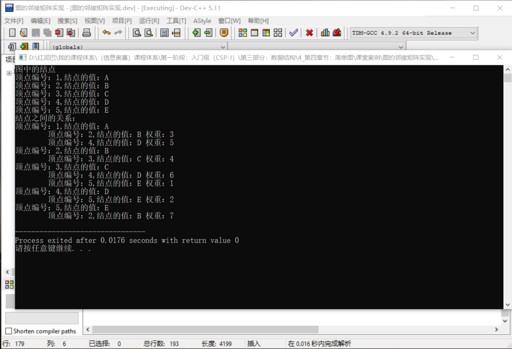

## 4. 搜索路径

------

在图中经常做的操作，就是查找从一个顶点到另一个顶点的路径。

**什么是路径？**

**无权图**中，路径指从一个顶点到另一个顶点经过边的数量。

**有权图中**，路径指从一个顶点到另一个顶点经过的所有边上权重相加之和。

如**查找到 `A1` 到 `E5` 之间的路径长度：**

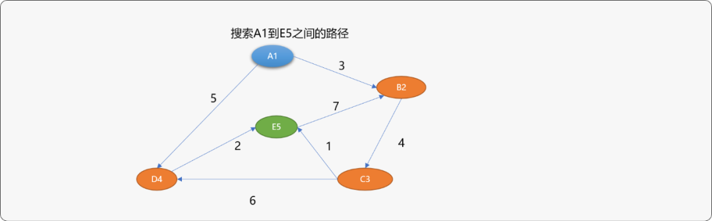


直观思维角度查找一下，可以找到如下路径以及路径长度。

- `{A1，B2，C3，E5}`路径长度为 `8`。
- `{A1，D4，E5}` 路径长度为 `7`。
- `{A1，B2，C3，D4，E5}` 路径长度为 `15`。

人的思维是知识性、直观性思维，在路径查找时不存在所谓的尝试或碰壁问题。而计算机是试探性思维，就会出现这条路不通，再找另一条路的现象。

所以最短路径算法中常常会以错误为代价，在查找过程中会走一些弯路。常用的路径搜索算法有 `2` 种：

- **广度优先搜索。**
- **深度优先搜索。**

### 4.1 广度优先搜索

------

看一下广度优先如何遍历图上所有结点：

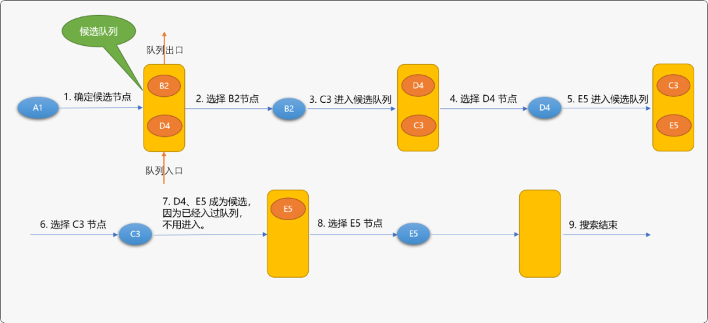


广度优先搜索的基本思路：

- 确定出发点，如上图是 **`A1` 顶点**。
- 以出发点相邻的顶点为候选点，并存储至队列（已经存储过的顶点不用再存储）。
- 从队列中每拿出一个顶点后，再把与此顶点相邻的其它顶点做为候选点存储于队列。
- 不停重复上述过程，直到找到目标顶点或队列为空。

基础版的广度优先搜索算法只能保证找到路径，而不能保存找到最佳（短）路径。如上图如果要从`A1`搜索到`E5`中间需要经过`B2->D4->C3`顶点。

**编码实现广度优先搜索：**

广度优先搜索需要借助队列临时存储选节点，本文使用`STL`中的队列，在文件头要添加下面的包含头文件:

```cpp
#include <queue>
#include <stack>
```

在图类中实现提供广度优先搜索算法的函数。

```cpp
class Graph():
 private:
        //……
     public:
        //广度算法查找 from 顶点到 to 顶点的搜索路径
    void bfs(T  from ,T to); 
    void findNeighbor(queue<Vertex<T>> &myQueue, Vertex<T> & ver );
```

广度优先搜索过程中，需要随时获取与当前节点相邻的节点，`findNeighbor()` 方法的作用就是用来把当前节点的相邻节点压入队列中。

```cpp
//辅助函数，查找结点的邻接结点
template <typename T>
void Graph<T>::findNeighbor(queue<Vertex<T>>  &myQueue, Vertex<T> & ver ) {
 for(int col=1; col<MAX; col++) {
  if( Graph<T>::matrix[ver.verId][col]!=0 ) {
   //相邻结点
   Vertex<T> nv= Graph<T>::findVertex(col);
   //压入队列
   if(nv.isVisited==false) {
                 //指定前驱结点编号
    nv.preVertexId=ver.verId;
                 //设置结点已经被压入过队列中
    nv.isVisited=true;
                 //修改结点
    Graph<T>::verts[col]=nv;
    myQueue.push(nv);
   }
  }
 }
}
```

**广度优先搜索算法：**

```cpp
//广度搜索
template <typename T>
void Graph<T>::bfs(T  from ,T to) {
 //保存搜索到的路径
 stack< Vertex<T>> paths;
 //队列
 queue<Vertex<T>> myQueue;
 //检查结点是否存在
 Vertex<T> fromVer=Graph<T>::findVertex(from);
 Vertex<T> toVer=Graph<T>::findVertex(to);
 if(fromVer.verId==0 || toVer.verId==0)
  //不存在
  return ;
 //把起始顶点压入队列
 myQueue.push(fromVer);
    cout<<"广度搜索结点顺序："<<"\t"; 
 while(!myQueue.empty()) {
  //从队列中得到顶点
  Vertex<T> top= myQueue.front();
        cout<<top.value<<"\t";
  myQueue.pop();
  if(top.verId==toVer.verId && top.value==toVer.value) {
   //找到目标顶点后，顺着前驱向上存储
   Vertex<T> move=top;
   int weight=0;
   while(move.preVertexId!=0) {
    paths.push(move);
    //找到前驱
    move=Graph<T>::findVertex(move.preVertexId);
    weight+=Graph<T>::matrix[move.verId][paths.top().verId];
   }
   paths.push(fromVer);
   cout<<"\n顶点"<<fromVer.value<<"-"<<"项点"<<toVer.value<<"的路径：("<<weight<<")";
             //输出路径，不一定是最短路径
   while(!paths.empty()) {
    Vertex<T> v= paths.top();
    v.desc();
    paths.pop();
   }
   break;
  } else
             //查找相邻顶点
   Graph<T>::findNeighbor(myQueue,top);
 }
}
```

**测试广度优先搜索算法：**

```cpp
int main(int argc, char** argv) {
 //省略其它代码
    //广度搜索
 graph.bfs('A','E');
 return 0;
}
```

**输出结果：**

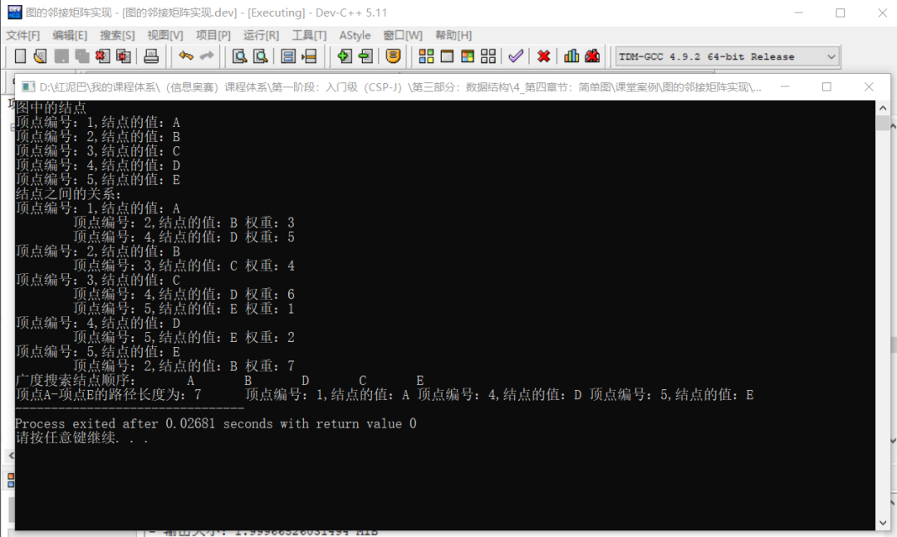


### 3.2 深度优先搜索算法

------

先看一下如何使用深度优先 算法遍历图中所有结点。

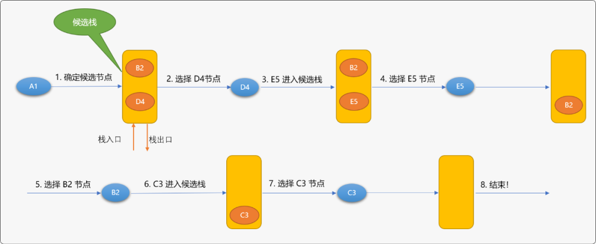


深度优先搜索算法与广度优先搜索算法不同之处：候选节点是放在栈中的。这也决定了两者的本质区别：广度是先进先出的搜索顺序、深度是先进后出的搜索顺序。

使用广度和深度搜索遍历图时，最后搜索到结点的顺序是不相同的：

- 广度遍历顺序：`A1->B2->D4->C3->E5`。
- 深度遍历顺序：`A1->D4->E5->B2->C3`。

**使用循环实现深度优先搜索算法：**

在图类中添加如下 函数：

```cpp
class Graph():
 private:
        //……
     public:
        //深度搜索查找 from 顶点到 to 顶点的路径 
    void dfs(T  from ,T to); 
    void findNeighbor(stack<Vertex<T>> &myStack, Vertex<T> & ver );
```

**深度优先搜索算法：**

```cpp
template <typename T>
void Graph<T>::findNeighbor(stack<Vertex<T>> &myStack, Vertex<T> & ver ) {
 for(int col=1; col<MAX; col++) {
  if( Graph<T>::matrix[ver.verId][col]!=0 ) {
   //相邻结点
   Vertex<T> nv= Graph<T>::findVertex(col);
   //压入栈队
   if(nv.isVisited==false) {
    nv.preVertexId=ver.verId;
    nv.isVisited=true;
    Graph<T>::verts[col]=nv;
    myStack.push(nv);
   }
  }
 }
}
//深度搜索查找 from 顶点到 to 顶点的路径
template <typename T>
void Graph<T>::dfs(T  from ,T to) {
 //保存搜索到的路径
 stack< Vertex<T>> paths;
 //队列
 stack<Vertex<T>> myStack;
 //检查结点是否存在
 Vertex<T> fromVer=Graph<T>::findVertex(from);
 Vertex<T> toVer=Graph<T>::findVertex(to);
 if(fromVer.verId==0 || toVer.verId==0 ) return;
 //把起始顶点压入栈
 myStack.push(fromVer);
    cout<<"深度搜索结点顺序："<<"\t"; 
 while(!myStack.empty()) {
  //从栈中得到顶点
  Vertex<T> top= myStack.top();
        cout<<top.value<<"\t";
  myStack.pop();
  if(top.verId==toVer.verId && top.value==toVer.value) {
   //找到
   Vertex<T> move=top;
   int weight=0;
   while(move.preVertexId!=0) {
    paths.push(move);
    move=Graph<T>::findVertex(move.preVertexId);
    weight+=Graph<T>::matrix[move.verId][paths.top().verId];
   }
   paths.push(fromVer);
   cout<<"\n顶点"<<fromVer.value<<"-"<<"项点"<<toVer.value<<"的路径：("<<weight<<")";
   while(!paths.empty()) {
    Vertex<T> v= paths.top();
    v.desc();
    paths.pop();
   }
   break;
  } else
   Graph<T>::findNeighbor(myStack,top);
 }
}
```

**深度搜索测试：**

```cpp
int main(int argc, char** argv) {
 //省略其它代码
    //深度搜索
 graph.dfs('A','E');
 return 0;
}
```

**输出结果：**

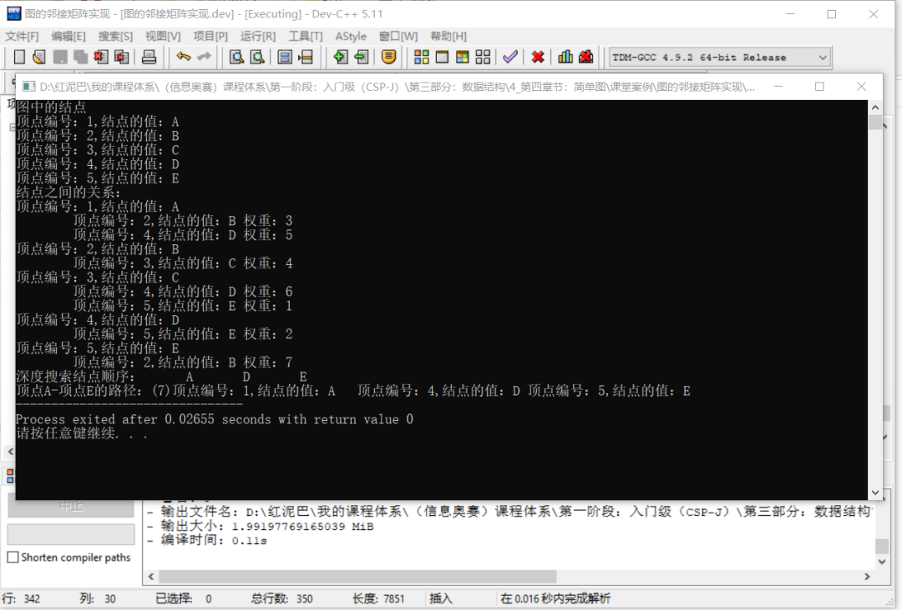


使用深度算法搜索从`A1查找到E5`，中间只需要经过`D4`顶点。

## 5. 总结

------

图是一种很重要的数据结构，现实世界中万事万物之间的关系并不是简单的你和我，我和你的关系，本质都是错综复杂的。

图能准确的映射现实世界的这种错综复杂关系，为计算机处理现实世界的问题提供了可能，也拓展了计算机在现实世界的应用领域。


