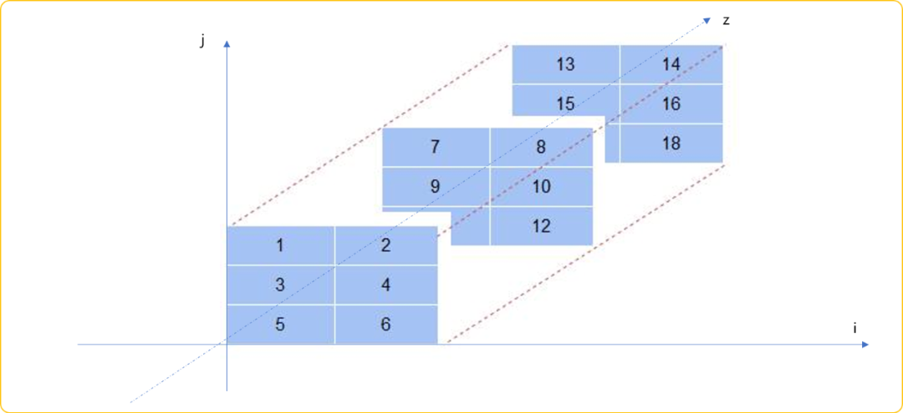
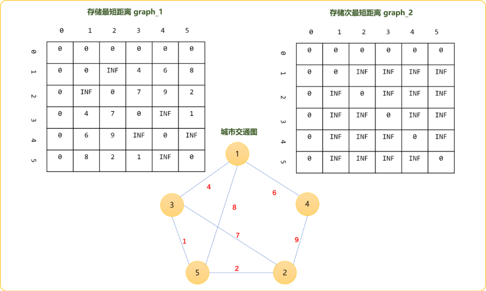
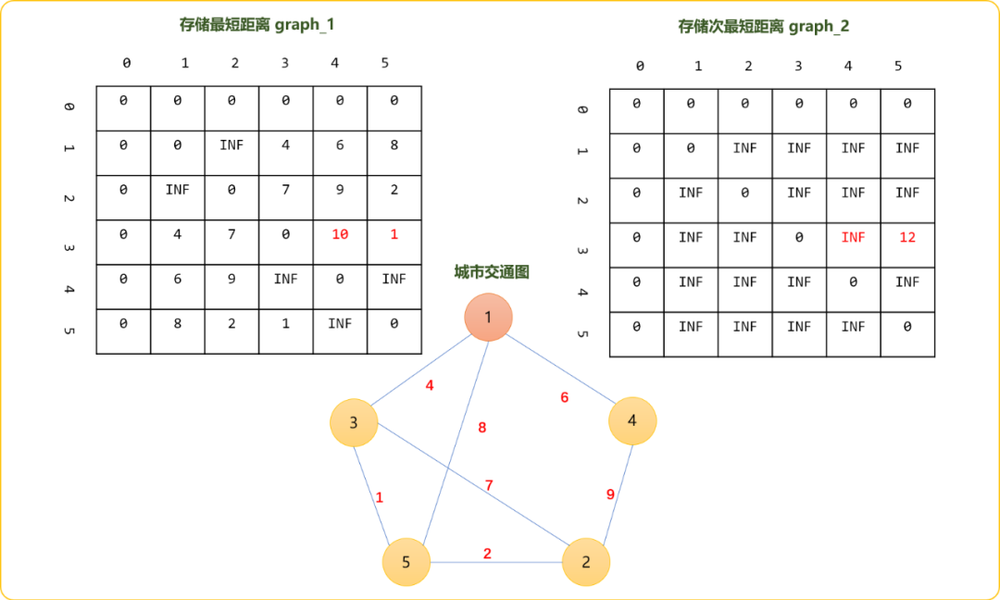
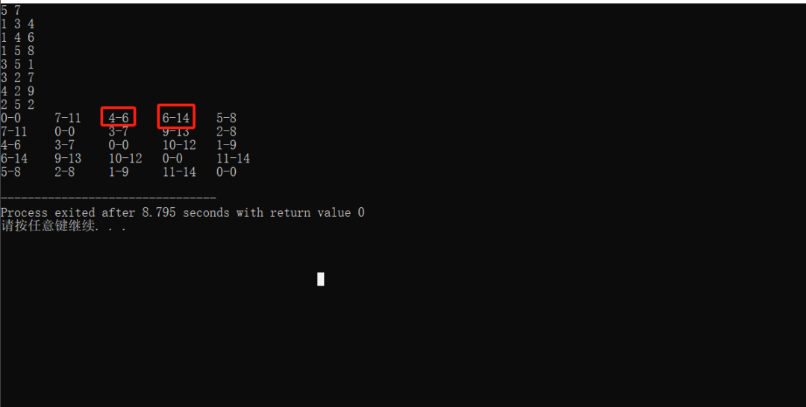
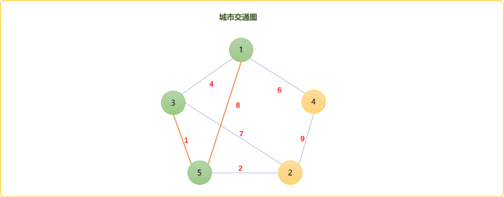
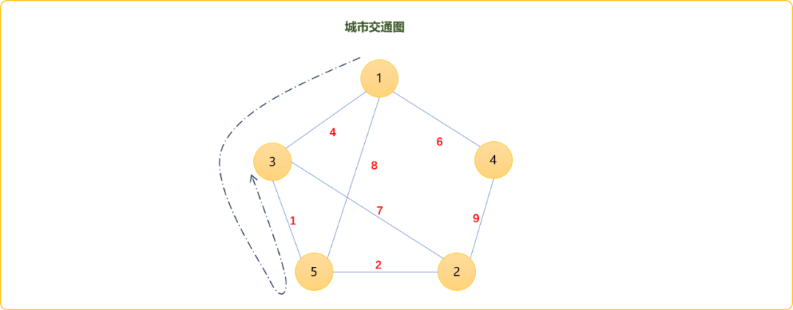
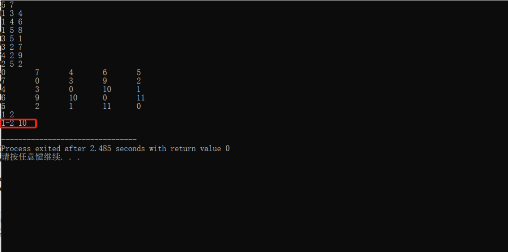
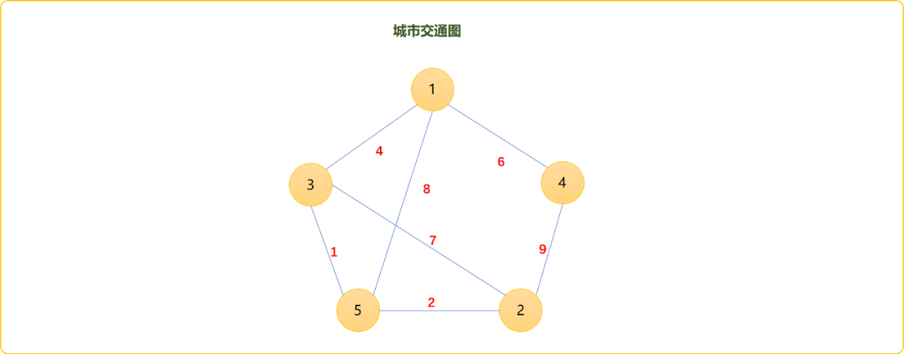
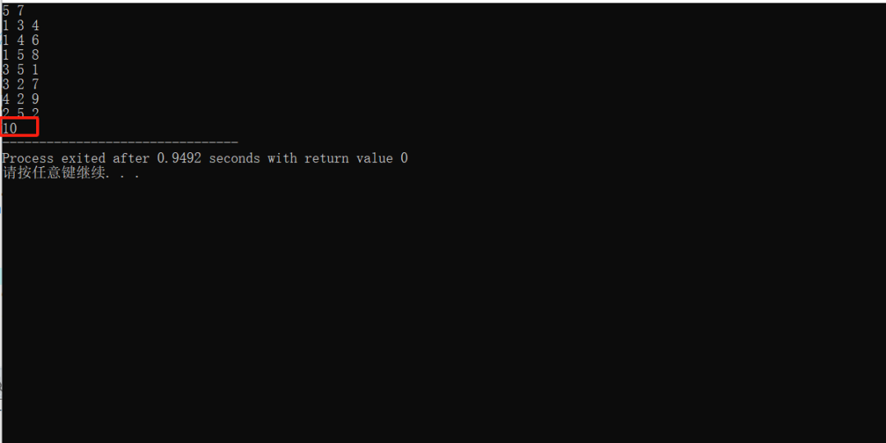
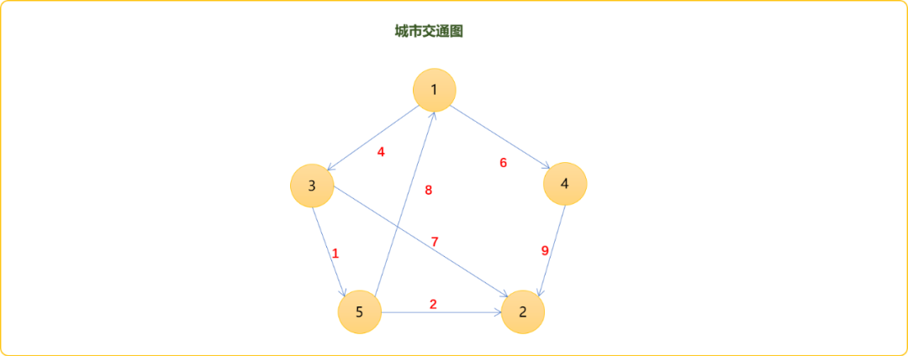

# C++ 图论之Floyd算法求解次最短路径的感悟，一切都是脱壳后找最值而已

## 1. 前言

抛开基因的影响，学霸和学渣到底是在哪一点上有差异？

学霸刷完 `200` 道题，会对题目分类，并总结出解决类型问题的通用模板，我不喜欢模板这个名词，感觉到投机的意味，或许用方法或通用表达式更高级一点。而事实上模板一词更准确。

每一道题目在描述时，会套上一堆场景说词，可以说是契合真正的应用领域，或者说是出题人的故弄玄虚，弄了一些花里胡哨的迷糊你的外表，这时考核的不是专业知识，而是语文阅读能力。一旦脱出外壳，露出来的底层需求，就是书本上最基础的知识。

小学生学乘法表后，老师会布置很多应用题，不管应用题目的描述如何变化，一旦语文阅读理解过关，剩下的就是套用九九乘法表。为什么学霸学起来一直很轻松原因就在这里，做道时看山不是山。而学渣总是认为一道题目就是一个新知识，疲于学习，永无止境地追赶，停留在看山是山的境界。

为什么说这些？

这段时间写最小生成树、次最小生成树以及最短路径和次最短路径。总结一下，应该不难发现。本质就是在群体数据中找最小值和次最小值，这是最最基础的最值算法思想。如果是在一维数组中找最大值、最小值，只要有点语言基础的都能解决。

代码结构如下：

```cpp
#include <bits/stdc++.h>
using namespace std;
int main() {
 //一维数组
 int nums[5]= {5,3,1,8,2};
 //存储最大值
 int maxVal_1=nums[0];
 //存储最小值
 int maxVal_2=nums[0];
 //遍历数组
 for(int i=0; i<5; i++) {
  //是否大于最大值
  if( nums[i]>maxVal_1 ) {
   //原来的最大值必然退居成第二大值
   maxVal_2=maxVal_1;
   //如果大于最大值，必然成为最大值
   maxVal_1=nums[i];
  } else if(nums[i]>maxVal_2) {
   //如果大于第二大的值，成为第二大值。
   maxVal_2=nums[i];
  }
 }
 cout<<maxVal_1<<"\t"<<maxVal_2<<endl;
 return 0;
}
```

其中玄机很简单。公司里空降了一位新领导，如果级别比现任的最高领导的级别高。则现任最高领导成为二把手，新领导成为一把手。如果新领导只比公司现任的二把手高，则挤掉二把手，成为新的二把手。

找最值算法本质，确定一个值，然后查找是否有比此值更大或更小的值，多重选择而已。

当问题变成找最小生成树，次最小生成树、最短路径，次最短路径时……

算法的思想本质没有发现变化，只是遍历的对象变成了图结构或树结构。虽然算法的底层策略不变，但因图结构比线性结构复杂的多，遍历过程中面临的选择也增多，如何选择，如何存储就变得稍难一点。

最短路径常用的算法为`Floyd、Bellman、SPFA、Dijkstra`。既然能找出最短路径，当然是能找出次最短路径的。下面将分别使用`Floyd`算法，细聊如何找出次最短路径。

## 2. `Floyd`算法

对`Floyd`算法不甚了解的读者可以查阅本公众号里的《C++图论之常规最短路径算法的花式玩法（Floyd、Bellman、SPFA、Dijkstra算法合集）》一文。

使用`Floyd`算法求解最短路径时，顺手也能求解出次最短路径，下面捋捋这个过程。以下面的图结构为案例。


邻接矩阵存储存初始时，节点之间的权重关系。`0`表示自己和自己的距离，`INF`表示两节点间无直接连接，数值表示两节点的连接权重。`Floyd`是多源最短路径算法。算法结果需要记录任意两点间的距离，二维数组是较佳的选择。

现在除了要求解最短路径，还需要求解出次最短路径。则有两种存储方案：

- 三维数组。
- 两个二维数组。

三维数组本质是多个二维数组在空间深度上的叠加。如下图，所有二维数组的`i`和`j`坐标描述任意两个节点的编号。`z`坐标表示两个节点之间的第一最短距离、第二最短距离、第三最短距离……



演示算法流程时，借助于两个二维数数组更易于表达。如下图所示，初始，最短距离为两点间的权重值，次最短距离为`INF（无穷大）`。

> Tips：次最短距离有严格次最短距离，要求次最短距离必须小于最短距离。非严格次最小距离，则可以是大于或等于最短距离。



`Floyd`算法的特点是通过在任意两点间插入一个节点，检查是否能缩短其距离。如选择节点`1`做为中插入点，检查其它任意点之间是否可以通过此点缩短其距离。

`graph_1[3][4]`原来的值为`INF`，经过中转点后值为`graph_1[3][1]+graph_1[1][4]=10`，大于原来的最短距离，则原来的最短距离变成第二短距离，经过中转后的值为新的最短距离。



以此类推，分别计算出其它两点经过`1`号节点后的最短距离和次最短距离。

如`3-5`原来最短距离是`1`，如果经过`1`号节点则距离为`graph_1[3][1]+graph_[1][5]=12`。大于原始值但是小于次最短距离，故，最短距离不更新，次最短距离更新为`12`。


一维数组中的选择是线性的，图结构中的选择复杂。`Floyd`算法提供插入这个选择理念，底层最值的算法思想没有发生任何本质上的变化。新老大了，原老大退居第二；新老二来了，原老二退居第三……

其它演示流程不再展现，直接上代码。

```cpp
#include <bits/stdc++.h>

using namespace std;
//最短路径
int graph_1[100][100][2];
map<pair<int,int>,vector<int>> paths;
//节点数、边数
int n,m;
//无穷大
const int INF=999;
//初始化图，自己和自己的距离为0，和其它节点距离为 INF
void init() {
 for(int i=1; i<=n; i++) {
  for(int j=1; j<=n; j++) {
   if(i==j) {
    graph_1[i][j][0]=0;
    graph_1[i][j][1]=0;
   } else {
    graph_1[i][j][0]=INF;
    graph_1[i][j][1]=INF;
   }
  }
 }
}

//交互式得到节点之间关系
void read() {
 int f,t,w;
 for(int i=1; i<=m; i++) {
  cin>>f>>t>>w;
  graph_1[f][t][0]=w;
  //无向图
  graph_1[t][f][0]=w;
 }
}
//Floyd算法
void  floyd() {
 //核心代码
 for(int dot=1; dot<=n; dot++) {
  //以每一个点为插入点，然后更新图中任意两点以此点为中转时的路线权重
  for(int  i=1; i<=n; i++) {
   for(int j=1; j<=n; j++) {
    //经过中转后的权重是否小于原来权重
    if( graph_1[i][dot][0]+graph_1[dot][j][0] <graph_1[i][j][0]  ) {

     graph_1[i][j][1]=graph_1[i][j][0];
     graph_1[i][j][0] =graph_1[i][dot][0]+graph_1[dot][j][0];

    } else if(  graph_1[i][dot][0]+graph_1[dot][j][0]>graph_1[i][j][0] &&    graph_1[i][dot][0]+graph_1[dot][j][0] <graph_1[i][j][1]  ) {
      graph_1[i][j][1]=graph_1[i][dot][0]+graph_1[dot][j][0];

    }
   }
  }
 }
}
//输入矩阵中信息
void show() {
 for(int i=1; i<=n; i++) {
  for(int j=1; j<=n; j++)
   cout<<graph_1[i][j][0]<<"-"<<graph_1[i][j][1]<<"\t";
  cout<<endl;
 }
}

int main(int argc, char** argv) {
 cin>>n>>m;
 init();
 read();
 floyd();
 show();
 return 0;
}
```

测试数据：

```cpp
5 7
1 3 4
1 4 6
1 5 8
3 5 1
3 2 7
4 2 9
2 5 2
```

测试结果：




**有问题的代码**

如图所示，`1-3`的最短距离是`4`，直观可以判断正确性。但是`1-3`的次最短距离是`6`，可能会让你有点莫名其妙。因为直观上讲，应该是`9`，也就`1-5-3`这条路径，除此之外，似乎没有比这个值更合理的。

`6`这个值是怎么来的？




算法的计算逻辑是把`1-3`的路径分解成`1-5`和`3-5`，因`1-5`的之间的最短路径是`1-3-5`值为`5`。所以，最后的结果是`1-5`的最短路径值加上`3-5`之间的最短路径值，结果为`6`。如下图演示效果。




**如何解决这个问题？**

先跑一次`Floyd`算法，得到任意两点间的距离，再删除任意两点之间的最短路径上的边，再跑一次`Floyd`算法，便可求解出次最短路径。

如在求解`1-2`的最短路径时，记录最短路径的整个路径链`1-3-5-2`，然后试着删除`1-3`跑一次，再删除`3-5`跑一次，再删除`5-2`走一次，最后在三次中选择最`1-2`之间的最短距离。

**代码如下：**

```cpp
#include <bits/stdc++.h>
using namespace std;
//图
int graph[100][100];
//最短路径
int paths[100][100];
//节点数、边数
int n,m;
//记录任意两点间最短距离所比对过的节点
map<pair<int,int>,vector<int>> prec;
//无穷大
const int INF=999;
//初始化图，自己和自己的距离为0，和其它节点距离为 INF
void init() {
 for(int i=1; i<=n; i++) {
  for(int j=1; j<=n; j++) {
   if(i==j)graph[i][j]=paths[i][j]=0;
   else graph[i][j]=paths[i][j]=INF;
  }
 }
}
//交互式得到节点之间关系
void read() {
 int f,t,w;
 for(int i=1; i<=m; i++) {
  cin>>f>>t>>w;
  graph[f][t]=paths[f][t]=w;
  //无向图
  graph[t][f]=paths[t][f]=w;
 }
}
//Floyd 最短路径算法
void  floyd() {
 //核心代码
 for(int dot=1; dot<=n; dot++) {
  //以每一个点为插入点，然后更新图中任意两点以此点为中转时的路线权重
  for(int  i=1; i<=n; i++) {
   for(int j=1; j<=n; j++) {
    //经过中转后的权重是否小于原来权重
    if( paths[i][dot]+paths[dot][j] <paths[i][j]  ) {
     paths[i][j] =paths[i][dot]+paths[dot][j];
     //记录任意两点之间的节点
     pair<int,int> p= {i,j};
     vector<int> v=prec[p];
     v.push_back(dot);
     prec[p]=v;
    }
   }
  }
 }
}
//次最短路径算法
void floyd(int i,int j) {
 //恢复图原来数据
 for(int i1=1; i1<=n; i1++) {
  for(int j1=1; j1<=n; j1++) {
   paths[i1][j1]=graph[i1][j1];
  }
 }
 //删除最短路径上的边
 paths[i][j]=INF;
   //路一次算法
 for(int dot=1; dot<=n; dot++) {
  //以每一个点为插入点，然后更新图中任意两点以此点为中转时的路线权重
  for(int  i=1; i<=n; i++) {
   for(int j=1; j<=n; j++) {
    //经过中转后的权重是否小于原来权重
    if( paths[i][dot]+paths[dot][j] <paths[i][j]  ) {
     paths[i][j] =paths[i][dot]+paths[dot][j];
    }
   }
  }
 }
}

//输出矩阵中信息
void show() {
 for(int i=1; i<=n; i++) {
  for(int j=1; j<=n; j++)
   cout<<paths[i][j]<<"\t";
  cout<<endl;
 }
}

int main(int argc, char** argv) {
 cin>>n>>m;
 init();
 read();
 floyd();
 show();

 int i=1,j=2;
 cin>>i>>j;
 int i1=i;
 pair<int,int> p= {i,j};
 vector<int> v=prec[p];
 int res=INF;
 for(int k=0; k<v.size(); k++) {
  floyd(i1,v[k]);
  res=min(res,paths[i][j]);
  i1=v[k];
 }
 floyd(i1,j);
 res=min(res,paths[i][j]);
 cout<<i<<"-"<<j<<" "<<res<<endl;
 return 0;
}
```

测试`1-2`之间的最短路径。




时间复杂度分析：一句话，时间复杂度有点感人，性能堪忧，至于如何优化就留给聪明的你了。

## 3. 最小环

图中最小环的问题，可以使用`Floyd`算法求解。算法流程：

- 跑一次算法，得到任意两点间的最短距离。
- 检查任意两点之间的最短距离是否有其它节点存在(环至少需要 `3` 个点)，如这两点之间有连接，可证明这两点间有环。
- 求解最小环。

如下图所示，`1-2`之间的最短路径链为`1-3-5-2`。因为`1-2`之间没有直接相连的边，说明这个最短路径不构成环。`3-2`最短路径线为`3-5-2`，且`3-2`之间有边相连，证明`2-5-3`这条最短路径存在环，且此环的权重和为`10`；如`1-5`的最短距离为`1-3-5`，且是一个环，权重和为`13`。至于最小环是谁，只有找出所有环且计算它们的权重和后方可知。




编码实现：

```cpp
#include <bits/stdc++.h>

using namespace std;
//图
int graph[100][100];
//最短路径
int paths[100][100];
//节点数、边数
int n,m;
//记录任意两点间最短距离所比对过的节点
map<pair<int,int>,vector<int>> prec;
//无穷大
const int INF=999;
//初始化图，自己和自己的距离为0，和其它节点距离为 INF
void init() {
 for(int i=1; i<=n; i++) {
  for(int j=1; j<=n; j++) {
   if(i==j)graph[i][j]=paths[i][j]=0;
   else graph[i][j]=paths[i][j]=INF;
  }
 }
}

//交互式得到节点之间关系
void read() {
 int f,t,w;
 for(int i=1; i<=m; i++) {
  cin>>f>>t>>w;
  graph[f][t]=paths[f][t]=w;
  //无向图
  graph[t][f]=paths[t][f]=w;
 }
}
//Floyd算法 最短路径算法
void  floyd() {
 //核心代码
 for(int dot=1; dot<=n; dot++) {
  //以每一个点为插入点，然后更新图中任意两点以此点为中转时的路线权重
  for(int  i=1; i<=n; i++) {
   for(int j=1; j<=n; j++) {
    //经过中转后的权重是否小于原来权重
    if( paths[i][dot]+paths[dot][j] <paths[i][j]  ) {
     paths[i][j] =paths[i][dot]+paths[dot][j];
     //记录
     pair<int,int> p= {i,j};
     vector<int> v=prec[p];
     v.push_back(dot);
     prec[p]=v;
    }
   }
  }
 }
}
//找最小环
int calMinCircle() {

 int minCircle=INF;

 for(int  i=1; i<=n; i++) {
  for(int j=1; j<=n; j++) {
   pair<int,int> p= {i,j};
   vector<int> v=prec[p];
   if(v.size()==0)continue;
   //确定是不是环
   if( graph[i][j]!=INF ) {
                //找最小环
    minCircle=min(minCircle,paths[i][j]+graph[i][j] );
   }
  }
 }
 return minCircle;
}

//输出矩阵中信息
void show() {
 for(int i=1; i<=n; i++) {
  for(int j=i+1; j<=n; j++)
   cout<<paths[i][j]<<"\t";
  cout<<endl;
 }
}

int main(int argc, char** argv) {
 cin>>n>>m;
 init();
 read();
 floyd();
 //show();
 int res= calMinCircle();
 cout<<res;
 return 0;
}
```

测试结果：




如果是有向图，需要注意方向。如下图，`2-3-5`之间没有环，唯一的环是`1-3-5`。




## ４．总结

本文讲解了如何使用｀Floyd｀算法求解次最短路径.


一枚大果壳

![赞赏二维码](https://mp.weixin.qq.com/s?__biz=MzU2NDgzNjgzNw==&mid=2247489013&idx=1&sn=ebacbcefc0433a0b6a568ade4ad0f9d7&chksm=fd979a14e5eec533401c75dfdbebfb93e151d405fdf53e9a97e7a5ca1fdf9b18893b90bee733&scene=126&sessionid=1729004113&subscene=7&clicktime=1729006138&enterid=1729006138&key=daf9bdc5abc4e8d0e5c277bdd42c982d66cb9e265c4da5205f2783f379322434031fa8bcd69cfddd8cf9b5336bfabf58c971411de004307fe4d0bbf8004fc6f2dd915d82993bb1801d8a27a733bdb5c8967f17fd990572b7d61cee60f789011eaafeb7ca93fd0d5328a4c290ab064fada4e9cc4c06bca55b7fbf839688e97eaa&ascene=0&uin=NjUxMzM2MTA4&devicetype=Windows+10+x64&version=63090c11&lang=zh_CN&countrycode=CN&exportkey=n_ChQIAhIQAtAiWYEc3yKu5yepzVPmjhLmAQIE97dBBAEAAAAAACTJOlEJmzcAAAAOpnltbLcz9gKNyK89dVj0oTSwl93LfrSFRhfBPiVnlctE%2B%2BlVNA17Ol%2FY7SFzKCR8rS7Pd3Y%2BEcMqd9JHuhCic4jqQmkcmHSSsV3jE8IFbMKMp2h3fnw72PaejBFXEC519L9SxJPMJJi19x4EPw%2BjMERi6xKHuASmQI0RQPPdKrF%2FCo1R47gUNbg67cwQI5FYK6qejxjGgnjNFORId9UMzLAZXBSI%2BVBXXnc7piN8Wv7YeGIUFphVIN4OpMJiFdpZXhKnv0zSzievKlzXfoNO&acctmode=0&pass_ticket=RXUYU%2FXEjI4dk3JLwjz8WfyBsi7MqRHy14kYMD9sZjY%2FVE1xAVZMKd3%2F3Dm98zrG&wx_header=1&fasttmpl_type=0&fasttmpl_fullversion=7428020-zh_CN-zip&fasttmpl_flag=1)[喜欢作者](javascript:;)

阅读 158


<iframe src="https://wxa.wxs.qq.com/tmpl/kx/base_tmpl.html" class="iframe_ad_container iframe_adv_ad_container" style="-webkit-tap-highlight-color: transparent; margin: 0px; padding: 0px; outline: 0px; width: 677px; height: 0px; border: none; box-sizing: border-box; display: block; left: 0px;"></iframe>


编程驿站

2242

[发消息](javascript:;)

