# C++ 图进阶系列之 Bellman-Ford 和 Dijkstra 最短路径求解算法


## 1. 前言

因无向、无加权图的任意顶点之间的最短路径由顶点之间的边数决定，可以直接使用原始定义的广度优先搜索算法查找。

但是，无论是有向、还是无向，只要是加权图，最短路径长度的定义是：起点到终点之间所有路径中权重总和最小的那条路径。

如下图所示，`A` 到 `C` 的最短路径并不是`A`直接到 `C`（权重是` 9`），而是` A` 到 `B` 再到 `C`（权重是 `7`）。所以，需要在广度优先搜索算法的基础上进行算法升级后才能查找到。


加权图的常用最短路径查找算法有：

- 贝尔曼-福特（Bellman-Ford）算法。
- Dijkstra（迪杰斯特拉） 算法。
- `A*` 算法。
- `D*` 算法。

本文重点介绍 `Bellman-Ford`和`Dijkstra`算法。

## 2. 贝尔曼-福特（`Bellman-Ford`）算法

`贝尔曼-福特`算法取自于创始人`理查德.贝尔曼`和`莱斯特.福特`，本文简称 `BF` 算法

`BF` 算法属于迭代、穷举算法，算法效率较低，如果图结构中顶点数量为 `n`，边数为 `m` ，则该算法的时间复杂度为 `m*n` ，还是挺大的。

理论上讲，图结构中边上的权重一般用来描述现实世界中的**速度、时间、花费、里程**……基本上都是非负数。即使是负数，`BF` 算法也能工作得较好。

### 2.1 BF 算法思想

**问题描述：如下图，搜索 `A` 到其它任意顶点之间的最短路径。**

首先给每一个顶点一个**权重值**（用来存储从`起始顶点`到`此顶点`的最短路径上所有边上权重之和），刚开始除了出发点的权重 0 ，因为还不能确定到其它任意顶点的具体路径长度，其它顶点的权重值均初始为无穷大（只要是一个适当值都可以）。

下面的图结构是`无向加权图`，对于`有向加权图`同样适用 `BF` 算法。

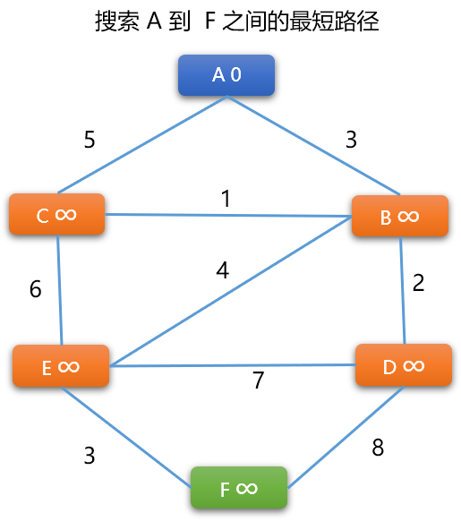


**`BF` 算法流程**

**更新顶点的权重：** 计算任一条边上一端顶点（始点）到另一个端顶点（终点）的**权重**。**新权重=顶点（始点）权重+边的权重**，然后使用**新权重值**更新终点的**原来权重值**。

**更新原则：** 只有当顶点原来的权重大于新权重时，才更新。

- 先选择 `A -> B` 之间的路径，因为 `A~B` 是无向边，需要计算 `2` 次。如果是有向图，则只计算一个方向。

  先计算 `A -> B` 的新权重=`A`的权重+（`A`，`B`）边上的权重，新权重=`0+3=3`。因 `3` 小于 `B` 顶点现在的权重（无穷大），`B` 的权重被更新为 `3`。

  再计算 `B -> A `的新权重=`B`的权重+(`A`，`B`) 边上的权重。新权重=`3+3=6`。`6` 大于 `A` 现有的权重 0，则 `A` 顶点不更新。

> **Tips：** 此时，意味着 `A -> B` 的最短路径长度为 `3`。**`A `是 `B` 的前序顶点。** 但是，这绝对不是最后的结论。

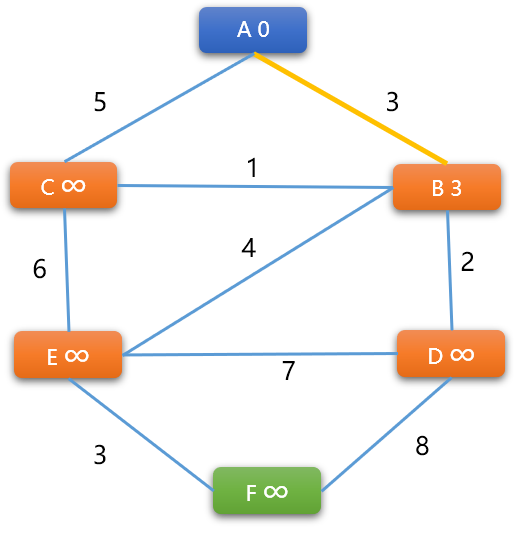


- 对图中每一条边两端的顶点都执行上述同样的操作，对于执行顺序没有特定要求。如下继续计算 `（A，C）` 边的两端顶点的权重。

  `A -> C `的新权重=`0+5=5`，更新 `C` 顶点权重为 `5`。

  `C -> A` 的新权重=`5+5=10` 不更新。**结论：`A` 是 `C` 的前序顶点。**

  

  

  > **Tips：** 当顶点的权重更新后，也意味着前序顶点也发生了变化。如上述权重更新过程中 `C` 刚开始前序是 `A`，后来又更改成了 `B`。

- 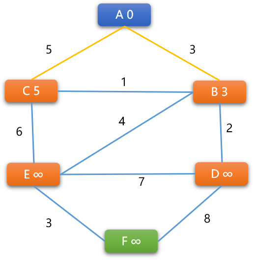

- 

- - 计算  `（B，C）` 权重：

    `B -> C` 的新权重=`3+1=4`，小于 `C` 现有权重 `5` ，`C` 的权重更新为 `4`，**则 B 是 C的前序顶点**

    `C -> B` 的新权重= `4+1 =5` ，大于 `B` 现有权重，不更新。

    经过上述操作后 `（A，B，C）`3 个顶点的前序关系：`A` 是 `B` 的前序、`B` 是 `C` 的前序，当前 `A -> B` 的最短路径是 `3`，`A -> B -> C` 的最短路径是 `4`，但不一定是最后结论。

- 当所有边两端顶点都更新完毕后，需要再重新开始，对图结构中所有边上的顶点权重再进行一次更新，一直到不再引起权重变化时 `BF` 算法才算结束。

- `BF` 算法的本质还是广度优先搜索算法，附加了更新顶点权重的逻辑。

### 2.2 结构设计

在实现算法之前，先要为图设计一系列类型。

#### 2.2.1  顶点类型

此类用来描述顶点本身信息，除了有顶点的常规属性，如**编号、名称、链接表**……外，还需要添加 `2` 个属性：

- **顶点的权重：**初始化时为无穷大。

  > **Tips:** 顶点权重用来保存起始点到此顶点的最短路径长度（边上权重之和）。

- **前序顶点：** 在 `BF` 算法中，如果顶点的权重发生了更新，也意味着前序顶点也发生了变化。

**基本结构：**

```cpp
#include <iostream>
#include <map>
#include <climits>
#include <vector>
#include <queue>
using namespace std;
/*
* 结（顶）点类
*/
template<typename T>
struct Vertex {
 //顶点的编号
 int vId;
 //顶点所承载的值
 T value;
 //是否被访问过:False 没有 True:有
 bool visited;
 //与此顶点相连接的其它顶点
 map< Vertex<T>*,int > connectedTo;
 //前序顶点
 Vertex<T>* preorderVertex;
 // 权重（初始为无穷大）,为了研究方便，此处权重为 int  类型
 int weight = INT_MAX;
 //无参构造函数
 Vertex() {
  this->visited=false;
  this->vId=-1;
  this->preorderVertex=NULL;
 }
 //有参构造函数
 Vertex(int  id,T value) {
  this->vId=id;
  this->value=value;
  this->visited=false;
  this->preorderVertex=NULL;
 }
```

继续在顶点结构体中添加如下的函数，满足对顶点的一系操作。

**添加相邻顶点函数**

```cpp
/*
*添加邻接顶点
*nbrVer:相邻顶点
*weight:无向无权重图，权重默认设置为 1
*/
void addNeighbor(Vertex<T>* nbrVer,int weight=1) {
    //map 中以相邻顶点为键，边权重为值
    this->connectedTo[nbrVer]=weight;
}

/*
*判断给定的顶点是不是当前顶点的相邻顶点
*/
bool isNeighbor( Vertex<T>* nbrVer) {
    //检查
    typename::std::map< Vertex<T>,int >::iterator iter= this->connectedTo.find(nbrVer) ;
    if( iter==this->connectedTo.end() )return false;
    return true;
}
```

**顶点对象以字符串格式输出**

```cpp
/*
*显示当前顶点以及与之相邻的其它顶点
*/
void desc() {
    cout<<"顶点编号:"<<this->vId<<";顶点值:"<<this->value<<"顶点权重："<<this->weight<<endl;
    int count= this->connectedTo.size();
    cout<<"相邻顶点："<<count;
    typename::std::map< Vertex<T>*,int >::iterator begin= this->connectedTo.begin();
    typename::std::map< Vertex<T>*,int >::iterator end= this->connectedTo.end();
    while(begin!=end) {
        //（编号，值，边权重）
        cout<<"\t("<<begin->first->vId <<","<<begin->first->value<<","<<begin->second<<")"<<"\t";
        begin++;
    }
    cout<<endl;
}           
```

**更新顶点权重函数**

此函数为 `BF` 算法的核心子逻辑，参数 `nbrVer` 是指与当前顶点相邻的顶点。先是计算和当前顶点的新权重，根据**更新原则**进行更新。如果有更新则需要把当前顶点指定为前序顶点。

```cpp
/*
*得到和某一个相邻顶点的权重
*/
int getWeight(Vertex<T>* nbrVer) {
    return this->connectedTo[nbrVer];
}

/*
*计算顶点权重（路径长度）
*/
bool  calBfWeight(Vertex<T>* nbrVer) {
    // 顶点权重加上顶点间边的权重
    int newWeight = this->weight + this->getWeight(nbrVer);

    if (newWeight < nbrVer->weight) {
        // 计算出来权重小于顶点原来权重，则更新
        nbrVer->weight=newWeight;
        // 更新前序顶点
        nbrVer->preorderVertex = this;
        return 1;
    }
    return 0;
}
```

> **Tips：** 在图结构中，最短路径算法中的前序顶点指到达此顶点最近的顶点。

**重载函数**

```cpp
//重载 < 运算符
bool operator<(const Vertex<T> & vert) const {
    return  this->vId<vert.vId;
}
//重载 == 运算符
bool operator==(const Vertex<T> & vert) const {
    return  this->vId==vert.vId;
}
```

#### 2.2.2 图类

此类用来对图中的顶点进行维护，如添加新顶点，维护顶点之间的关系、提供`BF` 搜索算法……

**图类的基本结构**

```cpp
template<typename T>
class Graph {
    private:
        // 一维列表，存储所有结点
        vector< Vertex<T>* > vertList;
        // 顶点个数
        int vNums = 0;
        // 队列，用于路径搜索算法
        queue<Vertex<T>* > pathQueue;
        //保存任意顶点之间的最短路径
        vector< vector< Vertex<T>* > > allPath;
    public:
    /*
 *无参构造函数
 */
    Graph() {}
    //其它
```

**其它功能函数**

- **查询函数:** 有 `2` 个，一个按值在图中查询单个顶点，一个在图中查询所有顶点。

```cpp
/*
*按值查询顶点是否存在
*/
Vertex<T>* findVert(T  vertValue) {
    for(int i=0; i<this->vNums; i++) {
        if( this->vertList[i]->value==vertValue )
            return this->vertList[i];
    }
    return NULL;
}

/*
*查询所有顶点
*/
void findVertexes() {
    for(int i=0; i<this->vNums; i++) {
        this->vertList[i]->desc();
    }
}
```

- **添加新顶点以及维护顶点之间的关系函数：** 新顶点的编号由内部提供，统一管理，保证编号的一致性。

```cpp
/*
* 添加新顶点
*/
Vertex<T>* addVertex( T  vertValue) {
    //检查顶点是否存在
    Vertex<T>* vert=this->findVert(vertValue);
    if(vert!=NULL )return vert;
    // 顶点的编号内部生成
    vert=new Vertex<T>(this->vNums, vertValue);
    // 存储顶点
    this->vertList.push_back(vert);
    // 计数
    this->vNums++;
    return vert;
}

/*
* 添加顶点与顶点之间的关系（边），
* 如果是无权重图，统一设定为 1
*/
void addEdge(T fromValue,T toValue,int weight=1) {
    // from节点
    Vertex<T>* fromVert=this->addVertex(fromValue);
    //to 结点
    Vertex<T>* toVert=this->addVertex(toValue);
    //调用顶点自身的添加相邻顶点方法。
    fromVert->addNeighbor(toVert,weight);
}
```

- **贝尔曼-福特算法：** 这里用到了递归，在 `BF` 算法中，一轮更新后可能还需要后续多轮更新才能让每一个顶点上的权重不再变化。这也是 `BF` 算法的缺陷。

```cpp
/*
*贝尔曼-福特算法
*/
void bfNearestPath(Vertex<T> *from_v) {
    Vertex<T>* tmp_v;
    from_v->weight=0;
    // 记录边更新次数
    int update_count = 0;
    // 起始点压入队列
    this->pathQueue.push(from_v);
    // 检查队列是否为空
    while(!this->pathQueue.empty()) {
        //从队列获取顶点
        tmp_v = this->pathQueue.front();
        this->pathQueue.pop();
        // 标记为已经处理
        tmp_v->visited = true;
        // 得到与其相邻顶点
        map< Vertex<T>*,int > nbr_vs = tmp_v->connectedTo;
        
        typename::std::map< Vertex<T>*,int >::iterator begin=nbr_vs.begin();
        typename::std::map< Vertex<T>*,int >::iterator end=nbr_vs.end();

        // 更新与其相邻顶点的权重
        while(begin!=end) {
            Vertex<T>* v_=begin->first;
            // 更新权重，并记录更新次数
            update_count += tmp_v->calBfWeight(v_);
            // 无向边，要双向更新
            update_count +=v_->calBfWeight(tmp_v);
            // 把相邻顶点压入队列
            if (!v_->visited) {
                this->pathQueue.push(v_);
                v_->visited=true;
            }
            begin++;
        }
    }
    // 更新完毕后，如果更新次数为 0 ，则不用再更新。
    if (update_count != 0) {
        this->bfNearestPath(from_v);
    }
}
```

- **输出最短路径函数：** 先计算，再输出。

```cpp
/*
*显示任意 2 个顶点之间的最短路径
*/
void getAllPath(T  value ) {
    //起始结点
    Vertex<T>*  startv= this->findVert(value);
    for(int i=0; i<this->vNums; i++ ) {
        Vertex<T>*  t_v = this->vertList[i];
        if(t_v==startv)continue;
        vector<Vertex<T>*  > path;
        path.push_back(t_v);
        while (1) {
            // 找到前序顶点
            Vertex<T>* pv= t_v->preorderVertex;
            path.push_back(pv);
            if(pv==startv) {
                this->allPath.push_back(path);
                break;
            }
            t_v=pv;
        }
    }
}

void showAllPath( T  value ) {
    cout<<"(----------f_v~t_v 最短路径长度------------)"<<endl;
    for(int i=0; i<this->allPath.size(); i++  ) {
        //起始结点
        Vertex<T>*  startv= this->findVert(value);
        //输出起始点
        cout<<startv->value<<"("<<startv->weight<<")"<<"->";
        int weight=0;
        for(int j=this->allPath[i].size()-1; j>=0; j-- ) {
            //
            Vertex<T>* tmp=this->allPath[i][j];
            //如果是起始点
            if(tmp==startv)continue;
            //得到相邻顶点的权重
            weight+=startv->getWeight(tmp);
            startv=tmp;
            cout<<startv->value<<"("<<startv->weight<<")"<<"->";
        }
        cout<<"最短路径的值"<<weight<<endl;
    }
}
```

**测试图类中的函数：**

- **添加顶点以及顶点之间的关系：**

```cpp
int main(int argc, char** argv) {
 // 初始化图
 Graph<char> graph;
 // 添加节点
 char verts[]= {'A', 'B', 'C', 'D', 'E', 'F'};
 for(int i=0; i<sizeof(verts); i++ ) {
  graph.addVertex(verts[i]);
 }

 // 添加顶点之间关系
 char v_to_v[9][3] = { {'A', 'B', 3},  {'A', 'C', 5} , {'B', 'C', 1 } , { 'B', 'D', 2 } , {'B', 'E', 4} , { 'C', 'E', 6}, {'D', 'E', 7},
  {'D', 'F', 8},
  {'E', 'F', 3}
 };

 for(int i=0; i<9; i++) {
  graph.addEdge( v_to_v[i][0], v_to_v[i][1], v_to_v[i][2] );
  graph.addEdge( v_to_v[i][1], v_to_v[i][0], v_to_v[i][2] );
 }
    //显示图中的所有顶点以及顶点之间的关系
 graph.findVertexes();
 return 0;
}
```

**测试结果：**

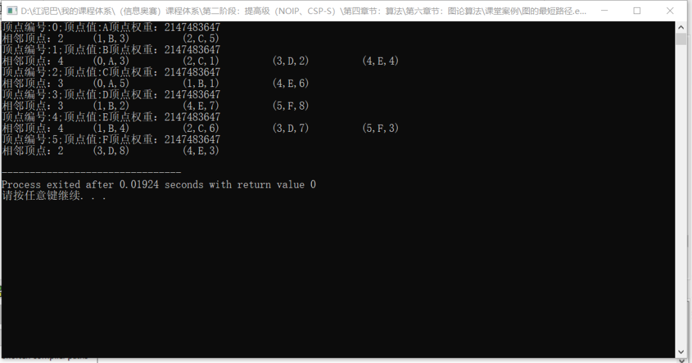


- **`BF`算法测试**

```cpp
int main(int argc, char** argv) {
 //省略……
 //查找任一顶点到 'A' 顶点之间的最短路径长度
 Vertex<char>* fromV=   graph.findVert('A');
    //BF 算法
 graph.bfNearestPath(fromV);
 cout<<"---------BF后顶点的权重----------"<<endl;
 graph.findVertexes();
 graph.getAllPath('A');
 graph.showAllPath('A');
 return 0;
}
```

**输出结果：**

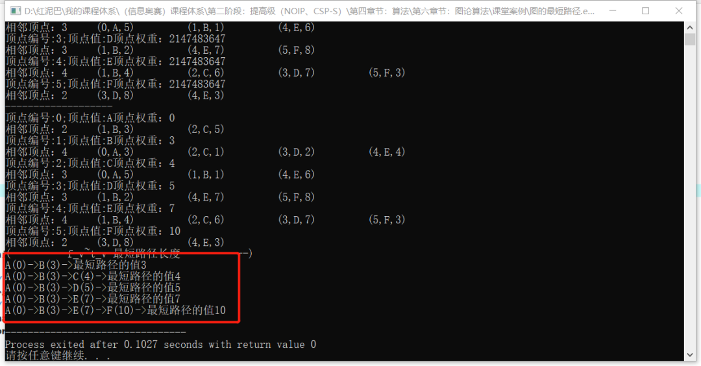


如下图，路径中最后一个顶点的`权重`就是起点`A`到此顶点的最短路径值(路径权重)。

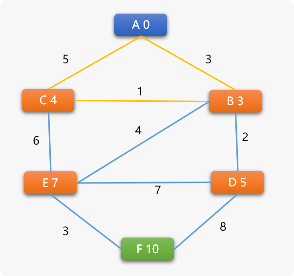


## 3. `Dijkstra`（迪杰斯特拉）算法

`迪杰斯特拉`算法(`Diikstra`) 是由荷兰计算机科学家`狄克斯特拉`于1959 年提出的，因此又叫`狄克斯特拉算法`。为了便于表述，本文简称 `DJ` 算法。

`DJ` 算法和前面所聊的 `BF` 算法，可谓同工异曲，算法的核心思想是相同的：

- **搜索到某一个顶点后，更新与其相邻顶点的权重**。

  > **Tips：** 权重计算法则以及权重更新原则两者相同。

- **且顶点权重的数据含义和 `BF` 算法的一样**。表示从起始点到此点的最短路径长度（也就是经过的所有边的权重之和）。

  > **Tips：** 初始时，因还不能具体最短路径，起始点的权重为 `0` ，其它顶点权重可设置为无穷大。

`DJ` 算法相比较 `BF` 算法有 `2` 个不同的地方：

- 在无向加权图中，`BF` 算法需要对相邻 `2` 个顶点进行双向权重计算。
- `DJ` 算法搜索时，每次选择的下一个顶点是所有权重值最小的顶点。**其思想是保证每一次选择的顶点和当前顶点权重都是最短的。**所以，`DJ`是基于贪心思想。

### 3.1 `DJ` 算法流程

如下图结构中，查找 `A` 到任一顶点的最短路径：


1. **定位到起始点 `A` ， `A` 顶点也称为`当前顶点`。**

- 设置 `A` 的权重为 `0`，`A` 的相邻顶点有 `B` 和 `C`，需要计算 `A` 到 `B` 以及 `A` 到 `C` 之间的权重。这里是先选择 `B` 还是 `C` 并不重要。先选择 `B` 顶点，计算 `A -> B` 的路径长度权重。**新权重计算公式＝`A`顶点权重＋`（A，B）`边的权重＝０＋３＝３**．
- 更新原则和 `BF` 算法一样，当计算出来的权重值小于相邻顶点的权重值时，更新。于是 `B` 的权重更新为 `３`．此时 `A` 是 `B` 的前序顶点。
- 再选择 `C` 顶点，计算 `A -> C` 路径长度权重＝`０＋9＝9`，因 `9` 小于 `C` 现在的无穷大权重，`C` 的权重被更新为 `9`。

> **Tips：** 到这里， 可以说 `DJ` 算法和 `BF` 算法没有什么不一样。
>
> 但是，`DJ` 算法不需要对边上 `2` 个顶点进行双向权重计算，**这是 `DJ` 算法与 `BF` 算法的第一个差异性。**

此时，更新后的图结构如下所示:

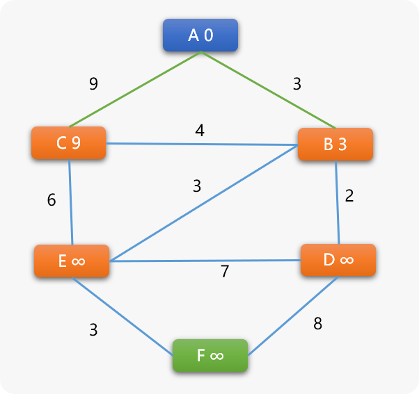


很显然， `B` 和 `C` 将成为下一个搜索的候选点，这里 `DJ` 算法和 `BF` 算法就有了很大的差异性。

**`BF` 算法对于选择 `B` 还是 `C` 的顺序没有要求。**

**`DJ` 算法则不同，会选择 `B` 和 `C` 中权重值更小的那个， `B` 的权重 3 小于 `C` 的权重 9 ，当然选择 `B` 为下一个搜索顶点。**

**这是 BF 算法和 DJ 算法的第二个差异性！**

选择 `B` 后也就意味着 `A->B` 之间的最短路径就确定了。为什么？

因你无法再找出一条比之更短的路径。

**这里也是 `DJ` 算法的关键思想，在选择一个权重最小的候选顶点后，就能确定此顶点和它的前序顶点之间的最短路径长度。**

> **Tips：** 到现在为止， `B` 的前序顶点是 `A`；`C` 的前序顶点也是 `A` 。
>
> 因为 `B` 已经被选为下一个搜索顶点，于是 `B` 顶点和它的前序顶点 `A` 之间的最短路径已经出来了。
>
> A－＞Ｂ　最短路径长度为 ３。
>
> 因 `C` 顶点还没有成为搜索顶点，其和 `A` 顶点之间的最短路径还是一个未知数。

1. **Ｂ成为当前顶点 **

- 找到与 `B` 相邻的 `C`、`D`、`E 3` 个顶点，然后分别计算路径长度权重。`B->C` 的新权重=３+4＝７ 小于 `C` 现有的权重  ９ ，C 的权重被更新为 ７ ，**C 的前序顶点也变成了 B**。

  同理，`B->D` 路径中 `D` 的权重被更新为 5；`B->E` 路径中 `E` 的权重被更新为 ６ 。

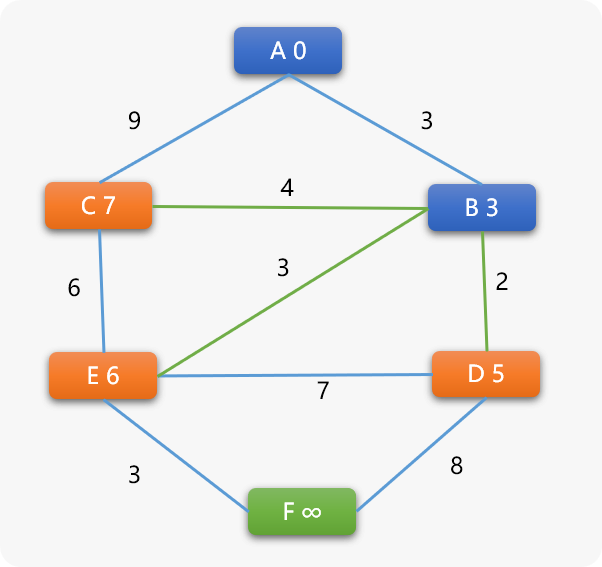


- 再在 `C`、 `D`、 `E 3` 个顶点中选择权重值最小的 `D` 为下一个搜索顶点．到这里！可以发现 `DJ` 算法和原始定义的广度搜索算法以及 `BF` 之间就有了本质上的区别：

  广度优先搜索算法会选择和 `B` 同时进入队列的  `C` 顶点成为下一个搜索顶点。因为 `B` 和 `C` 都是离 `A` 较近的顶点。

  而 `DJ` 算法是在候选顶点中，哪一个顶点的权重最少，就选择谁，不采用就近原则．而是以顶点的权重值小作为优先选择条件．

> **Tips：** 选择 `D` 后 ，各顶点间的关系：
>
> `B` 的前序是 `A`，`（Ａ，Ｂ）`间最短路径已经确定。
>
> `D` 的前序是 `B` ，`（Ｂ，Ｄ）`间的最短路径可以确定，又因为 `B` 的前序顶点是 `A` ，所以 `A－＞B－＞D` 的最短路径可以确定。
>
> 其它项点间的最短路径暂时还不明朗。

1. **D 顶点为当前顶点**

- 计算与 `D` 相邻的 `E、F` 顶点的权重。

  `D->E` 的新权重=`5+7=12` 大于 `E` 现有权重 `6` ，不更新。**`E` 的前序顶点还是 `B`。**

  `D->F` 的新权重=`5+8=13` ，`F` 的权重由无穷大更新为 `13`。

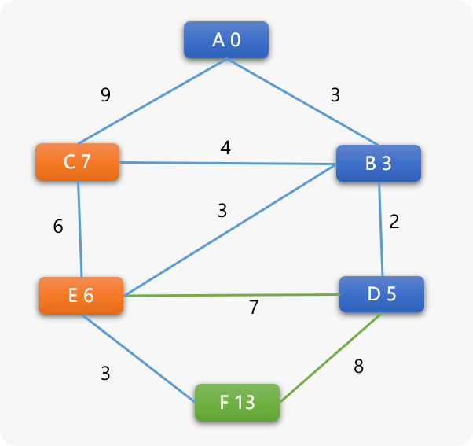


- 再在剩下的所有可选顶点中选择权重值小的 `E` 顶点为下一个搜索点，当选择 `E` 后：

> **Tips：** `E` 的前序为 `B` , `B` 的前序是 `A`，所以 `A` 到 `E` 的最短路径长度就是 `A->B->C` ，路径长度为 `6`。

1. **E 为当前顶点，计算和其相邻顶点间的权重。**

唯一可改变的是 `F` 顶点的权重，`F` 顶点的前序顶点变为 `E`。

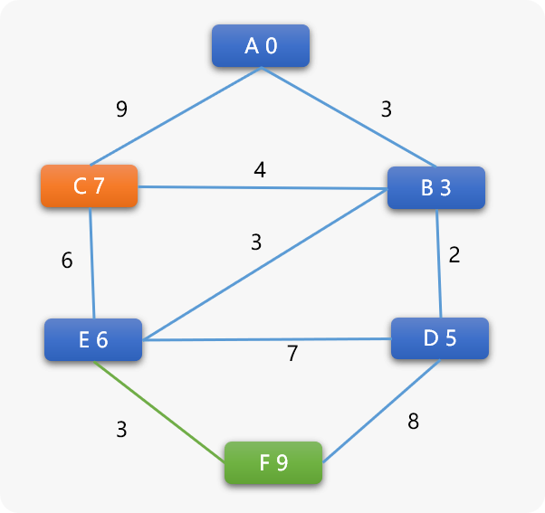


1. **再选择 C 为当前顶点**

- `C` 和相邻顶点不会再产生任何权重的变化，其前序顶点还是 `B`。所以 `A` 到 `C` 之间的最短路径应该是 `A->B->C` 路径长度为 `7`。

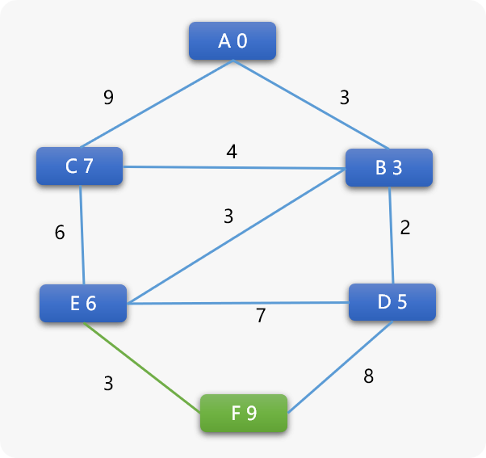


- 最后选择 `F` 顶点，也不会再产生任何权重变化，`F` 的前序是 `E`，`E`的前序是`B`，`B`的前序是`A`，所 `A` 到 `F` 的最短路径应该是 `A->B->E->F` 权重值为 `9`。
- 最后，以图示方式，比较 `BF` 算法和 `DJ` 算法中各顶点出队列的顺序。`BF` 采用就近原则出队列，然后不停计算相邻顶点的权重，直到权重不再变化为止，显然用的是蛮力，`DJ` 采用权重值小的优先出队列，显然用的是巧力。

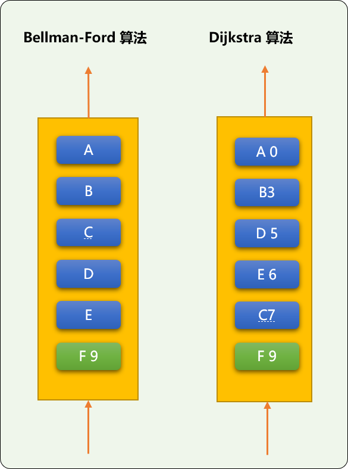


### 3.2 编码实现

**分析完 DJ 算法流程，准备编码**

和上面的 `BF` 算法相比较，顶点类一样，在图类中添加 `DJ` 算法。

`DJ`算法的本质还是广度优先搜索算法，有所区别的地方是使用**优先队列**，每次从队列中选择顶点时，选择顶点权重最小的。

所以需要在`Graph`类中添加优先队列对象，并为队列提供用于比较的函数对象。

```cpp
//省略其它……
//为优先队列提供比较函数对象
struct comp {
 bool operator() (Vertex<T>* v1, Vertex<T>* v2) {
  //由小到大排列
  return v1->weight < v2->weight;
 }
};
template<typename T>
class Graph {
 private:
     //省略其它……
     //优先队列容器
  priority_queue<Vertex<T>* ,vector<Vertex<T>*>,comp<T> > priorityQueue;
     //记录 Dj 算法已经更新顶点。DJ 算法不需要对已经过求过权重的 2 个顶点重复计算
  vector< vector< Vertex<T>* > > isUpdate;
         //省略其它
```

** `DJ` 算法函数**

```cpp
template<typename T>
class Graph {
    private:
     //省略……
    public:
         //省略其它……
         /*
  *检查是否更新过
  */
  bool isUpdated(Vertex<T>* v1,Vertex<T> * v2) {
   bool is=false;
   for(int i=0; i<this->isUpdate.size(); i++) {
    vector<Vertex<T>*> vec=this->isUpdate[i];
    if(v1==vec[0] && v2==vec[1] ||  v2==vec[0] && v1==vec[1] )is=true;
   }
   return is;
  }
  /*
  * Dijkstra（迪杰斯特拉）算法
  */
  void djNearestPath(Vertex<T> * from_v) {
   // 记录边更新次数
   int update_count = 0;
   Vertex<T>* tmp_v;
   //设备起始点的权重为 0
   from_v->weight=0;
   // 起始点压入队列
   this->priorityQueue.push(from_v);
   //标记已经入队列
   from_v->visited = true;
   // 检查队列是否为空
   while ( !this->priorityQueue.empty() ) {
    // 从队列获取顶点
    tmp_v = this->priorityQueue.top();
    this->priorityQueue.pop();
    // 得到与其相邻所有顶点
    map< Vertex<T>*,int > nbr_vs = tmp_v->connectedTo;
    typename::std::map< Vertex<T>*,int >::iterator begin=nbr_vs.begin();
    typename::std::map< Vertex<T>*,int >::iterator end=nbr_vs.end();
    while(begin!=end) {
     Vertex<T>* v_=begin->first;
     // 顶点间的权重是否更新过
     if( this->isUpdated(tmp_v,v_))continue;
     // 更新权重
     tmp_v->calBfWeight(v_);
     //记录更新信息
     vector<Vertex<T>* > update= {tmp_v,v_ };
     // 把相邻顶点压入队列
     if( v_->visited==false ) {
      this->priorityQueue.push(v_);
      v_->visited=true;
     }
     begin++;
    }
   }
  }
    //省略其它……
};
```

**测试代码：**

```cpp
int main(int argc, char** argv) {
 // 省略……
 Vertex<char>* fromV=   graph.findVert('A'); 
 cout<<"Dijkstra 算法:"<<endl; 
 graph.djNearestPath(fromV);
 cout<<"-------------------"<<endl;
 graph.findVertexes();
 graph.getAllPath('A');
 graph.showAllPath('A');
 return 0;
}
```

**输出结果：**和前面`BF`的结论一样。

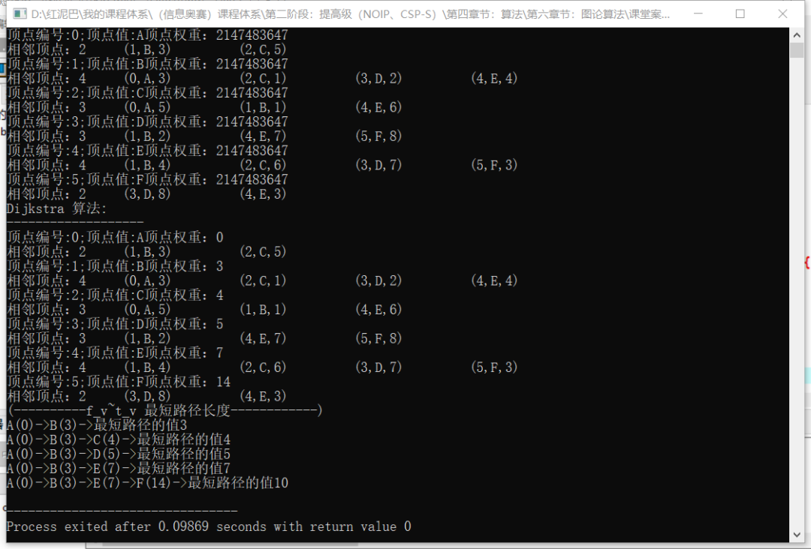


`DJ` 算法不适合用于边上权重为负数的图中，否则可能找不到路径。

## 3. 总结

在加权图中查找最短路径长度算法除了 `BF`、`DJ` 算法，还有 `A*` 、 `D*` 算法。有兴趣的可以自行了解。


