# C++ 图进阶系列之 kruskal 和 Prim 算法_图向最小生成树的华丽转身

## 1. 前言

`树`和`图`形状相似，也有差异性。树中添加一条或多条边，可成图。图中减小一条或多条边，可成树。形态的变化由数据之间的逻辑关系决定。

- 图用来描述数据之间多对多关系。
- 树用来描述数据之间一对多关系。

**思考如下问题？**

如果在一座城市城市里铺设一条地铁，要求：

- 地铁需要通过每一个街区。
- 线路或造价等最短（少）。

`街区`之间的逻辑关系可以用`无向加权图`描述。建设地铁，意味着在图中查找一棵`最小生成树`，这样才能满足上述要求。

**什么是最小生成树？**

所谓最小生成村，指从图中找出一棵树，且此树满足如下几个条件：

- 包含图中的所有顶点。
- 树中不能有环（每个顶点仅能出现一次）。
- 树中所有边的权重之和最小。

如果一个算法能同时解决上面的 `3` 个问题，则称这种算法为图的最小生树算法。

本文讲解`kruskal`和`prim` `最小树生成算法。

## 2. `kruskal(克鲁斯卡尔)`算法

### 2.1 算法思想

`kruskal`是如何解决最小生成树中的 `3` 个问题？

`kruskal`算法集结了 `2` 个核心思想：

- 贪心思想。
- 并查集思想。

**贪心思想保证权重和最小**

`kruskal`先把图中的边按`权重`由小到大有序排序，这里的贪心指保证每次选择权重最小的边。如果通过每次选择权重最小的边构成的树显然是权重最小的树。

**并查集思想保证顶点的唯一性**

树的生成是逐步过程。或者说在生成最小树过程中，有一个边界，把图中的所有顶点分成相对 `2` 个部分，一个是构成最小生成树的顶点集合，一个是没有加入树的顶点集合，姑且称为其它集合。

如下图所示，刚开始最小生成树集合是空的。

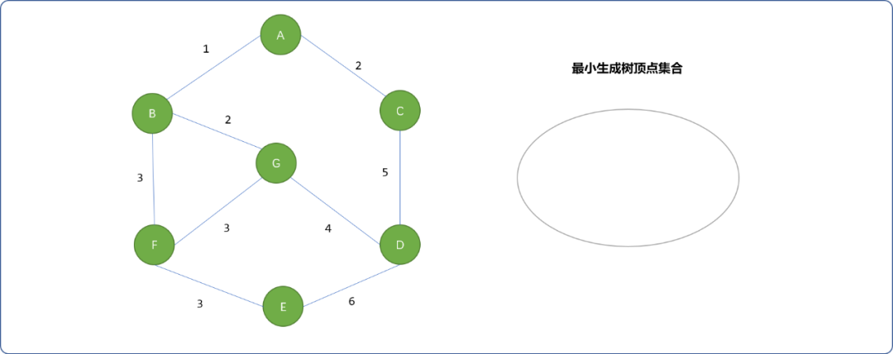

显然，在把图中的顶点加入到最小生成树顶点集合时，是不能把同一个顶点加入 `2` 次的。并查集可以做到这点。

> **Tips：那么，如何保证操作过程中顶点选择的唯一性?**
>
> 算法使用了并查集思想。如果对并查集不是很了解，可以翻阅我的相关博文。

**好！现在演示一下`kruskal`算法的流程。**

- 把图中的`边`按权重由小到大进行有序排列，且把每一个顶点当成一个独立的集合。如下图所示。

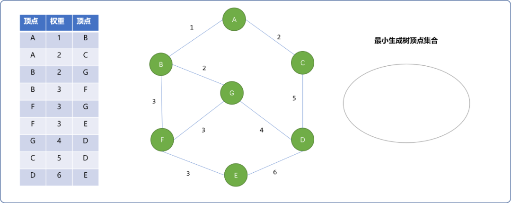

- 贪心思想：选择权重最小的值为`1`的`边(A,B)` 加入到最小生成树集合中。

  并查集思想：刚开始，`A`和`B` 两顶点不在同一集合，`A`和`B`合并。

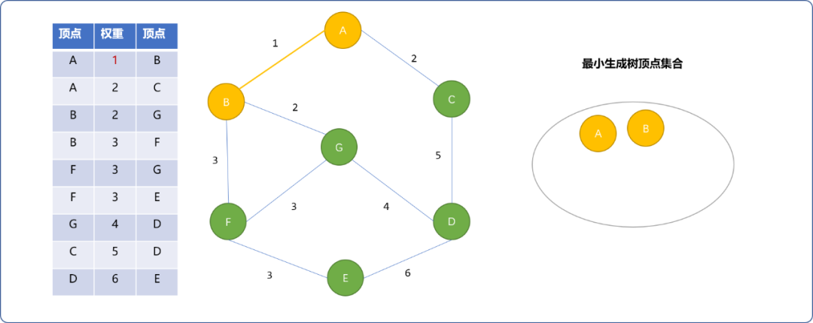


- 现在权重为`2`的边有`(A,C)`和`(B,G)`，选择`(A,C)`边。`C`不在最小生成树顶点集合中，可以加入。

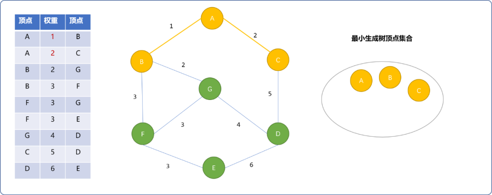


- 再选择`(B,G)`。`B`在最小生成树顶点集合中，`G`不在，分属`2`个不同集合，将`G`加入。

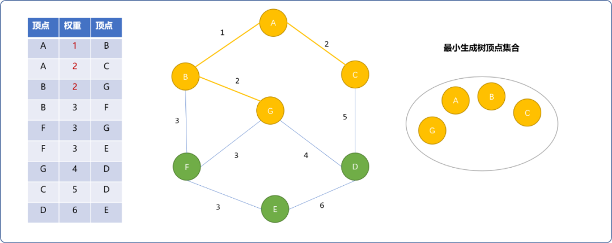


- 权重为`3`的边有 `3` 条。选择`(B,F)`。如下图，`F`加入最小生成树。

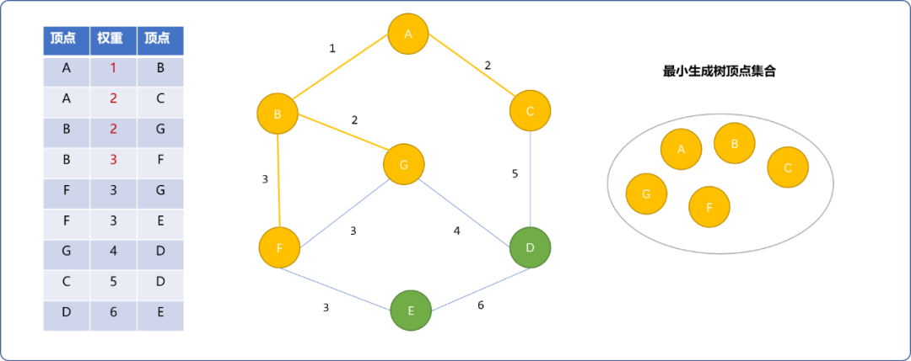


- 权重为`3`的`(F,G)`边不能选择。因为`F`、`G`已经在同一个集合中。选择`(F,E)`，`E`加入最小生成树集合中。

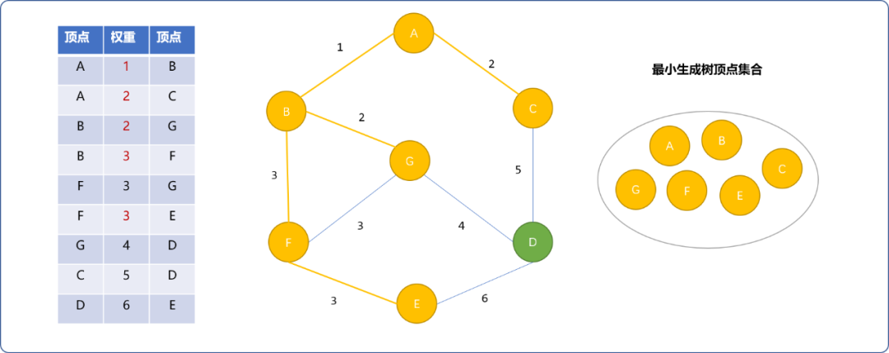


- 继续选择权重值为`4`的`(G,D)`边。`D`可以加入最小生成树。之后，因为`C、D、E`已经存在于最小生成树中，`(C,D)`和`(D,E)` 边不能加入集合中。至此，最小生成树已经完成，且最小生成树的权重之和为`15`。

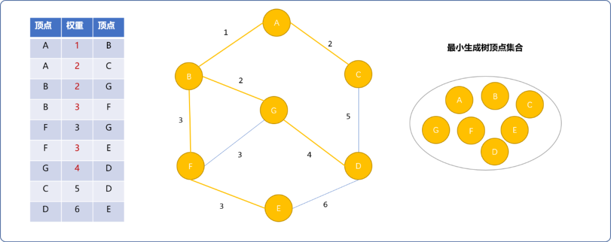


### 2.1 编码实现

为了让算法具有通用性，下面使用`OOP`组织代码。程序中有 `2` 个核心`类`：

- 树类。
- 并查集类。

除此之外，还有辅助类。

#### 2.1.1 树类实现

描述树结构。算法中要用到并查集数据结构，并查集是基于树单位的数据结构。

**顶点类：** 用来描述树或图的顶点结构。

```cpp
#include <iostream>
#include <map>
#include <vector>
#include <queue>
using namespace std;
/*
*顶点类型
*/
template<typename T>
struct Vertex {
 //编号
 int code;
 //值
 T value;
 //前驱(父)指针
 Vertex<T>* preVertex;
 //无论是图，还是树，都有多个后驱（子）结点
 map<Vertex<T>*,int> childs;
 Vertex() {
  this->code=-1;
  this->preVertex=NULL;
 }
 Vertex(int code,T value) {
  this->code=code;
  this->preVertex=NULL;
  this->value=value;
 }
 /*
 * 添加子结点及与其权重
 */
 Vertex<T>* addChild(Vertex<T>* vertex,int weight=1) {
  this->childs[vertex]=weight;
 }
 /*
 *重载 == 运算符
 */
 bool operator==(Vertex<T>* vertex) {
  return this->code==vertex->code && this->value==vertex->value;
 }
 /*
 *重载 < 运算符
 */
 bool operator<(Vertex<T>* vertex) {
  return this->code<vertex->code;
 }
 /*
 *输出结点信息
 */
 int desc() {
  cout<<"结点名称："<<this->value<<endl;
  typename::std::map<Vertex<T>*,int>::iterator begin=this->childs.begin();
  typename::std::map<Vertex<T>*,int>::iterator end=this->childs.end();
  if(begin==end)cout<<"\t叶结点"<<endl;
  int weight=0;
  //查找子结点
  while(begin!=end) {
   Vertex<T>* child=begin->first;
   cout<<"\t子结点名称："<<child->value<<"权重："<<begin->second<<endl;
   weight+=begin->second;
   begin++;
  }
  return weight;
 }
};
```

**树类：** 提供维护树顶点的函数。

```cpp
template<typename T>
class Tree {
 private:
  //根结点
  Vertex<T>* root=NULL;
  //存储所有结点
  vector<Vertex<T>*> vertexs;
  //大小
  int size=0;
  //树的权重之和
  int totalWeight=0;
 public:
  Tree() {
  }
  Tree(Vertex<T>* root) {
   this->setRoot(root);
   this->vertexs.push_back(this->root);
  }
  Tree(T val) {
   //编号从 1 开始
   this->size++;
   this->root=new Vertex<T>(this->size,val);
   this->vertexs.push_back(this->root);
  }
        //重置根结点
  void setRoot(Vertex<T>* root) {
   this->root=root;
  }
  /*
  *返回根结点
  */
  Vertex<T>*  getRoot() {
   return this->root;
  }
  /*
  *返回树中所有结点
  */
  vector<Vertex<T>*> getVertexs() {
   return this->vertexs;
  }
  /*
  *根据值查找结点是否存在
  */
  Vertex<T>* findVertex(T value) {
   for(int i=0; i<this->size; i++) {
    if(this->vertexs[i]->value==value )return this->vertexs[i];
   }
   return NULL;
  }
  /*
  *查找结点是否存在
  */
  Vertex<T>* findVertex(Vertex<T>* ver) {
   for(int i=0; i<this->vertexs.size(); i++) {
    if(this->vertexs[i]==ver )return this->vertexs[i];
   }
   return NULL;
  }

  /*
  * 根据节点值返回此树的根节点
  * 算法中，需要根据元素得知其所在的树
  * 根结点是每一棵树的唯一标志符
  */
  Vertex<T>* getRoot(T value) {
   if(this->findVertex(value)!=NULL)return this->root;
  }
  /*
  *添加结点
  */
  bool addVertex(Vertex<T>* ver) {
   if( this->findVertex(ver)==NULL) {
    //没有，添加
    this->vertexs.push_back(ver);
    //成功
    return true;
   }
   return false;
  }
  /*
  *合并另一颗树中的结点
  */
  void unionTree(Tree<T>* tree) {
   //另一棵树的所有结点
   vector<Vertex<T>*> vers=tree->getVertexs();
   for(int i=0; i<vers.size(); i++)
    //合并
    this->vertexs.push_back(vers[i]);
   //修改数量
   this->size+=vers.size();
  }
  /*
  *显示树中所有结点
  */
  void showAll() {
   cout<<"------------树 "<<this->root->value<<"------------"<<endl;
   for(int i=0; i<this->vertexs.size(); i++) {
    this->totalWeight+=this->vertexs[i]->desc();
   }
   cout<<"------------最小生成树的权重 "<<this->totalWeight<<"------------"<<endl;
  }
};
```

#### 2.2.2 实现`kruskal`算法

本质是使用并查集合并指定边两端的顶点。

```cpp
//描述图中顶点与顶点之间的关系
template<typename T>
struct Edge {
 T from;
 T to;
 int weight;
};
/*
* Kruskal 算法
*/
template<typename T>
class Kruskal {
 private:
  //集合群（森林）
  map<Vertex<T>*,Tree<T>*> trees;
  //森林中树的数量
  int size;
 public:
  /*
  *构造集合（森林）群
  */
  Kruskal(T datas[],int size) {
   this->size=size;
   this->initSets(datas);
  }
  /*
  *初始化森林
  */
  void initSets(T datas[]) {
   for(int i=0; i<this->size; i++ ) {
    //创建只有根结点的树
    Tree<T>* tree=new Tree<T>(datas[i]);
    //存入集合群
    this->trees[tree->getRoot()]=tree;
   }
  }
  /*
  * 通过节点值查找其所在的树(集合)
  * 返回树的根结点（唯一标志符）
  */
  Vertex<T>* find(T value) {
   typename::std::map<Vertex<T>*,Tree<T>*>::iterator begin=trees.begin();
   typename::std::map<Vertex<T>*,Tree<T>*>::iterator end=trees.end();
   while(begin!=end) {
    Tree<T> *tree=begin->second;
    Vertex<T>* root=tree->getRoot(value);
    if(root!=NULL)return root;
    begin++;
   }
   return NULL;
  }
  /*
  *合并树
  */
  bool unionSet(T from,T to,int weight=1) {
   Vertex<T>* root =this->find(from);
   Vertex<T>* root_ =this->find(to);
            //同一棵树
   if(root==root_)return false;
   Vertex<T>* ver=this->trees[root]->findVertex(from);
   Vertex<T>* ver_=this->trees[root_]->findVertex(to);
             //合并两个顶点
   ver->addChild(ver_,weight);
   //合并树
   this->trees[root]->unionTree(this->trees[root_] );
   //删除
   this->trees.erase(root_);
   this->size--;
  }
  /*
  *查找最小生成树
  */
  void kruskal_(Edge<T> relation[]) {
   for(int i=0; i<sizeof(relation)/sizeof(T); i++) {
    this->unionSet(relation[i].from,relation[i].to,relation[i].weight);
   }
  }
  /*
  *输出最小生成树
  */
  void showAllTree() {
   typename::std::map<Vertex<T>*,Tree<T>*>::iterator begin=trees.begin();
   typename::std::map<Vertex<T>*,Tree<T>*>::iterator end=trees.end();
   while(begin!=end) {
    Vertex<T>* root=begin->first;
    Tree<T> *tree=begin->second;
    tree->showAll();
    begin++;
   }
  }
};
```

**测试：** 简化了图的描述，直接提供已经排序的信息，测重测试算法设计是否准确。

```cpp
int main(int argc, char** argv) {
 char datas[7]= {'A','B','C','D','E','F','G'};
    //硬代码，对图中的边按权重由小到大排序
 Edge<char> relations[9]= { {'A','B',1}, {'A','C',2},{'B','G',2},{'B','F',3},{'F','G',3},{'F','E',3},{'G','D',4},{'C','D',5},{'D','E',6} };
    //初始算法
 Kruskal<char> kruskal(datas,7);
 kruskal.kruskal_( relations);
 kruskal.showAllTree();
 return 0;
}
```

输出结果：和前文演示结果一致。

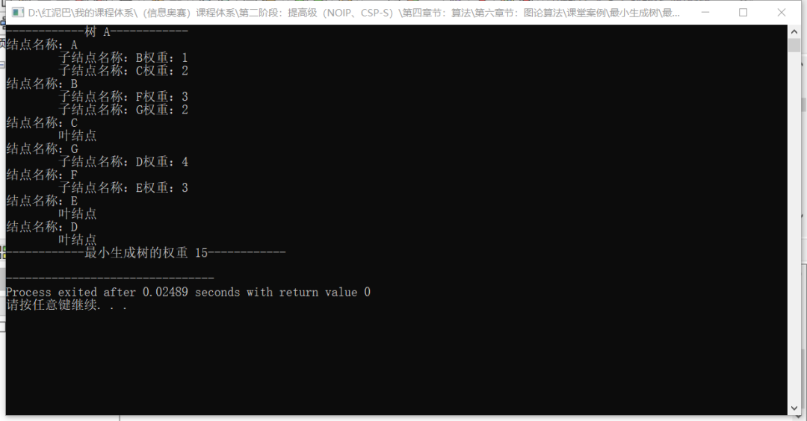


## 3. `Prim(普里姆)` 算法

`Prim`算法核心也是贪心思想，算法流程类似于最短路径算法`Dijkstra`算法。

相比较于`kruskal`，前者基于静态信息（提前对边按权重排序），后者基于动态信息（由优先队列随时调整）。

### 3.1 算法流程

如查询如下`图结构`的`最小生成树`。

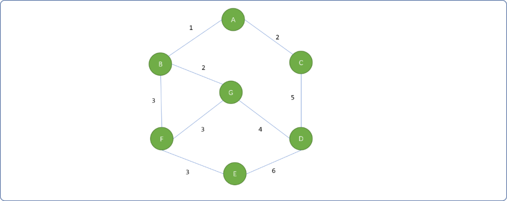


- 任意选择一顶点，如`A`。然后把与此顶点相邻的边`(A,B,1)、(A,C,2)`压入到`优先队列`中，优先队列以边的权重`小`为优先。如下图所示。

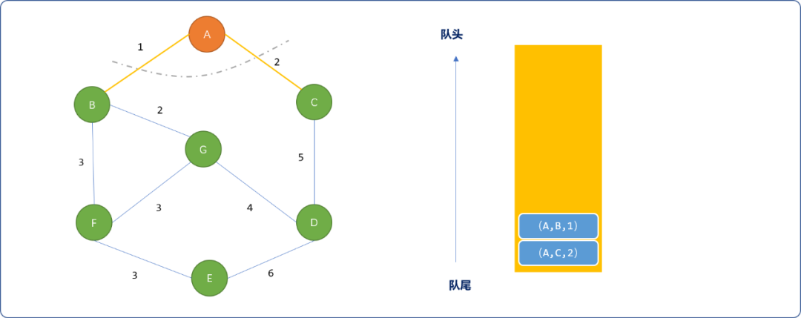


- 从优先队列中选择`(A,B,1)`这条边，检查边两端的顶点是否已经被选择，选择`B`顶点。然后把`B`相邻的邻接边`(B,G,2)、(B,F,3)`压入到优先队列。

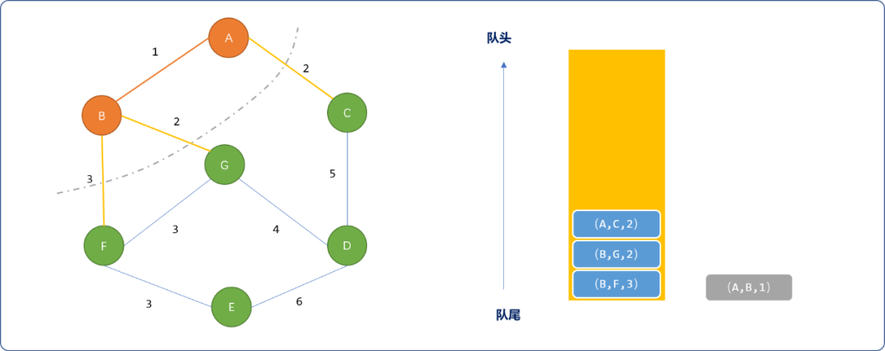


- 从队列中选择`(A,C,2)`边，选择`C`顶点，且把`C`相邻边`(C,D,5)`压入队列。

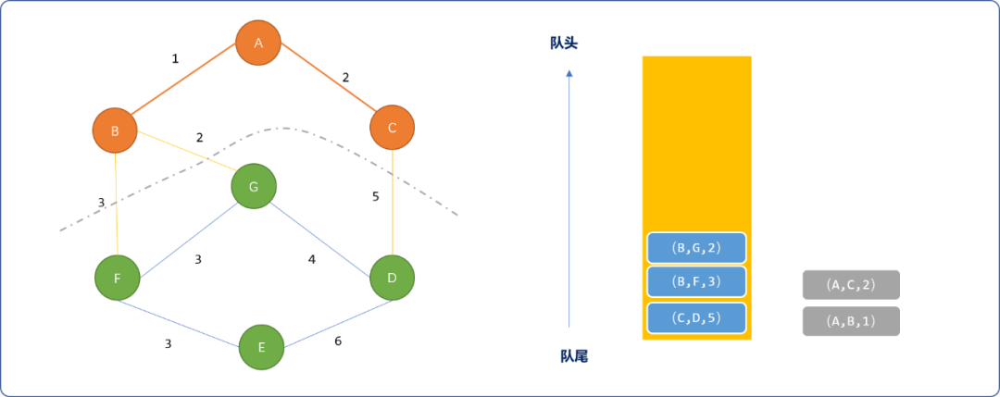


- 选择`（B,G,2）`边，选择`G`顶点，且把`(G,F,3)、(G,D,4)`压入队列。

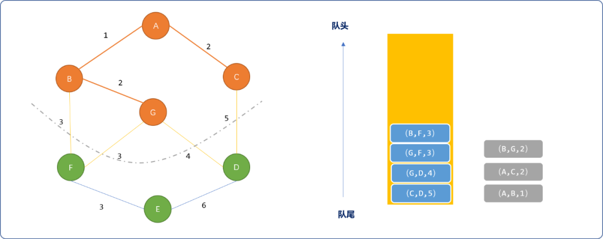


- 从队列中选择`(B,F,3)`，选择`F`顶点，且压入`(F,E,3)`边。

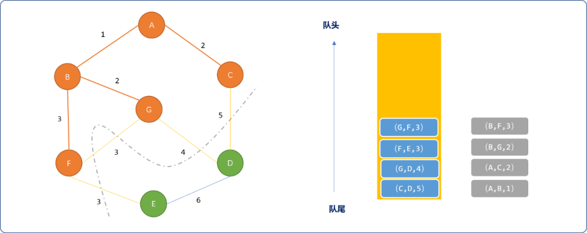


- 选择`(G,F,3)`边，因边两端顶点都已经选择，再选择`(F,E,3)`边，选择`E`顶点，且把`(E,d,6)`压入队列。

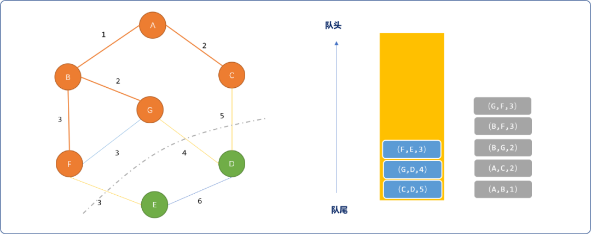


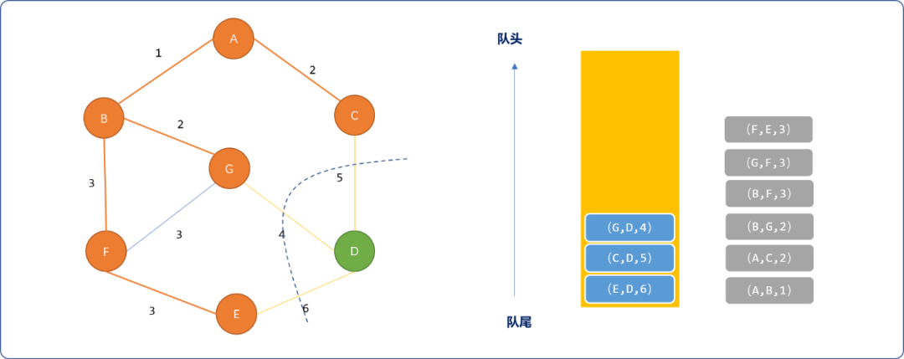


- 最后选择`(G,D,4)`，选择`D`顶点，完成最小生成树。

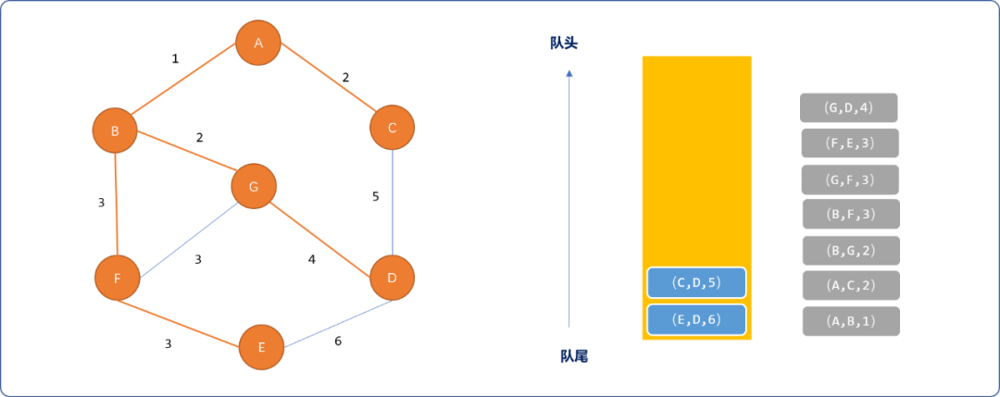


### 3.2 编码实现

`顶点类`和`树类`和前面的`kruskal`算法一样。

因为需要动态获取边的权重，对`边类`升级：

```cpp
template<typename T>
struct Edge {
 Vertex<T>* from;
 Vertex<T>* to;
 int weight;
 Edge() {}
 Edge(Vertex<T>* from,Vertex<T>* to,int weight) {
  this->from=from;
  this->to=to;
  this->weight=weight;
 }
    /*
    * 用于优先队列的比较法则
    */
 bool operator() (Edge<T>* v1, Edge<T>* v2) {
  //由小到大排列
  return v1->weight > v2->weight;
 }
};
```

`Prim` 算法类：

```cpp
/*
*算法类
*/
template<typename T>
class Prim {
 private:
  //优先队列容器
  priority_queue<Edge<T>* ,vector<Edge<T>*>,Edge<T> > priorityQueue;
  //图的顶点
  map<int,Vertex<T>*> graph;
  //图的邻接矩阵
  int** martix;
  //图的顶点数量
  int size;
  //最小生成树
  Tree<T>* tree;
 public:
  /*
  *构造函数
  */
  Prim(T data[],int** martix) {
   this->size= sizeof(data)/sizeof(T);
   //初始化图顶点
   for(int i=1; i<this->size; i++ ) {
    Vertex<T>* ver=new Vertex<T>(i,data[i]);
    this->graph[ver->code]=ver;
   }
   //初始化最小生成树
   this->tree=new Tree<T>( this->graph[1]);
            //图的邻接关系
   this->martix=martix;
  }
  /*
  *查找与某顶点邻接的边,并压入队列中
  */
  void pushQueue(Vertex<T>* ver) {
   int row=ver->code;
   Vertex<T>* to=NULL;
   for(int i=1; i<this->size; i++) {
    if(this->martix[row][i]>0) {
     to=this->graph[i];
     Edge<T>* edge=new Edge<T>(ver,to,this->martix[row][i]);
     //添加边至队列
     this->priorityQueue.push(edge);
                     //标志已经使用
     this->martix[row][i]=0;
    }
   }
  }
  /*
  *核心
  */
  void prim() {
   //得到最小生成树的根结点
   Vertex<T>* from= this->tree->getRoot();
   //找到邻接边
   this->pushQueue(from);
   while( !this->priorityQueue.empty() ) {
    //边出队列
    Edge<T>* edge = this->priorityQueue.top();
    this->priorityQueue.pop();
    //把结点添加至树中
    if(this->tree->addVertex(edge->from)) {
                      //查找相邻边
     this->pushQueue(edge->from);
    }
    if(this->tree->addVertex(edge->to)) {
     this->pushQueue(edge->to);
     edge->from->addChild(edge->to,edge->weight);
    }
   }
  }
  void showTree() {
   this->tree->showAll();
  }
};
```

**测试**

```cpp
int main(int argc, char** argv) {
 char datas[8]= {'0','A','B','C','D','E','F','G'};
 //邻接矩阵存储顶点之间的关系
 int** martix=new int*[8];
 martix[0]=new int[8] {0,0,0,0,0,0,0,0};
 martix[1]=new int[8] {0,0,1,2,0,0,0,0};
 martix[2]=new int[8] {0,1,0,0,0,0,3,2};
 martix[3]=new int[8] {0,2,0,0,5,0,0,0};
 martix[4]=new int[8] {0,0,0,5,0,6,0,4};
 martix[5]=new int[8] {0,0,0,0,6,0,3,0};
 martix[6]=new int[8] {0,0,3,0,0,3,0,3};
 martix[7]=new int[8] {0,0,2,0,4,0,3,0};
 Prim<char> prim(datas,martix);
 prim.prim();
    cout<<"Prim 最小生成树算法"<<endl;
 prim.showTree();
 return 0;
}
```

**输出结果：**

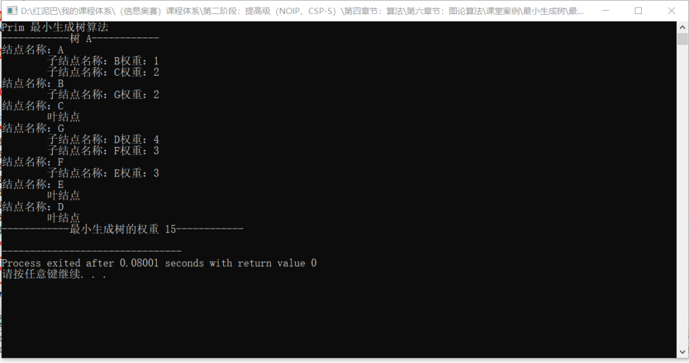


## 4. 总结

`kruskal`和`Prim`算法同工异曲。都是使用贪心思想，保证在构建最小生成树时，每次获得到的权重都是最小的。区别再于，`kruskal`使用并查集保证顶点唯一性，`Prim`使用广度优先搜索。


一枚大果壳

![赞赏二维码](https://mp.weixin.qq.com/s?__biz=MzU2NDgzNjgzNw==&mid=2247488092&idx=1&sn=ec5a14befb93f5dfa043796c16d4bcf4&chksm=fc45b2d6cb323bc0855d0d3a8595f9f9c922becf9cb66fbad42090d672f298940cc79b1c6c6e&scene=126&sessionid=1729004179&subscene=7&clicktime=1729005430&enterid=1729005430&key=daf9bdc5abc4e8d0aef118d63bbfa3d342aaf50a65d70ba21ec5377416cc894e17d78ae7fb17057cf551a33d045620e5f23e9487a95bfd0c270c910d062c364418baae4a1f3183c8c1e3546486c8674aeaa2ff35133c1e27eb48dfe733f2ad792e58a2f7ff619fbcb59d51cbd22bc464040424791e5957d4b161c5a37bd9e350&ascene=0&uin=NjUxMzM2MTA4&devicetype=Windows+10+x64&version=63090c11&lang=zh_CN&countrycode=CN&exportkey=n_ChQIAhIQ0GjGbwOIgJs8j8p2MikV2BLmAQIE97dBBAEAAAAAACzUBqyYOBgAAAAOpnltbLcz9gKNyK89dVj0LEQ1GZcTC66JPwRHJZcK3MskLTkzCOE0rNARBs0DnKplPtojqXv6u0J5bS8Dcl14VUYUqEGOV27fy9IQ6MC6NjuMo9ZBC7wsIrf%2BjsWabwfGyfMeSN3cOPee4Zp7sXN2kxyoMwdU9C3KFGq%2BkpfNmTQwas6vmOys8yn5awt67b4OrOozPCWuo%2F1pygluCBL3Asqjt65BmCpbBuSLf7BBXsys09R0Myc3fnA3iwe9D4WH65yzX2go79BGSRYRKRlo&acctmode=0&pass_ticket=yzsqgICO875op3wDXbcMv9hdYhQo0jPn4jQOdvh%2Bm1JQMo6LTjxGxruOIeIQX%2BPe&wx_header=1&fasttmpl_type=0&fasttmpl_fullversion=7428020-zh_CN-zip&fasttmpl_flag=1)[钟意作者](javascript:;)

阅读 126


编程驿站

272

[发消息](javascript:;)

