# C++ 图论之次最小生成树


## 1. 前言

生成树指在无向图中找一棵包含图中的所有节点的树，此树是含有图中所有顶点的无环连通子图。对所有生成树边上的权重求和，权重和最小的树为最小生成树，次小的为次最小生成树。

最小生成树和次最小生成树的应用领域都较广泛。也是图论中优为重要的研究对象，求解算法也是常规必须掌握的算法之一。最小生成树的算法主要是`kruskal（克鲁斯卡尔）`和`Prim `算法，求解次最小生成树时也是基于这两种算法，在此之上略做些变化。

## 2. 次最小生成树算法

### 2.1 完全穷举法

基本思想，先找出无向图中的最小生成树，依次删除最小生成树上的一条边，再在图中找最小生成树，会得到值不同的最小生成树，取权重和最小的即次最小生成树。

流程如下：

- 首先在图中找到最小生成树，如下图红色标记的边所组成的树，其权重和为 `30`。

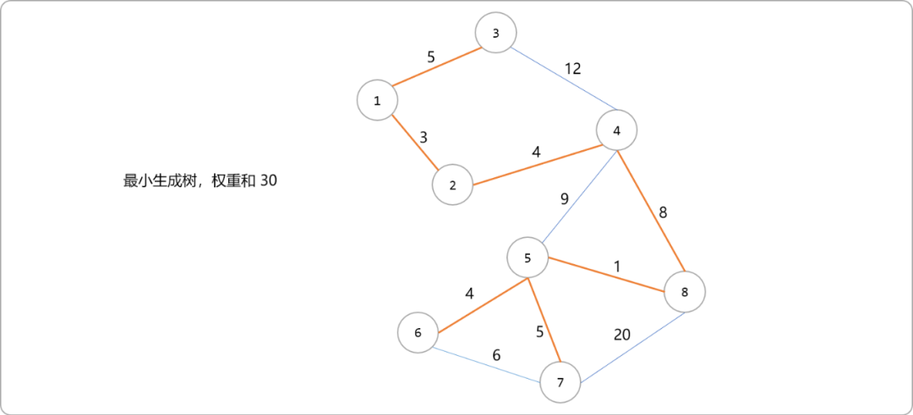

- 从最小生成树中删除一条边，然后再在图中查找最小生成树。

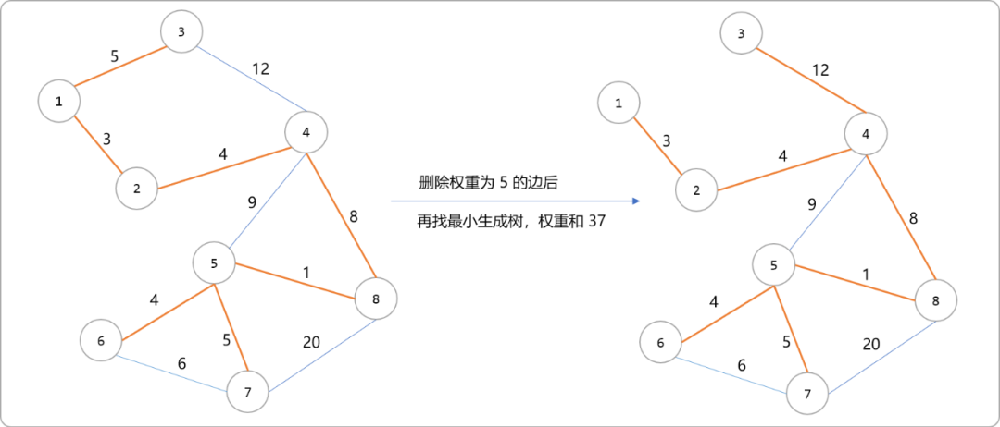

- 重复上述流程，从而找到次最小生成树。如下图为删除权重为`3`的边和权重为`4`的边后的最小生树的权重和。

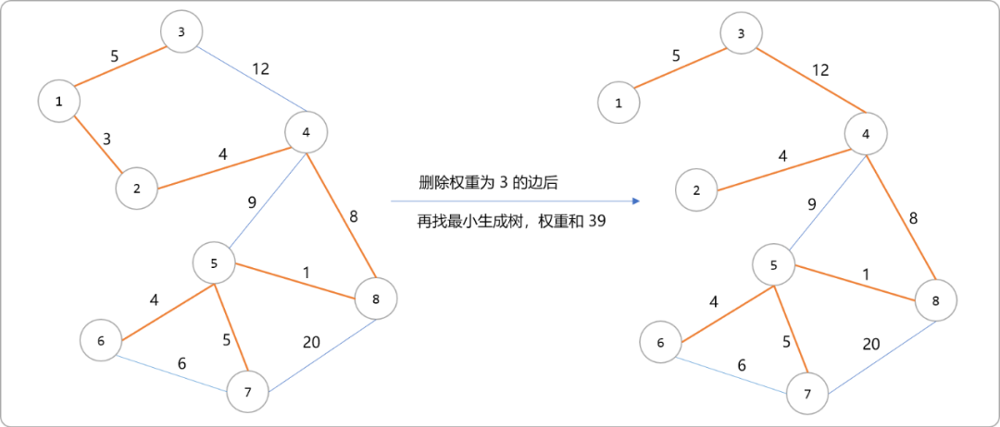

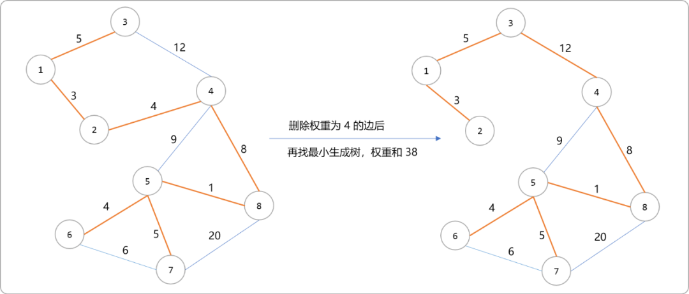

- 如下为次最小生树。

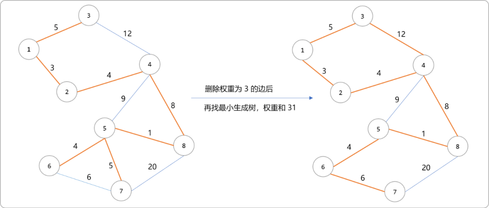

时间复杂度分析。

`prim`最小生成树算法的时间算法度（n表示节点数，`e`表示边数）：

- 邻接矩阵`O(n`2`)`。
- 邻接表 `O(elog`2`n)`。

则基于`prim`的次最小生成树的时间复杂度为：

- 邻接矩阵`O(n`3`)`。
- 邻接表 `O(nelog`2`n)`。

完全暴力穷举法的时间复杂度较高，算是一种思路，但绝对不适用。

### 2.2 先添后删

基本思想，使用`prim`或者`kruskal`算法找出最小生成树。则图上的边分属于两个集合，最小生成树集合（下称 `t`）和非最小生成树集合(下称` t1`)。如下图，红色的边是最小生成树上的边，蓝色边为非最小生成树上的边，或者说是被排除的边。


最小生成树和次最小生成树的权重的差异一定是一对边的差异，这一对边中的一条在`t`上，一条在`t1`上。可以把最小生成树和上文使用穷举法找出来的次最小生成权做对比。

也就是一旦把最小生成树`(5,7,5)`这条边换成`(6,7,6)`这条边，便找到了次最小生成树。当然，当前是在已知情况推导结论，过程是需要算法来支撑。

> **Tips：** `(5,7,5)`其中的第一个和第二个数字表示节点编号 ，第三个数字表示连接第一个和第二个节点的边的权重。

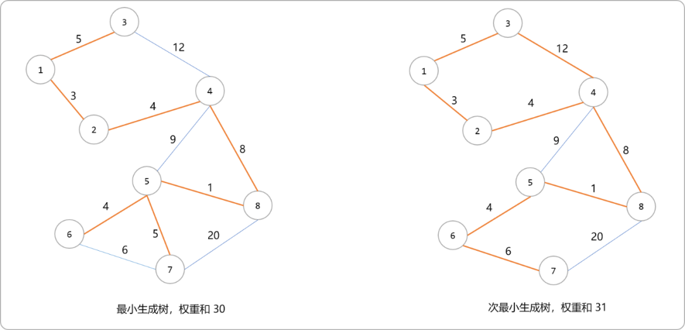

先添后删算法的基本原则：就是用`t1`中的边替换`t`中的边。

显然，替换要讲究策略。比如说`(3,4,12)`是`t1`上的边，具体应该替换`t`上的那一条边？如果逐一替换，除了时间复杂度也会较高，也会面临一个问题，不是每一次替换后会重新得到一棵树。

先添后删是有策略的。

- 如下图，先从`t1`集合中找出`(3,4,12)`的边，并添加到最小生成树上。这时发现`1,2,3,4`四个节点构建成了一个环（回路）。原理很简单，在树上的非边上的任意两点间连一条线，都将会出现经过这两点的环。

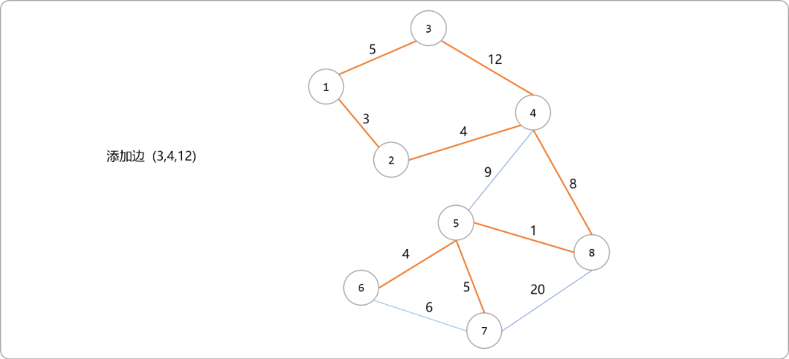

- 添加完毕，需从环上删除一条边，只有这样，方能重新变成树。删除策略，把环上除了新添加边之外权重最大的边删除。如下图，删除环上权重为`5`的边。

  **删除后新树的权重和=原最小生成树权重和+新添加的边的权重-删除的边的权重。**

  如下图，`权重和为=30+12-5=37`。原最小生树的权重和是固定的，所以我们要找的是`新添加的边的权重-删除边的权重`值（增量）最小的那次替换。

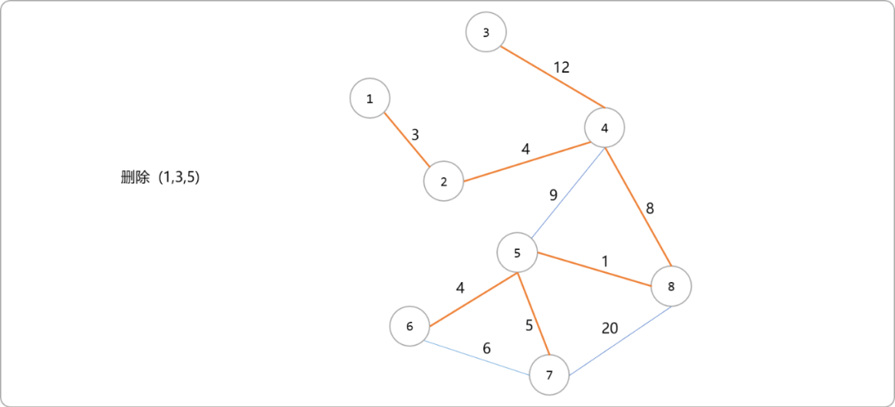

- 有了方向后，完成所有的替换过程，并且查找此过程中增量值最小的那次替换。如下图是添加 `(4,5,9)`，删除`(4,8,8)`，增量=`9-8=1`。

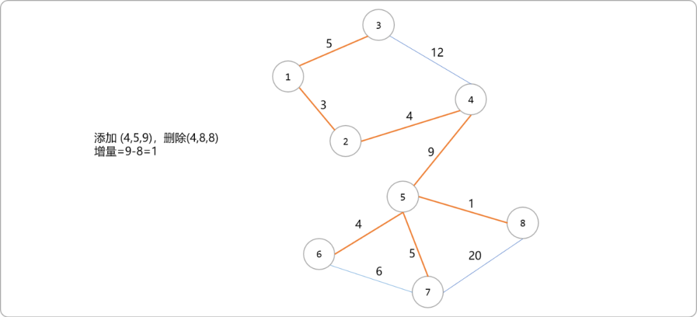

- 如下图是添加` (7,8,20)`，删除`(5,7,5)`,增量`=20-5=15`。

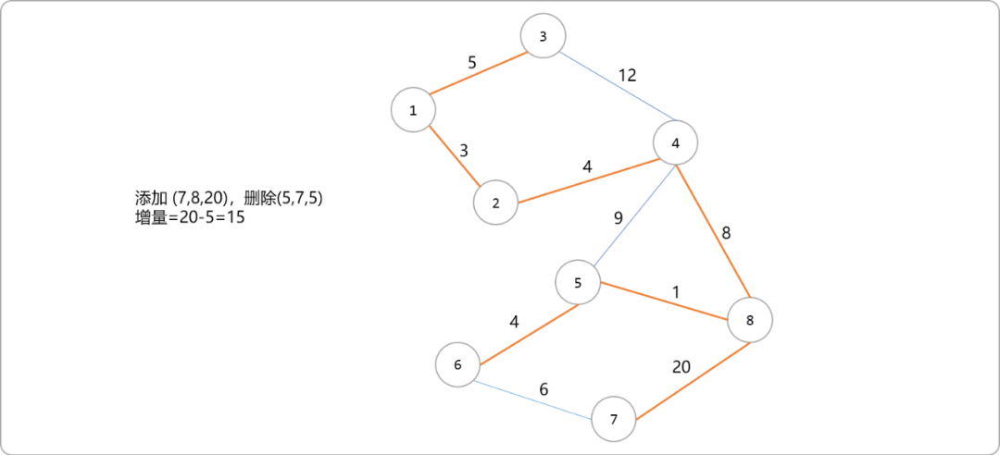

- 下图是添加 `(6,7,6)`，删除`(5,7,5)`，增量`=6-5=1`。

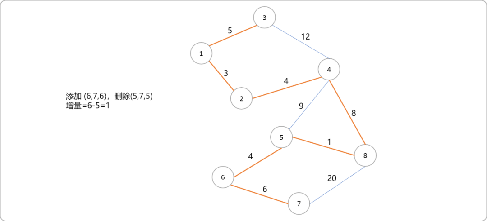

通过推导得知，次最小生成树的权重和为`31`。

如果是求严格的次小生成树的，在环路去边的步骤中，如果回路中除当前边之外权值最大的边的权值等于当前边的权值，那就去掉回路中除当前边之外权值第二大的边。

### 2.3 编码中的难点

求解次最小生成树，需要先求解最小生成树，这个简单，使用`prim`或者`kruskal`算法便可。摆在面前的主要问题是，在添加一条边后所构建成的环上，如果找到权重最大的边，并删除它。

这里使用动态规划思想，记录最小生成树上任意两点间权重最大的边。

- 构建名为`dp` 的矩阵。行号`i`和列号`j`表示最小生成树上任意两点的编号。值为两点间权重最大的边的值。

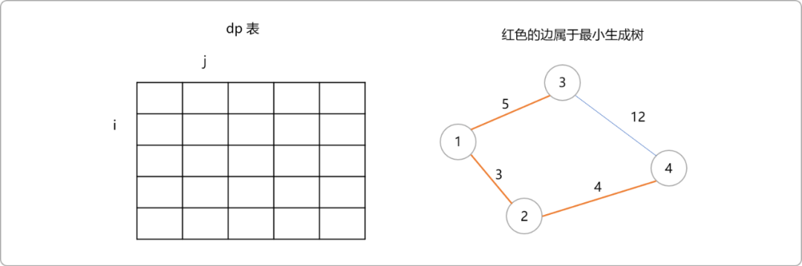

- 推导动态转移方程式。按`prim`算法思路，绘制出最小生成树上每一边出现的顺序。如下图所示，当选择了`3`号节点后，`dp[1][3]`和`dp[1][2]`的值可以很容易推导出来。`dp[2][3]`的值直观上也可以得到，在 `dp[1][3]`和`dp[1][2]`中选择值较大即可。

  > Tips：`1`号节点的父节点编号设为`0`。

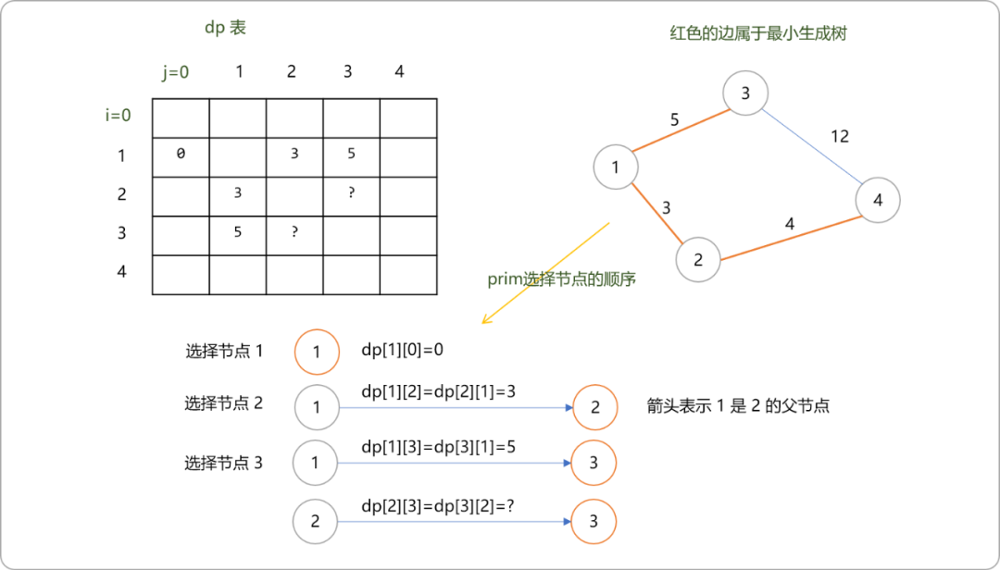

- 那么通用的动态转移方程式应该如何书写？

  把求解`dp[2][3]`的值分成两段来求。

  节点`1`是节点`3`的父节点，节点`3`被选择出来后，它与父节点的权重是可知，即为`5`，再求父节点`1`和节点`2`之间的最大权重边的值（树是连通的，节点 `3` 一定是可以通过父节点到达 `2`节点）。再在两者中取最大值。说起来有点绕口，看一下图解。

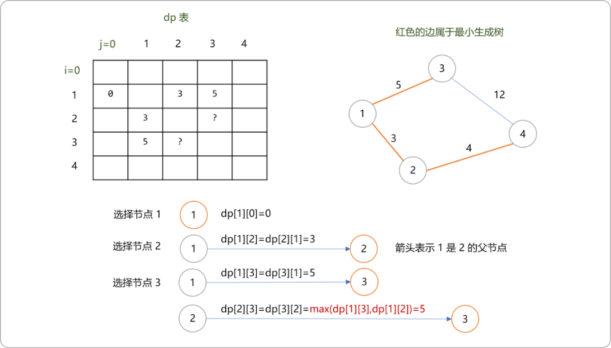

- 可以得到通用的转移方程式，`dp[i][j]=max(dp[i][i父节点],dp[i的父节点][j])`。

具体代码：

```cpp
#include <bits/stdc++.h>
using namespace std;
const int INF=999;
//矩阵
int  graph[100][100];
//动态规划表
int maxWeight[100][100];
//  i - j 边是否是在树上还是在非树上
bool used[100][100];
//前驱
int pre[100];
//距离
int dis[100];
//节点是否访问，构建最小生成树的过程中使用
int vis[100];
//点数，边数
int n,m,minWeight=0;

fstream cin_;

void init() {
 for(int i=1; i<=n; i++) {
  for(int j=1; j<=n; j++) {
   maxWeight[i][j]=0;
   used[i][j]=0;
   if(i==j)graph[i][j]=0;
   else graph[i][j]=INF;
  }
 }
}
void read() {
 int f,t,w;
 for(int i=0; i<m; i++) {
  cin>>f>>t>>w;
  graph[f][t]=graph[t][f]=w;
 }
}
//最小生成树
void prim(int start) { //start=1
 //初始化 dis 存储其它节点到 start（1） 节点的权重（距离）
 for(int i=1; i<=n; i++) {
  dis[i]=graph[start][i];
  //所有节点的父节点都是 start
  pre[i]=start;
 }
 // 确定第一个节点
 vis[start]=true;
 pre[start]=0;
 //找 n-1 次
 for(int j=0; j<n-1; j++) {
  int minVal,pos;
  minVal=INF;
  pos=-1;
  //找最小值 dis
  for(int i=1; i<=n; i++) {
   if( vis[i]==0 && dis[i]<minVal ) {
    minVal=dis[i];
    pos=i;
   }
  }
  //
  vis[pos]=true;
  minWeight+=dis[pos]; //minVal ===dis[pos]
  //边置为访问
  used[pos][ pre[pos] ]=  used[ pre[pos]  ][ pos ]=1;
  //pos 激活点  -->点之间
  for(int i=1; i<=n; i++) {
   if(vis[i]==1 ) {
    //分成两段，先求自己和父节点的权重，再求父节点到指定节点的最大权重
    maxWeight[pos][i]= maxWeight[i][pos]=max( dis[pos],maxWeight[i][ pre[pos]  ]  );
   }

   if( vis[i]==0 && graph[pos][i]<dis[i] ) {
    dis[i]=graph[pos][i];
    pre[i]=pos;
   }
  }
 }
}
//次最小生成树
int ctree() {
 int val=INF;
 for(int i=1; i<=n; i++ ) {
  for( int j=i+1; j<=n; j++ ) {
   if( used[i][j]==0 &&  graph[i][j]!=INF ) {
    val=min (val,  minWeight+ graph[i][j]-maxWeight[i][j] );
   }
  }
 }
 return val;
}

int main() {
// freopen("min.in","r",stdin);
 cin.open("min.in",ios::in);
 cin>>n>>m;
 init();
 read();
 prim(1);
 cout<<minWeight<<endl;
 int res= ctree();
 cout<<res<<endl;
 return 0;
}
```

## 3. 严格次最小生成树

如果添加的边的权重和环上最大边的权重相同，这时删除最大边的权重和没有删除是没有区别的，或者说，这时得到的次最小生成树并不是严格前意义上的次最小生成树，得到的次最小生成树有可能和最小生成树是一样。

如何解决这个问题？

记录树上任意两点间的路径上的最大边权重值时，同时也记录第二大权重值。则`dp`二维数组需改成三维数组。

`dp[i][j][0]`缓存树上任意两点间的所有边中权重最大的值，`dp[i][j][1]`缓存所有边中权重第二大的值。

如下仅显示需要修改的代码。

```cpp
void prim(int start) { 
//……省略    
maxWeight[pos][i]= maxWeight[i][pos]=max( dis[pos],maxWeight[i][ pre[pos]  ]  );
    if( dis[pos]>maxWeight[i][ pre[pos][0] ){
     //第一大变成第二大
     maxWeight[pos][i][1]=maxWeight[pos][i][0];
     maxWeight[pos][i][0]=dis[pos];
    }else if(  dis[pos]>maxWeight[i][ pre[pos][1] )
         maxWeight[i][ pre[pos][1]= dis[pos];
//……省略
}   
int ctree() {
 int val=INF;
 for(int i=1; i<=n; i++ ) {
  for( int j=i+1; j<=n; j++ ) {
   if( used[i][j]==0 &&  graph[i][j]!=INF ) {
                 if(graph[i][j]-maxWeight[i][j][0]==0){
                     val=min (val,  minWeight+ graph[i][j]-maxWeight[i][j][1] );
                 }else{
                      val=min (val,  minWeight+ graph[i][j]-maxWeight[i][j][0] );
                 }
   }
  }
 }
 return val;
}
```

## 4.总结

在一棵树中，连接两个不在树上任意边两端的点，则会在这两个点之间形成一个环，然后通过最小生成树和次最小生成树的大小差异一定是一对边差异特性，很方便求解出最终答案。


