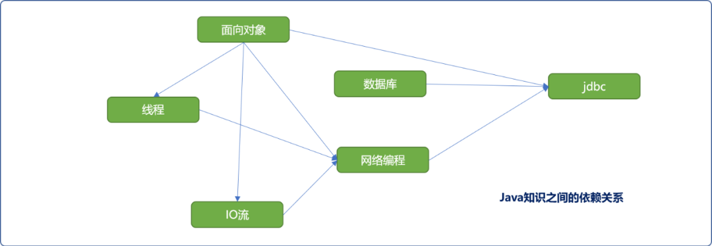
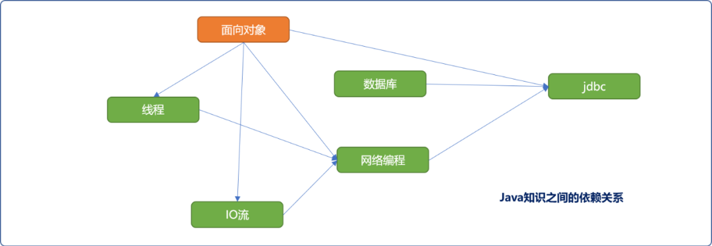
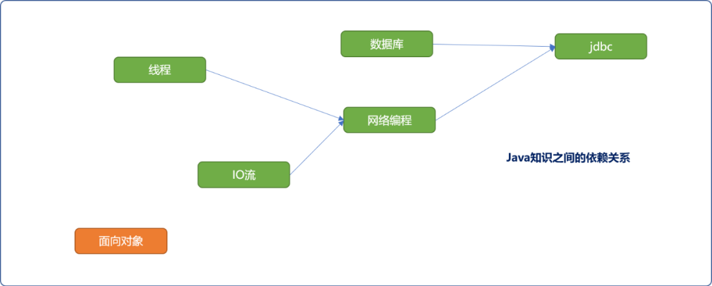
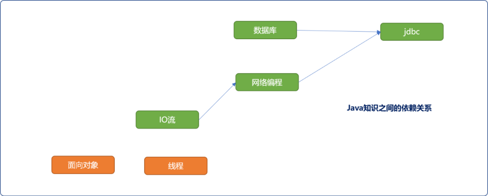
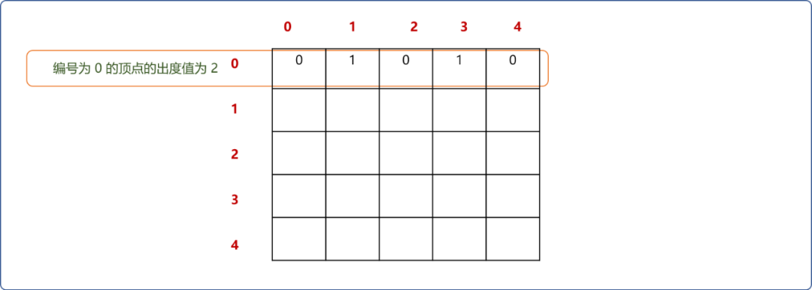
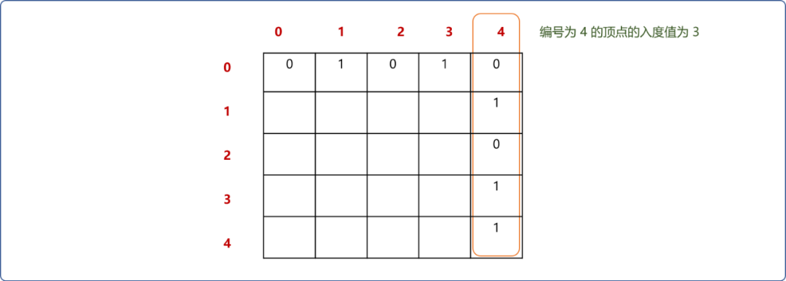
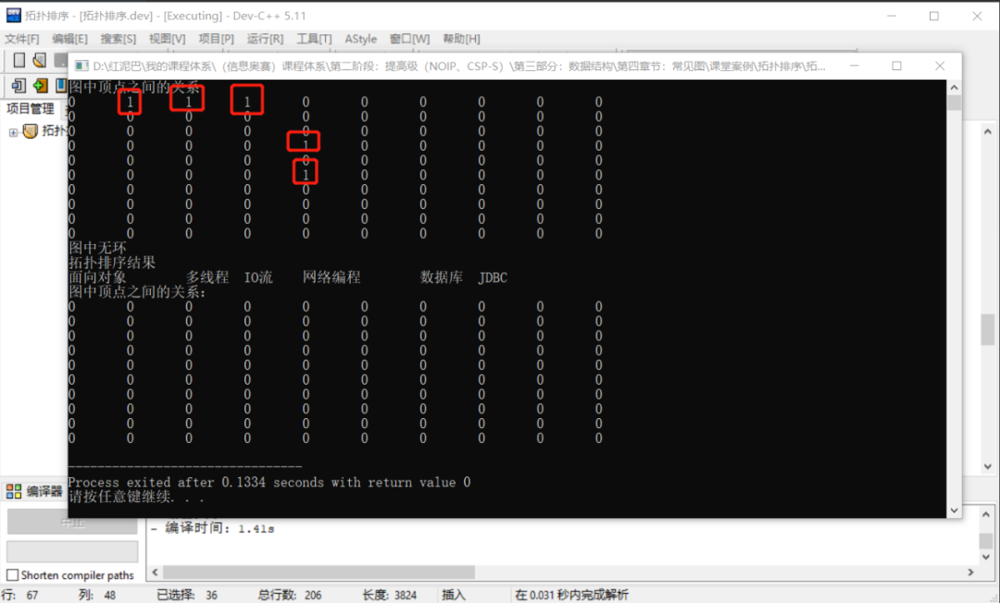

# C++ 图系列之有向无环图的拓扑排序算法


## 1. 前言

有向无环图，字面而言，指图中不存在`环(回路)`，意味着从任一顶点出发都不可能回到顶点本身。有向无环图也名为 `DAG（Directed Acycline Graph）`。

有向无环图可用来描述顶点之间的`依赖`关系，依赖这个概念在面向对象编程中经常出现。如使用`B`组件时，需要先有`A`组件，或说`B`组件依赖`A`组件，通俗言之，有`A`才有`B`。可用如下图描述。


在面向对象编程的场景中，组件之间的依赖关系链中不能出现环。如现有 `3` 个组件，`C`依赖`B`，`B`依赖于`A`。正确的图解应该如下图。


如果在 `A`和`C 之间`添加依赖，则会出现环，在面向对象中，称此种情况为循坏依赖，显然，会导致死锁，从而让程序崩溃。

如下图所示，如果图结构是用来描述面向对象中组件之间的依赖关系，则会出现逻辑悖论：

- 图示有`C`才有`A`、有 `A`才有`B`，有`B `才有 `C`。
- 这里就出现了先有鸡还是先有蛋的悖论问题。因为图中出现了 `A`依赖自己了的矛盾。


下文将深入讲解有向无环图的特点及应用。

## 2. AOV 网

任何的`逻辑结构`必须是特定应用场景下的语义描述，有向无环图也仅用顶点之间不能有环的场景之下。

如下图，使用有向无环图描述面向对象中组件的依赖关系，顶点与顶点之间的边（弧）描述了顶点（组件）间的制约关系。因有特定的语义环境要求，故，图中不能出现环。


`有向无环图`常用于描述`工程`或`系统`的内部组织结构。

现实生活中，一个工程（系统）可分解成诸多子工程（系统），且子工程之间存在彼此制约现象，即某一个子工程需要等待另一个子工程或多个子工程完成后方能进行，也可称为同步（前一个子工程的结束是后一个子工程的开始的前置条件）。当然，也会有些子工程是不依赖任何其它子工程，可称为异步（多个子工程可以同时进行）。

称遵循这种逻辑关系而构建的有向无环图为 `AOV（Activity On Vertex Network）`网。

在 `AOV`网中：

- 若从顶点 `i`到顶点 `j` 之间存在一条有向路径，称顶点 `i`是顶点 `j`的前驱。或称项点 `j`是顶点`i`的后继。
- 若`<i,j>`是图中的弧（子工程之间的制约关系），称顶点 `i`是顶点`j`的直接前驱，顶点 `j`是顶点`i`的直接后继。

当然，在`AOV`网中，人们关心的有 `2` 点：

- 工程能否顺利完成。即在设计分解子工程时，子工程之间的依赖顺序是否正确。
- 整个工程完成所需要的最短时间是多少。

这也是有向`无环图`需要提供的核心逻辑功能。

### 2.1 拓扑排序

`AOV`网这种逻辑结构在现实生活中比比皆是，如某个课程可以分成很多章节独立的知识块，其中一些知识块必需以另外一些知识块为前置条件。

如学习`JAVA`的`jdbc`知识时需要有`数据库基础`，同时也需对`网络编程`有所了解。而`网络编程知识`又需要有`多线程知识`和`IO流知识`为前提条件。除数据库外，所有知识需要有面向对象知识为前提条件。如下图所示：



**如何检查上图结构的正确性？**

衡量`AOV`网结构正确性的标准是必须保证 `AOV`网中不能出现回路，否则会出现自己依赖自己的悖论。

可以使用拓扑排序算法验证 `AOV`网结构的合理性。

**拓扑排序算法的思想：**

这里的排序并不是指递增或递减式的排序，而是通过算法把有向无环图中的顶点以线性序列方式输出。如果`AOV`网中的所有顶点都出现在它的线性序列中，则说明此 `AOV`网不存在环，或说拓扑排序算法可以检查图是否有环。

**一定要知道，针对于`AOV`网，拓扑排序的线性序列并不是唯一的。**

对上图`java`知识之间的`AOV`图，其拓扑排序的流程如下：

- 从`AOV`网中选择一个没有前驱或说入度为`0`的顶点。图中有`面向对象`和`数据库` `2` 个顶点可以选择。因拓扑排序的结果不是唯一的，出现同时多个可选顶点时，可自义优先级选择策略（如按顶点的编号顺序或字符串的字典顺序）。这里选择`面向对象`顶点。



- 从图中移出`面向对象`顶点，且删除与此顶点有关联的`边`。



- 继续选择入度为 `0` 的顶点。可供选择的有`线程、IO流、数据库 3`个顶点。这里选择线程，并删除与线程有关联的边。

  > Tip：当同时可供选择的顶点为多个，说明，此时顶点所代表的任务之间没有互相制约关系。所以，无论先执行哪一个任务都不会影响最终结果。



- 重复上述逻辑，直到图中所有顶点均被选择出来。如下图是拓扑排序算法的选择顺序之一。注意，顺序不是唯一的。


如果图中所有顶点都出现在线性序列中，则说明，图中知识之间的逻辑依赖关系是健康的（没有回路），否则表示`AOV`网的设计有问题。

拓扑排序算法并不关心最终顶点输出的顺序，仅在意是否能让所有顶点以线性方式输出。所以，拓扑排序即可以借助于队列也可以使用栈存储入度为 `0` 的顶点。

### 2.2 拓扑排序的实现

图的关系描述可以使用`邻接矩阵`和`邻接表`。本文将使用邻接矩阵的存储方式实现拓扑排序算法。

#### 2.2.1 邻接矩阵

使用`邻接矩阵`存储图中顶点的关系，可以很容易查询到与某个顶点的`入度`和`出度`数量。

- 以某个`项点`的编号为`行号`，与此行相交列中有值的单元格数量即为此顶点的出度数量。如下图，在`AOV`网中，可认为有另 `2` 个顶点依赖此顶点。



- 以某个顶点的编号为列号，与此列相交行中有值的单元格数量为此顶点的入度数量。如下图，可认为编号为 `4` 的顶点依赖另 `3` 个顶点。



利用邻接矩阵的上述特点，可服务于拓扑排序中查找入度为 `0` 的顶点。

**顶点类型：**

```cpp
#include <iostream>
#include <queue>
using namespace std;
/*
*顶点类型
*/
struct Vertex {
 //编号
 int vid;
 //值（数据）
 string val;
 //是否已经访问
 int isVisited;
 Vertex() {
  this->isVisited=0;
 }
 Vertex(int vid,string val) {
  this->val=val;
  this->vid=vid;
  this->isVisited=0;
 }
};
```

**`AOV`网类型**：除了提供基本`API`，主要是实现`拓扑排序算法`。

```cpp
/*
* AOV 网类型
*/
class AOVGraph {
 private:
  //存储所有顶点
  Vertex* allVertexs[10];
  //邻接矩阵形式存储顶点之间的关系
  int edges[10][10];
  //顶点编号由内部维护
  int num;
 public:
  /*
  *无参构造函数，完成初始化工作
  */
  AOVGraph() {
   this->num=0;
   for(int i=0; i<10; i++) {
    this->allVertexs[i]=NULL;
    for(int j=0; j<10; j++)
     this->edges[i][j]=0;
   }
  }
  /*
  *查询顶点是否存在
  */
  Vertex* findVertex(string val);
  Vertex* findVertex(int vid);
  /*
  *创建顶点且返回此顶点
  */
  Vertex* addVertex(string val);
  /*
  *添加顶点之间的关系
  */
  void addEdge(Vertex* from,Vertex* to,int weight=1);
  /*
  *拓扑排序算法
  */
  void topSort();
        /*
        * 输出矩阵
        */
  void show() {
            cout<<"图中顶点之间的关系："<<endl;
   for(int i=0; i<10; i++) {
    for(int j=0; j<10; j++) {
     cout<< this->edges[i][j]<<"\t";
    }
    cout<<endl;
   }
  }
};
```

`AOV`类中函数功能介绍：

- `findVertex`函数：可以按顶点的值或编号查找。

```cpp
/*
* 功能：查询顶点是否存在
* 存在： 返回此顶点
* 不存在：返回 NULL
*/
Vertex* AOVGraph::findVertex(string val) {
 for(int i=0; i<this->num; i++) {
  if(this->allVertexs[i]==NULL)continue;
  if(this->allVertexs[i]->val.compare(val)==0  ) {
   return this->allVertexs[i];
  }
 }
 return NULL;
}
/*
*根据编号查找顶点
*/
Vertex* AOVGraph::findVertex(int vid) {
 for(int i=0; i<this->num; i++) {
  if(this->allVertexs[i]==NULL)continue;
  if(this->allVertexs[i]->vid==vid) {
   return this->allVertexs[i];
  }
 }
 return NULL;
}
```

- `addVertex`函数：创建新顶点。

```cpp
/*
*创建顶点且返回此顶点
*/
Vertex*  AOVGraph::addVertex(string val) {
 //先查询
 Vertex* ver= this->findVertex(val);
 if(ver!=NULL)return ver;
 ver=new Vertex(this->num,val);
 this->allVertexs[this->num]=ver;
 this->num++;
 return ver;
}
```

- `addEdge`函数：添加顶点之间的关系。

```cpp
/*
*添加顶点之间的关系
*/
void AOVGraph::addEdge(Vertex* from,Vertex* to,int weight) {
 this->edges[from->vid][to->vid]=weight;
}
```

- `topSort`拓扑排序：核心代码。

```cpp
/*
*拓扑排序算法
*/
void AOVGraph::topSort() {
 //队列
 queue<Vertex*> myQueue;
 int vid=0;
 Vertex* ver=NULL;
 int i=0;
 while( i<this->num ) {
  //以列优先扫描，在邻接矩阵中查找入度为 0 的第一个顶点
  for(int col=0; col<this->num; col++) {
   int find=1;
   ver=this->findVertex(col);
   //已经访问过，则查找下一个顶点
   if(ver->isVisited==true)continue;
   for(int row=0; row<this->num; row++) {
    if(this->edges[row][col]==1) {
     find=0;
     break;
    }
   }
   if(find==1) {
    vid=col;
    //找到后入队列
    myQueue.push( ver );
    ver->isVisited=true;
    //删除以此顶点为入度的边（关系）
    for(int col=0; col<this->num; col++) {
     if( this->edges[vid][col]==1 ) {
      this->edges[vid][col]=0;
     }
    }
    break;
   }
  }
  i++;
 }
 //检查图中是否有回路，如果图中所有顶点全部进入了队列则认为无环
 if(myQueue.size()==this->num)cout<<"图中无环"<<endl;
 else cout<<"图中有环"<<endl;
 cout<<"拓扑排序结果"<<endl;
 //输出队列中信息
 while(!myQueue.empty()) {
  Vertex* ver=myQueue.front();
  cout<<ver->val <<"\t";
  myQueue.pop();
 }
 cout<<endl;
}
```

- **测试：**

```cpp
int main(int argc, char** argv) {
 AOVGraph* aovGraph=new AOVGraph();
 Vertex* from=aovGraph->addVertex("面向对象"); //0
 Vertex* to= aovGraph->addVertex("多线程"); //1
 aovGraph->addEdge(from,to,1);

 to= aovGraph->addVertex("IO流"); //2
 aovGraph->addEdge(from,to,1);

 to= aovGraph->addVertex("网络编程"); //3
 aovGraph->addEdge(from,to,1);

 Vertex* temp=to;
 to= aovGraph->addVertex("JDBC"); //4
 aovGraph->addEdge(temp,to,1);

 from=aovGraph->addVertex("数据库"); //5
 aovGraph->addEdge(from,to,1);
 aovGraph->show();

 aovGraph->topSort();
 aovGraph->show();
 return 0;
}
```

**输出结果：** 拓扑排序后，显示顶点关系时，可看到关系信息已经全部被抹去。



## 3.总结

邻接表的底层逻辑和邻接矩阵是没有差异性的。区别在于，存储方式的不同，对查找入度为 `0`的顶点的逻辑不同。

在邻接表中查找顶点的出度数量较方便，为了提高查找入度量的性能，在设计顶点类时，可以添加一个入度域，用来记录入度的数量。

受限篇幅，基于邻接表的拓扑排序以及`AOE`的相关知识在下一章节中讲解。


