# C++ 图论算法之欧拉路径、欧拉回路算法（一笔画完算法）


## 1. 欧拉图

本文从哥尼斯堡七桥的故事说起。

哥尼斯堡城有一条横贯全市的普雷格尔河，河中的两个岛与两岸用七座桥连结起来。当时那里的居民热衷于一个话题：怎样不重复地走遍七桥，最后回到出发点。这也是经典的一笔画完问题。

`1736`年瑞士数学家欧拉（`Euler`）发表了论文《哥尼斯堡七桥问题》。论文中使用图论理论解决哥尼斯堡七桥问题，欧拉图由此而来。论文中欧拉证明了如下定理：**一个非空连通图当且仅当每个顶点的度数都是偶数时才会是欧拉图。**

欧拉图的几个概念：

- **欧拉回路**：指在图（无向图或有向图）中，经过图中所有边且只经过边一次所形成的回路，称为欧拉回路。具有欧拉回路的图称为欧拉图。如下图结构为欧拉图，从`1`号节点出发，经过所有边后可以重回到`1`号节点。

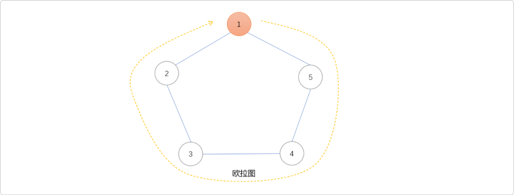

- **欧拉路径**：指通过图中每条边且仅通过一次形成的路径（没有环）。具有欧拉路径但不具有欧拉回路的图称为半欧拉图。如下图，从`6`号节点出发，可以经过每一条边后到达`2`号节点，存在欧拉路径，只能说是半欧拉图。

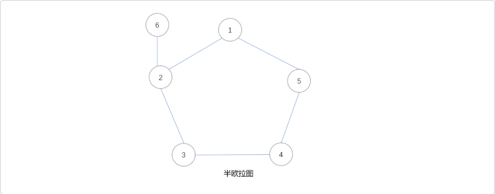

**欧拉图的性质：**

- 欧拉图中所有顶点的度数都是偶数。也就是说，图中存在欧拉回路的充要条件是图中每个结点都是偶节点（连接该节点的边的数量为偶数）。

因为欧拉回路定义只能经过每条边一次，所以，对于每一个节点，至少需要有 `2n(n=0,1……)` 条边连接该节点。

论证：当 `n = 0`时，图结构中只含有一个节点`v`，边数为`0`，图论中认为自己和自己是能构建成回路的。所以当`n=0`时，图是欧拉图。

当`n>=1`时，如果从一个节点出发，经过一个路径后，能够重新回来。相当于一个人要和其他人围成一个圈，每个人必须伸出两只手，否则是不可能形成圈的。故每个节点都连接有`2n(n = 0,1,2,...n)`条边。

- 欧拉路径中奇节点（连接该节点的边的数量为奇数）的**个数**为`0`或`2`。若奇节点的个数为`0`，则图中存在欧拉回路，欧拉回路也是欧拉路径的一种。把欧拉回路变成欧拉路径，只需要抽取出环中的一条边。因为欧拉环的充要条件是节点度数有偶数，抽取出一条边后，会让原来连接边两端的节点的度数分别减少一，出现两个奇节点。

  除此之外，你不能再抽取出任何一条边，否则得不到欧拉路径。

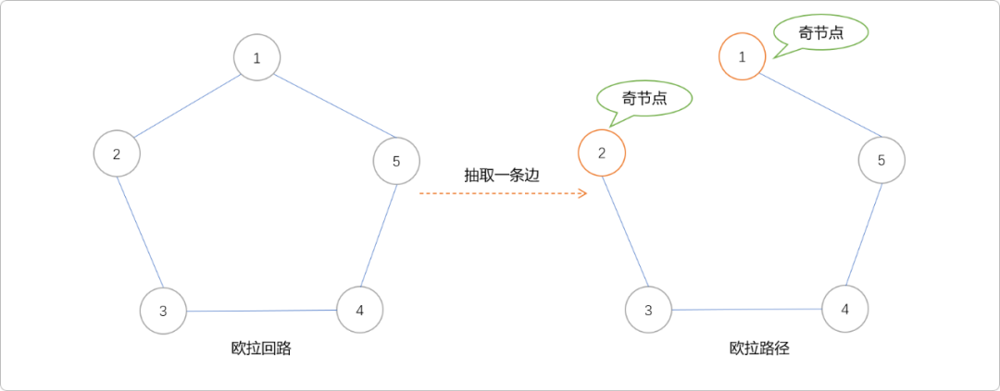

- 若图是欧拉图，则它为若干个环的并集，且每条边被包含在奇数个环内。如下图，整个图是由`5`个环组成，且每一条边都是包含在奇数个环内。

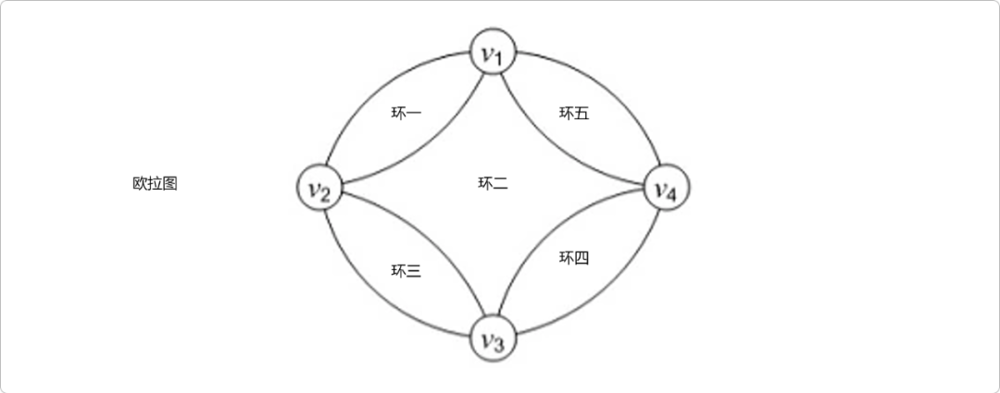

**欧拉图的判定法：**

无向图是欧拉图当且仅当：非零度顶点是连通的；顶点的度数都是偶数。

无向图是半欧拉图当且仅当：非零度顶点是连通的；恰有 2 个奇度顶点。

有向图是欧拉图当且仅当：非零度顶点是强连通的；每个顶点的入度和出度相等。

有向图是半欧拉图当且仅当：非零度顶点是弱连通的；至多一个顶点的出度与入度之差为 1；至多一个顶点的入度与出度之差为 1；其他顶点的入度和出度相等。

## 2. 欧拉图判定算法

### 2.1 `Fleury(弗罗莱)` 算法

`Fleury`算法用来判断图是否是欧拉通路或欧拉回路的算法。

使用如下的欧拉图，了解`Fleury`算法的主要步骤。

> **Tips：** 根据欧拉图的判断法，下图中每一个节点都是偶节点，满足无向图是欧拉图的前提条件。

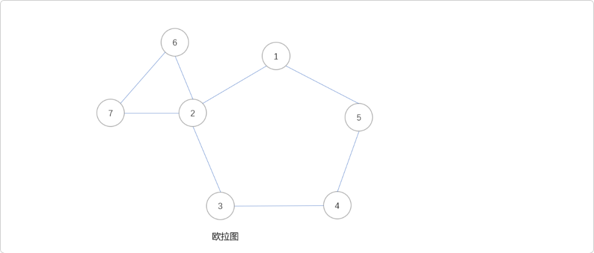

- 选节点`1`为起点，并将该起点加入路径中。`Fleury`算法选择栈存储欧拉路径。

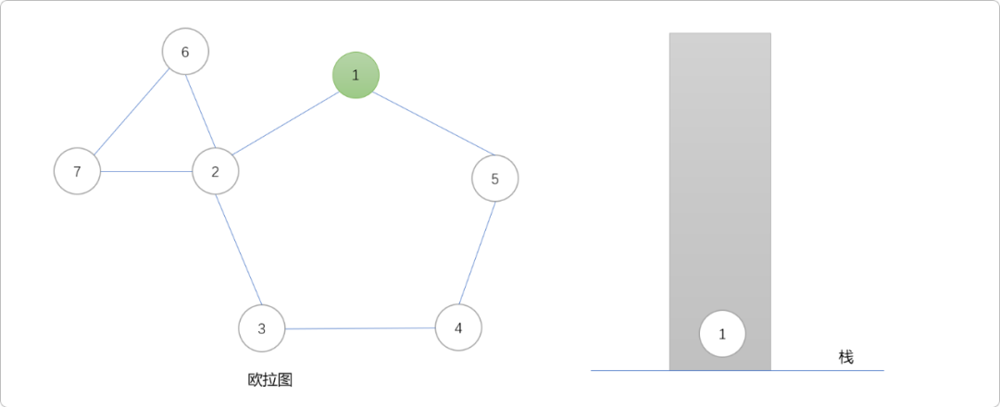

- 从起点开始，一路`DFS`试着走出一条通路。方法是找与此节点相邻的节点。

  **如果只有一个节点，则将这个点直接加入路径中。**

  **如果有多个相邻节点，则选择其中一条边，把相邻节点加入路径后，且删除这一条边。**

  **如果没有邻接节点，则从路径中弹出。**

  节点`5`和节点`2`都与`1`相邻，可以选择向`5`方向，也可以选择`2`方向。这里选择`2`方向，把节点`2`放入路径，然后置`1-2`这条边为删除状态。如此这般，一路经过`3、4、5`节点后回到`1`号节点。下图中标记为红色的边表示已经访问或被删除。

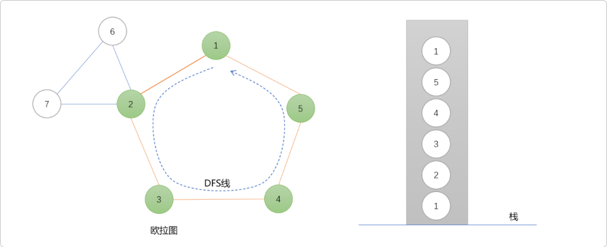

- 重新回到节点`1`，此时不再存在与节点`1`邻接的节点，从路径中弹也，依次可弹出`5、4、3`。直到碰到`2`号节点。

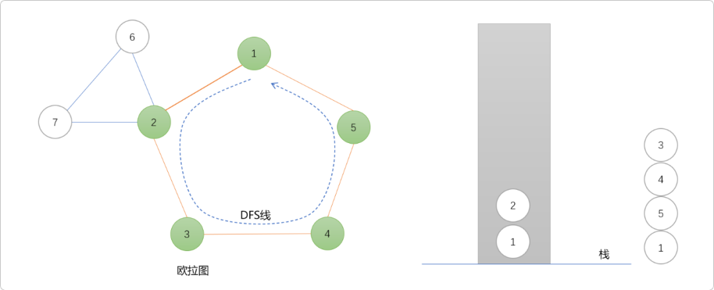

- 因为存在与`2`号节点邻接的节点，再次以`2`号节点为始点，使用`DFS`开路。一路上遇到`6、7`，且再次回到`2`号节点。

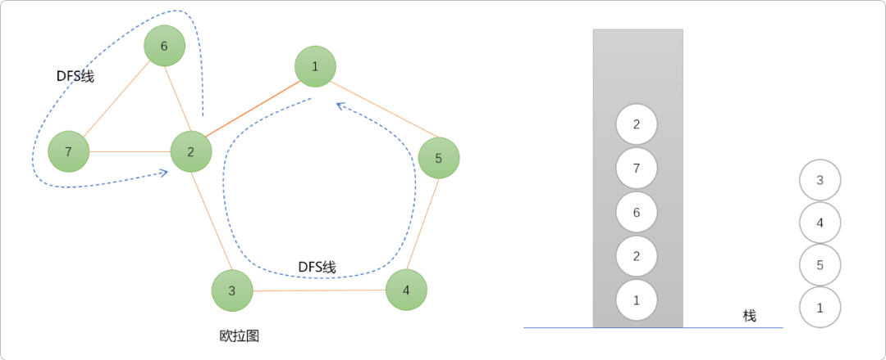

- `2`号节点不存在与之邻接的节点，出栈。同理，`7、6`依次出栈。

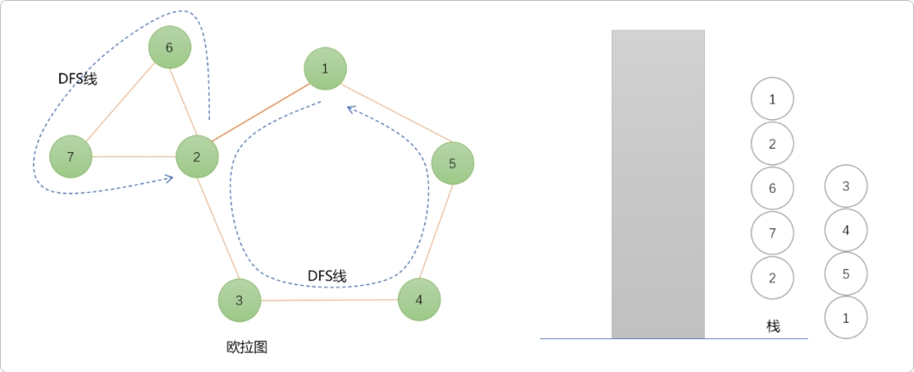

**小结：**

当有与当前节点邻接的节点时，一路`DFS`，直到没有邻接的尽头。些时，一轮`DFS`算法结束，从路径中依次弹出没有邻接节点的节点，直到遇到还有邻接节点的节点，新一轮的`DFS`重新开始。直到所有节点邻接的边全部访问完毕。

**编码实现：**

```cpp
#include <iostream>
#include <math.h>
#include <algorithm>
#include <cstring>
#include <stack>
#define INF 100000
using namespace std;
int graph[100][100];
int n,m;
stack<int> sta;
void read() {
 for(int i = 0; i < m; i++) {
  int f,t;
  cin >> f >> t;
  graph[f][t] = 1;
  graph[t][f] = 1;
 }
}
void dfs(int u) {
 sta.push(u);
 for(int i = 1; i <= n; i++) {
  if(graph[i][u] > 0) {
   //标记为删除
   graph[u][i] = 0;
   graph[i][u] = 0;
   dfs(i);
   //仅朝一条边方向 DFS,方便形成回路 
   break;
  }
 }
}
void fleury(int x) {
 int  isEdge;
 sta.push(x);
 while(!sta.empty()) {
  isEdge = 0;
  int t = sta.top();
  sta.pop();
  //检查是否有边
  for(int i = 1; i <= n; i++) {
   if(graph[t][i] > 0) {
    isEdge = 1;
    break;
   }
  }
  if(isEdge == 0) {
   //没有邻接边，输出
   cout << t << " ";
  } else {
   //有邻接边，一路DFS狂奔
   dfs(t);
  }
 }
}
int main() {
 cin >> n >> m;
 memset(graph,0,sizeof(graph));
 read();
 int num = 0;
 int start = 1;
 for(int i = 1; i <= n; i++) {
  int deg = 0;
  for(int j = 1; j <= n; j++)
   deg += graph[i][j];
  if(deg % 2 == 1) {
   //奇节点的数量
   start = i;
   num++;
  }
 }
 if(num == 0 || num == 2)
  fleury(start);
 else
  cout << "不存在欧拉路径" << endl;
 return 0;
}
//测试用例
7 8
1 2
1 5
2 3
2 6
2 7    
3 4
4 5
6 7    
```

测试结果：

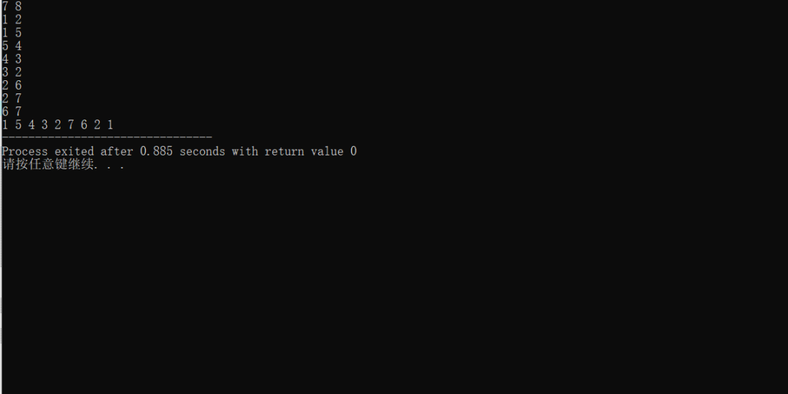

### 2.2 `Hierholzer` 算法

也称逐步插入回路法。由数学家`卡尔·希尔霍尔策`给出，基于贪心思想。`Hierholzer` 的基本思路。先找到一个子回路，以此子回路为基础，逐步将其它回路以插入的方式合并到该子回路中，最终形成完整的欧拉回路。继续使用上图做演示。

- 寻找子回路：如下从节点`1`开始，沿着边遍历图，一边遍历一边删除经过的边。如果遇到一个所有边都被删除的节点，那么该节点必然是 `1`（回到初始点）。将该回路上的节点和边添加到结果序列中。这个过程和`Fleury`算法没有太多区别。

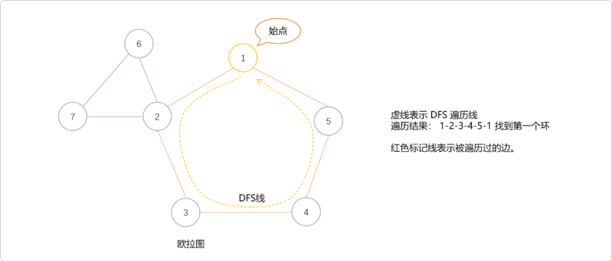

- 回溯时检查刚添加到结果序列中的节点，看是否还有与节点相连且未遍历的边。可发现节点 `2` 有未遍历的边，则从 `2` 出发开始遍历，找到一个包含 `2` 的新回路，将结果序列中的一个 `2` 用这个新回路替换，此时结果序列仍然是一个回路。这是和`Fleury`算法最大区别。

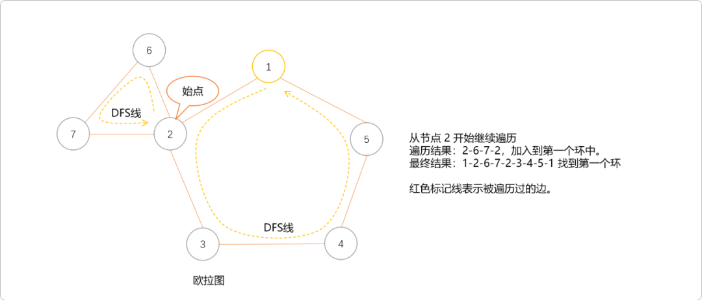

- 重复直到所有边都被遍历。

编码实现

```c
#include<iostream>
#include<string.h>
#include<vector>

const int maxn = 10005;
const int maxm = 1000005;//edge
using namespace std;
int n,m;
struct Edge {
 int to, nxt;
 bool vis=0;
};
Edge edge[maxm];
//如果没有以 i 为起点的有向边则 head[i] 的值为 0
int head[maxm];
//边的个数
int cnt;
//存储找到的回路
vector<Edge> ans;
//起始点
int sn;

void init() {
 for(int i=1; i<=n; i++) {
  head[i]=0;
  cnt=0;
 }
}

/*
*添加边
*/
void addEdge(int from, int to) {
 edge[cnt].to = to;
 edge[cnt].nxt = head[from];
 head[from] = cnt++;
}
void read() {
 int f,t;
 for(int i=1; i<=m; i++) {
  cin>>f>>t;
  addEdge(f,t);
  addEdge(t,f);
 }
}
void hierholzer(int sn) {
 for (int i = head[sn]; i != 0; i = edge[i].nxt) {
  // 遍历过
  if (edge[i].vis) continue;
  // 删除
  edge[i].vis = edge[i ^ 1].vis = true;
  // 继续
  hierholzer(edge[i].to);
  // 回溯时加入结果序列后，循环会继续查找是否有邻接边
  ans.push_back(edge[i]);
        
 }
}
void show() {
 for(int i=0; i<ans.size(); i++) {
  cout<<ans[i].to<<"\t";
 }
 cout<<sn<<"\t";
}

int main() {
 cin>>n>>m;
 sn=1;
 init();
 read();
 hierholzer(sn);
 show();
 return 0;
}
```

**测试结果：**

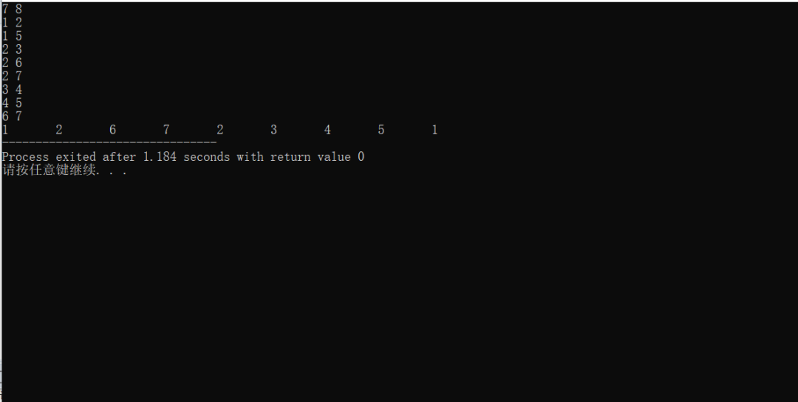

## 3. 总结

`Hierholzer`和`Fleury`算法的基本思路差不多，在`DFS`时找环。`Fleury`使用分段策略，找到一条环后，以环中某一个还存在邻接边的节点重新开始使用`DFS`找环，直到找到所有环。`Hierholzer`算法很有技巧性，在回溯时检查节点是否还有邻接边，有则重新`DFS`直到完毕。


