# C++图论之强连通图


## 1. 连通性

**什么是连通性？**

连通，字面而言，类似于自来水管道中的水流，如果水能从某一个地点畅通流到另一个地点，说明两点之间是连通的。也说明水管具有连通性，图中即如此。

无向图和有向图的连通概念稍有差异。

**无向图连通性**

**如果任意两点间存在路径，称此图具有连通性**，如下的图结构具有连通性。提及连通性，就不得不说连通分量，通俗而言，指结构中有多少个连通通道，如下的图结构只有一个连通通道，也就是一个连通分量，所有节点在这个连通通道上都能互通。

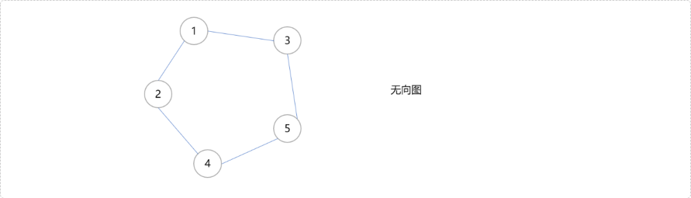

而下图，则有`2`个连通分量。`1,2,3,4,5`可以在一个连通通道上互通，不能和`6,7`互通。`6,7`在自己的连通通道上可以互通。

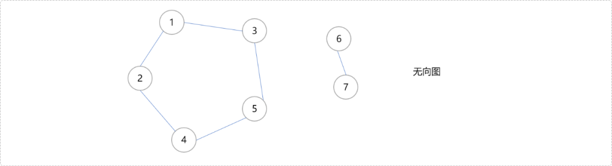

如何检查图结构的连通性和计算连通分量？

笨拙的方案是使用深度或广度搜索算法。原理较简单，一次搜索完毕后，搜索到的节点必是在一个连通分量上。如果一次搜索完毕后被搜索出来的节点数量和图结构原有的节点数量相同，可证明只有一个连通分量。否则，可以再次从除第一次搜索出来的节点之外的节点开始重新搜索，再检查搜索出来的节点数量……如此如此，便可以检测出所有连通分量。

在性能要求不高的应用场景，这是不错的选择。否则，可以使用轻巧、快速的并查集数据结构来检查。

**有向图的连通性**

无论是在有向图或无向图中，都不可能改变连通这个概念。区别于有向图中的边有方向，无向图中的连通可以认为是双向通道，可认为是广义连通；有向图中的连通则是单向通道，可认为是狭义连通。

有向图中，如果一个节点能通过单向通道到达另一个节点，可认为这两点之间是连通的。如下图中，`4->1、2->4->1`是连通的，而`2-3`是不连通的。讨论连通的局部性没有太大意义，有向图中讨论的是强连通性。

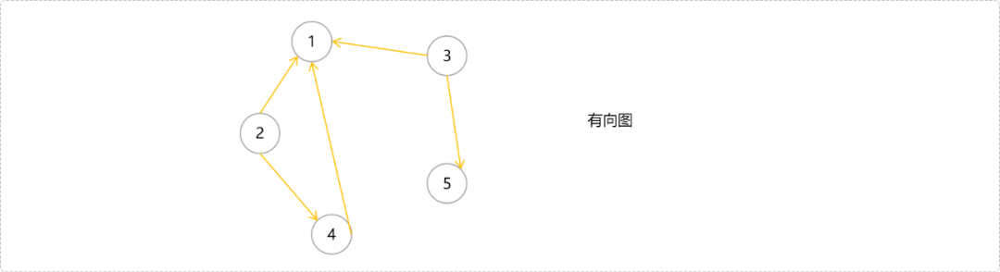

**什么强连通？**

强连通是有向图的特定概念。**有向图中，任意两点之间都可以连通，则认定此有向图为强连通图**，如下图。

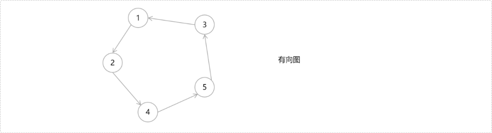

连通分量用来记录连通通道的数量，有向图中的连通分量指强连通分量。如上图，有一个强连通分量，也称此图为强连通性有向图。

如下图所示有向图结构，有向图本身不具有强连通性，但存在子图具有强连通性，则称子图即为原图的强连通分量。

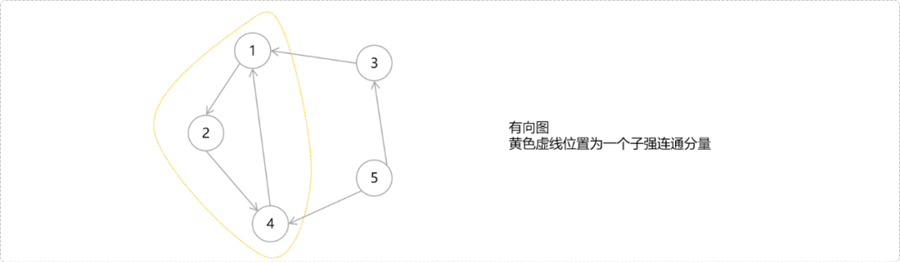

当然，具有强连通性的子图可能不只一个。猜一猜，下图有几个连通分量。

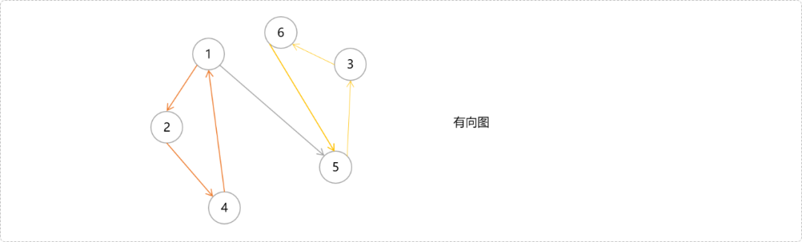

我们已知在无向图中计算连通分量的算法。那么在有向图中如何计算机强连通分量？

**算法界有一句名言：没有暴力算法不能解决的问题。**有向图中查找强连通子量，同样可以使用**深度搜索或广度搜索**。可以说，在树和图论问题中没有广度和深度搜索算法解决不了的。说起来感觉很历害，道理却是简单，任何问题都是在能搜索到的前提下得到解决的。

直接使用广度或深度搜索，毫无疑问属于暴力算法。虽然这是一条康庄大道，但是，不一定是一条捷径之路。好吧，现在让我们去发现是否有捷径小道。

## 2. `Tarjan`算法

`Tarjan`算法很优秀，也很优雅，颇有风淡云轻，四两拨千金之感。理解`Tarjan`算法，先要知晓几个概念，如`DFS`序、时间戳、回溯值……这些可以查阅我的文章《DFS序和欧拉序的降维打击》。

`Tarjan`可以解决很多问题。如公共祖先、割点、割边……当然还有本文的强连通分量的求解。

理解`Tarjan`算法求解强连通分量的工作机制之前，先搞明白有向图的 `DFS` 生成树中的 4 种边。

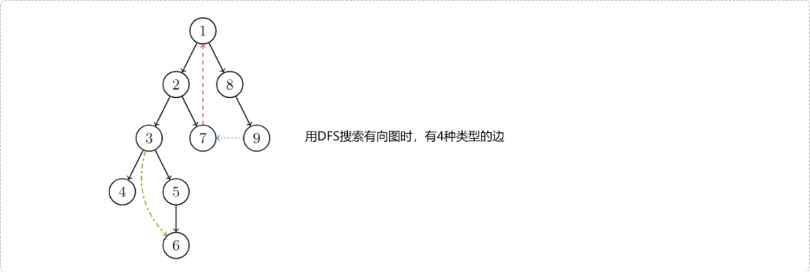

1. 树边`(tree edge)`：节点与节点之间的边。
2. 反祖边`(back edge)`：上图中以红色边表示（即 `7->1`)，也被叫做回边，即指向祖先节点的边。
3. 横叉边`(cross edge)`：上图中以蓝色边表示（即 `9->7` )，搜索的时候遇到的一个已经访问过的结点，但是这个结点 **并不是** 当前结点的祖先。
4. 前向边`(forward edge)`：上图中以绿色边表示（即 `3->6`)，在搜索的时候遇到子树中的结点的时候形成的。搜索过程所有前向边组成一条搜索分支。

**`DFS`生成树与强连通分量之间的关系：**

如果结点 `u` 是某个强连通分量在搜索树中遇到的第一个结点，那么这个强连通分量的其余结点肯定是在搜索树中以 `u`为根的子树中。结点 `u`被称为这个强连通分量的根。

**以下图的结构为例，讲解查找强连通分量的流程。**

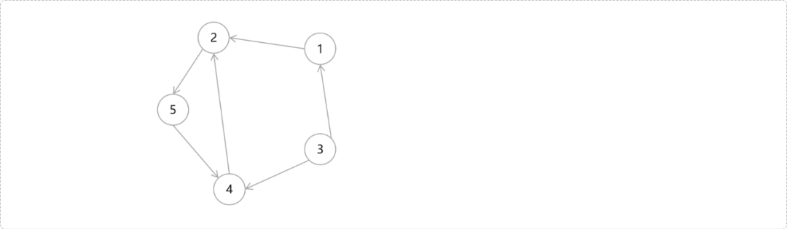

**准备变量**

- 栈`sta`，存储强连通分量上的所有节点；
- `dfn`记录节点的时间戳，一个结点的子树内结点的 `dfn` 都大于该结点的 `dfn`。也可以记录节点是否被访问过。
- `low(回溯值)`记录节点通过一条不在搜索树上的边能到达的结点。或者说不经过直接父节点能访问到的最早（远）的祖先，或者说是经过回边访问到的祖先节点。

**搜索过程**

- 从节点`1`开始深度搜索，记录每一个节点在`DFS`时的时间戳以及回溯值。如`1`号节点的刚开始的时间戳为`1`，回溯值为`1`。别忘记了，`1`号节点现在也在栈中。

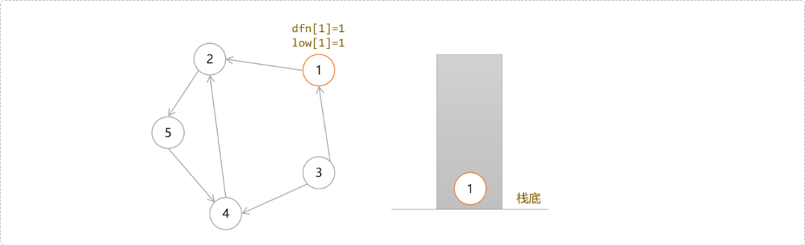

- 按深度搜索路线，一路下去，后面应该是`2、5、4`。下图给出了当搜索到`4`号节点时，每一个节点的时间戳和回溯值以及栈中的状态。此时栈中由栈底到栈顶存储着一条`DFS`搜索树：`1->2->5->4`。

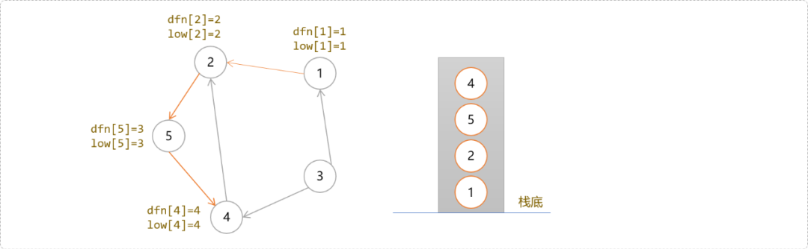

- 当从`4`号节点访问到`2`号节点时，转机出现了。因为，`2`节点被访问过，现又以`4`号节点的子节点身份重新被访问，会想到是不是碰到了祖先，或者说遇到了同一个强连通分量上的节点？

  答案是，不能这么简单的认为？因为这种情况有可能是**回边**也有可能是**横叉边**。

  如下图所示。

  从`1`号开始深度搜索，在第一条深度搜索分支结束后，`4`号节点也会被标记为被访问过。回溯到`1`号节点后，会开始第二条分支，在再次搜索到`4`号节点时，同样会发现`4`号节点也被访问。难道说`4`号节点和`1`号节点在同一个强连通分量上吗？`4->2`是回边，而`1->4`是横叉边。


那么应该如何做出正确判断？继续回到我们的图结构上来讨论怎么正确得到强连通分量。

下图中`2`号节点在栈中，说明早于`4`号节点被访问到且还没有加入其它的强连通分量上，可以判断`2`是`4`号的祖先。**所以节点是否在栈中，是判断是不是回边的一个很重要的条件。**


- 于是，更新`4`号节点的`low[4]=2`。既然`4`号节点能到达`2`号节点，显然，点`4`的父节点们也能通过`4`号节点到达`2`号节点……一脉相承吗？于是这些节点的`low`值得以更新。

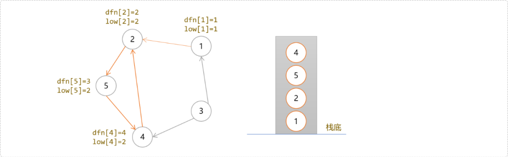


- `4`号节点除了`2`号节点外没有其它子节点，搜索结束，回溯到`4`号，因其`dfs[4]!=low[4]`，暂时不要出栈，继续回溯到`5`号节点，因为`dfs[5]!=low[5]`，不出栈。继续回溯到`2`号节点，因其`dfs[2]==low[2]`，说明一个强连通分量到`2`号节点结束。把它们从栈中弹出来，得到第一个强连通分量上的所有节点。

> **Tips：**如果 `i` 节点的`dfn[i]!=low[i]`，说明其节点可以回到更早的祖先。也说明，其在以祖先开始的强连通分量上。所以只有一直回溯到祖先时，才能一一出栈。`Tarjan`算法求解强连通分量中，栈起到了至关重要的作用。
>
> 一旦发现一个强连通分量，就会把这个强连通分量上的节点弹出来。所以访问过、但是不在栈中的节点说明已经加入到了另一个强连通分量上。如果访问过，但是还在栈中的节点说明还没有找到归属。

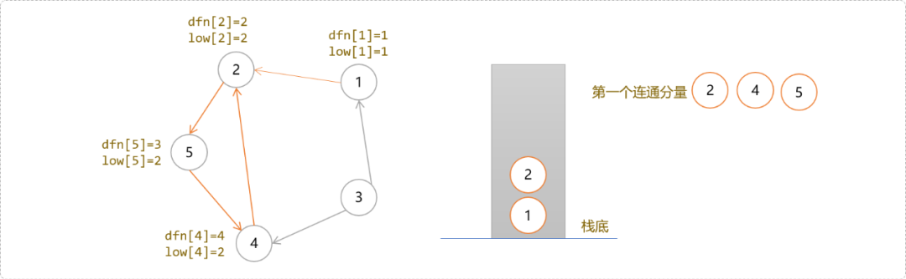


- 回溯到`1`号节点时，因`dfn[1]=low[1]`。`1`号节点构成只有一个节点的强连通分量。

**小结：**

- **深度搜索阶段：**如果 `u`节点的子节点`v`已经访问、且在栈中。说明`v`是`u`的祖先，更新`u`的`low`值。同时更新`u`的除了`v`之外祖先的`low`值。
- **回溯阶段：**如果`u`节点的`dfn!=low`，继续向上回溯， 如果`u`节点的`dfn==low`，说明找到了一个强连通分量，把栈中`u`节点（包含 `u`）之上的节点全部弹出来。

**编码实现**

```cpp
#include<iostream>
#include<stack>
#include<vector>
using namespace std;
//节点数、边数
int n,m;
//dfn记数器和强连通分量记数器
int cnt,cntb;
//矩阵存储图
vector<int> edge[101];
//记录强连通分量
vector<int> connections[101];
//是否在栈中
bool inSta[101];
//时间戳
int dfn[101];
//回溯值
int low[101];
//栈
stack<int> s;

void getConn(int u) {
 ++cnt;
 //前序位置记录节点的时间戳和回溯值
 dfn[u]=low[u]=cnt;
 //入栈
 s.push(u);
 inSta[u]=true;
 //遍历子节点
 for(int i=0; i<edge[u].size(); ++i) {
  int v=edge[u][i];
  if(!dfn[v]) {
   //没有被访问
   getConn(v);
   //回溯位置，根据子节点的 low 更新父节点的 lovw
   low[u]=min(low[u],low[v]);
  } else if(inSta[v])
   //访问过且在栈中，遇到了回边。更新 low 为祖先节点的时间戳
   low[u]=min(low[u],dfn[v]);
 }
 //后序遍历位置
 if(dfn[u]==low[u]) {
  //如果时间戳和回溯值相同，找到一条强连通分量
  ++cntb;
  int t;
  do {
   t=s.top();
   s.pop();
   inSta[t]=false;
   connections[cntb].push_back(t);
  } while(t!=u);
 }
}
int main() {
 cin>>n>>m;
 for(int i=1; i<=m; ++i) {
  int u,v;
  cin>>u>>v;
  edge[u].push_back(v);
 }
 getConn(1);
 for(int i=1; i<=cntb; ++i) {
  cout<<"conn： "<<i<<" : ";
  for(int j=0; j<connections[i].size(); ++j)
   cout<<connections[i][j]<<" ";
  cout<<endl;
 }
 return 0;
}
//测试数据
//7 11
//1 2
//2 3
//2 5
//2 4
//3 5
//3 7
//7 5
//5 6
//6 7
//4 1
//4 5
```

思考一下，如下图的强连通分量有几个。

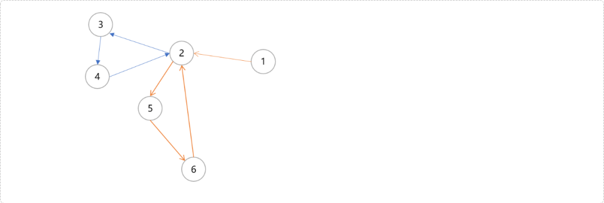


答案：有两个，分别是

- `6 5 4 3 2`
- `1`

## 3. 总结

强连通分量算法还有`Kosaraju 、Garbow `算法。有兴趣者可自行了解。


