# C++ 图进阶系列之剖析二分图的染色算法和匈牙利算法


## 1. 前言

`二分图`又称作`二部图`或称为`偶图`，是图论中的一种`特殊类型`，有广泛的应用场景。

**什么是二分图？**

- 二分图一般指无向图。看待问题要有哲学思想，有二分图也可以是有向图。
- 如果图中所有`顶点集合`能分成两个独立的子集，且任一子集中的任意顶点之间没有边连接，则称这样的图为二分图。

如下图中的图结构都可称为`二分图`。

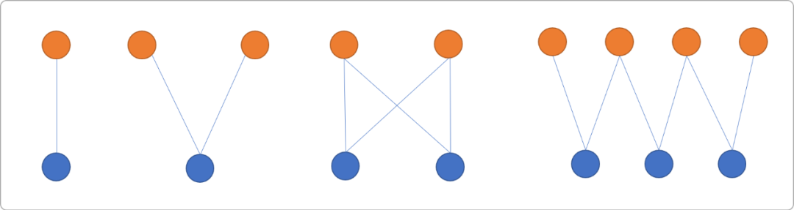

**二分图的特点：**

- 理论而言，图中至少有一个`环`，如果图中无环，则图退化成树。在研究树和图时，一般会把树问题当成图问题的子类。
- `二分图`中不能有奇数个顶点组成的环。

**如何验证二分图中的环不能是奇数个顶点？**

- 环也称为回路，指路径的起点和终点为同一顶点。
- 证明这个问题，可以使用**染色算法**，此算法是判断二分图的经典算法。

## 2. 染色算法

`二分图`的定义已经说明，图中存在二个独立的子集，为了区分这两个子集，可以给其中一个子集中的顶点染上红色，另一个子集中的顶点染上蓝色。具体是什么颜色并不重要，只要能区分就可以。

**染色算法本质：**

- 使用`DFS`或`BFS`对遍历图，且图中所有顶点染色。
- 一旦发现有一个顶点与其邻接顶点的颜色相同，可以判定图结构不是二分图。

感观上应该有预知，如果是奇数环，想必会有至少一对邻接顶点颜色相同。

### 2.1 染色偶数环

如下`图结构`是否是二分图？

此`图结构`中有一个环，且构成环的顶点数为偶数。


使用染色算法判定的流程如下：

- 从编号为`1`的顶点开始，给其染上红色，标记为红色子集中的成员。


- 找到编号`1`的相邻顶点`2和6`。因同一个子集中的顶点之间不能有边连接。编号为`2`和`6`的顶点不可能和编号 为`1`的顶点为同一个子集，所以编号`2`和`6`的顶点只可能存在于另一个子集中，故标记为蓝色。


- 找到与编号`2`相邻的顶点`3`，根据二分图的定义，编号为`3`的顶点只可能染上红色。同理，与编号`6`相邻的顶点`5`也只可能染上红色。


- 编号为`4`的顶点是编号为`3`和`5`的邻接顶点。显然，只能染上蓝色。


- 遍历完所有节点后，每一个节点都染上颜色，**且所有边两端的顶点颜色不相同（这是判定成功的依据）**。可以判定此图为二分图。对图结构稍微变形一下。


### 2.2 染色奇数环

来一个`奇数`环的图结构，同样使用染色算法判断此图是否为二分图。


- 从编号`1`开始，染色为`红色`。


- 找到编号`1`的邻接顶点`2、5`。染色为蓝色。


- 找到编号`2`的邻接顶点`3`，染色为红色。编号`5`的邻接顶点`4`，染色为红色。


- 编号为`3`和`4`的顶点都染上了红色。根据二分图的定义，邻接顶点的颜色不能相同。所以，当环的顶点数量为奇数时，图不具二分性质。

**小结一下：**

染色算法就是给图中顶点染色：

- 如果最终所有边两端的颜色不相同，则可认定图为二分图。
- 如果最终图中只要有一条边两端的颜色相同，则可认定图不是二分图。

### 2.3 编码实现

如下编码实现中，使用 `1`表示红色，`-1`表示蓝色，`0`表示没有染色。

**顶点类型：**

```cpp
#include <iostream>
#include <vector>
using namespace std;
/*
* 顶点类型
*/
struct Vertex {
 //编号
 int vid;
 //数据
 int val;
 //颜色 0：没染色，  1: 红色 -1: 蓝色
 int color;
 //邻接节点
 vector<int> edges;
 Vertex() {
        //默认没有染色
  this->color=0;
 }
 Vertex(int vid,int val,int color  ) {
        //默认没有染色
  this->color=0;
  this->vid=vid;
  this->val=val;
 }
 /*
 *添加邻接顶点
 */
 void addEdge(int vid) {
  this->edges.push_back(vid);
 }
};
```

**图类：** 函数中仅体现核心逻辑，弱化了如验证之类的代码。图的顶点编号从 `1`开始。

```cpp
class Graph {
 private:
  //所有顶点
  vector<Vertex*> allVertexs;
  //顶点编号
  int number;
 public:
  Graph() {
   this->number=1;
   //0 位置填充一个占位符。简化操作，顶点的编号值即为其存储位置编号
   this->allVertexs.push_back(NULL);
  }
    
  /*
  *添加顶点,返回顶点的编号。没有检查顶点是否存在
  */
  int addVertex(int val) {
   //创建新的顶点
   Vertex* ver=new Vertex(number++,val,0);
   this->allVertexs.push_back(ver);
   return ver->vid;
  }
    
  /*
  * 添加邻接边
  */
  void addEdge(int fromId,int toId) {
   //无向图中顶点间双向关系
   this->allVertexs[fromId]->addEdge(toId);
   this->allVertexs[toId]->addEdge(fromId);
  }

  /*
  * 深度搜索(也可以使用广度搜索)算法对图中的顶点染色
  * 1 :表示红色
  * -1：表示蓝色
  */
  bool fillColor(int fromId,int color) {
   //当前顶点的颜色
   this->allVertexs[fromId]->color=color;
   //找到所有邻接顶点
   vector<int> vers=this->allVertexs[fromId]->edges;
   for(int i=0; i<vers.size(); i++) {
    if(this->allVertexs[vers[i]]->color!=0) {
     //已经染过颜色
     if( this->allVertexs[vers[i]]->color==color  ) {
      //如果和邻接顶点颜色相同
      return false;
     }
    } else {
     //没染色，深度搜索
     return fillColor(vers[i],-1*color);
    }
   }
   return true;
  }
};
```

**测试代码：**

- 测试下图是否为二分图，环由偶数个顶点构成。


```cpp
int main(int argc, char** argv) {
 Graph* graph=new Graph();
 for(int i=1; i<=6; i++)
  graph->addVertex(i);
 graph->addEdge(1,2);
 graph->addEdge(1,6);
 graph->addEdge(2,3);
 graph->addEdge(3,4);
 graph->addEdge(4,5);
 graph->addEdge(5,6);
 string fill=graph->fillColor(1,1)?"是二分图":"不是二分图";
 cout<<fill<<endl;
 return 0;
}
```

输出结论：

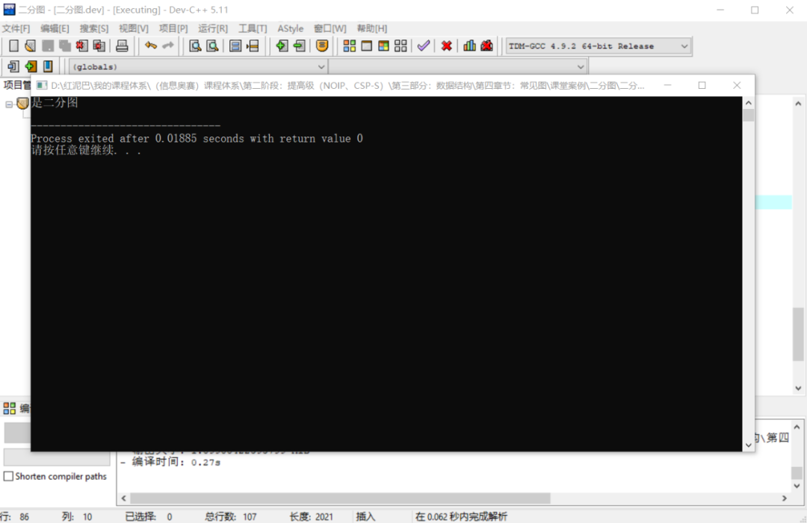

- 测试奇数个数的环图。

```cpp
int main(int argc, char** argv) {
 Graph* graph=new Graph();
 for(int i=1; i<=5; i++)
  graph->addVertex(i);
 graph->addEdge(1,2);
 graph->addEdge(1,5);
 graph->addEdge(2,3);
 graph->addEdge(3,4);
 graph->addEdge(4,5);
 string fill=graph->fillColor(1,1)?"是二分图":"不是二分图";
 cout<<fill<<endl;
 return 0;
}
```

**输出结果：**

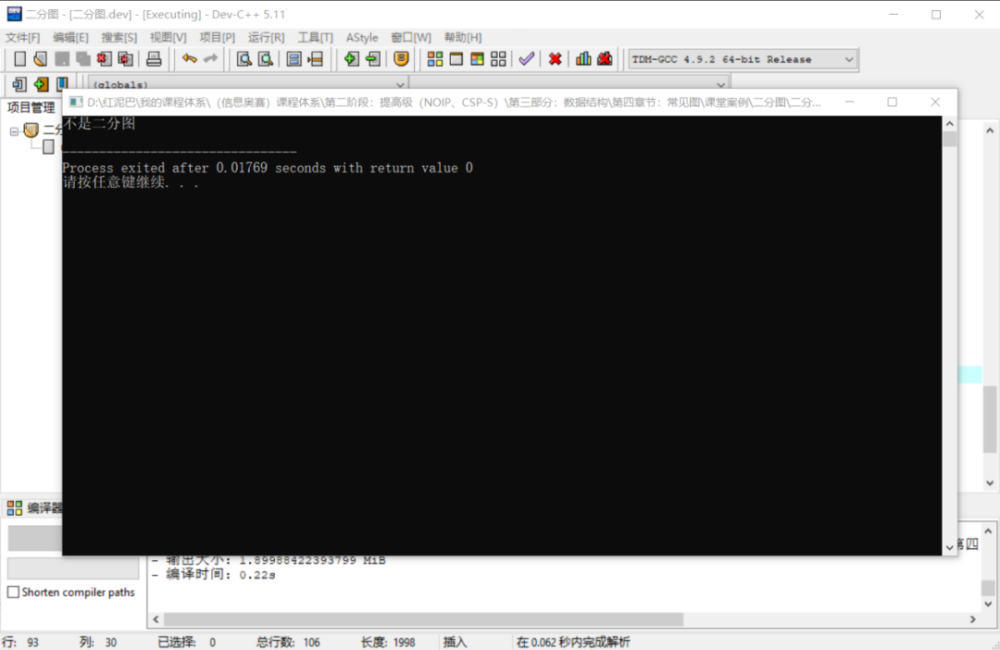

- 二分图中不一定必须有环结构。


```cpp
int main(int argc, char** argv) {
 Graph* graph=new Graph();
 for(int i=1; i<=7; i++)
  graph->addVertex(i);
 graph->addEdge(1,2);
 graph->addEdge(2,3);
 graph->addEdge(3,4);
 graph->addEdge(4,5);
 graph->addEdge(5,6);
 graph->addEdge(6,7);
 string fill=graph->fillColor(1,1)?"是二分图":"不是二分图";
 cout<<fill<<endl;
 return 0;
}
```

输出结果：

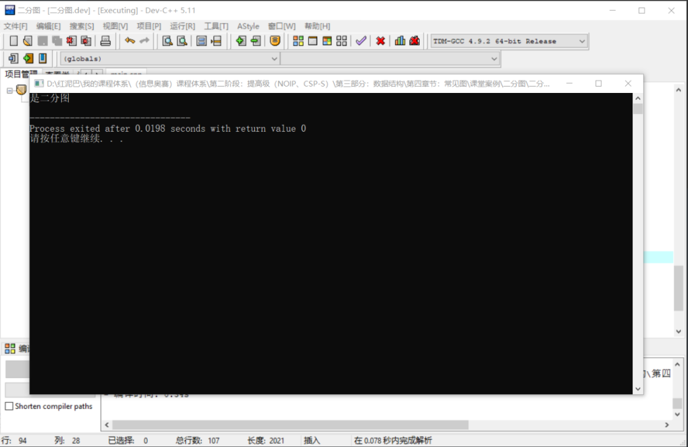

## 3. 二分图最大匹配

### 3.1  匈牙利算法思想

先了解什么是二分图的最大匹配概念。

二分图把图的顶点分成了两个子集， 如使用 `n`和`m`表示。要求选出一些边，所有边中没有公共顶点的边称为匹配边，求最多匹配边的算法为最大匹配算法。

如下图，**标记为红色的边为匹配边，蓝色边为不匹配边**。且最大匹配数为 `3`。

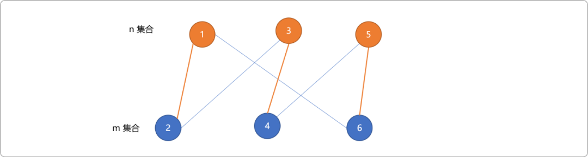

把`n`集合当成相亲时的男士群体，`m`集合当成女士群体。一个男士可以和多个女士有联系，但是，一个男士最终只能迎娶一位女士。即如果集合`n和m`中的顶点已经被选为匹配边，则这两个顶点与其它顶点连接的边就一定是不匹配边。

求二分图最大匹配边的算法：

- 用增广路求最大匹配（称作匈牙利算法，匈牙利数学家Edmonds于1965年提出）。
- 转换成网络流模型。

本文仅讲解匈牙利算法，网络流算法有兴趣者可自行了解。

使用匈牙利算法之前，先要了解两个概念：

- **交替路**：从一个未匹配的点出发，依次经过未匹配边、匹配边、未匹配边....这样的路叫交替路。
- **增广路**：从一个未匹配的点出发，走交替路，到达了一个未匹配过的点，这条路叫增广路。

如下图，已知`(3.4)`和`(5,6)`为匹配边，`3、4、5、6`为匹配顶点。

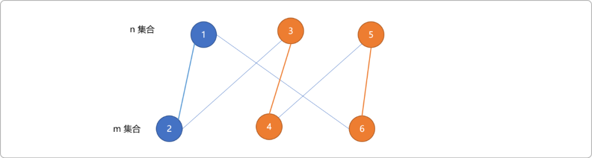

则，`2->3->4->5->6->1`便是一条增广路。

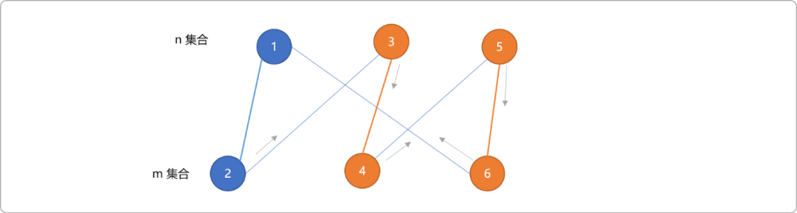

增广路有如下几个特点：

- 增广路有奇数条边 。
- 路径上的点一定分属两个子集。
- 起点和终点都是目前还没有配对的点。
- 未匹配边的数量比匹配边的数量多`1`，这个原由应该很好理解。

**匈牙利算法的核心思想：**

- 枚举所有未匹配点，找增广路径。
- 直到找不到增广路径。

如下描述匈牙利算法的流程：

- 找出如下图结构的最大匹配。**初始所有顶点为非匹配点，所有边为非匹配边。** 准备一个数组，存储匹配边。数组下标表示顶点编号，值表示匹配顶点。

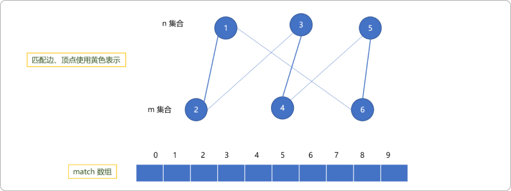

- 以编号为`1的`顶点为出始点，深度搜索查找增广路（终止于非匹配点）。则`(1,2)`和`(1,6)`都为有效选择，选择`(1,2)`。根据增广路的定义，此增广路不能再延长。设置`2`的匹配顶点是`1`。

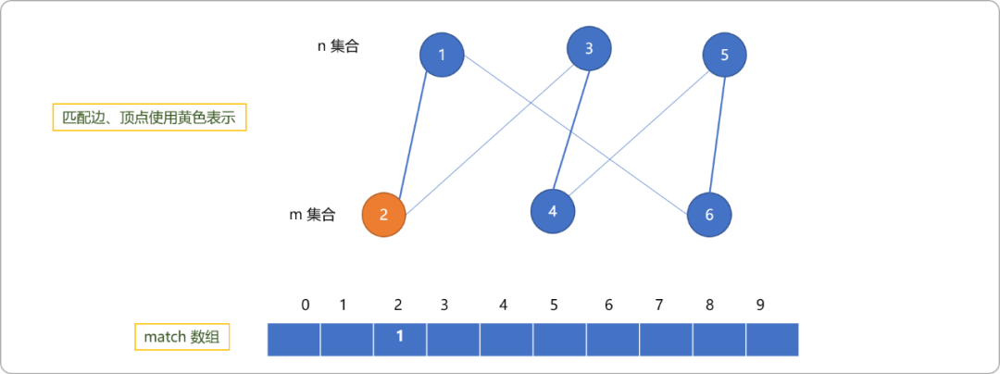

- 匈牙利算法的特点是扫描所有顶点，且以每一个顶点为出发点深度搜索查找增广路。

  再从编号为`2`的顶点出发。如下图所示，`3`会成为匹配顶点，且和`2`匹配。

  注意，只要图中还存在增广路，现所记录的匹配信息都不是最终结果，这些匹配信息可能会被更新。

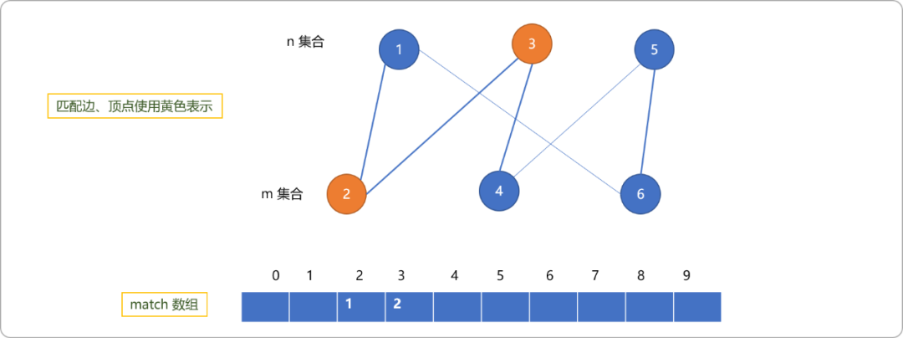

- 以顶点`3`为出发点。以`3->2->1->6`路径进行搜索，因`6`是非匹配点，增广路终止于`6`，把`6`的匹配点设置为`1`。

  这里要注意，在递归向上过程中，会修改编号`2`的匹配点为`3`。

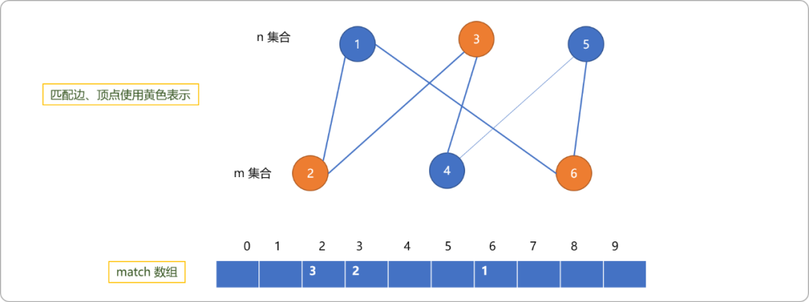

- 以编号为 `4` 的顶点作为出发点。走`4->5`，因`5`是非匹配点，置`5`的为匹配点，且和`4`匹配。

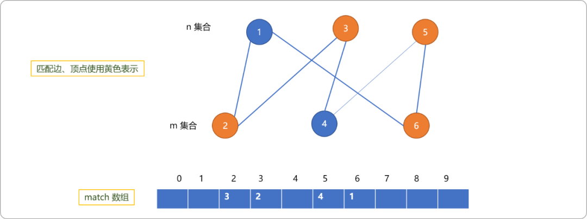

- 以编号`5`为出发点，走`5->4`路线，置`4`的匹配点为`5`。

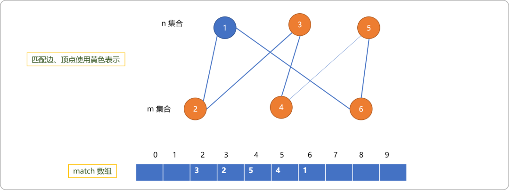


- 以编号为`6`的顶点出发，置编号`1`的匹配点为`6`。

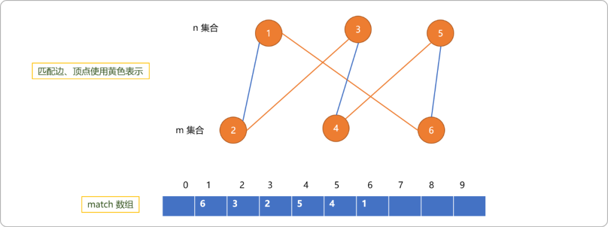


### 3.2 编码实现

使用匈牙利算法的前提条件：图必须是二分图。

```cpp
#include <iostream>
#include <vector>
#include <cstring>
#define maxn 10
using namespace std;

//存储边信息 
vector<int> edges[maxn];
//存储匹配边    
int match[maxn];
//每一次搜索过程中记录顶点状态     
bool vis[maxn];    
int n,m;           
/*
* 深度搜索查找增广路 
*/ 
bool dfs(int x) {
 for(int i=0; i<edges[x].size(); i++) {
  //子节点 
  int v = edges[x][i];
  if(vis[v] == false) {
      //避免重复访问      
   vis[v] = true;
   /*
   * 1、 如果是非匹配点，直接匹配
   * 2、 否则，继续深度搜索 
   */ 
   if(match[v] == -1 || dfs(match[v])) {     
    match[v] = x;
    return true;
   }
  }
 }
 return false;
}
int find() {
 n=6;
 m=6;
 edges[1].push_back(2);
 edges[1].push_back(6);
 edges[2].push_back(3);
 edges[2].push_back(1);
 edges[3].push_back(2);
 edges[3].push_back(4);
 edges[4].push_back(5);
 edges[4].push_back(3);
 edges[5].push_back(4);
 edges[5].push_back(6);
 edges[6].push_back(1);
 edges[6].push_back(5);

 int sum = 0;
 memset(match,-1,sizeof(match));

 for(int i=1; i<=n; i++) {
  memset(vis,false,sizeof(vis));     
  if(dfs(i)) sum ++;
 }
 return sum;
}

int main() {
 int res= find();
 cout<<res<<endl;
 for(int i=1;i<=n;i++){
  cout<<match[i]<<"\t";
 }
 return 0;
}
```

执行代码后，`match`数组中的内容如下图所示：

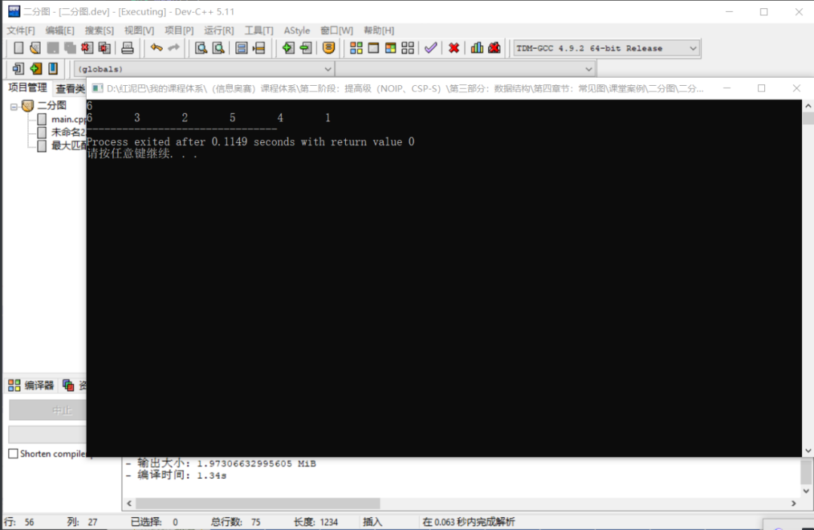


数组中是双向记录，实际最大匹配边只有 `3` 条。

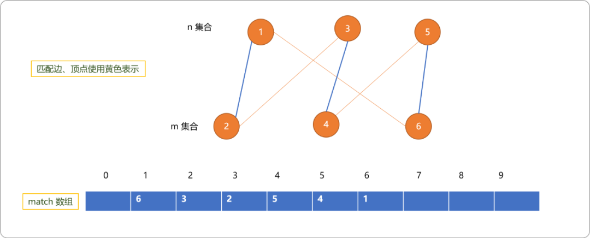


## 4. 总结

本文讲解了二分图的定义以及如何使用染色算法判定图是否为二分图。且讲解了求解最大匹配边的匈牙利算法。

本质上都是基于深度搜索实现的。


