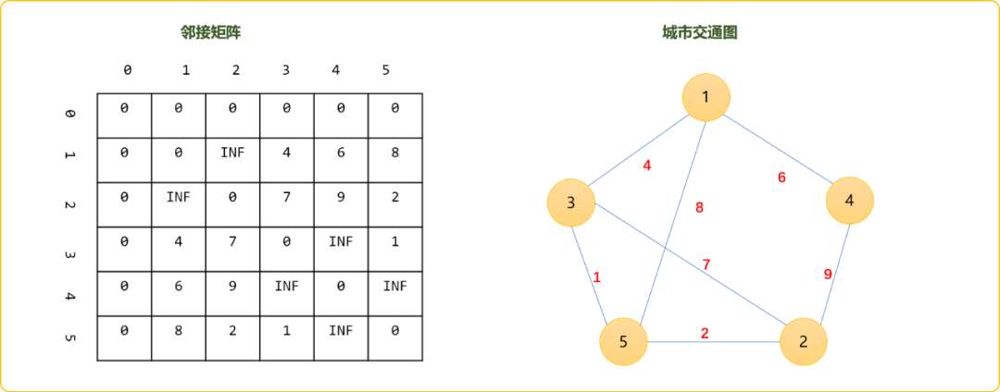
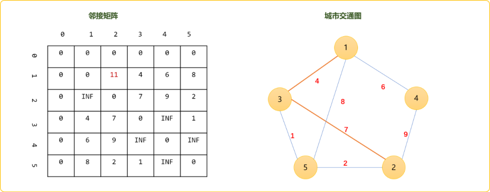
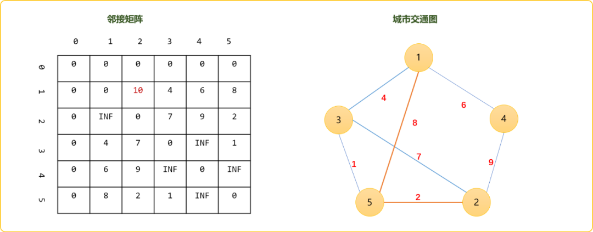
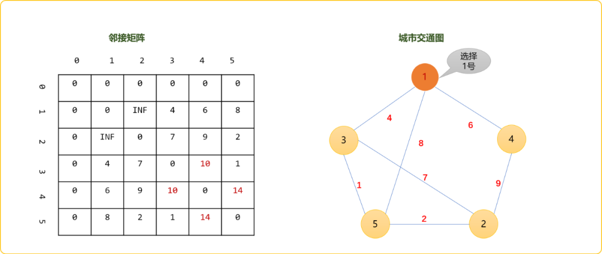
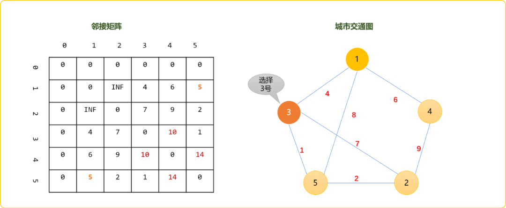
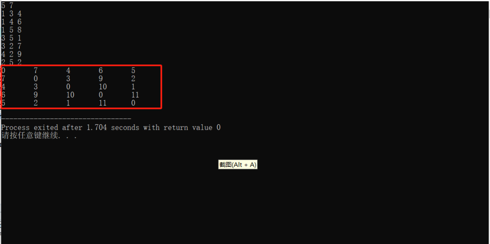
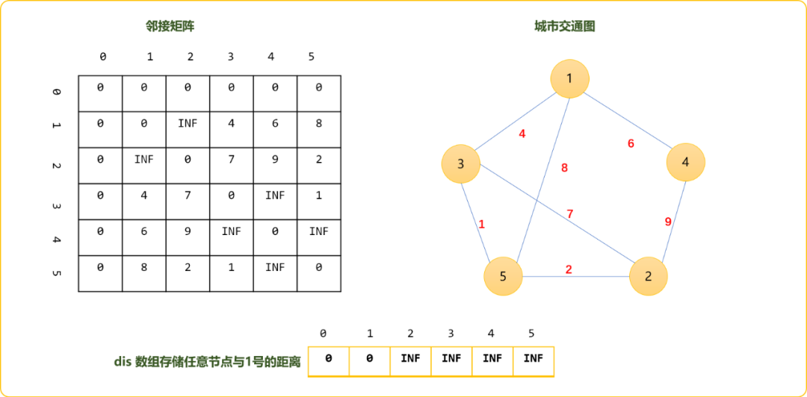
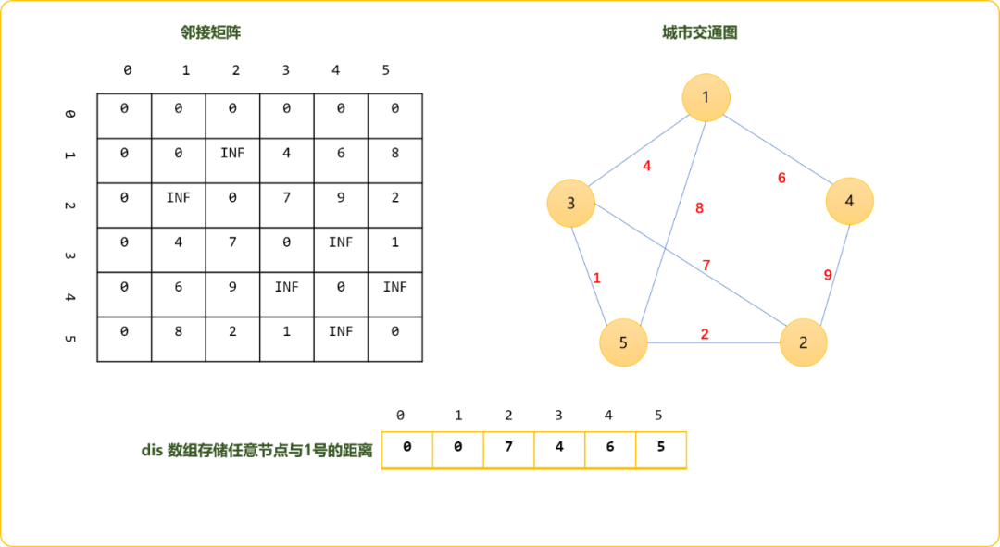

# C++图论之常规最短路径算法的花式玩法（Floyd、Bellman、SPFA、Dijkstra算法合集）


## 1. 前言

权重图中的最短路径有两种，多源最短路径和单源最短路径。多源指任意点之间的最短路径。单源最短路径为求解从某一点出到到任意点之间的最短路径。多源、单源本质是相通的，可统称为图论的最短路径算法，最短路径算法较多：

- `Floyd-Warshall`算法。也称为插点法，是一种利用动态规划思想寻找权重图中多源点之间[最短路径的算法，与`Dijkstra`算法类似。该算法名称以创始人之一、1978年图灵奖获得者、斯坦福大学计算机科学系教授[罗伯特·弗洛伊德命名。
- `Bellman_ford`算法。贝尔曼-福特算法取自于创始人理查德.贝尔曼和莱斯特.福特，暴力穷举法，算法效率较低。但是，能解决的问题范围较大，如负权问题。
- `SPFA`算法。`Bellman-Ford`的队列优化版，本质一样。
- `Dijkstra`算法。迪杰斯特拉算法`(Diikstra)` 是由荷兰计算机科学家狄克斯特拉于1959 年提出的，因此又叫狄克斯特拉算法。经典算法，本质是贪心算法。

下面逐一介绍这三种算法。

## 2. `Floyd-Warshall`

**权重图中，任意两点之间的路径可能存在多条，但是最短的是哪条？**

如果你现在想从`城市1`去`城市2`，固然是想找一条最短路径的，找出量短路径，意味着省时、省钱、省精力……

本质上就是做选择题。面对这样的情况，你首先要做的便是绘制地图，描绘出与`城市1`和`城市2`直接、间接相邻的城市。并初始化城市与城市之间的已知权重。如下图所示。



先得到两点直接相连时的路径。如上图的`1`和`2`两点之间，不存在直接相连的边，初始可认为是很大、很大……

使用矩阵描述为 `graph[1][2]=INF`。`INF`是一个自定义的常量，存储一个较大的值。

现实生活中，当直接不能到达，或直接到达的成本很高时，会考虑经过一个中转站。这样可能会降低成本。到底经过那个中转站能降低成本。这个只能逐一试试。可以把除了`1`和`2`之外的所有节点做为中转站，然后比较是否比之前的路径更短。比如，在`1`和`2`之间插入`3`号节点。

这样你的旅行路就分割成了两段，一段是从`1`到`3`、一段是从`3`到`2`。如下图，标注红色的为新路线。`1->3`的权重为`4`、`3->2`的权重为`7`。累加权重为`11`。显然，比之前的`INF`要短的，想必你是不会犹豫地选择这条新路线。

这时在你的脑海中，应该使用如下的式子获取到`1->2`的新的权重。

```cpp
//因为走 1->3后、再走`3->2`的路线要比之前路径短
//    必然要选择新的路线
if(graph[1][3]+graph[3][2]<graph[1][2])
    graph[1][2]=graph[1][3]+graph[3][2];
```



原理很简单，这时你应该会思考，可能经过`2`个或多个或其它中转站比经过`1`个中转站更省成本。是的，现在还不是最终的选择。

每一次更新后，你需要继续试着添加其它节点做为中转站。检查是否更短，如果更短，继续更新，如果更远，就不用更新。如可以试着把`4`号点做为中转站。这时路线权重变成 `graph[1][4]+graph[4][2]=15`，并没有比之前经`3`为中转站中的值更小，以`4`为中转站这个方案要淘汰掉。

选择`5`做为中转站，你会发现`graph[1][5]+graph[5][2]=11`。既然发现了更短的路径，更新邻接矩阵中`graph[1][2]`的值。这时你应该有所感悟，下图中的邻接矩阵不就是一张动态规划表吗？

> **Tips：**在不断的插入节点，得到新路线后，节点之间的权重值会发生变化。如果需要保留原始图中的节点之间的信息，可以再创建独立的动态规划表。



在`1和2`之间把其它节点都插入了，然后得到了现阶段的最短权得和`10`。是不是就是最终的结果呢？

如果你善于观察，从`1->3`、然后`3->5`、再`5->2`，其权重和为`7`。这条路径才是`1->2`之间的最短路径。也就是说，经过多个中转站也许比只经过一个中转站会让路径更短。

现在的问题是，我们直接朝目标而来，其实没有考虑，你所经过的中间路径也有可能有更短的。如现阶段，我们认为的`1->5`然后`5->2`是最短的，但是，是否忽视了`1->5`也许也存在最短路径。只有最短加最短才能得到真正的最短。

其实，这也符合动态规划思想，必须存在最优子结构吗！最终问题必然是前面的的子问题一步一步推导出来的。所以，`Floyd`算法告诉我们，必须更新任意两点之间的路径，才能得到你希望的两点之间的最短路径。

也就是说，当分别插入`1、2、3、4、5`号节点时，对其它任意两点的距离影响都要记录在案。比如，在插入`1`号节点时，对其它任意两点的影响如下图所示。对`3-4`和`4-5`之间的影响是较大。



选择`3`号点做作插入点，检查其它任意两点之间经过`3`号点是否能让路线变得更短。发现，`1-5`之间的距离被缩短了。



当选择`5`号点做为插入点，计算`1-2`点间的距离时，此时会发现`1->3->5->2`才是最终的最短距离。

理解`Floyd`算法的关键，动态规划本质是穷举算法，只有当所有可能都计算一次，才能得到最终结果。

**编码实现：**

```cpp
#include <iostream>
using namespace std;
//图
int graph[100][100];
//节点数、边数
int n,m;
//无穷大
const int INF=999;
//初始化图，自己和自己的距离为0，和其它节点距离为 INF
void init() {
 for(int i=1; i<=n; i++) {
  for(int j=1; j<=n; j++) {
   if(i==j)graph[i][j]=0;
   else graph[i][j]=INF;
  }
 }
}

//交互式得到节点之间关系
void read() {
 int f,t,w;
 for(int i=1; i<=m; i++) {
  cin>>f>>t>>w;
  graph[f][t]=w;
  //无向图
  graph[t][f]=w;
 }
}

//Floyd算法
void  floyd() {
 //核心代码
 for(int dot=1; dot<=n; dot++) {
  //以每一个点为插入点，然后更新图中任意两点以此点为中转时的路线权重
  for(int  i=1; i<=n; i++) {
   for(int j=1; j<=n; j++) {
              //经过中转后的权重是否小于原来权重
    if( graph[i][dot]+graph[dot][j]<graph[i][j]  )
                     //更新
     graph[i][j]=graph[i][dot]+graph[dot][j];
   }
  }
 }
}
//输入矩阵中信息
void show() {
 for(int i=1; i<=n; i++) {
  for(int j=1; j<=n; j++)
   cout<<graph[i][j]<<"\t";
  cout<<endl;
 }
}

int main(int argc, char** argv) {
 cin>>n>>m;
 init();
 read();
 floyd();
 show();
 return 0;
}
```

测试样例：

```cpp
5 7
1 3 4
1 4 6
1 5 8
3 5 1
3 2 7
4 2 9
2 5 2
```

**`Floyd`优点和缺点：**

缺点和优点都体现的很明显，缺点是时间复杂度高，不适合节点数多的图，优点是易理解，易实现。当题目的数据范围不是很大，此算法可做为首选。

**`Floyd`的应用**

**传递闭包问题**

什么是传递闭包？

对于一个节点 `i`，如果 `j` 能到 `i`，`i` 能到 `k`，那么 `j` 就能到 `k`。传递闭包，就是把图中所有满足这样传递性的节点计算出来，计算完成后，就知道任意两个节点之间是否相连。

简而言之，传递闭包是一种关于连通性的算法，其是指所有点的所能到达的点集。可以使用并查集思想解决。也可以使用`Floyd`算法实现，使用`Flord`算法后，可以检查两点之间是否有有效值，便能得到两点间是否连通。

如基于上述的测试用例走一遍算法后，得到如下图所示的矩阵信息。任意两点间都有权重值，可以推导图上任意两点都可以连通。且整个图只有一个连通分量。



如果仅是用来查找连通性，权重值的多少就没有意义。节点之间有权重的可以用 `1`表示连通，节点之间没有权重的用`0`表示不连通。先走一遍`Floyd`算法。然后就是输入任意两点，检查`graph[u][v]`是否值为`1`。

```cpp
for(int k = 1 ; k <= N ;k++)    
    for(int i = 1 ;i <= N; i++)
    {
        for(int j = 1 ; j <= N;j++)
        {
            if(graph[i][j]==1 || graph[i][k]==1 && graph[k][j]==1) 
                //直接连通或者间接经过其他点连通
            {
                graph[i][j] = 1;  //两点有连通性
            } 
        }
    }
}
```

### 求无向图最小环

```cpp
#include <iostream>
#include <cstring>
#include <algorithm>
using namespace std;
const int N = 110, INF = 0x3f3f3f3f;
int n, m;
int d[N][N], g[N][N];  // d[i][j] 是不经过点
int pos[N][N];  // pos存的是中间点k
int path[N], cnt;  // path 当前最小环的方案, cnt环里面的点的数量
// 递归处理环上节点
void get_path(int i, int j) {
    if (pos[i][j] == 0) return;  // i到j的最短路没有经过其他节点
    int k = pos[i][j];  // 否则,i ~ k ~ j的话,递归处理 i ~ k的部分和k ~ j的部分
    get_path(i, k);
    path[cnt ++] = k;  // k点放进去
    get_path(k, j);
}
 
int main() {
    cin >> n >> m;
    memset(g, 0x3f, sizeof g);
    for (int i = 1; i <= n; i ++) g[i][i] = 0;
    while (m --) {
        int a, b, c;
        cin >> a >> b >> c;
        g[a][b] = g[b][a] = min(g[a][b], c);
    }
 
    int res = INF;
    memcpy(d, g, sizeof g);
    // dp思路, 假设k是环上的最大点, i ~ k ~ j(Floyd的思想)
    for (int k = 1; k <= n; k ++) {
        // 求最小环, 
        //至少包含三个点的环所经过的点的最大编号是k
        for (int i = 1; i < k; i ++)  // 至少包含三个点，i，j，k不重合
            for (int j = i + 1; j < k; j ++)  
            // 由于是无向图,
            // ij调换其实是跟翻转图一样的道理
            // 直接剪枝, j从i + 1开始就好了
            // 更新最小环, 记录一下路径
                if ((long long)d[i][j] + g[j][k] + g[k][i] < res) {
                    // 注意,每当迭代到这的时候, 
                    // d[i][j]存的是上一轮迭代Floyd得出的结果
                    // d[i][j] : i ~ j 中间经过不超过k - 1的最短距离(k是不在路径上的)
                    res = d[i][j] + g[j][k] + g[k][i];  
                    cnt = 0;
                    path[cnt ++] = k;  // 先把k放进去
                    path[cnt ++] = i;  // 从k走到i(k固定的)
                    get_path(i ,j);  // 递归求i到j的路径
                    path[cnt ++] = j;  // j到k, k固定
                }
 
        // Floyd, 更新一下所有ij经过k的最短路径
        for (int i = 1; i <= n; i ++) 
            for (int j = 1; j <= n; j ++)   
                if (d[i][j] > d[i][k] + d[k][j]) {
                    d[i][j] = d[i][k] + d[k][j];  
                    pos[i][j] = k;
            }
    }
 
    if (res == INF) puts("No solution.");
    else {
        for (int i = 0; i < cnt; i ++) cout << path[i] << ' ';
        cout << endl;
    }
 
    return 0;
}
```

## 3.Bellman_Ford

`Bellman_Ford`算法是典型的“笨人有笨法”。虽然笨，但也有其光亮一面，如可以检查负权图。其算法的思路并不难理解。

`BF`算法是单源最短路径算法，初始可以任先确定一个节点，然后找与此节点直接相连的节点，更新节点，然后再以更新后的节点继续向外延展。

继续使用上文中的图结构，了解延展的过程。


先定下`1`号节点，然后选择任意边，试着更新与`1`号节点的距离，边的选择按节点编号。

为了研究的方便，再创建一个一维数组，存储任意节点至`1`号的权重。初始时除了`1`和自己距离为`0`，其它节点与`1`号节点距离为无穷大（设置一个合理大的值即可）。当然，你也可以直接在邻接矩阵中更新数据，但没有添加一个一维数组来的方便和易懂。



读出图中的所有边上的权重，更新节点到`1`号节点距离，这个过程称为松弛。更新通用表达式=`边上的权重+节点到1号节点的值`是否小于当前存储的值。

比如更新`1-3`这条边，更新表达式：

```cpp
//nw=4+0
int nw=graph[1][3]+dis[1];
if(nw<dis[3])
    //dis[3]=INF ,nw=4 条件成立，更新后dis[3]=4
    dis[2]=nw;
```

本文研究的是无向图，除了松驰`1->3`还需要松驰`3->1`。

因 `1<->4、1<->5` 符合 `dis[i]>graph[i][j]+dis[j]`，距离得到更新。松驰和`1`邻接的顶点的边，可以理解为邻接顶点直接到`1`的距离是可知的。

如松驰`2<->3`，`2<->4`,`2<->5` ，可以理解为`2`无法直接连通到`1`，但是可以通过`3、4、5`这两个节点到达`1`，当然取三者中的最小值。`dis[2]=10`。因为是无向图，也可以理解`3、4、5`是否可以通过`2`到达`1`，且是否距离更短。自然想到，无论`floyd`和`bellman`的基本思想都是，如果无法直接到达，试着通过其它点是否可以到达，甚至更近。

如下是更新`2-3、2-4、2-5`后的结果。

> **Tips：** 始点用`i`表示，终点用`j`表示。


如下是更新`3-5`后的结果，因`5`可以通过`3`更接近`1`，值更新为`5`。


一轮松驰后，需要再重新对每一条边进行松驰。直到任何边的松驰不能引起更新为止。

重新松驰`1-3`，`1-4`，`1-5`不会引起更新，松驰`2-5`时，显然，`2`经过`5`到达`1`更近。



至些，对边的松驰无法再引起距离的更新，算法结束。其结果和上文使用`Floyd`算法结论是一样。两者算法的底层逻辑差不多，如在松驰`2-5`边时，基思想是是否通过`5`到达`1`节点会更近。

那么需要进行多少轮呢?

在一个含有`n`个顶点的图中，任意两点之间的最短路径最多包含`n-1`边。而实际是，有时也不需要更新`n`轮。如上述过程，也就三轮而已。

在每轮更新之前，提前备份`dis`数组，此轮更新后，如果`dis`数组中值没有变化，则可以提前结束。

**编码实现：**

```cpp
#include <bits/stdc++.h>
using namespace std;
//图
int graph[100][100];
int dis[100];
int bakDis[100];
//节点数、边数
int n,m;
//无穷大
const int INF=999;
//初始化图，自己和自己的距离为0，和其它节点距离为 INF
void init() {
 for(int i=1; i<=n; i++) {
  for(int j=1; j<=n; j++) {
   if(i==j)graph[i][j]=0;
   else graph[i][j]=INF;
  }
  dis[i]=INF;
 }
}
//交互式得到节点之间关系
void read() {
 int f,t,w;
 for(int i=1; i<=m; i++) {
  cin>>f>>t>>w;
  graph[f][t]=w;
  //无向图
  graph[t][f]=w;
 }
}
//Bellman算法
void  bellman() {
 dis[1]=0;
 //核心代码较简单
 for(int c=1; c<=n-1; c++) {  //轮次
  //备份dis
  for(int i=1; i<=n; i++)bakDis[i]=dis[i];
  for(int  i=1; i<=n; i++) {
   for(int j=1; j<=n; j++) {
    if(graph[i][j]!=INF) {
     if(dis[i]>graph[i][j]+dis[j]  )dis[i]=graph[i][j]+dis[j] ;
     if(dis[j]>graph[i][j]+dis[i]  )dis[j]=graph[i][j]+dis[i] ;
    }
   }
  }
  //检查是否有更新
  bool con=false;
  for(int i=1; i<=n; i++)
   if(bakDis[i]!=dis[i])con=true;
  if(!con)break;
 }
}
//输出信息
void show() {
 for(int i=1; i<=n; i++) {
  cout<<dis[i]<<"\t";
 }
}
int main(int argc, char** argv) {
 cin>>n>>m;
 init();
 read();
 bellman();
 show();
 return 0;
}
```

**负权问题**

如果一个图如果没有负权回路，那么最短路径所包含的边最多为`n-1`条，即进行`n-1`轮松弛之后最短路不会再发生变化。如果在`n-1`轮松弛之后最短路仍然会发生变化，则该图必然存在负权回路。

## 4. SPFA

`SPFA(Shortest Path Faster Algorithm)` 算法是 `Bellman-Ford`算法的队列优化算法的别称，通常用于求含负权边的单源最短路径，以及判负权环。`SPFA` 最坏情况下时间复杂度和朴素 `Bellman-Ford`相同，为 `O(VE)`。

**算法基本思想**

初始时将源点加入队列。每次从队首`(head)`取出一个顶点，并对与其相邻的所有顶点进行松弛尝试，若某个相邻的顶点松弛成功，且这个相邻的顶点不在队列中(`不在head和tail之间`)，则将它加入到队列中。对当前顶点处理完毕后立即出队，并对下一个新队首进行如上操作，直到队列为空时算法结束。

除此之外，算法逻辑和原生`Bellman`是一样，就不在此复述。直接上代码，下面代码使用邻接表方式存储图结构。

**编码实现**

```cpp
#include <bits/stdc++.h>
using namespace std;
/*
* 顶点类型
*/
struct Ver {
//顶点编号
 int vid=0;
//第一个邻接点
 int head=0;
//起点到此顶点的距离（顶点权重）,初始为 0 或者无穷大
 int dis=0;
//是否入队
 bool isVis=false;
 void desc() {
  cout<<vid<<" "<<dis<<endl;
 }
};

/*
* 边
*/
struct Edge {
//邻接点
 int to;
//下一个
 int next=0;
//权重
 int weight;
};

class Graph {
 private:
  const int INF=999;
  //存储所有顶点
  Ver vers[100];
  //存储所有边
  Edge edges[100];
  //顶点数，边数
  int v,e;
  //队列
  queue<int> que;

 public:
  Graph( int v,int e ) {
   this->v=v;
   this->e=e;
   init();
  }
  void init() {
   for(int i=1; i<=v; i++) {
    //重置顶点信息
    vers[i].vid=i;
    vers[i].dis=INF;
    vers[i].head=0;
    vers[i].isVis=false;
   }
             //下面有向图
   int f,t,w;
   for(int i=1; i<=e; i++) {
    cin>>f>>t>>w;
    //设置边的信息
    edges[i].to=t;
    edges[i].weight=w;
    //头部插入
    edges[i].next=vers[f].head;
    vers[f].head=i; 
   }
  }
  void spfa(int start) {
   //初始化队列,起点到起点的距离为 0
   vers[start].dis=0;
   vers[start].isVis=true;
   que.push(start);
   while( !que.empty() ) {
    //出队列
    Ver ver=vers[  que.front()  ];
    ver.desc();
    que.pop();
    //找到邻接顶点, i 是边集合索引号
    for( int i=ver.head; i!=0; i=edges[i].next) {
     int v=edges[i].to;
     //更新距离
     if( vers[ v ].dis > ver.dis + edges[i].weight ) {
      vers[ v ].dis = ver.dis+edges[i].weight;
      //入队列 
      if( vers[ v ].isVis==false ) {
       vers[ v ].isVis=true;
       que.push( v );
      }
     }
    }
   }
  }
  void show() {
   for(int i=1; i<=v; i++) {
    cout<<vers[ i ].dis<<"\t";
   }
  }
};

int main() {
 int v,e;
 cin>>v>>e;
 Graph graph(v,e);
 graph.spfa(1);
 graph.show();
 return 0;
}
////测试用例
5 7
1 2 2
1 5 10
2 3 3
2 5 7
3 4 4
4 5 5
5 3 6
////输出
//0  2 5  9  9
```

## 5. Dijkstra

`Dijkstra`迪杰斯特拉算法(`Diikstra`) 是由荷兰计算机科学家狄克斯特拉于1959 年提出的，因此又叫狄克斯特拉算法。

核心思想

搜索到某一个顶点后，更新与其相邻顶点的权重。权重计算法则以及权重更新原则和`Bellman`相同。和`Bellman`区别是，`DJ` 算法搜索时，每次选择的下一个顶点是所有权重值最小的顶点。其思想是保证每一次选择的顶点和当前顶点权重都是最短的。所以，`DJ`是基于贪心思想。

编码实现

- 矩阵存储

```cpp
#include <bits/stdc++.h>
using namespace std;
//矩阵，存储图
int graph[100][100];
//顶点、边数
int v,e;
//优先队列，使用数组
int pri[100];
//存储起点到其它顶点之间的最短距离
int dis[100];
//设置无穷大常量
int const INF =INT_MAX;

/*
*初始化函数
*/
void init()
{
    //初始化图中顶点之间的关系
    for(int i=1; i<=v; i++)
    {
        for(int j=1; j<=v; j++)
        {
            if( i==j )
            {
                //自己和自己的关系（权重）为 0
                graph[i][j]=0;
            }
            else
            {
                //任意两点间的距离为无穷大
                graph[i][j]=INF;
            }
        }
    }

    //交互式确定图中顶点之间的关系
    int f,t,w;
    for( int i=1; i<=e; i++ )
    {
        cin>>f>>t>>w;
        graph[f][t]=w;

    }

    //初始设编号为 1 的顶点为起始点,根据顶点的关系初始化起点到其它顶点之间的距离
    for(int i=1; i<=v; i++)
    {
        dis[i]=graph[1][i];
    }

    //初始化优先队列（也称为候选队列）
    for(int i=1; i<=v; i++ )
    {
        if(i==1)
        {
            //起始顶点默认为已经候选
            pri[i]=1;
            continue;
        }
        //其它顶点都可候选
        pri[i]=0;
    }

}

/*
*
*Dijkstra算法
*/
void dijkstra()
{
    for(int i=1; i<=v; i++)
    {
        //从候选队列中选择一个顶点，要求到起始顶点的距离为最近的
        int u=-1;
        int mi=INF;
        for( int j=1; j<=v; j++ )
        {
            if(pri[j]==0 && dis[j]<mi)
            {
                mi=dis[j];
                u=j;
            }
        }
        if(u!=-1)
            //找到后设置为已经候选
            pri[u]=1;
        else 
            //找不到就结束
            break;
        //查找与此候选顶点相邻的顶点，且更新邻接点与起点之间的距离
       //相当于在此顶点基础上向后延长
        for( int j=1; j<=v; j++ )
        {
            if(  graph[u][j]!=INF )
            {
                //找到相邻顶点
                if(dis[j]>dis[u]+graph[u][j]  )
                {
                    //更新
                    dis[j]=dis[u]+graph[u][j];
                }
            }
        }

    }
}
/*
*
*显示最后的结果
*/
void show()
{
    for(int i=1; i<=v; i++)
    {
        cout<<dis[i]<<"\t";
    }
}
int main()
{
    cin>>v>>e;
    init();
    dijkstra();
    show();

    return 0;
}
//测试用例
6  9
1 2 1
1 3 12
2 3 9
2 4 3
3 5 5
4 3 4
4 5 13
4 6 15
5 6 4
//输出
0  1  8  4  13  17
```

- 邻接表

```cpp
#include <bits/stdc++.h>

using namespace std;
/*
* 顶点类型
*/
struct Ver
{
    //顶点编号
    int vid=0;
    //第一个邻接点
    int head=0;
    //起点到此顶点的距离（顶点权重）,初始为 0 或者无穷大
    int dis=0;
    //重载函数
    bool operator<( const Ver & ver ) const
    {
        return this->dis<ver.dis;
    }

    void desc(){
      cout<<vid<<" "<<dis<<endl;
    }
};

/*
* 边
*/
struct Edge
{
    //邻接点
    int to;
    //下一个
    int next=0;
    //权重
    int weight;
};

class Graph
{
private:
    const int INF=INT_MAX;
    //存储所有顶点
    Ver vers[100];
    //存储所有边
    Edge edges[100];
    //顶点数，边数
    int v,e;
    //起点到其它顶点之间的最短距离
    int dis[100];
    //优先队列
    priority_queue<Ver> proQue;
public:
    Graph( int v,int e )
    {
        this->v=v;
        this->e=e;
        init();
    }
    void init()
    {
       for(int i=1;i<=v;i++){
              //重置顶点信息
            vers[i].vid=i;
            vers[i].dis=INF;
            vers[i].head=0;
       }
        int f,t,w;

        for(int i=1; i<=e; i++)
        {
            cin>>f>>t>>w;
            //设置边的信息
            edges[i].to=t;
            edges[i].weight=w;
            //头部插入
            edges[i].next=vers[f].head;
            vers[f].head=i;
        }

        for(int i=1; i<=v; i++)
        {
            dis[i]=vers[i].dis;
        }
    }

    void dijkstra(int start)
    {
        //初始化优先队列,起点到起点的距离为 0
        vers[start].dis=0;
        dis[start]=0;

        proQue.push(vers[start]);

        while( !proQue.empty() )
        {
            //出队列
            Ver ver=proQue.top();
            ver.desc();
            proQue.pop();

            //找到邻接顶点 i 是边集合索引号
            for( int i=ver.head; i!=0; i=edges[i].next)
            {
                int v=edges[i].to;
    //更新距离
                if( vers[ v ].dis > ver.dis + edges[i].weight )
                {
                    vers[ v ].dis = ver.dis+edges[i].weight;
                    dis[ v ]= vers[ v ].dis;
                    //入队列
                    proQue.push( vers[v] );
                }

            }

        }
    }

    void show()
    {
        for(int i=1; i<=v; i++)
        {
            cout<<dis[i]<<"\t";
        }
    }

};

int main()
{
    int v,e;
    cin>>v>>e;
    Graph graph(v,e);
    int s;
    cin>>s;
    graph.dijkstra(s);
    graph.show();
    return 0;
}
```

## 6. 总结

除了本文所述算法，最短路径还有很多其它算法，每一种算法各有特色。可根据实际情况酌情选择。


