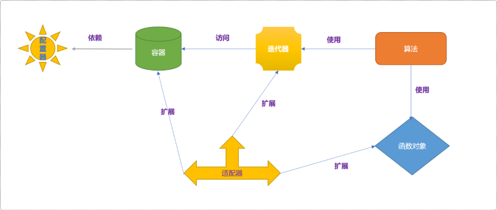
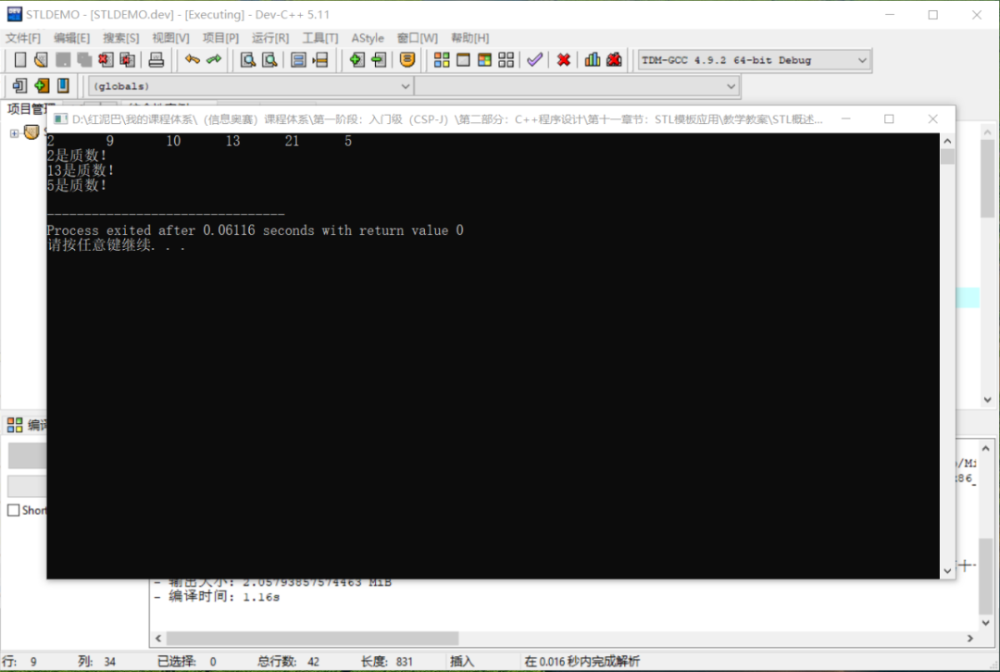
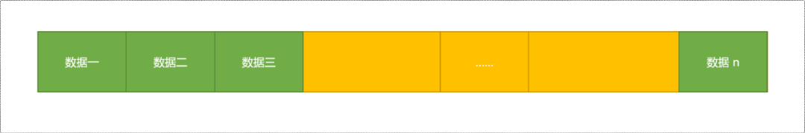
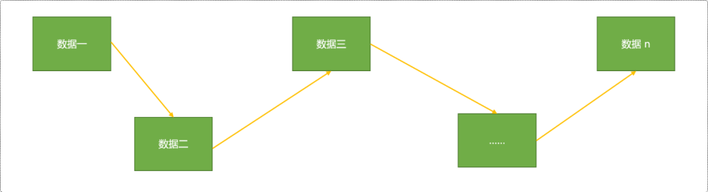
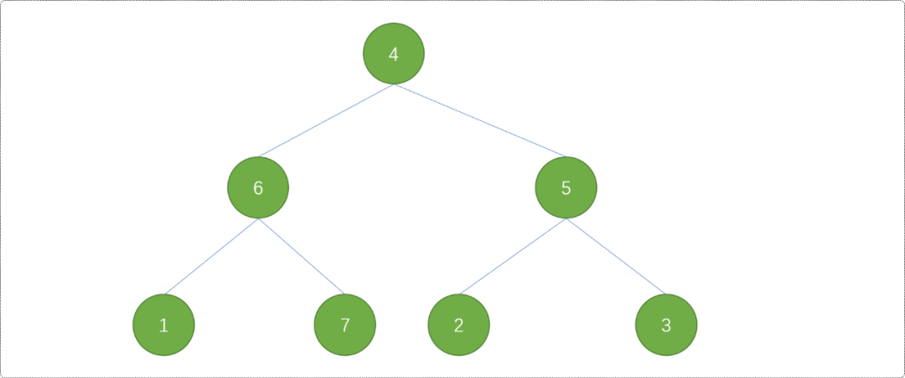
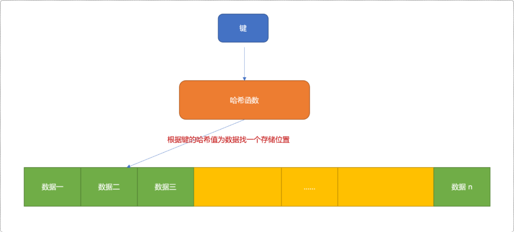
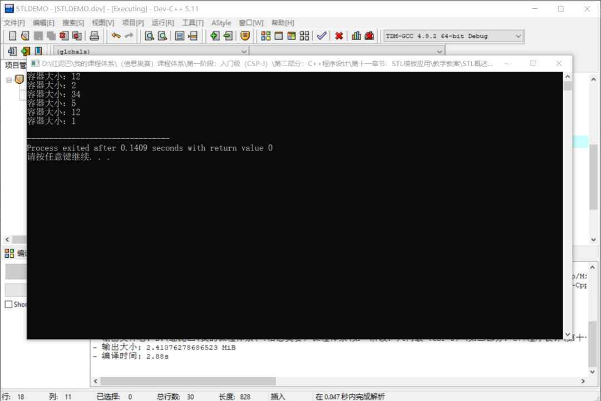
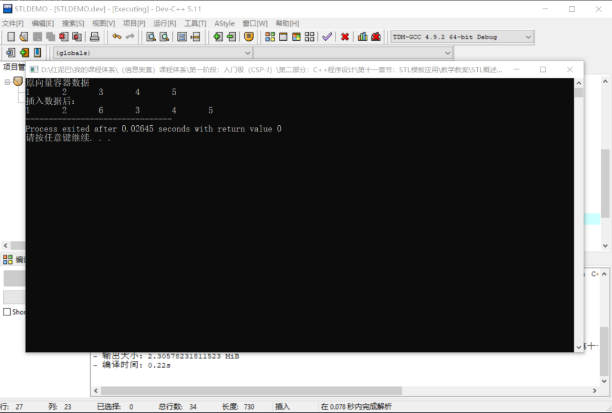
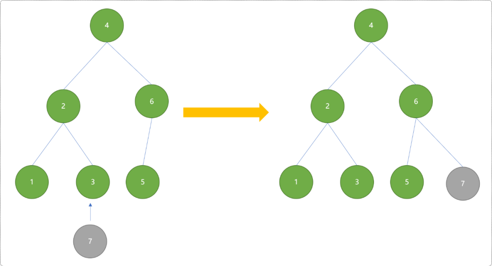

# C++ STL 概述_严丝合缝的合作者


## 1.  初识 STL

什么是`STL`？

`STL（Standard Template Library）` 是`C++`以模板形式提供的一套标准库，提供了很多通用性的功能模块。开发者通过使用 `STL` ，可以将主要精力用于解决程序的高级业务逻辑，而无须关心底层的基础逻辑的实现。

`STL` 由 `6 `大部分组成：

- `容器`：存储和组织数据的`类模板`，是STL的核心。
- `迭代器`：独立于容器，提供访问容器中数据的通用操作组件。
- `算法`：提供通用基础算法功能，算法通过迭代器对容器中的数据进行查找、计算……。
- `函数对象`：重载了括号运算符`（）`的模板类，为算法提供灵活的策略。
- `适配器`：通过对已有的容器、迭代器、函数对象进行适配，创造出新的编程组件。
- `配置器`：为容器服务，负责其内存空间的配置与管理。

`6`大部件遵循单一职责设计思想，组件间彼此独立，每一个组件在各自内部高度自治性地实现分配到的功能。各组件在工作关系上，互为依赖，彼此之间形成服务与被服务关系。从而构建出一个精密、灵活、具有高度自适应的编程环境。

如下图为组件之间的分工合作关系：



学习`STL`包括：

- 了解、熟悉各组件的使用。
- 掌握各组件之间的服务关系。

因`STL`知识体系庞大而复杂，非一言二语能讲透。本文仅俯瞰一下`STL`，对`STL`有一个大概了解，对每一个组件的细节讨论将留到系列文章中讲解。

下面通过一个简单的案例初步了解`容器、迭代器、算法、函数对象`之间的合作关系。

**案例需求**：求解一个已知数列中的所有质数（质数：只能被 `1` 和自身整除的数字）。

**设计流程：**

- 首先在源代码文件的头部包含程序中需要用到的所有头文件。

```cpp
#include <iostream>
#include <vector>
#include <algorithm>
#include <cmath>
using namespace std;
```

- 认识`STL`的`vector`容器，使用它存储已知数列。

> `STL`中的容器种类繁多，容器之间即存在共性操作、也存在个体差异性，可适配于不同的应用场景。
>
> 在常规操作时，可选择`vector`容器，需要包含`<vector>`头文件。

```cpp
vector<int> nums= {2,9,10,13,21,5}; 
```

- 认识`迭代器`，遍历容器。迭代器类似于指针，用于访问容器。

```cpp
//获取到指向容器第一个数据的迭代器 
vector<int>::iterator begin=nums.begin();
//获取到指向器结束位置的迭代器，注意，并不是最后一个数据，而是最后一个数据的下一个存储位置
vector<int>::iterator end=nums.end();
//使用迭代器输出容器中数据
while(begin!=end){
    cout<<*begin<<"\t";
    begin++;
}  
cout<<endl;
```

- 认识函数对象，使用函数对象编写求解质数的算法。函数对象可以在`STL`的算法之外为算法组件提供算法策略，算法组件相当于提供了一个平台，利用平台耦合容器、函数对象。类似于拼搭游戏，可以有各种可能。

> 用到了 `sqrt`函数，需要包含 `<cmath>` 头文件。

```cpp
//使用结构体作为函数对象
template <typename T>
struct Zs {
 // 函数对象的特点：重载 () 运算符
 void operator()(T & x) const {
        //求解质数的算法
  bool isZs=true;
  for(T i=2; i<=sqrt(x); i++) {
   if (x % i==0) {
    isZs=false;
    break;
   }
  }
  if(isZs)
            cout<<x<<"是质数"<<endl;
 }
};
```

- 使用`for_each` 算法 。`STL`提供了大量算法，使用时需要包含 `<algorithm>`头文件。

```cpp
//重新指向容器的开始位置（因为前面的操作移动过迭代器） 
begin=nums.begin();
//使用 for_each 算法组件
for_each(begin,end,Zs<int>()); 
```

- 输出结果。



`STL`使用了高内聚、低耦合的设计理念，各组件的专业能力非常强，合作时又能做到润物细无声。

- `容器`专注于数据的存储。
- `迭代器`专注于容器的访问。
- `函数对象`提供具体的算法策略。
- `算法`相当于发动机，提供聚合动力。

容器是`STL`的核心(无数据无程序)，下面简要介绍容器的通用操作。

## 2. 容器

`STL`中的容器和数组相似，能够存储数据集，但有其自身的特点：

- 支持容量的自动增长。当添加数据时，如果容量不够时，容器会自动分配新的内存。
- 容器可以迭代。
- 支持数据类型参数(泛型编程)。

### 2.1 分类

`STL`中的容器众多，有点乱入花丛渐迷眼的既视感。一般会按照存储方式对其进行分类：

- **序列式容器**：数据以添加时的顺序进行存储，当然可以对数据排序。
- **关联式容器**：数据由`键`和`值`两部分组成。

#### 2.1.1 序列式容器

序列式容器的存储方案有 `2` 种：

- **连续（线性）存储**：基于数组的存储方式，数据与数据在内存中是相邻的。



- **链式（非线性）存储**：以节点的方式非线性存储。数据与数据在内存中并不一定相邻，结点之间通过存储彼此的地址知道对方的位置。



`STL`中常用到的序列式容器对象：

- `vector`：向量，线性存储，类似于数组。需要包含 `<vector>`头文件。
- `list`：双向链表，非线性存储。需要包含 `<list>`头文件。
- `slist`：单向链表，非线性存储。需要包含 `<slit>`头文件。
- `deque`：双向队列。需要包含`<deque>`头文件。
- stack：栈，先进后出。需要包含`<stack>`头文件。
- `queue`：队列，数据先进先出。需要包含`<queue>`头文件。
- `priority_queue`：优先级队列。需要包含`<queue>`头文件。

#### 2.1.2 关联式容器

关联式容器也有 `2` 种存储方案：

- **使用搜索二叉树：**容器中的元素依照键值进行排序。`STL`是用红黑树实现关联容器，红黑树是一种查找效率很高的平衡搜索二叉树。



- **使用哈希表：**对键值进行哈希算法，然后根据哈希值把数据存储在不同的单元中。



`STL`中常用的关联容器：

- `set`：集合。包含头文件 `<set>`。
- `map`：映射。包含头文件`<map>`。
- `multiset`：可重复集合。包含头文件`<set>`。
- `multimap`：可重复映射。包含头文件`<map>`。

### 2.2 容器的通用操作

#### 2.2.1 初始化

使用容器时包含：

- 创建容器。
- 初始化容器。初始化时可以指定容器的容量、为容器指定一系列初始值、为容器中的数据指定比较方法……

序列化容器要求初始化容量，而关联式容器（基于红黑树）要求初始化数据的比较方法。对于基于哈希表的实现的关联式容器也要求初始化容量。

初始化序列化容器：

```cpp
#include <iostream>
#include <vector>
#include <algorithm>
#include <list>
#include <set>
using namespace std;
//使用结构体作为函数对象
int main(int argc, char** argv) {
//初始容量为 12 向量容器
vector<int> vec(12);
cout<<"容器大小："<<vec.size()<<endl;
//初始化长度为 2，且值为 12 、30的向量容器
vector<int> vec1 {12,30};
cout<<"容器大小："<<vec1.size()<<endl;
//构造整型链表，初始容量 34
list<int> lst(34);
cout<<"容器大小："<<lst.size()<<endl;
//整型数组
int ary1[5]= {1,2,3,4,5};
//用数组初始化
vector<int> vec2(ary1,ary1+5);
cout<<"容器大小："<<vec2.size()<<endl;
//用向量初始化链表
list<int> intList(vec.begin(),vec.end());
cout<<"容器大小："<<intList.size()<<endl;
//用链表初始化集合
set<int> intSet(lst.begin(),lst.end());
cout<<"容器大小："<<intSet.size()<<endl;
return 0;
}
```

**输出结果：**



初始化`map、set`容器时。

```cpp
//构造 map 容器
map<std::string, int> myMap;
//构造并初始化
std::map<std::string, int>myMap{ {"rose",1},{"jone",2} };
//输出
for (auto iter = myMap.begin(); iter != myMap.end(); ++iter) {
        cout << iter->first << " " << iter->second << endl;
}
```

输出结果：

```cpp
jone 2
rose 1
```

#### 2.2.2 添加数据

一般要求容器组件提供对数据进行常规维护的方法（增、删、改、查……）。

`STL`为 `2`类容器提供了`insert`方法，可以在指定的位置为容器加入新的数据。

> 这里需要注意：`STL`位置一般用迭代器描述，而不是索引位置。

```cpp
// 初始化向量
vector<int> vec {1, 2, 3, 4, 5};
//开始迭代器
vector<int>::iterator begin=vec.begin();
//结束迭代器
vector<int>::iterator end=vec.end();
cout<<"原向量容器数据"<<endl;
for(; begin!=end; begin++) {
    cout<<*begin<<"\t";
}
//重置开始位置
begin=vec.begin();
// 指向容器vec的第三个元素
begin =begin + 2;
//在位置 3 插入数据
vec.insert( begin, 6 );
//重置开始和结束位置
begin=vec.begin();
end=vec.end();
cout<<"\n插入数据后："<<endl;
for(; begin!=end; begin++) {
    cout<<*begin<<"\t";
}   
```

**输出结果：**



关联式容器的插入数据效果和序列式容插入效果会有不同。

- 序列式容器中插入数据后，期望位置和最终结果位置是一样的。如期望插入在第 `3` 个数据之后，实际也是插入在第 `3` 个数据之后。
- 关联式容器会自动按`键`进行位置重排，会出现期望位置和最终位置不一样的情况（特别在以红黑树存储数据时，为了保持平衡性，会对数据进行平衡处理）。



`STL`还为序列式容器提供了`push、push_back、push_front`方法，此方法只能在容器头或容器尾进行数据添加。

```cpp
// 声明一个向量
vector<int> vec(10);
// 压入数据
vec.push_back(1);
vec.push_back( 1 );
vec.push_back( 2 );
// 声明一个链表
list<int> ls(10);
// 压入数据
ls.push_back( 1 );
ls.push_front( 2 );
// 声明一个栈,栈只有 push 方法
stack<string> st;
// 压入数据
st.push("A"); 
```

#### 2.2.3 删除数据

`STL`的容器都有 `erase`方法，用来删除指定位置或区间的数据。也提供有`clear`方法，用来清除整个容器。

> 位置和区间都需使用迭代器指定。

```cpp
// 初始化向量 
vector<int> vec  {1, 2, 3, 4, 5, 6};  
//指向容器vec的第三个元素
vector<int>::iterator iter = vec.begin() + 2;
// 删除第三个元素
vec.erase(iter);   
//指向容器vec的第三个元素               
iter = vec.begin() + 2;     
// 删除第二个元素之后的所有元素       
vec.erase(iter, vec.end() );  
// 构造一个集合    
set<int> intSet( ary1, ary1+5 );   
// 删除键值为4的元素（集合的键值与实值是一致的）
intSet.erase( 4 );                    
```

#### 2.2.4 查找数据

序列式容器没有提供查找方法，但是，如果某容器类重载了`[]`运算符，则可以通过给定数据的索引号找到相应数据，也可以通过 `at`方式进行查找。

```cpp
// 初始化向量 
vector<int> vec  {1, 2, 3, 4, 5, 6};  
int tmp= vec[2];
cout<<tmp<<endl;
//效果上面一样
tmp= vec.at(2);
cout<<tmp<<endl;
```

序列式容器一般都会提供`front`和`back`方法，用来返回第一个和最后一个数据。因为栈的特殊性，只有`top`方法用来返回栈顶数据。

```cpp
vector<int> vec {1, 2, 3, 4, 5, 6};        
list<int> intList( vec.begin(), vec.end() );
//返回第一个数据
x = intList.front();  
//返回最后一个数据
x = intList.back();                  
stack<int,vector<int> > st;    
//返回栈顶数据
x = st.top();
```

关联式容器提供有专门的`find`方法，可通过指定键值进行查找，注意，返回的是用迭代器所描述的位置。

```cpp
// 整数型数组
int ary[5] = { 3, 1, 5, 2, 4};        
// 构造集合     
set<int> intSet( ary, ary+5 );   
// 查找集合中键值为4的元素          
set<int>::iterator iter = intSet.find( 4 );
//输出
cout<<*iter<<endl;
```

基于组件的分工合作设计思想，容器自身的查找只会提供一些基本功能。当有更复杂的查找需求时，可以使用`STL`算法中相应的函数模板进行查询，例如`find`，`find_if`，`find_end`和`find_first_of`。

#### 2.2.5 修改数据

可以先查找到要修改的数据，然后直接修改，如果查找数据时返回的是迭代器，则可以通过迭代器进行修改。

```cpp
// 构造向量 
vector<int> vec  { 3, 1, 5, 2, 4};
//直接修改
vec[3] =9;
//[] 反回的是向量数据的引用
int &refTmp=vec[3];
//和前面的直接修改一样
refTmp=9;

map<int,int>  myMap();
//按键值查找，返回迭代器
map<int,int>::iterator iter=myMap.find(10);
//通过迭代器修改
iter->second=8;
//和上面的效果一样
myMap[10]=8;
```

#### 2.2.6 其它方法

- `begin` ：返回容器开始位置的迭代器。
- `end`：返回容器尾部数据后一个存储位置的迭代器。
- `rbegin`：求指向容器反向开始元素的迭代器。
- `rend`：求容器反向结尾元素后一个存储单元的迭代器。
- `swap`：交换两个容器的内容。`swap`方法用来交换两个容器的内容。要求两个容器的类型、大小相同。

```cpp
//构造两个向量
vector<int> v1 {1, 2, 3};
vector<int> v2 {4, 5, 6};
//交换两个向量
v1.swap(v2);
vector<int>::iterator iter = v2.begin();
//输出向量v2的内容
for(; iter != v2.end(); iter++) {
    cout<<*iter<<endl;
}
```

- `==、!=、<、<=、>、>=`：比较运算符，判断两个容器之间的关系。比较返回结果是第一对不相等数据间的比较结果。如果两个容器的数据数目不相等，则容器不相等。

```cpp
// 定义两个向量
vector <int> v1, v2;
// 在v1中加入数据
v1.push_back( 1 );
v1.push_back( 2 );
v1.push_back( 3 );
// 在v2中加入数据
v2.push_back( 1 );
v2.push_back( 3 );
//返回结果是 V1 第一个数据与 V2 中第一个数据的比较结果
bool res=v1 < v2;
// 输出1，true 如果 v1 的第一个数据是 4 则，输出 0
cout<< "v1 < v2：" <<res  <<endl;    
```

## 3. 总结

`STL`是一个庞大且功能非常完善的组件库，本文仅对其做了一个大概的描述，但是，一叶也能知秋，旨在理顺其脉络，先画出STL 旅行地图，然后再逐一击破。


