# C++从 STL 中的队列开始说起


## 1. 前言

队列和栈一样，都是受限的数据结构。

队列遵循`先进先出`的存储原则，类似于一根水管，水从一端进入，再从另一端出去。进入的一端称为`队尾`，出去的一端称为`队头`。

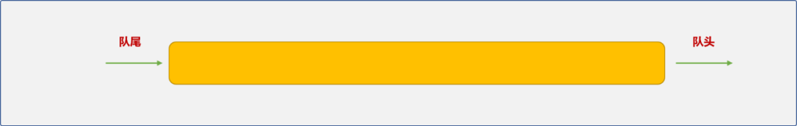

队列有 `2` 个常规操作：

- **入队**：进入队列，数据总是从队尾进入队列。
- **出队**：从队列中取出数据，数据总是从队头出来。

本文将先从`STL`的队列说起，然后讲解如何自定义队列。

## 2. STL 中的队列

`STL`的队列有：

- `queue(普通队列)`。
- `priority_queue(优先队列)`。
- `deque（双端队列）`。

### 2.1 `queue（普通队列）`

`queue`是一个适配器对象，是对`deque`组件进行改造后的伪产品，可以在源代码中看出端倪。

```cpp
template<typename _Tp, typename _Sequence = deque<_Tp> >
class queue{
    //……
}
```

构建`queue`时需要 `2` 个类型参数：

- `_Tp`：存储类型说明。
- `_Sequence`：真正的底层存储组件，默认是`deque`。使用时，开发者可以根据需要指定其它的存储组件。

`queue` 类中提供了几个常规操作方法：

|  方法名   |       功能说明       |
| :-------: | :------------------: |
| `back()`  |   返回最后一个元素   |
| `empty()` |  如果队列空则返回真  |
| `front()` |    返回第一个元素    |
|  `pop()`  |    删除第一个元素    |
| `push()`  |  在末尾加入一个元素  |
| `size()`  | 返回队列中元素的个数 |

**操作实例：**

```cpp
#include <iostream>
#include <queue>
using namespace std;
int main(int argc, char** argv) {
 //创建并初始化队列
 queue<int> myQueue;
 //向队列添加数据
 for(int i=0; i<5; i++) {
  myQueue.push(i);
 }
 cout<<"查看队尾的数据"<<myQueue.back()<<endl;
 cout<<"看队列的第一个数据"<<myQueue.front()<<endl;
 //获取到队列的大小
 int size=myQueue.size();
 //所有数据出队列
 for(int i=0; i<size; i++) {
  cout<<myQueue.front()<<endl;
  myQueue.pop();
 }
 cout<<"列是否为空:"<<myQueue.empty()<<endl;
 return 0;
}
```

输出结果：

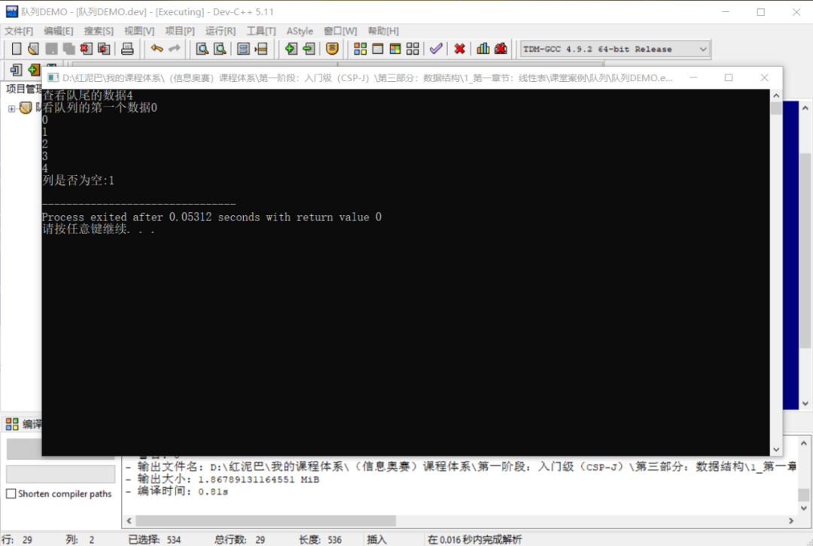

在上述创建`queue`时也可以指定`list`作为底层存储组件。

```cpp
queue<int,list<int> > myQueue;
```

改变底层依赖组件，对业务层面的实现不会产生任何影响 ，这也是适配器设计模式的优点。

### 2.2 Priority Queues

从优先队列中删除数据时，并不一定是按`先进先出`的原则，而是遵循优先级法则，优先级高的数据先出队列，与数据的存储顺序无关。类似于现实生活中的`VIP`客户一样。

**优先队列的常规方法：**

|   方法    |             功能说明             |
| :-------: | :------------------------------: |
| `empty()` |    如果优先队列为空，则返回真    |
|  `pop()`  |          删除第一个元素          |
| `push()`  |           加入一个元素           |
| `size()`  |  返回优先队列中拥有的元素的个数  |
|  `top()`  | 返回优先队列中有最高优先级的元素 |

**创建并初始化优先队列：**

使用之前，先查阅 `priority_queue`的源代码。

```cpp
template<typename _Tp, typename _Sequence = vector<_Tp>,typename _Compare  = less<typename _Sequence::value_type> >
class priority_queue
{
//……
}
```

从源代码可知，优先队列属于容器适配器组件，本身并不提供具体的存储方案，使用时，需要指定一个`容器对象`用于底层存储(默认是 `vector`容器)。除此之外，还需要一个能对数据进行优先级判定的对象。

当存储的数据是基本类型时，可以使用内置的函数对象进行比较。

```cpp
//升序队列
priority_queue <int,vector<int>,greater<int> > q;
//降序队列
priority_queue <int,vector<int>,less<int> > q_;
```

> `greater`和`less`是内置的两个函数对象。

如果是对自定义类型进行比较，则需要提供自定义的比较算法，可以通过如下的 `2` 种方式提供：

- `lambda`函数。

```cpp
auto cmp = [](pair<int, int> left, pair<int, int> right) -> bool { return left.second > right.second; };
priority_queue<pair<int, int>, vector<pair<int, int>>, decltype(cmp)>  pri_que(cmp);
```

- 自定义函数对象。要求函数对象中重写`operator()`函数，如此，对象便能如函数一样使用。

```cpp
struct com_{
 bool operator()(const pair<int, int>& left, const pair<int, int>& right) {
  return left.second > right.second;
}};
priority_queue<pair<int,int>,vector<pair<int, int>>,com_> pri_que2;
```

**操作实例：**

实例功能要求：使用优先队列存储运算符，获取运算符时，按运算符的优先级出队。

```cpp
#include <iostream>
#include <queue>
using namespace std;
//运算符对象
struct Opt {
 //运算符名
 char name;
 //运算符的优先级
 int jb;
 void desc() {
  cout<<name<<":"<<jb<<endl;
 }
};
//函数对象，提供优先级队列的比较法则
struct com {
 bool operator()(const Opt& opt1, const Opt& opt2) {
  return opt1.jb<opt2.jb;
 }
};
int main(int argc, char** argv) {
 priority_queue<Opt ,vector<Opt>,com> opt_que;
 //添加运算符
 Opt opt= {'+',1} ;
 opt_que.push(opt);
 opt= {'*',2} ;
 opt_que.push(opt);
 opt= {'(',3} ;
 opt_que.push(opt);
 opt= {')',0} ;
 opt_que.push(opt);
 //出队列
 int size= opt_que.size();
 for(int i=0; i<size; i++) {
  Opt tmp=opt_que.top();
  opt_que.pop();
  tmp.desc();
 }
 cout<<"队列是否为空:"<<opt_que.empty()<<endl;
 return 0;
}
```

输出结果：

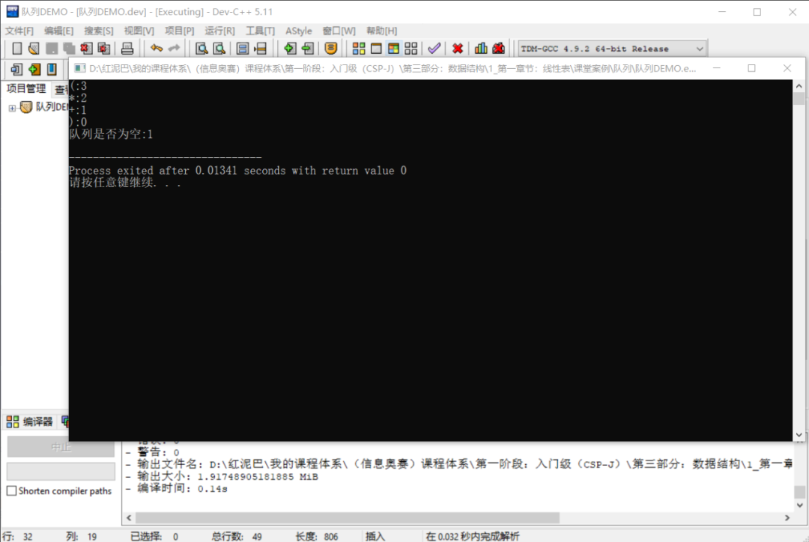

### 2.3 deque

前面的`queue`对象本质是在`deque`的基础上进行重新适配之后的组件，除此之外，`STL`中的`stack`也是……

`deque`也称为双端队列，在两端都能进行数据的添加、删除。可以认为`deque`是一个伸缩性很强大的基础功能组件，对其进行某些功能的屏蔽或添加，便能产生新组件。

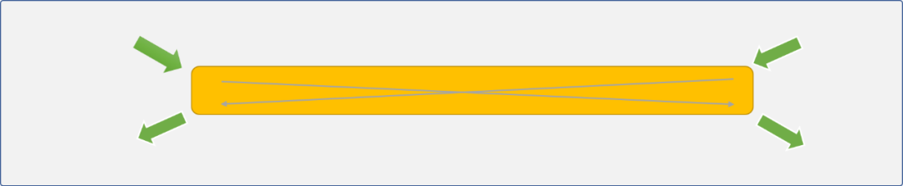

`deque`的相关方法如下：

- `push_back()`：在队尾添加数据。
- `pop_back()`：数据从队尾出队列。
- `push_front()`：在队头添加数据。
- `pop_front()`：数据从队头出队列。

如果只允许使用`push_back()`和`pop_back()`或`push_front()`和`pop_front()`方法，就可以模拟出栈的存储效果。类似的，如果禁用`pop_back()`和`push_front()`则可以模拟出普通队列的存储效果……

可能会问，为什么选择`deque`作为基础组件，难道它有什么先天性优势吗？

这个就需要从它的物理结构说起。

`deque`物理结构中的基本存储单位称为段，段是一个连续的可存储 `8` 个数据的顺序区域。一个`deque`对象由很多段组成，段与段在物理空间上并不相邻，而是通过一个中央控制段存储其相应地址。

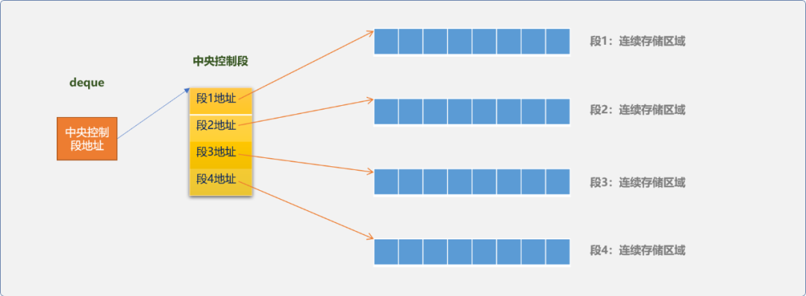

`deque`具有顺序存储的查询性能优势也具有链式存储的插入、删除方面的性能优势。因为它在物理结构上完美地融合了顺序存储思想和链式存储思想。

> 在一个段上进行数据查询是很快的，即使有插入和删除操作也只会对本段的性能有影响，而不会拖累整体性能。

**操作实例：**

```cpp
#include <iostream>
#include <vector>
#include <deque>
using namespace std;
int main(int argc, char *argv[]) {
 int ary[5] = {1, 2, 3, 4, 5};
 //使用数组初始化 vector
 vector<int> vec( &ary[0], &ary[4]+1 );
 //使用 vector 初始化双端队列
 deque<int> myDeque( vec.begin(), vec.end() );
 //队头插入数据
 myDeque.push_front( 0 );
 //队尾插入数据
 myDeque.push_back( 6 );
 cout<<"查看队头数据 : "<<myDeque.front()<<endl;
 cout<<"查看队尾数据: "<<myDeque.back()<<endl;
 //双端队列支持迭代器查询
 deque<int>::iterator iter = myDeque.begin();
 while( iter != myDeque.end() ) {
  cout<<*(iter++)<<' ';
 }
 cout<<endl;
 //双端队列支持下标访问方式
 cout<<"a[3] = "<<myDeque[3] << endl;
 //支持迭代器删除
 myDeque.erase( myDeque.begin() );
 //删除头部删除
 myDeque.pop_front();
 // 删除尾部元素
 myDeque.pop_back();
 cout<<"查看队头数据: "<<myDeque.front()<<endl;
 cout<<"查看队尾数据: "<<myDeque.back()<<endl;
 return 0;
}
```

执行后输出结果：

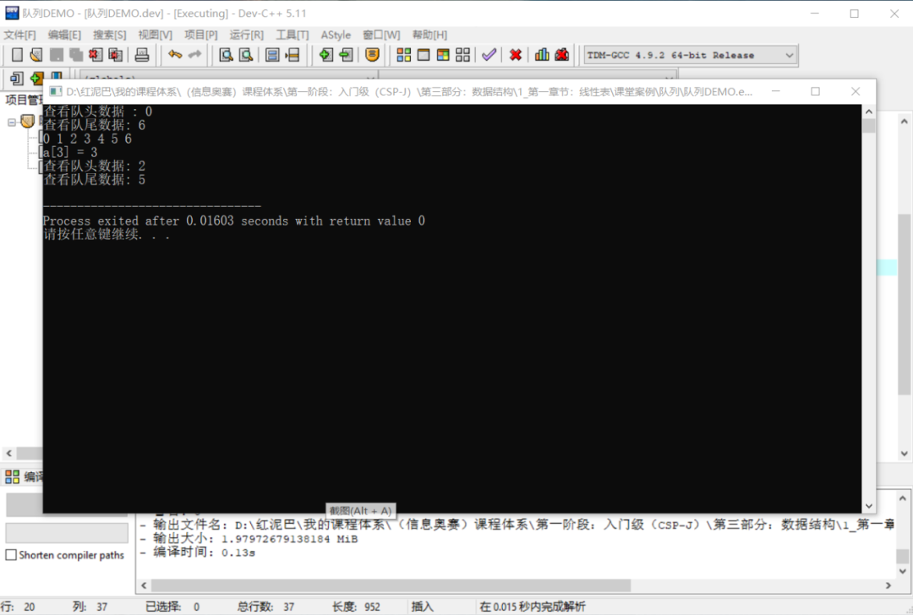

## 3. 自定义队列

队列有 2 种实现方案：

- 顺序实现，基于数组的实现方案。
- 链表实现，基于链表的实现方案。

### 3.1  顺序实现

顺序实现底层使用数组作为具体存储容器。实现之初，需要创建一个固定大小的数组。

### 3.1.1 思路

数组是开发式的存储容器，为了模拟队列，可以通过 `2` 个指针用来限制数据的存和取：

- `front`：指向队头的指针，用来获取队头数据。总是指向最先添加的数据。
- `rear`：指向队尾的指针，用来在队尾添加数据。

初始，`front`和`rear`指针可以指向同一位置，可以是下标为`0`位置。如下图所示：

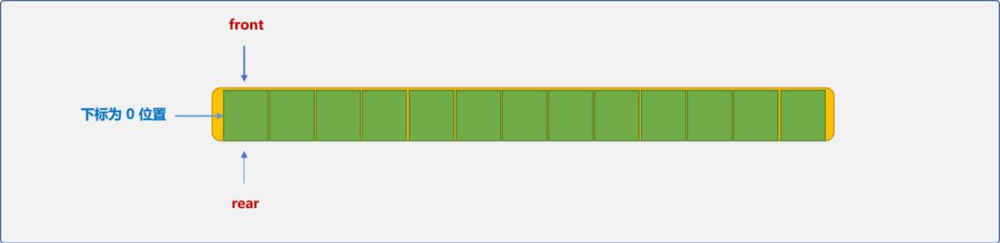

可以根据`front`和`rear`所指向位置是否相同，而判断队列是否为空。

```cpp
如果 front==rear: 
     表示当前队列是空的
```

**入队操作：**

- 将数据存储在`rear`所指向位置，再把`rear`向右边移动一个位置（`rear`总是指向下一个可用的位置）。

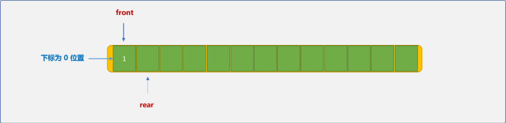

- 当`rear`超出数组的边界，即下标为数组的长度时，表示队列已经满了。

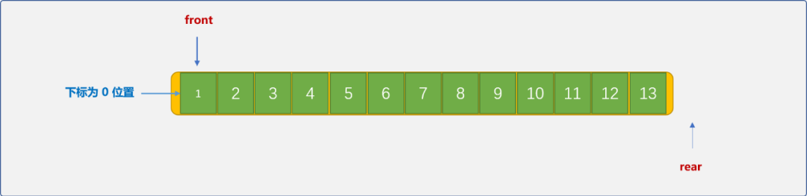

```cpp
如果 rear==数组长度
    表示队列已经满了
```

**出队操作：**

出队操作可以有 `2` 个方案。

- `front`固定在下标为 `0`的位置，从队列删除一个数据后，后续数据向前移动一位，并把`rear`指针向左移动一位。如下图是删除数据`1`后的演示图：

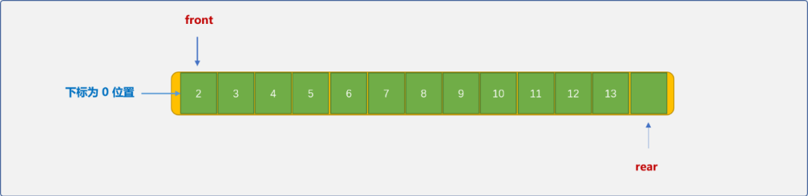

这种方案的弊端是，每删除一个数据，需要后续数据整体向左移动，时间复杂度为`O(n)`，性能偏低。

- 从`front`位置处提取数据后，`front`指针向右边移动。

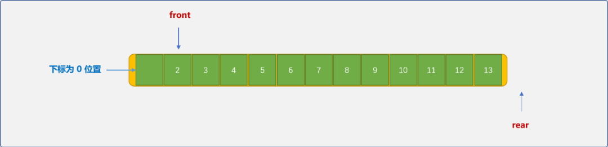

以`front`位置为队头，而不是以数组的绝对位置`0`为队头。这种方案的优势很时显，时间复杂度为`O(1)`。

但会出现`假溢出`的现象，如上图示，删除数据`1`后，留下了一个可用的空位置，因`rear`指针是向右移动的，并不知前面有空的位置，从而也无法使用此空位置。

针对于这种情况，可以让`rear`指针在超过下标界限后，重头再开始定位，这样的队列称为循环队列。

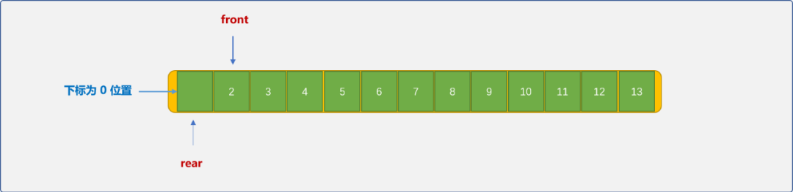

前文说过，当`front`和`rear`指针相同时，认定队列为空。在循环队列，当入队的速度快于出队速度时，`rear`指针是可以追上`front`指针的。如下图所示：

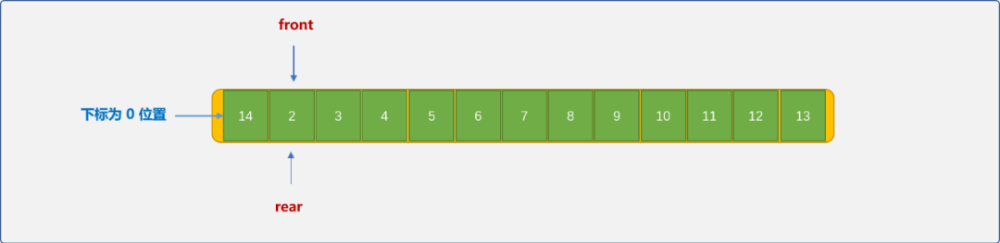

这时队列为满负荷状态。也就是说，`front`等于`rear`时，队列有可能是空的也有可能是满的。

可以使用 `2` 种方案解决这个问题：

- **计数器方案**。使用计数器记录队列中的实际数据个数。当`num==0`时队列为空状态，当`num==size`时队列为满状态。
- **留白方案**：存储数据时，从`rear+1`位置开始，而不是存储在`rear`位置。或者说下标为 `0`的位置空出来。

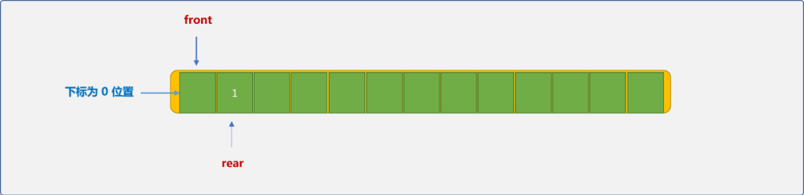

这样，当`rear+1`等于`front`时，可判定队列为满状态。

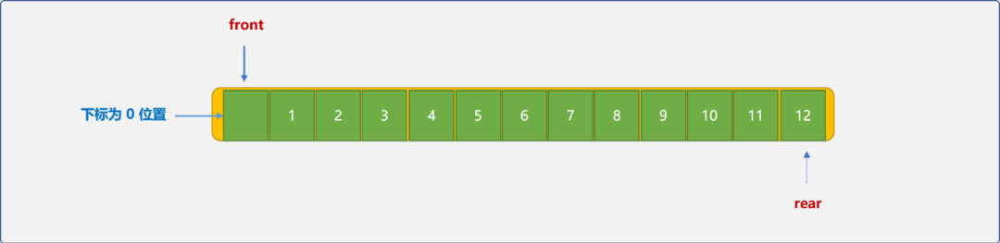

注意，在获取队头数据时，需要先把`front`向右移一位。

#### 3.1.2 编码实现

**循环队列类（留白方案）：**

```cpp
class MyQueue {
 private:
  //数组
  int *queue;
  int front;
  int rear;
  int size;
 public:
  //构造函数
  MyQueue(int queueSize=10):size(queueSize),front(0),rear(0) {
   this->queue=new int[queueSize];
  }
  //析构函数
  ~ MyQueue() {
   delete[] queue;
  }
  //队列是否为空
  bool isEmpty() {
   return this->front==this->rear;
  }
  //数据入队列
  bool push_back(int data) {
   //需要判断队列是否有空位置
   if  (((this->rear+1)%this->size)!=this->front) {
    //获取当前可存储位置
    this->rear=(this->rear+1) % this->size;
    //存储数据
    this->queue[this->rear]=data;
    return true;
   }
   return false;
  }

  //数据出队列
  bool pop_front(int& data) {
   //队列不能为空
   if (this->rear!=this->front) {
    //头指针向右移动
    this->front=(this->front+1) % this->size;
    data=this->queue[this->front];
    return true;
   }
   return false;

  }
  //查看队头数据
  bool get_front(int & data) {
   //队列不能为空
   if (this->rear!=this->front) {
    //头指针向右移动
    int idx=(this->front+1) % this->size;
    data=this->queue[idx];
    return true;
   }
   return false;
  }
};
```

**测试队列：**

```cpp
#include <iostream>
using namespace std;
int main(int argc, char *argv[]) {
 MyQueue myQueue(5);
 //向队列中压入 4 个数据,注意，有一个位置是空着的
 for(int i=0; i<5; i++) {
  myQueue.push_back(i);
 }
 int data;
 myQueue.get_front(data);
 cout<<"队头数据："<<data<<endl;
 //队列已经满，测试是否还能压入数据
 int data_=5;
 bool is= myQueue.push_back(data_);
 if(is)
  cout<<"压入成功"<<endl;
 else
  cout<<"压入失败"<<endl;
 //把队列中的所有数据删除
 int tmp;
 for(int i=0; i<4; i++) {
  is= myQueue.pop_front(tmp);
  if(is)
   cout<<tmp<<endl;
 }
}
```

输出结果：

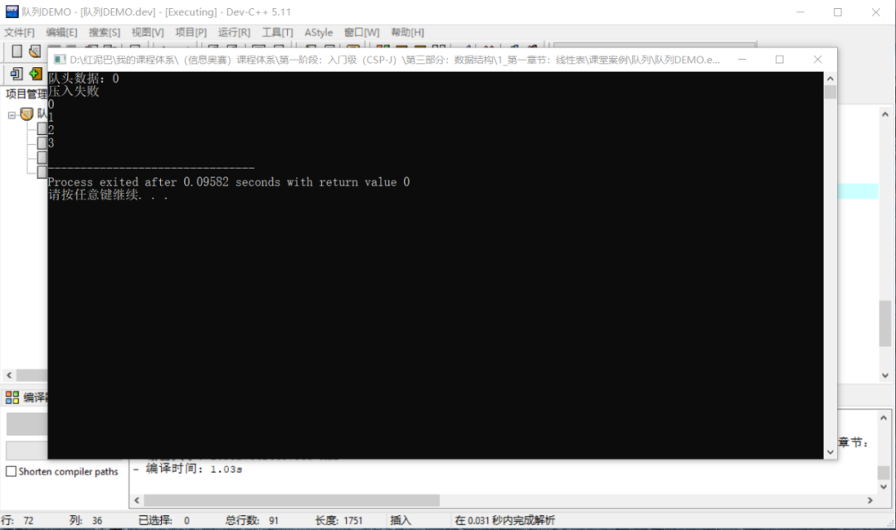

### 3.2  链式实现

链式实现队列时，数据可以从头部插入然后从尾部删除，或从尾部插入再从头部删除。本文使用尾部插入，头部删除方案。

- 链表实现时，需要头指针也需要尾指针。初始值都为`NULL`。

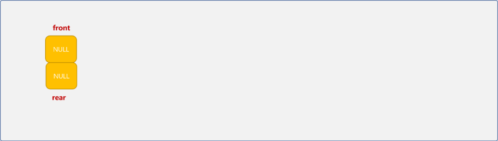

- 数据从尾部插入（每次添加的新结点成为新的尾结点），从头部删除。

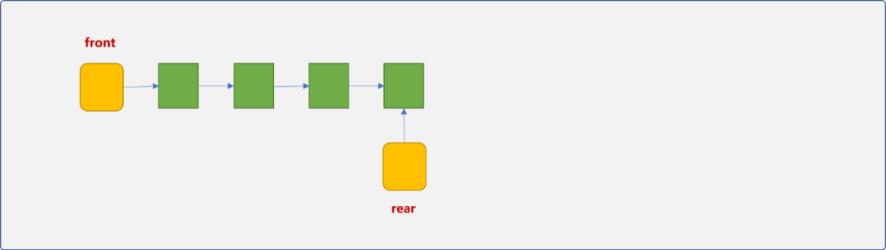

链式实现的过程简单清晰，就是在单链表上的数据添加和删除操作，具体细节这里就不再废话，直接上代码：

```cpp
#include <iostream>
using namespace std;
//链表的结点类型
struct QueueNode {
 int data;
 QueueNode* next;
 QueueNode() {
  this->next=NULL;
 };
};
class MyQueue_ {
 private:
  //数组
  QueueNode* front;
  QueueNode* rear;
 public:
  //构造函数
  MyQueue_() {
   this->front=NULL;
   this->rear=NULL;
  }
  //析构函数
  ~ MyQueue_() {
   QueueNode* p, *q;
   p=front;
   while(p) {
    q=p;
    p=p->next;
    delete q;
   }
   front=NULL;
   rear=NULL;
  }
  //队列是否为空
  bool isEmpty() {
   return this->front==NULL && this->rear==NULL;
  }
  //数据入队列
  bool push_back(int data) {
   //新结点
   QueueNode* p=new QueueNode();
   if(p) {
    //申请结点成功
    p->data=data;
    if(rear) {
     rear->next=p;
     rear=p;
    } else
     front=rear=p;
    return true;
   } else
    return false;
  }
  //数据出队列
  bool pop_front(int& data) {
   QueueNode* p;
   if(!isEmpty()) {   
                 //判断队列是否为空
    p=front;
    data=p->data;
    front=front->next;
    if(!front)
     rear=NULL;
    delete p;
    return true;
   }
   return false;
  }
  //查看队头数据
  bool get_front(int & data) {
   if(!isEmpty()) {
    data=front->data;
    return true;
   } else
    return false;
  }
};

int main(int argc, char *argv[]) {
 MyQueue_ myQueue;
 //向队列中压入 4 个数据,注意，有一个位置是空着的
 for(int i=0; i<5; i++) {
  myQueue.push_back(i);
 }
 int data;
 myQueue.get_front(data);
 cout<<"队头数据："<<data<<endl;
 //队列已经满，测试是否还能压入数据
 int data_=5;
 bool is= myQueue.push_back(data_);
 if(is)
  cout<<"压入成功"<<endl;
 else
  cout<<"压入失败"<<endl;
 //把队列中的所有数据删除
 int tmp;
 for(int i=0; i<4; i++) {
  is= myQueue.pop_front(tmp);
  if(is)
   cout<<tmp<<endl;
 }
}
```

**输出结果：**


## 4. 总结

本文讲解了`STL`中的队列组件，以及如何通过顺序表和链表模拟队列。


