# C++ "链链"不忘@必有回响之双向链表


## 1. 前言

写过一篇与`单链表`相关的博文，实际应用中，双向循环链表的功能更强大。

单链表中，查询一个已知结点的后驱结点的时间复杂度为`O(1)`。因结点本身不存储与前驱结点相关的地址信息，查询前驱结点需要从头结点扫描一次，时间复杂度为`O(n)`。

`双向链表为结`点类型增加了可以存储前驱结点地址的指针位，如下图所示：


如此，无论查询已知结点的后驱还是前驱结点的时间复杂度都是`O(1)`，缺点是需要付出空间上的代价。

> 在权衡算法性能时，会优先考虑时间复杂度的优劣，往往会采用空间换时间的策略。

结点的类型定义：

```cpp
typedef int dataType;
//结点
struct LinkNode {
 //数据成员
 dataType  data;
 //后驱结点的地址
 LinkNode *next;
 //前驱结点的地址
 LinkNode *pre;
 //构造函数
 LinkNode(dataType data) {
  this->data=data;
  this->next=NULL;
  this->pre=NULL;
 }
};
```

## 2. 双向链表

`双向链表`中除了有存储头结点的`head`头指针变量外，一般还会增加一个存储尾结点的名为`tail`尾指针变量。这样，可以实现从头到尾或从尾到头对链表进行遍历。

> 为了操作的方便，初始化链表时都会提供一个空白的头结点作为标识结点。

在`双向链表`中，在尾结点的后驱指针位存储头结点地址，头结点的前驱指针位存储尾结点地址，形成一个首尾相连的闭环，称这样的链表为`双向循环链表`。

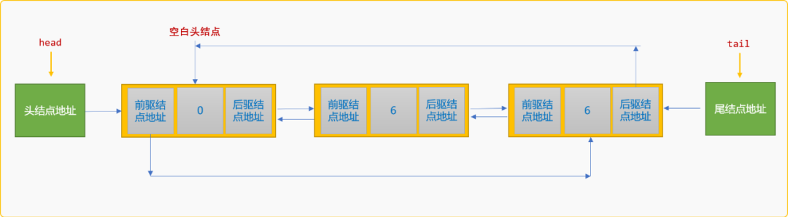

双向链表需要提供对链表中的数据进行常规维护的算法，如：

- 链表初始化。
- 创建链表。
- 查找。
- 后插入、前插入。
- 删除。
- ……

算法的整体思路和单链表相似，因结点中多了一个前驱结点信息，为各种操作带来便利的同时，需要注意细节。下文将介绍双向链表中的几个重要函数。

### 2.1  初始化

如果是双向循环链表，初始化时：

- `head`和`tail`指向空白头结点。
- 且`head`的前驱结点和`tail`的后驱结点也指向空白头结点。这个过程也可以放到创建链表时实现。

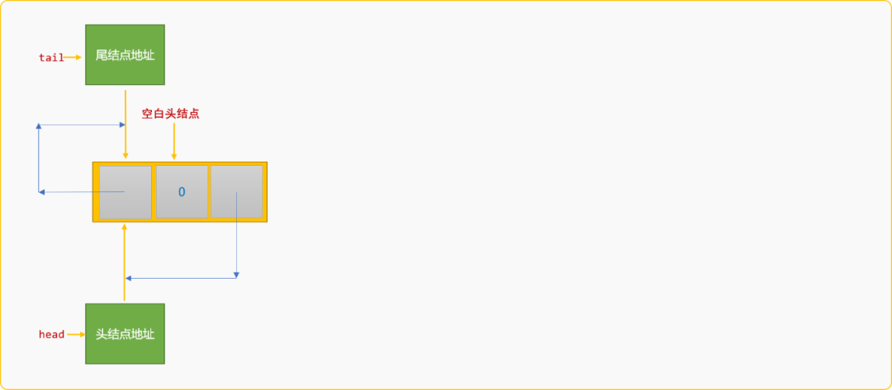

```cpp
class LinkList {
 private:
  //头指针
  LinkNode *head;
     //尾指针
  LinkNode *tail;
  //链表的长度
  int length;
 public:
        //构造函数
  LinkList() {
   this->initLinkList();
  }
  //初始化链表
  void  initLinkList() {
             //头指针存储空白头结点地址
   this->head=new LinkNode(0);
   //尾指针和头指针位置相同
   this->tail=this->head;
             //尾结点的后驱结点是头结点
   this->tail->next=this->head;
             //头结点的前驱结点是尾结点
   this->head->pre=this->tail; 
  }
       //……其它函数
```

### 2.2 创建链表

可以使用头部插入或尾部插入算法创建链表，本文仅介绍尾部插入创建算法，头部创建算法可自行了解。如下演示使用尾部创建法构建以数列`{7，3}`为数据的链表。

- 创建值为`7`的新结点`n`。

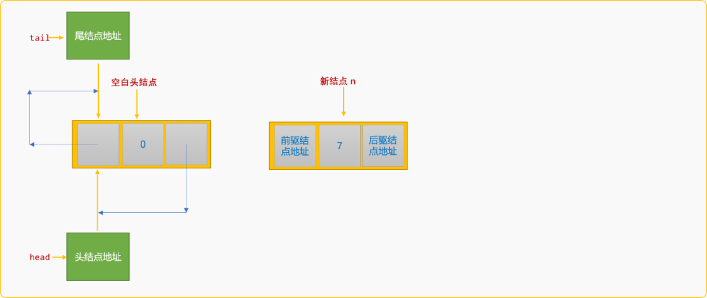

- 设置新结点`n`的前驱结点为原尾结点。

```cpp
n->pre=tail;
```

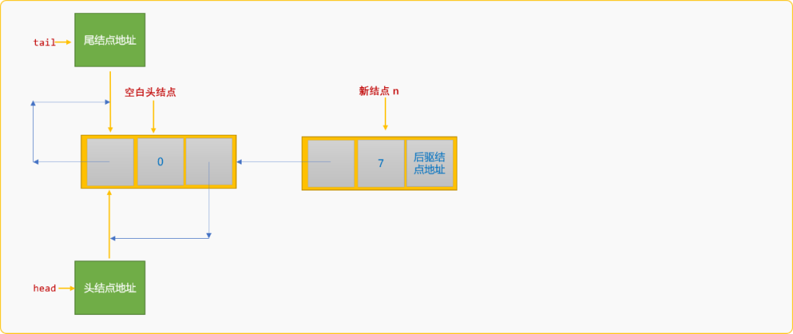

- 设置新结点`n`的后驱结点为原尾结点的后驱结点。

```cpp
n->next=tail->next;
```


- 设置原尾结点的后驱结点为新结点`n`。

```cpp
tail->next=n;
```

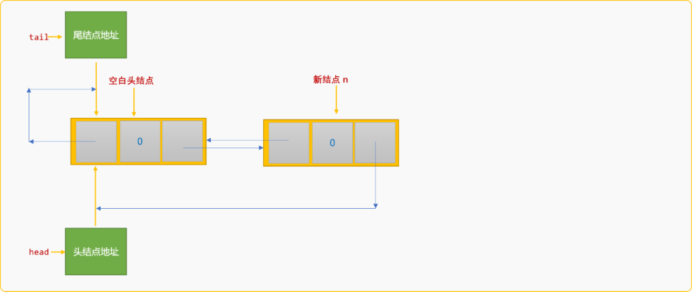

- 新结点`n`成为新的尾结点。

```cpp
tail=n;
```

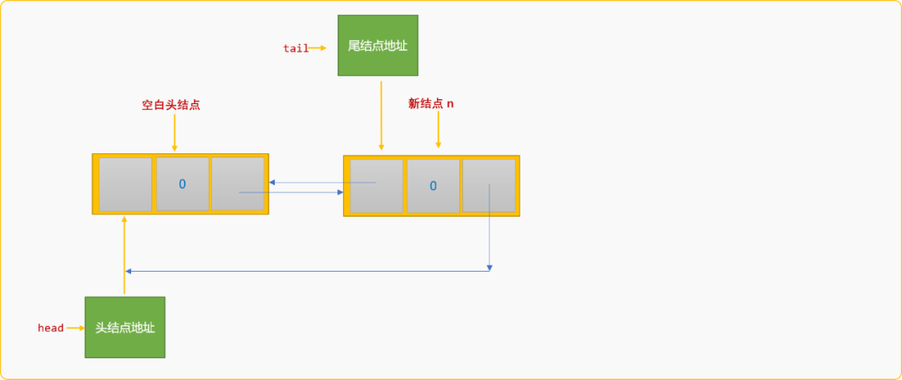

- 设置头结点的前驱结点为新的尾结点。

```cpp
head->pre=tail;
```

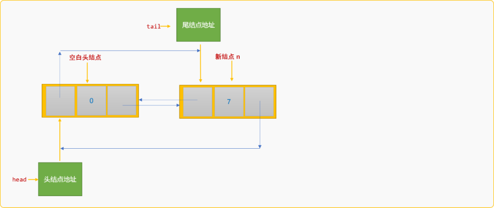

重复上述流程，最终完成链表的创建过程。

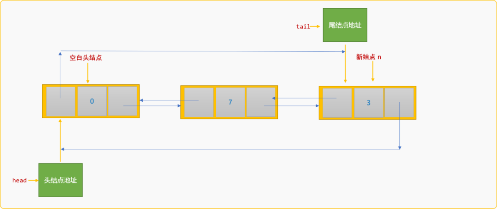

**是否可以无视上述创建流程中的顺序？**

全局而言，顺序基本是要遵循上述的要求，原则是`新结点->尾结点->头结点`。

- **新结点**：先设置新结点的前驱和后驱结点的地址。新结点的相应存储位都是空白的，先设置前驱还是后驱不影响结果。
- **尾结点**：修改原尾结点的后驱结点地址为新结点，原尾结点的使命完成后，再指定新结点为新的尾结点。
- **头结点**：修改头结点的前驱地址为新尾结点。

**编码实现：**

```cpp
//尾部插入方式创建链表
void createFromTail(int n) {
 LinkNode *newNode,*p,*tail;
 //头结点地址
 p=this->head;
    //尾结点地址
    tail=this->tail;
    for(int i=0; i<n; i++) {
        //构建一个新结点
        newNode=new LinkNode(0);
        cout<<"请输入结点数据"<<endl;
        cin>>newNode->data;
        //原来的尾结点成为新结点的前驱结点
        newNode->pre=tail;
        //新结点的后驱结点为原来的尾结点的后驱结点 
        newNode->next=tail->next;
        //原尾结点的后驱结点为新结点
        tail->next=newNode;     
        //新结点成为新的尾结点
        tail=newNode;
        //头结点的前驱为新尾结点
        head->pre=tail; 
    }
    this->head=p;
    this->tail=tail;
}
```

测试尾部创建：

```cpp
int main(int argc, char** argv) {
 LinkList list {};
 list.createFromTail(2);
 //没删除之前
 cout<<"显示创建结果:"<<endl;
 LinkNode *head= list.getHead();
 cout<<"从头结点向尾结点方向搜索："<<endl;
 cout<<head->next->data<<endl;
 cout<<head->next->next->data<<endl;
 LinkNode *tail=list.getTail();
 cout<<"从尾结点向头结点方向搜索 ："<<endl;
 cout<<tail->data<<endl;
 cout<<tail->pre->data<<endl; 
 head=tail->next;
 cout<<"从尾结点的后驱信息位得到头结点信息 ："<<endl;
 cout<<head->next->data<<endl;
 cout<<head->next->next->data<<endl;
 return 0; 
}
```

执行结果：

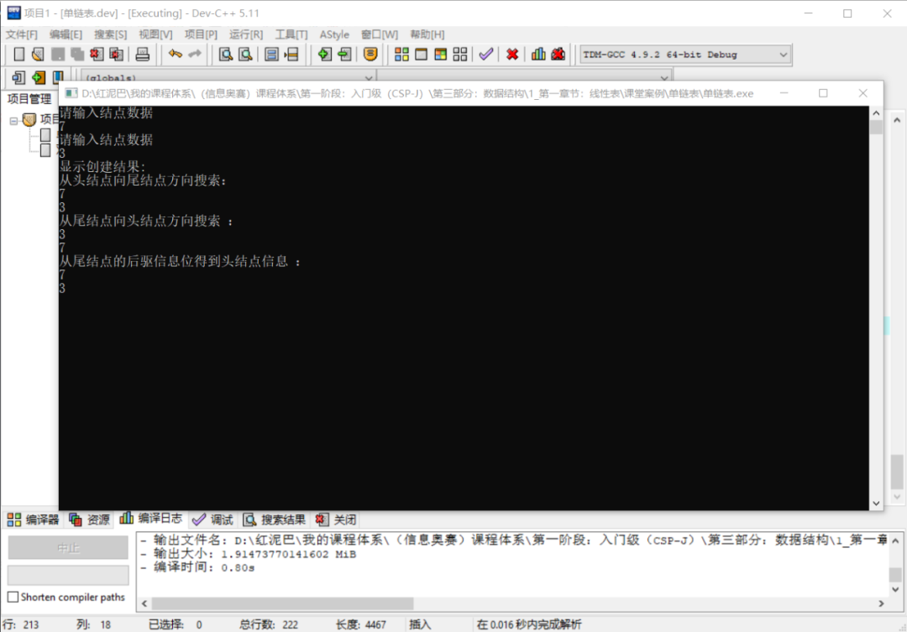

### 2.3 查找

因`双向链表`的头尾是相连的，其查询方案可以很多：

- **按位置查找：**按位置查找建议从头结点开始。
- **按值查找：**按值查找可以从头结点或从尾结点开始。
- **查询所有：**查询所有可以从头结点也可以从尾结点开始。

### 2.3.1 按位置查找

设空白头结点编号为`0`，从头结点向尾结点扫描过程中，给扫描到的结点依次编号，当查询到和指定参数相同的编号时停止。

```cpp
//按位置查询结点（从头部扫描到尾部） 
LinkNode * findNodeByIndex(int index) {
    int j=0;
    LinkNode *p=this->head;
    if(index==j)
        //如果 index 值为 0 ，返回空白头结点
        return p;
    //第一个数据结点 
    p=p->next;
    //设置第一个数据结点的编号为 1 ，当然这不是绝对，可以根据自己的需要设置编号
    j=1;
    while(p!=this->head && j<index) {
        p=p->next;
        j++;
    }
    if(j==index)return p;
    else return NULL;
}
```

#### 2.3.2 按值查找

按值查找可以有 `2` 种方案：

- 头结点向尾结点方向查找。

```cpp
//按值查询结点
LinkNode * findNodeByVal(dataType val) {
    //从第一个数据结点开始查找
    LinkNode *p=this->head->next;
    //当 p 再次指向头结点结束查找，这也空白结点存在的意义
    while(p!=this->head && p->data!=val ) {
        p=p->next;
    }
    if(p!=this->head) {
        return p;
    } else {
        return NULL;
    }
}
```

- 尾结点向头结点方向查找。

```cpp
LinkNode * findNodeByValFromTail(dataType val) {
    //从尾结点开始查找
    LinkNode *p=this->tail;
    while(p!=this->head && p->data!=val ) {
        //向头结点方向
        p=p->pre;
    }
    if(p!=this->head) {
        return p;
    } else {
        return NULL;
    }
}
```

#### 2.3.3 查询所有

- 从头结点向尾结点方向查询所有结点。

```cpp
void showSelf() {
    if(this->head==NULL)return;
    //得到第一个数据结点
    LinkNode *p=this->head->next;
    while(p!=this->head) {
        cout<<p->data<<"\t";
        p=p->next;
    }
}
```

- 从尾结点向头结点方向查询所有结点。

```cpp
void showSelf_() {
    if(this->tail==NULL)return;
    LinkNode *p=this->tail;
    while(p!=this->head) {
        cout<<p->data<<"\t";
        p=p->pre;
    }
}
```

### 2.4 插入

插入有前插入和后插入 `2` 种方案，于双向链表而言，其时间复杂度都为`O(1)`。

#### 2.4.1 后插入

把新结点插入到已知结点的后面，称为后插入，其插入流程如下所示：

- 找到已知结点`p`，创建新结点`n`。


- 设置`n`结点的前驱结点为已知结点`p`，设置其后驱结点为已知结点`p`的后驱结点。

```cpp
n->pre=p;
n->next=p->next;
```

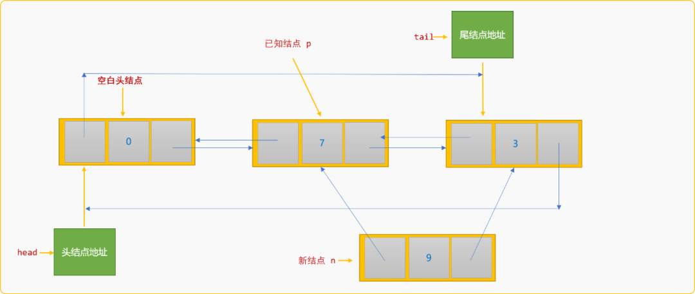

- 设置`p`结点的后驱结点为`n`结点。

```cpp
p->next=n;
```


- 设置结点`n`为其后驱结点的前驱结点。

```cpp
n->next->pre=n;
```

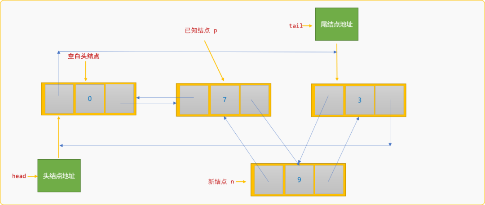

编码实现：

```cpp
 //后插入
int instertAfter(dataType val,dataType data) {
    //按值查找到结点
    LinkNode *p=this->findNodeByVal(val);
    if (p==NULL) {
        //结点不存在，返回 false
        return false;
    }
    //创建新结点
    LinkNode *n=new LinkNode(0);
    n->data=data;
    //设置 p 结点为新结点的前驱结点 
    n->pre=p;
    //新结点的后驱结点为已知结点 p 的后驱结点
    n->next=p->next;
    //已知结点的后驱结点为新结点
    p->next=n;  
    //已知结点的原后驱结点的前驱结点为新结点
    n->next->pre=n;
    return true;
}
```

**测试后插入：**

```cpp
int main(int argc, char** argv) {
 LinkList list {};
 //创建 7,3 两个结点
    list.createFromTail(2);
    //在结点 7 后面插入值为 9 的结点
 list.instertAfter(7,9);
 list.showSelf();
    return 0;
}
```

执行结果：

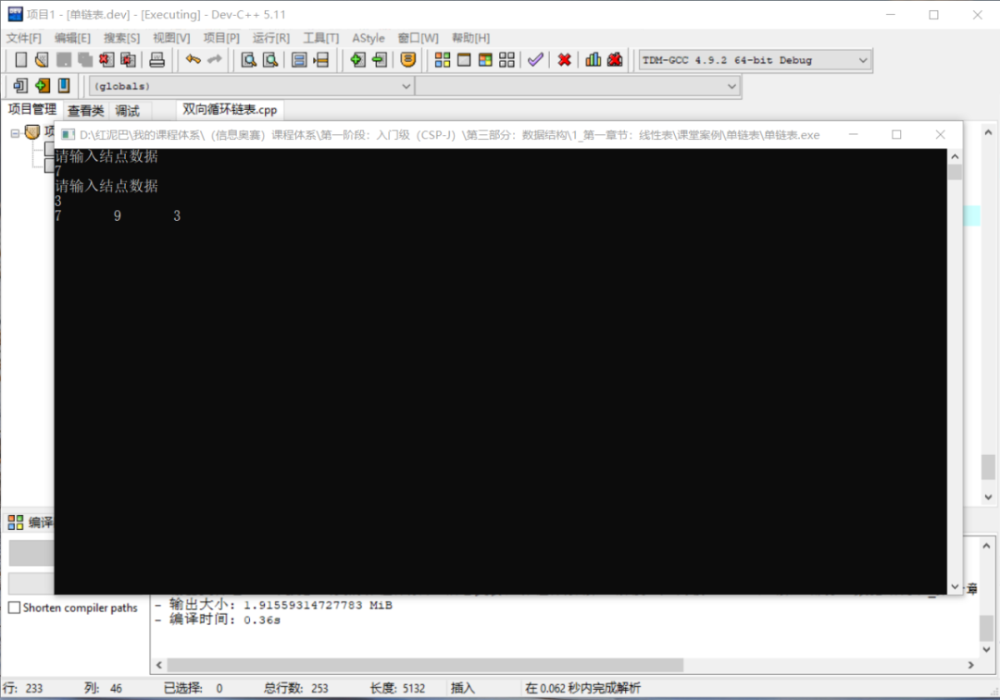

#### 2.4.2 前插入

把新结点插入到已知结点的前面，称为前插入，因结点有前驱结点的地址信息，双向链表的前或后插入都较方便。

- 找到已知结点`p`，创建新结点`n`。


- 设置结点`n`的前驱结点为`p`的前驱结点，设置其后驱结点为`p`结点。

```cpp
n->pre=p->pre;
n-next=p;
```


- 设置`p`结点的前驱结点的后驱结点为`n`。

```cpp
p->pre->next=n;
或
n->pre->next=n;
```


- 设置`p`结点的前驱结点为`n`结点。

```cpp
p->pre=n;
```

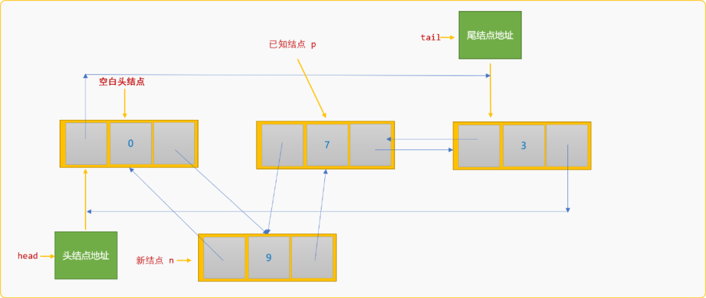

**编码实现：**

```cpp
//前插入
int insertBefore(dataType val,dataType data) {
    //按值查找到结点
    LinkNode *p=this->findNodeByVal(val);
    if (p==NULL)
        return false;
    //查找前驱结点
    LinkNode *p1=this->head;
    while(p1->next!=p) {
        p1=p1->next;
    }
    //构建新结点
    LinkNode *n=new LinkNode(0);
    n->data=data;
    //新结点的后驱为 p 结点
    n->next=p;
    //新结点的前驱为 p 的前驱
    n->pre=p->pre;
    //p 的前驱结点的后驱结点为 n
    p->pre->next=n;
    //p 的前驱结点为 n
    p->pre=n;
    return true;
}
```

**测试前插入：**

```cpp
int main(int argc, char** argv) {
 LinkList list {};
 //创建 7,3 两个结点
 list.createFromTail(2);
    //在值为 7 的结点前面插入值为 9 的结点
 list.insertBefore(7,9);
 list.showSelf();
    return 0;
}
```

执行结果：

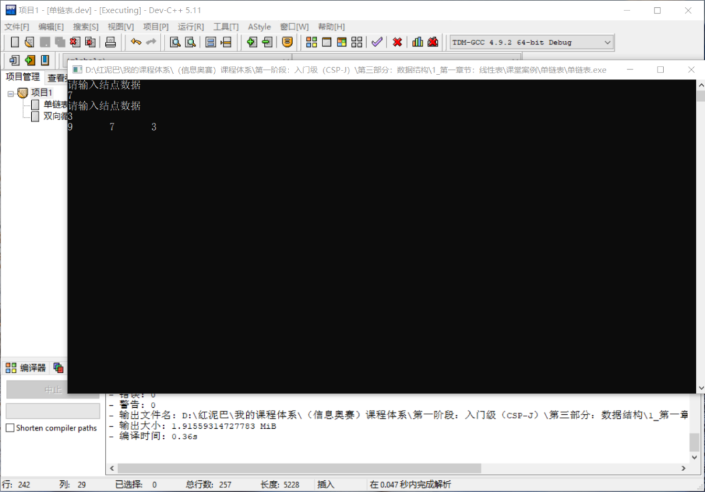

### 2.5 删除

#### 2.5.1 删除结点

删除已知结点的基本操作流程：

- 查找到要删除的结点`p`。

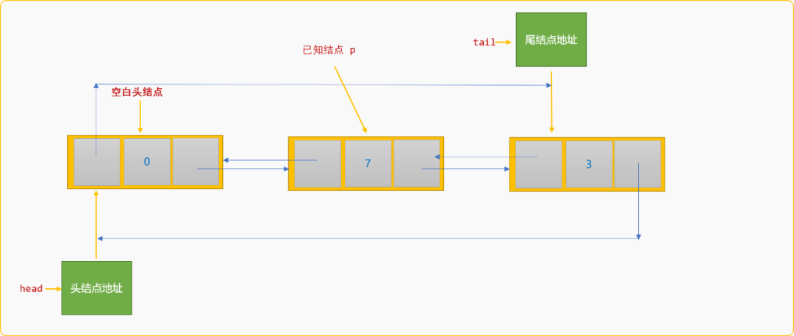

- 找到结点`p`的前驱结点，设置其后驱结点为`p`的后驱结点。

```cpp
p->pre->next=p->next;
```

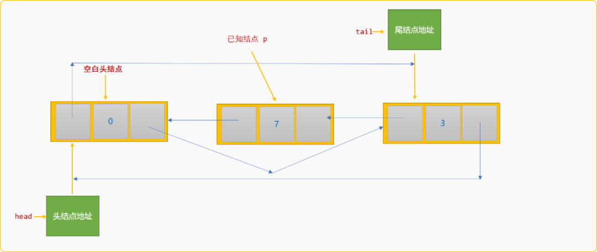

- 找到`p`结点的后驱结点，设置其前驱结点为`p`结点的前驱结点。删除`p`结点。

```cpp
p->next->pre=p->pre;
delete p;
```

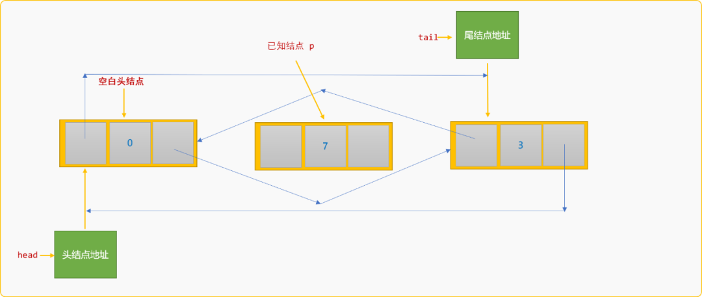

编码实现：

```cpp
int delNode(dataType data) {
    //按值查找到要删除的结点
    LinkNode *p= this->findNodeByVal(data);
    if (p==NULL)return false;  
    //设置 p 的前驱结点的后驱结点 
    p->pre->next=p->next;
    p->next->pre=p->pre;
    delete p;
    return true;
}
```

测试删除操作：

```cpp
LinkList list {};
//创建 {7,3,9} 3个结点
list.createFromTail(3);
//LinkNode *res= list.findNodeByValFromTail(4);
list.delNode(3);
list.showSelf();
```

执行结果：

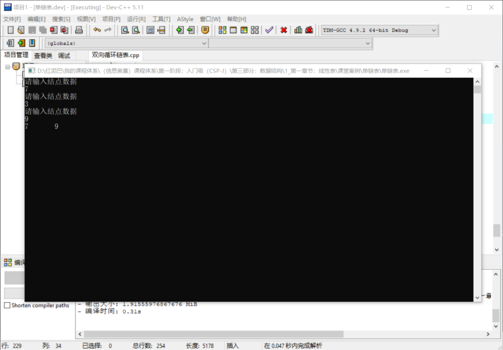

#### 2.5.2 删除所有结点

编码实现：

```cpp
void delAll() {
    LinkNode *p=this->head->next;
    //临时结点
    LinkNode *p1;
    while(p!=this->head) {
        //保留删除结点的后驱结点
        p1=p->next;
        delete p;
        p=p1;
    }
    this->head=NULL;
}
```

## 3. 算法案例

界定数列的要求：对于一个无序数列，首先在数列中找出一个基数，然后以基数为分界点，把小于基数的数字放在基数前面，反之放在后面。

### 3.1 演示流程

使用`双向链表`实现界定数列的流程。

- 已知的无序数列：

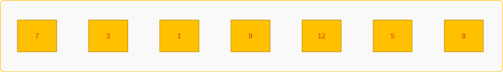

- 选择基数。这里选择第一个数字 `7` 作为基数。保存在临时变量 `tmp`中。声明 `2` 个变量 `left`、`right`，分别指向第一个数据和最后一个数据。


- 从 `right`位置开始扫描整个数列，如果 `right`位置的数字大于 `tmp`中的值，则继续向左移动`right`指针直到遇到比 `tmp`中值小的数字，然后保存到 `left`位置。


- 对`left`指针的工作要求：当所处位置的数字比`tmp`值小时，则向右边移动直到遇到比`tmp`值大的数字，然后保存至`right`。

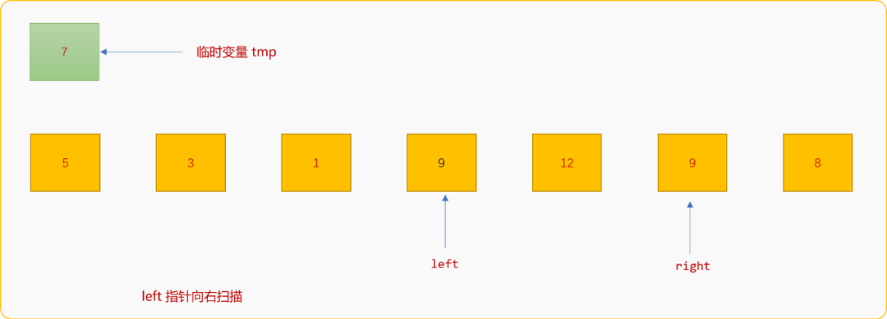

- 重复上述过程，直到 `left`和`right`指针重合。


- 最后把`tmp`中的值复制到`left`和`right`指针最后所指向的位置。最终实现以数字`7`界定整个数列。

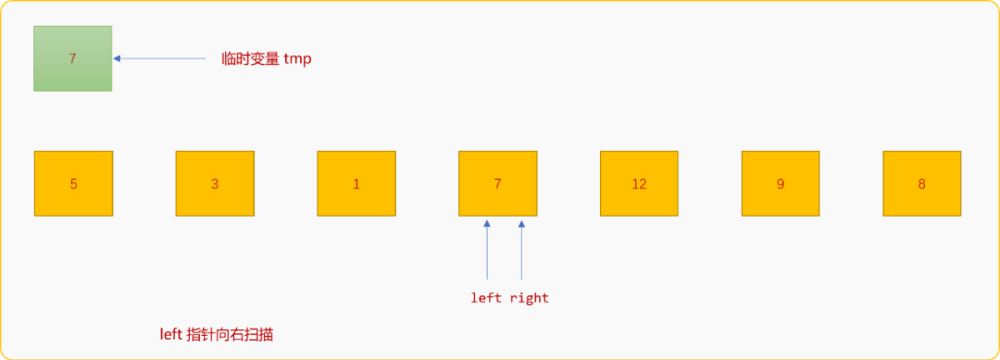

### 3.2 算法实现

使用双向链表实现上述需求：

- 初始化链表，并以尾部插入方式（保证数列的逻辑顺序和物理顺序一致）创建数列`{7,3,1,9,12,5,8}`。

```cpp
int main(int argc, char** argv) {
 LinkList list {}; 
 list.createFromTail(7);
 //没删除之前
 cout<<"显示创建结果:"<<endl; 
 list.showSelf();
 return 0;
}
```

执行后结果：

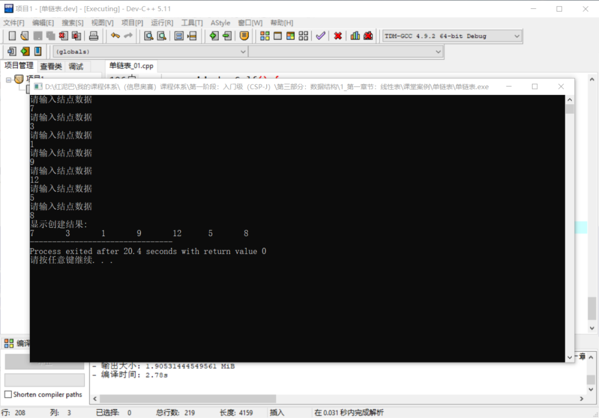

- 编写界定算法。

```cpp
void  baseNumBound() {
    //第一个数据结点的数据作为界定数字
    int tmp=this->head->next->data;
    //左指针，指向第一个数据结点
    LinkNode *left=this->head->next;
    //右指针，指向尾结点
    LinkNode *right=this->tail;

    while(left!=right) {
        while(left!=right && right->data>tmp) {
            //右指针向左移动
            right=right->pre;
        }
        left->data=right->data;
        while(left!=right && left->data<tmp) {
            //左指针向右移动
            left=left->next;
        }
        right->data=left->data;
    }
    left->data=tmp;
}
```

测试代码：

```cpp
int main(int argc, char** argv) {
 LinkList list {};
 list.createFromTail(7);
 //没删除之前
 cout<<"显示链表的创建结果:"<<endl;
 list.showSelf();
 list.baseNumBound();
 cout<<"\n显示界定后的数列："<<endl;
 list.showSelf();
 return 0;
}
```

执行结果：

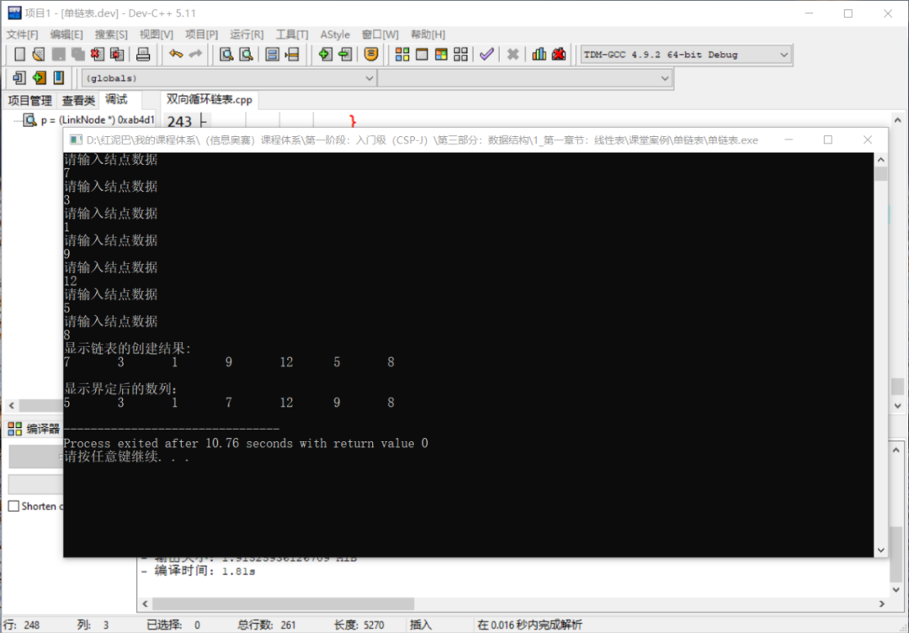

有了双链表，实现界定数列简单明了。

## 4. 总结

双向链表的结点多了一个前驱指针位，对其内部数据的维护提供了大大的便利。已知数据越多，算法也将会更大灵活伸缩空间。


