# C++ 线性数据结构系列之低调而强大的单调栈


## 1. 前言

`单调栈`是在栈基础上进行变化后的数据结构。除了遵循栈的`先进后出`的存储理念，在存储过程中还需保持栈中数据的有序性。

根据栈中数据排序的不同，**单调栈**分为：

- **单调递增栈**：从栈顶部向栈的底部，数据呈递增排列。
- **单调递减栈**：从栈顶部向栈的底部，数据呈递减排序。

如有一个数列`[3,6,1,8,5]`，如使用`单调递增栈`存储时，其输入输出流程如下：

- 初始栈为空，数据`3`入栈。

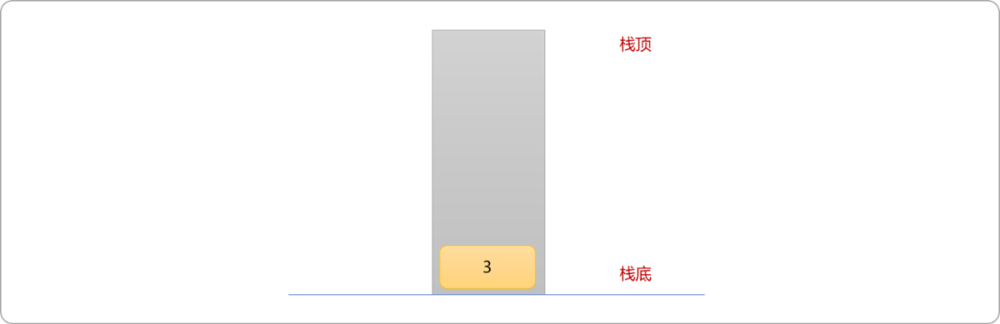

- 因数据`6`大于栈顶数据`3`，如果入栈后，无法保持栈的递增性。需要先把栈顶数据`3`删除后，再入栈。

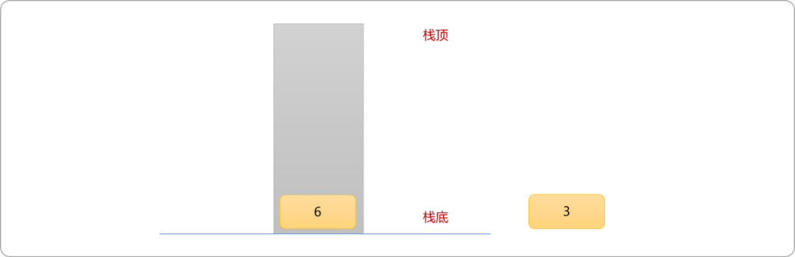


- 数据`1`小于栈顶数据`6`，因入栈后可以保持栈中数据的递增性。数据`1`直接入栈。

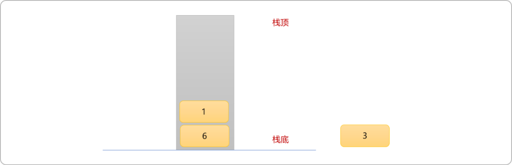


- 数据`8`大于栈顶数据`1`，则需删除栈顶数据`1`。数据`8`任然大于栈顶数据`6`，则继续删除栈顶数据`6`后再入栈。

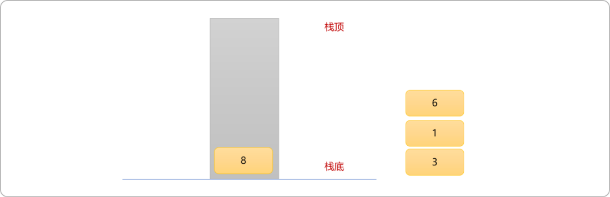


- 数据`5`比栈顶数据`8`小，可直接入栈。

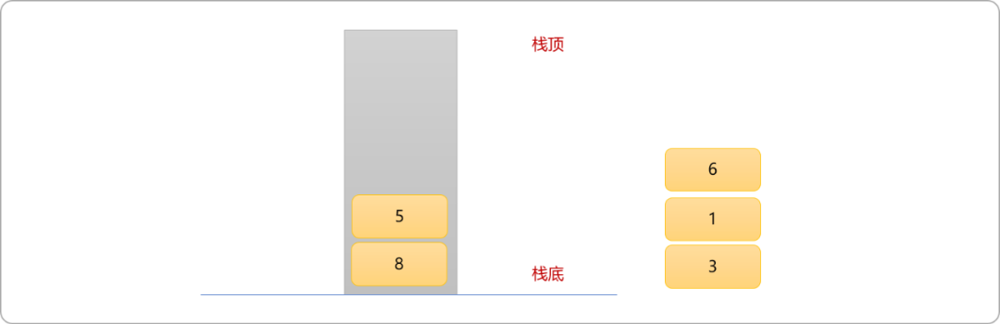


- 此时可发现，栈中还有`2` 个数据。而单调栈要求每一个数据都必须入栈出栈一次。为了保证栈中所有数据能出栈。可以在原数列的最后面加上一个比数列中所有值都大的一个数据充当结束标志性数据。

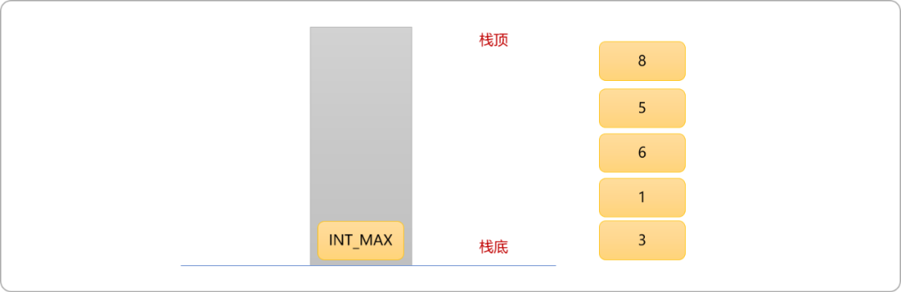


编码实现单调递增栈存储过程：

```cpp
#include <iostream>
//内置栈容器
#include <stack>
using namespace std;

int main() {
 //INT_MAX ：表示 int 最大值
 int nums[6]= {3,6,1,8,5,INT_MAX};
 stack<int> st;
 //递增方式添加数据
 for(int pos=0; pos<6; pos++ ) {
  while(!st.empty() && nums[st.top()]<=nums[pos] ) {
   //输出
   cout<<nums[ st.top()  ]<<"\t";
   //删除
   st.pop();
  }
  //入栈
  st.push(pos);
 }
 cout<<"\n栈中的内容:"<<st.top()<<endl;
 return 0;
}
```

使用单调栈时，需要注意以下几点：

- 对单调递增栈，在数组末尾添加一个最大数，如 INT_MAX。
- 对单调递减栈，在数组末尾添加一个最小数，如 INT_MIN。
- 数组中的所有元素都要入栈一次和出栈一次，除了最后一个特殊元素。
- 当一个元素出栈的时候，做计算，更新答案。

## 2. 单调栈的应用

### 2.1  下一个较大数字

**题目描述：**

给定数组`[1,4,2,3,5]`求每一个数字后面第一个比之大的数字。

**解题思路：**

可以使用单调递增栈对原始数列进入输入输出。其实现过程如下图所示：

- 初始时，准备好一个空栈、一个一维数组，用来存储原始数列中每一个数字后面第一个比之大的数字。元素`1`入栈。

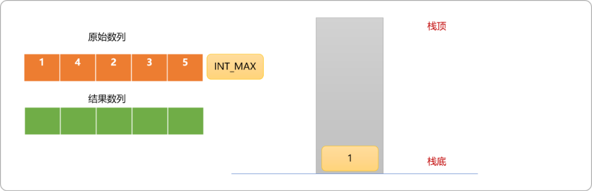


- 抽出原始数列中的数值`4`，因此数据比栈顶元素大，而又因需要维护栈的递增性。故，栈顶元素`1`需要出栈，且说明元素`1`遇到到第一个比之大的数据。

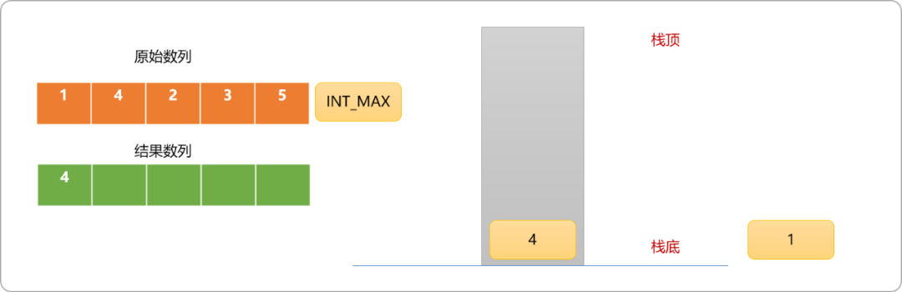


- 抽出原始数列中的数值`2`，因此数据比栈顶元素小，可以直接入栈。

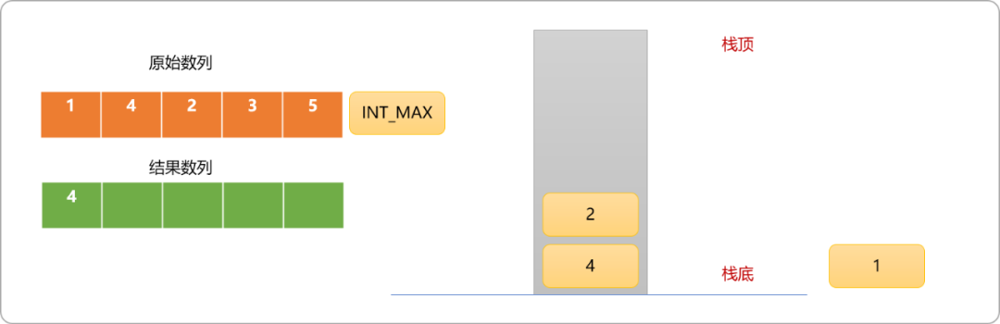


- 抽出原始数列中的数值`3`，因此数比栈顶元素`2`大，故，栈顶元素`2`出栈且说明入栈的数据是它遇到的第一个比之大的数字。

  至此，应该能得到一个结论：为了维护栈的单调递增性。

  **如果一个数据能直接入栈，则说明它比栈顶的元素小。**

  **如果一个数据需要通过删除栈顶元素才能入栈，则说明它比栈顶元素大。且是栈顶元素遇到的第一个比之大的元素。**或者说当已经存在栈中的元素，当它出栈时，就可以得到问题需要的答案。

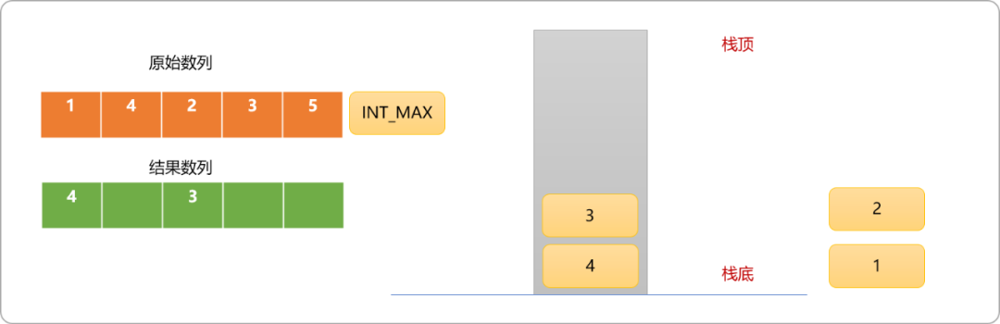


- 抽出原始数列中的数值`5`，因此数比栈顶元素大，故，删除栈顶元素`3`。

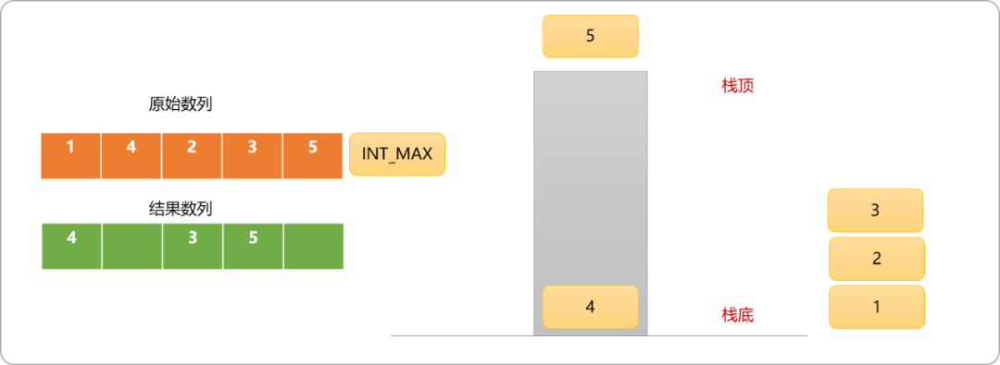


- 此时，即使删除了栈顶`3`，数字`5`还是不能入栈，因栈中元素`4`比之要小，需要删除栈顶元素`4`后，数字`5`方能入栈。

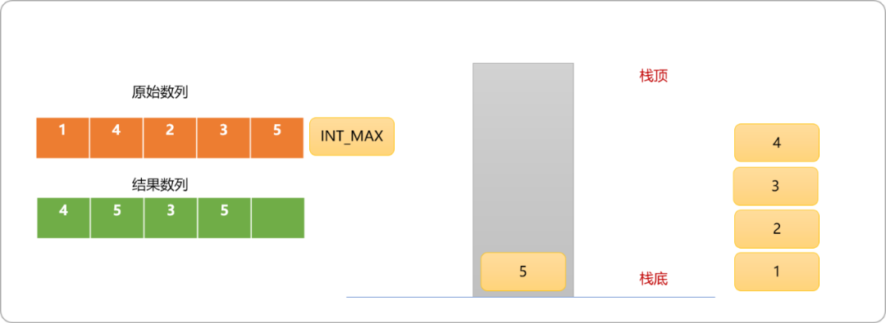


- 标志性数字`INT_MAX`入栈，栈顶元素`5`出栈，说明`5`后面没有比之大的数字。

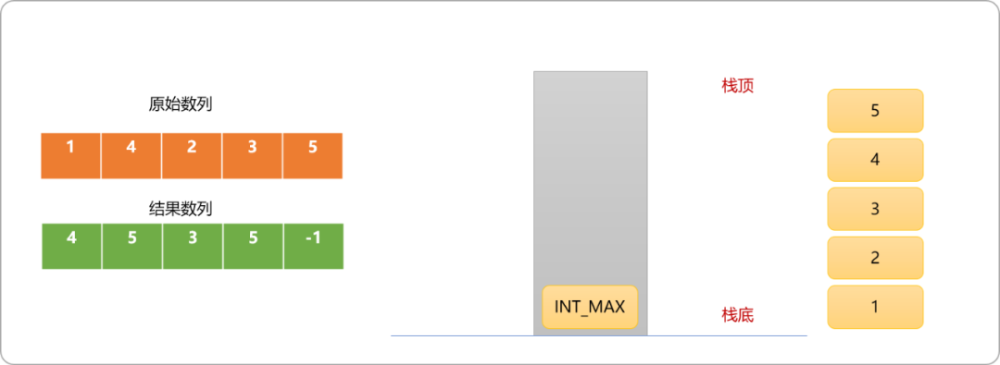


**编码实现：**

```cpp
  #include <iostream>#include <stack>
#include <cstring>
using namespace std;
int main() {
 //INT_MAX ：表示 int 最大值
 int nums[6]= {1,4,2,3,5,INT_MAX};
 int res[6];
 memset(res,-1,sizeof(res));
 stack<int> st;
 //递增方式添加数据
 for(int pos=0; pos<6; pos++ ) {
  while(!st.empty() && nums[st.top()]<=nums[pos] ) {
   //如果正入栈的数据大于栈顶数据,栈顶元素出栈
   if(nums[pos]!=INT_MAX)
    res[st.top()] =nums[pos];
   st.pop();
  }
  //入栈
  st.push(pos);
 }
 for(int i=0; i<5; i++) {
  cout<<nums[i]<<":"<<res[i]<<endl;
 }
 return 0;
}
```

**输出结果：**

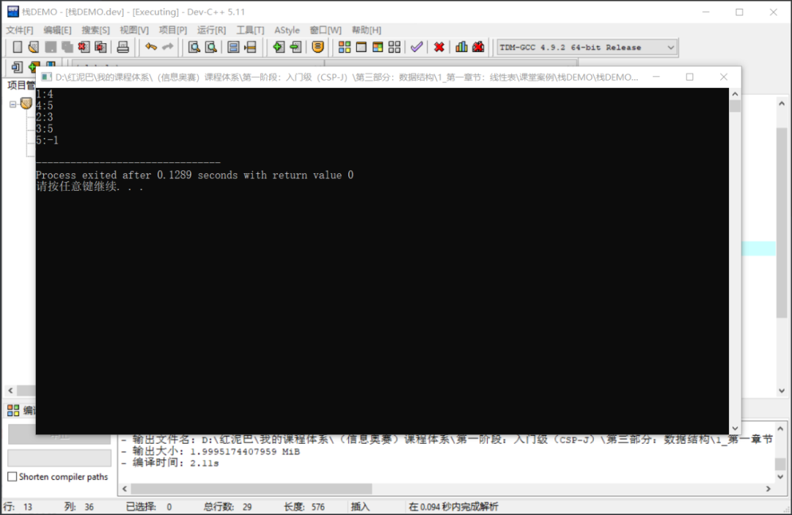


也可以采用`从右向左`入栈，且维护栈的单调递增性 。在任一数值入栈时，可以得到下一个比之大的数字。这点与从左向右是不同，从左向右是在出栈时得到结论。

```cpp
#include <iostream>
#include <stack>
#include <cstring>
using namespace std;

int main() {
 //INT_MAX ：表示 int 最大值
 int nums[5]= {1,4,2,3,5};
 int res[5];
 memset(res,-1,sizeof(res));
 stack<int> st;
 //递增方式添加数据
 for(int pos=4; pos>=0; pos-- ) {
  while(!st.empty() && nums[st.top()]<=nums[pos] ) {
   st.pop();
  }
  //入栈之前得到结论 
  res[pos]=st.empty()?-1:nums[st.top()];
  st.push(pos);
 }
 for(int i=0; i<5; i++) {
  cout<<nums[i]<<":"<<res[i]<<endl;
 }
 return 0;
}
```

从右向左入栈的优点：

- 因是在入栈时得到结论，所以可以不设置标志数字。

### 2.2  柱状图中最大矩形

**问题描述：**

给定 n 个非负整数，用来表示柱状图中各个柱子的高度，每个柱子彼此相邻，且宽度为 `1`，求柱状图中，能够勾勒出来的矩形的最大面积。

如下图所示：

- 有`6`个柱子，其高度分别为`[2,1,5,6,2,3]`。
- 其最大矩形面程应该是：`10`。

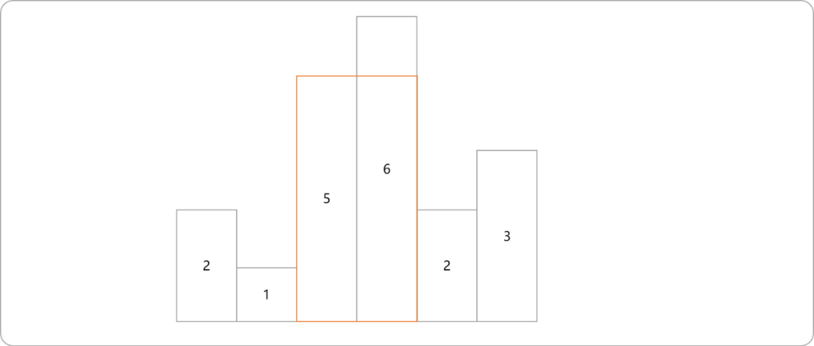


**解题思路：**

首先想到的是使用穷举法。其思路如下所示：

- 先求解高度为 `2`柱子的面积，结果为 `2`。然后以此柱子为左边界，向右扩展到高度为`1`的柱子。在 `2`和`1`中取最小值`1`为新的高度值，并计算面积为`2`。
- 同理，继续向右边扩展至高度为`5`的柱子，取最低值`1`为新高度，计算面积为 `3`。以此类推，可得到以第一个柱子为左边界可勾勒出来的不同矩形的面积值分别为`2,2,3,4,5,6`。

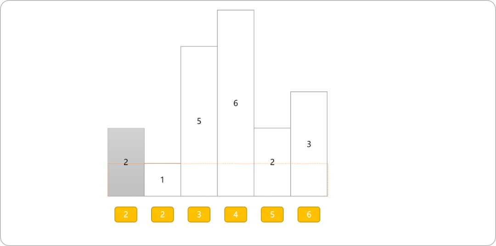


- 以第二个，即高度为`1`的柱子，为左边界，向右扩展后，其不同矩形面积如下所示：

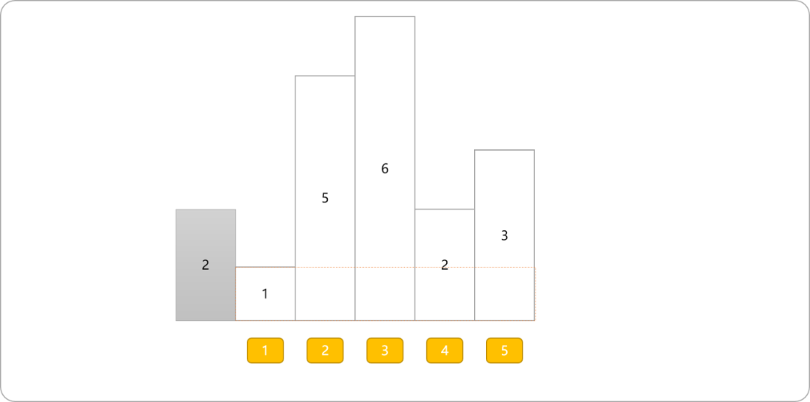


- 以柱高为`5`的柱子向右扩展。其不同矩形面积。

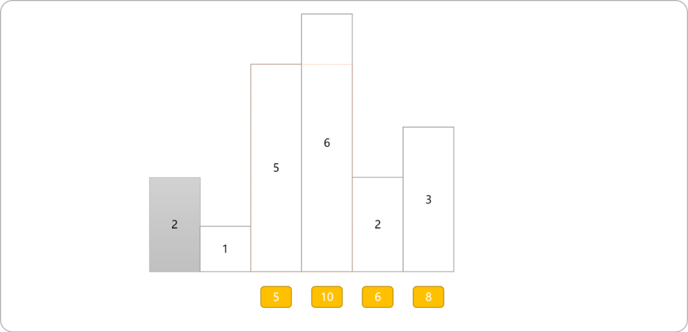


- 最后，以每一个柱子为左边界，向右边扩展，然后求出所有面积中的最大值。

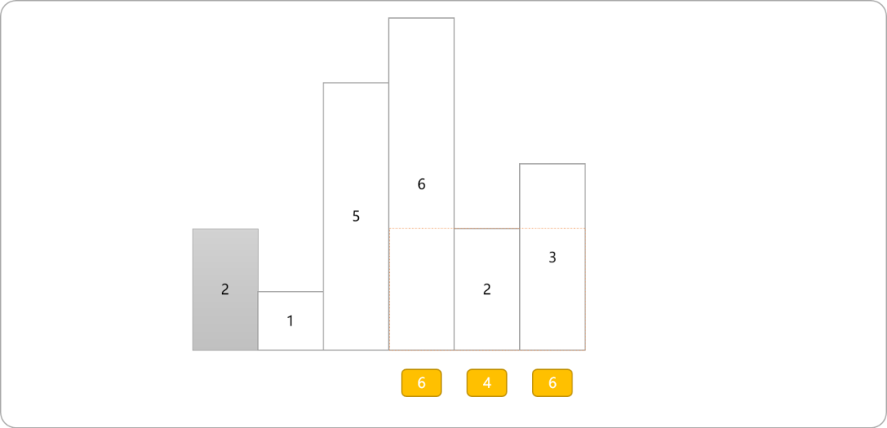


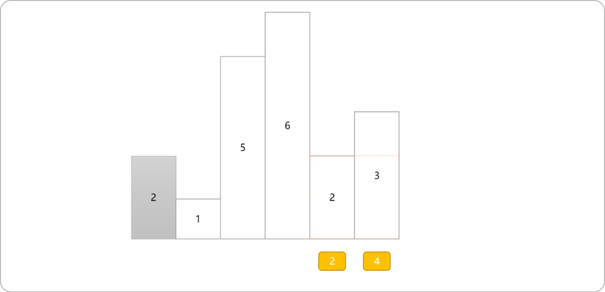


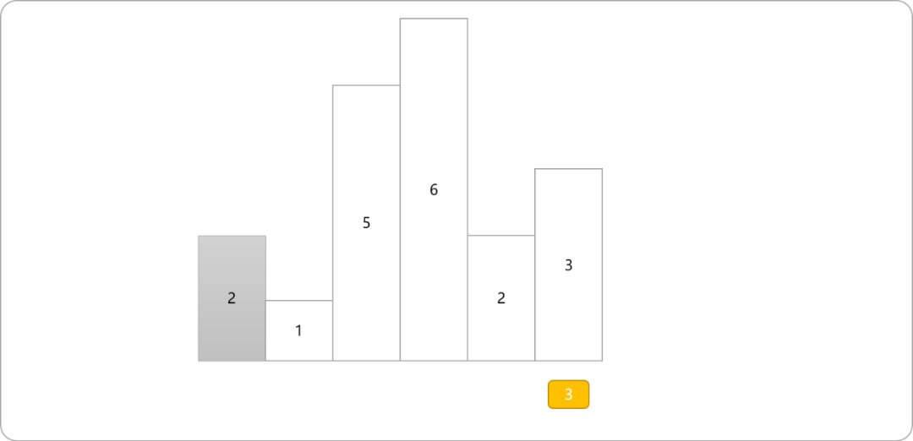


编码实现：

```cpp
#include <iostream>
#include <stack>
#include <cstring>
using namespace std;

int main() {
 //INT_MAX ：表示 int 最大值
 int heights[6]= {2,1,5,6,2,3};
 int maxArea=0;
 int width=1;
 int minHeight=0;
 for(int i=0; i<6; i++) {
  minHeight=heights[i];
  if( maxArea<minHeight*width) {
   maxArea=minHeight*width;
  }
  for(int  j=i+1; j<6; j++ ) {
   //求最小高度
   if( heights[j]<minHeight ) {
    minHeight=heights[j];
   }
   if( maxArea<minHeight*(j-i+1)*width) {
    maxArea=minHeight*(j-i+1)*width;
   }
  }
 }
 cout<<"最大矩形面积:"<<maxArea<<endl;
 return 0;
}
```

输出结果：

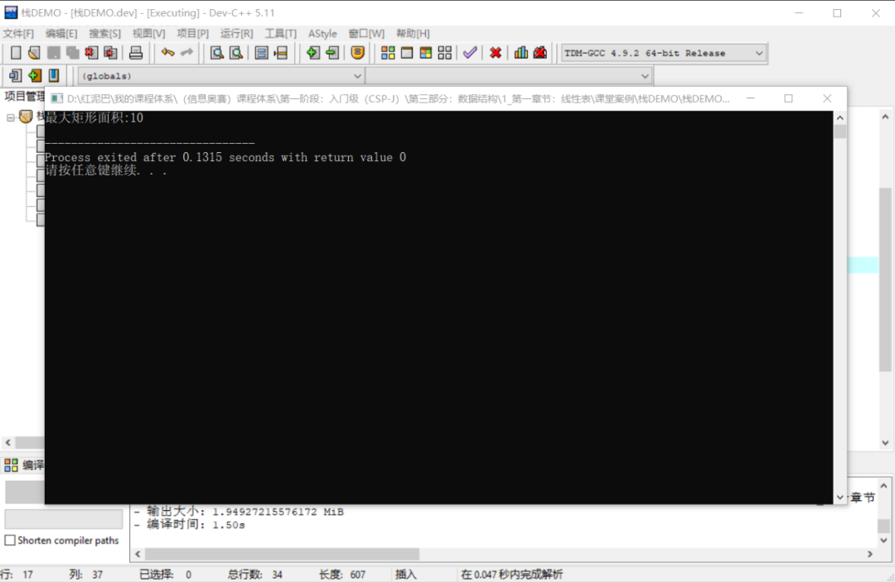


因穷举法的时间复杂度为`O(n^2)`，当柱子数量很多时，其计算量较多，

此问题可以使用单调栈对代码进行优化。

```cpp
#include <iostream>
#include <stack>
#include <cstring>
using namespace std;
int main() {
 int heights[6]= {2,1,5,6,2,3};
 int n=sizeof(heights )/4;
 //单调栈方式
 stack<int> s;
 int maxArea=0;
 for(int i=0; i<=n; i++) {
  int curretHeight=(i==n)?-1:heights[i];
  //当前值比栈顶元素小时
  while(!s.empty()&&curretHeight<heights[s.top()]) {
   int num=heights[s.top()];
   s.pop();
   if(!s.empty()) maxArea=max(maxArea,num*(i-s.top()-1));
   else maxArea=max(maxArea,num*i);
  }
  s.push(i);
 }
 cout<<"最大矩形面积:"<<maxArea<<endl;
 return 0;
}
```

## 3.  总结

笛卡尔树的构建逻辑中，也使用到了单调栈的存储原理。解决诸多问题时，合理使用单调栈，可让问题的求解过程变得简单易懂。


