# C++ 不知树系列之认识二叉树（数组、链表存储的实现）


## 1. 概念

顾名思义，二叉树指树中的任何一个结点的子结点不能多于 `2` 个。二叉树又分为：

- 一般二叉树。只要符合结点的`子结点`个数不多于 `2` 个就可以。

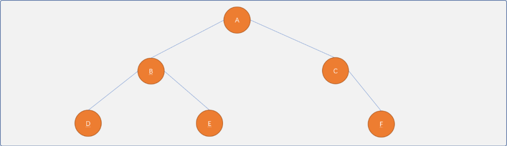

- 满二叉树。`满`的意思指除了叶结点，其它结点的子结点都达到了 `2` 个。

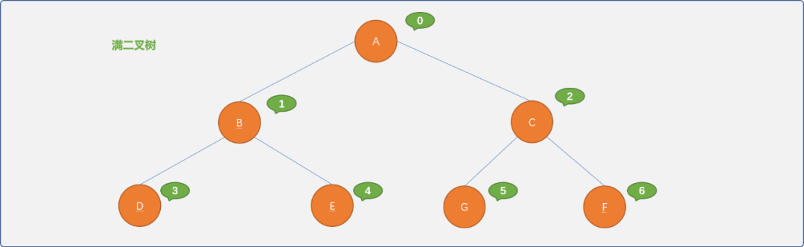

- 完全二叉树。**满二叉树其实也是完全二叉树**。完全二叉树可以通俗理解：如果对满二叉树的结点从上向下，从左向右进行有序编号，当删除某个结点后，其编号应该还是相邻有序。

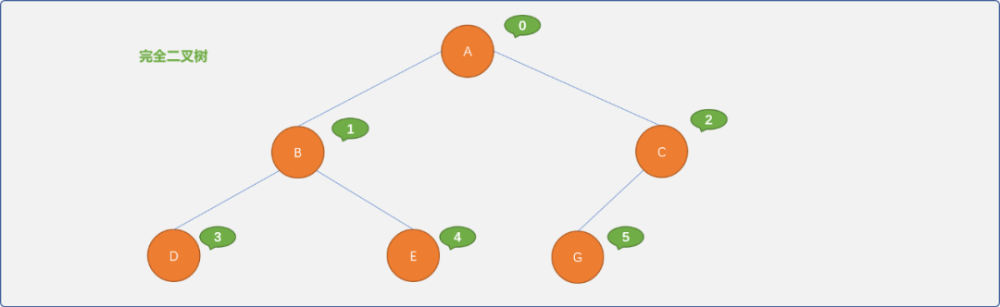

**二叉树的特性：**

二叉树是使用频率非常高的一种树结构。

为什么认为二分是最好的，三分、四分……难道就不行吗？

因为`二分`思想与计算机的二进制存储相吻合，`2` 的倍数可以给二叉树带来诸多独特的特性。

- 二叉树的第 `i`层上最多有 `2`i-1 个结点`（i>=1）`。

  可以把二叉树看成一个由低位向高位变化的二进制数据。如下图所示的满二叉树时，可以对应一个 `3` 位的二进制数据。

  如第三层（最高位）最大值为`2`3-1`=4`；第二层（中间位）最大值为`2`2-1`=2`；第一层（最低位）最大值为`2`1-1=1。

  

  更科学的是使用归纳法证明这个命题：

  当 `i=0`时，显然，二叉树只有一个根结点，命题是成立的。

  假设对于第`j`层，最多结点个数有 `2`j-1是成立，对于 `i=j+1`层而言，因每一个结点最多只有 `2` 个子结点，所以，第 `i`层最多的也只可能有 `2`*`2`j-1个结点，也就是 `2*2`i-2=2i-1。

  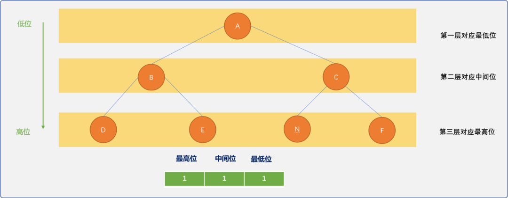

- 深度为 `k`的二叉树最多有 2k-1个结点。其实二叉树每一层上的结点个数是一个等比数列：`2`0+`2`1+`2`2+……+`2`k-1，根据等比数列的求和公式可知：sk=2k-1。

- 具有  `n` 个结点的完全二叉树的深度为[log2n]+1。

- 对于一个结点数为 `n` 且对结点进行编号的完全二叉树而言，编号为 `i`的 结点和子结点之间满足如下关系：

  `i=1`时，则为根结点，没有双亲，也可以认为父结点编号为 `0`；否则，其双亲结点的编号为`[i/2]`。

  `2i>n`时，则结点`i`没有左孩子；否则，其左孩子结点的编号为`2i`。

  `2i+1>n`时，则结点`i`没有右孩子；否则，其右孩子结点的编号为`2i+1`。

## 2. 物理存储

二叉树可以采用顺序表或链表两种存储结构。

### 2.1 顺序存储

当二叉树是非线性结构时，理论上很难用顺序存储描述出数据之间的逻辑关系。但是，于完全二叉树而言，因父子结点之间满足特定的数学关系，使用顺序表存储非常容易实现。

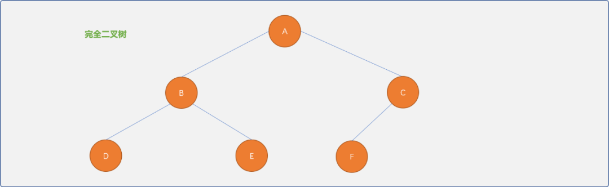

#### 2.1.1 实现思路

- 创建一个一维数组，把根结点存储在数组中下标为 `1`的位置。下标为 `0`的位置存储数字`0`，表示根结点没有父结点。


- 如果根结点有左右子结点，根据完全二叉树中父子结点之间的数学规律：左子结点存储存在 `2*i`位置，右子结点存储在`2*i+1`位置。


- 采用树的递归定义思想。把已经存储的结点作为根结点，检查是否存在子结点，然后按照父子结点之间的数学关系继续进行存储，直到存储完所有结点。


顺序存储的优点：

- 数据存储在一维数组中，数组间的索引号描述了数据与数据之间的关系。
- 数据信息以及数据之间的逻辑关系一步到位。极度舒适的不要不要的！

#### 2.1.1 具体实现

完全二叉树的顺序表存储的具体实现流程。

- 定义结点类型：用来描述结点本身的信息。

```cpp
#include <iostream>
#define MAX  10
using namespace std;
template<typename T>
struct BTNode {
 //编号,唯一标识符
 int code;
 //数据
 T data;
 BTNode() {}
 BTNode(int code,T val) {
  this->code=code;
  this->data=val;
 }
 //自我显示
 void desc() {
  cout<<"结点："<<this->code<<"_"<<this->data<<endl;
 }
};
```

- 定义树类型：此类中提供对树的常规操作方法。

```cpp
template<typename T>
class BinaryTree {
 private:
  //使用一维数组作为树结点存储容器
  BTNode<T>  elem[MAX];
  //二叉树结点的编号由内部指定,根结点编号从 1 开始，这里的编号仅是结点的标识符
  int idx=1;
  //树中结点的数量
  int size=0;
 public:
  //无参构造函数
  BinaryTree() {

  }
  //有参构造函数，初始化根结点
  BinaryTree(T val,T init) {
   //初始化数组
   for(int i=0; i<MAX; i++) {
                 //默认值为{0,init}
    this->elem[i]= {0,init};
   }
   //创建根结点
   BTNode<T> root(this->idx++,val);
             //根结点添加在下标为 1 的位置
   this->elem[1]=root;
   this->size++;
  }
  //得到根结点
  BTNode<T> getRoot() {
   return this->elem[1];
  }
  //查询结点在数组中的存储位置
  int findIndex(BTNode<T> node) {
   for(int i=1; i<=this->size; i++) {
    if(this->elem[i].data==node.data)
     return i;
   }
   return -1;
  }
  //根据值查询结点
  BTNode<T> findIndex(T val) {
   for(int i=1; i<=this->size; i++) {
    if(this->elem[i].data==val)
     return this->elem[i];
   }
   return {0,'\0'};
  }
  //添加新结点
  BTNode<T> addNewNode(BTNode<T> parent,T val) {
   //得到父结点的存储位置
   int pos= this->findIndex(parent);
             if(pos==-1)
                 return NULL;
   //创建新结点
   BTNode<T> newNode(this->idx++,val);
   if (this->elem[pos*2].code==0) {
    //说明左子结点位置为空
    this->elem[pos*2]=newNode;
    this->size++;
    return newNode;
   } else if(this->elem[pos*2+1].code==0) {
    //说明右子结点位置为空
    this->elem[pos*2+1]=newNode;
    this->size++;
    return newNode;
   } else {
    //说明左右子结点都已经存在，不能插入
    BTNode<T> tmp= {0,'\0'};
    return tmp;
   }
  }
  //得到结点的左子结点
  BTNode<T> getLeftNode(BTNode<T> parent) {
   //结点的存储位置
   int pos= this->findIndex(parent);
             if(2*pos>this->size){
                 return {0,'\0'};
             }else{
                 //说明存在左子结点
    return this->elem[pos*2];
             }
  }
  //得到结点的右子结点
  BTNode<T> getRightNode(BTNode<T> parent) {
   //结点的存储位置
   int pos= this->findIndex(parent);
   if ((2*pos+1)>this->size) {
    return {0,'\0'};
   } else {
                 //说明存在右子结点
    return this->elem[pos*2+1];
   }
  }    
     //删除结点
  int delNode(){} 
  //遍历所有结点
  void showAll() {
   for(int i=1; i<=size; i++) {
    this->elem[i].desc();
    if( i*2<=size ) {
     cout<<"\t左";
     this->elem[i*2].desc();
    }
    if( i*2+1<=size) {
     cout<<"\t右";
     this->elem[i*2+1].desc();
    }
   }
  }
};
```

测试：

```cpp
int main(int argc, char** argv) {
 //创建树
 BinaryTree<char> tree('A','\0');
 //返回根结点
 BTNode<char> root= tree.getRoot();
 //为根结点添加子结点
 BTNode<char> bNode= tree.addNewNode(root,'B');
 BTNode<char> cNode= tree.addNewNode(root,'C');
 //为 B结点添加子结点
 BTNode<char> dNode= tree.addNewNode(bNode,'D');
 BTNode<char> eNode= tree.addNewNode(bNode,'E');
 //为 C结点添加子结点
 BTNode<char> fNode= tree.addNewNode(cNode,'F');
 //遍历所有结点
 tree.showAll();
 cout<<"B 结点的左子结点：";
 tree.getLeftNode(bNode).desc();
 cout<<"B 结点的右子结点："   ;
 tree.getRightNode(bNode).desc();
 return 0;
}
```

输出结果：

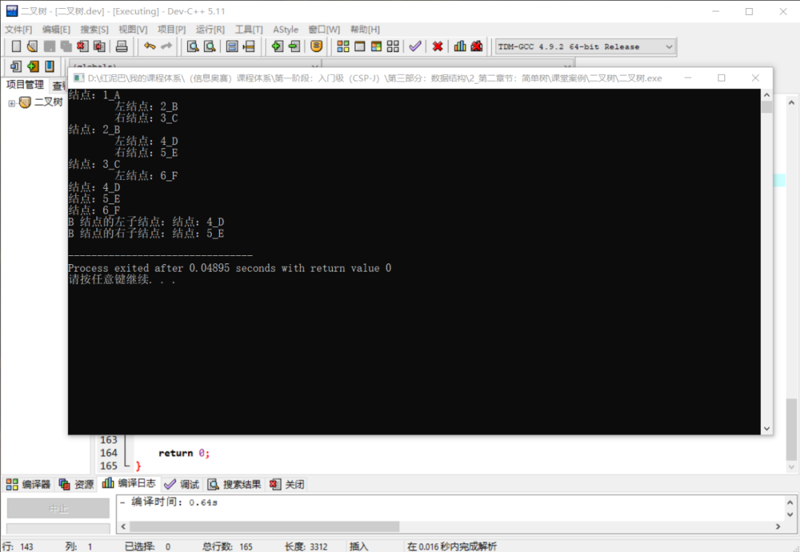

**单独讨论一下完全二叉树的删除方法。**

删除要分几种情况：

- 如果删除的是最后一个叶结点，因不涉及到牵一发动全身的问题，直接删除便是。

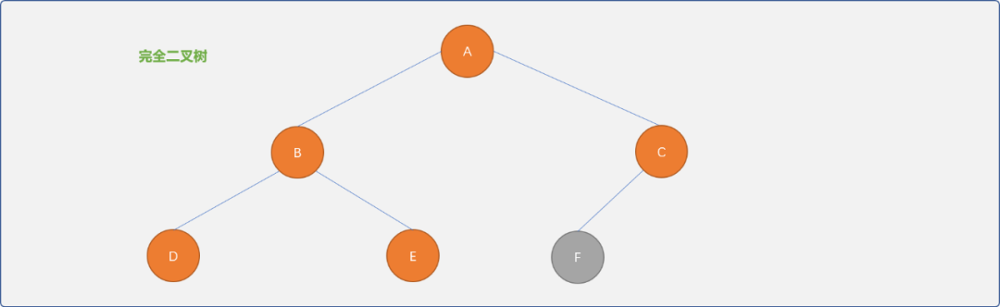

- 如果删除的不是最后一个叶结点，为了保持完全二叉树特性，可以采用复制最后一个叶结点的方式。如下删除 `B` 结点。

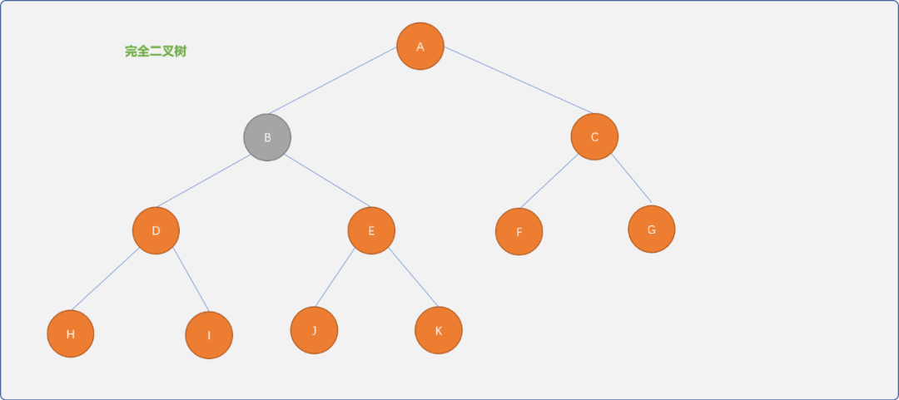

可以把最后的叶结点`K`复制过来。当然，前提是不在意谁一定是谁的前驱，谁一定是谁的后驱，如在描述家族关系的二叉树中，就不能这么做，否则，孙子会一转身成为祖辈。

> 本文着重讨论存储，删除时需要考虑的更复杂问题留到新文中再讲解。

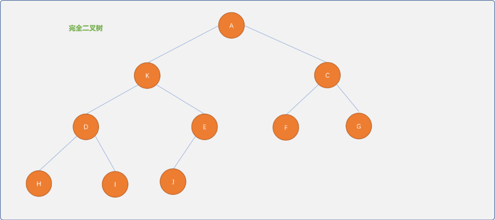

删除函数的实现：

```cpp
//删除结点
int delNode(BTNode<T> node){
    //查找结点位置
    int pos= this->findIndex(node); 
    if (pos*2>this->size ){
        //最后一个子结点，直接删除
        this->elem[pos]={0,'\0'};
        this->size--; 
        return true;
    }else{
        //把最后一个结点复制到要删除的结点位置
        this->elem[pos]=this->elem[this->size]; 
        this->size--;  
        return true;   
    }
    return false;
} 
```

测试删除：

```cpp
int main(int argc, char** argv) {
 //创建树
 BinaryTree<char> tree('A','\0');
 //返回根结点
 BTNode<char> root= tree.getRoot();
 //为根结点添加子结点
 BTNode<char> bNode= tree.addNewNode(root,'B');
 BTNode<char> cNode= tree.addNewNode(root,'C');
 //为 B结点添加子结点
 BTNode<char> dNode= tree.addNewNode(bNode,'D');
 BTNode<char> eNode= tree.addNewNode(bNode,'E');
 //为 C结点添加子结点
 BTNode<char> fNode= tree.addNewNode(cNode,'F');
 cout<<"原完全二叉树："<<endl;
 tree.showAll();
 cout<<"删除最后一个结点："<<endl;
 tree.delNode(fNode);
 tree.showAll();
 //删除 B 结点
 cout<<"删除B结点："<<endl;
 tree.delNode(bNode);
 tree.showAll();
 return 0;
}
```

输出结果：

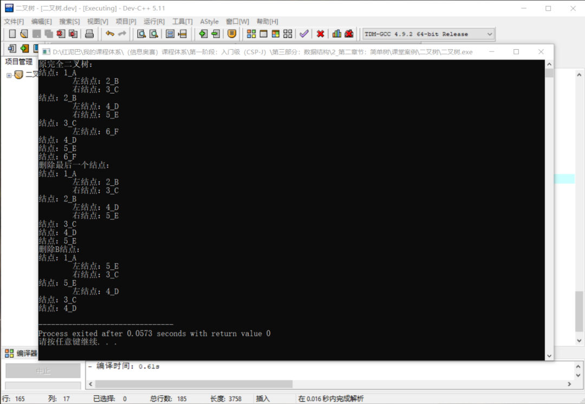

### 2.2 链式存储

使用顺序存储完全二叉树是可行，若不是完全二叉树，为了保留父子之间关系的数学特性，则需要在数组中使用留空方式为没有子结点的结点虚拟出空子结点（甚至为虚拟结点再虚拟子结点）。

> 把一棵非完全二叉树想象成一棵完全二叉树。

如下图所示，留空的下标为 `4`的位置就是为`B`结点虚拟的左子结点……如此会造成空间的严重浪费。

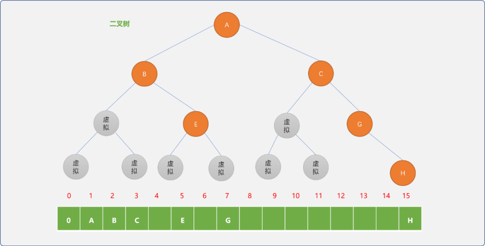

为了保证每一个结点都能被存储，如果存储有`n`个结点的二叉树，至少需要 `2`2-1个存储空间。显然这是无法接受的。

> 为什么存储 `n`个结点，至少需求 `2`2-1 个存储空间，请自行思考。

故使用链表存储二叉树方是常态。一般情形下，树的结点类型至少有 `3` 个存储位：

- 数据位。
- 左子结点指针位。
- 右子结点指针位。


如上的结点类型设计，查找结点的子结点是方便的，但是，查找结点的父结点颇为不易。在对树的操作时，若有查找父亲结点的需求，可以在结点类型中添加一个父结点指针位。


当需求发生变化时，不应该拘泥于模式，而应该根据具体的场景，灵活设计结点的内部结构。

#### 2.1 编码实现

如下实现时，仅用实现二叉树的链式存储，暂不涉及遍历、查找、删除等操作。可以使用递归或非递归方案遍历整棵树，受限于篇幅，在系列的后续文章中单独讲解。

- **定义结点类型**：存储结点承载的值以及结点之间的关系信息。

```cpp
#include <iostream>
using namespace std;
template<typename T>
struct BTNode_ {
 //编号（唯一标识符）
 int code;
 //结点的值
 T data;
 //左子结点地址
 BTNode_ *left;
 //右子结点地址
 BTNode_ *right;
    //无参构造
 BTNode_() {
  this->left=NULL;
  this->right=NULL;
 }
    //有参构造
 BTNode_(int code,T val) {
  this->code=code;
  this->data=val;
  this->left=NULL;
  this->right=NULL;
 }
 //自我显示
 void desc() {
  cout<<"结点："<<this->code<<"_"<<this->data<<endl;
 }
};
```

- **定义树类型：**提供树的常规操作。

```cpp
template<typename T>
class Tree_ {
 private:
  //树的根结点
  BTNode_<T> *root;
  //流水编号，从 1 开始（从 0 开始也可以）
  int idx=1;
  //尺寸
  int size=0;
 public:
  //初始化根结点
  Tree_(T val) {
             //创建根结点
   this->root=new BTNode_<T>(this->idx++,val);
             //大小增加
   this->size++;
  }
  //返回根结点
  BTNode_<T> *getRoot() {
   return this->root;
  }
  //析构函数
  ~Tree_() {
            this->deleteAll();
  }
  //添加左子结点
  BTNode_<T> * addLeftNode(BTNode_<T> * parent,T val) {
   if (parent==NULL)
    return NULL;
   //创建新结点
   BTNode_<T> *newNode=new BTNode_<T>(this->idx++,val);
   if (newNode==NULL)
    return NULL;
   parent->left=newNode;
   this->size++;
   return newNode;
  }
  //添加右子结点
  BTNode_<T> * addRightNode(BTNode_<T> * parent,T val) {
   if (parent==NULL)
    return NULL;
   //创建新结点
   BTNode_<T> *newNode=new BTNode_<T>(this->idx++,val);
   if (newNode==NULL)
    return NULL;
   parent->right=newNode;
   this->size++;
   return newNode;
  }
  //删除指定子树
  void destroy(BTNode_<T> * node) {
            if(node!=NULL) {
                deleteSubTree(node->left);
                deleteSubTree(node->right);
                delete node;
   }
  }
  //删除整棵树
  void deleteAll() {
   destroy(this->root);
   root=NULL;
  }
  //前序遍历
  void  preorder(BTNode_<T> *node) {
   if (node!=NULL) {
    node->desc();
    preorder(node->left);
    preorder(node->right);
   }
  }
};
```

**测试：**使用链表存储如下二叉树，并使用前序遍历检查树结构的正确性。

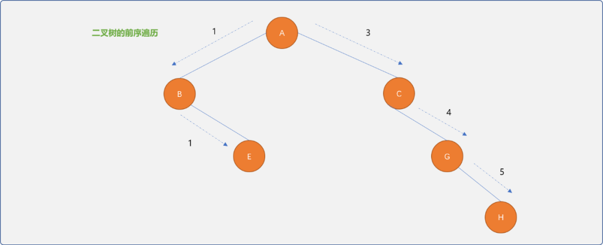

```cpp
int main() {

 //创建树
 Tree_<char> tree('A');
 //得到根结点
 BTNode_<char> *root=tree.getRoot();
 //添加 B 为根结点的左子结点
 BTNode_<char> *bNode =tree.addLeftNode(root,'B');
 //添加 C 为根结点的左子结点
 BTNode_<char> *cNode =tree.addRightNode(root,'C');
 //添加 E 为B 结点的右子结点
 BTNode_<char> *eNode =tree.addRightNode(bNode,'E');
 //添加 G 为 C 结点的右子结点
 BTNode_<char> *gNode =tree.addRightNode(cNode,'G');
 //添加 H  为 G 结点的右子结点
 BTNode_<char> *hNode =tree.addRightNode(gNode,'H');
 //前序遍历
 tree.preorder(root);
 return 0;
}
```

**输出结果：**

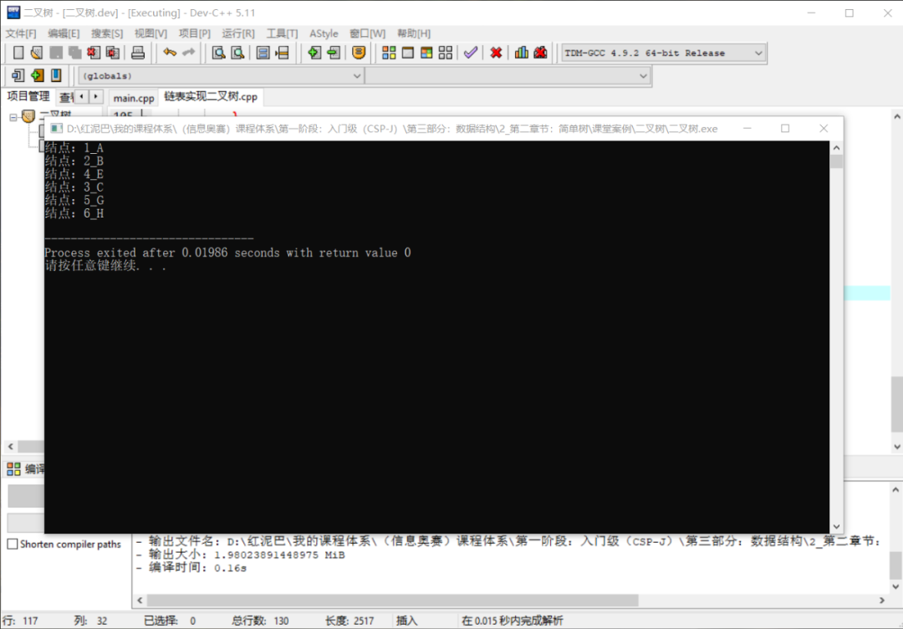

## 3. 总结

本文讲解了完全二叉树的特性，以及使用此特性实现完全二叉树的顺序存储。

对于非完全二叉树，并不适合顺序存储，使用链式存储更方便。

本文着重于如何存储，并提供了相应的测试代码。代码仅是服务本文的需求，实际应用时，可根据需求进行修改。


