# C++ 不知树系列之二叉排序树（递归和非递归遍历、删除、插入……）

# 1. 概念

`二叉树`是树结构中具有艳明特点的子类。

`二叉树`要求树的每一个结点（除叶结点）的子结点最多只能有 `2` 个。在`二叉树`的基础上，继续对其进行有序限制则变成`二叉排序树`。

**二叉排序树特点：**

基于`二叉树`结构，从根结点开始，从上向下，每一个父结点的值大于左子结点（如果存在左子结点）的值，而小于右子结点（如果存在右子结点）的值。则把符合这种特征要求的树称为`二叉排序树`。

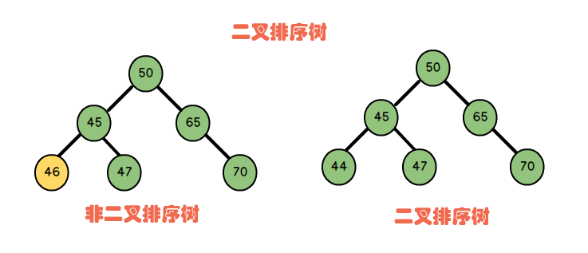

**构建`二叉排序树`:**

如有数列  `nums=[5,12,4,45,32,8,10,50,32,3]`。通过下面流程，可以把数列中的数字映射到`二叉排序树`的结点上。

1. 如果树为空，把第一个数字作为根结点。如下图，数字 `5` 作为根结点。

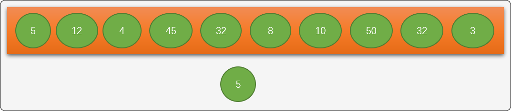

1. 如果已经存在根结点，则把数字和根结点比较，小于根结点则作为根结点的左子结点，大于根结点则作为根结点的右子结点。如数字 `4` 插入到左边，数字 `12` 插入到右边。

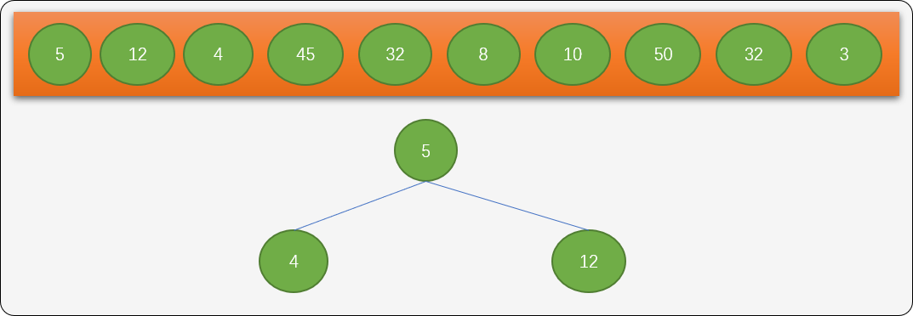

1. 数列后面的数字依据上述相同法则，分别插入到树的不同位置。如下图所示。

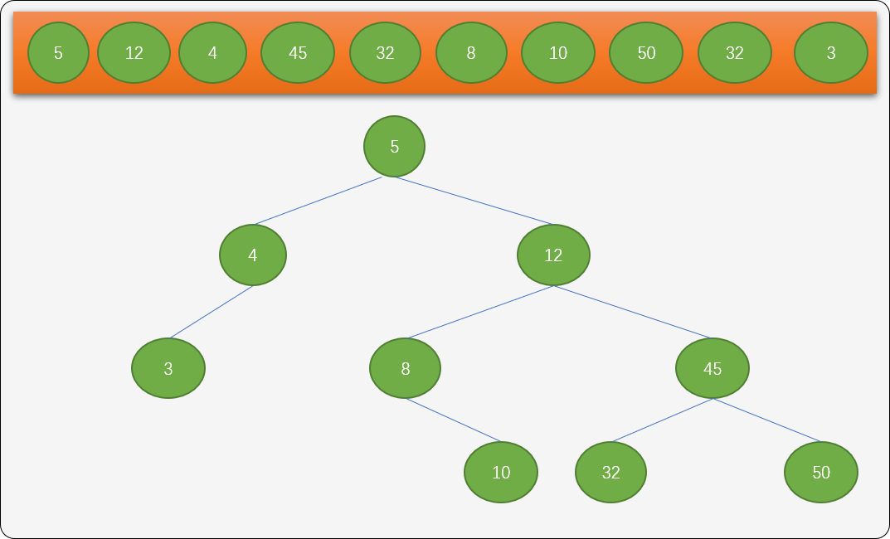

原始数列中的数字是无序的，根据`二叉排序树`的插入算法，最终可得到一棵有排序性质的树结构。对此棵树进行`中序遍历`就可得到从小到大的一个递增有序数列。

综观`二叉排序树`，进行关键字查找时，也应该是接近于二分查找算法的时间复杂度。

> **Tips：**原始数列中的数字顺序不一样时，生成的二叉排序树的结构也会有差异性。对于查找算法的性能会产生影响。

## 2.  二叉排序树的数据结构

使用`OOP`设计方案描述二叉排序树的数据结构。

### 2.1 抽象数据结构

- 设计**结点类型：**用来描述结点本身的信息。

```c++
template<typename T>
struct TreeNode{
 //结点上的值
    T value;
    //左子结点
    TreeNode *lelfChild;
    //右子结点
    TreeNode * rightChild;
    //无参构造
 TreeNode(){
 this->lelfChild=NULL;
 this->rightChild=NULL; 
 }
 //有参构造 
 TreeNode(T val){
  this->value=val;
  this->lelfChild=NULL;
  this->rightChild=NULL;
 }
 //有参构造
 TreeNode(T val,TreeNode *leftChild,TreeNode *rightChild){
  this->value=val;
  this->lelfChild=leftChild;
  this->rightChild=rightChild;
 }
}; 
```

- **二叉排序树类：** 用来实现树的增、删、改、查……

```c++
template<typename T>
class BinarySortTree {
 private:
  //根结点
  TreeNode<T> * root;
  //树的大小
  int size;
 public:
  //无参构造函数
  BinarySortTree() {
             //初始根结点为NULL
   this->root=NULL;
   this->size=0;
  }
  //有参构造函数,初始化根结点
  BinarySortTree(T value) {
   this->root=new TreeNode<T>(value);
   this->size++;
  }
  //返回根结点
  TreeNode<T> *getRoot() {
   return this->root;
  }
  //析构函数
  ~BinarySortTree();
  //查询是否存在给定的关键字
  TreeNode<T> * findByVal(T value);
  //基于递归查询
  TreeNode<T> * findByVal(TreeNode<T> * node,T value) ;
  //插入新结点
  TreeNode<T> * insert(T value) ;
  //基于递归的前序遍历
  void preOrder(TreeNode<T> * node) ;
  //基于递归的中序遍历
  void inOrder(TreeNode<T> * node) ;
  //基于递归的后序遍历
  void postOrder(TreeNode<T> * node) ;
  //非递归的前序遍历
  void preOrderByStack();
  //非递归的中序遍历
  void inOrderByStack();
  //非递归的后序遍历
  void postOrderByStack();
  //删除
  bool deleteNode(T val);
};
```

### 2.2  插入实现

插入新结点之前，需要为新结点找到一个合适的位置。所以，先要讨论在树中如何查找指定的结点。

**查找的基本思路：**

- 从根结点开始查找，如果和查找的结点值相等，返回根结点。
- 如果不相等，且查找的值比根结点的值小，则顺着根结点的左子结点继续查找。
- 如果不相等，且查找的值比根结点的值大，则顺着根结点的右子结点继续查找。
- 重复上述过程。如果查找到此返回对应结点，没有查找到，则返回最后查询的结点。

**查找函数的实现：**

下面提供递归和非递归 `2` 种方案，如果存在要查找的结点，返回此结点，如果没有查找，则返回最后访问过的结点。

- 非递归方案查找：

```c
//查询是否存在给定的关键字
template<typename T>
TreeNode<T> * BinarySortTree<T>::findByVal(T value) {
 //从根结点开始比较
 TreeNode<T> *move=BinarySortTree<T>::root;
 //保留最后访问过的结点
 TreeNode<T> *last=NULL;
 while(move!=NULL) {
  last=move;
  if(move->value==value) {
   //找到
   return move;
  } else if(move->value>value) {
   //在左子树上查找
   move=move->leftChild;
  } else {
   //在右子树上查找
   move=move->rightChild;
  }
 }
 return last;
}
```

- 递归查找：

```c
//基于递归查询
template<typename T>
TreeNode<T> * BinarySortTree<T>::findByVal(TreeNode<T> * node,T value) {
 if (node->value==value)
  return node;
 else if (node->value>value) {
  if(node->leftChild) {
   //存在左子树
   return findByVal(node->leftChild,value);
  } else {
   //不存在左子树，返回最后访问的结点
   return node;
  }
 } else {
  if(node->rightChild) {
   //存在左子树
   return findByVal(node->rightChild,value);
  } else {
   //不存在左子树，返回最后访问的结点
   return node;
  }
 }
}
```

现在讨论在`二叉排序树`中插入新结点的实现思路：

- 先在树中查询是否已经存在欲插入的结点。
- 如果没有，则获取到查询时访问过的最后一个结点，并和新结点比较大小。
- 如果比新结点大，则插入最后访问过结点的右子树位置。
- 如果比新结点小，则插入最后访问过结点的左子树位置。

> **Tips：** 如果插入的值在树中已经存在，本文采用简单的替换方案。

**插入函数：**

```c
//插入新结点
template<typename T>
TreeNode<T> * BinarySortTree<T>::insert(T value) {
 //查找
 TreeNode<T> *node= BinarySortTree<T>::findByVal(value);
 //创建新结点
 TreeNode<T> *newNode=new TreeNode<T>(value);
 if(node->value==value) {
  //已经存在
  return NULL;
 } else if(node->value>value) {
  //放在左子树
  node->leftChild=newNode;
 } else {
  //放在右子树
  node->rightChild=newNode;
 }
 this->size++;
}
```

可以通过`中序遍历`测试插入函数的正确性，这个在后文讲解中序遍历时再测试。

### 2.3  遍历实现

对任何一种树类型操作时，都需要提供对整棵树的遍历操作。遍历有 `2` 种搜索模式：

- 深度遍历模式：顺着树的深度遍历。
- 广度遍历模式：按树的层次遍历。限于篇幅，广度遍历本文不讨论。

根据对根结点及其子结点的访问顺序的不同，常规的深度遍历操作有 `3` 种，可以使用递归或非递归方案实现。

- 前序遍历。
- 中序遍历。
- 后序遍历。

#### 2.3.1 递归方案

- 前序遍历的访问顺序：先根结点，再左子结点，然后右子结点。

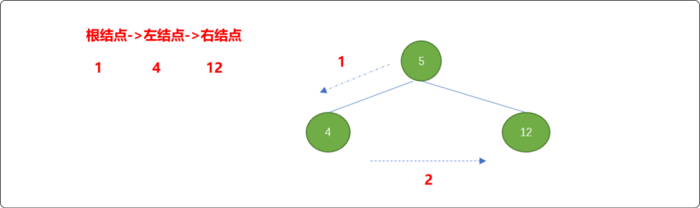

**编码实现：**

```c++
//基于递归的前序遍历
template<typename T>
void BinarySortTree<T>::preOrder(TreeNode<T> * node) {
 if(node!=NULL) {
  cout<<node->value<<"\t";
  preOrder(node->leftChild);
  preOrder(node->rightChild);
 }
}
```

- 中序遍历的顺序：左子结点、再根结点、最后右子结点。

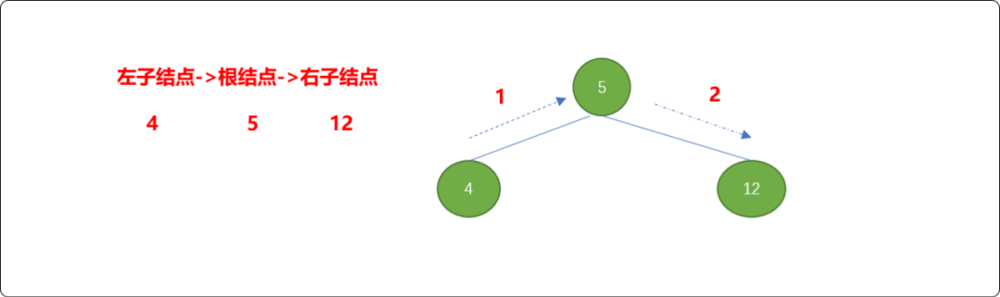

**编码实现：**

```c
//基于递归的中序遍历
template<typename T>
void BinarySortTree< T>::inOrder(TreeNode<T> * node) {
 if(node!=NULL) {
  inOrder(node->leftChild);
  cout<<node->value<<"\t";
  inOrder(node->rightChild);
 }
}
```

从上图遍历路线可知，中序遍历是由小到大输出二叉排序树的结点，从而可以实现有序输出结点。可以使用中序遍历测试前面的插入算法的正确性。

```c
int main() {
 //实例化二叉排序树 
 BinarySortTree<int> * bt=new BinarySortTree<int>(5);
 //插入新结点 
 int nums[9]= {12,4,45,32,8,10,50,32,3};
 for(int i=1; i<9; i++) {
  bt->insert(nums[i]);
 }
 //得到根结点 
 TreeNode<int> *root= bt->getRoot();
 //中序遍历二叉树 
 bt->inOrder(root);
 return 0;
}
```

从下面的输出结果可知，插入算法是正确的。

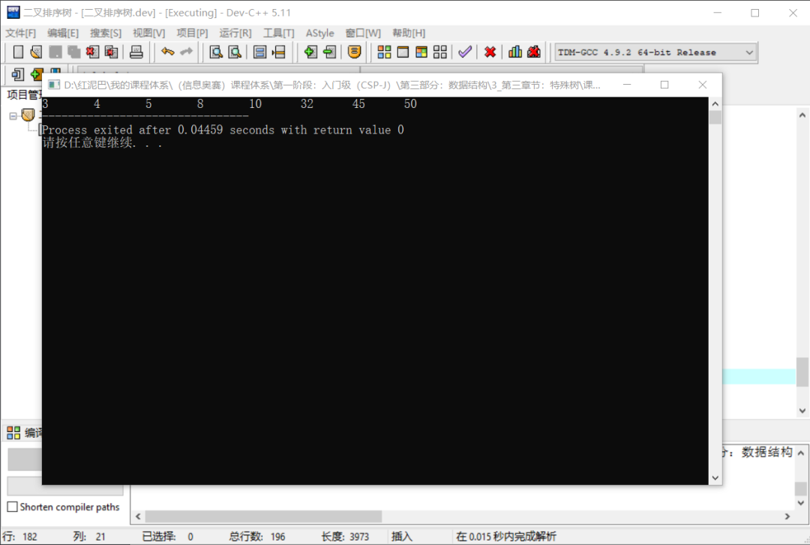

- 后序遍历的顺序：左子结点，再右子结点，最后是根结点。

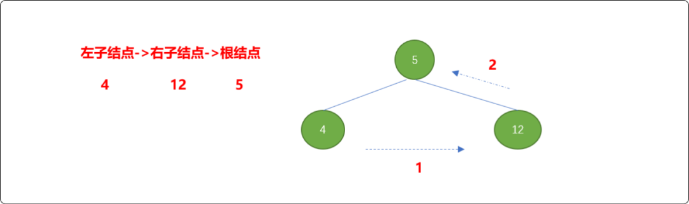

**编码实现：**

```cpp
//基于递归的后序遍历
template<typename T>
void BinarySortTree<T>::postOrder(TreeNode<T> * node) {
 if(node!=NULL) {
  postOrder(node->leftChild);
  postOrder(node->rightChild);
  cout<<node->value<<"\t";
 }
}
```

#### 2.3.2 非递归方案

除了可以使用递归方案实现树的遍历，也可以使用非递归方案实现遍历，下面再讨论如何使用非递归实现遍历。

- 非递归前序遍历：

```c
//非递归的前序遍历
template<typename T>
void BinarySortTree<T>::preOrder() {
 //实例化栈
 stack<TreeNode<T>*> stack;
 if  (BinarySortTree<T>::root==NULL)
  return ;
 //把根结点压入栈中
 stack.push( BinarySortTree<T>::root);
 while (!stack.empty()) {
  //得到栈顶数据
  TreeNode<T> *top=stack.top();
  stack.pop();
  //输出栈顶结点数据
  cout<<top->value<<"\t";
  //检查是否存在右子结点
  if (top->rightChild!=NULL)
   stack.push(top->rightChild);
  //先压右边的，再压左边的
  if (top->leftChild!=NULL)
   stack.push(top->leftChild);
 }
}
```

**测试前序遍历：**

```c
int main() {
 //实例化二叉排序树
 BinarySortTree<int> * bt=new BinarySortTree<int>(5);
 //插入新结点
 int nums[9]= {12,4,45,32,8,10,50,32,3};
 for(int i=1; i<9; i++) {
  bt->insert(nums[i]);
 }
 //得到根结点
 TreeNode<int> *root= bt->getRoot();
 //递归前序遍历二叉树
 bt->preOrder(root);
    cout<<endl;
    //非递归前序遍历二叉树
    bt->preOrder();
 return 0;
}
```

输出结果：

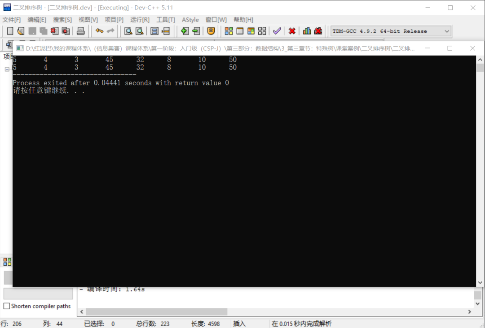

- 非递归中序遍历。

```c
//非递归的中序遍历
template<typename T>
void BinarySortTree<T>::inOrder() {
 //实例化栈
 stack<TreeNode<T>*> stack;
 if  (BinarySortTree<T>::root==NULL)
  return ;
 //把根结点压入栈中
 TreeNode<T>* top= BinarySortTree<T>::root;
 while ( top!=NULL || !stack.empty()) {
  if (top!=NULL) {
             //如果根结点存在，压入栈中
   stack.push(top);
             //获取到根结点的左子结点
   top=top->leftChild;
  } else {
             //如果结点不存在，弹出
   top=stack.top();
   stack.pop();
   cout<<top->value<<"\t";
             //获取右子结点
   top=top->rightChild;
  }
 }
}
```

**测试中序遍历：**

```cpp
int main() {
 //实例化二叉排序树
 BinarySortTree<int> * bt=new BinarySortTree<int>(5);
 //插入新结点
 int nums[9]= {12,4,45,32,8,10,50,32,3};
 for(int i=1; i<9; i++) {
  bt->insert(nums[i]);
 }
 //得到根结点
 TreeNode<int> *root= bt->getRoot();
 //递归中序遍历二叉树
 bt->inOrder(root);
 cout<<endl;
 //非递归中序遍历二叉树
 bt->inOrder();
 return 0;
}
```

**输出结果：**

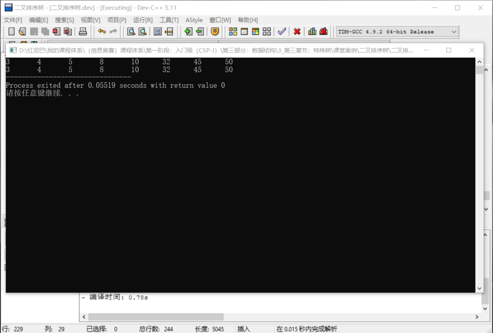

- 非递归后序遍历。

```cpp
//基于非递归的后序遍历
template<typename T>
void BinarySortTree<T>::postOrder() {
 TreeNode<T>* top= BinarySortTree<T>::root;
 //存储结点
 stack<TreeNode<T>*> stackNode;
 //存储标志
 stack<int>  stackFlag;
 int flag;
 while(top || !stackNode.empty()) {
  if(top) {
   flag=0;
             //结点第一次入栈
   stackNode.push(top);
   stackFlag.push(flag);
   top=top->leftChild;
  } else {
   top= stackNode.top();
   stackNode.pop();
   flag= stackFlag.top();
   stackFlag.pop();
   if(flag==0) {
    flag=1;
    //第二次入栈
    stackNode.push(top);
    stackFlag.push(flag);
    top=top->rightChild;
   } else {
    cout<<top->value<<"\t";
    top=NULL;
   }
  }
 }
}
```

测试后序遍历：

```cpp
int main() {
 //实例化二叉排序树
 BinarySortTree<int> * bt=new BinarySortTree<int>(5);
 //插入新结点
 int nums[9]= {12,4,45,32,8,10,50,31,3};
 for(int i=0; i<9; i++) {
  bt->insert(nums[i]);
 }
 //得到根结点
 TreeNode<int> *root= bt->getRoot();
 bt->postOrder(root);
 cout<<endl;
 bt->postOrder();
 return 0;
}
```

#### 2.3  删除实现

从二叉树中删除结点，需要保证整棵二叉排序树的有序性依然存在。删除操作比插入操作要复杂，下面分别讨论。

```cpp
  1. 如果要删除的结点是叶子结点。只需要把删除结点的父结点的左指针或右指针的引用值设置为空便可。

  2. 删除的结点只有一个右子结点。如下图删除结点 `8`。
```

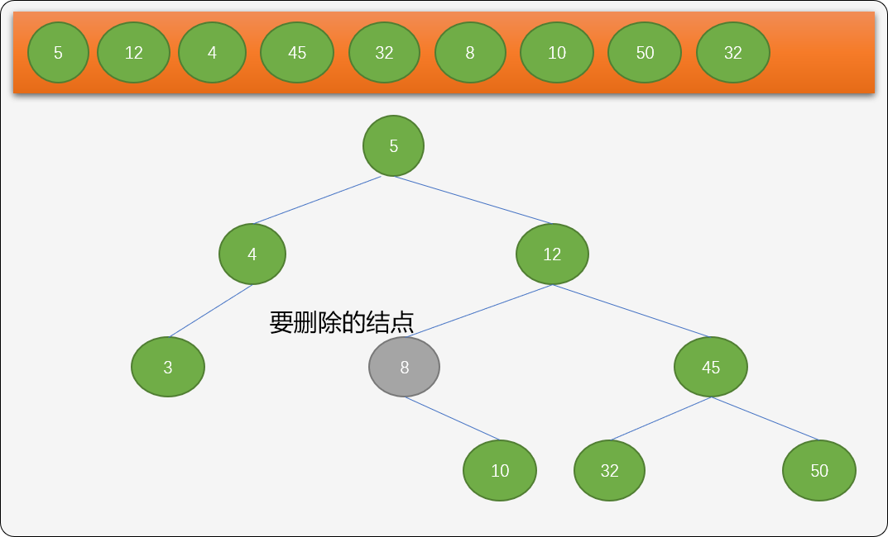

因为结点`8`没有左子树，只需要把它的右子结点替换删除结点就可以了。

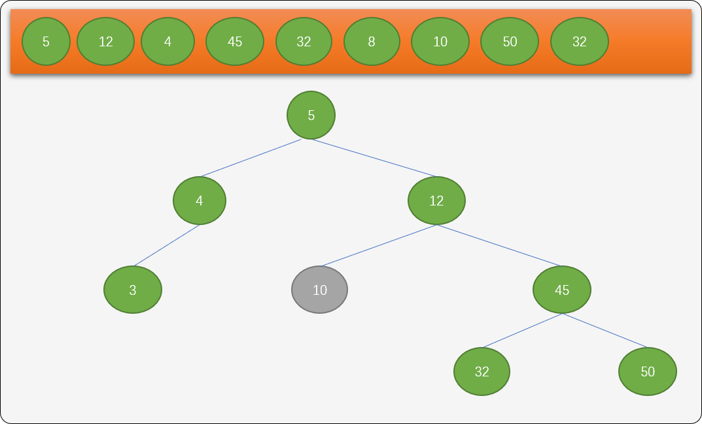

1. 删除的结点存在左子结点，如下图删除值为 `25` 的结点。此种情形有 `2` 种可选方案。

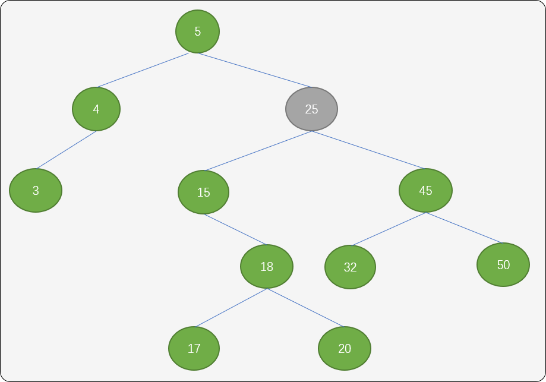

**复制方案**：找到结点 `25` 的左子树中的最大值，即结点 `20`（该结点的特点：可能存在左子结点，一定没有右子结点）。用此结点值替换结点`25` 便可。

> 为什么要这么做？
>
> 道理很简单，既然是左子树中的最大值，替换删除结点后，整个二叉排序树的特性可以继续保持。

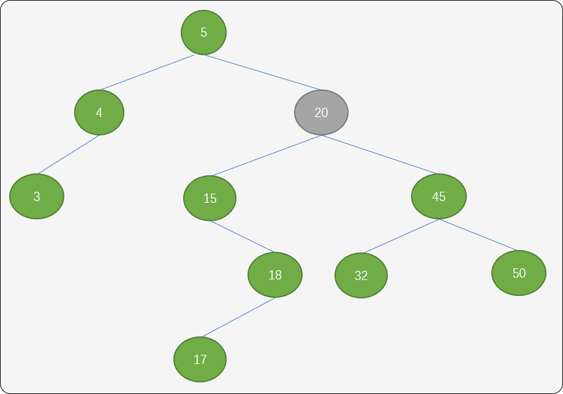

如果结点 `20` 存在左子结点，则把它的左子结点作为结点`18`的右子结点。

> Tips：如果删除值为 `45`的结点，虽然存在左子结点，但左树中不存在最大右结点，可以直接把 `32`替换过去.

**移子树方案**：同样找到结点`25`中左子树中的最大值结点 `20`，然后把结点 `25` 的右子树作为结点 `20` 的右子树。

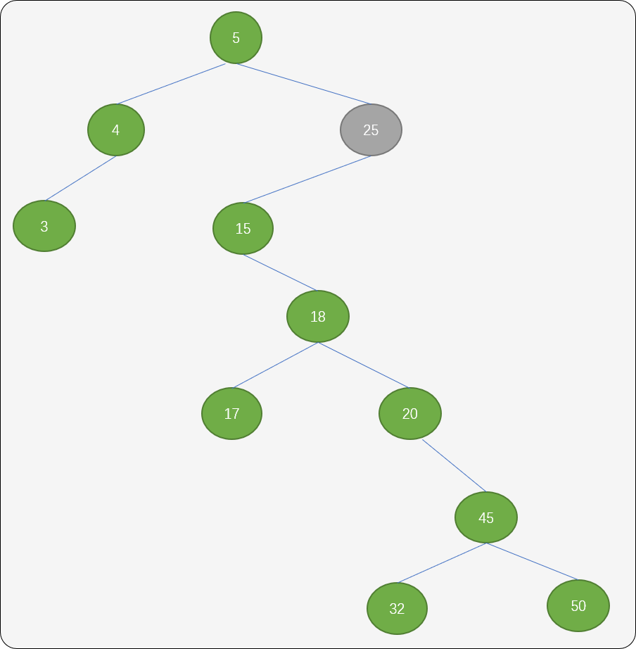


再把结点 `25` 的左子树移到 `25` 位置。

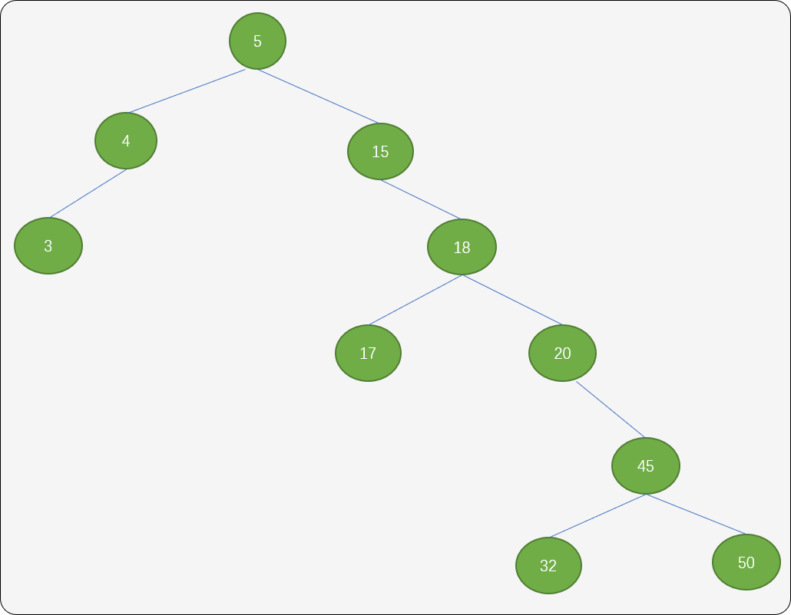


这种方案会让树增加树的深度。所以，建议使用第一种方案。

**删除方法的实现：**

```cpp
template<typename T>
bool BinarySortTree<T>::deleteNode(T val) {
 //查找结点是否存在,从根结点开始比较
 TreeNode<T> *move=BinarySortTree<T>::root;
 //删除时，需要结点的前驱结点
 TreeNode<T> *parentNode=NULL;
 while(move!=NULL) {
  if(move->value==val)
   //找到
   break;
  else if(move->value>val) {
   parentNode=move;
   //在左子树上查找
   move=move->leftChild;
  } else {
   parentNode=move;
   //在右子树上查找
   move=move->rightChild;
  }
 }
 if (move==NULL)
  //不存在
  return false;
 if (move->leftChild==NULL && move->rightChild==NULL) {
  //如果是叶结点
  if (parentNode->leftChild==move)
   parentNode->leftChild=NULL;
  else
   parentNode->rightChild=NULL;
  delete move;
 } else if(move->leftChild==NULL && move->rightChild!=NULL) {
  //如果不存在左子结点,只有右子树
  if (parentNode->leftChild==move)
   parentNode->leftChild=move->rightChild;
  else
   parentNode->rightChild=move->rightChild;
  delete move;
 } else if(move->leftChild!=NULL) {
  //如果存在左子结点,找到左子结点中的最大值结点
  TreeNode<T> *pre=move;
  TreeNode<T> *p=move->leftChild;
  //如果左子结点不存在右子结点 
  if(p->rightChild==NULL) {
   move->value=p->value;
   if(p->leftChild!=NULL) {
    move->leftChild= p->leftChild;
   } else {
    move->leftChild=NULL;
   }
   delete p;
  } else {
   while(p->rightChild!=NULL) {
    pre=p;
    p=p->rightChild;
   }
   //将最大值结点的值赋值绘删除结点
   move->value=p->value;
   if(p->leftChild!=NULL) {
    pre->rightChild=p->leftChild;
   }
   pre->rightChild=NULL; 
   delete p;
  }
 }
    return true;
}
```

使用中序遍历测试删除，理论上，删除任一结点后，中序遍历的输出结果应该还是有序的。

```cpp
int main() {
 //实例化二叉排序树
 BinarySortTree<int> * bt=new BinarySortTree<int>(5);
 //插入新结点
 int nums[9]= {12,4,45,32,8,10,50,31,3};
 for(int i=0; i<9; i++) {
  bt->insert(nums[i]);
 }
 //得到根结点
 TreeNode<int> *root= bt->getRoot();
 cout<<"删除之前"<<"\t"; 
 bt->inOrder(root);
 cout<<endl;
 for(int i=0; i<9; i++) { 
     //删除任一结点
  cout<<"删除结点"<<nums[i]<<"之后:\t"; 
  bt->deleteNode(nums[i]);
  bt->inOrder(root);
  cout<<endl;
 }
 return 0;
}
```

**输出结果：**

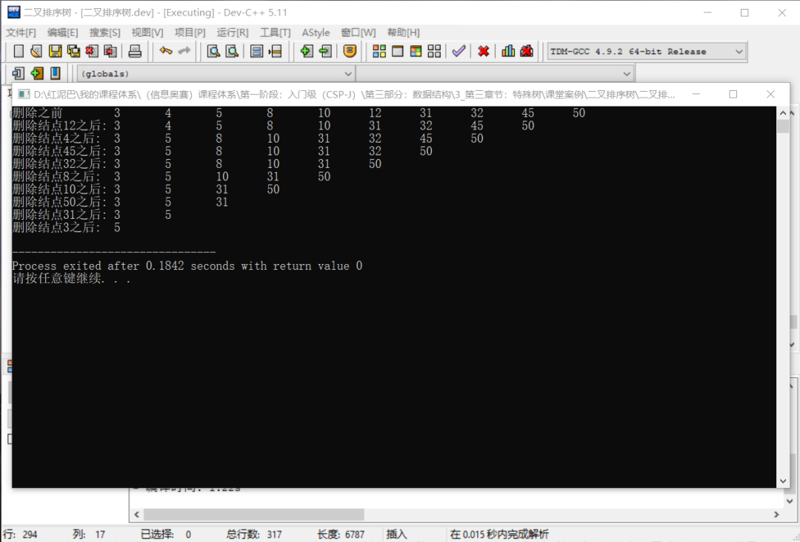


## 3. 总结

本文讲解了什么是二叉排序树，并深入地探讨了在二叉排序树如何进行数据的插入、遍历、删除……


