# C++ 漫谈哈夫曼树


## 1. 前言

**什么是哈夫曼树？**

把权值不同的`n`个结点构造成一棵二叉树，如果此树满足以下几个条件：

- 此 `n` 个结点为二叉树的`叶结点` 。
- `权值`较大的结点离根结点较近，权值较小的结点离根结点较远。
- 该树的`带权路径长度`是所有可能构建的二叉树中最小的。

则称符合上述条件的二叉树为最优二叉树，也称为`哈夫曼树(Huffman Tree)`。

**构建哈夫曼树的目的是什么？**

用来解决在通信系统中如何使用最少的二进制位编码字符信息。

本文将和大家聊聊哈夫曼树的设计思想以及构建过程。

## 2. 设计思路

`哈夫曼树`产生的背景：

在通信系统中传递一串`字符串`文本时，对这一串字符串文本进行二进制编码时，如何保证所用到的`bit`位是最少的，或保证整个编码后的传输长度最短。

现假设字符串由`ABCD 4`个字符组成，最直接的思维是使用 `2` 个`bit`位进行`等长编码`，如下表格所示：

| 字符 | 编码 |
| :--: | :--: |
| `A`  | `00` |
| `B`  | `01` |
| `C`  | `10` |
| `D`  | `11` |

传输`ABCD`字符串一次时，所需`bit`为 `2`位，当通信次数达到 `n`次时，则需要的总传输长度为 `n*2`。当字符串的传输次数为 `1000`次时，所需要传输的总长度为 `2000`个`bit`。

使用`等长编码`时，如果传输的报文中有 `26` 个不同字符时，因为需要对每一个字符进行编码，至少需要 `5`位`bit`。

但在实际应用中，各个字符的出现频率或使用次数是不相同的，如`A、B、C`的使用频率远远高于`X、Y、Z`。使用等长编码特点是无论字符出现的频率差异有多大，每一个字符都得使用相同的`bit`位。

哈夫曼的设计思想是：对字符串信息进行编码设计时，让使用频率高的字符使用`短码`，使用频率低的用`长码`，以优化整个信息编码的长度。基于这种简单、朴素的想法设计出来的编码也称为`不等长编码`。

哈夫曼不等长编码的具体思路如下：

如现在要发送仅由`A、B、C、D 4` 个字符组成的报文信息 ，`A`字符在信息中占比为 `50%`，`B`的占比是 `20%`，` C`的占比是 `15%`， `D`的  占比是`10%`。

不等长编码的朴实思想是`字符`的占比越大，所用的`bit`位就少，占比越小，所用`bit`位越多。如下为每一个字符使用的`bit`位数：

- `A`使用 `1`位`bit`编码。
- `B`使用 `2` 位 `bit`编码。
- `C` 使用 `3` 位 `bit`编码。
- `D` 使用 `3` 位 `bit` 编码。

**具体编码如下表格所示：**

| 字符 |  占比  | 编码  |
| :--: | :----: | :---: |
| `A`  | `0.5`  |  `0`  |
| `B`  | `0.2`  | `10`  |
| `C`  | `0.15` | `110` |
| `D`  | `0.1`  | `111` |

如此编码后，是否真的比前面的等长编码所使用的总`bit`位要少？

计算公式=`0.5*1+0.2*2+0.15*3+0.1*3=1.65`。

> 先计算每一个字符在报文信息中的占比乘以字符所使用的`bit`位。
>
> 然后对上述每一个字符计算后的结果进行相加。

显然，编码`ABCD`只需要 `1.65` 个`bit` ，比等长编码用到的`2 个 bit`位要少 。当传输信息量为 `1000`时，总共所需要的`bit`位=`1.65*1000=1650 bit`。

**为什么称哈夫曼编码为哈夫曼树?**

因为字符的编码是通过构建一棵`自下向上`的二叉树推导出来的，如下图所示：

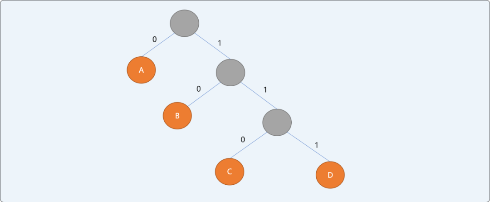


哈夫曼树的特点：

- 信息结点都是叶子结点。
- 叶子结点具有权值。如上二叉树，`A`结点权值为`0.5`，`B`结点权值为`0.2`，`C`结点权值为`0.15`，`D`结点权值为 `0.1`。
- 哈夫曼编码为不等长前缀编码（即要求一个字符的编码不能是另一个字符编码的前缀）。
- 从`根结点`开始，为左右分支分别编号`0`和`1`，然后顺序连接从根结点到叶结点所有分支上的编号得到字符的编码。

相信大家对哈夫曼树有了一个大概了解，至于如何通过构建哈夫曼树，咱们继续再聊。

## 3. 构建思路

在构建`哈夫曼树`之前，先了解几个相关概念：

- **路径和路径长度：**在一棵树中，从一个结点往下可以达到的孩子或孙子结点之间的通路，称为`路径`。通路中分支的数目称为`路径长度`。若规定根结点的层数为`1`，则从根结点到第`L`层结点的路径长度为`L-1`。
- **结点的权及带权路径长度：**若将树中结点赋给一个有着某种含义的数值，则这个数值称为该结点的`权`。结点的带权路径长度为：从根结点到该结点之间的路径长度与该结点的权的乘积。
- **树的带权路径长度：**树的带权路径长度规定为所有叶子结点的带权路径长度之和，记为`WPL`。

如有权值为`{3,4,9,15}`的 `4` 个结点，则可构造出不同的二叉树，其带权路径长度也会不同。如下 `3` 种二叉树中，`B`的树带权路径长度是最小的。

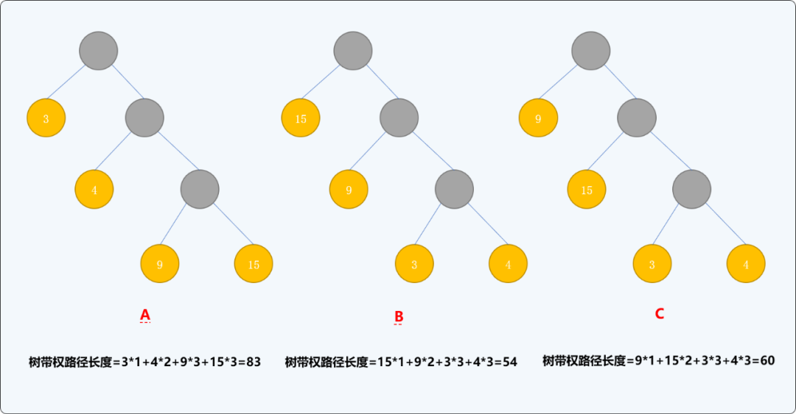


`哈夫曼树`的构建过程就是要保证`树的带权路径长度`最小。

那么，如何构建二叉树，才能保证构建出来的二叉树的带权路径长度最小？

如有一`字符串`信息由 `ABCDEFGH 8`个字符组成，每一个字符的`权值`分别为`{3,6,12,9,4,8,21,22}`，构建最优哈夫曼树的流程：

1. 以每一个结点为根结点构建一个单根二叉树，二叉树的左右子结点为空，根结点的权值为每个结点的权值。并存储到一个树集合中。


1. 从`树集合`中选择根结点的权值最小的 `2` 个树。重新构建一棵新二叉树，让刚选择出来的`2` 棵树的根结点成为这棵新树的左右子结点，新树的根结点的权值为 `2` 个左右子结点权值的和。构建完成后从树集合中删除原来 `2`个结点，并把新二叉树放入树集合中。

   如下图所示。权值为 `3`和`4`的结点为新二叉树的左右子结点，新树根结点的权值为`7`。

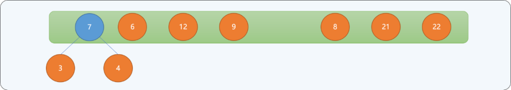


1. 重复第二步，直到树集合中只有一个根结点为止。

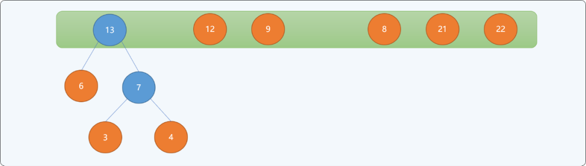


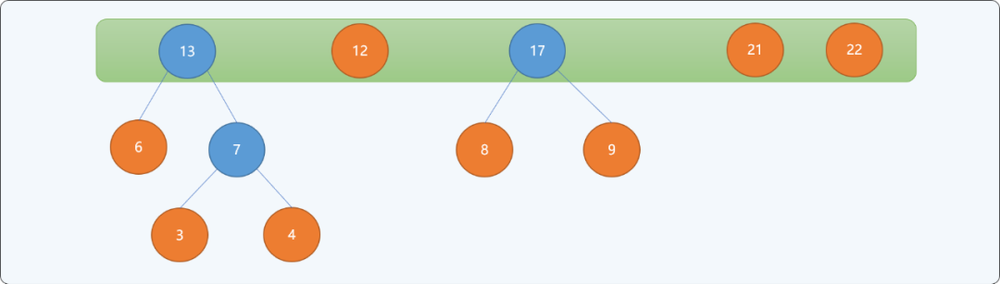


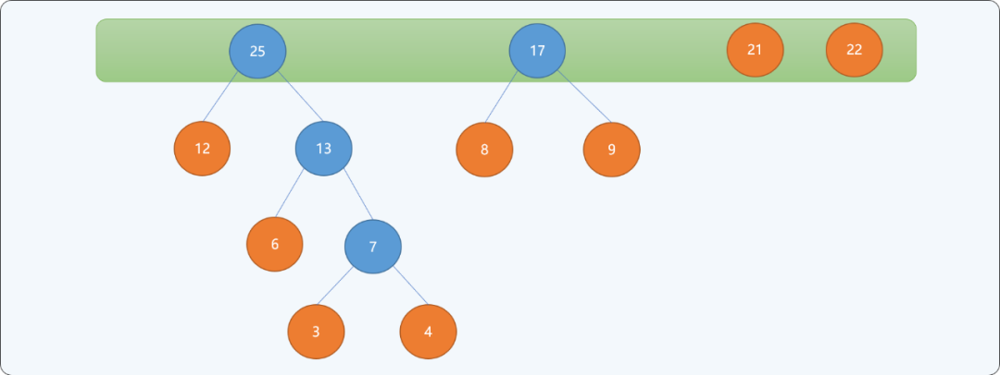


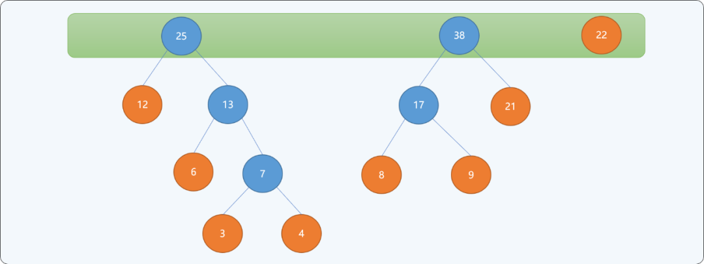


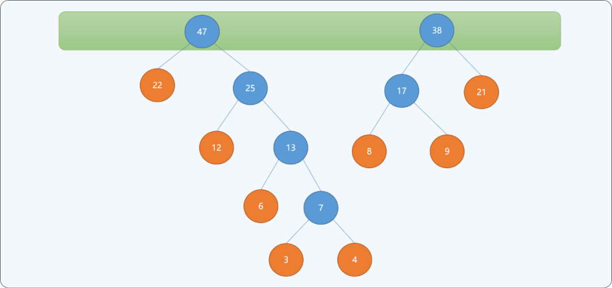


当最后集合中只存在一个根结点时，停止构建，并且为最后生成树的每一个非叶子结点的左结点分支标注`0`，右结点分支标注`1`。如下图所示：

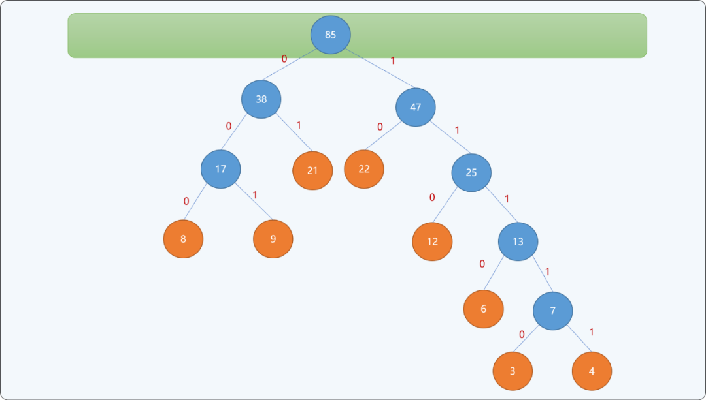


通过上述从下向上的思想构建出来的二叉树，可以保证权值较小的结点离根结点较远，权值较大的结点离根结点较近。最终二叉树的带权路径长度：`WPL=(3+4)*5+6*4+(8+9+12)*3+(21+22)*2=232` 。并且此树的带权路径长度是所有可能构建出来的二叉树中最小的。

上述的构建思想即为哈夫曼树设计思想，不同权值的字符编码就是结点路径上`0`和`1`的顺序组合。如下表所述，权值越大，其编码越小，权值越小，其编码越大。其编码长度即从根结点到此叶结点的路径长度。

| 字符 | 权值 |  编码   |
| :--: | :--: | :-----: |
| `A`  | `3`  | `11110` |
| `B`  | `6`  | `1110`  |
| `C`  | `12` |  `110`  |
| `D`  | `9`  |  `001`  |
| `E`  | `4`  | `11111` |
| `F`  | `8`  |  `000`  |
| `G`  | `21` |  `01`   |
| `H`  | `22` |  `10`   |

## 4. 编码实现

### 4.1 使用优先队列

可以把`权值`不同的结点分别存储在`优先队列（Priority Queue）`中，并且给与权重较低的结点较高的`优先级（Priority）`。

具体实现哈夫曼树算法如下：

1. 把`n`个结点存储到优先队列中，则`n`个节点都有一个优先权`Pi`。这里是权值越小，优先权越高。
2. 如果队列内的节点数>1，则：

- 从队列中移除两个最小的结点。
- 产生一个新节点，此节点为队列中移除节点的父节点，且此节点的权重值为两节点之权值之和，把新结点加入队列中。
- 重复上述过程，最后留在优先队列里的结点为哈夫曼树的根节点（`root`）。

**完整代码：**

```cpp
#include <iostream>
#include <queue>
#include <vector>
using namespace std;
//树结点
struct TreeNode {
 //结点权值
 float weight;
 //左结点
 TreeNode *lelfChild;
 //右结点
 TreeNode *rightChild;
    //初始化
 TreeNode(float w) {
  weight=w;
  lelfChild=NULL;
  rightChild=NULL;
    }
};
//为优先队列提供比较函数
struct comp {
 bool operator() (TreeNode * a, TreeNode * b) {
        //由大到小排列
  return a->weight > b->weight; 
 }
};

//哈夫曼树类
class HfmTree {
 private:
         //优先队列容器
  priority_queue<TreeNode *,vector<TreeNode *>,comp> hfmQueue;
 public:
  //构造函数，构建单根结点树
  HfmTree(int weights[8]) {
   for(int i=0; i<8; i++) {
    //创建不同权值的单根树
    TreeNode *tn=new TreeNode(weights[i]);
    hfmQueue.push(tn);
   }
  }
  //显示队列中的最一个结点
  TreeNode* showHfmRoot() {
   TreeNode *tn;
   while(!hfmQueue.empty()) {
    tn= hfmQueue.top();
    hfmQueue.pop();
   }
   return tn;
  }
  //构建哈夫曼树
  void create() {
             //重复直到队列中只有一个结点
   while(hfmQueue.size()!=1) {
    //从优先队列中找到权值最小的 2 个单根树
    TreeNode *minFirst=hfmQueue.top();
    hfmQueue.pop();
    TreeNode *minSecond=hfmQueue.top();
    hfmQueue.pop();
    //创建新的二叉树
    TreeNode *newRoot=new TreeNode(minFirst->weight+minSecond->weight);
    newRoot->lelfChild=minFirst;
    newRoot->rightChild=minSecond;
    //新二叉树放入队列中
    hfmQueue.push(newRoot);
   }
  }
  //按前序遍历哈夫曼树的所有结点
  void showHfmTree(TreeNode *root) {
   if(root!=NULL) {
    cout<<root->weight<<endl;
    showHfmTree(root->lelfChild);
    showHfmTree(root->rightChild);
   }
  }
  //析构函数
  ~HfmTree() {
            //省略
  }
};

//测试
int main(int argc, char** argv) {
 //不同权值的结点
 int weights[8]= {3,6,12,9,4,8,21,22};
    //调用构造函数
 HfmTree hfmTree(weights);
    //创建哈夫曼树
 hfmTree.create();
    //前序方式显示哈夫曼树
 TreeNode *root= hfmTree.showHfmRoot();
 hfmTree.showHfmTree(root);
 return 0;
}
```

**显示结果：**

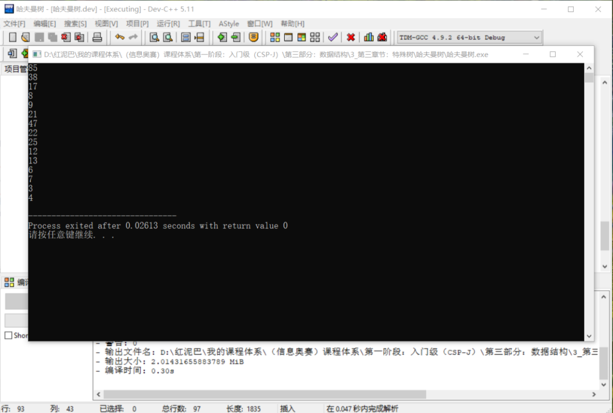


上述输出结果，和前文的演示结果是一样的。

此算法的时间复杂度为`O（nlogn）`。因为有`n`个结点，所以树总共有`2n-1`个节点，使用优先队列每个循环`O（log n）`。

### 4.2 使用一维数组

除了上文的使用优先队列之外，还可以使用一维数组的存储方式实现。

在哈夫曼树中，叶子结点有 `n`个，非叶子结点有 `n-1`个，使用数组保存哈夫曼树上所的结点需要 `2n-1`个存储空间 。其算法思路和前文使用队列的思路差不多。直接上代码：

```cpp
#include <iostream>
using namespace std;
//叶结点数量
const unsigned int n=8;
//一维数组长度
const unsigned int m= 2*n -1;
//树结点
struct TreeNode {
 //权值
 float weight;
 //父结点
 int parent;
 //左结点
 int leftChild;
 //右结点
 int rightChild;
};
class HuffmanTree {
 public:
  //创建一维数组
  TreeNode hfmNodes[m+1];
 public:
  //构造函数
  HuffmanTree(int weights[8]);
  ~HuffmanTree( ) {

  }
  void findMinNode(int k, int &s1, int &s2);
  void showInfo() {
   for(int i=0; i<m; i++) {
    cout<<hfmNodes[i].weight<<endl;
   }
  }
};
HuffmanTree::HuffmanTree(int weights[8]) {
 //前2 个权值最小的结点
 int firstMin;
 int  secondMin;
 //初始化数组中的结点
 for(int i = 1; i <= m; i++) {
  hfmNodes[i].weight = 0;
  hfmNodes[i].parent = -1;
  hfmNodes[i].leftChild = -1;
  hfmNodes[i].rightChild = -1;
 }
 //前 n 个是叶结点
 for(int i = 1; i <= n; i++)
  hfmNodes[i].weight=weights[i-1];

 for(int i = n + 1; i <=m; i++) {
  this->findMinNode(i-1, firstMin, secondMin);
  hfmNodes[firstMin].parent = i;
  hfmNodes[secondMin].parent = i;
  hfmNodes[i].leftChild = firstMin;
  hfmNodes[i].rightChild = secondMin;
  hfmNodes[i].weight = hfmNodes[firstMin].weight + hfmNodes[secondMin].weight;
 }
}
void HuffmanTree::findMinNode(int k, int & firstMin, int & secondMin) {
 hfmNodes[0].weight = 32767;
 firstMin=secondMin=0;
 for(int i=1; i<=k; i++) {
  if(hfmNodes[i].weight!=0 && hfmNodes[i].parent==-1) {
   if(hfmNodes[i].weight < hfmNodes[firstMin].weight) { 
                  //如果有比第一小还要小的，则原来的第一小变成第二小
    secondMin = firstMin;
                  //新的第一小
    firstMin = i;
   } else if(hfmNodes[i].weight < hfmNodes[secondMin].weight)
       //如果比仅比第二小小 
                 secondMin = i;
  }
 }
}

int main() {
 int weights[8]= {3,6,12,9,4,8,21,22};
 HuffmanTree huffmanTree(weights);
 huffmanTree.showInfo();
 return 1;
}
```

**测试结果：**

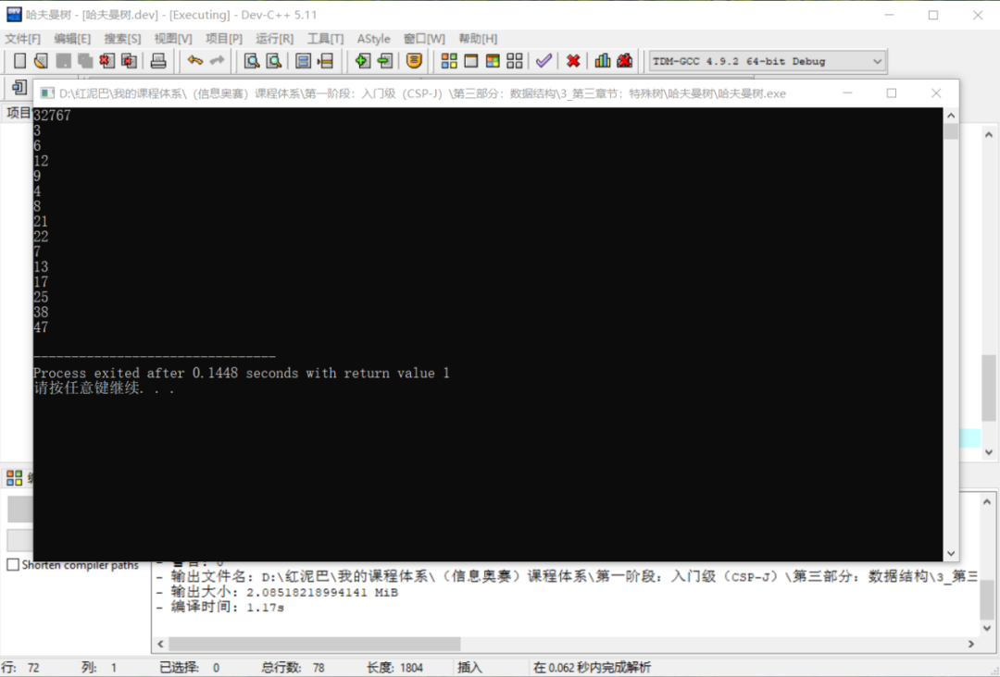


## 5. 总结

哈夫曼树是二叉树的应用之一，掌握哈夫曼树的建立和编码方法对解决实际问题有很大帮助。


