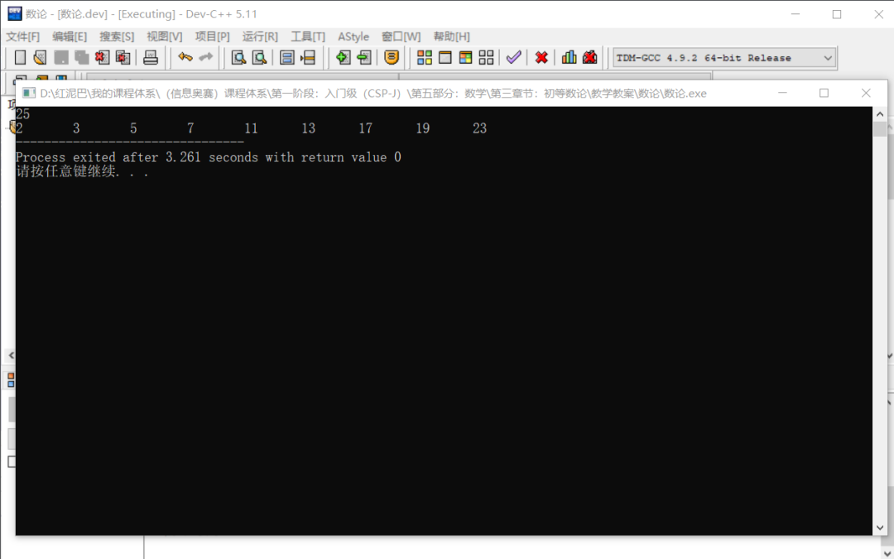
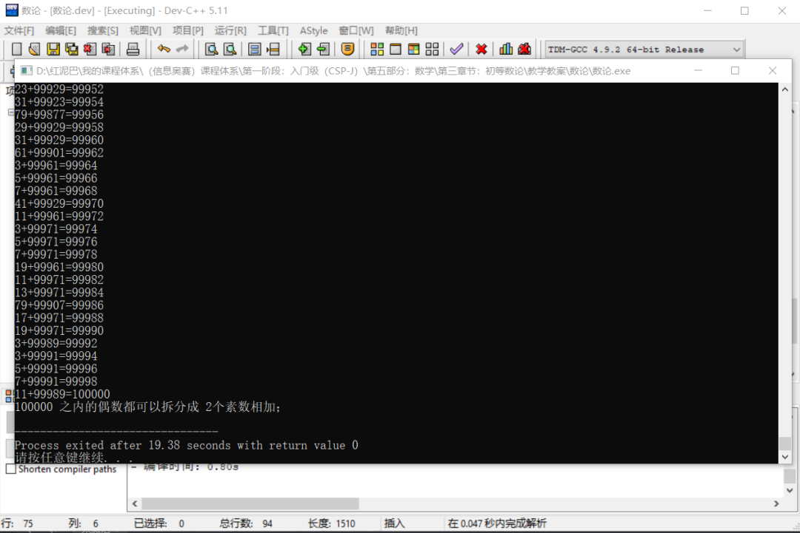
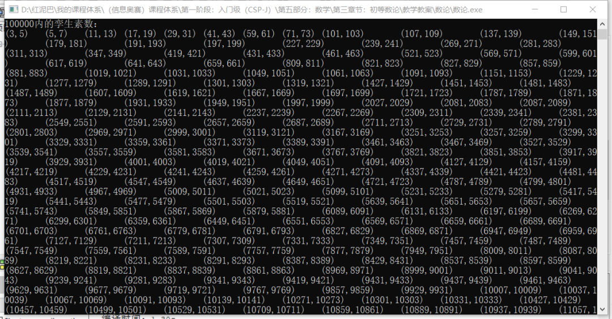
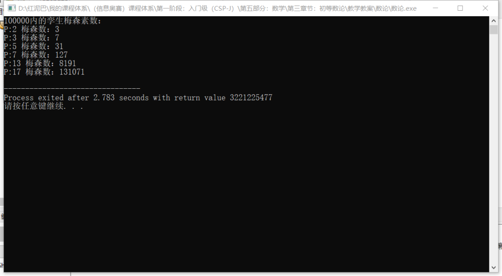

# C++数学与算法系列之初等数论


## 1. 数

**什么是数？**

一个用作计数、标记或用作量度的抽象概念。

代表数的一系列符号，包括**数字、运算符号**等统称为**记数系统**。

在日常生活中，数通常出现在标记（如公路、电话和门牌号码）、序列号和编码上。在数学里，数的定义延伸至包含如分数、负数、无理数、超越数及复数等抽象化的概念。

**什么是数的进制？**

数的表示方式，常用的有十进制、二进制、十六进制、八进制……

`C++` 字面值常量默认用十进制表示：

```cpp
int num=19; 
```

`C++`数值的二进制表示法：

```cpp
int num=0B101; 
```

`C++` 数值的八进制表示法：

```cpp
int num=045; 
```

`C++`数值的十六进制表示法：

```cpp
int num=0x45; 
```

输出以上变量中的数值时，编译器统一转换成十进制后再输出。

进制的转换：如下讲解十进制转二进制，其它思路类似。十进制转换成二进制的思路：迭代除`2`反序取余数。

```cpp
#include <iostream>
#include <stack>
using namespace std;
/*
*十进制转二进制
*/
int decimalToBinary(int num) {
 stack<int> myStack;
 while(num>0) {
  myStack.push(num % 2 );
  num=num / 2;
 }
 int newNum=0;
 while( !myStack.empty() ) {
  newNum=newNum*10+myStack.top() ;
  myStack.pop();
 }
 return newNum;
}
int main(int argc, char** argv) {
 int num=decimalToBinary(10);
 cout<<num;
 return 0;
}
```

十进制转八进制是迭代除`8`反序取余数、十进制转十六进制是迭代除`16`反序取余数。

## 2. 数论

**什么是数论？**

数论旧时称为算术，是专门研究整数的纯数学分支，到二十世纪初，它被“**数学理论**”所取代。

为了研究的方便，数论有很多针对性很强的分支，如`初等数论`、`解析数论`、`代数数论`、`几何数论`、`计算数论`、`超越数论`、`组合数论`、`算术代数几何`……

其中计算数论：指借助电脑的算法帮助研究数论的问题，例如素数测试和因数分解等和密码学息息相关的课题。

算术代数几何：是数论发展到目前为止最深刻最前沿的领域， 可谓集大成者。它从代数几何的观点出发，通过深刻的数学工具研究数论的性质。

数论是一个庞大大的主题，本文将讲解数论领域中一些较经典的算法思路。

### 2.2 欧几里德算法

欧几里得算法又称`辗转相除法`，用于求解两个正整数`a`，`b`的最大公约数，扩展欧几里得算法算法可用于`RSA`加密等领域。

> **Tips：** 最大公约数指能同时被 `a`和 `b` 整除的最大因数。

欧几里得算法的基本思路：

假如需要求 `2022` 和 `2003` 两个正整数的最大公约数，其流程如下：

- 先用 `2022 ÷ 2003=1 …… 19 (余数) `。
- 再 `2003 ÷ 19 = 105 …… 8`。
- 再 `19 ÷ 8 = 2 …… 3`。
- 再 `8 ÷ 3 = 2 …… 2`。
- 再 `3 ÷ 2 = 1 …… 1`。
- 再 `2 ÷ 1 = 2 …… 0`。

最后得到两数的最大公约数是 `1` 。

基本思想，让`除数`和`余数`重复除法运算，当余数为 `0` 时，最后`算式`中的`除数`作为最大公约数。

欧几里德算法是一个反复迭代过程，可以使用递归和非递归 `2` 种方案实现：

- 非递归。

```cpp
#include <iostream>
using namespace std;
int main() {
 int num1;
 cin>>num1;
 int num2;
 cin>>num2;
 //最大公约数小于或等于 2 数中的小数 
 int minNum= num1>num2? num2:num1;
 for(int i=minNum;i>0;i--){
  if( num1 % i==0 && num2 % i==0  ){
             //同时被 2 数整除
   cout<<i<<endl;
   break;
  }
 }
 return 0;
}
```

- 递归。

```cpp
#include <iostream>
using namespace std;
//求最大公约数
int gcd(int num1, int num2) {
 if (num1 % num2==0) return num2;
 else return gcd(num2, num1 % num2);
}
int main() {
 int num1;
 cin>>num1;
 int num2;
 cin>>num2;
 //最大公约数小于或等于 2 数中的小数
 if (num1<num2) {
  int temp=num1;
  num1=num2;
  num2=temp;
 }
 int res= gcd(num1,num2);
 cout<<res;
 return 0;
}
```

除了欧几里德算法，求解最大公约数还有`Stein`算法。

`Stein`算法由`J. Stein`于1961年提出，这个方法也是计算两个数的最大公约数。和欧几里得算法不同的是，`Stein`算法只有整数的移位和加减法。

`Stein`算法核心支撑理论：

- `gcd(a,a) = a`，一个数和他自身的公约数是其自身。
- `gcd(ka,kb) = k gcd(a,b）`，最大公约数运算和倍乘运算可以交换，如当`k=2`时，说明两个偶数的最大公约数必然能被`2`整除。

如求 `68,32`的最大约数的过程：

- 根据 `gcd(ka,kb) = k gcd(a,b）` 特性。`68和32` 的最大公约数等于 `68÷2=34和 32÷2=16`的最大公约数。
- 同理 `34和16的`最大公约数等于 `34÷2=17`和`16÷2=8`的最大公约数。
- `17和8`的有一个数字是偶数，则其最大公约数等于 `17`和`8÷2=4`的最大公约数。
- `17和4`满足其中有一个数字是偶数，则最大公约数等于`17`和`4÷2=2`的最大公约数。
- `17和2`的最大公约数数等于 `17和2÷2=1`的最大公约数。
- `17和1`的最大公约数等于 `(17-1)÷2=8`和`1`的最大公约数。
- `8和1`的最大公约数等于`8÷2=4和1`的最大公约数。
- `4和1`的最大公约数等于`4÷2=2和1`的最大公约数。
- `2和1`的最大公约数等于`2÷2=1`和`1`的最大公约数。
- `1和1`的公约数是自身，最终结论`68和32` 的最大公约数是`1`。

**编程实现：**

```cpp
#include <iostream>
using namespace std;
//求解最大公约数
int gcd(int num1,int num2) {
 if(num1<num2) {
  //保证 num1 大于 num2
  int temp = num1;
  num1 = num2;
  num2=temp;
 }
 if(num2==0)
  //出口
  return num1;
 if(num1%2==0 && num2%2 ==0)
  //2 个数字都是偶数
  return 2*gcd(num1/2,num2/2);
 if (num1%2 == 0)
  //num1 是偶数
  return gcd(num1/2,num2);
 if (num2%2==0)
  //num2 是偶数
  return gcd(num1,num2/2);
 //都是奇数
 return gcd((num1-num2)/2,num2);
}
int main() {
 int res= gcd(56,48);
 cout<<res;
 return 0;
}
```

**扩展欧几里得算法**

已知整数`a`、`b`，扩展欧几里得算法可以在求得`a、b`的最大公约数同时，能找到整数`x、y`（其中一个很可能是负数），使它们满足：`a*x+b*y=gcd(a,b)`。

```cpp
#include <iostream>
using namespace std;
int gcdEx(int num1,int num2,int * x,int* y) {
 if(num2==0) {
  *x=1;
  *y=0;
  return num1 ;
 } else {
  int r=gcdEx(num2,num1%num2,x,y);
  int t=*x ;
  *x=*y ;
  *y=t-num1/num2**y ;
  return r ;
 }
}
int main() {
 int num1;
 cin>>num1;
 int num2;
 cin>>num2;
 int x;
 int y;
 int res= gcdEx(num1,num2,&x,&y);
 cout<<"最大公约数："<<res<<endl;
 int res_=num1*x+num2*y;
 cout<<num1<<"*"<<x<<"+"<<num2<<"*"<<y<<"="<<res_ <<endl;
 return 0;
}
```

### 2.3 埃氏筛法

埃拉托斯特尼筛法，简称埃氏筛或爱氏筛。算法说明：要得到自然数`n`以内的全部素数，必须把不大于所有素数的倍数剔除，剩下的就是素数。

算法演示：求解出 `2 3 4 5 6 7 8 9 10 11 12 13 14 15 16 17 18 19 20 21 22 23 24 25`数列中的所有素数。

- 找出序列中的第一个素数，也就是 `2`，将剩下序列中`2`的倍数划掉，序列变成 `2 3 5 7 9 11 13 15 17 19 21 23 25`。
- 找到素数`3`，将主序列中`3`的倍数划掉，主序列变成：`2 3 5 7 11 13 17 19 23 25`。
- 序列中第一个素数是`5`，同样将序列中`5`的倍数划掉，主序列成了`2 3 5 7 11 13 17 19 23`。
- 直到`23`小于`5`的平方，跳出循环。`2`到`25`之间的素数是：`2 3 5 7 11 13 17 19 23`。

```cpp
#include <iostream>
#include <cmath>
#include <vector>
using namespace std;
//缓存所有数字
int caches[100000]= {0};
//标记是否为素数 0 表示为素数， 1 表示不是
int flag[100000]= {0};

int main() {
     //数字范围
 int num;
 cin>>num;
 for(int i=2; i<=num; i++)
         //缓存
  caches[i]=i;
 //初始第一个素数
 flag[2]=0;
    //左指针
 int left=2;
    //右指针
 int right=num;
 while( 1 ) {
  if(flag[left]==0) {
   //清除与此素数为倍数的其它数字,仅做标记
   int j=2;
   while( caches[left] *j<= caches[right] ) {
    flag[ caches[left] *j ]=1;
    j++;
   }
  }
  //重新确定右边位置
  while(caches[right]==1 ) {
   right--;
  }
  left++;
         //结束循环条件
  if( flag[left]==0 && pow( caches[left],2 ) > caches[right] )
   break;
 }
 //输出
 for(int i=2; i<=num; i++)
  if(flag[i]==0)
   cout<<caches[i]<<"\t";
 return 0;
}
```

输出结果：




### 2.4 哥德巴赫猜想

哥德巴赫猜想：是否每个大于`2`的偶数都可写成两个质数之和？

`哥德巴赫猜想`是不是正确的，姑且不论，但可借助程序，在计算机能存储的最大存储数字范围内证明猜想的正确性。

```cpp
#include <iostream>
#include <cmath>
using namespace std;
//缓存器，记录某个数字是不是素数 1 表示是 ，2 表示不是
int caches[100000]= {0};
//判断是不理素数
bool isSs(int num) {
 bool is=true;
 for(int i=2; i<=int(sqrt(num)); i++ ) {
  if(num % i==0 ) {
   is=false;
   break;
  }
 }
 return is;
}
//缓存素数和非素数信息
bool cacheNum(int num) {
 int res=caches[num];
 if( res==0 ) {
  if(isSs(num)) {
   //是素数
   caches[num]=1;
   return 1;
  } else {
   //不是素数
   caches[num]=2;
   return 0;
  }
 } else if( res==2 ) {
  return 0;
 }
 return 1;
}
/*
* 哥德巴赫猜想
* 偶数是否能拆分成 2 个素数之和
*/
bool gdbh(int num) {
 if (num % 2!=0)return false;
 int left=2;
 int right=num-1;
 int sum=0;
 while ( left<=right ) {
  if(cacheNum(left) && cacheNum(right)  ) {
             // 2 个数字都是素数
   sum=left+right;
   if(sum==num) {
    cout<<left<<"+"<<right<<"="<<num<<endl;
    return true;
   } else if(sum>num)
                 //变小一点
    right--;
   else
                 //变大一点
    left++;
  } else if(!cacheNum(left)) {
             //左边不是素数
   left++;
  } else if(!cacheNum(right)) {
             //右边不是素数
   right--;
  } else {
             //2个数字都不是素数
   if(sum==num) {
    left++;
    right--;
   } else if(sum>num) {
    right--;
   } else {
    left++;
   }
  }
 }
 return false;
}

int main() {
 //检查 10000 之内的所有大于 2 的偶数
 int count=0;
 int count_=0;
 for(int i=4; i<=100000; i+=2) {
  count_++;
  if( gdbh(i) )
   count++;
 }
 if(count_==count) {
  cout<<"100000 之内的偶数都可以拆分成 2个素数相加；"<<endl;
 }
 return 0;
}
```

**输出结果：**




把这个范围扩大到计算机的存储极限点，还是可以证明此猜想的正确性。至于范围扩大至无穷大之后，此猜想是否正确就留给数学家们继续猜想吧。

### 2.5 孪生素数猜想

孪生素数就是差为`2`的素数对，例如`11`和`13`。是否存在无穷多的孪生素数？

是不是有无穷多个，这个留给数学界去思考，但是可以通过编码找出指出范围之内的所有孪生素数。

```cpp
#include <iostream>
#include <cmath>
using namespace std;
//缓存器，记录某个数字是不是素数 1 表示是 ，2 表示不是
int caches[100000]= {0};
//判断是不是素数 
bool isSs(long long num) { //省略…… }

//缓存素数和非素数信息
bool cacheNum(int num) { //省略…… }

//孪生素数
int lsss(int num) {
 if( cacheNum(num) &&  cacheNum(num+2) ) {
  //是素数，且相邻为 2 的数字也素数
  cout<<"("<<num<<","<<(num+2)<<")"<<"\t";
 }
}
//测试
int main() {
 cout<<"100000内的孪生素数："<<endl;
 for(int i=2; i<=100000; i++) {
        if(i!=2 && i%2==0)continue;
  lsss(i);
 }
 return 0;
}
```

**输出结果：**




### 2.6 斐波那契数列内是否存在无穷多的素数

可以通过编程求证在计算机所能计算的范围内尽可能找出斐波拉契数列中的素数。

```cpp
#include <iostream>
#include <cmath>
using namespace std;
//判断是不是素数
bool isSs(long long num) {
 bool is=true;
 for(long long i=2; i<=int(sqrt(num)); i++ ) {
  if(num % i==0 ) {
   is=false;
   break;
  }
 }
 return is;
}
/*
*找出斐波拉契数列中的素数
* 参数表示：多少个
*/
int fblq(long long num) {
 long long first=1;
 long long second=1;
 long long thir=0;
 long long count=0;
 for(long long i=1; i<=num; i++) {
  thir=first+second;
  cout<<thir;
  if( isSs(thir)  ) {
   cout<<"-"<<thir;
   count++;
  }
  cout<<endl;
  first=second;
  second=thir;
 }
 return count;
}

int main() {
 int res= fblq(50);
 cout<<"\n 斐波拉契数列中的素数有："<<res<<endl;
 return 0;
}
```

### 2.7  梅森素数

所谓梅森数，是指形如2p－1的一类数，其中指数`p`是素数，常记为`Mp`。如果梅森数是素数，就称为梅森素数。目前仅发现`51`个梅森素数，最大的是`M82589933`（即282589933－1），有`24862048`位。

是否存在无穷多个梅森素数是未解决的著名难题之一，但可以通过编程让计算机在能力所及范围内尽可能找出一些。

```cpp
#include <iostream>
#include <cmath>
using namespace std;
//缓存器，记录某个数字是不是素数 1 表示是 ，2 表示不是
int caches[100000]= {0};
//判断是不是素数 
bool isSs(long long num) { //省略…… }

//缓存素数和非素数信息
bool cacheNum(int num) { //省略…… }

int main() {
 int temp=0;
 cout<<"100000内的孪生梅森素数："<<endl;
 for(int i=2; i<=100000; i++) {
  if(i!=2 && i%2==0)continue;
  if( cacheNum(i)  ) {
   temp= pow(2,i)-1;
   if( cacheNum(temp) )
    cout<<"P:"<<i<<" 梅森数："<<temp<<endl;
  }
 }
 return 0;
}
```

**输出结果：**




## 3. 总结

数论是一个复杂庞大大的体系，至今为止，数论中有些经典问题已经被证明，有些问题还需时日。随着计算机硬件的发展，将会为解决纯数学理论提供了强有力的支撑，相信不久的将来，很多问题都可以解决。

本文仅讲解了常用的数论问题，除此之外，还有很多其它有趣的数论问题，有兴趣者可以自行了解。


