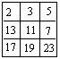

# C++初等数论


## **1. 前言**

数学知识的根基对学好编程至关重要。本文和大家讲讲在编程中要用到的数论知识。如同余式、欧拉定理和欧拉函数、费马小定理、威尔逊定理、裴蜀定理、模运算意义下的逆元、扩展欧几里得算法、孙子定理（中国剩余定理）。

除了理解数论概念，更重要能融会贯通。把对数论相关知识的认知运用到编程领域。

## **2. 同余式**

**概念**

如果两个整数`a,b` 的差值除另一个整数`(m)`的值为一个整数，同称`a,b`对模`m`同余数。数学上记作：`a≡b(mod m)`，称为`m`的同余式。通俗讲，同余指`a、b`除以`m`的余数相同。如`6、3`除以`3`的余数都为`0`，则称`6、3`对模`3`同余数。

同余式的用途很广，如判断几个数字是不是偶数，可以求这几个数字的对模`2`的余数是不是为`0`，即同余相同。

如果`a`除以`m`的商为`q1`、余数为`r`，`b`除以`m`的商为`q2`、余数也是`r`。则`a`可以描述为：`a=mq1+r`；`b`可以描述为`b=mq2+r`。

满足：`a≡b(mod m)<=>a-b=m(q1-q2)`。

**同余式的性质**

1. **相加性质**：如果`a1≡b1(mod m),a2≡b2(mod m),……an≡bn(mod m)`，则`a1+a2+……+an≡(b1+b2+……bn)(mod m)`。

举例说明：`6、3`对模`3`同余`0`；`15、9`对模`3`同余`0`；`21,15`对模`3`同余`0`。则`6+15+21`模`3`余数为`0`，`3+9+15`模`3`的余数为`0`。满足逐项相加性质。

1. **逆运算性质**：如果`a+b≡c(mod m)`，则`a=c-b(mod m)`。

举例说明：如`8+4`和`6`模`3`的余数为`0`。则，`8`模`3`余数为`2`，`6-4`模`3`的余数为`2`。满足逆运算法则。

1. **倍模相加或相减性质**：如果存在`a≡b(mod m)`，则式子`a+km≡b(mod m)`或者`a-km≡b(mod m)`成立。

举例说明：如`12`模`3`余数为`0`，`9`模`3`余数为`0`。则`12+6`和`9`模`3`同余`(0)`。`12-6`和`9`模`3`的同余`(0)`。

1. **相乘性质**：和相加性质类似，只需要把加法用乘法替换。如果`a1≡b1(mod m),a2≡b2(mod m),……an≡bn(mod m)`，则`a1*a2*……*an≡(b1*b2*……*bn)(mod m)`。

举例说明：`6、3`对模`3`同余`0`；`15、9`对模`3`同余`0`；`21,15`对模`3`同余`0`。则`6*15*21`模`3`余数为`0`，`3*9*15`模`3`的余数为`0`。满足逐项相乘性质。

1. **推广公式**：

1

1. **公约数性质**

如果`a≡b(mod m)`，存在`a,b`的公约数和模互质，则`a,b`分别除以公约数后的两个数也同余。互质指如果两个整数只有公约数`1`，则称两数互质。

如`27`和`21`模`2`同余`1`，`3`是`27`和`21`的公约数，且和模`2`互质。则`9`和`7`模`2`同余`1`。

1. **同余式的数和模乘上同一个整数同余式依然成立**。如果`a≡b(mod m)`则`ak≡bk(mod mk)`。

举例说明：`4`和`8`模`2`同余，则`4*2`和`8*2`模`2*2`同余。

1. **同余式的数和模可以被它们任一公约数除**。存在`a≡b(mod m)`，如果`a,b,m`有公约数`d`，则`a/d`和`b/d`模`m/d`同余。即`a=a1*d、b=b1*d、m=m1*d`，则`a1=b(mod m1)`。

举例说明：`8`和`16`模`4`同余，且`8,16,4`有共同的公约数`2`，则`4、8`模`2`同余。

1. **同余式对于模`m`的任意约数相等的模`d`也成立。**

举例说明：`8`和`16`模`4`同余，且`2`是模`4`的约数，则存在`8`和`16`模`2`同余。

1. **如果同余式右边的数和模能被某个数除尽，则同余式的左边的数也能被此数除尽**。即`a≡b(mod m),k|a,k|m,`则`k|b`。

举例说明：`12`和`8`模`4`同余，且`24`能把`8`和`4`除尽，则`24`也能把`12`除尽。

1. **同余式右边的数与模的最大公约数，等于另一边上的数与模的最大公约数。**即`a≡b(mod m)`,则`(a,m)=(b,m)`。

**余数判别法**

基本思想：求`N`被`m`除的余数，先找到一个较简单的数`R`，使得`N`与`R`对于除数`m`同余．由于`R`是一个较简单的数，所以可以通过计算`R`被`m`除的余数来求得`N`被`m`除的余数。

⑴ 整数`N`被`2`或`5`除的余数等于`N`的个位数被`2`或`5`除的余数；如`17`被`2`和`5`除的余数为`1`和`2`，和个位数`7`被`2、5`除的余数相同。

⑵ 整数`N`被`4`或`25`除的余数等于`N`的末两位数`4`和`25`除的余数；

⑶ 整数`N`被`8`或`125`除的余数等于`N`的末三位数被`8`或`125`除的余数；

⑷ 整数`N`被`3`或`9`除的余数等于其各位数字之和被`3`或`9`除的余数；

⑸ 整数`N`被`11`除的余数等于`N`的奇数位数之和与偶数位数之和的差被`11`除的余数；（不够减的话先适当加11的倍数再减）；

⑹ 整数`N`被`7`，`11`或`13`除的余数等于先将整数`N`从个位起从右往左每三位分一节，奇数节的数之和与偶数节的数之和的差被`7`，`11`或`13`除的余数。

**案例讲解**

1. 有一个整数，除`39,51,147`所得的余数都是`3`，求这个数。

求出已知三个数的的最小公倍数，再加上余数就是所求的数。35、51、147的最小公倍数是

7×3×5×17×7=12495

所以这个整数是12495+3=12498。因为39，51，147的最小公倍数是32487，所以这个数最小是32487+3=32490 这个数还可以是32487×n+3（其中n为0以外的自然数）。

1. 某个两位数加上`3`后被`3`除余`1`，加上`4`后被`4`除余`1`，加上`5`后被`5`除余`1`，这个两位数是。
2. 有一个自然数，除345和543所得的余数相同，且商相差33．求这个数是多少？
3. 一个大于`10`的自然数去除`90`、`164`后所得的两个余数的和等于这个自然数去除`220`后所得的余数，则这个自然数是多少？
4. 现有糖果`254`粒,饼干`210`块和桔子`186`个，某幼儿园大班人数超过`40`，每人分得一样多的糖果,一样多的饼干,也分得一样多的桔子。余下的糖果、饼干和桔子的数量的比是：`1：3：2`，这个大班有多少名小朋友，每人分得糖果多少粒，饼干多少块，桔子多少个。
5. 有一个大于·1·的整数，除`45、59、101`所得的余数相同，求这个数。
6. 有一个整数，除`300、262、205`得到相同的余数。问这个整数是几?
7. 在除`13511，13903`及`14589`时能剩下相同余数的最大整数是?
8. `140，225，293`被某大于`1`的自然数除，所得余数都相同。`2002`除以这个自然数的余数是多少 ?
9. 三个数：`23，51，72`，各除以大于`1`的同一个自然数，得到同一个余数，则这个除数是多少 ？
10. 学校新买来`118`个乒乓球，`67`个乒乓球拍和`33`个乒乓球网，如果将这三种物品平分给每个班级，那么这三种物品剩下的数量相同，请问学校共有多少个班？
11. 若`2836，4582，5164，6522`四个自然数都被同一个自然数相除，所得余数相同且为两位数，除数和余数的和为多少？
12. 一个大于`1`的数去除`290，235，200`时，得余数分别为`a,a+2,a+5`，则这个自然数是多少？
13. 有`3`个吉利数`888，518，666`，用它们分别除以同一个自然数，所得的余数依次为`a,a+7,a+10`，则这个自然数是。
14. 一个自然数除`429、791、500`所得的余数分别是`a+5，2a,a`求这个自然数和`a`的值。
15. 甲、乙、丙三数分别为`603，939，393`．某数`A`除甲数所得余数是`A`除乙数所得余数的`2`倍，`A`除乙数所得余数是`A`除丙数所得余数的`2`倍．求`A`等于多少？
16. 已知`60，154，200`被某自然数除所得的余数分别是`a-1、a^2、a^3-1`，求该自然数的值。
17. 三个不同的自然数的和为`2001`，它们分别除以`19,23,31`所得的商相同，所得的余数也相同，这三个数是分别是？
18. 在`3×3`的方格表中已如右图填入了`9`个质数。将表中同一行或同一列的`3`个数加上相同的自然数称为一次操作。问：你能通过若干次操作使得表中`9`个数都变为相同的数吗？为什么？

图片

1. 一个三位数除以`17`和`19`都有余数，并且除以`17`后所得的商与余数的和等于它除以`19`后所得到的商与余数的和．那么这样的三位数中最大数是多少，最小数是多少？
2. 从`1，2，3，……，n`中，任取`57`个数，使这`57`个数必有两个数的差为`13`，则`n`的最大值为多少？

## **3. 欧拉定理**

先理解欧拉函数的概念。讲解欧拉函数前，需要了解与之相关的另几个概念。

同余类：如果两个整数除以同一个正整数的余数相同，则认为此两个整数为同余关系。同余关系是数论中的一种等价关系。数学上使用符号`≡`表示。同余类指模 `m`同余的所有整数的集合称为同余类。如所有偶数模`2`的余数都为`0`，可称所有偶数为同余类。**剩余类是同余类的另一种叫法。**

**完全剩余系，简称完系。**

在模`m`的`m`个同余类`A0,A1,A2……Am-1`中，现分别从每一类中取一个数`a0,a1,a2……am-1`所组成的数列称为模`m`的一个完全剩余系（简系）。

如所有整数模`3`的余数有`0,1,2`。根据整数模`3`的余数的不同可以把所有整数分为`3`个同余类。如`0,3,6,9,12……`模`3`余数为`0`，则数列称为一个同余类。`1,4,7,10……`为一个同余类，`2,5,8,11……`为一个同余类。

从`3`个同余类中分别取一个整数，如`0,1,2……`就是一个简系。由`0,1,2,……m-1`构成的简系，也称为模`m`的最小非负完系。

**什么是欧拉函数？**

数论中，对正整数`m`，欧拉函数是小于或等于`m`的正整数中与`m`互质的数的数目。数学上以称欧拉函数或欧拉商数，使用符号`φ`表示φ`(m)=s`。如`φ(8)=4`。因为小于等于`8`的正整数中与其互质的有`1,3,5,7`。

欧拉函数为乘性函数（积性函数）

定义1：如果函数`f`对任意两个互质的正整数`n,m`，均有 `f(mn)=f(m)*f(n)`为为乘性函数（积性函数)；

定义2：如果函数`f`对任意两个正整数`n,m`，均有`f(mn)=f(m)*f(n)`就称`f`为完全乘性函数（完全积性函a数)；

欧拉函数的性质：

- 当`m=1`时，φ(1)=1。

- 当`m>1`时，φ(m)就是是`1,2……m-1`即模`m`正整数完全剩余系中与`m`互质的个数。

- 如果`m`为质数，则φ(m)=m-1。如，当`m=7`时，其正整数(不包含0)剩余系为`1,2,3,4,5,6,7`，与`7`互质的为`1,2,3,4,5,6`，素数`m`的质因数有`1`和它本身，`m`和`m`不互质。即φ(7)=`6`。

- 如果`m`为某一个素数`p`的幂次，那么φ(pa)=(p-1)*p(a-1)。

  如：9=32，套用公式，(3-1)*32-1=6。模`9`的简系为`1,2,3,4,5,6,7,8`其中`1,2,4,5,7,8`与`9`互质，共有`6`个。

- 如果`m`为任意两个数a和b的积，那么φ(`a*b`)=φ`(a)*`φ(b)。

- 设`n=(p1^a1)*(p2^a2)*……*(pk^ak)` (为`N`的分解式)， 那么φ(n)=`n*(1-1/p1)*(1-1/p2)*……*(1-1/pk)`

**欧拉定理**

a(φ(m)) ≡1 ( mod m) (a与m互质)。

**通式求欧拉函数**

```cpp
#include <iostream>
#include <bits/stdc++.h>
using namespace std;
typedef long long ll;
ll oula(ll n){
    ll ans=n;
    for(int i=2;i*i<=n;i++){
        if(n%i==0) {
            ans=ans-ans/i;//欧拉函数通式
            while(n%i==0){//消除i因子
                n/=i;
            }
        }
    }
    cout<<n<<endl;
    if(n>1) ans=ans-ans/n;//n>1,说明存在一个素因子没除，例如46；
    return ans;
}
int main()
{
    ll n;
    scanf("%lld",&n);
    ll ans=oula(n);
    cout<<ans<<endl;
    return 0;
}
```

一种筛选方法

```cpp
#include <iostream>
#include <bits/stdc++.h>
using namespace std;
typedef long long ll;
const int maxn=1e6+10;
ll phi[maxn];
void getoula(ll n){
    for(int i=2;i<=n;i++){
        phi[i]=0;
    }
    phi[1]=1;
    for(int i=2;i<=n;i++){
        if(!phi[i]){
            for(int j=i;j<=n;j+=i){
                if(!phi[i]) phi[j]=j;
                phi[j]=phi[j]/i*(i-1);
            }
        }
    }
}
int main()
{
    ll n;
    scanf("%lld",&n);
    ll ans=oula(n);
    cout<<ans<<endl;
    return 0;
}
```

欧拉函数的线性筛法

**有以下三条性质：**

- φ(p)=p-1
- φ`(p*i)`=`p*`φ`(i)` （当`p%i==0`时）
- φ`(p*i)`=`(p-1)*`φ`(i)` (当`p%i!=0`时)

```cpp
#include <iostream>
#include <bits/stdc++.h>
using namespace std;
typedef long long ll;
const int maxn=1e6+10;
ll phi[maxn];
ll prime[maxn];
bool v[maxn];
int x;
void getphi(int n){
    phi[1]=1;
    for(int i=2;i<=n;i++){
        if(!v[i]){
            prime[x++]=i;
            phi[i]=i-1;
        }
        for(int j=0;j<x;j++){
            if(i*prime[j]>n){
                break;
            }
            v[i*prime[j]]=true;
            if(i%prime[j]==0){
                phi[i*prime[j]]=phi[i]*prime[j];
                break;
            }
            else {
                phi[i*prime[j]]=phi[i]*phi[prime[j]];
            }
        }
    }
}
int main()
{
    ll n;
    scanf("%lld",&n);
    getphi(n);
    for(int i=1;i<=n;i++){
        cout<<phi[i]<<endl;
    }
    return 0;
}
```

## **4. 费马小定理**

如果`p`是一个质数，而整数`a`不是`p`的倍数，则有a （p-1）≡1（mod p）。

若a，b，c为任意3个整数,m为正整数，且(m,c)=1，则当a·c≡b·c(mod m)时，有a≡b(mod m)。

设m是一个整数且m>1，b是一个整数且(m,b)=1。如果a[1],a[2],a[3],a[4],…a[m]是模m的一个完全剩余系，则b·a[1],b·a[2],b·a[3],b·a[4],…b·a[m]也构成模m的一个完全剩余系。

## **5. 威尔逊定理**

威尔逊定理的定义为：任一素数减去1的阶乘与-1模该素数同余。

威尔逊定理可用数学语言表示为：对任何素数，都有`(p-1)!+1≡0(mod p)`

## **6. 裴蜀定理**

裴蜀定理（或贝祖定理）得名于法国数学家艾蒂安·裴蜀，说明了对任何整数a、b和它们的最大公约数d，关于未知数x和y的线性不定方程（称为裴蜀等式）：若a,b是整数,且gcd(a,b)=d，那么对于任意的整数x,y,ax+by都一定是d的倍数，特别地，一定存在整数x,y，使ax+by=d成立。它的一个重要推论是：a,b互质的充分必要条件是存在整数x,y使ax+by=1.

n个整数间的裴蜀定理播报编辑设a1,a2,a3......an为n个整数，d是它们的最大公约数，那么存在整数x1......xn使得x1*a1+x2*a2+...xn*an=d。特别来说，如果a1...an存在任意两个数是互质的（不必满足两两互质），那么存在整数x1......xn使得x1*a1+x2*a2+...xn*an=1。证法类似两个数的情况。

## **7.模运算意义下的逆元**

- 在信息学竞赛中，当答案过于庞大的时候，我们经常会使用到模运算(Modulo Operation)来缩小答案的范围，以便输出计算得出的答案。

给定一个正整数 p，任意一个整数 n，那么一定存在等式：

n = k * p + r；

其中k、r 是整数，且0 ≤ r < p，则称 k 为 n 除以 p 的商，r 为 n 除以 p 的余数。

对于正整数 p 和正整数 a、b，定义如下运算：

取模运算 ： a % p (或 a mod p)，表示 a 除以 p 的余数。 模 p 加法：(a + b) % p，其结果是 a + b 算术和除以 p 的余数。 模 p 减法：(a - b) % p，其结果是 a - b 算术差除以 p 的余数。 模 p 乘法：(a * b) % p，其结果是 a * b 算数积除以 p 的余数。 同余式：正整数 a、b 对 p 取模，他们的余数相同，记做 a ≡ b (mod p)。 说明：

n % p 得到结果的正负由被除数 n 决定，与 p 无关。

例如：7 % 4 = 3, -7 % 4 = -3, -7 % -4 = -3.

## **8. 扩展欧几里得算法**

扩展欧几里得算法（英语：Extended Euclidean algorithm）是欧几里得算法（又叫辗转相除法）的扩展。已知整数a、b，扩展欧几里得算法可以在求得a、b的最大公约数的同时，能找到整数x、y（其中一个很可能是负数），使它们满足贝祖等式 ax+by=gcd(a,b)

如果a是负数，可以把问题转化成， |a|(-x) +by=gcd(|a|,b)  然后令x'=(-x)。 通常谈到最大公约数时，我们都会提到一个非常基本的事实：给予二个整数a、b，必存在整数x、y使得ax + by = gcd(a,b)。 有两个数a,b，对它们进行辗转相除法，可得它们的最大公约数——这是众所周知的。然后，收集辗转相除法中产生的式子，倒回去，可以得到ax+by=gcd(a,b)的整数解。 扩展欧几里得算法可以用来计算模反元素(也叫模逆元)，而模反元素在RSA加密算法中有举足轻重的地位。

## **9.孙子定理（中国剩余定理）**

孙子定理是中国古代求解一次同余式组（见同余）的方法。是数论中一个重要定理。又称中国余数定理。一元线性同余方程组问题最早可见于中国南北朝时期（公元5世纪）的数学著作《孙子算经》卷下第二十六题，叫做“物不知数”问题，原文如下：有物不知其数，三三数之剩二，五五数之剩三，七七数之剩二。问物几何？即，一个整数除以三余二，除以五余三，除以七余二，求这个整数。《孙子算经》中首次提到了同余方程组问题，以及以上具体问题的解法，因此在中文数学文献中也会将中国剩余定理称为孙子定理。


