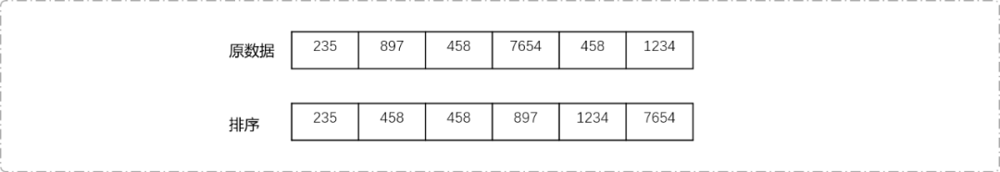
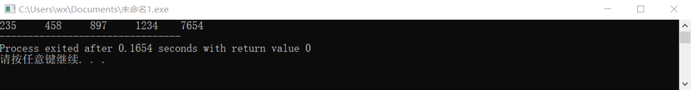
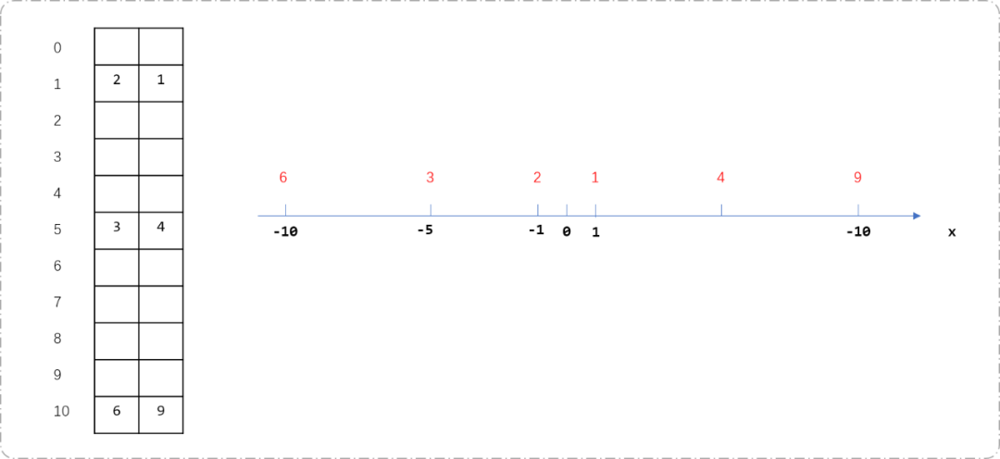
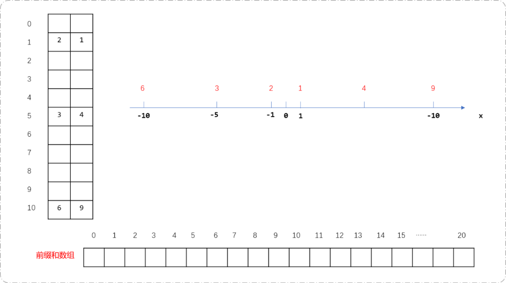
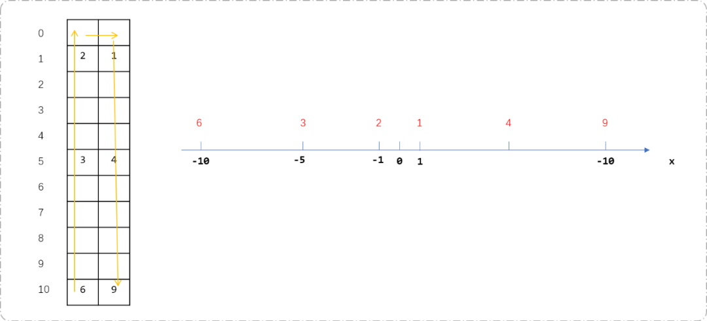
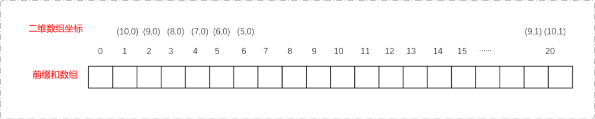
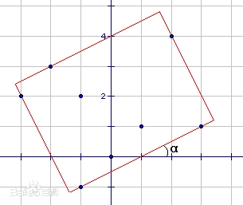
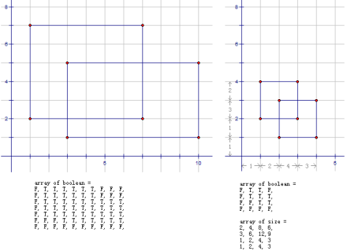

# C++ 离散化算法


## **1.前言**

离散化是离散数学中的概念。离散化算法，指把无限空间中的**离散数据**映射到一个有限的存储空间中，并且对原数据进行有序索引化。主打压缩的都是精华。

离散化流程：

对离散化数列`{235,897,458,7654,458,1234}`为例。数列中的数据涉及到的数轴区间从`0`到`7654`。诺大的区间中唯有`6`个数据。相当于仰头看星空，繁星一点一点。遇到这种情况，可以对数列离散化操作。

- 对原数据排序。

```cpp
  int datas[6]={235,897,458,7654,458,1234};
  //使用 sort 函数排序
  sort(datas, datas+6); 
  ```



- 对排序后的数据去重。对排序的数据去重最快的方案使用`unique`函数，此函数本质是将重复的元素移动到数组的末尾，最终尾迭代器指针指向最后一个重复数据，且返回尾迭代器。

  可以计算实际长度：`int size= unique(datas,datas+6) - datas;`。

```cpp
  int size= unique(datas,datas+6) - datas;
  //输出数据
  for(int i=0; i<size; i++)
   cout<<datas[i]<<"\t";
  ```

  

- 


- 对原数据索引化（也称为离散化）后，原数据分别被映射为`{25,1}、{458,2}、{897,3}、{1234,4}、{7654,5}`


原数据离散化后常用操作是查找离散数据的离散（索引）值是多少。如果在离散化过程中使用哈希表存储，查询时间复杂度为`O(1)`。如果使用数组，最优方案是使用二分搜索算法。

```c
// 二分求出 val 对应离散化的值
int search(int val) {
 // 在、右指针
 int lt = 0,rt = sizeof(datas)/4 - 1;
 while(lt<rt) {
  int mid = lt + rt >> 1;
  if(datas[mid] >= val) rt = mid;
  else lt = mid + 1;
 }
 return lt;
}
```

测试完整代码。

> **Tips：** 注意`search`函数的返回值加`1` 。离散化后的值一般从`1`开始。

```c
int main() {
//使用 sort 函数排序
 sort(datas, datas+6);
 int size= unique(datas,datas+6) - datas;
 for(int i=0; i<size; i++)
  cout<<datas[i]<<"\t";
 cout<<"查找离散数据离散化后的值"<<endl;
 int res=search(458);
 cout<<res+1;
 return 0;
}
```

## **2. 算法应用**

**什么样的问题可以使用离散化算法？**

当问题并不完全关注数据，更多是关注数据之间的相对大小时可以使用分散算法提升解决问题的性能。如区间类型问题……

下面使用几个案例来理解分散算法的应用。

### **2.1 区间和**

**题目描述：**

假定有一个无限长的数轴，数轴上每个坐标上的数都是 0。现在，我们首先进行 `n`次操作，每次操作将某一位置 `x` 上的数加 `c`。 接下来，进行 `m` 次询问，每个询问包含两个整数 `l` 和 `r` ，你需要求出在区间 `[ l , r ]`之间的所有数的和。

**输入格式：**

第一行包含两个整数 `n` 和 `m` 。接下来 `n` 行，每行包含两个整数 `x` 和 `c` 。再接下来 `m`行，每行包含两个整数 `l` 和 `r` 。

**输出格式：**

共 `m`行，每行输出一个询问中所求的区间内数字和。

**数据范围：**

10-9 ≤ x ≤ 109

`1` ≤ n ≤ 105

1 ≤ m ≤ 105

10-9 ≤ l ≤ r ≤ 109

− 10000 ≤ c ≤ 10000

**输入样例：**

3 3 1 2 3 6 7 5 1 3 4 6 7 8

**输出样例：**

8 0 5

**问题解析：**

坐标轴上，每一个`x`坐标位置对应一个值，求在`x`坐标系上一个区间内所有x坐标上值的和。题目中`x`坐标的范围是10-9到1010之间，操作次数限制在`1`到105之间，意味着2*109个坐标中最多只有105个坐标会被指定值。

暴力解题思路：

创建一个二维数组`arr[`109`]`[2]。因为坐标轴以原点`0`对称，数组的行表示`x`坐标的绝对值，列表示方向，`0`表示向左，`1`表示向右。比如修改坐标`3`的值为`8`。可用`arr[3][1]=8`存储。如修改坐标`-3`的值为`9`，可用`arr[3][0]=9`存储。前缀和存储在一维数组`s[`2*109`]`。计算前缀和时，需要把二维数组坐标转转为一维数组坐标。

因数组长度达到了`10`9。会超成数据溢出，性能堪忧。理论上可行，但实操中会略显麻烦。为了方便讲解这种算法思路，下面把坐标轴绝对值限制在`10`内。

**算法实现流程：**

- 创建二维数组`arr[10][2]`存储坐标及其对应的值。下图描述了数组和坐标轴的对应关系。坐标轴上的黑色数字表示坐标位置，红色数字表示此坐标位置对应的值。`0`坐标没有正负之分，`0`坐标对应的值即可存储在`arr[0][0]`中，也可以存储在`arr[0][1]`中。另一个存储空间值为`0`便可，不影响前缀和的计算。



- 创建一维数组`s[20]`，存储坐标轴上坐标值的前缀和。一维数组的长度为`20`。



- 计算二维数组的前缀和。这里要注意，访问的二维数组顺序应该由左下角向上然后向右再下向右下解。如下图所示，从负坐标逐渐访问到正坐标。



- 这里有二维坐标转换为一维数坐标的细节。如下图显示了把二维数组展开后和一维数组的对应关系。

  计算法则：如果列号为`0`，10减行号加1为其对应的一维坐标，如果列号为`1`，则10加行号+1，为对应一维坐标。



**编码实现：**

```c
#include <iostream>
#include <cmath>
#define  SIZE 10
using namespace std;
int main(int argc, char** argv) {
 int arr[SIZE+1][2];
 for(int i=0; i<=SIZE; i++)
  for(int j=0; j<2; j++)
   arr[i][j]=0;

 int s[2*SIZE+1]= {0};
 int n,m;
 cin>>n>>m;
 int x,val;
 for(int i=0; i<n; i++) {
  cin>>x>>val;
  if(x<0)
   arr[ abs(x) ][0]=val;
  else
   arr[abs(x)][1]=val;
 }
 //求前缀和
 int tmpx=0;
 for(int i=SIZE; i>=0; i--) {
  //转换坐标
  tmpx=SIZE-i+1;
  s[tmpx] = s[tmpx - 1] + arr[i][0];
 }
 for(int i=0; i<=SIZE; i++) {
  //转换坐标
  tmpx=SIZE+i+1;
  s[tmpx] = s[tmpx - 1] + arr[i][1];
 }
 //求区间和
 int l,r;
 for(int i=0; i<m; i++) {
  cin>>l>>r;
  if(l<0)l=SIZE-abs(l)+1;
  else l=abs(l)+SIZE+1;
  if(r<0)r=SIZE-abs(r)+1;
  else r=abs(r)+SIZE+1;
  cout<<s[r]-s[l-1]<<endl;
 }
 return 0;
}
```

在坐标范围很大时，上述算法性能堪忧。创建如此大的数组，对空间有极苛刻的要求，稍不留神就会溢出，导致程序崩溃，且坐标换算很麻烦。

区间求和更在意数据的相对大小，虽然坐标范围较大，但真正用到的坐标比范围小很多。可以使用离散化算法思想。把存储范围缩小在105。

**算法实现流程：**

```c
#include <bits/stdc++.h>
#define  SIZE 100000
using namespace std;
//坐标类型
struct Point {
 //坐标
 int x;
 //坐标上对应的值
 int val;
 Point() {
  this->x=0;
  this->val=0;
 }
 Point(int x,int val) {
  this->x=x;
  this->val=val;
 }
   //用于排序，由小到大
 bool operator<(const Point & p ) {
  return this->x<p.x;
 }
    //用于去重
 bool operator==(const Point& other) const {
  return this->x == other.x ;
 }
};
//坐标最多 100000
vector<Point> points;
int n,m;
//前缀和
int sum[SIZE]= {0};
//查找坐标是否已经存储
bool findx(int x) {
 int size=points.size();
 for(int i=0; i<size; i++) {
  if( points[i].x==x )return 1;
 }
 return 0;
}

// 二分求出 val 对应离散化的值
int search(int val) {
 // 在、右指针
 int lt = 0,rt =points.size() - 1;
 while(lt<rt) {
  int mid = lt + rt >> 1;
  if(points[mid].x >= val) rt = mid;
  else lt = mid + 1;
 }
 return lt;
}

int main(int argc, char** argv) {
 cin>>n>>m;
 int x,val;
 for(int i=0; i<n; i++) {
  cin>>x>>val;
  Point p(x,val);
        //存储坐标与其对应值
  points.push_back(p);
 }
 int l,r;
 pair<int,int> ps[SIZE];
 for( int i=0; i<m; i++ ) {
  cin>>l>>r;
  pair<int,int> p= {l,r};
  ps[i]=p;
  if( !findx(l) ) {
   points.push_back( {l,0} );
  }
  if( !findx(r) ) {
   points.push_back( {r,0} );
  }
 }
 //排序
 sort( points.begin(),points.end() );
 //去重
 points.erase(unique(points.begin(), points.end()), points.end());
 //前缀和
 int size=points.size();
 for(int i=0; i<size; i++) {
  if(i==0)
   sum[i]=points[i].val;
  else
   sum[i]=sum[i-1]+points[i].val;
 }
    //查询
 for(int i=0; i<m; i++) {
  l=search(ps[i].first) ;
  r=search( ps[i].second);
  cout<<sum[r]-sum[l-1]<<endl;
 }
 return 0;
}
```

### **2.2 最小矩形面积**

给定平面上n个点的坐标，求能够覆盖所有这些点的最小矩形面积。其中，矩形可以倾斜放置，边不必平行于坐标轴。



这里的倾斜放置很不好处理，因为我们不知道这个矩形最终会倾斜多少度。假设我们知道这个矩形的倾角是α，那么答案就很简单了：矩形面积最小时四条边一定都挨着某个点。也就是说，四条边的斜率已经都知道了的话，只需要让这些边从外面不断逼近这个点集直到碰到了某个点。你不必知道这个具体应该怎么实现，只需要理解这可以通过某种方法计算出来，毕竟重点在下面的过程。

我们的算法很显然了：枚举矩形的倾角，对于每一个倾角，我们都能计算出最小的矩形面积，最后取一个最小值。

这个算法是否是正确的呢？我们不能说它是否正确，因为它根本不可能实现。矩形的倾角是一个实数，它有无数种可能，你永远不可能枚举每一种情况。我们说，矩形的倾角是一个“连续的”变量，它是我们无法枚举这个倾角的根本原因。我们需要一种方法，把这个“连续的”变量变成一个一个的值，变成一个“离散的”变量。这个过程也就是所谓的离散化。

我们可以证明，最小面积的矩形不但要求四条边上都有一个点，而且还要求至少一条边上有两个或两个以上的点。试想，如果每条边上都只有一个点，则我们总可以把这个矩形旋转一点使得这个矩形变“松”，从而有余地得到更小的矩形。于是我们发现，矩形的某条边的斜率必然与某两点的连线相同。如果我们计算出了所有过两点的直线的倾角，那么α的取值只有可能是这些倾角或它减去90度后的角（直线按“\”方向倾斜时）这么C(n,2)种。我们说，这个“倾角”已经被我们“离散化”了。

### **2.3 最小矩形面积**

对于某些坐标虽然已经是整数（已经是离散的了）但范围极大的问题，我们也可以用离散化的思想缩小这个规模。



给定平面上的n个矩形（坐标为整数，矩形与矩形之间可能有重叠的部分），求其覆盖的总面积。平常的想法就是开一个与二维坐标规模相当的二维Boolean数组模拟矩形的“覆盖”（把矩形所在的位置填上True）。可惜这个想法在这里有些问题，因为这个题目中坐标范围相当大（坐标范围为-10^8到10^8之间的整数）。

但我们发现，矩形的数量n<=100远远小于坐标范围。每个矩形会在横纵坐标上各“使用”两个值，100个矩形的坐标也不过用了-10^8到10^8之间的200个值。也就是说，实际有用的值其实只有这么几个。这些值将作为新的坐标值重新划分整个平面，省去中间的若干坐标值没有影响。我们可以将坐标范围“离散化”到1到200之间的数，于是一个200*200的二维数组就足够了。实现方法正如本文开头所说的“排序后处理”。对[横坐标]（或纵坐标）进行一次排序并映射为1到2n的整数，同时记录新坐标的每两个相邻坐标之间在离散化前实际的距离是多少。这道题同样有优化的余地。

## **3. 总结**

本文聊聊离散化算法，当数据趋于离散分布，而且，计算时只在意数据的相对值时，可以使用此算法。


