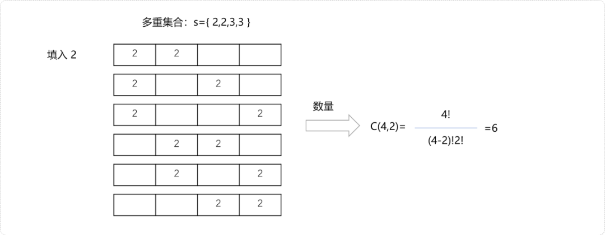
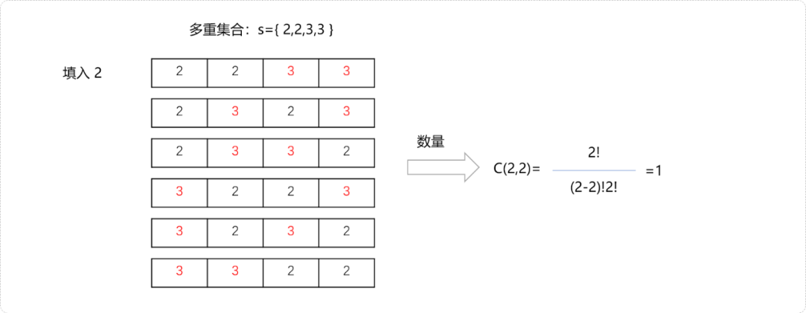
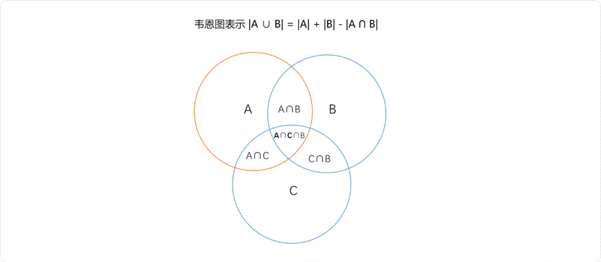
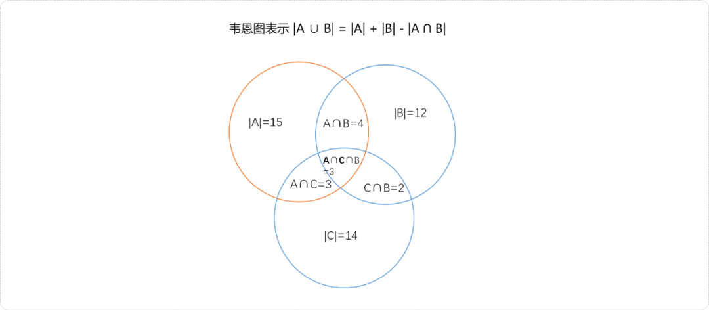

# C++ 离散与组合数学之多重集合


## **1. 前言**

数论是计算机学科的基础，将以一系列文章讨论组合数学中的一些概念，包括多重集合、等价类、多重集上的排列、错排列、圆排列、鸽巢原理、二项式定理、容斥原理、卡特兰数。

本文主要是讨论集合以及多重集合的概念以及多重集合上的排列问题。集合概念为研究群体事物提供了强有力的理论基础。

## **2. 集合**

在理解集合之前，先理解集合中的元素概念。

**元素**是为研究对象提供的统一抽象名称。如具体的自然数、无理数、整数……都可称为元素。把一些元素组成的群体称为集合(简称为集)，集合通常用大写的拉丁字母`A，B，C，…`表示，是由一些元素组成的整体。集合中的元素总是存在某种内在的关联特征。

**元素与集合的关系**

**属于关系**

`a`属于集合`A`，表述为`a`是集合`A`的元素，记作`a∈A`。如`A＝{1,2,3,4}` 其中 `1∈A`。

**不属于关系**

`a`不属于集合`A`，表述为`a`不是集合`A`的元素，记作`a∉A`。例如 `A＝{1， 2，3，4}` 其中 `5∉A`。

**元素与集合的性质**

1. **确定性** ：给定一个集合，任给一个元素，该元素属于或者不属于该集合，二者必居其一，不可能出现模棱两可的情况。如`1`至`5`之间的整数构成的集合，即是`{1，2，3，4，5}`。这个集合满足集合元素的确定性。

   而长的漂亮的人是不确定元素，没有任何一个标准构建这样的集合。

2. **互异性**：一个集合中，每一个元素只能出现一次。

3. **无序性：** 一个集合中，每个元素的地位都是相同的，元素之间是无序的。`{2,3}`和`{3,2}`是同一个集合。

**集合的基数**

一个集合中有多少元素，称为集合的基数`（Cardinal）`

**有限集合**

有限集合，如 `A= {1,2,3,4}` 基数就是该集合元素的个数， 记作：`|A| = 4`

**无限集合**

由无限个元素组成的集合，称为无限集合。例如 `A={整数}`。

**集合与集合的关系**

- 子集：如果集合A中的任意一个元素都在集合B中，那么集合A被称为集合B的子集。如果集合B中的每个元素都是集合A中的元素，那么集合B被称为集合A的真子集。特别的，空集包含于任何一个集合，因此空集是任何集合的子集。
- 相等：如果两个集合A和B中的元素完全相同，并且与元素的排列顺序无关，那么这两个集合被称为相等。记作A = B。
- 并集：由所有属于集合A或属于集合B的元素构成的集合，称为A和B的并集。记作A ∪ B。
- 交集：由所有同时属于集合A和B的元素构成的集合，称为A和B的交集。记作A ∩ B。
- 差集：由所有属于集合A而不属于集合B的元素构成的集合，称为A和B的差集。记作A - B。
- 补集：由所有不属于集合A的元素构成的集合，称为集合A的补集。

## **3. 多重集合**

多重集或多重集合是数论中的一个概念。在一个集合中，相同的元素只能出现一次，`C++`中称为`set`。因此元素仅存在有(`true`)或无(`false`)的属性。多重集(C++中称`multiset`)中，同一个元素可以出现多次。

多重集中出现多次的元素需要按出现的次数计算，不能只算一次。一个元素在多重集里出现的次数称为这个元素在多重集里面的**重数**（或**重次**、**重复度**）。

如：{1,2,3}是一个集合，而{1,1,1,2,2,3}是一个多重集。其中元素1的重数是3，2的重数是2，3的重数是1。多重集{1,1,1,2,2,3}的元素个数是6。有时为了和一般的集合相区别，多重集合会用方括号而不是花括号标记，比如{1,1,1,2,2,3}会被记为[1,1,1,2,2,3]。和多元组或数组的概念不同，多重集中的元素是没有顺序分别的，也就是说{1,1,1,2,2,3}和{1,1,2,1,2,3}是同一个多重集。

### **3.1 C++ 中的multiset**

`multiset`常用`API`。

- `insert`：在集合中插入元素。

函数原型：

```cpp
iterator insert( const_iterator hint, const value_type& value );
template< class InputIt >
void insert( InputIt first, InputIt last );
iterator insert( const value_type& value );
```

函数说明：

●  重载 1：在迭代器`pos`前插入`val`，并返回一个指向该元素的迭代器；

●  重载 2：将迭代器`start`开始到`end`结束返回内的元素插入到集合中；

●  重载 3：在当前集合中插入`val`元素，并返回指向该元素的迭代器和一个布尔值来说明`val`是否成功的被插入了。

**编码实现：**

```cpp
#include <bits/stdc++.h>
using namespace std;
int main(int argc, char** argv) {
 multiset<int> ms;
 //直接插入元素
 multiset<int>::iterator p= ms.insert(5);
 if(p!=ms.end())cout<<"插入成功"<<endl;
 else cout<<"插入失败"<<endl;
 //重复插入
 p= ms.insert(5);
 p= ms.insert(6);
 p= ms.insert(6);
 //统计 5 出现次数
 int count=ms.count(5);
 //集合中无素个数
 cout<<ms.size()<<endl;
 cout<<5<<"出现次数："<<count<<endl;
 //使用迭代器插入
 multiset<int>::iterator begin=ms.begin();
 p=ms.insert(begin,7);
 cout<<*p<<endl;
 cout<<"迭代集合"<<endl;
 begin=ms.begin();
 multiset<int>::iterator end=ms.end();
 while(begin!=end) {
  cout<<*begin<<endl;
  begin++;
 }
 cout<<"插入另一个集合中元素"<<endl;
 multiset<int> ms_;
 ms_.insert(p,ms.end());
 cout<<"ms_元素个数："<<ms_.size()<<endl;
 return 0;
}
```

### **3.2 多重集上的排列**

**多重集的全排列**

所谓全排列，指从多重集合中选择所有元素，所能组成的所有排列。如有多重集：`s={a1*a1,n2*a2……nk*ak} `。`a1,a2,a3,……ak`表示元素。`n1,n2,……nk`每个元素出现的次数。`ni`可能是`0`，也可能是正无穷大。

现有`s={2,2,3,3}`，全排列指选择所有元素即`4`个元素所能组成的排列。

- 因为是由`4`个数字所成的数字，排列结果一定是`4`位数字。


- 先从多重集合中拿出数字`2`。因在多重集合中有`2`个，即需要在`4`位数字中选择`2`个空位置填入数字`2`。如下图所示，能填入`2`的所有可能。因元素相同，其本质是从`4`个位置中选择`2`个位置的组合数量。即`C(4,2)=6`。



- 再从多重集合中拿出数字`3`，也是有`2`个。因在`4`位数字中已经填入了`2`个`2`，其剩余空位置为`4-2=2`。即`2`个`3`只能填在剩下的`2`个位置。即`C(2,2)= 1`。



- 根据乘法原理，对于多重集合`s={2,2,3,3}`的全排列数：`C(4,2)*C(2,2)=4!/2!2!`。

由上推导过程可知。多重集的全排列数是元素总数的阶乘除以所有元素的重复度的阶乘。其中`n=n1+n2+n3……nk`。


如果遇到求多重集的全排列问题时，可直接套用公式。

如求多重集合`S={4*2,2*6,1*7,3*4}`的全排列。

- 先求多重集合中元素的个数：`n=4+2+1+3=10`。
- 套用公式：`res=10!/4!*2!*1!*3!=12600`。

**多重集的非全排列**

所有元素的重复度大于排列数：如`s={4*2,4*3,5*4,4*6}`。从集合中选择`r=4`个数字的非全排列数。注意，这里的排列数`4`小于、等于集合中重复度最小的数。


对于排列中的每一个位置都有`k（为集合中元素的个数）`种选择。


根据乘法原理，总排列数`k*k*k*=k`r。

**某些元素重复度小于排列数**

如果有一个元素的重复度小于选取个数 ,如 `S = { 3*a,2*b,1*c}`多重集的三排列 , 可以使用包含排斥原理 、生成函数进行计算 ;

## **4. 容斥原理**

容斥原理的目的：计数时，使重复的元素不被计算在内。

**容斥流程：**

先不考虑重叠的情况，把包含于某要求的所有元素的数目先计算出来，然后再把计数时重复计算的数目排斥出去，使得计算的结果既无遗 漏又无重复。

**两个集合的容斥实现**

如有`A、B`两个有限集合。则，`|A U B|=|A|+|B|-|A ∩ B|`。用韦恩图表示：

> **Tips：** `|A|`表示集合A的长度。


例1：期末考试，某班有`15`人数学满分，有`12`人语文满分，并且`4`人语文、数学都满分，那么这个班只要有一课为满分的同学有多少人？

用数学为满分的同学构建集合`A`、语文为满分的同学构建集合`B`。如果两个集合没有交集，则班上只要有一课为满分的同学人数为`15+12=27`。

因为同时语文、数学为满分的人数为`4`，说明`A、B`有交集，需要在两个集合总数的基础上再减去相交的共同部分，即`27-4=23`人。

套用容斥公式，`|A ∪ B| = |A| + |B| - |A ∩ B|=15 + 12 - 4 =23`。

**多个集合的容斥实现**

如有`A、B、C`有限集合。则`|AUBUC|=|A|+|B|+|C|-|A∩B|-|B∩C|-|A∩C|+|A∩B∩C|`。



例2：期末考试，某班有`15`人数学满分，有`12`人语文满分，有`14`人英语满分，其中`4`人语文、数学都满分、`3`人语文、英语都满分、`2`人英语、数学都满分。其中有`3`人三课全部满分，请问，班上只有有一课为满分的人数为多少？

用`A`表示数学为满分的学生集合、用`B`表示语文为满分的学生集合、用`C`表英语为满分的学生集合。



套用公式：`15+12+14-4-3-2+3=35`。

## **5. 总结**

集合是离散与组合数学中重要概念。计算机的穷举思维建立在集合以及对集合的排列组合基础之上。


