# C++数学与算法系列之排列和组合


## 1. 前言

本文将聊聊排列和组合，排列组合是组合学最基本的概念，排列组合在程序运用中也至关重要。

- **排列问题**：指从给定个数的元素中取出指定个数的元素进行排序，并统计排序的个数。
- **组合问题**：指从给定个数的元素中仅仅取出指定个数的元素，不排序，并统组合的个数。

## 2.排列

排列的定义：

- 从`n`个不同元素中，任取`m(m≤n,m与n均为自然数）`个不同的元素按照一定的顺序排成一列，叫做从`n`个不同元素中取出`m`个元素的一个**排列**。如从`1,2,3,4,5`中选择 `3` 个数字进行排列，则认为`1,2,3`和`3,2,1`是两种不同的排列。
- 从`n`个不同元素中取出`m(m≤n）`个元素的所有排列的个数，叫做从`n`个不同元素中取出`m`个元素的**排列数**，用符号 `A(n,m)`表示。

> **Tips：** 排列的英文是 `Permutation` 或者 `Arrangement`，故使用  `P` 或者 `A` 表示都可以，二者含义一样。

计算从 `5`个数字中任选择`3`个数字有多少种排列方式？

解决此问题时，先把问题演变成从 `5`个数字中选择 `5`个数字进行排列，其有多少种方案？

- 第 `1` 数字可以在 `5` 个数字中任选择一个，故有 `5` 种选择。


- 因第 `1` 个数字已经选择了一个，第 `2` 个数字只能在剩下的数字中选择，也就是只能在剩下的 `4` 个数字中选择，则有 `4` 种选择。


- 同理，第 `3`个数字有 `3`种选择，第 `4` 个数字只有`2`种选择，第五个数字只能有`1`种选择。
- 所有的排列数是 `5*4*3*2*1=120`种方案，是不是看起来很熟悉，就是求 `5`的阶乘。

下面使用穷举法求解上述问题中排列的个数：

```cpp
#include <iostream>
using namespace std;
int main(int argc, char** argv) {
 int count=0;
 for(int a=1; a<=5; a++) {
  for(int b=1; b<=5; b++) {
   if(b==a)continue;
   for(int c=1; c<=5; c++) {
    if(c==b || c==a )continue;
    for(int d=1; d<=5; d++) {
     if(d==a || d==b || d==c)continue;
     for(int e=1; e<=5; e++) {
      if(e==d || e==c || e==b || e==a) continue;
      count++;
     }
    }
   }
  }
 }
 cout<<count<<endl;
 return 0;
}
//输出结果：120
```

既然是求 `5` 的阶乘，可以简化程序。

```cpp
#include <iostream>
#include <cmath>
using namespace std;
int main(int argc, char** argv) {
 int num=5;
 int result=1;
 for(int i=1; i<=num; i++)
  result*=i;
 cout<<result;
 return 0;
}
// 120
```

如果不是选择 `5` 个数字，而是选择 `4`个数字？

- 则第 `1` 个数字有`5`种选择，第 `2` 个数字有`4`种选择，第 `3` 个数字有`3`种选择，第 `4`个数字有`2`种选择，最终可选择的个数为`5*4*3*2=120`，和前面相比较，即为 `5的阶乘`除以 `1的阶乘`。

如果不是选择 `4` 个数字，而是选择 `3`个数字？

- 则第 `1` 个数字有`5`种选择，第  `2` 个数字有`4`种选择，第 `3` 个数字有`3`种选择，最终可选择的个数为`5*4*3=60`。即为`5!`除以`2!`的阶乘。

可推导出从 `n` 个数字中选择`m`个数字的排列个数的公式：

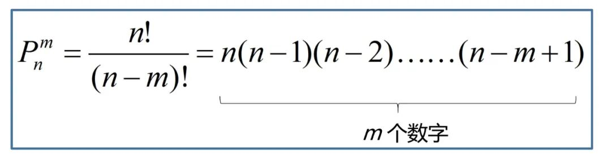


从推论可知，求`A（n,m）`的排列个数可以通过乘法原理求解：

- 计算排列的个数，先确定高位的可能个数，再逐一确认次高位可能个数，一直到最低位的可能个数……完成它需要分成`m`个步骤。
- 最高位有 `n` 种方法，次高位有`n-1`种方法……最低位有 `n-m+1`种方法。则最终的排列个数有：`n*(n-1)*(n-2)……(n-m-1)`种。

利用`A(n,m)`排列公式求解个数的算法：

```cpp
#include <iostream>
#include <cmath>
using namespace std;
/*
*求阶乘函数
*/
int getJc(int num) {
 int res=1;
 for(int i=1; i<=num; i++)
  res*=i;
 return res;
}
/*
*求A(n,m)的排列个数
*/
int main(int argc, char** argv) {
 int n;
 int m;
 int count=0;
 cin>>n;
 do {
  cout<<"m小于n:"<<endl;
  cin>>m;
 } while(m>n);
 //求 n 的阶乘
 int nJc=getJc(n);

 //求 n-m 的阶乘
 int nmJc=1;
 //如果 n 等于 m
 if(n==m)
  nmJc==1;
 else {
  nmJc=getJc(n-m);
 }
 count=nJc/nmJc;
 cout<<count;
 return 0;
}
```

**输出结果：**

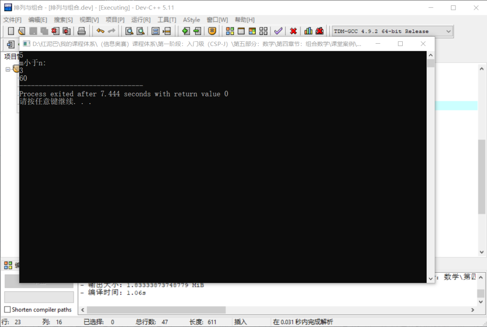


## 3. 组合

组合的定义：

- 从`n`个不同元素中，任取`m(m≤n）`个元素并成一组，叫做从`n`个不同元素中取出`m`个元素的一个组合。
- 从`n`个不同元素中取出`m(m≤n）`个元素的所有组合的个数，叫做从`n`个不同元素中取出`m`个元素的组合数。用符号 `C(n,m)` 表示。

> **Tips：** `C是单词Combination` 的缩写。

**组合与排列的区别：**

组合对于找出来的数字的顺序没有要求，也就是说`1,2,3`和`3,2,1`只能算一种组合方案。

**如何统计组合的个数？**

可以根据排列公式推导。

如从 `1,2,3`选择 `2`个数字进行组合。先套用排列计算公式，共有 `3*2=6`种排列方案。即 `[1,2]、[2,1]、[1,3]、[3,1]、[2,3]、[3,2] 6` 种方案。求组合个数，则需要减去数字一样、顺序不一样重复方案，最终结果为 `3`。

求解组合的个数可以先求解排列个数后，再排除重复的部分**。问题转为具体重复的会有多少？**

- 如果从 `4` 个数字中选择 `3` 个数字，则任意选择的 `3`个数字会有 `3!=6` 种排列方案，但是，对于组合而言，是一种方案。

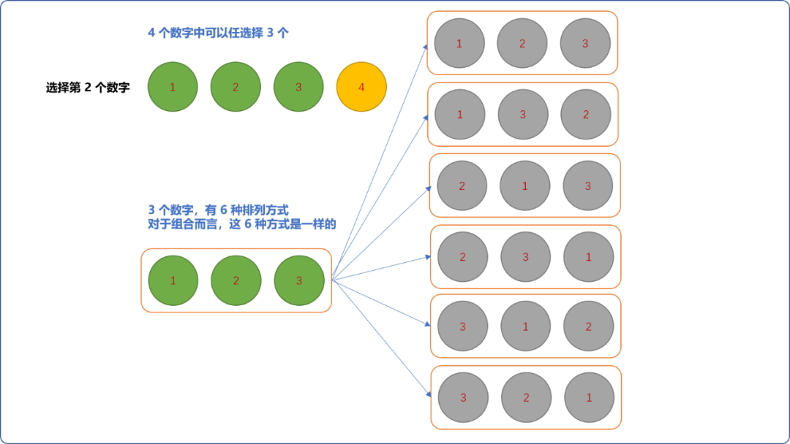


- 同时，从`5`个数字中选择 `4`个数字排列，任意`4`个数字会有 `4!` 种排列。或者说从 `n` 个数字中任意选择 `m` 个数字，则`m`个数字的排列有`m!`种，对于组合而言，这 `m！`个排列数只计数 `1` 次。
- 所以，求解`n`个数字中选择`m`个数字的组合数可以先计算排列数后，再在结果上除以 `m!(m的阶乘)` 。

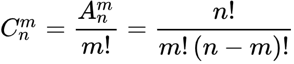


在程序中套用上述公式，可以求解出 `C(3,2)`有 `3` 种组合数。

```cpp
#include <iostream>
#include <cmath>
using namespace std;
/*
*求阶乘函数
*/
int getJc(int num) {
 int res=1;
 for(int i=1; i<=num; i++)
  res*=i;
 return res;
}
/*
*求C(n,m)的组合个数
*/
int main(int argc, char** argv) {
 int n;
 int m;
 int count=0;
 cin>>n;
 do {
  cout<<"m小于n:"<<endl;
  cin>>m;
 } while(m>n);
 //求 n 的阶乘
 int nJc=getJc(n);

 //求 n-m 的阶乘
 int nmJc=1;
 //如果 n 等于 m
 if(n==m)
  nmJc==1;
 else {
  nmJc=getJc(n-m);
 }
 //求 m 阶乘
 int mJc=m==0?1:getJc(m);
 count=nJc/(mJc*nmJc);
 cout<<count;
 return 0;
}
```

**输出结果：**

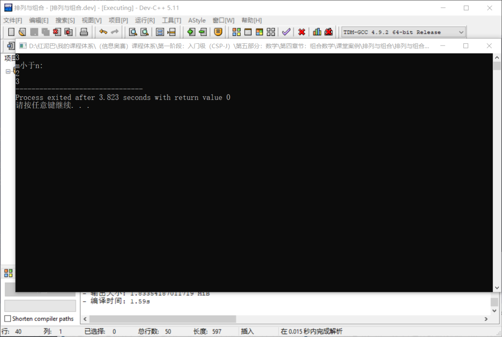


在上述组合公式的基础上，组合公式还可以发生如魔术般的变化，也许这就是数学的神奇之处。

### 3.1  运算法则一

如下图所示：

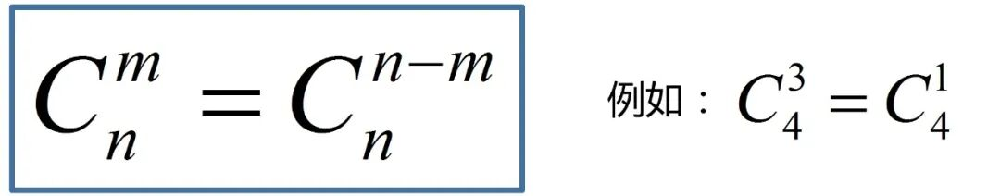


通过一个案例求证：假设有 `4` 名学生，选择 `3` 名学生打扫卫生，有多少种选择？

显然，这是一个组合问题，没有顺序的要求，即`C(4,3)`。有 `2` 种思路求解：

- 从 `4` 个学生中选择 `3`名学生打扫卫生。套用组合的基础公式可知结果=`4!/ 3!*1!=4`种选择。如下图所示，可以理解为是正向选择。

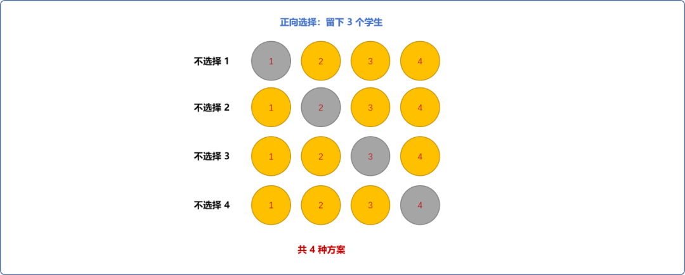


- 另一种方案，称为反向选择，因为有 `4` 个学生，每次选择一个学生回家，剩下的搞卫生，同样满足要求。相当于 `4` 个学生里面选择 `1` 名学生。结果 `4!/1!*3!=4`。

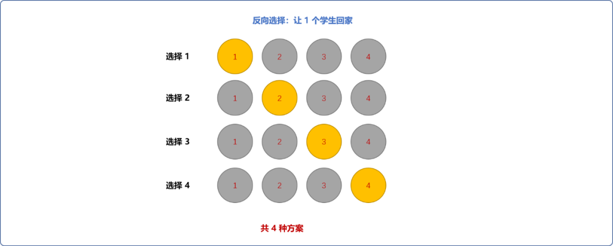


组合公式的如上运算法则很容易理解。根据下面的组合公式，可知，从 `n` 中选择 `m` 和 从 `n` 中选择 `n-m`的最终表达式是一样的。


**编程实现：**

```cpp
#include <iostream>
#include <cmath>
using namespace std;
/*
*求阶乘函数省略
*/

/*
* 求C(n,m)=C(n,n-m)的组合个数相同
*/
int main(int argc, char** argv) {
 int n;
 int m;
 int count=0;
 int count_=0;
 cin>>n;
 do {
  cout<<"m小于n:"<<endl;
  cin>>m;
 } while(m>n);
 //求 n 的阶乘
 int nJc=getJc(n);
 //求 m！阶乘
 int mJc=getJc(m);
 //求 n-m 阶乘
 int nmJc=1;
 if (n!=m)
  nmJc=getJc(n-m);
 //求 C(n,m)的组合数
 count=nJc /  (mJc*nmJc);
 //求 C(n,n-m)的阶乘，根据公式可知，分母仅是交换了相乘两数的位置
 count_=nJc / (nmJc* mJc);
 if(count==count_) {
  //验证通过
  cout<<"OK"<<endl;
 } else {
  cout<<"NO"<<endl;
 }
 return 0;
}
```

### 3.2 运算法则二

如下图所示，当从 `n`中取`m-1和 m`个数字得到的组合总数，可归纳为求解 `n+1`中取 `m`个数字的组合数。

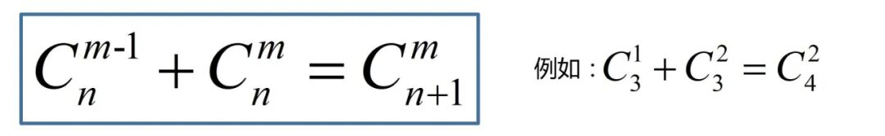


直接套用公式验证 `C(3,1)+C(3,2)` 和 `C(4,2)`的结果：

- `3` 个数字选择 `1` 个数字进行组合，结果=`3!/1!*2!=3`。
- `3`个数字选择`2`个数字进行组合，结果=`3!/2!*1!=3`。
- `4`个数字选择`2`个数字进行组合，结果=`4!/2!*2!=6`。

结论是：`C(3,1)+C(3,2)=C(4,2)`。

> **Tips：** `m` 和`m-1`必须连续！如`C(4,2)+C(4,4)`并不等于`C(5,4)`。 `C(7,3)+C(7,4)=C(8,4)` 是成立的。

**根据场景验证：**

- 如果有 `4` 名学生，需要 `2` 名学生留下来搞卫生，显然，可选择方案有 `C(4,2)=4!/2!*2!=6`种方案。

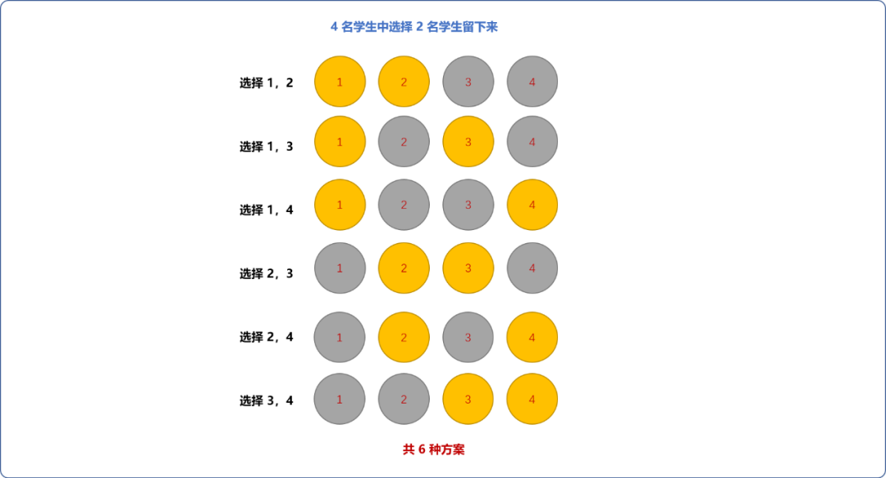


- 换一种理解，如果学号为 `1` 的学生必须留下来，显然，只需要在剩下的 `3` 名学生中选择 `1` 名学生留下来。如果学号为 `1`的学生不留下来，则需要从剩下的 `3` 名学生中选择 `2` 名。

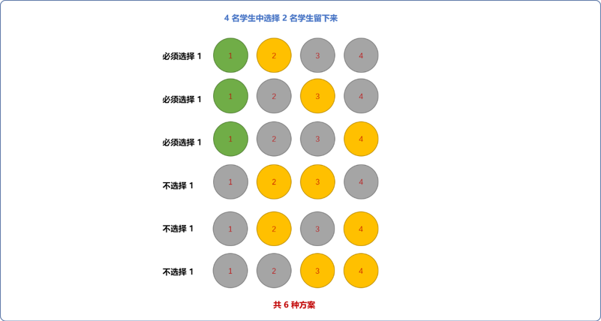


严格的证明，可以由原始公式直接推导。如下图所示：

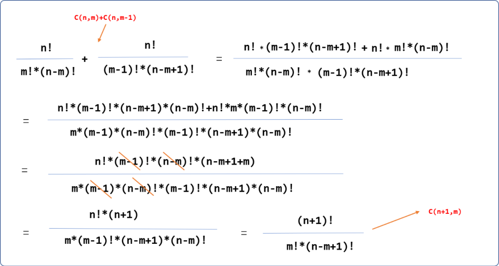


**编程实现：**

```cpp
#include <iostream>
#include <cmath>
using namespace std;
/*
*求阶乘函数省略……
*/

/*
* 求证 C(n,m)+C(n,m-1)=C(n+1,m)
*/
int main(int argc, char** argv) {
 int n;
 int m;
 int count=0;
 int count_=0;
 cin>>n;
 do {
  cout<<"m小于n:"<<endl;
  cin>>m;
 } while(m>n || m<1) ;
 //求 n 的阶乘
 int nJc=getJc(n);
 //求 m！阶乘
 int mJc=getJc(m);
 //求 n-m 阶乘
 int nmJc=1;
 if (n!=m)
  nmJc=getJc(n-m);
 //求 m-1 的阶乘
 int moneJc= getJc(m-1);
 //求 n-(m-1) 的阶乘
 int nmoneJc= getJc(n-m+1 );
 //求 n+1-m 阶乘
 int nonemJc= getJc( n+1-m );
 //求C(n,m)+C(n,m-1) 的组合数
 count=nJc /  (mJc*nmJc) + nJc / ( moneJc * nmoneJc ) ;
 //求 C(n+1,m)的阶乘 根据公式可知，分母仅是交换了相乘两数的位置
 count_= nJc*(n+1) / (mJc* nonemJc);
 if(count==count_) {
  //验证通过
  cout<<"OK"<<endl;
 } else {
  cout<<"NO"<<endl;
 }
 return 0;
}
```

### 3.3  运算法则三

如下图所示：

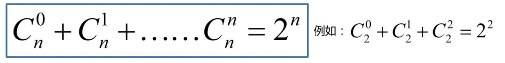


先直接套用公式验证  `C(2,0)+C(2,1)+C(2,2)` 的结果。

- `C(2,0) 2` 个数字中选择 `0`个，结果为 `1`。
- `C(2,1) 2`个数字中选择 `1`个，结果为 `2!/1!*1!=2`。
- `C(2,2) 2`个数字中选择 `2`个，结果为 `1`。
- 所以 `C(2,0)+C(2,1)+C(2,2)=4` 和 22 结果一样。但这只是个例，不足以证明普适性。

用另一种方式验证公式的合理性：假设现有一个箱子，里面有 `2` 个苹果，请问选择任意个苹果数的方案有多少种？

**方案一：你的角度。**

- 不选择(`C(2,0)`)，可以认为是 `1` 种方案。
- 选择 `1` 个苹果(`C(2,1)`)，可以在 `2` 个苹果中任一个，则有 `2` 种方案。
- 选择 2 个苹果(`C(2,2)`)，只有 1 种方案。
- `C(2,0)+C(2,1)+C(2,2)=4`。

**方案二：苹果的角度。**

- 每个苹果都是独立的个体，可以出来，也可以不出来。所以每个苹果都有 `2` 种选择。
- 箱子中现在有 `2` 个苹果，根据乘法原理，也就是 `2` 个 `2` 相乘（ `2` 的 `2` 次方 ）。
- 所以 22=4。如果有 `3` 个苹果，则共有  23 种方案。

**编程验证：**

```cpp
#include <iostream>
#include <cmath>
using namespace std;
/*
*求阶乘函数省略
*/

/*
* 求证 C(n,0)+C(n,1)+C(n,n)=2^n
*/
int main(int argc, char** argv) {
 int n;
 cin>>n;
 //当不取，或取全部时，组合个数都为 1
 int s=2;
 //求 n 阶乘
 int nJc =getJc(n);
 for(int i=1; i<n; i++) {
  //求 i 阶乘
  int iJc=getJc(i);
  //求 n -i 阶乘
  int niJc=getJc(n-i);
  s+= nJc / (iJc*niJc );
 }
 //求 2 的 n 次方
 int res= pow(2,n);
 if(res==s) {
  cout<<"OK"<<endl;
 } else {
  cout<<"NO"<<endl;
 }
 return 0;
}
//输入 2 
//输出 OK
```

### 3.4 运算法则四

如下图所示：

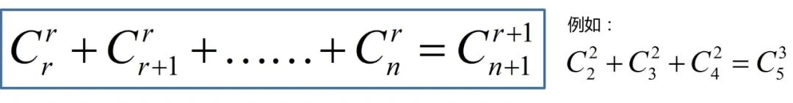


> **Tips：** 组合公式的上面的数字是相同的，下面的数字必须连续。

可以用选择值日生的例子推导公式的正确。如果需要在学号为 `1、2、3、4、5` 的这 `5` 名学生中选择 `3` 名学生留下来当值日生，且必须在选择出来的 `3`名学生中指定一人为组长。则选择方案可以由以下的分解方式组成：

- 学号为 `1`学生当组长，则只需要在剩下的 `4`名学生中选择`2`名学生，即 `C(4,2)`。
- 学号为 `2`学生当组长，则只需要在剩下的 `3`名学生中选择`2`名学生，即 `C(3,2)`。
- 学号为 `3`学生当组长，则只需要在剩下的 `2`名学生中选择`2`名学生，即 `C(2,2)`。
- 学号 `4,5`当组长，剩下人数不够凑成 `3` 个。没得选择。
- 故 `C(5,3)=C(4,2)+C(3,2)+C(2,2)`。

### 3.5 运算法则五

如下图所示：

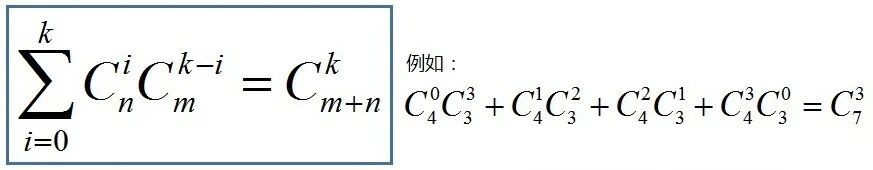


还是以上面的值日生为例，现在有 `7` 名学生，`4` 男 `3` 女，需要从 `7` 人中选择 3 人留下来值日，其组合数为 `C(7,3)`，在所有组合数中一定出现如下的搭配：

- 没有男生 `C(4,0)`，则选择女生`(3,3)`，即选择方案有 `C(4,0)*C(3,3)`。
- 选择 `1` 名男 `C(4,1)`，则选择女生 `C(3,2)`，选择出来的男生可以和选择出来的任一组女生搭配，显然方案数是  `C(4,1)*C(3,2)`。
- 选择 `2` 名男 `C(4,2)`，则选择女生 `C(3,1)`，共有  `C(4,2)*C(3,1)`种方案。
- 选择 `3` 名男 `C(4,3)`，则选择女生 `C(3,0)`，共有  `C(4,3)*C(3,0)`种方案。

## 4. 总结

排列和组合公式是在数学上已经验证过的公式，本文中所提供的代码，都是使用此公式，解决具体的问题。


