# C++离散与组合数学之如何让错排列一步错，步步错！


## **1. 前言**

错排列是排列里的特殊数体。本文和大家聊聊错排列的定义以及如何枚举出所有的错排列。现实生活中，错排列的应用也较广泛，研究错排列可以丰富排列与组合相关知识的认知。

## **2. 错排列**

`错排列`是组合数学中的一个重要理论分支。了解错排列，先从错排列的概念入手。

概念：理论上，`n`个有序的元素应有`n!`种不同的全排列，如果其中有一个排列使得所有的元素不在原来的位置上，则称这个排列为错排或者叫重排。如，`1 2`的错排是唯一的，即`2 1`。`1 2 3`的错排有`3 1 2、2 3 1`。这二者可以看作是`1 2`错排，`3`分别与`1、2`换位而得的。

那么，对于长度为`n`的数列，到底有多少种错排列？这些错排列具体又是哪些？带着这些问题，我们继续深入讲解。

### **2.1 统计数量**

如果有 `1 2 3 4` 四个数字，由它们所组成的错排列有多少？

简单粗暴的方式，在纸上手工一一枚举。即使是纯手工过程，也有讲究。

- 创建长度为`4`的数列，每一个数字存储在与其下标相同的单元格中。如下图所示：

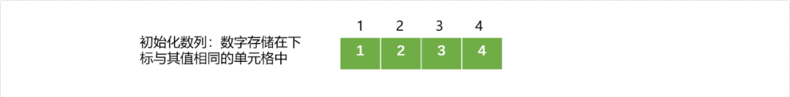


- 数字`4`分别与数字`1,2,3`交换位置，然后其它数字进行错排列。如下图会产生 `3` 种错排列数列。

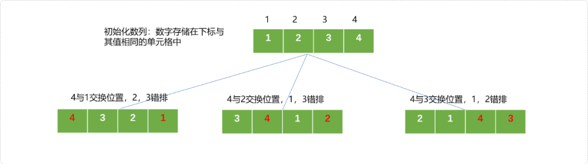


- 数字`4`和`1 2 3`的一个错排数`3 1 2`中的每一个数字交换位置。如下图其有3种情况。


- 数字`4`和`1 2 3`的一个错排数`2 3 1`中的每一个数字交换位置。

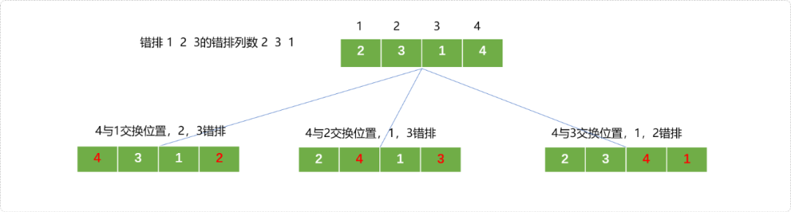


统计可知，`1 2 3 4`四个数字共有`9`种错排列。使用上述的推演过程，可知常用错位排列数：

- `3`个元素的错位排列有`2`种
- `4`个元素的错位排列有`9`种
- `5`个元素的错位排列有`44`种

当元素较少时，短时间内可以推演出错排列的数量。当元素较多时，纯手工的推演计算必是一件吃苦不讨好的事情。需要找出错排列在排列过程中的规律，总结出通用的表达式，方能一劳永逸。

其实，在统计错排列数量时，存在一种递归思想：

- 假设原始数列共有`n`个数字，第`n`个数字和其它数字共有`n-1`种交换方式。

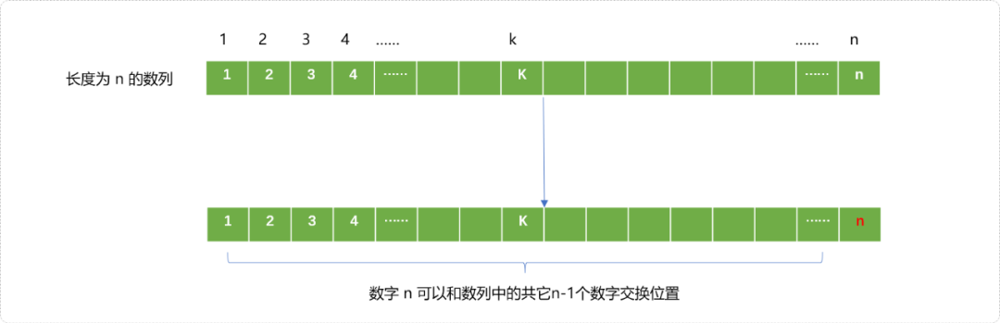


- 分析第`k`位置的元素。如果其已经和第`n`个元素交换，则剩下`n-2`个元素的错排列`D`n-2。

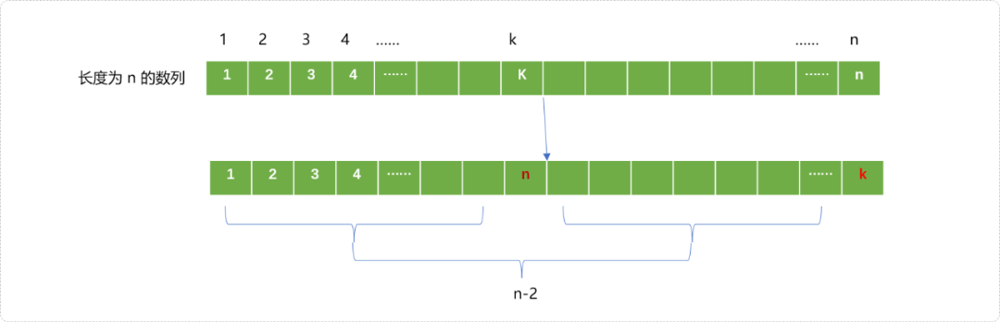


如果`k`不在`n`所在位置，这时剩下`n-1`个元素的错排有`D`n-1。

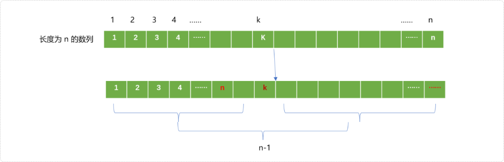


根据乘法和加法原理，可归纳出如下的递归表达式：

`D`n`=(n-1)(D`n-1`+D`n-2`)`。

递归出口：当`n=1`时，D1=0，当`n=2`时，D2=1把上述表达式展开，可得到更通用的表达式：Dn=nDn-1+(-1)n,D1=0。

`C++`实现递归算法：

```cpp
#include <iostream>
#include <cmath> 
using namespace std;
int cpl(int n){
 if(n==1)return 0;
 return n*cpl(n-1)+pow(-1,n);
}
int main(int argc, char** argv) {
 int n;
 cin>>n;
 int c=cpl(n);
 cout<<c<<endl;
 return 0;
}
```

分别输入`3、4、5`可知到结果：`2、9、44`。

### **2.2 枚举所有**

除了可以使用递推算法计算错排列数量。还存在一种通项公式：

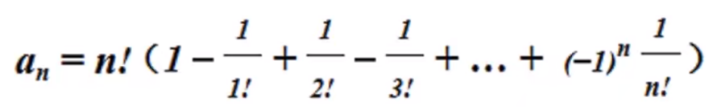


到目前为止，已能计算出错排列的数量。如果需要查询出所有错排列，可以使用回溯算法、`BFS`搜索算法和筛选法。下面介绍回溯和`BFS`。

**回溯算法**

回溯算法本质是深度优先搜索。在求解全排列时，我们使用过此算法。错排列仅是全排列中的一种特殊存在，只需要在求全排列的回溯算法基础之上，增加某些稍苛刻的条件即可。所以，关键是找出过滤条件。

如下图所示，把`1 2 3 4 `填入`4`个单元格，对于任一单元格中数字要求有`2`点:

- 不能是已经被使用过的数字。
- 和位置编号相同的数字不能填入。

如下图，在向第一个单元格中填数字时，数字1不能填入，只能在`2、3、4`中选择其中的一个填入。


在向第二个单元格填数字时，如果数字`3`已经填入在第一个单元格，则不能再填入第二个单元格，因数字`2`与单元格的位置编号相同，也不能填入，除此之外的`1、4`s可填入。

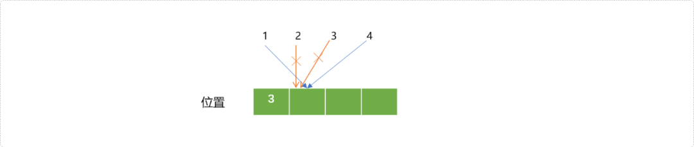


基于上述的要求，C++回溯算法实现错排列：

```cpp
#include <iostream>
#include <cmath>
using namespace std;
//错排列结果
int res[100]= {0};
//数字是否已经使用
int vis[100]= {0};
//错排列数字数量
int n;
//计数器 
int count=0;
//输入结果
void show() {
 for(int i=1; i<=n; i++)
  cout<<res[i]<<"\t";
 cout<<endl;
}
/*
*回溯算法
*/
void dfs(int  pos) {
 if(pos>n) {
  //输入结果
  count++;
  show();
  return;
 }
 for(int i=1; i<=n; i++) {
  // 如果数字已经使用或者数字和位置编号相同
  if(vis[i]==1 || i==pos )continue;
  vis[i]=1;
  res[pos]=i;
  //找下一个位置
  dfs(pos+1);
  //回溯
  vis[i]=0;
 }
}
//测试
int main(int argc, char** argv) {
 cin>>n;
 dfs(1);
 cout<<"错排列数："<<count<<endl;
 return 0;
}
```

测试结果：

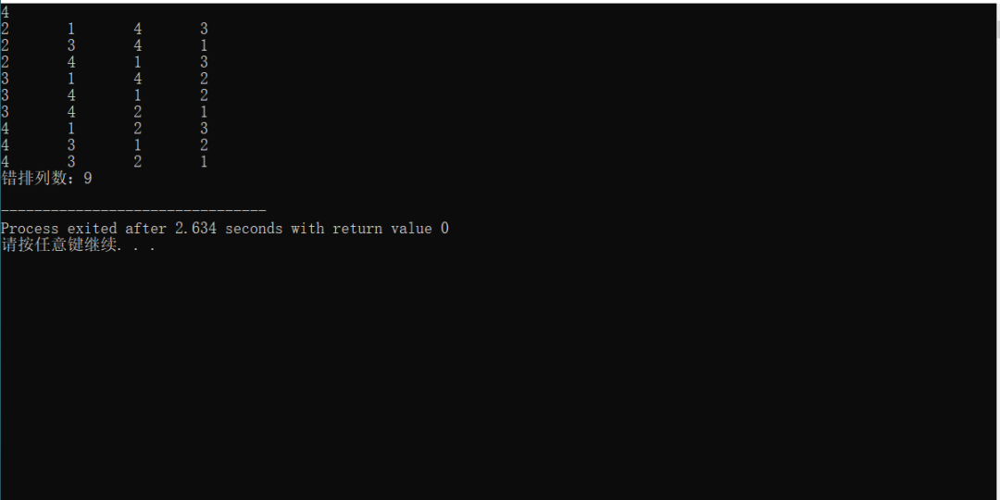


**广度（BFS）优先搜索法**

生成错排列的过程，可认为是从一种原始状态转换到另一种状态的过程。其整个转换过程所有状态所构建成的模型从逻辑上讲一种树结构。回溯算法本质是深度搜索过程，自然，也可以使用广度搜索完成错排列的输出。

现以`12345`为原始状态，描述对其进行数字交换，改变状态，生成错排列的流程。

- 把`原始状态`的最后一位插入到第一位，得到第一个子状态`51234（(可定为树结构中的根节点)）`，此状态也是一种错排列数。如下图：


- 再在子状态`51234`的基础上进行状态扩展，得到由此状态转换出的它的子状态。

  先从第二个位置开始，依次和后面位置中的数字进行交换，交换时，后面位置中与第二位置编号相同的数字不能交换，如第三个位置中的数字`2`不能交换到第二个位置。再就是第二个位置中的数字不能交换到与此数字相同的位置编号中。如果第二个位置中的数字是`4`则不能和后面第四个位置中的数字交换。

  总体原则：数字不能存储至与之相同的下标处。

  再把第三个位置的数字与后面的位置中的数字交换。以此类推，直到所有位置交换。如下图所示：

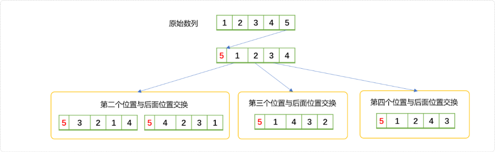


- 依照上述的原则，再在新生成的子状态（即错排列）的基础上重新转换出更多的子状态。一生二、二生三、三生多……直到不能再生成为止。在实际搜索时，需要保证不能回流。

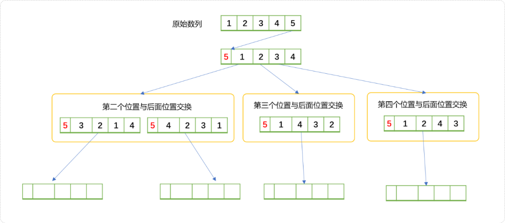


- 当以子状态`51234`为始点不停扩展出新节点到不能再扩展时，再生成新的始点`45123`继续扩展。

  相当于分别以`51234、45123、34512、23451`为出发点进行多次的`BFS`，最终得到所有子状态。

具体实现代码如下：

因为要在数字上进行交换，为了方便可以把数字以字符串的形式存储。这样无论是插入还是交换都能在`O(1)`时间内完成。从交换逻辑而言，其时间复杂度是常数级别的。

```cpp
#include <bits/stdc++.h>
using namespace std;
int c=0;
//记录是否访问过
map<string,int> vis;
/*
*由原始字符串生成始状态（树的根节点）
*/
string swapStr(string str) {
 str=str[str.size()-1]+str.substr(0,str.size()-1);
 return str;
}
//广度搜索
void bfs(string str) {
 queue<string> myq;
 int size=str.size();
 string str_=swapStr(str);
 int idx;
 while(str_.compare(str)!=0) {
  myq.push(str_);
  vis[str_]=1;
  idx=0;
  int s=myq.size();
  while( !myq.empty() ) {
   //从队列中拿取所有错排列
   string t= myq.front();
   cout<<t<<endl;
   c++;
   myq.pop();
   string t1=t;
   idx=0;
   //当前位置和其后面位置进行交换
   while(idx<size-1) {
    idx++;
    for( int i1=idx+1; i1<size; i1++ ) {
                    //需要满足2个条件
     if( t1[i1]-'0'!=(idx+1)  &&  t1[idx]-'0'!=(i1+1)  ) {
      swap( t1[idx],t1[i1] );
      if(!vis[t1]) {
       myq.push(t1);
       vis[t1]=1;
      }
      t1=t;
     }
    }
   }
  }
        //重新生成树的根节点
  str_=swapStr(str_);
 }
}
int main() {
    string str;
    cin>>str;
 bi(str);
 cout<<c<<endl;
 return 0;
}
```

测试结果：输入`12345`后的运行结果。

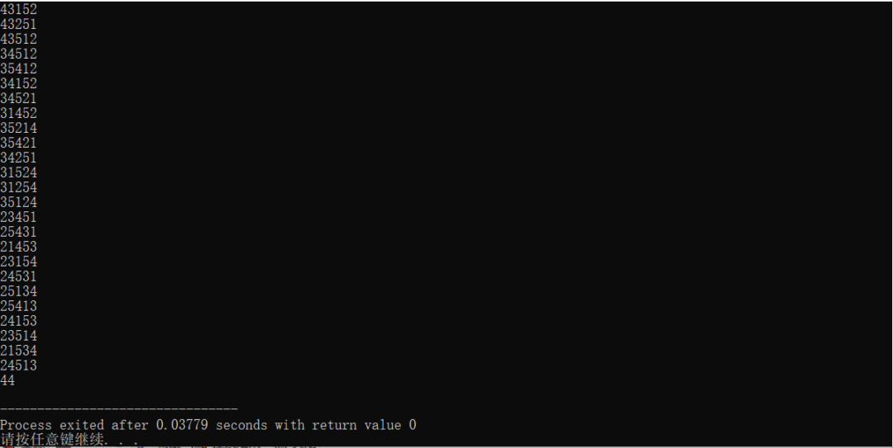


## **3. 总结**

了解了错排列概念以及相关算法，用下面的案例实践一下，看掌握程度如何。

`4`位厨师聚餐时，各做了一道拿手菜，现在每人去品尝一道菜，但是不能品尝自己做的那道菜，共有多少 不同的品尝方法？

题意求错排列的数量，可以直接使用通项 公式。

除了本文讨论的全错排列，即所有数字不在与此数字相同的位置。也有部分错排列，即`n`个数字中有`m`个错排列。数学上也提供有通项公式用来计算其数字。

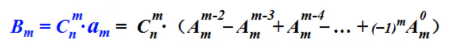


