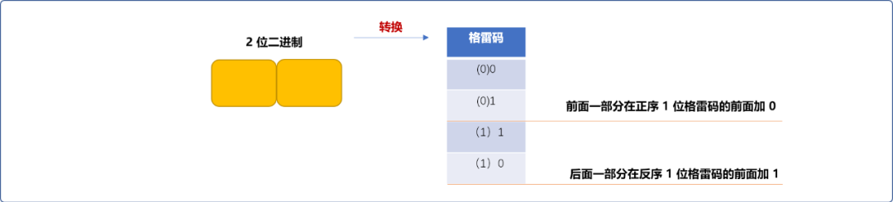
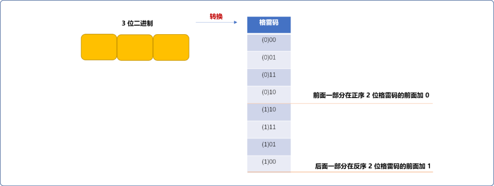
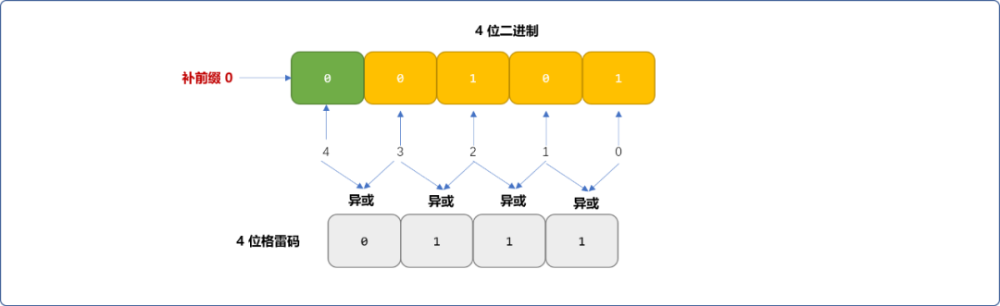
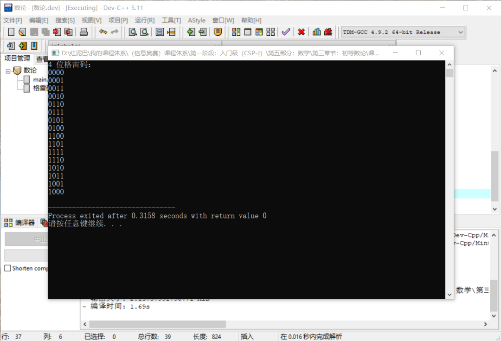
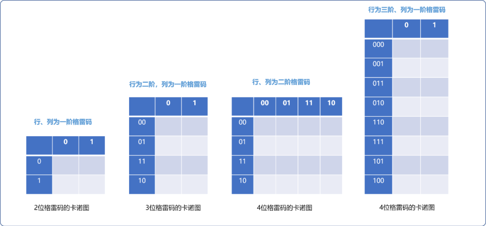
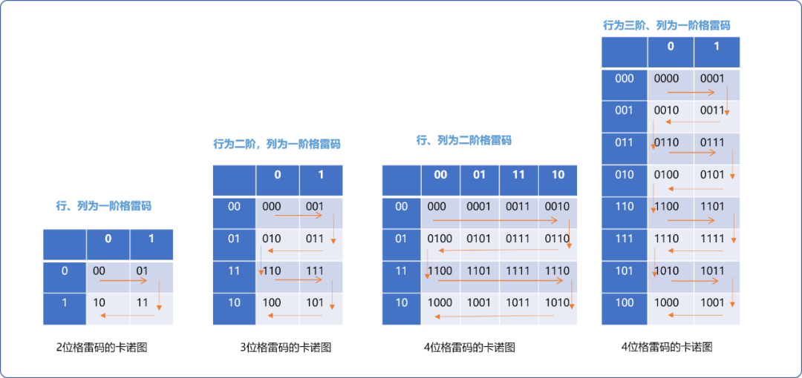

# C++ 数学与算法系列之认识格雷码


**1. 前言**

程序中所涉及到的任何数据，计算机底层均需转换成二进制数值后方可存储，这个过程也称为`编码`。反之，把底层二进制数据转换成应用数据称为解码，

不同的数据类型需要不同的编（解）码方案，如音频数据编码、视频数据编码、图形数据编码……

即使是同类型的数据，根据不同的应用场景，也有多种编码方案可选。如字符编译就有`ASCII、UTF-8、哈夫曼编码`以及本文将要讲解的`格雷码`。

讲解`格雷码`之前，首先了解一下`格雷码`的定义：

- 对数据编码后，若任意两个相邻的码值间只有一位二进制数不同，则称这种编码为格雷码`（Gray Code）`。
- 由于最大数与最小数之间也仅只有一位数不同，即`首尾相连`，又称`循环码`或`反射码`。

**格雷码的优点：**

一种编码的出现，一定是为了弥补已有编码的不足，这里以`ASCII`编码中的`A~Z`字符的码值开始研究：

|   二进制   | 十进制 | 十六进制 | 字符 |
| :--------: | :----: | :------: | :--: |
| `01000001` |   65   |    41    |  A   |
|  01000010  |   66   |    42    |  B   |
|  01000011  |   67   |    43    |  C   |
|  01000100  |   68   |    44    |  D   |
|  01000101  |   69   |    45    |  E   |
|  01000110  |   70   |    46    |  F   |
|  01000111  |   71   |    47    |  G   |
|  01001000  |   72   |    48    |  H   |
|  01001001  |   73   |    49    |  I   |
|  01001010  |   74   |    4A    |  J   |
|  01001011  |   75   |    4B    |  K   |
|  01001100  |   76   |    4C    |  L   |
|  01001110  |   78   |    4E    |  N   |
|  01001111  |   79   |    4F    |  O   |
|  01010000  |   80   |    50    |  P   |

`G`的编码是`01000111`，`H`的编码是`01001000`。

从宏观的计数角度而言，计数增长仅为`1`，但是有 `4` 个数据位发生了变化。从底层的存储硬件而言，每一位都需由电路控制 ，宏观世界里`4` 位数字的变化会引起微观世界里多个电路门变化，且不可能同时发生。

意味着中间会短暂出现其它代码，则在电流不稳或特定因素的影响下可能会导致电路状态变化错误的概率会增加很多。

而格雷码相邻编码只有一个数据位的变化，相对于计数编码，显然易见，其安全性和容错性要高很多。

格雷码可以有多种编码形式。如下图所示：

| 十进制数 | 4位自然二进制码 | 4位典型格雷码 | 十进制余三格雷码 | 十进制空六格雷码 | 十进制跳六格雷码 | 步进码 |
| :------- | :-------------- | :------------ | :--------------- | :--------------- | :--------------- | :----- |
| 0        | 0000            | 0000          | 0010             | 0000             | 0000             | 00000  |
| 1        | 0001            | 0001          | 0110             | 0001             | 0001             | 00001  |
| 2        | 0010            | 0011          | 0111             | 0011             | 0011             | 00011  |
| 3        | 0011            | 0010          | 0101             | 0010             | 0010             | 00111  |
| 4        | 0100            | 0110          | 0100             | 0110             | 0110             | 01111  |
| 5        | 0101            | 0111          | 1100             | 1110             | 0111             | 11111  |
| 6        | 0110            | 0101          | 1101             | 1010             | 0101             | 11110  |
| 7        | 0111            | 0100          | 1111             | 1011             | 0100             | 11100  |
| 8        | 1000            | 1100          | 1110             | 1001             | 1100             | 11000  |
| 9        | 1001            | 1101          | 1010             | 1000             | 1000             | 10000  |
| 10       | 1010            | 1111          | ----             | ----             | ----             | ----   |
| 11       | 1011            | 1110          | ----             | ----             | ----             | ----   |
| 12       | 1100            | 1010          | ----             | ----             | ----             | ----   |
| 13       | 1101            | 1011          | ----             | ----             | ----             | ----   |
| 14       | 1110            | 1001          | ----             | ----             | ----             | ----   |
| 15       | 1111            | 1000          | ----             | ----             | ----             | ----   |

表中典型格雷码具有代表性，一般说格雷码就是指**典型格雷码**，它可从自然二进制码转换而来。

> **Tips：** 格雷码是一种**变权码**，每一位码没有固定的大小，很难直接进行比较大小和算术运算。

## 2. 编码方案

### 2.1  递归实现

这种方法基于格雷码是反射码的事实，可以对直接使用递归算法构造。

流程如下：

- `1`位格雷码有两个编码。


- `(n+1)`位格雷码中的前`2^n`个编码等于`n`位正序格雷码的前面 加`0`。



- `(n+1)`位格雷码中的后`2^n`个编码等于`n`位逆序格雷码的前面加`1`。



| `2位格雷码` | `3位格雷码` | `4位格雷码` | `4位自然二进制码` |
| :---------: | :---------: | :---------: | :---------------: |
|     00      |     000     |    0000     |       0000        |
|     01      |     001     |    0001     |       0001        |
|     11      |     011     |    0011     |       0010        |
|     10      |     010     |    0010     |       0011        |
|             |     110     |    0110     |       0100        |
|             |     111     |    0111     |       0101        |
|             |     101     |    0101     |       0110        |
|             |     100     |    0100     |       0111        |
|             |             |    1100     |       1000        |
|             |             |    1101     |       1001        |
|             |             |    1111     |       1010        |
|             |             |    1110     |       1011        |
|             |             |    1010     |       1100        |
|             |             |    1011     |       1101        |
|             |             |    1001     |       1110        |
|             |             |    1000     |       1111        |

**编码实现：**

```cpp
#include <iostream>
#include <vector>
using namespace std;
/*
*实现格雷编码
*/
vector<string> grayCode(int num) {
    //存储格雷码
 vector<string> vec;
 if(num==1) {
        //出口：1位格雷码是已知的
  vec.push_back("0");
  vec.push_back("1");
  return vec;
 }
    //得到低位格雷码
 vector<string> vec_= grayCode(num-1);
 //对低位格雷码正向遍历，添加前缀 0
 vector<string>::iterator begin=vec_.begin();
 vector<string>::iterator end=vec_.end();
 for(; begin!=end; begin++) {
  vec.push_back("0"+*begin);
 }
 //对低位格雷码反向遍历,添加前缀 1 
 vector<string>::reverse_iterator rbegin=vec_.rbegin();
 vector<string>::reverse_iterator rend=vec_.rend();
 for(; rbegin!=rend; rbegin++) {
  vec.push_back("1"+*rbegin);
 }
 return vec;
}
//测试
int main(int argc, char** argv) {
 vector<string> vec=grayCode(4);
    cout<<"4 位格雷码："<<endl; 
 for(int i=0; i<vec.size(); i++) {
  cout<<vec[i]<<endl;
 }
 return 0;
}
```

**输出结果：**

```cpp
4 位格雷码：
0000
0001
0011
0010
0110
0111
0101
0100
1100
1101
1111
1110
1010
1011
1001
1000
```

### ２.２异或转换

异或转换可以直接把`n`位二进制数字编码成对应的`n`位格雷码。当然，也可以把格雷码直接转换成对应的二进制。

**编码流程如下：**

- 对`n`位二进制的数字，从右到左，以`0`到`n-1`编号。


- 如果二进制码字的第`i`位和`i+1`位相同，则对应的格雷码的第`i`位为`0`（异或操作），否则为`1`（当`i+1=n`时，二进制码字的第`n`位被认为是`0`，即第`n-1`位不变）。如下图，二进制 `0101`经过转换后的格雷码为`0111`。



**编码表示**：

```cpp
#include <iostream>
#include <vector>
using namespace std;
/*
*异或转换格雷编码
*/
void  yhGrayCode(int num) {
    //二进制
 vector<int> vec;
    //格雷码
 vector<int>  gc;
 //存储进位值
 int jinWei=0;
    //初始二进制的每一位为 0
 for(int i=0; i<num; i++) {
  vec.push_back(0);
 }
    //循序递增二进制，并且得到对应的格雷码
 while (jinWei!=1) {
  jinWei=0;
  gc.clear();
  //第一位不做异或操作
  gc.push_back(vec[0]);
  //反序遍历,求相邻两个数字的异或结果
  int i=0;
  for(; i<num-1; i++) {
   if(vec[i]==vec[i+1]) {
    gc.push_back(0);
   } else {
    gc.push_back(1);
   }
  }
        //输出格雷码
  for( i=0; i<gc.size(); i++) {
   cout<<gc[i]<<"";
  }
  cout<<endl;
  //更新二进制，递增 1 ，遇到 2 进位
  jinWei= (vec[num-1]+1) /  2;
  vec[num-1]=(vec[num-1]+1) % 2;
  for( i=num-2; i>=0; i--) {
   vec[i] = vec[i]+jinWei;
   jinWei= vec[i] / 2;
   vec[i]=vec[i] % 2;
  }
 }
}
//仅测试 4 位格雷码
int main(int argc, char** argv) {
 cout<<"\ 4 位格雷码："<<endl;
 yhGrayCode(4);
 return 0;
}
```

**输出结果：**



**解码流程：**解码指把格雷码转换成二进制码。解码的基本思想基于异或运算的加密、解密特性，如果 `A`和`B`异或得到`C`。则`C`和`B` 异或得到`A`，`C`和`A` 异或得到`B`。

- 格雷码最左边一位保持不变。


- 从左边第二位起，将每位与左边解码后的值异或，结果作为该位解码后的值。


- 依次异或，直到最低位。依次异或转换后的值就是格雷码转换后的自然二进制。


**编码实现：**如下代码仅是对解码的基础逻辑的实现。不具有通用性，可以重构此逻辑，让其更有普遍性。

```cpp
#include <iostream>
#include <stack>
using namespace std;
/*
* 4 位格雷码转二进制
*/
int main(int argc, char** argv) {
 //格雷码
 int grayCode[4]= {0,1,1,1};
 //二进制
 int binary[4]= {0};
 //格雷码最左一位自动解码
 binary[0]=grayCode[0];
 //格雷码从左边第二位开始解码
 for(int i=1; i<4; i++) {
  if( grayCode[i]==binary[i-1] ) {
   binary[i]=0;
  } else {
   binary[i]=1;
  }
 }
 //输出二进制
 for(int i=0; i<4; i++) {
  cout<<binary[i];
 }
 return 0;
}
```

### 2.3 卡诺图实现

**什么是卡诺图？**

卡诺图是`逻辑函数`的一种图形表示。卡诺图是一种平面方格图，每个小方格代表逻辑函数的一个最小项，故又称为最小项方格图。方格图中相邻两个方格的两组变量取值相比，只有一个变量的取值发生变化，按照这一原则得出的方格图（全部方格构成正方形或长方形）就称为卡诺方格图，简称卡诺图。

利用卡诺图生成格雷码的流程如下：

- 使用卡诺图编码格雷码，总是由低阶生成高阶。可以绘制如下的表格，行号和列号均以低阶格雷码作为标题。



- 从卡诺图的左上角以`之`字形到右上角最后到左下角遍历卡诺图，依次经过格子的变量取值即为典型格雷码的顺序。



**编码实现：** 如上图所示，`4` 位格雷码可由 `3` 位和 `1` 位、也可以由 `2` 位和 `2` 位的格雷码构建成的卡诺图生成，为了让构建过程具有通用性，基础逻辑：`n` 位的格雷码可以通过`n-1`阶和 `1`阶的格雷码构建的卡诺图生成。如此便可以使用递归算法。

```cpp
#include <iostream>
#include <cmath>
using namespace std;
/*
* 卡诺图编码 
* num 表示二进制位数
*/ 
string* krtGrayCode(int num) {
 string* gc;
 //一阶格雷码
 if(num==1) {
  gc=new string[2] {"0","1"};
  return gc;
 }
 //格雷码个数与二进制位数关系
 int res=pow(2,num);
 //存储格雷码的数组
 gc=new string[res];
 //得到低阶格雷码
 string* dgc= krtGrayCode(num-1);
 //一阶格雷码
 string* oneGc=krtGrayCode(1);
 //奇偶标志
 int idx=1;
 //低阶格雷码的个数
 int count=pow(2,num-1);
 int gjIdx=0;
 //以行优先扫描低阶格雷码
 for(int i=0; i<count; i++) {
  if(idx % 2==1) {
   //奇数行，从左向右和 1 阶格雷码合并
   for(int j=0; j<=1; j++) {
    gc[gjIdx++]=dgc[i]+oneGc[j];
   }
  } else {
   //偶数行，从右向左和 1 阶格雷码合并合并
   for(int j=1; j>=0; j--) {
    gc[gjIdx++]=dgc[i]+oneGc[j];
   }
  }
  idx++;
 }
 return gc;
}
//测试
int main(int argc, char** argv) {
 int num=4;
 int count=pow(2,num);
 string* gc= krtGrayCode(num);
 for(int i=0; i<count ; i++) {
  cout<<gc[i]<<endl;
 }
 return 0;
}
```

**输出结果：**

```cpp
0000
0001
0011
0010
0110
0111
0101
0100
1100
1101
1111
1110
1010
1011
1001
1000
```

## 3. 总结

本文讲解了格雷码的概念以及具体的编码实现方案。


