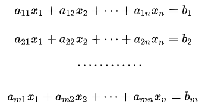
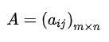
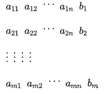
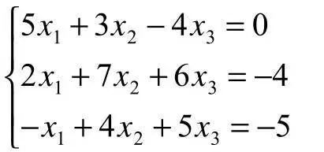
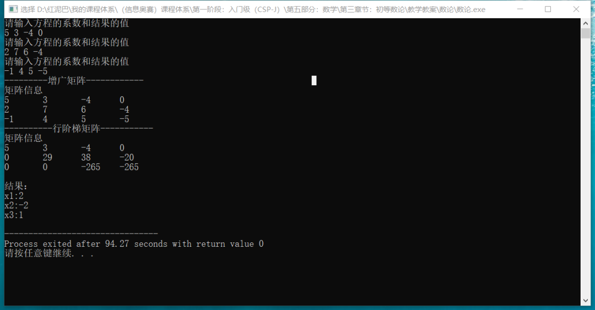

# C++ 数学与算法系列之高斯消元法求解线性方程组


## 1. 前言

**什么是消元法？**

`消元法`是指将多个`方程式`组成的方程组中的若干个变量通过有限次地变换，消去方程式中的变量，通过简化方程式，从而获取结果的一种解题方法。

消元法主要有`代入消元法`、`加减消元法`、`整体消元法`、`换元消元法`、`构造消元法`、`因式分解消元法`、`常数消元法`、`利用比例性质消元法`等。

对方程式消元时，是基于如下的`初等行变换`规则：

- 改变`方程组`中`方程式`的顺序，或者说无论先求解方程组中哪一个方程式，不影响方程组的解。
- 对一个方程式中的所有系数乘以或除以某一个非零数，不影响方程组的解。
- 方程式之间可以倍乘后相加或相减，不影响解。

其中最常用的为`代入消元法`和`加减消元法`，简要介绍一下。

**代入消元法**

如求解 `2x+3y=10`和`x+y=4`; `2` 个方程式中的 `x` ,`y`变量时。

可以把第 `2` 个方程式变换成 `x=4-y`。

然后代入到第 `1` 个方程中，`2(4-y)+3y=10`。可求解出 `y=2，x=2`。

**加减消元法**

还是求解如上的方程组。

可以把第`2` 个方程式乘以 `2` 后再去减第 `1` 个方程式，或者说让第 `1` 个方程式减去第 `2` 个方程式乘以 `2`。

`2x+3y-2x-2y=10-8`。可以求解 `y=2`。

本文主要和大家聊聊高斯消元法，高斯`(Gauss)`消元法也称为简单消元法，是求解一般线性方程组的经典算法。

## 2. 高斯消元法

在理解高斯消元化之前，先理解几个基本概念：

**什么是增广矩阵？**

增广矩阵是线性代数中的概念，如下线性方程组：




使用每个方程式的系数构建的矩阵，称为`系数矩阵`，表示为：




用方程式的`系数`和`结果`构建的矩阵称为方程组的`增广矩阵`。如下图所示：




当方程组中的每一个方程的结果都为 `0`时, 即 `b1=b2=b3=b4……bm=0`，称这样的方程组为`齐次线性方程组`。

### 2.1 高斯消元法的思想

高斯消元的基本思想：

- 对于一个有 `n`个变量、有`n`个方程式的方程组。


- 把方程组中除了第 `1` 个方程式外的其它方程式中的`x1` 消去，同理，再把除了第 `2` 个方程式以下的方程组中其它方程式中的 `x2` 消去，依次类推，直到最后 `1` 个方程式中只留下 `xn`。
- 目的：通过一系列的变换，让`增广矩阵`变换成一个稀疏的`行阶梯矩阵`。

现通过具体的案例，理解高斯消元法。

如求解如下图所示的方程组：




- 用方程组中的所有方程式的系数和结果构建`增广矩阵`，此矩阵有 `3` 行，为了描述方便，用 `r1表示第 1 行，r2 表示第 2 行，r3 表示第 3 行`。


- 利用**初等行变换规则**将增广矩阵转换成**行阶梯矩阵**。

  首先，定位至`r1`行（当前行）的第 `1`列(`col=1`)，以行（列号不变）扫描方式(从上向下)查找到本列中绝对值最大的数据，然后把最大值所在的行和当前行交换。如下图，因当前行所在列中的值就是最大值，故不需要交换。

  > Tips：为什么要交换？是不是一定要交换行？


- 消元过程，从方程组角度而言，消去第 `1` 个方程后面 `x1`变量。从矩阵角度而言，让`r1`后面行中的 `col`列中的数据变为 `0`。如消去 `r2、r3`中`col`列中数据，可以使用倍数相加（减)变换方案，消元表达式：`r2=r2*5-r1*2、r3=r3*5+r1`。


- 定位到`r2`行的第 `2` 列（`col=2`）。逻辑如上，以行扫描方式查找到本列中绝对值最大的数据，然后把最大值所在的行和当前行交换。因当前行的值 `29`最大，不需要交换。


- 消去 `r3`中的 `x2`变量，让`r3`行中只保留`x3`变量。消元表达式：`r3=r3*29-r2*23`。


- 最终会得到一个`行阶梯`的系数矩阵，最后可以对矩阵以反序方式迭代求解。如下图所示：


- 最终可以得到 `x3=1，x2=-2，x1=2`。

**问题思考**

变换过程中，是不是一定需要`交换行`？

答案：不一定。

当方程组中的方程式不多时，换不换行其实并不重要。如下方程组。


其增广矩阵如下图所示。


可以先消去`r2`行中的`x1`变量。即`r2=r2*-2*r3`。


再消去`r1`行中的`x2`变量。即`r1=r1*2+r2`。


使用消元求解过程中，没有对行交换，同样能求解方程组中各变量的值。但是，当方程组中方程式的数量非常多时，如果不提供统一的处理规则，则无法对大量数据进行迭代处理。

`算法设计`的本质是`发现`或者为数据`提供`统一的`逻辑处理单元`。前文所述高斯消元法中之所以交换行，是保证最后生成`上三角`矩阵的前提，从而让算法更稳定。

求解方程组时，其解有 `3` 种情况：

- 无解，如果最后一行形如：`{0，0，0，……0 ,val!=0}` 则无解。
- 唯一解。消元后，最后生成标准的`上三角形矩阵`。
- 无穷解。消元后，不是标准的`上三角形`矩阵即不可确定。

### 2.2 编程实现

代码的主题是讨论高斯消元算法，只考虑了`无解`和`唯一解` `2` 种情况且假设所有解都是整数。

```cpp
#include <iostream>
#include <cmath>
using namespace std;
class GaussXy {
 private:
  //矩阵的行数,方程组中方程的数量
  int row;
  //矩阵的列数(系数和结果数量)
  int col;
  //二维数组
  int **matrix;
  //存储方程组的结果
  int *result;
  /*
  * 初始化数据
  */
  void init() {
   string tips="请输入方程的系数和结果的值";
   for(int i=0; i<row; i++) {
    cout<<tips<<endl;
    for(int j=0; j<col; j++) {
     cin>>this->matrix[i][j];
    }
   }
  }
  /*
  *查找列值最大的行
  * curRow:当前行
  * col:列号
  */
  int  getMaxRow(int curRow,int col ) {
   //行扫描查找当前列中的最大值
   int maxRow=curRow;
   for(int i=curRow+1; i<this->row; i++) {
    if( fabs( this->matrix[i][col]) > fabs( this->matrix[maxRow][col] ) ) {
     maxRow=i;
    }
   }
   return maxRow;
  }
  /*
  *求两数最小公倍数
  */
  int gbs(int num,int num_) {
   //存储相乘结果
   int res=num*num_;
   int temp=0;
   if(num<num_) {
    temp=num;
    num=num_;
    num_=temp;
   }
   //辗转相除求最大公约数
   while(num_!=0) {
    temp=num_;
    num_=num % num_;
    num=temp;
   }
             //返回最小公倍数
   return res /  num;
  }
  /*
  *交换行
  */
  void swapRow(int curRow,int maxRow) {
   int* tmp=this->matrix[curRow];
   this->matrix[curRow]=this->matrix[maxRow];
   this->matrix[maxRow]=tmp;
  }

 public:
  /*
  *构造函数
  */
  GaussXy(int row,int col) {
   this->row=row;
   this->col=col;
   //结果数组
   this->result=new int[this->row*2];
   for(int i=0; i<this->row*2; i++)
    this->result[i]=1;
   //通过输入数据构建矩阵
   this->matrix=new int*[row];
   for(int i=0; i<row; i++) {
    this->matrix[i]=new int[col];
   }
   //初始化矩阵
   this->init();
  }

  /*
  *显示矩阵
  */
  void showMatrix() {
   cout<<"\n矩阵信息"<<endl;
   for(int i=0; i<row; i++) {
    for(int j=0; j<col; j++) {
     cout<< this->matrix[i][j]<<"\t";
    }
    cout<<endl;
   }
  }

  /*
  * 核心代码：高斯消元
  */
  void  gaussXy() {
   //最大行号
   int maxRow=0;
             //行扫描
   for(int curRow=0,curCol=0; curRow<this->row; curRow++,curCol++) {
    maxRow=0;
    //行扫描查找最大值行
    maxRow= this->getMaxRow(curRow,curCol);
    //交换行
    if(maxRow!=curRow) this->swapRow(curRow,maxRow);
    //将 curRow 以下的行和 curRow 行消元
    for(int nextRow=curRow+1; nextRow<this->row; nextRow++) {
     if( this->matrix[nextRow][curCol] !=0 ) {
      //找两数绝对值的最小公倍数
      int gbs= this->gbs(fabs(this->matrix[curRow][curCol]) ,fabs(this->matrix[nextRow][curCol] ) );
      //倍数
      int curRowBs= gbs/fabs( this->matrix[curRow][curCol] );
      //倍数
      int nextRowBs=gbs / fabs(this->matrix[nextRow][curCol]) ;
      //一正一负
      if( this->matrix[curRow][curCol] * this->matrix[nextRow][curCol] < 0 )curRowBs=-curRowBs;
      //列扫描，消元行中的变量
      for ( int j=curCol; j<this->col; j++) {
       this->matrix[nextRow][j]=this->matrix[nextRow][j]*nextRowBs - this->matrix[curRow][j]*curRowBs;
      }
     }
    }
   }
  }

  /*
  *求解
  */
  void getResult() {
   //如果最后一行形如： {0，0，0，……0 val!=0} 则无解
   if( this->matrix[this->row-1][this->col-2]==0 &&  this->matrix[this->row-1][this->col-1]!=0 )
    cout<<"无解"<<endl;
             int idx=0;
   //存储每行最后一列的值
   int res=0;
   int curCol=0;
   //如果是严格的行阶梯矩阵，则有唯一解
   for(int curRow=this->row-1; curRow>=0; curRow--) {
    int idx=this->row-1;
    int res=this->matrix[curRow][this->col-1];
    int curCol=this->col-2;
    for(; curCol>=0; curCol--) {
     //为零结束
     if( this->matrix[curRow][curCol]==0) break;
     //减去
     res-=this->matrix[curRow][curCol]*this->result[idx--];
    }
    //补回来
    res+=this->matrix[curRow][curCol+1];
                 //只取整数
    this->result[curRow]=  res / this->matrix[curRow][curCol+1] ;
   }
   //输出结果
   cout<<"\n结果："<<endl;
   for(int i=0; i<this->row; i++ )
    cout<<"x"<<i+1<<":"<<this->result[i]<<endl;
  }
};
//测试
int main() {
 GaussXy* gaussXy=new GaussXy(3,4);
 cout<<"---------------------";
 gaussXy->showMatrix();
    //高斯消元
 gaussXy->gaussXy();
 cout<<"---------------------";
 gaussXy->showMatrix();
 gaussXy->getResult();
 return 0;
}
```

输出结果：




## 3. 总结

本文讨论了高斯消元法的算法思想，基于此思想编码实现了对方程组的求解。本文旨在讲清楚高斯消元的核心逻辑，有兴趣者可在此代码的基础上继续研究、扩展。


