# C++ 数学与算法系列之牛顿、二分迭代法求解非线性方程


## 1. 前言

前文介绍了如何使用“高斯消元法”求解线性方程组。

本文秉承`有始有终`的态度，继续介绍“非线性方程”的求解算法。

本文将介绍 `2` 个非线性方程算法：

- 牛顿迭代法。
- 二分迭代法。

牛顿迭代法`（Newton's method）`又称为牛顿-拉夫逊方法`（Newton-Raphson method）`，是`拉夫逊`和`牛顿`同时提出来的一种在`实数域`和`复数域`上`近似求解方程`的方法。

这里的措词`近似求解方程`作何解释？

因为对于多数方程式，是不存在求根公式的，也就是说无法或很难找到标准的可以直接套用的模板公式。

因而求精准解非常困难，从而寻找方程的近似根就显得特别重要。

即使如`牛顿`大神提出的方法，也只是近似求解的算法，甚至需要满足某种收敛条件的方程式才能使用牛顿迭代法求解。

下面将具体介绍这 `2` 种求解算法。

## 2. 牛顿迭代算法

下面将通过一系列演示图，直观告诉大家`牛顿迭代法`的算法思想。此算法，牛顿用到了`微积分`相关的知识。

所以，在阅读下文时，需要具备`微积分`的认知。

牛顿迭代算法求解方程式的过程，有点类似福尔摩斯探案。通过蛛丝马迹，先合理的预测，然后根据推理逻辑，让预测离真相近一点、再近一点……一直到找到或接近真相。

实事告诉我们，不是所有的预测都能找到真相。同理，基于预测的牛顿迭代法也不一定总是能找到方程式的解，看完下面的演示流程，你将明白。

假设现有一非线性方程式 `f(x)`，其在平面坐标轴上的曲线图案如下。所谓求解，指求其与横坐标轴相交时的点的 `x`值。

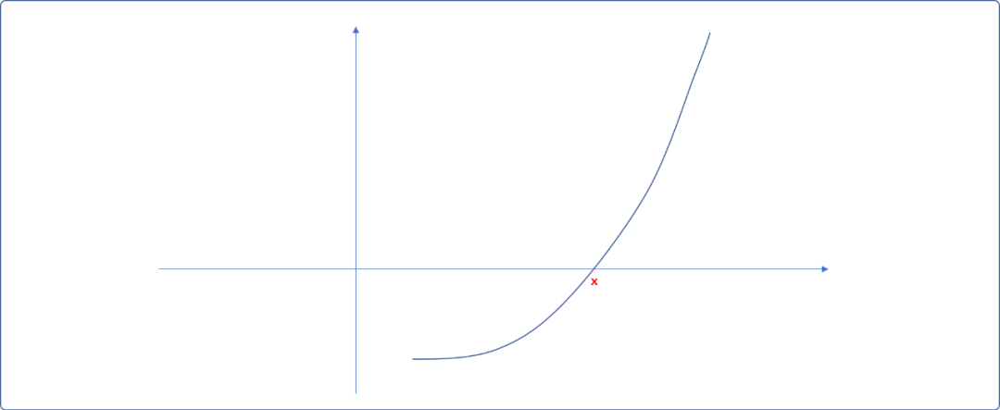

现在，看看`牛顿`是如何使用`微积分`思想找到这个解的。只能说，牛逼人的思想非我等凡人能比拟。

### 2.1 基本思想

- 在横坐标上找一 `x0` 点（也称**预测点**），并绘制 `(x0,f(x0))` 点与曲线相交的切线。切线和横坐轴相交于 `x1`。

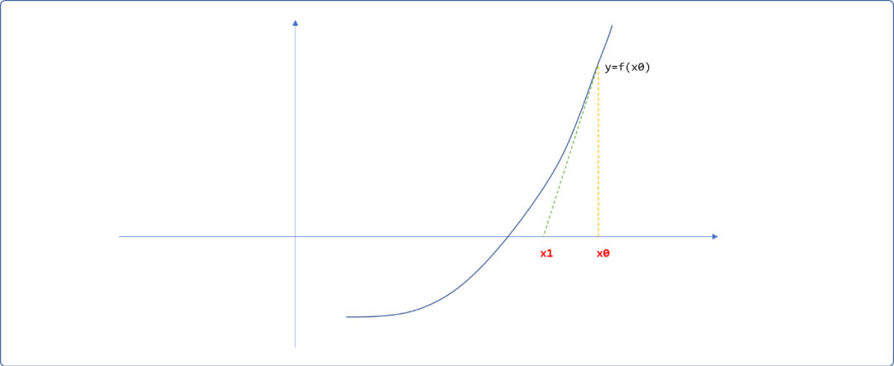

- 再绘制`(x1,f(x1))`点与曲线的切线，此时，切线与横轴相交于`x2`，继续绘制出`(x2,f(x2))`与曲线的交点……如此迭代，直到切线与横坐标轴的交点与曲线和横坐标的交点重合，此交合点便是曲线的解。是不是很简单，为什么是牛顿发现的，而不是我？

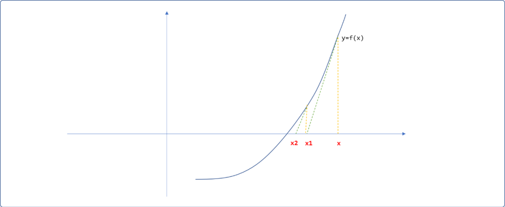

- `x0`的选择并不完全是任意的，也应该有基本的推理依据。`预测点`是关键，如果与真实值相差太远，则迭代次数会很大。理论上，只要预测点给的好，且此方程式满足`牛顿迭代算法`的前提条件，无论迭代多少次，解必能找出来，无非就是时间的长短。

### 2.2 如何求解 `x1`

现在的问题转向到如何通过已知的`x0`值计算出`x1`的值？是否存在一个标准的公式？

现在就是`微积分`上场的时候，请屏住呼吸！真相将昭然若揭。

- 在`x0 和 x1`之间选择任一点`x`，从此点向上绘制垂直线，假设与切线相交的位置的纵坐标值为`y` 。并绘制如下箭头所指的三角形。

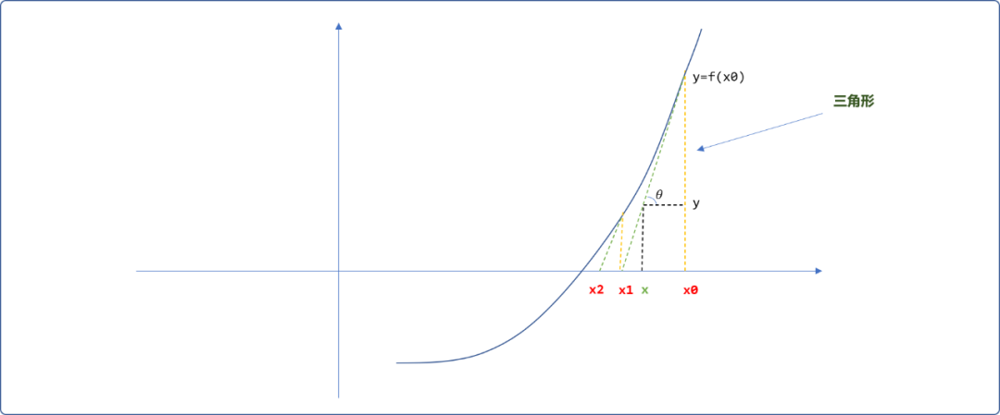

- 三角形为直角三角形，学过三角函数的都知道，会存在如下的关系。

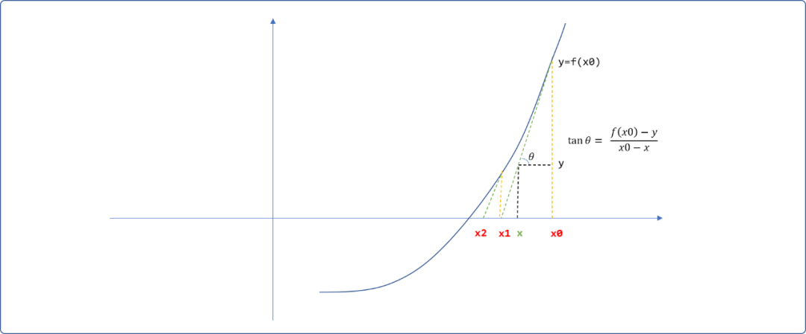

- 现在轮到`微积分`知识上场，它告诉我们，其中的`tan0`就是切线与曲线的`斜率`。根据`微积分`原理，斜率即是`x0`在曲线上的导数，可以根据`导函数`计算出来，即`tan0=f'(x0)`。太完美了，如此公式可演变如下：


继续化丽的转身后，它便如涅槃重生一样，破茧成如下人见人爱的模样：


- 因切线与横坐标轴相交的位置`y=0`，从而便可以求得 `x1`的值：

```cpp
𝑥1=𝑥0−𝑓(𝑥0)/𝑓′(𝑥0)
```

同理，求得 `x2`的值。

```cpp
𝑥2=𝑥0−𝑓(𝑥1)/𝑓′(𝑥1)
```

最后，可以抽象出`牛顿迭代公式`，即迭代法中的`核心子逻辑`。

```cpp
xn+1=xn-f(xn)/f'(xn)
```

只能说，太神奇了！计算机中的`算法`一词来源于数学，计算机学科本也源自数学学科，因一脉相承，说计算机的尽头是数学，一点不假，计算机只是工具而已。

### 2.3 收敛性

**什么是牛顿迭代算法的收敛性？**

通俗理解，选定预测点后，也许中间会有偏离，或许会忽远忽近，但无论如何最终都能靠近真实解，这便是收敛性。

换一句话而言，如果通过预测点，无法收敛到真实值，则无法求出解。

如果预测点为曲线的驻点，很不幸，由此点绘制的切线不会和横坐标轴相交，是无法求方程式的解。

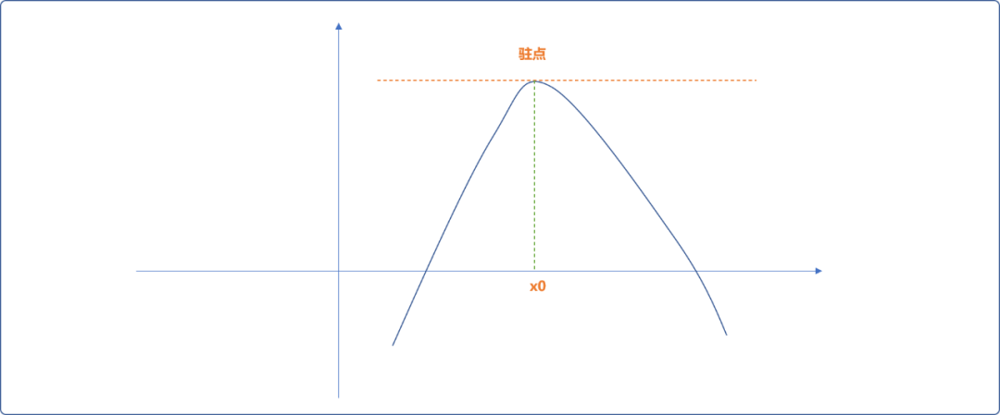

另，如果收敛越来越远，也不能使用牛顿迭代法。如下图所示。

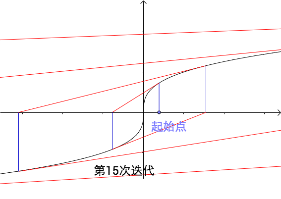

怎样的方程式能使用牛顿迭代法，牛顿迭代法已经给出了答案，可自行查阅一下。

### 2.4 编码实现

现在来一个具体的案例：求解如下方程式。

f(x)=`x`4-`3x`3+`1.5x`2-`4`

牛顿迭代法中的`子逻辑`需要`求解函数`的`导函数`。受限于篇幅，导函数的推导在此不负赘。这里仅给出常见的基本函数的`导函数`公式，再根据导函数生成法则，直接找到`求解函数`的`导函数` f‘(x)=4x3-9x2+3x。

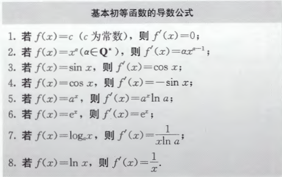

> **Tips：**如果对微积分或导函数不是很了解，建议查阅一下高等数学书。

牛顿迭代法可以使用递归和非递归方案实现。

因初始值为`预测值`，从而可能导致递归或迭代的次数会很大。前文说过，牛顿迭代法并不是一个解非线性方程式的通用算法，也就是说使用牛顿迭代法可能得不到解。

故最好在编写算法时添加如下的辅助手段：

- 保证函数在整个定义域内最好是`二阶`可导的。
- `预测点`会影响计算量，可限制迭代的次数，当在此限制下不能得到结果时，则增加其它的判断手段试错。

#### 2.4.1 递归实现

```cpp
#include <iostream>
#include <cmath>
using namespace std;

/*
* 原函数  f(x)=x^4-3x^3+1.5x^2-4
*/
double yfun(double x) {
 return pow(x,4)-3*pow(x,3)+1.5*pow(x,2)-4.0;
}

/*
* 导函数 f'(x)=4*x^3-9*x^2+3x
*/
double dfun(double x) {
 return 4*pow(x,3)-9*pow(x,2)+3*x;
}

/*
* 递归实现牛顿迭代法
* val:预测值
* precision:精度
* deep:递归深度
*/
double newtonIter(double val,double precision,int deep) {
 if(deep==0)return -1;
 //求解
 double res=yfun(val);
 if( res==0.0 || fabs(res) < precision )
  //如果找到
  return val;
 //根据牛顿迭代公式修正 val 值
 val=val-res/dfun(val);
 //递归
 return newtonIter(val,precision,deep);
}

/*
*非递归实现
*/
double newtonIter_(double val,double jd) {
 double res=yfun(val);
 while( !(res==0.0 || fabs(res) <jd)  ) {
  //根据牛顿迭代公式修正 val 值
  val=val-yfun(val)/dfun(val);
  res=yfun(val);
 }
 //如果找到
 return val;
}

int main() {
 double val=0.0;
 int deep=0;
 double precision=0.0;
 cout<<"请输入预测值"<<endl;
 cin>>val;
 cout<<"递归或迭代的最大次数："<<endl;
 cin>>deep;
 cout<<"输入精度："<<endl;
 cin>>precision;
 double res=newtonIter(val,precision,deep);
 cout<<res;
 return 0;
}
```

**测试：**

当 `x=0`其倒数为 `0`，说明为驻点，不能做为预测值。

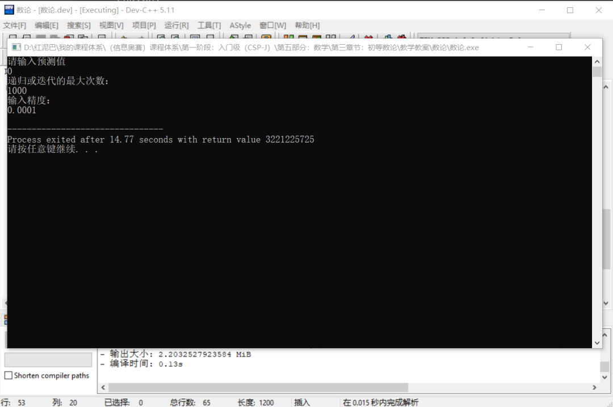

再试着把把 `2`代入导函数，其导数为 `2`，可以作为预测值试试：

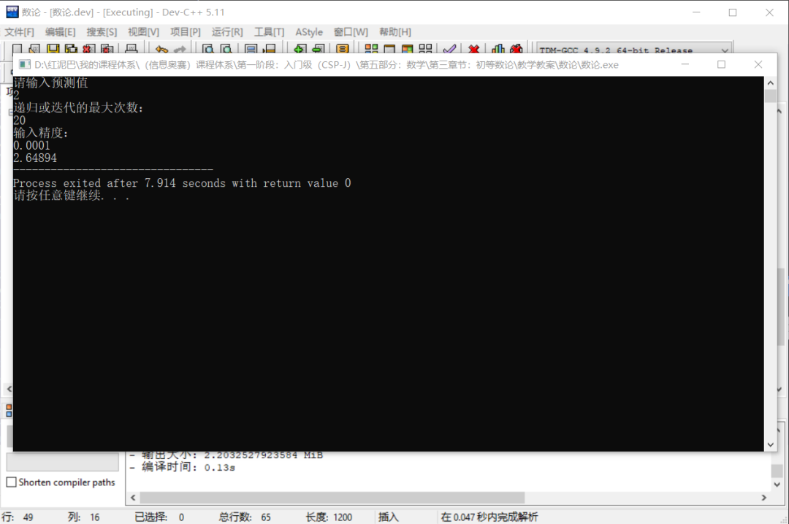

正向测试一下，把`2.64894`代入原函数，可知是符合精度要求的近似值。

#### 2.4.2 非递归实现

```cpp
//省略……
double newtonIter_(double val,double precision,int deep) {
 int i=0;
 double res=0;
 while( 1 ) {
  res=yfun(val);
  if( res==0.0 || fabs(res) <precision)
   return val;
  //根据牛顿迭代公式修正 val 值
  val=val-yfun(val)/dfun(val);
  i++;
  if(i==deep)
   return -1;
 }
 //没有
 return -1;
}
```

## 3. 二分迭代法

二分迭代法使用了二分算法思想求解非线性方程式。

下面要求使用二分迭代法求解 `2x`3-`5x-1=0` 方程式，且要求误差不能大于`10e-5`。二分迭代法也只是近似求解算法。

### 3.1 基本思想

预测或初步判断值的范围。

- 如上述方程，把 `0`代入方程式，可知 `f(0)=-1`，然后把 `1` 代入方程式，则 `f(1)=-4`，再把 `2`代入方程式，得到`f(2)=5`。如下绘制函数在 `[0,1,2] 3` 个点之间的大致走势图，分析后可知在`[1,2]`之间必然会有一个解。

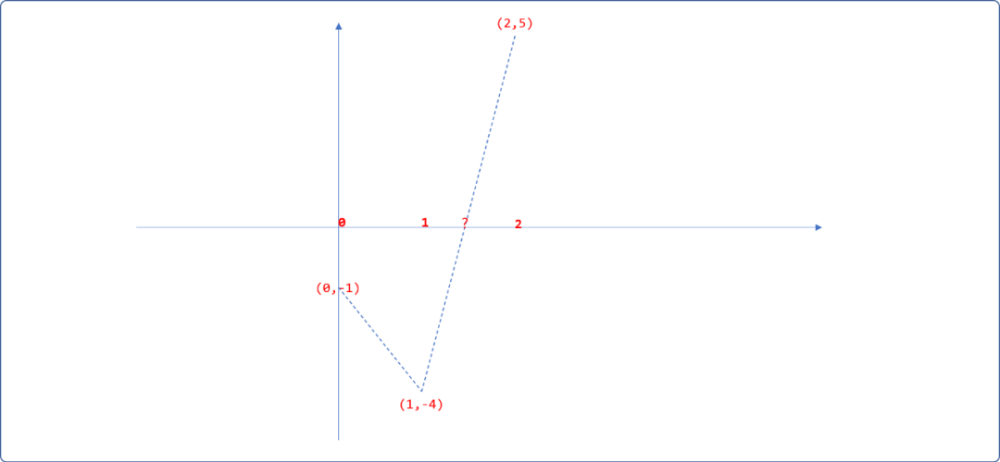

- 使用二分思想，计算出 `[1,2]`之间的中间点 `x=(1+2)/2=1.5`。把`1.5`代入方程式得到函数值为`f(1.5)=-1.75`。重新修正一下走势图。因为 `f(1.5)*f(1)>0`，说明`f(1.5)和f(1)`在同一边，其真实值应该在 `1.5`的右边。如果`f(1.5)*f(1)<0`，则说明`f(1.5)和f(1)`在横坐标的两侧，说明真实值应该在 `1.5`的左边。分析后可知直实值缩小在`[1.5,2]`之间。

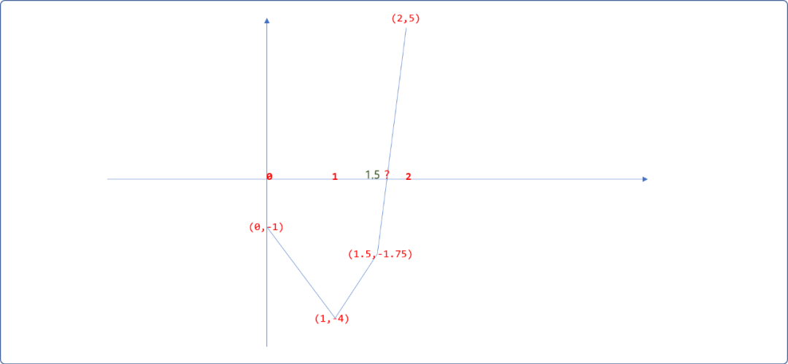

- 再计算`[1.5,2]`之间的中间点`x=(1.5+2)/2=1.75`，把`1.75`代入方程式得`f(1.75)=0.96875`，发现值已经慢慢接近 `0`。分析可知，真实值应该在`[1.5，1.75]`之间，继续二分迭代，便可以找到近似值。

### 3.2 编程实现

二分迭代法同样有递归和非递归两种方案。

#### 3.2.1 非递归

```cpp
#include <iostream>
#include <cmath>
using namespace std;
/*
* 原函数
*/
double yfun(double x) {
 return 2*pow(x,3)-5*x-1;
}
/*
* 非递归实现二分迭代法，
* left:左边界
* right:右边界
* precision:精度
* 为了避免找不到结果，可以限制迭代次数。
*/
double binaryIter(double left,double right,double precision) {
 //计算左边界的函数值
 double leftVal=yfun(left);
 //右边界的函数值
 double rightVal=yfun(right);
 while(true) {
  //中间位置
  double midPos=(left+right) /2;
  //函数值
  double midVal= yfun(midPos);
  if( midVal==0.0  || fabs(midVal) < precision ) {
   //找到
   return midPos;
  } else if( leftVal*midVal>0 ) {
   //真实值应该在 midPos 的右边
   left=midPos;
  } else {
   right=midPos;
  }
 }
}
int main() {
 cout<<"左边界"<<endl;
 double left=0.0;
 cin>>left;
 cout<<"右边界"<<endl;
 double right=0.0;
 cin>>right;
 cout<<"精度："<<endl;
 double precision=0;
 cin>>precision;
 double res= binaryIter(left,right,precision);
 cout<<res;
 return 0;
}
```

**输出结果：**

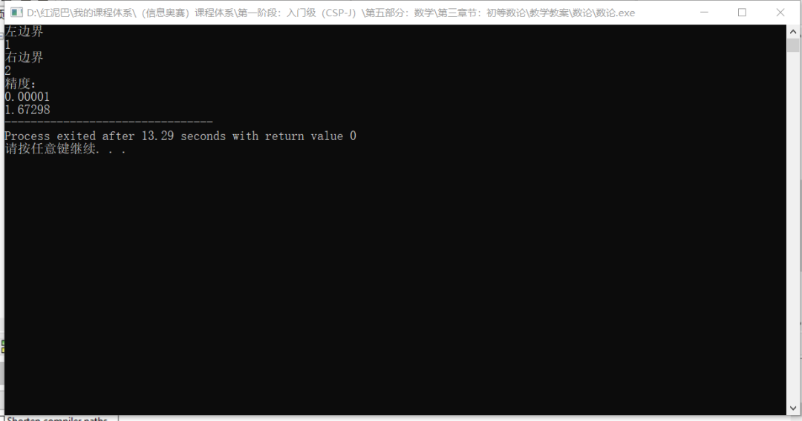

根据前面的函数走势图，可以直观感觉到在横坐标轴的左边还有一个值。把`-1`代入函数，知`f(-1)=2`，可预测在`[-1,0]`之间还有一个近似值。

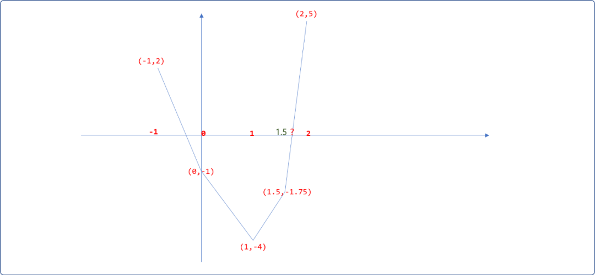

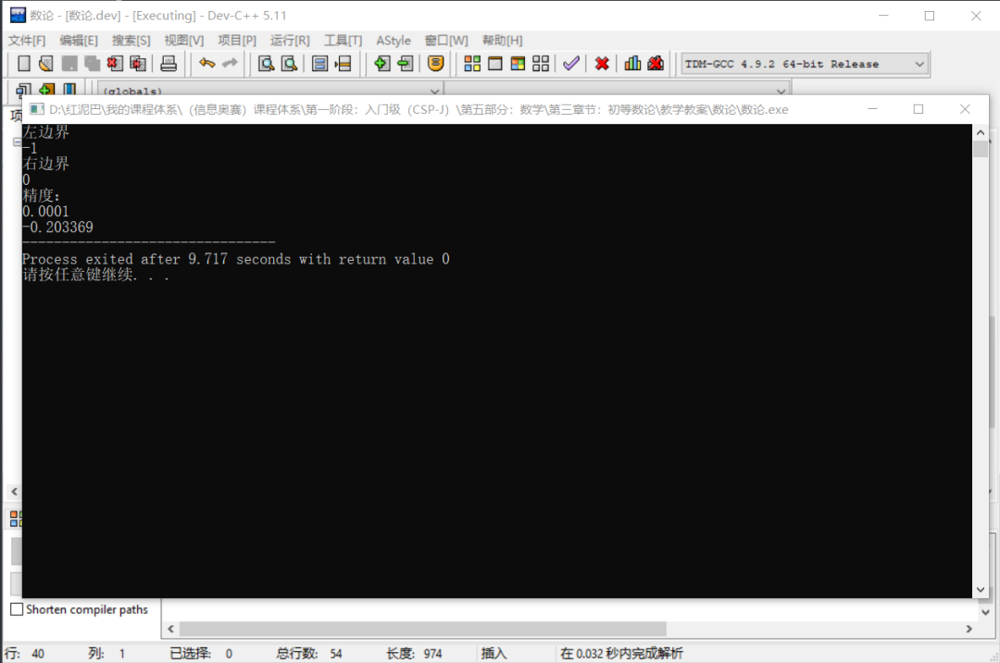

同样，可以使用二分迭代法求解上文的方程式  f(x)=`x`4-`3x`3+`1.5x`2-`4` 的解：

很容易预测出函数在`[2,3]`之间有解。只需要修改 `yfun`函数。

```cpp
double yfun(double x) {
 return pow(x,4)-3*pow(x,3)+1.5*pow(x,2)-4.0;
}
```

其结果和牛顿迭代法计算出来的一样。

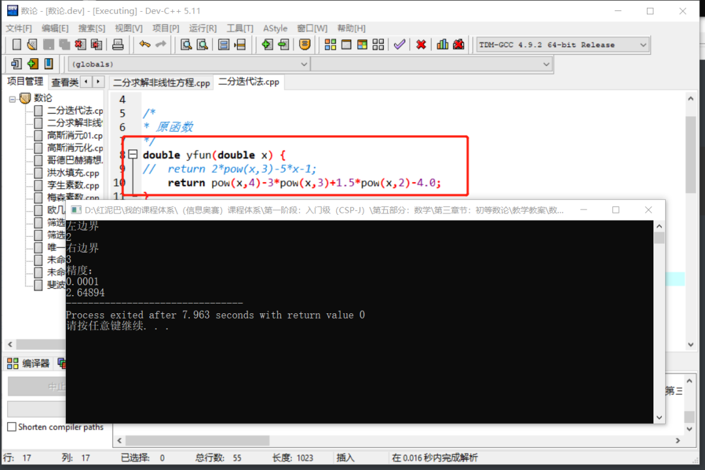

#### 3.2.2 递归方案

最后提供二分迭代法的递归实现。

```cpp
double binaryIter_(double left,double right,double precision) {
 if(left>right)return -1;
 //计算左边界的函数值
 double leftVal=yfun(left);
 //右边界的函数值
 double rightVal=yfun(right);
 //中间位置
 double midPos=(left+right) /2;
 //函数值
 double midVal= yfun(midPos);
 if( midVal==0.0  || fabs(midVal) < precision ) {
  //找到
  return midPos;
 } else if( leftVal*midVal>0 ) {
  //真实值应该在 midPos 的右边
  return binaryIter_(midPos,right,precision);
 } else {
  return binaryIter_(left,midPos,precision);
 }
}
```

## ４. 总结

本文讲解了牛顿、二分迭代求解非线性方程。虽然牛顿迭代没有二分迭代那么容易理解，但其功能却是强大很多。


