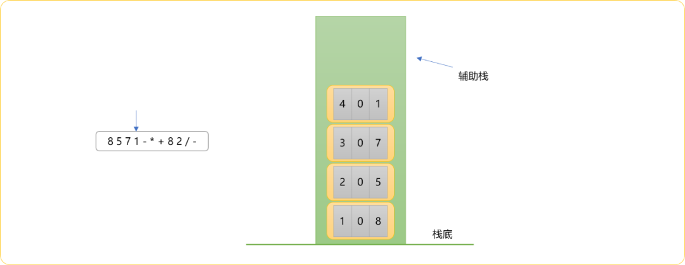
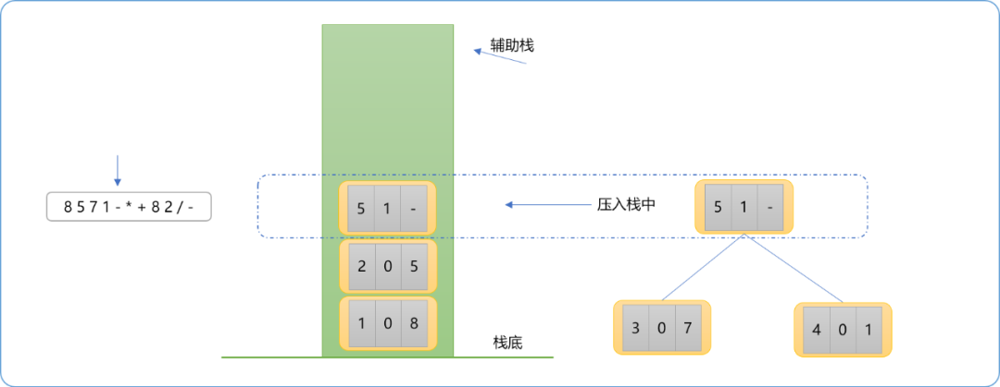
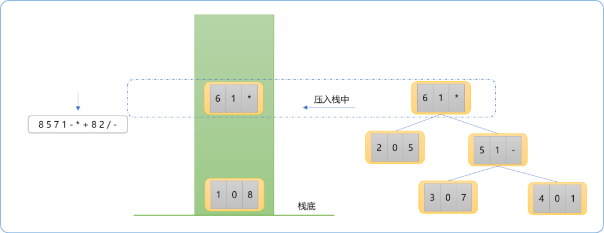
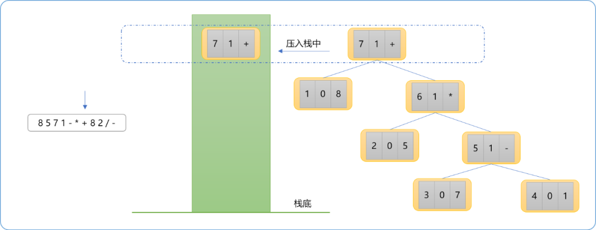
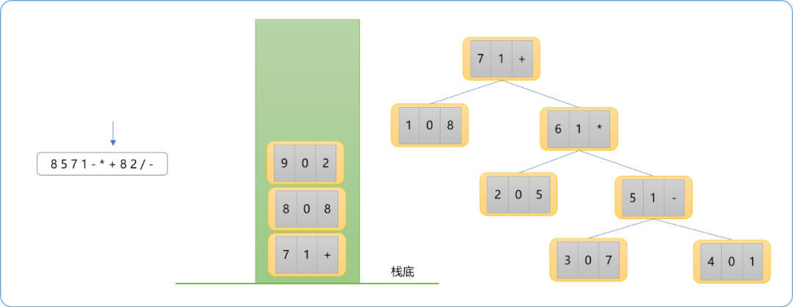
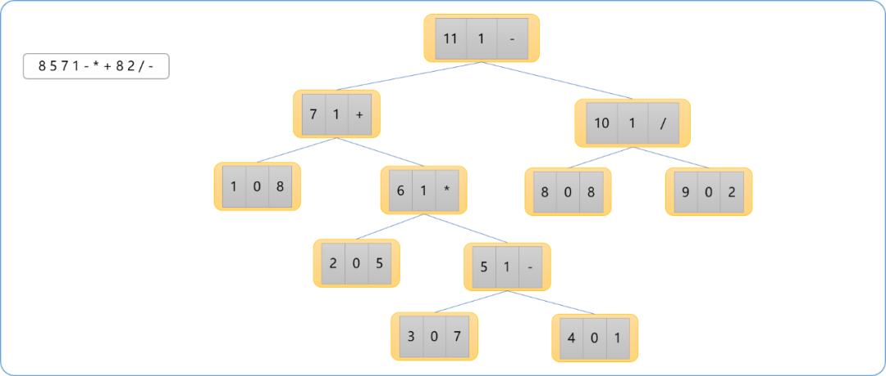
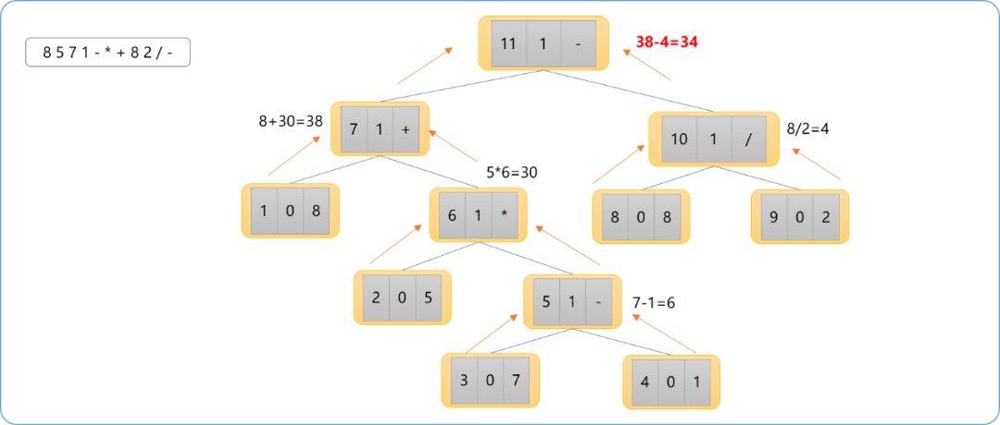
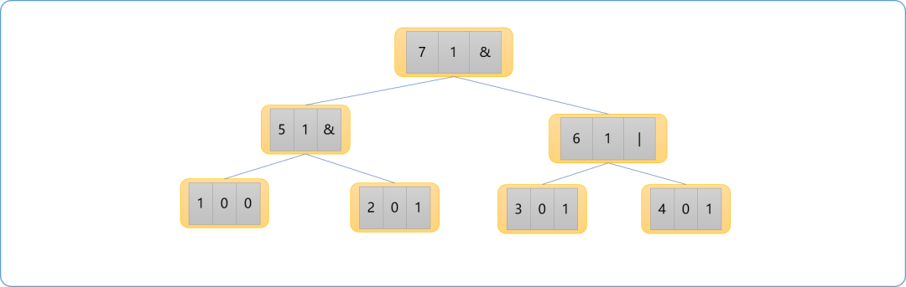
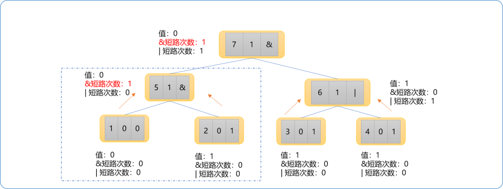

# C++ 不知树系列之表达式树

## 1. 引言

在公众号里，写过与中缀、后缀表达式有关的文章，在文章中详细讲解了中缀表达式如何转换为后缀表达式以及如何求解后缀表达式。但是没有涉及后缀表达式与表达式二叉树的关系，终究感觉到有些不完整，本文力图填补这个遗憾，把后缀表达式相关的内容悉数补充完整。

在栈的基础上直接求解后缀表达式的过程并不复杂。为何还把后缀表达式转换为二叉树，然后再在树的结构基础上求解，且不是饶了一个弯子，其实不然。

如果把后缀表达式当成一棵二叉树，也称为表达式树后，受惠于树结构的特性，在此基础上再去理解和认识后缀表达，则其认知深度将会从应用层面转向到底层逻辑层面，则会有一番不同的感悟。另受树相关算法的加持，也可以把后缀表达式的求解过程变得很易理解且具有艺术性。

## 2. 表达式树

如何把中缀表达式转换为后缀表达式，此文不再负赘。仅讲解如何把后缀表达式转换为表达式树，以及对表达式树求解。并且讨论以树进行求解的益处。

现假设有如下后缀表达式：`8571-*+82/-`其中缀表达式为`8+5*(7-1)-8/2`。二叉树的构造过程如下：

### 2.1 构建流程

1. 定义节点类型。节点类型中的成员可以根据需要进行扩展，这也是比单纯借助栈求解值更有优势地方，可以获取求解过程中更多的信息。

```cpp
//后缀表达式==》表达式树==》求解
struct ExpNode
{
    //编号：唯一 与存储对应
    int id;
    //类型: 1 表示运算符 ，0 表示操作数
    int type;
    //值
    char val;
    //左节点
    int left=0;
    //右节点
    int right=0;
    //其它可补充信息

    void desc()
    {
        cout<<this->id<<" "<<this->type<<" "<<this->val<<" "<<this->left<<" "<<this->right<<endl;
    }
};
```

1. 扫描后缀表达式。无论是扫描到操作数还是运算符，都以此为值构建一个树节点。并借助栈进行存储，其实这个过程和直接求解后缀表达式的过程是相似的。

   如下是扫描完前面所有操作数后栈中的情况。



1. 扫描到运算符`-`时，以`-`为值构建树节点，并以此节点为父节点，从栈中分别弹出 `2` 个节点，作为此父节点的子节点并且压入栈中。如下图所示。

   > **Tips：** 先弹出来的节点为右子节点，后弹出来的节点为左子节点。



1. 扫描`*`运算符，同上思路，先构建树节点，从栈中弹出两个节点作为其子节点后再把此节点压入栈中。



1. 至此，可以小结一下，操作数构建的节点只能作为叶结点，直接入栈。运算符构建的节点用来作为父亲结点也可以作为其它运算符的子结点。如下图当扫描到`+`号运算符时，其树结构如下图所示。



1. 继续扫描`8、2`，因是操作数，其相应的节点类型直接入栈。至此，栈中的情形下图所示。



1. 继续扫描表达式后面的`/、-`运算符，作上述相同的处理。最终表达式树如下图所示。



### 2.2 求解过程

表达树构建完毕，便可以完全站在树的角度思考问题。树的常规操作无非就是深度搜索以及广度搜索。而深度搜索又分为前序遍历、中序遍历和后序遍历。显然，针对于表达式树，对于任何一个根节点，理应先得到左、右子树的值后方可计算。其计算过程应该是由底向上的过程。

如下图所示：



具体到实际编程，可以使用后序遍历计算出最终结果。并且可以为每一个节点存储其对应的值，这也是比纯求解要有价值的地方。

**编码实现：**

```cpp
#include <iostream>
using namespace std;
struct ExpNode
{
    //编号
    int id;
    //类型: 1 表示运算符 ，0 表示操作数
    int type;
    //值
    char val;
    //左节点
    int left=0;
    //右节点
    int right=0;
    //其它可补充信息

    void desc()
    {
        cout<<this->id<<" "<<this->type<<" "<<this->val<<" "<<this->left<<" "<<this->right<<endl;
    }
};
//表达式
string expStr;
//辅助栈
int myStack[100];
ExpNode trees[100];
//栈顶指针
int top=0;
int number=0;
/*
*是否是操作数
*/
bool isDigit(char ch)
{
    if(ch>='0' && ch<='9')return true;
    return false;
}
/*
* 构建表达式树
*/
void buileExpTree()
{
    trees[number]= {number,-1,'0',-1,-1};
    for(int i=0; i<expStr.size(); i++)
    {
        if( isDigit(expStr[i]) )
        {
            //存储
            trees[++number]= {number,1,expStr[i],0,0};;
            //入栈
            myStack[++top]= number;
        }
        else
        {
            ExpNode node = {++number,1,expStr[i],0,0};
            node.right=myStack[top--];
            node.left=myStack[top--];
            //存储
            trees[number]=node;
            //入栈
            myStack[++top]=number;
        }
    }
}
//前序遍历
void post(int root)
{
    if( trees[root].id==0 )return;
    trees[root].desc();
    post( trees[root].left );
    post( trees[root].right );
}

//后序遍历
int cal(int root)
{
    int res=0;
    if( trees[root].id==0 )return 0;

    int lval= cal( trees[root].left );
    int rval= cal( trees[root].right );

    if(isDigit( trees[root].val ))
    {
        int temp=trees[root].val-'0';
        return temp;
    }
    else
    {
        char opt=trees[root].val;
        cout<<lval<<endl;
        cout<<rval<<endl;

        if(opt=='+')
            return lval+rval;
        else if(opt=='-')
            return lval-rval;
        else if(opt=='*')
            return lval*rval;
        else if(opt=='/')
            return lval/rval;
    }
}

int main()
{
    cin>>expStr;
    buileExpTree();
   // post(myStack[top]);
    int res= cal( myStack[top] );
    cout<<res;
    return 0;
}
```

## 3. 扩展

有了上述知识体系，现扩展一下应用。求解一道同样与表达式有关的题目。

**问题描述：**

逻辑表达式是计算机科学中的重要概念和工具，包含逻辑值、逻辑运算、逻辑运算优先级等内容。在一个逻辑表达式中，元素的值只有两种可能：`0`(表示假)和`1`(表示真) 。元素之间有多种可能的逻辑运算，本题中只需考虑如下两种:“与”(符号为`&`)和“或"(符号为 `|`)。其运算规则如下 :

```cpp
0 & 0 = 0 & 1 = 1 & 0 = 0，1&1=1;``0|0=0，0 | 1= 1 | 0 = 1 | 1=1。
```

在一个逻辑表达式中还可能有括号。规定在运算时，括号内的部分先运算；两种运算并列时，& 运算优先于`|`运算；同种运算并列时，从左向右运算。比如，表达式`0 | 1 & 0` 的运算顺序等同于`0 | ( 1 & 0 )`;表达式`0 & 1 & 0 | 1`的运算顺序等同于`( ( 0 & 1 ) & 0 ) | 1`。

此外，在 `C++` 等语言的有些编译器中，对逻辑表达式的计算会采用一种“短路”的策略：

- 在形如 `a&b` 的逻辑表达式中，会先计算`a`部分的值，如果`a=0`，那么整个逻辑表达式的值就一定为`0`，故无需再计算b部分的值；
- 在形如`alb`的逻辑表达式中，会先计算`a`部分的值如果`a=1`，那么整个逻辑表达式的值就一定为`1`，无需再计算`b`部分的值。

现在给你一个逻辑表达式，你需要计算出它的值，并且统计出在计算过程中，两种类型的“短路”各出现了多少次。需要注意的是，如某处“短路”包含在更外层被“短路”的部分内则不被统计，如表达式1 | ( 0 & 1 )中尽管0&1是一处“短路”，但由于外层的1 | ( 0 & 1 )本身就是一处“短路”，无需再计算0 & 1部分的值，因此不应当把这里的0 & 1计入一处“短路”。

**问题分析：**

此问题给出的是中缀表达式，可以先转换为后缀表达式，然后再转换为表达式树，再进行求解。如果本题仅是求表达式的值，直接可以对中缀表达式求解，无须转换成后缀表达式。但是，本题除了求解值，还要求短路的次数，转换为二叉树后更易于理解。

修改上文中的树节点类型，添加两个成员变量，分别记录每一个节点的`&`和`|`短路次数。

```cpp
//后缀表达式==》表达式树==》求解
struct ExpNode
{
    //编号：唯一 与存储对应
    int id;
    //类型: 1 表示运算符 ，0 表示操作数
    int type;
    //值
    char val;
    //左节点
    int left=0;
    //右节点
    int right=0;
    //其它可补充信息
    int andCnt; 
    int orCnt;
    void desc()
    {
        cout<<this->id<<" "<<this->type<<" "<<this->val<<" "<<this->left<<" "<<this->right<<endl;
    }
};
```

现假设构建出来的二叉树如下图所示。



求值过程依然还是由底向上。这里需要注意，如果父节点位置有同运算符的短路信息，则子节点的短路会被抹掉，如果父节点位置没有短路信息，此子节点的短路信息会向上保留。

图中虚线所在位置的子树，已经发生了一次`&`短路，回溯到根节点时，因根节点位置也是短路状态，子树中的短路将不计。总`&`短路次数还是为 `1`。



现在回归到代码的角度，我们只需要修改后序遍历位置的代码，便可以得到最终的结果。注意，需要返回三个结果。

```cpp
//后序遍历
ExpNode cal_(int root)
{
    //递归出口
    if( trees[root].id==0 )return 0;
    //得到左子节点的值
    ExpNode lval= cal( trees[root].left );
    //得到右子节点的值
    ExpNode rval= cal( trees[root].right );

    if(isDigit( trees[root].val ))
    {   //如果是操作数节点直接返回
        return trees[root];
    }
    else
    {
        char opt=trees[root].val;
        if(opt=='&')
        {
            if(lval.val=='0')
            {
                // & 短路
                trees[root].andCnt=1;
                // | 短路是左右子节点的和
                trees[root].orCnt=lval.orCnt+rval.orCnt;
                //值
                trees[root].val='0';
            }
            else
            {   
                //值由右节点决定
                trees[root].val=rval.val;
                //& 短路是左右子节点的和
                trees[root].andCnt=lval.andCnt+rval.andCnt;;
                trees[root].orCnt=lval.orCnt+rval.orCnt;
            }
        }
        else if(opt=='|' )
        {
            if(lval.val=='1')
            {
                //短路
                trees[root].orCnt=1;
                trees[root].andCnt=lval.andCnt+rval.andCnt;
                trees[root].val='0';
            }
            else
            {
                trees[root].val=rval.val;
                trees[root].andCnt=lval.andCnt+rval.andCnt;;
                trees[root].orCnt=lval.orCnt+rval.orCnt;
            }
        }
        return trees[root];
    }
}
```

## 4. 总结

得到后缀表达式后，可以直接求值，其实求值过程中已经包括了构建树的流程，只是没有具体出来。把后缀表达式映射成二叉树，其一，可以通过结构清晰看到后缀表达式的底层逻辑，其二可以基于树的算法直观易懂得到结果。再因节点是可以是复杂数据类型，可以在遍历树的过程中封装复杂的结果。

无论如何，把一个抽象的问题变得能具体描述，对于解题是大有帮助的。

