# C++ 不知树系列之二叉排序堆


## 1.  前言

**什么是二叉堆？**

`二叉堆`是**有序**的 `完全二叉树`，在`完全二叉树`的基础上，`二叉堆` 提供了**有序性特征**：

- `二叉堆` 的**根结点**上的值是整个堆中的`最小值`或`最大值`。
- 当`根结点`上的值是整个堆结构中的最小值时，此堆称为`最小堆`。最小堆中，任意节点的值大于父结点的值。
- 当`根结点`上的值是整个堆结构中的最大值时，则称堆为`最大堆`。最大堆中，任意节点的值小于父结点的值。

根据完全二叉树的特性，二叉堆的父结点与子结点之间满足下面的关系：

- 如果知道了一个结点的位置 `i`，则其左子结点在 `2*i` 位置，右子结点在 `2*i+1` 位置。

  > **Tips：** 前提是存在有子结点。

- 如果知道了一个结点的位置 `i`，则其父结点在 `i `除以 `2` 的位置。

  > **Tips：** 根结点没有父结点。


**如上图所示：**

值为 `5` 的结点在 `2` 处，则其左结点 `12` 的位置应该在 `2*2=4` 处，而实际情况也是在 `4` 位置。其右子结点 `13` 的位置应该在 `2*2+1=5` 的位置，实际位置也是在 `5` 位置。

值为 `19` 的结点现在 `7` 位置，其父结点的根据公式 `7` 除 `2` 等于 `3`(取整)，应该在 `3` 处，而实际情况也是在 `3` 处（位置在 `3`、 值为 `8` 的结点是其父结点）。

## 2 堆的数据结构

### 2.1  二叉堆的抽象数据结构

当谈论某种数据结构的抽象数据结构时，最基本的 `API` 无非就是增、删、改、查。

二叉堆的基本抽象数据结构：

- `Heap()` ：创建一个新堆。
- `insert(data)`：向堆中添加新节点（数据）。
- `getRoot()`：返回最小（大）堆的最小（大）元素。
- `removeRoot()` ：删除根节点。
- `isEmpty()`：判断堆是否为空。
- `findAll()`：查询堆中所有数据。

根据`二叉堆`的特性，顺序存储应该成为堆的首选方案。

如有数列=`[8,5,12,15,19,13,1]`，可以先创建一个一维数组。


数组第  `0` 位置初始为 `0`，从第 `2` 个位置也就是索引号为 `1` 的地方开始存储堆的数据。如下图，二叉堆中的数据在数组中的对应存储位置。

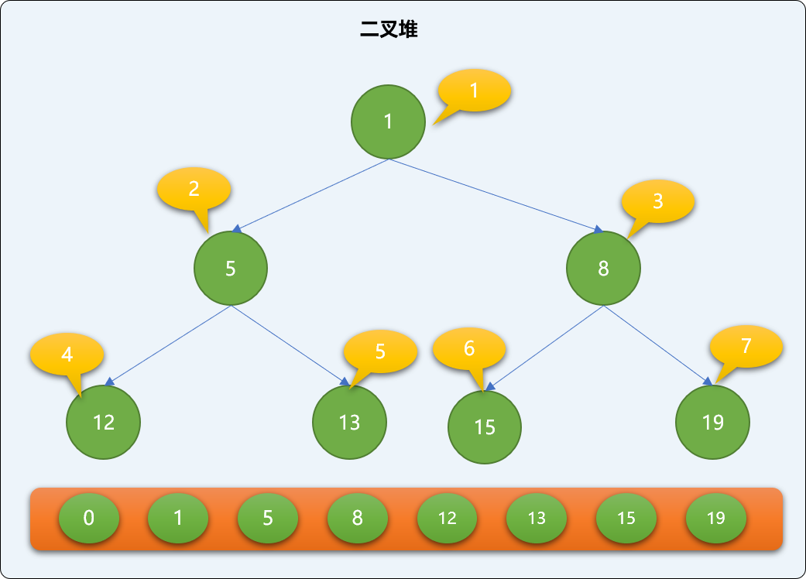

### 2.2  基础 API  实现

设计一个 `Heap` 类封装对二叉堆的操作方法，类中方法用来实现最小堆。

```cpp
#include <iostream>
using namespace std;
/* 
* 堆类 
*/ 
template<typename T>
class Heap{
    private:
     
     //数组
     T heapList[100];
     //实际大小
  int size=0; 
  
 public:
  
  /*
  *构造函数 
  */ 
  Heap(){
  } 
  
  /*
  *返回根结点的值 
  */
  T getRoot();
  
  /*
  *删除根结点 
  */
  T removeRoot();
  
  /*
  *初始化根结点 
  */ 
  void setRoot(T val);
  
  /*
  *添加新结点,返回存储位置 
  */
  int insert(T  val);  /*
  *堆是否为空 
  */ 
  bool isEmpty();
  
  /*
  *输出所有结点
  */
  void findAll() {
   for(int i=0; i<=size; i++)
    cout<<this->heapList[i]<<"\t";
   cout<<endl;
  }  
}; 
```

**`Heap` 类中的属性详解：**

- `heapList`：使用数组存储`二叉堆`的数据，初始时，列表的第 `0` 位置初始为默认值 `0`。

  > **Tips：** 为什么要设置列表的第 `0` 位置的默认值为 `0`？
  >
  > 这个 `0` 也不是随意指定的，有其特殊数据含义：用来描述根结点的父结点编号或者说根结点没有父结点。

- `size`：用来存储二叉堆中数据的实际个数。

**`Heap` 类中的方法介绍：**

`isEmpty`：检查是不是空堆。逻辑较简单。

```cpp
/*
*当 size 为 0 时，堆为空 
*/
template<typename T>
bool Heap<T>::isEmpty(){
 return Heap::size==0;
}
```

`setRoot`：创建根结点。保证根节点始终存储在列表索引为 `1` 的位置。

```cpp
/*
*初始化根结点
*/
template<typename T>
void Heap<T>::setRoot(T val) {
 if( Heap<T>::heapList[1]==0  )
  Heap<T>::heapList[1]=val;
  Heap<T>::size++;
}
```

`getRoot`：如果是最大堆，则返回二叉堆的最大值，如果是最小堆，则返回二叉堆的最小值。

```cpp
/*
*返回根结点
*/
template<typename T>
T Heap<T>::getRoot() {
 if( !Heap<T>::isEmpty  )
  return Heap<T>::heapList[1];
}
```

> **Tips：** 使用数组存储二叉堆数据时，根结点始终保存在索引号为 `1` 的位置。

前面是几个基本方法，现在实现添加新结点，编码之前，先要知道**如何在二叉堆中添加新结点：**

### 2.3 上沉算法

添加新结点采用**上沉算法**。如下演示`上沉`的实现过程。


- 把`新结点`添加到已有的`二叉堆`的最后面。如下图，添加值为 `4` 的新结点，存储至索引号为 `7` 的位置。

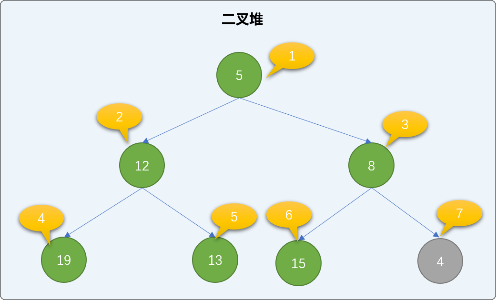

- 查找`新结点`的`父结点`，并与`父结点`的值比较大小，如果比父结点的值小，则和`父结点`交换位置。如下图，值为 `4` 的结点小于值为 `8` 的父结点，两者交换位置。

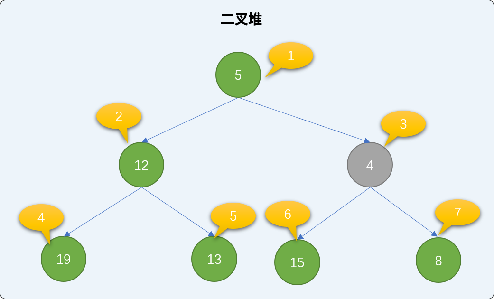

- 交换后再查询是否存在父结点，如果有，同样比较大小、交换，直到到达根结点或比父结点大为止。值为 `4` 的结点小于值为 `5` 的父结点，继续交换。交换后，新结点已经达到了根结点位置，整个添加过程可结束。观察后会发现，遵循此流程添加后，没有破坏二叉堆的有序性。

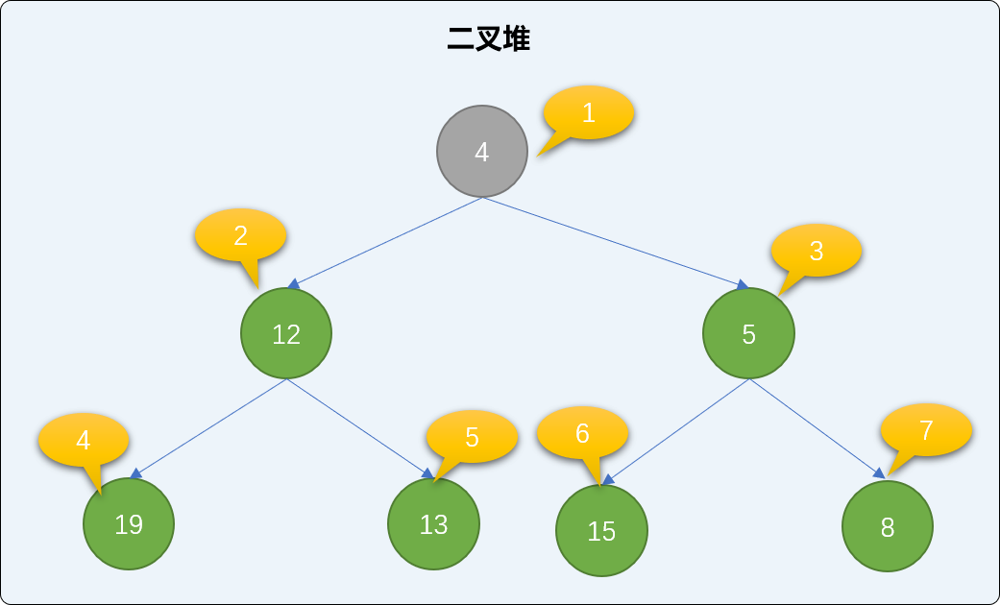

**编码实现 `insert` 方法**

```cpp
/*
*添加新结点
*/
template<typename T>
T Heap<T>::insert(T val) {
 //存储在最后一个位置
 int pos= ++Heap<T>::size;
 Heap<T>::heapList[pos]=val;
 int temp=0;
 //上沉算法
 while(1) {
  //找到父结点位置
  int parentIdx=  pos / 2;
  if(parentIdx==0)
   //出口一，没有父结点
   break;
  if( Heap<T>::heapList[pos]>Heap<T>::heapList[parentIdx] )
   //出口二：大于父结点
   break;
  else {
   //和父亲结点交换
   temp=Heap<T>::heapList[pos];
   Heap<T>::heapList[pos]=Heap<T>::heapList[parentIdx];
   Heap<T>::heapList[parentIdx]=temp;
   pos=parentIdx
  }
 }
}
```

**测试向二叉堆中添加数据。**

```cpp
int main(int argc, char** argv) {
 //实例化堆
 Heap<int> heap;
 //初始化根结点
 heap.setRoot(5);
 //检查根结点是否创建成功
 int rootVal=heap.getRoot();
 cout<<"根结点的值："<<rootVal<<endl;
 //添加值为 12和值为  13 的 2个新结点，检查添加新结点后整个二叉堆的有序性是否正确。
 heap.insert(12);
 heap.insert(13);
 cout<<"测试一："<<endl;
 heap.findAll();
 return 0;
}
```

输出结果：

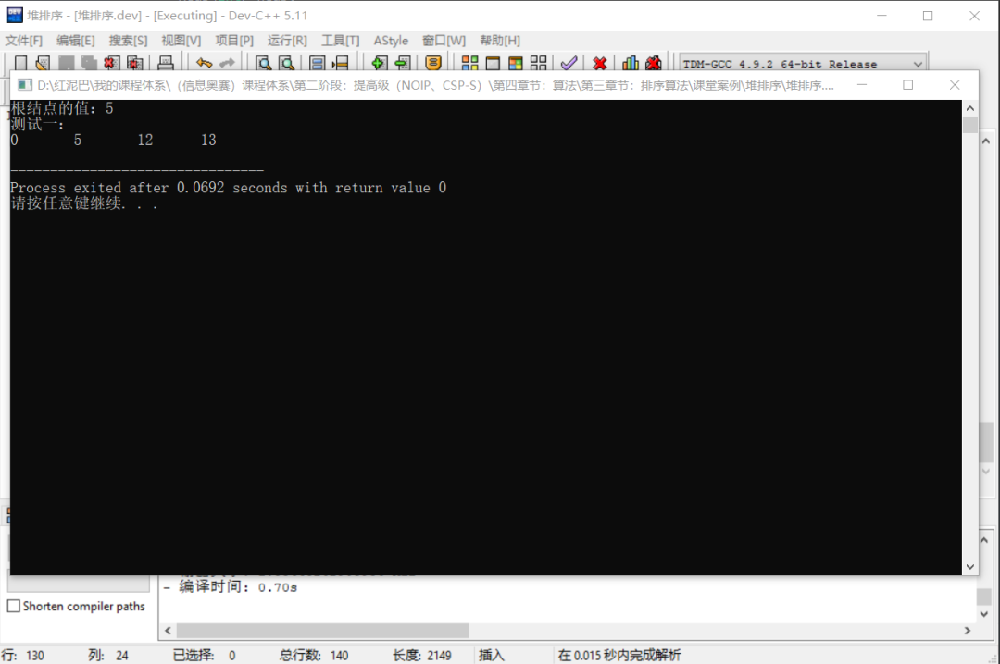

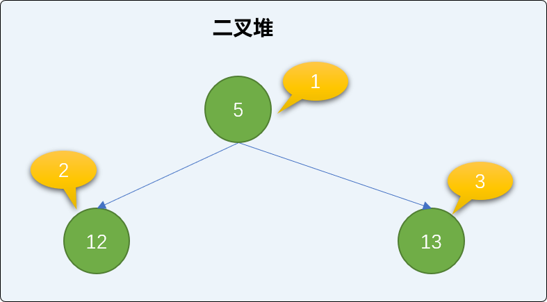

添加值为 `1` 的新结点，并检查二叉堆的有序性。

```cpp
int main(int argc, char** argv) {
 //省略……
    //添加值为 1 的结点
 heap.insert(1);
 cout<<"测试二："<<endl;
 heap.findAll();
 return 0;
}
```

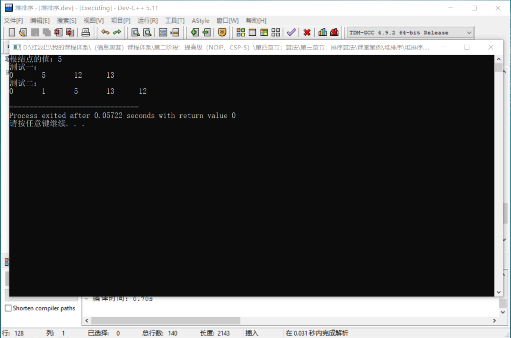

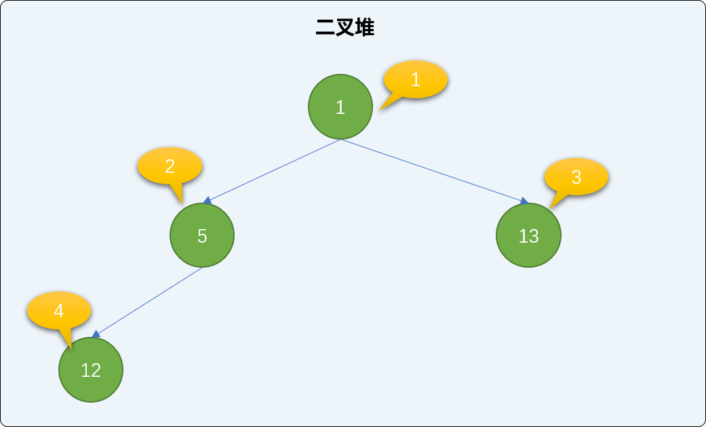

继续添加值为 `15`、`19`、`8` 的 `3` 个新结点，并检查二叉堆的状况。

```cpp
int main(int argc, char** argv) {
 //省略……
 heap.insert(15);
 heap.insert(19);
 heap.insert(8);
 cout<<"测试三："<<endl;
 heap.findAll();
 return 0;
}
```

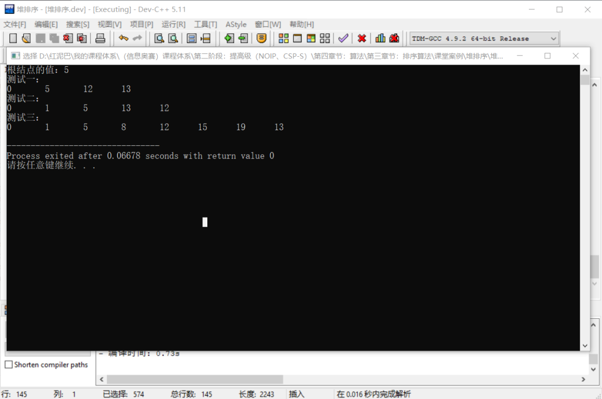

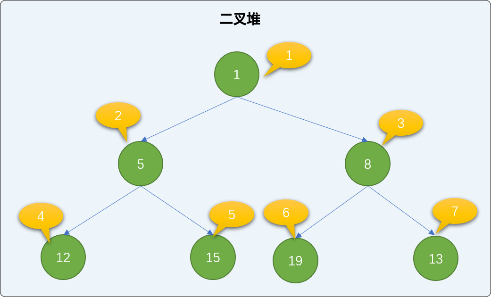

### 2.4 下沉算法

**介绍完添加方法后，再来了解一下，如何使用下沉算法删除二叉堆中的结点。**

`二叉堆`的删除操作从根结点开始，如下图删除根结点后，空出来的根结点位置，需要在整个二叉堆中重新找一个结点充当新的根结点。

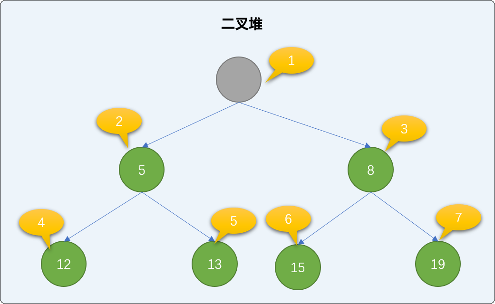

二叉堆中使用**下沉算法**选择新的根结点：

- 找到二叉堆中的最后一个结点，移到到根结点位置。如下图，把二叉堆中最后那个值为 `19` 的结点移到根结点位置。

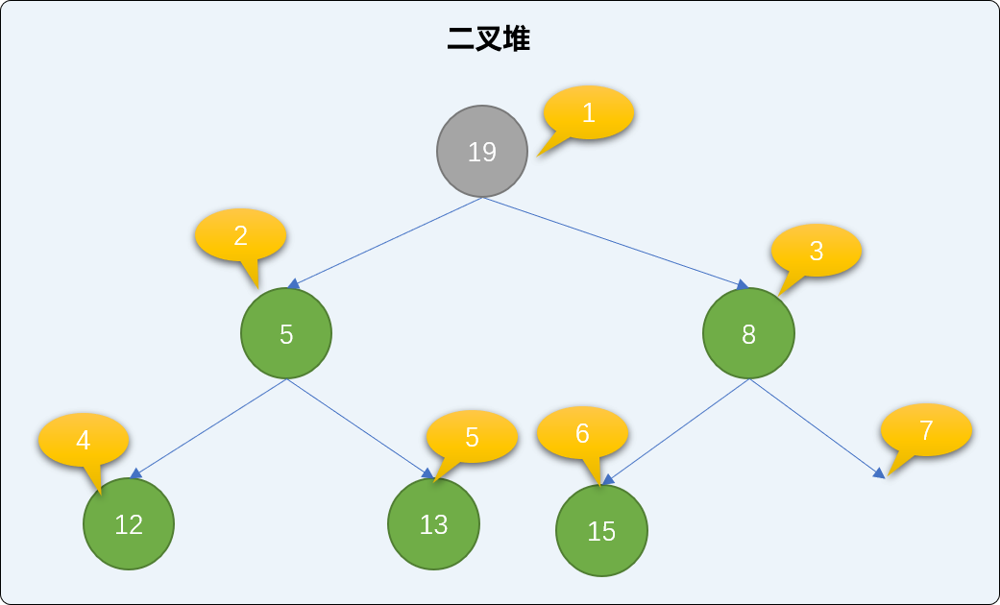

- 最小堆中，如果`新的根结点`的值比左或右子结点的值大，则和子结点交换位置。如下图，在二叉堆中把  `19` 和 `5` 的位置进行交换。

> **Tips：** 总是和最小的子结点交换。

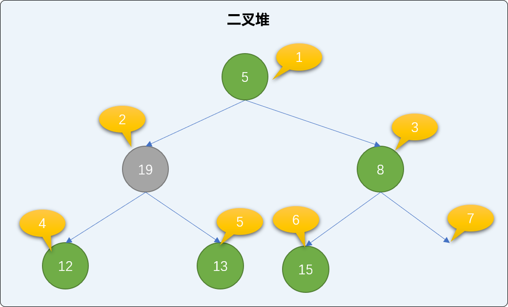

- 交换后，如果还是不满足最小二叉堆父结点小于子结点的规则，则继续比较、交换`新根结点`直到下沉到二叉堆有序为止。如下，继续交换 `12` 和 `19` 的值。如此反复经过多次交换直到整个堆结构符合二叉堆的特性。

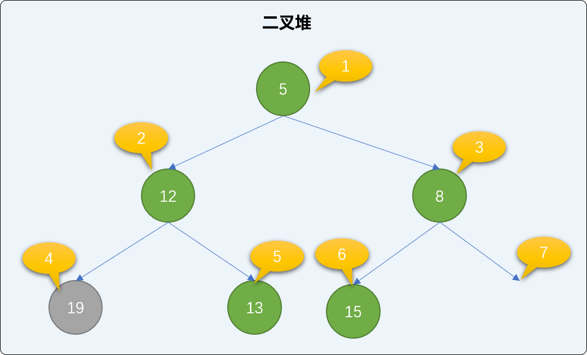

**`removeoot` 方法的具体实现：**

```cpp
/*
* 下沉算法，删除结点
*/
template<typename T>
T Heap<T>::removeRoot() {
 if(Heap<T>::size==0)return NULL;
 T root=Heap<T>::heapList[1];
 if(Heap<T>::size==1) {
  Heap<T>::size--;
  return root;
 }
 //堆中最后一个结点移动根结点
 Heap<T>::heapList[1]=Heap<T>::heapList[Heap<T>::size];
 Heap<T>::size--;

 //下沉算法

 int parentIdx=1;
 //子结点值
 T minChild;
 //子结点位置
 int idx;
 while(1) {
  //左结点位置
  int leftIdx=parentIdx*2;
  //右结点位置
  int rightIdx=parentIdx*2+1;

  if( leftIdx<=Heap<T>::size && rightIdx<=Heap<T>::size ) {
   //记录较小的结点值和位置
   minChild=Heap<T>::heapList[leftIdx]<Heap<T>::heapList[rightIdx]?Heap<T>::heapList[leftIdx]:Heap<T>::heapList[rightIdx];
   idx=Heap<T>::heapList[leftIdx]<Heap<T>::heapList[rightIdx]?leftIdx:rightIdx;
  } else if( leftIdx<=Heap<T>::size) {
   minChild=Heap<T>::heapList[leftIdx];
   idx=leftIdx;
  } else if( rightIdx<=Heap<T>::size ) {
   minChild=Heap<T>::heapList[rightIdx];
   idx=rightIdx;
  }else{
   //没有子结点 
   break;
  }
  //是否交换
  if( Heap<T>::heapList[parentIdx]>minChild ) {
   Heap<T>::heapList[idx]=Heap<T>::heapList[parentIdx];
   Heap<T>::heapList[parentIdx]=minChild;
   parentIdx=idx;
  } else {
   break;
  }
 }
 return root;
} 
```

**测试在二叉堆中删除结点：**

```cpp
int main(int argc, char** argv) {
    //省略……
 cout<<"测试删除一:"<<endl;
 heap.removeRoot();
 heap.findAll();
 return 0;
}
```

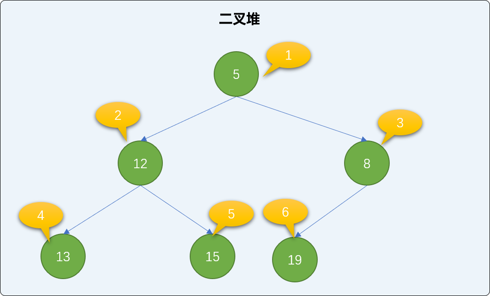

可以看到最后二叉堆的结构和有序性都得到了完整的保持。

## 3. 堆排序

堆排序指借助堆的有序性对数据进行排序。

- 需要排序的数据以堆的方式保存。
- 然后再从堆中以根结点方式取出来，无序数据就会变成有序数据 。

如有数列=`[4,1,8,12,5,10,7,21,3]`，现通过堆的数据结构进行排序。

```cpp
int main(int argc, char** argv) {
 //实例化堆
 Heap<int> heap;
 int nums[] = {4,1,8,12,5,10,7,21,3};
 int size=sizeof(nums)/4;
    // 创建根节点
 heap.setRoot(nums[0]);
    // 其它数据添加到二叉堆中
 for (int i=1; i<size; i++) {
  heap.insert(nums[i]);
 }
 cout<<"堆中数据："<<endl;
 heap.findAll();
    // 获取堆中的数据
 for(int i=0; i<size; i++ ) {
  nums[i]= heap.removeRoot();
  heap.findAll();
 }
 for(int i=0; i<size; i++)
  cout<<nums[i]<<"\t";
 return 0;
}
```

**输出结果：**

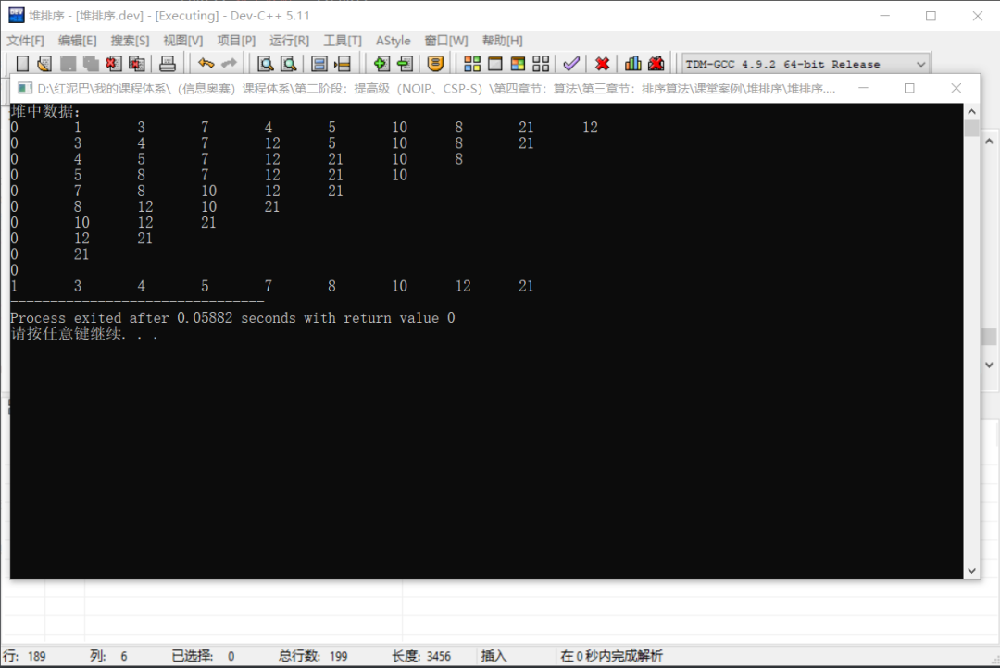

本例中的代码还有优化空间，本文试图讲清楚堆的使用，优化的地方交给有兴趣者。

## 4. 后记

在树结构上加上一些新特性要求，树会产生很多新的变种，如二叉树，限制子结点的个数，如满二叉树，限制叶结点的个数，如完全二叉树就是在满二叉树的“满”字上做点文章，让这个''满"变成"不那么满"。

在完全二叉树上添加有序性，则会衍生出二叉堆数据结构。利用二叉堆的有序性，能轻松完成对数据的排序。

二叉堆中有 `2` 个核心方法，插入和删除，这两个方法也可以使用递归方式实现。

阅读 34


<iframe src="https://wxa.wxs.qq.com/tmpl/kx/base_tmpl.html" class="iframe_ad_container iframe_adv_ad_container" style="-webkit-tap-highlight-color: transparent; margin: 0px; padding: 0px; outline: 0px; width: 677px; height: 200px; border: none; box-sizing: border-box; display: block; left: 0px;"></iframe>


编程驿站

121

[发消息](javascript:;)

