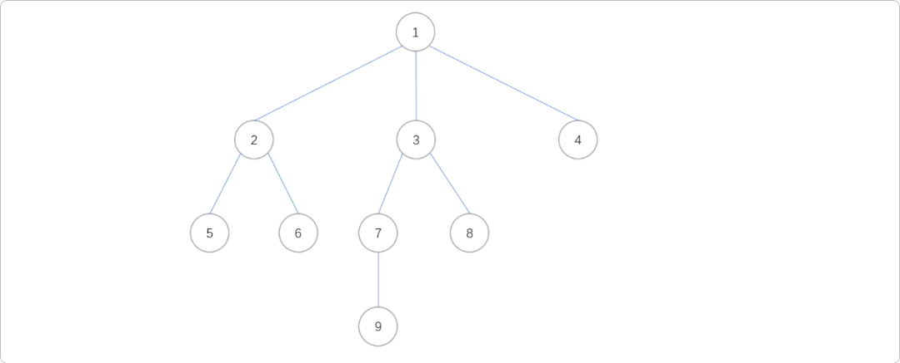
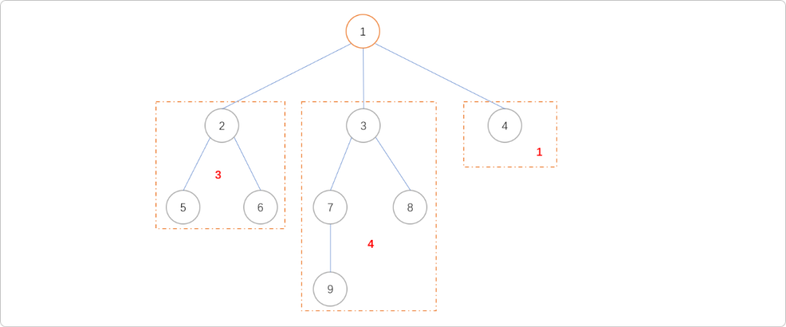
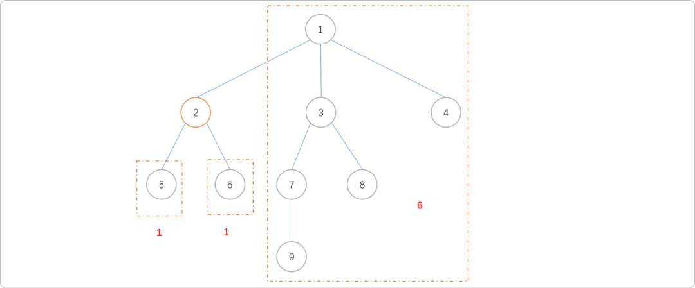
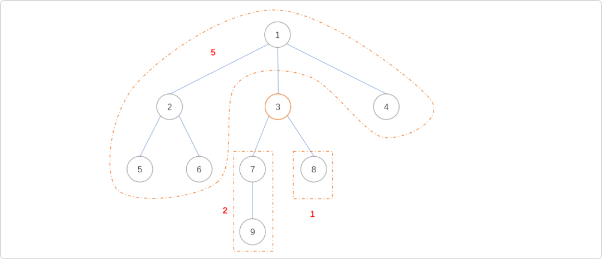
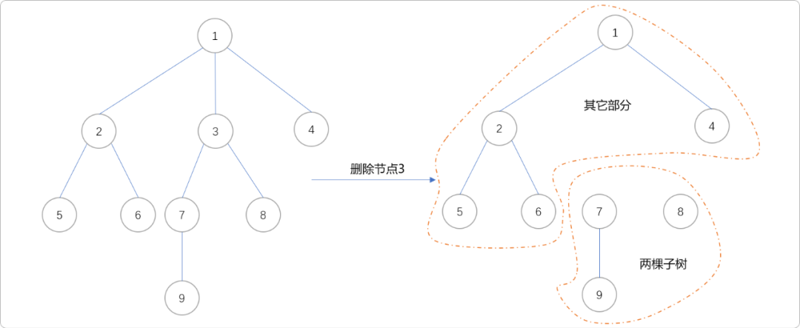
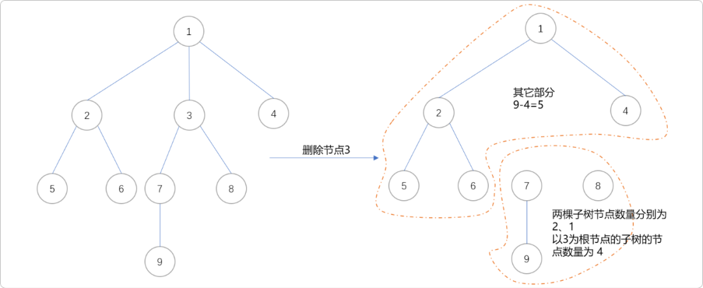
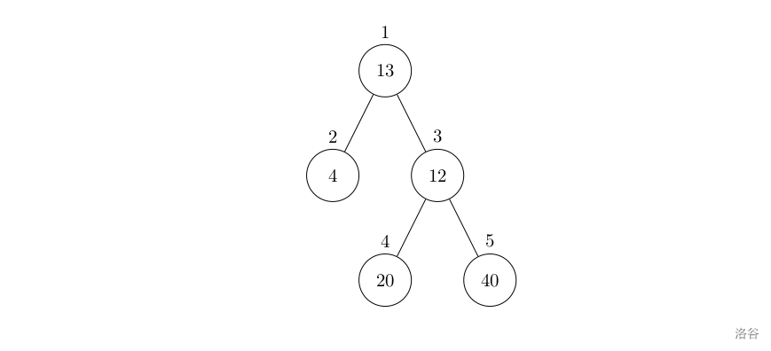
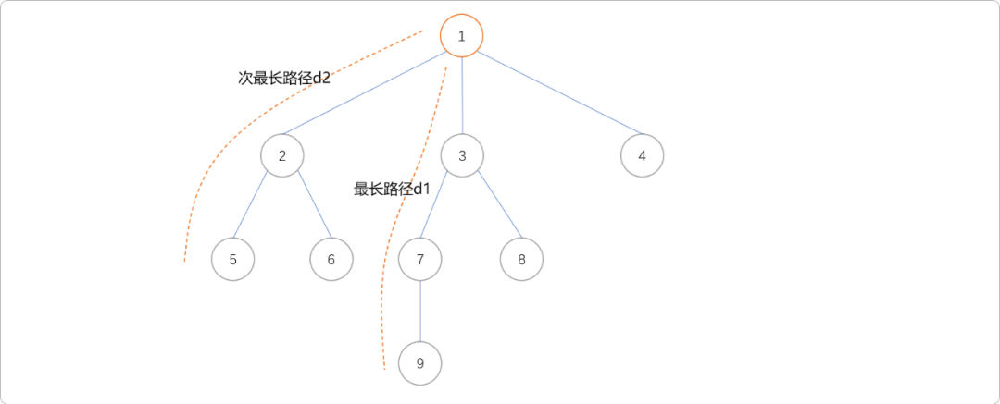

# C++ 树的重心和直径


## 1. 重心

**什么是树的重心？**

物理学而言，重心是指地球对物体中每一微小部分引力的合力作用点，物体受力最集中的那一个点。数学上的重心是指三角形的三条中线的交点。

树的重心也称为质点，有一个很官方的定义：如果在树中选择某个节点并删除，这棵树将分为若干棵子树，统计子树节点数并记录最大值。取遍树上所有节点，使此最大值取到最小的节点被称为整个树的重心。

现根据一个具体树结构解释重心的获取过程。



删除节点`1`，得到`3`棵子树，其子树的节点数量依次为`3、4、1`,最大值为`4`。



删除节点`2`，可得到`3`棵子树，其子树的节点数量依次为`1、1、6`，最大值为`6`。



删除节点`3`，可得到`3`棵子树，其子树的节点数量依次为`2、3、5`，最大值为`5`。



枚举所有节点，计算删除每一个节点后所有子树中的最大节点数量。从结果可知，只有当删除节点`1`后，得到子树的最大值是最小的，故节点`1`为此树的重心。

**重心的特点：**

- 树的重心如果不唯一，则至多有两个，且这两个重心相邻。如下图所示，节点`3`和`7`都是树的重心，且在树上是相邻的。


- 以树的重心为根时，所有子树的大小都不超过整棵树大小的一半。
- 树中所有点到某个点的距离和中，到重心的距离和是最小的；如果有两个重心，那么到它们的距离和一样。
- 把两棵树通过一条边相连得到一棵新的树，那么新的树的重心在连接原来两棵树的重心的路径上。
- 在一棵树上添加或删除一个叶子，那么它的重心最多只移动一条边的距离。

查找树重心的算法思想：

直观来讲，删除一节点后，计算所有子树的最大值。但是，具体如何实施？

如删除节点`3`后，从逻辑上讲，整棵树被分成两个部分。节点`3`的子树部分和其它部分。



以节点`3`为根节点，使用`DFS`搜索算法，可以容易得到子树以及以`3`为根节点的树的节点数量，因为整棵树的节点数量是已知，如果知道了以节点`3`为根节点的子树的节点数，则其它部分的节点数量可以轻松计算出来：整棵树的节点数`n`-以`3`为根节点的子树的数量。

当然，在此过程中，需要记录最大值。如下图所示，最大值为`5`。



具体编码实现

```cpp
#include <iostream>
#include <cstring>
using namespace std;
//邻接矩阵存储树节点间关系
int tree[100][100];
//记录以每一个节点为根节点时子树的节点数量
int sum[100];
//记录删除某一个节点后，其子树中节点数量最大值
int  maxVal[100];
//节点数量
int n;
//深度搜索
void dfs(int u,int f) {
 //以此节点为根节点的子树的初始节点数为 1
 sum[u] = 1;
 //记录子树中节点数量最大的值
 int maxw = 0;
 for (int v = 1; v <= n; v++)    {
  if (!tree[u][v] || v==f) continue;
  //遍历子树
  dfs(v,u);
  //更新当前节点的子树的节点数量
  sum[u] += sum[v];
  //子树的节点数量是不是最大值
  if (sum[v] > maxw)
            maxw = sum[v];
 }
 //计算其它部分的节点数量，且是不是最大值
 if (n - sum[u] > maxw)
        maxw = n - sum[u];
 //记录
 maxVal[u] = maxw;
}
int main() {
 cin >> n;
 int i, x, y;
 for (i = 1; i < n; i++)    {
  cin >> x >> y;
  tree[x][y] = 1;
  tree[y][x] = 1;
 }
 dfs(1,0);
 //重心节点编号
 int count = n, nid = 0;
 for (i = 1; i <= n; i++)
  if (maxVal[i] < count)        {
   count = maxVal[i];
   nid = i;
  }
 cout << nid << " " << count << endl;
 return 0;
}
//测试数据
9
1 2
1 3
1 4
2 5
2 6
3 7
3 8
7 9
```

**应用案例**

**医院设置**

**题目描述**

设有一棵二叉树，如图：



其中，圈中的数字表示结点中居民的人口。圈边上数字表示结点编号，现在要求在某个结点上建立一个医院，使所有居民所走的路程之和为最小，同时约定，相邻接点之间的距离为 `1`。如上图中，若医院建在 `1` 处，则距离和 `=4+12+2X20+2X40=136`；若医院建在 `3` 处，则距离和 =4X2+13+20+40=81`。

**输入格式**

第一行一个整数 `n`，表示树的结点数。

接下来的 `n` 行每行描述了一个结点的状况，包含三个整数 `w, u, v`，其中 `w` 为居民人口数，`u` 为左链接（为 `0` 表示无链接），`v` 为右链接（为 `0` 表示无链接）。

**输出格式**

一个整数，表示最小距离和。

**样例输入**

```cpp
5      
13 2 3
4 0 0
12 4 5
20 0 0
40 0 0
```

**样例输出**

```cpp
81
```

解题思路：

找到树的重心！注意，有权重概念。

```cpp
#include <bits/stdc++.h>
using namespace std;
const int MAXN = 10010;
struct Edge {
 int next, to;
} e[MAXN << 1];
int head[MAXN], idx, w[MAXN], n, size[MAXN];
long long ans = 999, f[MAXN];

inline void add(int from, int to) {
 e[++idx].to = to;
 e[idx].next = head[from];
 head[from] = idx;
}
void dfs(int u, int fa, int dep) {
 size[u] = w[u];
 for(int i = head[u]; i; i = e[i].next) {
  if(e[i].to != fa)
   dfs(e[i].to, u, dep + 1), size[u] += size[e[i].to];
 }
 f[1] += w[u] * dep;
}
void dp(int u, int fa) {
 for(int i = head[u]; i; i = e[i].next)
  if(e[i].to != fa)
   f[e[i].to] = f[u] + size[1] - size[e[i].to] * 2, dp(e[i].to, u);
 ans = min(ans, f[u]);
}
int a, b;
int main() {
 cin>>n;
 int f,t;
 for(int i=1; i<=n; i++) {
  cin>>w[i];
  cin>>f>>t;
  add(f, t);

 }
 dfs(1, 0, 0);
 dp(1, 0);
 printf("%lld\n", ans);

 return 0;
}
```

## 2. 树的直径

什么是树的直径？

**树上任意两节点之间最长的简单路径即为树的「直径」。**显然，一棵树可以有多条直径，他们的长度相等。可以用两次 `DFS` 或者树形 `DP` 的方法在 `O(n)` 时间求出树的直径。

性质：若树上所有边边权均为正，则树的所有直径中点重合。

**首先从任意节点 y 开始进行第一次 `DFS`，到达距离其最远的节点，记为 z，然后再从 z 开始做第二次 DFS，到达距离 z 最远的节点，记为 z'，则 s(z,z') 即为树的直径。**

定理：在一棵树上，从任意节点 y 开始进行一次 `DFS`，到达的距离其最远的节点 z 必为直径的一端。

如果需要求出一条直径上所有的节点，则可以在第二次 `DFS` 的过程中，记录每个点的前序节点，即可从直径的一端一路向前，遍历直径上所有的节点。

```cpp
#include <bits/stdc++.h>
using namespace std;
const int N = 10000;
//节点数
int n=0;
//存储节点到根节点的距离
int idx=0, dis[N];
//树边
vector<int> edge[N];
//DFS
void dfs(int u, int fa) {
 //遍历子节点
 for (int v : edge[u]) {
  if (v == fa) continue;
  //记录子节点的深度
  dis[v] = dis[u] + 1;
  //找最大深度的子节点
  if (dis[v] > dis[idx]) {
   idx = v;
  }
  dfs(v, u);
 }
}
int main() {
 scanf("%d", &n);
 for (int i = 1; i < n; i++) {
  int u, v;
  scanf("%d %d", &u, &v);
  edge[u].push_back(v);
  edge[v].push_back(u);
  dis[i]=0;
 }
 dfs(1, 0);
 dis[idx] = 0;
 dfs(idx, 0);
 printf("%d\n", dis[idx]);
 return 0;
}
```

上述证明过程建立在所有路径均不为负的前提下。如果树上存在负权边，则上述证明不成立。|故若存在负权边，则无法使用两次DFS的方式求解直径。

**树形 DP**

记录当以某节点作为子树的根向下，所能延伸的最长路径长度 `d1` 与次长路径（与最长路径无公共边)长度 `d2`，那么直径就是对于每一个点，该点 `d_1 + d_2` 能取到的值中的最大值。如下图所示，以节点`1`为根节点时，其最长路径和次最长路径的长度之和是是以节点`1`为根节点时子树的直径。

计算出以任一节点为根节点时子树的直径，再在其中选择最长的，就为整棵树的直径。



树形 `DP` 可以在存在负权边的情况下求解出树的直径。

```cpp
#include <bits/stdc++.h>
using namespace std;
const int N = 10000;
int n, ans = 0;
int dis[N][2];
vector<int> edge[N];
void dfs(int u, int fa) {
 dis[u][0]=dis[u][1]=0;
 //遍历子节点
 for (int v : edge[u]) {
  if (v == fa) continue;
  dfs(v, u);
  int t = dis[v][0] + 1;
  if (t > dis[u][0]) {
   //原来最长变为次最长
   dis[u][1] =  dis[u][0];
   //更新最长
   dis[u][0] = t;
  } else if (t > dis[u][1])
      //更新次长
   dis[u][1] = t;
 }
 ans = max(ans, dis[u][0] + dis[u][1]);
}
//测试
int main() {
 scanf("%d", &n);
 for (int i = 1; i < n; i++) {
  int u, v;
  scanf("%d %d", &u, &v);
  edge[u].push_back(v), edge[v].push_back(u);
 }
 dfs(1, 0);
 printf("%d\n", ans);
 return 0;
}
//测度数据
9
1 2
1 3
1 4
2 5
2 6
3 7
3 8
7 9
```

## 3. 总结

树的重心和直径的概念并不难理解。重心算法中有一个很让人灵光一现的地方，以一个节点为分割点，分为子树部分和其它部分，然后利用节点总和不变原理，就能很容易求出其子树节点数和其它部分节点数。这点非常值得我们学习。


