# C++ 树进阶系列之等价类的特性及实现方案


## 1. 前言

**什么是等价类？**

类，顾名思义，是对具有共同特性对象群体的描述，这里也可称类为集合。如果存在一个集合，则称此集合当中所有的对象满足等价关系。从另一个角度描述，当对象或元素不在同一个集合中时，则不满足等价关系。

在图中可以使用等价关系描述图的连通性。如下图，任意两个顶点之间都是连通的，称此图为连通图。连通性是图的特征。

且可认为此图中所有顶点均在一个集合中，且有等价关系，大家都在一个等价类中。

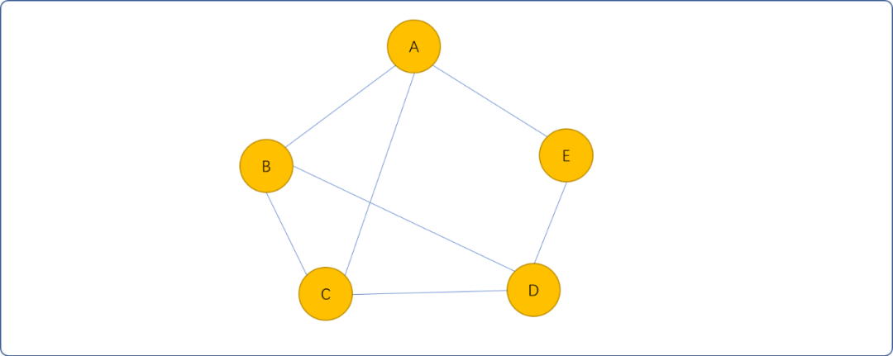

而如下图的非连通图。有 `2` 个连通分量，则认为所有顶点分布在 `2` 个等价类中。一个连通分量为一个等价类。

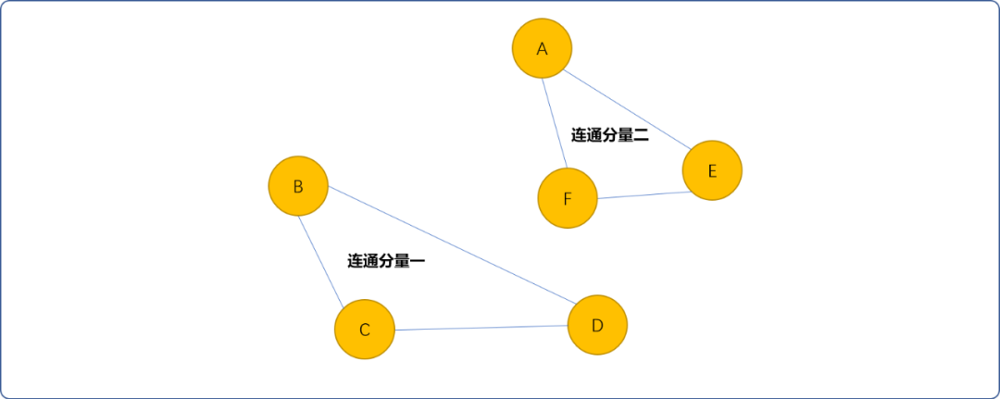

## 2. 等价类的关系

如何确认元素与元素属于同一个等价类？

也就是说，如现有一个集合 `s`，其中有 `n` 个元素，如何确定元素是在一个等价类中，还是分布在不同的等价类中。

当然，在确定元素之间是否属于同一个等价类时，需要一些元素与元素之间的关系信息。一般使用形如`(x,y)`的格式，也称为等价偶对。

例如，现有 `s={1,2,3,4,5,6,7,8}`，且存在等价偶对关系

`R = {(1,3),(3,5),(3,7),(2,4),(4,6),(2,8)}`。请找出 s 基于 `R` 的等价类。

其基本思路如下：

- 初始，假设原集合中的每一个元素都是一个仅包含自身的等价类。

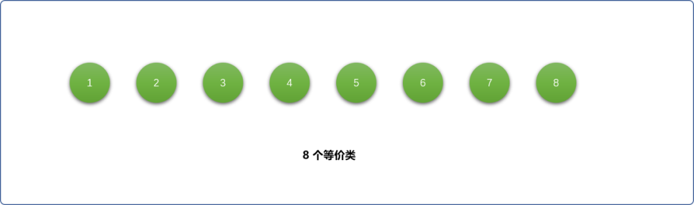

- 依次读入偶对关系，对具有偶对关系的等价类进行合并。在下图中，先读入`(1,3)`偶对关系，元素`1`和`3`当前分属于 `2` 个不同等价类，对这 `2` 个等价类进行合并。当一个等价类向另一个等价类合并时，其中一个等价类变为空。

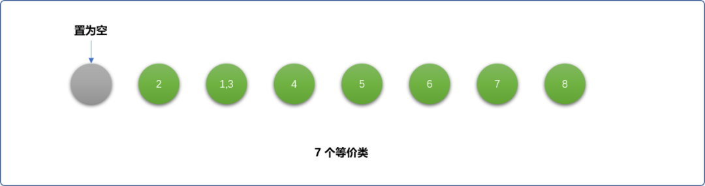

- 重复上述过程，根据读入的偶对关系，如果偶对关系中的 `2` 个元素分属于不同等价类则合并，如果属于同一个同价类，则保留现状。如下图，最终等价类为 `2` 个。

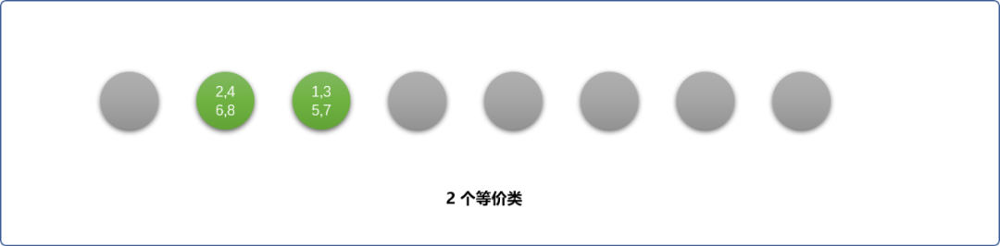

根据上述查找等价类可知：

- 等价类允许元素与元素之间存在直接或间接关系。
- 合并时，等价类会越变越少。

## 3. 等价类的实现

等价类可认为是一个集合，多个等价类就构成了一个集合群。为了区分集合群中不同的集合(等价类)，则需要为每一个等价类设置一个唯一的标志符号。

等价类可以使用数组、树、链表实现。无论使用哪一种方式，均需为等价类设置一个唯一的标志符号。

### 3.1 数组实现

使用数组解决上述案例中查找等价类的问题。

#### 3.1.1 初始化数组

初始时，创建一个一维数组，因初始时，对最终有多少个等价类是不知的。最初可假设一个数字归属于一个等价类，且等价类的标志符号为数字本身。如下图所示：

> **Tips：** 数字所在的等价类为数组中和数字相同的下标位置。

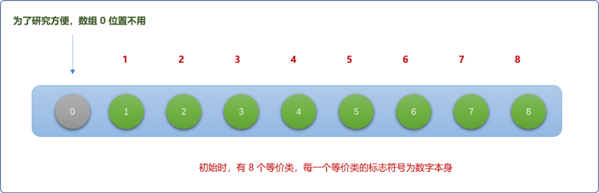

上述过程可用代码描述：

```cpp
#include <iostream>
using namespace std;
//存储等价类信息的数组
int nums[9]= {0};

/*
*  初始化函数
*/
void init() {
 for(int i=1; i<9; i++) {
  nums[i]=i;
 }
}
```

#### 3.1.2  合并等价类

合并等价类是基于查询偶对关系的结果。

如读入 `(1,3)` 偶对关系，需要查询元素 `1`和`3`分属于的等价类，如果同属一个等价类，不做任何操作。如分属不同等价类，则合并。如下图所示：

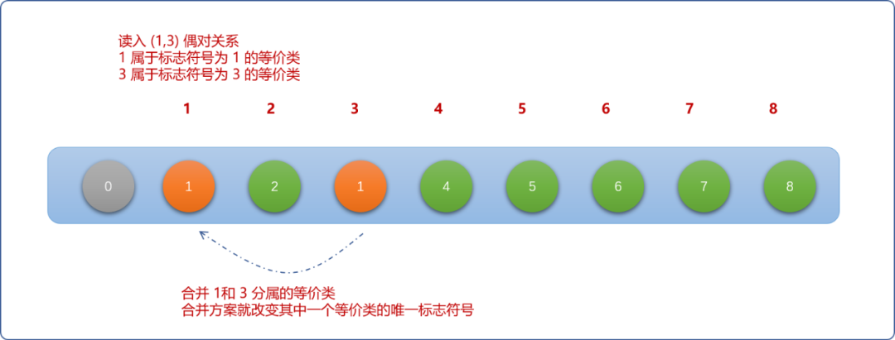

当 `2` 个集合合并时，可以双向合并，实际操作时，可任选一种。如此，会出现如下两种效果。

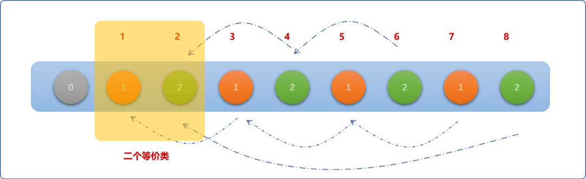

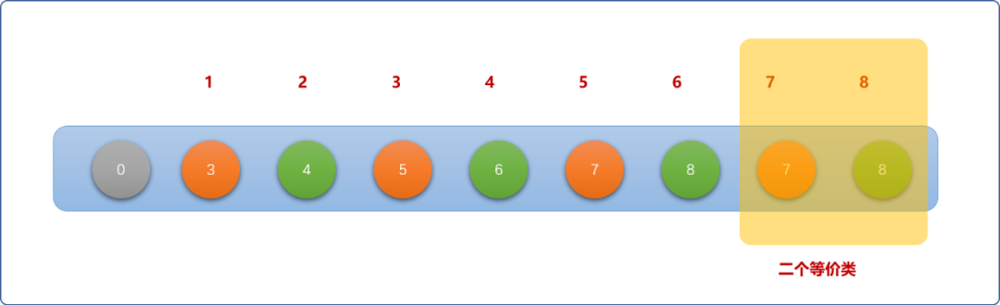

从上图中如何判断有多少个等价类？

查找下标和存储值相同的单元格有多少个，便可计算出等价类的数量。

上文描述中，包括 `2` 个子逻辑：

- 查询元素所在的等价类。
- 合并不同的等价类。

使用代码实现时，则需要 `2` 个函数用来实现这 `2` 个子逻辑。

```cpp
/*
*查找元素所属等价类的标志符号 
*/
int find(int data) {
 while(nums[data]!=data)
  data=nums[data];
 return data;
}
/*
*合并等价类
*/
void unionSet(int data,int data_) {
 //查找所属等价类
 int flag= find(data);
 int flag_=find(data_);
 if(flag!=flag_) {
  //合并
  //nums[flag_]=flag; 
  //或者
  nums[flag]=flag_;
 }
}
```

**测试代合并过程：**

```cpp
/*
*测试
*/
int main(int argc, char** argv) {

 init();
 int r[6][2] = {{1,3},{3,5},{3,7},{2,4},{4,6},{2,8}};

 for(int i=0; i<6; i++) {
  unionSet(r[i][0],r[i][1] );
 }
 cout<<"数字："<<endl; 
 for(int i=1; i<9; i++) {
  cout<<i<<"\t";
 }
 cout<<endl;
 cout<<"等价类"<<endl; 
 for(int i=1; i<9; i++) {
  cout<<nums[i]<<"\t";
 }

 return 0;
}
```

**输出结果：**

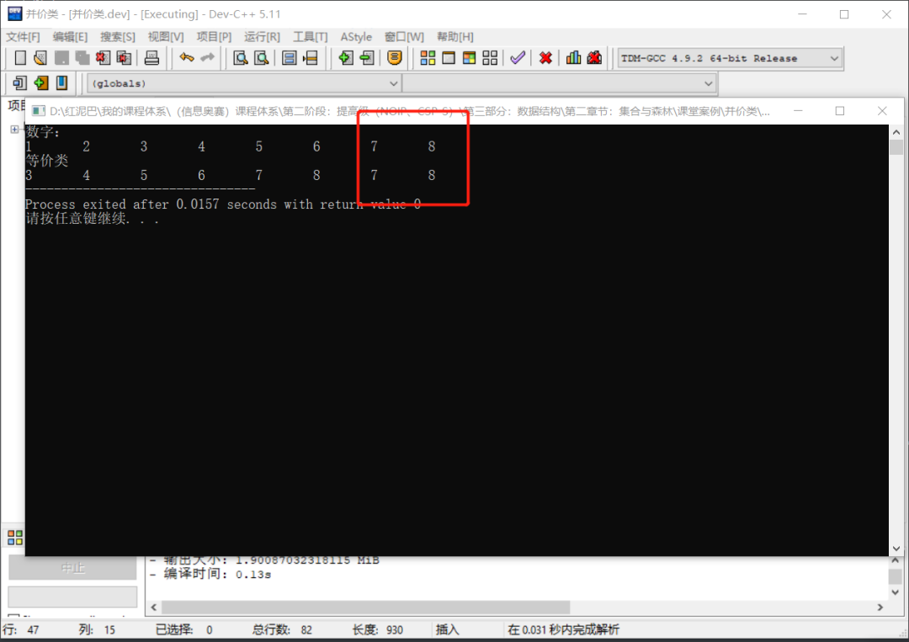

### 3.2 链表

链表和数组的高层逻辑没有什么区别，差异性在底层存储方式。

数组存储时，初始数组的一个格间为一个等价类。使用链表存储时，初始一个元素（数据）为一个链表。可用链表的头结点存储等价类的标志符号，初始为数字本身。

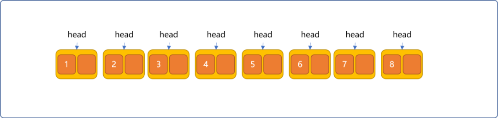

使用代码描述时，需要构建结点类型。

```cpp
#include <iostream>
using namespace std;
/*
*结点类型
*/
struct Node {
 //数据域
 int data;
 //指向后一个指针
 Node *next;
};
```

为了方便管理，使用一个一维数组存储所有链表的头结点地址。并对其初始化。

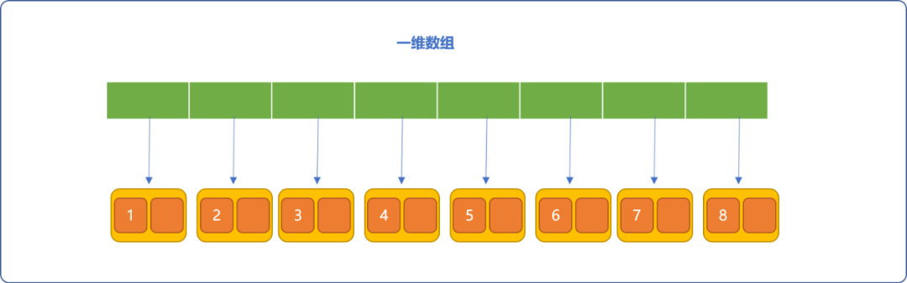

```cpp
//存储等价类信息的数组
Node* nums[9];
/*
*  初始化函数
*/
void init() {
 for(int i=1; i<9; i++) {
  nums[i]=new Node();
  nums[i]->data=i;
  nums[i]->next=NULL;
 }
}
```

因需要对不在同一个等价类的数据可以合并，所以，同样需要提供查找函数，查找给定的元素所在的等价类。

```cpp
/*
* 查找元素所属等价类的标志符号
* 因头结点存储标志符号
* 函数返回数据所在链表的头结点
*/
Node* find(int data) {
 for(int i=1; i<9; i++) {
  if(nums[i]==NULL)continue;
  Node* move=nums[i];
  while(move!=NULL && move->data!=data ) {
   move=move->next;
  }
  if(move==NULL)continue;
  else return nums[i];
 }
}
```

另需提供合并函数。如根据偶对关系`（1，3）`合并`1,3`元素所在链表的过程如下图所示。

- 元素 `3`所在链表以头部插入方式插入到元素 `1`所在的链表头结点后面。

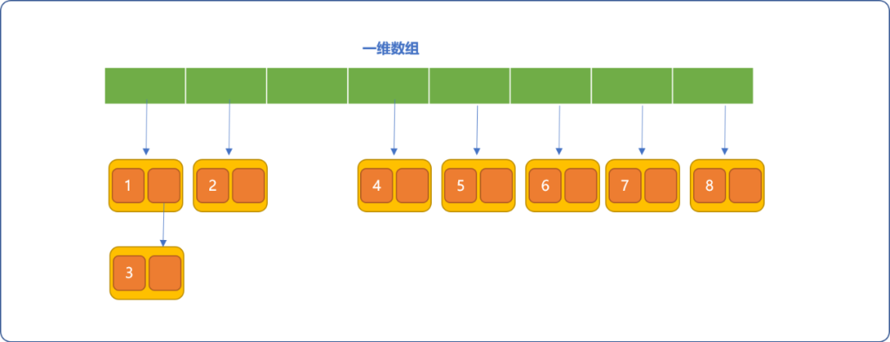

- 原来存储元素 `3`所在链表头结点的数组格间值设为 `NULL`。


合并函数如下：

```cpp
/*
*合并等价类
*/
void unionSet(int data,int data_) {
 Node * flag= find(data);
 Node * flag_= find(data_);
 if( flag->data!=flag_->data ) {
  //合并
  flag_->next=flag->next;
  nums[flag_->data]=NULL;
  flag->next=flag_;
 }
}
```

测试代码：

```cpp
/*
*测试
*/
int main(int argc, char** argv) {
 init();
 int r[6][2] = {{1,3},{3,5},{3,7},{2,4},{4,6},{2,8}};
 for(int i=0; i<6; i++) {
  unionSet(r[i][0] ,r[i][1]);
 }
 for(int i=1; i<9; i++) {
  if(nums[i]!=NULL) {
   Node * move=nums[i];
   cout<<"等价类："<<move->data<<endl; 
   while(move!=NULL){
    cout<<move->data<<"\t";
    move=move->next;
   } 
   cout<<endl;
  }
 }
 return 0;
}
```

**测试结果：**

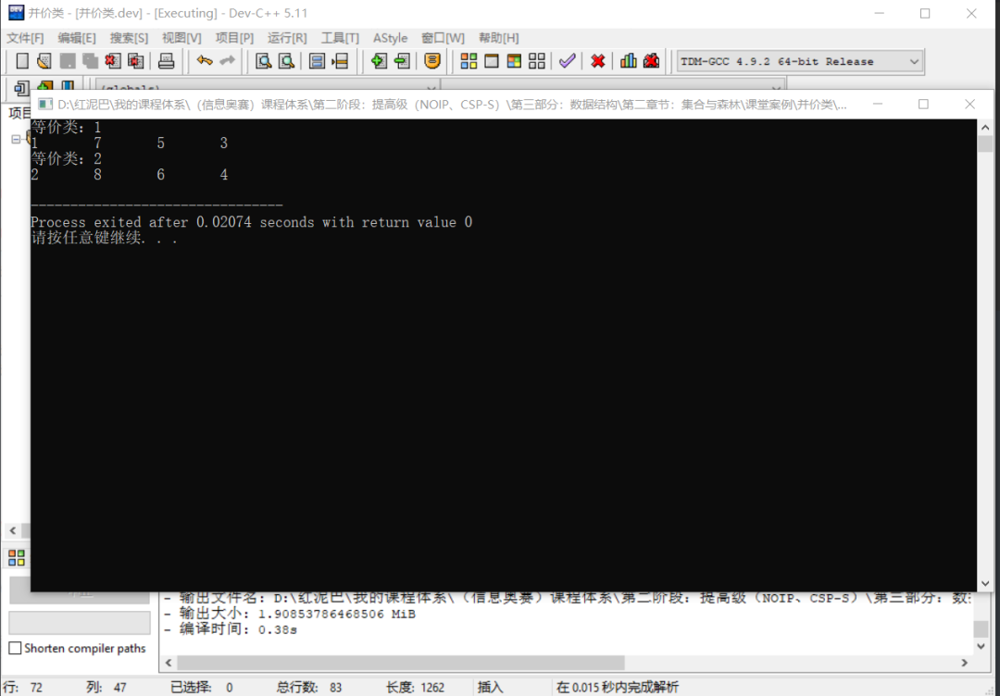

### 3.3 树

使用树和使用链表没太多本质区别，树本身是抽象数据结构。物理存储上可选择链表或数组。所以相比较前面的链表表存储存，变化仅在类型合并的逻辑上的差异性。

本文此处还是使用链表方式描述树的物理结构。

和链表有头结点概念，树有对应的根结点概念。初始创建对数字为根结点的多个树，且使用树的根结点存储等价类的唯一标志符号（即值为数字本身）。

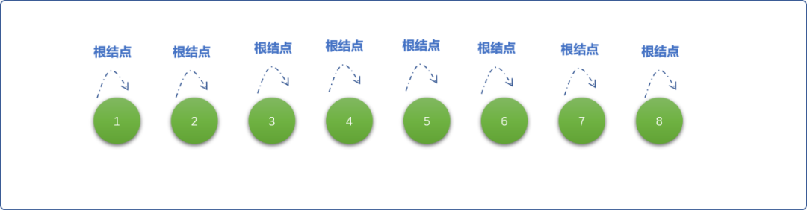

为了合并的方便，在设计树的结点时，除了设置数据域，还需要设置一个指向父指针的指针域。这点和设计链表的结点类型上有细微的差异性。目的是方便由子结点向父结点查询，查找到元素所在树的根结点。

```cpp
#include <iostream>
using namespace std;
//树结点类型
struct Node{
 //数据域
 int data;
 //指向父指针的指针域
 Node *parent; 
}; 
```

同样，可以使用一维数组存储所有树的根结点，并对其进行初始化。

```cpp
Node* trees[9];
//初始化
void init() {
 for(int i=1; i<9; i++) {
  trees[i]=new Node();
  trees[i]->data=i;
  //根结点的父指针指向自己
  trees[i]->parent=trees[i];
 }
}
```

提供查询函数。查询函数的逻辑，由给定的结点一路向上查询。返回根结点。

```cpp
/*
*查询
*/
Node* find(int data) {
 Node * move=trees[data];
 while(move->parent->data!=data ) {
  move=move->parent;
 }
 return move->parent;
}
```

合并函数：

```cpp
void unionSet(int data,int data_) {
 Node * flag= find(data);
 Node * flag_= find(data_);
 if( flag->data!=flag_->data ) {
  //合并
  flag_->parent=flag;
 }
}
```

测试代码：

```cpp
//测试
int main(int argc, char** argv) {
 init();
 int r[6][2] = {{1,3},{3,5},{3,7},{2,4},{4,6},{2,8}};
 for(int i=0; i<6; i++) {
  unionSet(r[i][0] ,r[i][1]);
 }

 for(int i=1; i<9; i++) {
  if( trees[i]->parent->data==i ) {
   cout<<"等价类"<<trees[i]->parent->data<<endl;
  }
 }

 return 0;
}
```

测试结果：

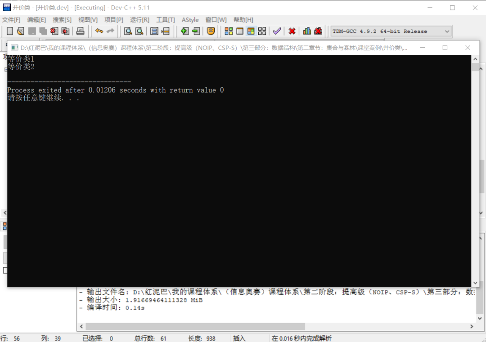

## 4. 总结

本文讲解了什么是等价类，以及等价类的特点。

等价类中的元素具有直接和间接关系，也意味着等价类中的元素关系具有传递性。

理解等价类的特性后，实现手段即使多样化，但也是万变不离其宗，其内在的逻辑本质是一样的。区别在于代码的表现手法上的差异。当然还有应用场景的区别。

纯数组方案适合于数据本身不复杂情况，树和链表方案适合于数据本身较复杂的情况，因链表是线性数据结构，适合于一对一的复杂数据场景，树适合于一对多的复杂数据应用场景。


