# C++ 树进阶系列之笛卡尔树的两面性

## 1. 前言

`笛卡尔树`是一种特殊的二叉树数据结构，融合了`二叉堆`和`二叉搜索树`两大特性。`笛卡尔树`可以把`数列(组)`对象映射成`二叉树`，便于使用`笛卡尔树`结构的逻辑求解数列的区间最值或区间排名等类似问题。

如有数列 `{5,7,1,9,12,16,2,18,3,11}`，任一存储单元格均有 `2` 个属性：

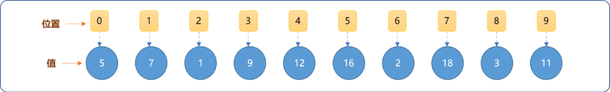

- 值：单元格中的数据。
- 位置：单元格在数列中的位置（下标、索引）。

构建`笛卡尔树`要求节点至少有 `2` 个权重，把数列映射成树结构时，可使用这`2` 个属性作为笛卡尔树节点的权重。把线性结构的数列映射成`笛卡尔树`后，此树需要满足如下 `2` 个特征：

- 如果观察`值`，则在树中具有堆的有序性，即任一父节点的值大于（最大堆）或小于（最小堆）子节点的值。根据堆的特性，可以查询`笛卡尔树`或`子树`上的最大值或最小值。且可以使用`堆排序`算法排序数列。
- 如果观察`位置`，则在树中遵循`搜索树`的逻辑结构，或者说，对笛卡尔树进行中序遍历，可以得到原来的数组。

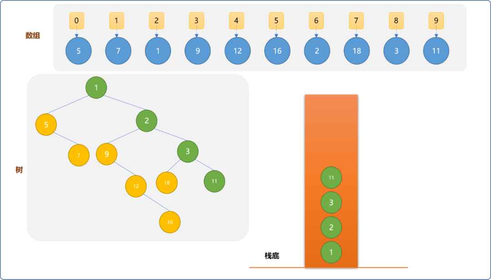

## 2. 构建笛卡尔树

可以说`笛卡尔树`是双权重的节点树。那么，如何构建才能保证数列最终能映射成笛卡尔树。

实现过程中，需要借助`单调栈`数据结构。

**什么是单调栈？**

本质指的就是栈，但在存储数据时，需要要保持栈中数据按递增或递减顺序，本文构建最小堆，要求栈单调递减。

### 2.1 构建流程

现把数组 `{5,7,1,9,12,16,2,18,3,11}`构建成笛卡尔树的过程详细讲解一下：

- 首先，准备一个栈。把数组中位置为 `0`、值为`5` 的元素（后面统一以`(0,5)`格式描述）。将其压入栈中，且设置成树的根节点。

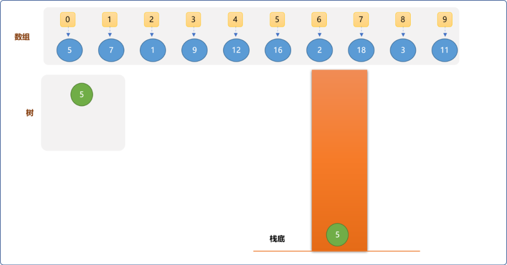

- 把数组中的`(1,7)`和栈中上已有元素`(0,5)` 比较，因值比 `5` 大。因能保持栈的递减顺序，可以直接入栈。且把入栈的元素作为`(0,5)`的右子节点。

  > **Tips：** 至此，总结一下：能压入栈的元素作为栈中比它小的元素的右子节点。

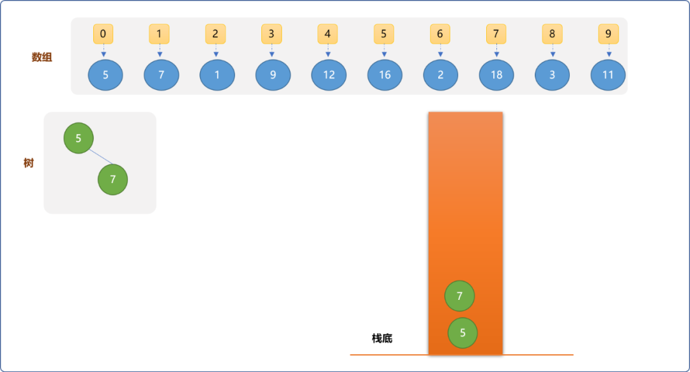

- 从数组中取出`(2,1)`，因比栈顶元素`(1,7)`小 ，不能直接入栈，则需要把比它大的元素从栈中移走，然后把最后一个比它大的元素作为它的左子结点。如下图所示：

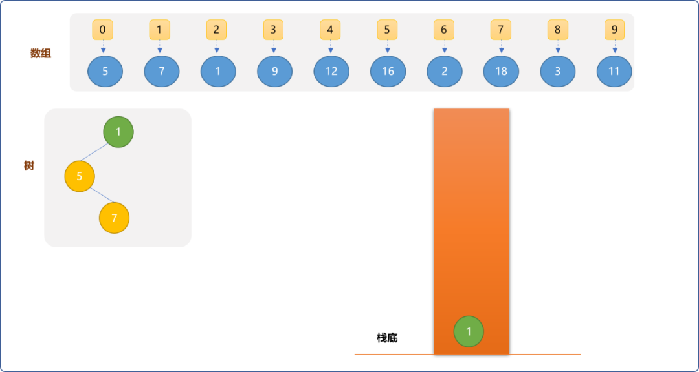

- 从数组中取出`(3,9)、(4,12)、(5,16)`，因都比先入栈的元素大，可以直接依次入栈，且成为比它小的节点的右子节点。

  > **Tips：** 可以观察到，栈中的元素均为`右链(图中绿色颜色所标记的节点)`上的节点。

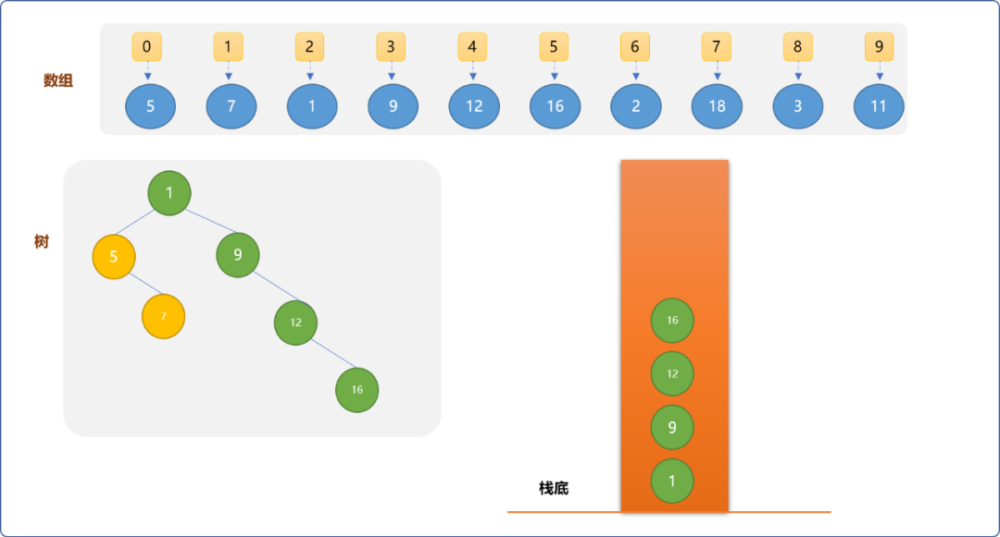

- 从数组中抽出`(6,2)`元素，为了维持栈的递减顺序，则需要把比它大的元素从栈中移走，直到留下`(2,1)`。把`(6,2)`作为`(2,1)`的右子节点，且让最后一个出栈的`(3,9)`成为`(6,2)`的左子节点。

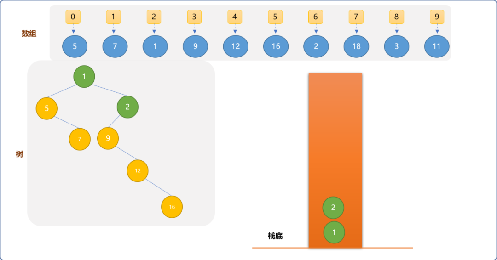

- 继续拿出`(7,18)`，可以直接入栈，让其成为`(6,2)`的右子节点。

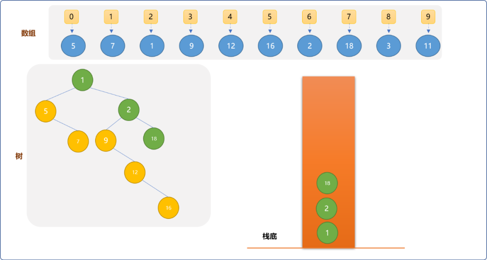

- 拿出`(8,3)`。把比它大的元素出栈，成为最近比它小的元素的右子结点，最后出栈的元素成为它的左子节点。

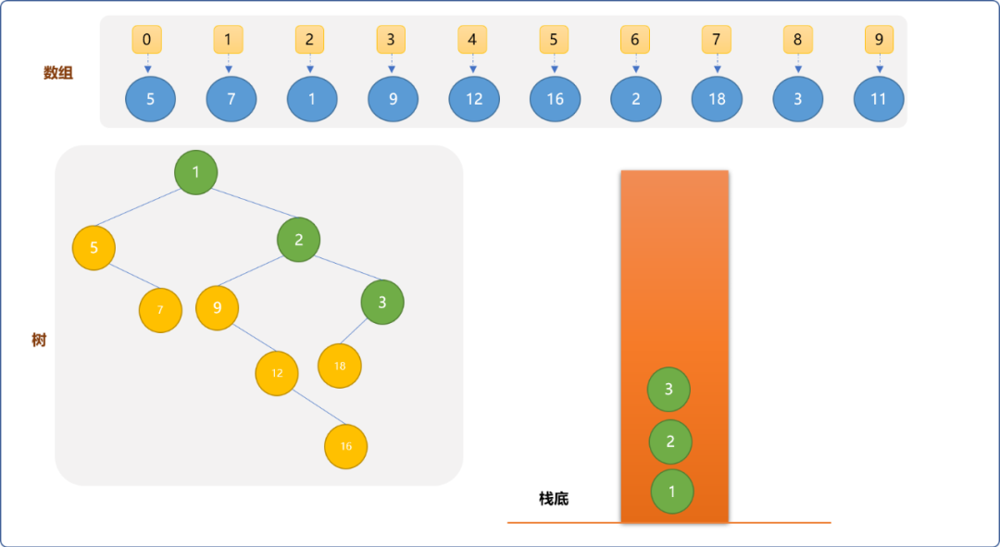

- 从数组中最后拿出`(9,11)`元素。因比栈中所有元素大，直接入栈，且成为栈顶元素的右子节点。


### 2.2 小结

使用单调栈构建笛卡尔树的原则：

- 如果需要移走其它元素后，元素才能入栈，则移走的最后一个节点成为其左子节点。
- 当数据入栈时，需要在栈中找到比它小的第一个元素，让会成为此元素的右节点。
- 栈中始终存储的最新`右链`上的节点。
- 构建完毕后，最后栈底的元素为根节点。

## 3. 笛卡尔树的物理结构

二叉树的物理实现有`矩阵`和`链式` 两种方案，本文将使用这 `2` 种方案：

### 3.1 矩阵实现

**笛卡尔树类结构：**

类中主要`API`为构建函数和中序遍历，其它的为辅助性函数。代码中有详细注解。

```cpp
#include <iostream>
#include <stack>
using namespace std;
/*
*笛卡尔树类
*/
class DkeTree {
 private:
  //原数列
  int nums[10]= {5,7,1,9,12,16,2,18,3,11};
  //矩阵,描述树节点之间的关系。列号 0 表示行编号对应节点的左节点，列号 1 表示右节点
  int matrix[10][2];
  //存储元素的下标
  stack<int> myStack;
 public:
         /*
         *构造函数
         */
  DkeTree() {
             //初始化关系为 -1
   for(int i=0; i<10; i++)
    for(int j=0; j<2; j++)
     this->matrix[i][j]=-1;
  }
  /*
  * 数据入栈前的检查栈中是否有比自己大的元素
  * 参数 idx：元素在数组中位置
  * 返回最后一个比此数据大的元素编号
  */
  int check(int idx);
  /*
  * 构建笛卡尔树
  */
  void buildDiKeErTree();
         /*
         *中序遍历
         */
        void inOrder(int node) ;
         /*
  *返回根节点 ：栈中最后不为 -1 的元素的编号
  */
  int getRoot() {
   int pos=-1;
   int root=pos;
   while(!myStack.empty() && (pos= myStack.top()) !=-1 ) {
    myStack.pop();
    root=pos;
   }
   return root;
  }
        /*
        *显示矩阵中节点之间的关系
        */
  void showTree() {
   cout<<"父节点"<<" 左子节点 "<<" 右子节点"<<endl;
   for(int i=0; i<10; i++ ) {
    cout<<"("<<i<<","<<nums[i]<<")->";
    for(int j=0; j<2; j++) {
     if(matrix[i][j]!=-1 )
      cout<<"("<<matrix[i][j]<<","<< nums[ matrix[i][j] ]  <<")\t";
     else
      cout<<"("<<matrix[i][j]<<","<< -1 <<")\t";
    }
    cout<<endl;
   }
  }
};
```

**实现 `buildDiKeErTree` 函数：**

`buildDiKeErTree` 函数是核心`API`，用来构建笛卡尔树。

实现此`API`之前，需先实现辅助`API check`，用来实现把数组中的数据压入栈中时，查询到比之大的最后一个数据。本质是使用了单调栈的逻辑特性。

```cpp
int DkeTree::check(int idx) {
    int pos=-1;
    //最后一个比之大的下标
    int prePos=pos;
    while( !DkeTree::myStack.empty() && (pos=DkeTree::myStack.top())!=-1 ) {
        if( DkeTree::nums[pos]<DkeTree::nums[idx] ) break;
        DkeTree::myStack.pop();
        prePos=pos;
    }
    return prePos;
}
```

`buildDiKeErTree` 函数：

```cpp
void DkeTree::buildDiKeErTree() {
    //初始栈,压入一个较小的值，方便比较
    DkeTree::myStack.push( -1 );
    int size=sizeof(DkeTree::nums)/4;
    //遍历数组
    for( int i=0; i<size; i++ ) {
        int topIdx=DkeTree::myStack.top();
        //设置为栈顶元素的右子节点
        if(DkeTree::nums[topIdx]<DkeTree::nums[i] && topIdx!=-1) DkeTree::matrix[topIdx][1]=i;
        //从栈中移走比当前元素大的元素
        int leftIdx=DkeTree::check(i);
        if(leftIdx!=-1) {
            //置为左节点
            DkeTree::matrix[i][0]=leftIdx;
            if(DkeTree::myStack.top()!=-1)
                DkeTree::matrix[DkeTree::myStack.top()][1]=i;
        }
        //栈中存储的是数据在数组中的索引号
        DkeTree::myStack.push(i);
    }
}
```

**测试：**

```cpp
//测试
int main(int argc, char** argv) {
 DkeTree*  dkeTree=new DkeTree();
 dkeTree->buildDiKeErTree();
 dkeTree->showTree();
 return 0;
}
```

**输出结果：**`-1`表示不存在左或右子节点。

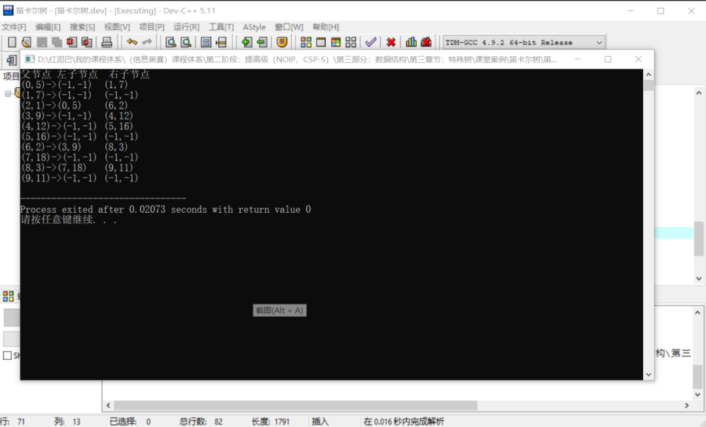

因中序遍历`笛卡尔树`可以输出原数组，可用于验证笛卡尔树的构建是否正确。在`DkeTree`类中可添加中序遍历函数的实现。

```cpp
void DkeTree::inOrder(int node) {
    if( node!=-1 ) {
        //遍历左树
        inOrder(DkeTree::matrix[node][0] );
        cout<<DkeTree::nums[node]<<"\t";
        inOrder(DkeTree::matrix[node][1] );
    }
}
```

**测试中序遍历：**

```cpp
int main(int argc, char** argv) {
 DkeTree*  dkeTree=new DkeTree();
 dkeTree->buildDiKeErTree();
 int root=dkeTree->getRoot();
 dkeTree->inOrder(root);
 return 0;
}
```

**输出结果：**

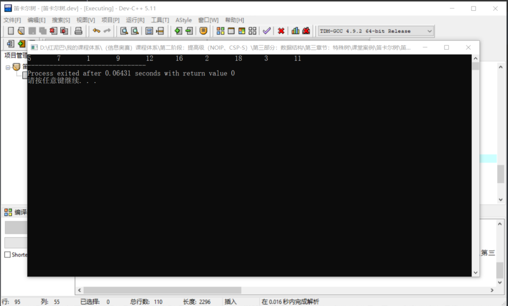

### 3.2 链式实现

链式实现逻辑与矩阵实现本质没有什么不一样。不做过多解释，直接上完整代码。

```cpp
#include <iostream>
#include <stack>
#include <vector>
using namespace std;
/*
*节点类型
*/
struct TreeNode {
 //编号
 int idx;
 //值
 int val;
 //左子节点
 TreeNode* leftChild;
 //右子节点
 TreeNode* rightChild;
 TreeNode() {
  this->leftChild=NULL;
  this->rightChild=NULL;
 }
 TreeNode(int idx,int val) {
  this->idx=idx;
  this->val=val;
  this->leftChild=NULL;
  this->rightChild=NULL;
 }
 void show() {
  cout<<"("<<this->idx<<","<<this->val<<")";
 }
};
/*
*笛卡尔树类
*/
class DkeTree {
 private:
  //根节点
  TreeNode* root;
  //原数列
  int nums[10]= {5,7,1,9,12,16,2,18,3,11};
  //存储元素的下标
  stack<int> myStack;
  //存储树上的所有节点
  vector< TreeNode*> allNodes;
 public:
  /*
  *构造函数
  */
  DkeTree() {}
  /*
  *  栈中查找
  */
  int check(int idx) {
   int pos=-1;
   int prePos=pos;
   while( !myStack.empty() && (pos=myStack.top())!=-1 ) {
    if( nums[pos]<nums[idx] ) break;
    myStack.pop();
    prePos=pos;
   }
   return prePos;
  }
  /*
  * 检查树上是否存在给定的节点
  * 有：返回
  * 没有：创建
  */
  TreeNode* findNode(int idx ) {
   for(int i=0; i<this->allNodes.size(); i++ ) 
    if( this->allNodes[i]->idx==idx )return this->allNodes[i];
   TreeNode* tmp=new TreeNode(idx,nums[idx]);
   this->allNodes.push_back(tmp);
   return tmp;
  }
        /*
        *构建笛卡尔树 
        */
  void buildDiKeErTree() {
   //初始栈,压入一个较小的值，方便比较
   myStack.push( -1 );
   int size=sizeof(this->nums)/4;
   TreeNode* node=NULL;
   TreeNode* node_=NULL;
   //遍历数组
   for( int i=0; i<size; i++ ) {
    int topIdx=myStack.top();
    //设置为栈顶元素的右子节点
    if(nums[topIdx]<nums[i] && topIdx!=-1 ) {
     node=this->findNode(topIdx);
     node_=this->findNode(i);
     node->rightChild=node_;
    }
    //从栈中移走比当前元素大的元素
    int leftIdx=check(i);
    if(leftIdx!=-1) {
     //置为左节点
     node_=this->findNode(leftIdx);
     node=this->findNode(i);
     node->leftChild=node_;
     if(myStack.top()!=-1) {
      node_=this->findNode(myStack.top());
      node=this->findNode(i);
      node_->rightChild=node;
     }
    }
    myStack.push(i);
   }
  }
  /*
  *返回根节点 ：栈中最后不为 -1 的元素的编号
  */
  TreeNode* getRoot() {
   int pos=-1;
   int root=pos;
   while(!myStack.empty() && (pos= myStack.top()) !=-1 ) {
    myStack.pop();
    root=pos;
   }
   return this->findNode(root);
  }
  /*
  *中序遍历
  */
  void inOrder(TreeNode* node) {
   if( node!=NULL ) {
    //遍历左树
    inOrder(node->leftChild );
    cout<<node->val<<"\t";
    inOrder(node->rightChild );
   }
  }
  void showTree() {
   for(int i=0; i<this->allNodes.size(); i++ ) {
    this->allNodes[i]->show();
    cout<<"->";
    if(this->allNodes[i]->leftChild!=NULL)this->allNodes[i]->leftChild->show();
    if(this->allNodes[i]->rightChild!=NULL)this->allNodes[i]->rightChild->show();
    cout<<endl;
   }
  }
};
/*
*测试 
*/ 
int main(int argc, char** argv) {
 DkeTree* dke=new DkeTree();
 dke->buildDiKeErTree();
 cout<<"显示所有节点"<<endl;
 dke->showTree();
 TreeNode* root= dke->getRoot();
 cout<<"中序遍历"<<endl;
 dke->inOrder(root);
 return 0;
}
```

## 4. 总结

本文讲解了笛卡尔树，对其特性作了较全面的分析，并且讲解了矩阵和链式两种实现方案。


